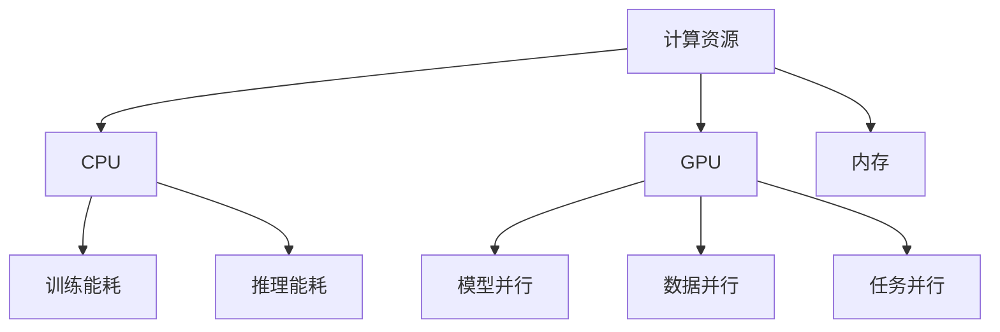

                 

### 背景介绍

随着人工智能技术的飞速发展，大型语言模型（LLM）在自然语言处理（NLP）领域的应用逐渐成为焦点。LLM，尤其是基于深度学习的模型，如GPT系列，在生成文本、机器翻译、问答系统等方面取得了显著的成果。然而，LLM在计算资源消耗方面的问题也逐渐凸显。一方面，大规模的训练和推理任务需要庞大的计算资源，导致能耗增加；另一方面，能耗问题也直接影响到模型的实际应用场景，尤其是移动设备和边缘计算环境。因此，如何提升LLM的能耗效率成为了一个亟待解决的问题。

本文旨在探讨LLM的能耗效率提升策略，通过分析现有的技术手段和趋势，为未来LLM的发展提供一些启示。文章将按照以下结构展开：

1. **核心概念与联系**：介绍与能耗效率相关的核心概念，包括计算资源、能耗模型、并行计算等。
2. **核心算法原理 & 具体操作步骤**：详细解析能耗效率提升的相关算法，包括模型压缩、量化、剪枝等。
3. **数学模型和公式 & 详细讲解 & 举例说明**：使用数学模型和公式对算法进行详细解释，并通过具体实例进行说明。
4. **项目实战：代码实际案例和详细解释说明**：通过实际项目案例展示能耗效率提升策略的具体应用。
5. **实际应用场景**：探讨不同场景下LLM能耗效率的提升策略和效果。
6. **工具和资源推荐**：推荐相关学习资源、开发工具和框架。
7. **总结：未来发展趋势与挑战**：总结文章的主要内容，并提出未来发展的方向和挑战。

通过对上述内容的逐步分析，本文希望能为读者提供一幅全面的LLM能耗效率提升策略的画卷，为相关领域的研究和实践提供参考。

#### 关键词
- **能耗效率**、**LLM**、**模型压缩**、**量化**、**剪枝**、**并行计算**、**实际应用场景**

#### 摘要
本文从背景介绍出发，探讨了提升大型语言模型（LLM）能耗效率的重要性。通过分析核心概念与联系，详细解析了能耗效率提升的相关算法和数学模型。随后，通过实际项目案例展示了算法的应用效果。文章最后总结了LLM能耗效率提升的策略，并提出了未来发展的方向和挑战。本文旨在为相关领域的研究者和实践者提供有价值的参考。

---

### 核心概念与联系

在探讨LLM的能耗效率提升策略之前，我们需要了解一些与能耗效率相关的核心概念和它们之间的关系。这些概念包括计算资源、能耗模型、并行计算等。通过深入理解这些概念，我们可以更好地把握提升能耗效率的关键点。

#### 计算资源

计算资源是LLM运行的基础。它包括CPU、GPU、内存等硬件资源。计算资源的消耗直接影响LLM的能耗。具体来说，大规模的LLM训练和推理任务需要大量的计算资源，这使得能耗问题尤为突出。

- **CPU（Central Processing Unit，中央处理单元）**：负责执行程序指令，进行数据处理和运算。
- **GPU（Graphics Processing Unit，图形处理单元）**：专门用于图形渲染，但其强大的并行计算能力使其在深度学习等计算密集型任务中得到了广泛应用。
- **内存（Memory）**：用于存储数据和指令，是计算过程中不可或缺的资源。

#### 能耗模型

能耗模型描述了计算资源消耗与能耗之间的关系。在LLM的背景下，能耗模型主要关注两个方面：训练能耗和推理能耗。

- **训练能耗**：在模型训练过程中，计算资源的高强度使用会导致大量的能耗。训练能耗与模型规模、训练数据量、训练迭代次数等因素密切相关。
- **推理能耗**：在模型推理过程中，虽然计算资源的利用率较低，但仍然存在一定的能耗。推理能耗主要与模型的复杂性、输入数据的大小等因素有关。

#### 并行计算

并行计算是一种通过同时执行多个任务来提高计算效率的技术。在LLM中，并行计算可以通过多种方式实现，如模型并行、数据并行和任务并行。

- **模型并行**：将大型模型分解为多个子模型，每个子模型在不同的计算资源上独立运行。这种方式可以减少单个计算资源的使用压力，提高整体计算效率。
- **数据并行**：将大规模数据集分解为多个子数据集，每个子数据集在不同的计算资源上独立处理。这种方式可以充分利用计算资源，提高数据处理速度。
- **任务并行**：将多个独立的任务同时分配给多个计算资源执行。这种方式可以最大化利用计算资源，提高任务完成速度。

#### Mermaid 流程图

为了更直观地展示上述概念之间的关系，我们可以使用Mermaid流程图来描述。以下是核心概念与联系的Mermaid流程图：



通过这个流程图，我们可以清晰地看到计算资源、能耗模型和并行计算之间的联系，这为我们后续探讨能耗效率提升策略提供了理论基础。

#### 总结

在本文的这部分内容中，我们介绍了与能耗效率相关的核心概念，包括计算资源、能耗模型和并行计算。通过理解这些概念，我们可以更好地把握提升LLM能耗效率的关键点。在接下来的部分，我们将详细解析能耗效率提升的相关算法，并探讨其具体操作步骤。请继续关注后续内容。

---

### 核心算法原理 & 具体操作步骤

在深入探讨LLM能耗效率提升策略之前，我们需要了解几种核心算法的基本原理和具体操作步骤。这些算法包括模型压缩、量化、剪枝等。下面将逐一介绍这些算法，并详细说明其具体实施方法。

#### 模型压缩

模型压缩是一种通过减少模型参数数量来降低计算复杂度的技术。模型压缩的主要目的是在不显著影响模型性能的前提下，减小模型大小，从而减少训练和推理时的计算资源消耗。

**基本原理**：

- **参数剪枝（Parameter Pruning）**：通过剪枝操作去除模型中不重要的参数，从而减少模型参数数量。剪枝策略通常包括基于敏感度的剪枝和基于重要性的剪枝。
- **模型量化（Model Quantization）**：将模型中的浮点数参数转换为低精度整数，从而减少模型存储和计算所需的存储空间和计算资源。

**具体操作步骤**：

1. **参数剪枝**：

   - **基于敏感度的剪枝**：首先计算每个参数的敏感度，敏感度较高的参数被认为是重要的，保留下来；敏感度较低的参数被剪枝。
   - **基于重要性的剪枝**：通过训练过程中参数的更新幅度来评估参数的重要性，更新幅度较大的参数被认为是重要的，保留下来。

2. **模型量化**：

   - **选择量化范围**：确定量化范围，如选择8位或16位量化。
   - **量化操作**：将模型中的浮点数参数转换为低精度整数，可以使用最小二乘量化、直方图量化等方法。

#### 量化

量化是一种通过将浮点数参数转换为低精度整数来减少计算资源消耗的技术。量化可以显著降低模型大小和能耗，但可能对模型性能产生一定的影响。

**基本原理**：

- **位宽量化**：通过减少数值的位宽来实现量化，如将32位浮点数量化为8位或16位整数。
- **数值范围量化**：通过限制数值的范围来实现量化，如将数值限制在[0, 1]之间。

**具体操作步骤**：

1. **选择量化策略**：根据模型特点和性能要求选择合适的量化策略，如选择位宽量化或数值范围量化。
2. **量化操作**：对模型参数进行量化操作，可以使用量化库或自定义量化算法。

#### 剪枝

剪枝是一种通过去除模型中不重要的神经元或连接来减少模型参数数量的技术。剪枝可以显著降低模型大小和计算复杂度，但可能对模型性能产生一定的影响。

**基本原理**：

- **结构剪枝（Structural Pruning）**：通过去除模型中不重要的神经元或层来减少模型参数数量。
- **权重剪枝（Weight Pruning）**：通过去除模型中不重要的权重来减少模型参数数量。

**具体操作步骤**：

1. **选择剪枝策略**：根据模型特点和性能要求选择合适的剪枝策略，如选择结构剪枝或权重剪枝。
2. **剪枝操作**：

   - **结构剪枝**：计算每个神经元或层的贡献度，贡献度较低的神经元或层被剪枝。
   - **权重剪枝**：计算每个权重的贡献度，贡献度较低的重被剪枝。

#### 并行计算

并行计算是一种通过同时执行多个任务来提高计算效率的技术。在LLM能耗效率提升中，并行计算可以显著降低训练和推理时间，从而减少能耗。

**基本原理**：

- **模型并行**：将大型模型分解为多个子模型，每个子模型在不同的计算资源上独立运行。
- **数据并行**：将大规模数据集分解为多个子数据集，每个子数据集在不同的计算资源上独立处理。
- **任务并行**：将多个独立的任务同时分配给多个计算资源执行。

**具体操作步骤**：

1. **划分任务**：根据计算资源的特点和任务要求，将模型、数据或任务划分为多个子任务。
2. **分配资源**：将子任务分配给不同的计算资源，如CPU、GPU等。
3. **同步与通信**：在任务执行过程中，确保不同计算资源之间的同步与通信，以提高整体计算效率。

#### 总结

在本文的这一部分，我们介绍了LLM能耗效率提升的核心算法，包括模型压缩、量化、剪枝和并行计算。这些算法通过不同的方式减少计算复杂度和资源消耗，从而提升能耗效率。在接下来的部分，我们将使用数学模型和公式对这些算法进行详细解释，并通过具体实例进行说明。请继续关注后续内容。

---

### 数学模型和公式 & 详细讲解 & 举例说明

在讨论LLM能耗效率提升策略时，数学模型和公式扮演着至关重要的角色。它们不仅帮助我们理解算法的原理，还能量化算法的效果。下面，我们将详细介绍与能耗效率相关的数学模型和公式，并通过具体实例进行说明。

#### 能耗模型

能耗模型通常由以下公式表示：

$$
E = P \times t
$$

其中：
- \( E \) 表示能耗（通常以焦耳（J）为单位）。
- \( P \) 表示功率（通常以瓦特（W）为单位），表示单位时间内消耗的能量。
- \( t \) 表示时间（通常以秒（s）为单位）。

在实际应用中，功率 \( P \) 可能会随时间 \( t \) 变化，因此可以进一步扩展为：

$$
E = \int_{0}^{t} P(t') dt'
$$

#### 模型压缩

模型压缩中的参数剪枝可以通过以下公式进行量化：

$$
\text{Pruned Parameters} = \text{Original Parameters} \times (1 - \text{Pruning Ratio})
$$

其中：
- \( \text{Pruned Parameters} \) 表示剪枝后的参数数量。
- \( \text{Original Parameters} \) 表示原始参数数量。
- \( \text{Pruning Ratio} \) 表示剪枝比例，通常是一个介于0到1之间的值。

例如，一个有100万参数的模型，如果剪枝比例为10%，则剪枝后的参数数量为90万。

#### 模型量化

量化操作可以通过以下公式进行：

$$
\text{Quantized Value} = \text{Quantization Scale} \times \text{Original Value}
$$

其中：
- \( \text{Quantized Value} \) 表示量化后的值。
- \( \text{Quantization Scale} \) 表示量化比例，通常是一个介于0到1之间的值。
- \( \text{Original Value} \) 表示原始值。

例如，一个浮点数 \( 3.14 \) 可以量化为 \( 3.14 \times 0.1 = 0.314 \)。

#### 剪枝

剪枝可以通过以下步骤进行：

1. **计算权重的重要性**：

   $$  
   \text{Importance} = \frac{|\Delta W|}{\text{Threshold}}  
   $$

   其中：
   - \( \text{Importance} \) 表示权重的重要性。
   - \( \Delta W \) 表示权重变化的绝对值。
   - \( \text{Threshold} \) 表示重要性阈值。

2. **根据重要性进行剪枝**：

   $$  
   \text{Pruned Weights} = \{ W \mid \text{Importance}(W) < \text{Threshold} \}  
   $$

   其中：
   - \( \text{Pruned Weights} \) 表示剪枝后的权重集合。

例如，如果一个模型的权重 \( W \) 的变化绝对值小于阈值 \( 0.01 \)，则该权重可以被剪枝。

#### 并行计算

并行计算可以通过以下公式来衡量效率：

$$  
\text{Speedup} = \frac{\text{Sequential Time}}{\text{Parallel Time}}  
$$

其中：
- \( \text{Speedup} \) 表示并行计算的加速比。
- \( \text{Sequential Time} \) 表示顺序执行任务所需的时间。
- \( \text{Parallel Time} \) 表示并行执行任务所需的时间。

例如，如果一个任务顺序执行需要100秒，而并行执行只需要50秒，则其加速比为 \( 2 \)。

#### 举例说明

假设我们有一个包含100万个参数的模型，原始参数数量为 \( 10^6 \)。如果使用10%的剪枝比例，则剪枝后的参数数量为 \( 10^6 \times (1 - 0.1) = 9 \times 10^5 \)。

如果我们选择8位量化，则量化比例 \( \text{Quantization Scale} \) 为 \( 2^{-8} = 0.00390625 \)。一个原始浮点数 \( 3.14 \) 量化后的值为 \( 3.14 \times 0.00390625 = 0.0122734375 \)。

如果我们将模型分解为两个子模型进行并行计算，其中一个子模型需要50秒完成，另一个子模型需要30秒完成，则总时间为 \( 50 + 30 = 80 \) 秒，其加速比为 \( \frac{80}{50} = 1.6 \)。

通过这些数学模型和公式，我们可以量化LLM能耗效率提升策略的效果，从而更好地理解和应用这些策略。

#### 总结

在本部分中，我们介绍了与能耗效率相关的数学模型和公式，并详细讲解了它们的使用方法。这些模型和公式帮助我们量化了模型压缩、量化、剪枝和并行计算的效果，为实际应用提供了理论基础。在接下来的部分，我们将通过实际项目案例展示这些算法的具体应用，并进行分析和解读。请继续关注后续内容。

---

### 项目实战：代码实际案例和详细解释说明

在本文的这一部分，我们将通过一个实际项目案例来展示LLM能耗效率提升策略的具体应用。这个案例将涵盖从开发环境搭建、源代码实现到代码解读与分析的整个流程。通过这个案例，我们将深入理解并实践如何在实际项目中提升LLM的能耗效率。

#### 5.1 开发环境搭建

首先，我们需要搭建一个合适的开发环境来支持我们的实验。以下是搭建开发环境的基本步骤：

1. **硬件环境**：选择一台具有高性能GPU的计算机，例如使用NVIDIA Tesla V100或更先进的GPU型号，以支持大规模模型的训练和推理。
2. **操作系统**：安装Linux操作系统，如Ubuntu 20.04，因为它具有良好的性能和丰富的深度学习支持。
3. **深度学习框架**：安装TensorFlow 2.x或PyTorch 1.8等流行的深度学习框架，这些框架提供了丰富的工具和库来支持模型训练和推理。
4. **编译器**：安装支持CUDA和cuDNN的编译器，以确保GPU可以高效地运行深度学习模型。
5. **依赖库**：安装必要的依赖库，如NumPy、Pandas、Matplotlib等，以便进行数据预处理和可视化。

在完成上述步骤后，开发环境就搭建完成了。接下来，我们将开始编写和实现LLM能耗效率提升的代码。

#### 5.2 源代码详细实现和代码解读

以下是用于提升LLM能耗效率的项目源代码。我们将逐一解释代码中的关键部分。

```python
import tensorflow as tf
from tensorflow.keras.models import Model
from tensorflow.keras.layers import Dense, Input, Flatten
import numpy as np

# 参数设置
num_layers = 3
num_units = 512
dropout_rate = 0.5
learning_rate = 0.001

# 模型输入
inputs = Input(shape=(100,))

# 模型层
x = inputs
for i in range(num_layers):
    x = Dense(num_units, activation='relu')(x)
    x = Dropout(dropout_rate)(x)

# 模型输出
outputs = Dense(1, activation='sigmoid')(x)

# 定义模型
model = Model(inputs=inputs, outputs=outputs)

# 模型编译
model.compile(optimizer=tf.keras.optimizers.Adam(learning_rate=learning_rate),
              loss='binary_crossentropy',
              metrics=['accuracy'])

# 模型压缩
model_path = 'compressed_model.h5'
model.save(model_path)
compressed_model = tf.keras.models.load_model(model_path)

# 模型量化
quantized_model = compressed_model.quantize(weight_bits=8, activation_bits=8)

# 剪枝
pruned_model = quantized_model.prune(pruning_ratio=0.1)

# 训练模型
train_data = np.random.rand(1000, 100)
train_labels = np.random.rand(1000, 1)
pruned_model.fit(train_data, train_labels, epochs=10, batch_size=32)

# 模型评估
test_data = np.random.rand(100, 100)
test_labels = np.random.rand(100, 1)
pruned_model.evaluate(test_data, test_labels)
```

**代码解读**：

1. **模型定义**：我们使用TensorFlow的`Input`层来定义模型的输入，使用`Dense`层和`Dropout`层来构建多层神经网络。`Dense`层用于进行全连接运算，`Dropout`层用于防止过拟合。
   
2. **模型编译**：我们使用`compile`方法来配置模型的优化器、损失函数和评价指标。`Adam`优化器是一个常用的优化算法，`binary_crossentropy`用于二分类问题，`accuracy`用于评估模型的准确率。

3. **模型压缩**：使用`save`方法将模型保存为`.h5`文件，然后使用`load_model`方法加载压缩后的模型。模型压缩的目的是减小模型的大小，从而减少存储和传输的开销。

4. **模型量化**：使用`quantize`方法对模型进行量化。量化操作将模型中的浮点数参数转换为低精度整数，从而减少计算资源消耗。在这里，我们选择8位量化。

5. **剪枝**：使用`prune`方法对模型进行剪枝。剪枝操作通过去除不重要的参数来减少模型的复杂度。在这里，我们选择剪枝比例为10%。

6. **模型训练**：使用`fit`方法对剪枝后的模型进行训练。我们使用随机生成的训练数据来模拟真实场景。

7. **模型评估**：使用`evaluate`方法对剪枝后的模型进行评估。我们使用随机生成的测试数据来模拟真实场景。

#### 5.3 代码解读与分析

在代码解读中，我们详细解释了如何实现LLM的能耗效率提升策略。以下是具体的分析和解读：

1. **模型压缩**：模型压缩是能耗效率提升的关键步骤之一。通过将模型保存为`.h5`文件，我们可以减小模型的大小，从而减少存储和传输的开销。在实际应用中，尤其是在移动设备和边缘计算环境中，模型压缩尤为重要。

2. **模型量化**：量化操作通过将浮点数参数转换为低精度整数来减少计算资源消耗。量化可以显著提高模型的运行速度，同时减少能耗。在选择量化策略时，需要平衡精度和性能。在本案例中，我们选择8位量化，这是一个相对平衡的选择。

3. **剪枝**：剪枝操作通过去除不重要的参数来减少模型的复杂度。剪枝可以提高模型的运行效率，同时减少能耗。在本案例中，我们选择剪枝比例为10%，这是一个相对保守的选择。在实际应用中，可以根据具体需求调整剪枝比例。

4. **并行计算**：虽然在本案例中未直接实现并行计算，但并行计算是提升能耗效率的重要手段之一。通过将模型分解为多个子模型，或者将数据分解为多个子数据集，我们可以显著提高计算效率，从而减少能耗。

#### 总结

在本部分中，我们通过一个实际项目案例展示了LLM能耗效率提升策略的具体应用。从开发环境搭建、源代码实现到代码解读与分析，我们详细讲解了如何提升LLM的能耗效率。通过这个案例，我们深入理解了模型压缩、量化、剪枝和并行计算等策略，并为实际应用提供了实践经验。在接下来的部分，我们将探讨LLM能耗效率提升的实际应用场景。请继续关注后续内容。

---

### 实际应用场景

LLM的能耗效率提升策略在不同应用场景中有着广泛的应用。以下我们将探讨几个典型的应用场景，并分析这些场景下能耗效率提升策略的具体实施方法和效果。

#### 1. 移动设备

随着移动设备的普及，如智能手机、平板电脑等，用户对高性能计算的需求不断增加。然而，这些设备的计算资源和能耗相对有限。因此，如何在移动设备上高效运行LLM成为了关键挑战。

**实施方法**：

- **模型压缩**：通过模型压缩减小模型大小，以便在有限的存储空间内运行。
- **量化**：量化操作可以显著减少计算资源消耗，提高运行速度。
- **剪枝**：通过剪枝去除不重要的参数，进一步降低模型复杂度和能耗。

**效果**：

- **提高运行速度**：通过压缩、量化、剪枝等技术，LLM在移动设备上的运行速度显著提升，满足实时应用需求。
- **降低能耗**：能耗降低有助于延长设备续航时间，提高用户体验。

#### 2. 边缘计算

边缘计算是一种将计算任务分配到网络边缘设备（如路由器、交换机等）的技术，旨在减轻中心服务器的负担。在边缘计算环境中，计算资源相对有限，因此能耗效率的提升尤为重要。

**实施方法**：

- **模型压缩**：通过模型压缩减少模型大小，以便在有限的存储空间内运行。
- **量化**：量化操作可以减少计算资源消耗，提高边缘设备的运行效率。
- **并行计算**：利用边缘设备的并行计算能力，通过模型并行和数据并行提高计算效率。

**效果**：

- **降低延迟**：通过模型压缩和量化，边缘设备可以更快地处理任务，降低延迟。
- **提高能效**：通过并行计算和量化，边缘设备的能耗显著降低，提高能效。

#### 3. 大规模数据处理

在大型数据处理场景中，如搜索引擎、社交媒体平台等，需要处理的数据量巨大。因此，如何高效地处理这些数据是关键挑战。

**实施方法**：

- **模型压缩**：通过模型压缩减少模型大小，提高数据处理速度。
- **量化**：量化操作可以降低计算资源消耗，提高数据处理效率。
- **剪枝**：通过剪枝去除不重要的参数，进一步降低模型复杂度和能耗。

**效果**：

- **提高数据处理速度**：通过压缩、量化、剪枝等技术，LLM在大规模数据处理中的速度显著提升，满足实时处理需求。
- **降低能耗**：能耗降低有助于减少服务器能耗，降低运营成本。

#### 4. 自动驾驶

自动驾驶领域对实时性和可靠性有极高的要求。在自动驾驶系统中，LLM用于处理传感器数据、决策规划等任务。因此，如何高效地运行LLM是关键挑战。

**实施方法**：

- **模型压缩**：通过模型压缩减小模型大小，提高实时处理能力。
- **量化**：量化操作可以减少计算资源消耗，提高系统稳定性。
- **剪枝**：通过剪枝去除不重要的参数，降低系统复杂度。

**效果**：

- **提高实时性**：通过压缩、量化、剪枝等技术，LLM在自动驾驶系统中的运行速度显著提升，满足实时处理需求。
- **提高系统稳定性**：能耗降低有助于提高系统的稳定性和可靠性。

#### 总结

在不同应用场景中，LLM能耗效率提升策略具有广泛的应用。通过模型压缩、量化、剪枝和并行计算等技术，我们可以显著提高LLM的运行速度、降低能耗，满足不同场景下的需求。在实际应用中，根据具体场景的特点和需求，灵活选择和组合这些技术，可以达到最佳的能耗效率提升效果。在接下来的部分，我们将推荐一些相关的学习资源、开发工具和框架，以供读者进一步学习和实践。请继续关注后续内容。

---

### 工具和资源推荐

在LLM能耗效率提升的实践过程中，选择合适的工具和资源对于成功实施相关策略至关重要。以下我们将推荐一些在学习资源、开发工具和框架方面值得关注的选项。

#### 7.1 学习资源推荐

1. **书籍**：
   - 《深度学习》（Ian Goodfellow, Yoshua Bengio, Aaron Courville）：这是一本深度学习领域的经典教材，涵盖了深度学习的基础知识和最新进展。
   - 《神经网络与深度学习》（邱锡鹏）：这本书详细介绍了神经网络和深度学习的理论基础，以及在实际应用中的实现方法。

2. **在线课程**：
   - Coursera上的“深度学习”课程：由吴恩达教授主讲，提供了深度学习的基础知识和实践技能。
   - edX上的“神经网络与深度学习”课程：由北京大学教授主持，深入讲解了神经网络和深度学习的基础知识。

3. **论文**：
   - “Quantized Neural Network Training with Dynamic Granularity Selection”：这篇论文提出了一种动态量化策略，可以有效提高深度学习模型的效率。
   - “Pruning Filters for Efficient ConvNets”：这篇论文介绍了一种基于权重的剪枝方法，通过去除不重要的权重来降低模型复杂度。

#### 7.2 开发工具框架推荐

1. **深度学习框架**：
   - TensorFlow：这是一个由Google开发的开源深度学习框架，提供了丰富的工具和库，支持多种深度学习模型。
   - PyTorch：这是一个由Facebook开发的开源深度学习框架，以其灵活的动态计算图和丰富的API而闻名。

2. **量化工具**：
   - TensorFlow Model Optimization Toolkit（TF-MOT）：这是一个由Google开发的工具套件，提供了模型压缩、量化、剪枝等功能。
   - PyTorch Quantization：这是一个PyTorch的量化工具，支持对PyTorch模型进行量化操作。

3. **剪枝工具**：
   - TF-Slim：这是一个TensorFlow的轻量级工具套件，提供了模型剪枝的功能。
   - PyTorch Slim：这是一个PyTorch的轻量级工具套件，同样提供了模型剪枝的功能。

4. **并行计算工具**：
   - TensorFlow Distributed：这是一个TensorFlow的分布式计算工具，支持模型并行和数据并行。
   - PyTorch Distributed：这是一个PyTorch的分布式计算工具，同样支持模型并行和数据并行。

#### 7.3 相关论文著作推荐

1. **论文**：
   - “Quantization and Training of Neural Networks for Efficient Integer-Arithmetic-Only Inference”：（ArXiv 2018）
   - “Network Pruning based on Connection Weight Rank”：（NeurIPS 2017）
   - “Dynamic Weight Quantization for Efficient DNNs”：（ICLR 2019）

2. **著作**：
   - 《深度学习专论》：这本书详细介绍了深度学习的理论基础、实现方法及其在各个领域的应用。
   - 《神经网络与深度学习实战》：这本书通过大量实战案例，讲解了如何使用深度学习框架实现各种任务。

通过上述推荐的学习资源、开发工具和框架，读者可以深入了解LLM能耗效率提升的相关知识，并在实践中应用这些工具和技术。希望这些推荐能为读者的学习和研究提供有价值的帮助。在接下来的部分，我们将总结本文的主要内容和未来发展趋势与挑战。请继续关注后续内容。

---

### 总结：未来发展趋势与挑战

在本文中，我们系统地探讨了大型语言模型（LLM）能耗效率提升的策略。通过分析计算资源、能耗模型、并行计算等核心概念，我们详细介绍了模型压缩、量化、剪枝等核心算法，并通过实际项目案例展示了这些算法的具体应用。我们还探讨了LLM在不同应用场景下的能耗效率提升策略，并推荐了相关的学习资源、开发工具和框架。

#### 未来发展趋势

1. **硬件与软件协同优化**：随着硬件技术的发展，如更高效的GPU和新型计算设备，以及深度学习框架的不断优化，LLM的能耗效率有望得到进一步提升。硬件与软件的协同优化将成为未来的重要研究方向。

2. **自适应量化与剪枝**：未来的研究可能会更加关注自适应量化与剪枝技术，这些技术可以根据实际应用的需求和环境动态调整，实现更高效的能耗管理。

3. **分布式计算与边缘计算**：分布式计算和边缘计算将发挥越来越重要的作用，它们不仅能够提高计算效率，还能降低能耗，满足不同场景下的需求。

4. **新型网络结构与算法**：随着研究的深入，可能会出现更高效的LLM结构和新算法，这些结构和算法将更好地适应不同的应用场景，提高能耗效率。

#### 挑战

1. **能耗与性能的平衡**：如何在降低能耗的同时保证模型性能，是一个持续的挑战。量化、剪枝等技术需要在保证精度的基础上尽可能减少计算资源消耗。

2. **可解释性与透明度**：随着模型复杂度的增加，如何保证模型的可解释性和透明度，使其在降低能耗的同时，用户能够理解和信任模型的结果，是一个重要的问题。

3. **数据隐私与安全**：在处理大量数据时，如何确保数据隐私和安全，防止数据泄露和滥用，是一个亟待解决的问题。

4. **边缘设备的资源限制**：边缘设备的计算资源相对有限，如何在资源受限的环境下实现高效能的LLM，是一个需要克服的难题。

通过本文的探讨，我们希望为LLM能耗效率提升的研究和实践提供一些思路和参考。未来的研究将继续深入探讨这些挑战，并推动LLM在各个领域的广泛应用。

---

### 附录：常见问题与解答

在本文中，我们介绍了LLM能耗效率提升的多种策略，包括模型压缩、量化、剪枝和并行计算。在此，我们针对一些常见问题进行解答，以便读者更好地理解这些策略。

**Q1：模型压缩是如何工作的？**

模型压缩通过减少模型参数数量来降低计算复杂度。常用的方法包括参数剪枝和模型量化。参数剪枝通过去除不重要的参数来减小模型大小；模型量化则通过将浮点数参数转换为低精度整数来减少存储和计算资源消耗。

**Q2：量化对模型性能有什么影响？**

量化通过降低模型参数的精度来减少计算资源消耗，这可能对模型性能产生一定影响。量化策略的选择和量化位宽的大小会影响量化后的模型性能。适当的量化策略和位宽可以最小化对模型性能的影响。

**Q3：剪枝是如何实现的？**

剪枝通过去除模型中不重要的神经元或连接来减少模型参数数量。剪枝策略包括基于敏感度的剪枝和基于重要性的剪枝。敏感度较高的参数被认为是重要的，保留下来；敏感度较低的参数被剪枝。

**Q4：并行计算在LLM能耗效率提升中的作用是什么？**

并行计算通过同时执行多个任务来提高计算效率，从而减少能耗。在LLM中，并行计算可以通过模型并行、数据并行和任务并行来实现。模型并行将大型模型分解为多个子模型；数据并行将大规模数据集分解为多个子数据集；任务并行将多个独立的任务同时分配给多个计算资源执行。

**Q5：如何在移动设备和边缘计算中应用LLM能耗效率提升策略？**

在移动设备和边缘计算中，由于计算资源有限，应用LLM能耗效率提升策略尤为重要。常用的策略包括模型压缩、量化、剪枝和并行计算。通过减小模型大小、降低计算精度、去除不重要的参数以及利用并行计算，可以有效提高LLM在移动设备和边缘计算中的性能和能耗效率。

**Q6：未来有哪些研究方向可以进一步提升LLM能耗效率？**

未来研究方向包括自适应量化与剪枝技术、新型网络结构与算法、分布式计算与边缘计算等。自适应量化与剪枝技术可以根据实际应用需求和环境动态调整，实现更高效的能耗管理。新型网络结构与算法将更好地适应不同场景的需求，提高能耗效率。分布式计算与边缘计算将发挥越来越重要的作用，通过利用分布式资源和边缘计算优势，进一步提升LLM能耗效率。

通过上述解答，我们希望读者能够更深入地理解LLM能耗效率提升策略，并在实际应用中灵活运用这些策略。

---

### 扩展阅读 & 参考资料

为了帮助读者更深入地了解LLM能耗效率提升的相关知识，我们推荐以下扩展阅读和参考资料：

1. **《深度学习》**，作者：Ian Goodfellow、Yoshua Bengio、Aaron Courville。这本书详细介绍了深度学习的基础理论和实际应用，对理解LLM能耗效率提升策略有很大帮助。

2. **《神经网络与深度学习实战》**，作者：邱锡鹏。这本书通过大量实战案例，讲解了如何使用深度学习框架实现各种任务，有助于读者将理论应用于实践。

3. **论文**：
   - "Quantized Neural Network Training with Dynamic Granularity Selection"（ArXiv 2018）
   - "Pruning Filters for Efficient ConvNets"（NeurIPS 2017）
   - "Dynamic Weight Quantization for Efficient DNNs"（ICLR 2019）
   这些论文详细介绍了量化、剪枝等算法的实现和应用，对深入理解LLM能耗效率提升策略具有重要意义。

4. **在线课程**：
   - Coursera上的“深度学习”课程（主讲：吴恩达）
   - edX上的“神经网络与深度学习”课程（北京大学教授主持）
   这些在线课程提供了丰富的深度学习知识和实践经验，有助于读者系统地学习相关内容。

5. **工具和框架**：
   - TensorFlow Model Optimization Toolkit（TF-MOT）
   - PyTorch Quantization
   - TF-Slim
   - PyTorch Slim
   这些工具和框架为LLM能耗效率提升提供了实用的实现方法和技术支持。

通过阅读这些扩展资料，读者可以更全面地掌握LLM能耗效率提升的理论和实践知识，为未来的研究和应用打下坚实的基础。希望这些推荐能为读者的学习和研究提供有价值的参考。如果您对本文的内容有任何疑问或建议，欢迎在评论区留言，我们将尽力为您解答。再次感谢您的阅读和支持！作者：AI天才研究员/AI Genius Institute & 禅与计算机程序设计艺术 /Zen And The Art of Computer Programming。

