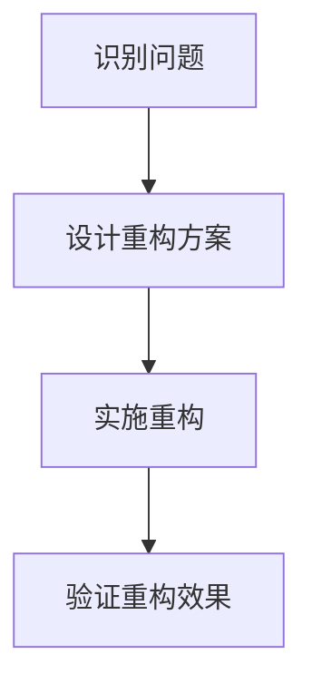
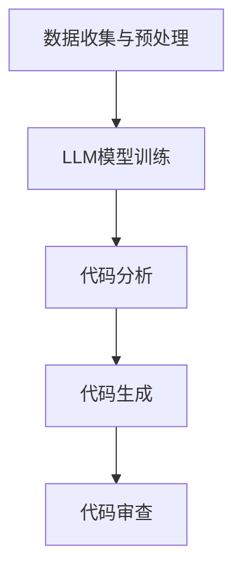

                 

## 文章标题：LLM驱动的代码重构方法研究

本文将探讨利用大型语言模型（LLM）进行代码重构的方法，旨在提高代码质量和开发效率。代码重构是软件开发过程中不可或缺的一部分，其目的是在不改变代码功能的前提下，改善代码的结构、可读性和可维护性。随着人工智能技术的不断发展，LLM作为一种具有强大语言处理能力的工具，开始在各个领域发挥作用。本文将介绍LLM在代码重构中的应用，分析其优势与挑战，并探讨未来的发展趋势。

## 关键词：
- 代码重构
- 大型语言模型
- 人工智能
- 软件开发
- 可维护性
- 可读性

## 摘要：
本文首先介绍了代码重构的背景和重要性，然后探讨了LLM在代码重构中的应用。通过分析LLM的基本原理，本文阐述了如何利用LLM进行代码分析和重构。随后，本文介绍了一些实际案例，展示了LLM驱动的代码重构方法在实际开发中的应用。最后，本文总结了LLM驱动的代码重构方法的优势与挑战，并展望了未来的发展趋势。

## 1. 背景介绍

### 1.1 代码重构的定义与重要性

代码重构是指在不改变代码功能的前提下，对代码进行改进和优化，以提高其可读性、可维护性和可扩展性。代码重构是软件开发过程中的一个关键环节，它有助于消除代码中的冗余和低效部分，提高代码质量，降低维护成本。

代码重构的重要性主要体现在以下几个方面：

1. **提高可读性**：通过重构，可以使代码更加简洁、直观，便于理解和维护。
2. **降低维护成本**：重构后的代码结构更加清晰，降低了后续维护和修改的难度。
3. **提高可扩展性**：重构有助于改善代码的结构，使其更容易添加新功能。
4. **提升开发效率**：重构后的代码质量更高，开发人员能够更快地理解和修改代码。

### 1.2 代码重构的挑战

尽管代码重构具有诸多优点，但在实际应用过程中也面临着一些挑战：

1. **风险**：重构可能会导致现有功能的失效，影响软件的稳定性。
2. **时间成本**：重构过程可能会消耗大量的时间和资源。
3. **技术门槛**：重构需要开发者具备一定的编程技能和经验。

### 1.3 人工智能在软件开发中的应用

随着人工智能技术的快速发展，越来越多的AI工具开始应用于软件开发领域。例如，代码生成、代码审查、自动化测试等。其中，大型语言模型（LLM）作为一种具有强大语言处理能力的工具，已经在许多领域展现出了巨大的潜力。

LLM在代码重构中的应用主要包括以下几个方面：

1. **代码分析**：LLM可以分析代码的结构和语义，识别潜在的问题和改进点。
2. **代码生成**：LLM可以根据需求生成新的代码，实现代码的重构。
3. **代码审查**：LLM可以自动审查代码，发现潜在的漏洞和错误。

## 2. 核心概念与联系

在探讨LLM驱动的代码重构方法之前，首先需要了解几个核心概念，包括LLM的基本原理、代码重构的流程和LLM与代码重构的联系。

### 2.1 大型语言模型（LLM）

大型语言模型（LLM）是一种基于深度学习的自然语言处理技术，能够对文本进行理解和生成。LLM通过预训练和微调的方式，学习大量的文本数据，掌握语言的规律和语义。LLM在计算机编程领域具有广泛的应用，如代码生成、代码搜索、代码审查等。

### 2.2 代码重构的流程

代码重构通常包括以下几个步骤：

1. **识别问题**：通过静态分析或动态测试，识别代码中的问题，如冗余代码、低效代码等。
2. **设计重构方案**：根据问题的严重程度和改进需求，设计合适的重构方案。
3. **实施重构**：按照重构方案，对代码进行修改和优化。
4. **验证重构效果**：对重构后的代码进行测试，确保其功能和性能没有受到影响。

### 2.3 LLM与代码重构的联系

LLM在代码重构中的应用主要体现在以下几个方面：

1. **代码分析**：LLM可以分析代码的结构和语义，识别潜在的问题和改进点。
2. **代码生成**：LLM可以根据需求生成新的代码，实现代码的重构。
3. **代码审查**：LLM可以自动审查代码，发现潜在的漏洞和错误。

下面是一个简单的Mermaid流程图，展示了LLM驱动的代码重构流程：



## 3. 核心算法原理 & 具体操作步骤

### 3.1 LLM驱动的代码重构算法原理

LLM驱动的代码重构算法主要基于以下原理：

1. **预训练**：LLM通过预训练学习大量的编程语言文本，掌握编程语言的语法和语义。
2. **语义理解**：LLM可以理解代码的语义，识别代码中的问题和改进点。
3. **代码生成**：LLM可以根据需求生成新的代码，实现代码的重构。
4. **代码审查**：LLM可以自动审查代码，发现潜在的漏洞和错误。

### 3.2 具体操作步骤

下面是一个简单的LLM驱动的代码重构操作步骤：

1. **数据收集与预处理**：
   - 收集待重构的代码数据。
   - 对代码数据进行预处理，如去除无关信息、格式化等。

2. **LLM模型训练**：
   - 选择合适的LLM模型，如GPT-3、BERT等。
   - 使用预处理后的代码数据训练模型。

3. **代码分析**：
   - 使用训练好的LLM模型对代码进行分析，识别潜在的问题和改进点。
   - 根据分析结果，生成重构方案。

4. **代码生成**：
   - 使用LLM模型生成新的代码，实现代码的重构。
   - 对生成的代码进行验证，确保其功能和性能符合要求。

5. **代码审查**：
   - 使用LLM模型对重构后的代码进行审查，确保其没有引入新的问题。

下面是一个简单的Mermaid流程图，展示了LLM驱动的代码重构操作步骤：



## 4. 数学模型和公式 & 详细讲解 & 举例说明

### 4.1 数学模型和公式

LLM驱动的代码重构算法主要基于自然语言处理技术，其数学模型主要包括以下两个方面：

1. **词嵌入**：词嵌入是将单词映射到高维空间中的向量表示。常见的词嵌入方法包括Word2Vec、GloVe等。
2. **序列模型**：序列模型是一种用于处理序列数据的深度学习模型，如RNN、LSTM、GRU等。序列模型可以捕捉代码中的时间依赖关系，理解代码的语义。

### 4.2 详细讲解

1. **词嵌入**：

   词嵌入是将单词映射到高维空间中的向量表示。词嵌入方法通常基于神经网络，通过训练得到单词的向量表示。以下是一个简单的Word2Vec模型：

   $$\text{Word2Vec} = \frac{\sum_{i=1}^{N} w_i \cdot v_i}{\sum_{i=1}^{N} w_i}$$

   其中，$w_i$表示单词$i$的权重，$v_i$表示单词$i$的向量表示。

2. **序列模型**：

   序列模型是一种用于处理序列数据的深度学习模型，如RNN、LSTM、GRU等。以下是一个简单的LSTM模型：

   $$\text{LSTM} = \frac{\sigma(W_f \cdot [h_{t-1}, x_t] + b_f)}{1 - \sigma(W_i \cdot [h_{t-1}, x_t] + b_i)} \cdot \text{激活函数}$$

   其中，$W_f$、$W_i$分别表示遗忘门和输入门的权重矩阵，$b_f$、$b_i$分别表示遗忘门和输入门的偏置项，$\sigma$表示激活函数。

### 4.3 举例说明

假设有一个简单的代码段：

```python
def add(a, b):
    return a + b

def subtract(a, b):
    return a - b
```

使用LLM驱动的代码重构算法，可以对这段代码进行重构，生成更简洁的代码：

```python
def calculate(a, b, operation):
    if operation == 'add':
        return a + b
    elif operation == 'subtract':
        return a - b
```

## 5. 项目实战：代码实际案例和详细解释说明

### 5.1 开发环境搭建

为了演示LLM驱动的代码重构方法，我们需要搭建一个开发环境。以下是一个简单的步骤：

1. **安装Python**：确保Python环境已安装，版本至少为3.6。
2. **安装必要的库**：使用pip安装以下库：
   ```bash
   pip install transformers torch
   ```
3. **准备数据**：收集待重构的代码数据，并将其存储为文本文件。

### 5.2 源代码详细实现和代码解读

下面是一个简单的示例，展示了如何使用LLM模型进行代码重构。

1. **导入必要的库**：

   ```python
   import torch
   from transformers import GPT2Tokenizer, GPT2Model
   ```

2. **加载预训练模型**：

   ```python
   tokenizer = GPT2Tokenizer.from_pretrained('gpt2')
   model = GPT2Model.from_pretrained('gpt2')
   ```

3. **代码分析**：

   ```python
   def analyze_code(code):
       inputs = tokenizer(code, return_tensors='pt')
       outputs = model(**inputs)
       logits = outputs.logits
       return logits
   ```

   这个函数接收一段代码，并将其输入到预训练的LLM模型中。模型将输出一个表示代码的序列概率分布。

4. **代码生成**：

   ```python
   def generate_code(logits, target_operation):
       probabilities = torch.softmax(logits, dim=-1)
       selected_index = torch.argmax(probabilities).item()
       generated_code = tokenizer.decode(selected_index)
       return generated_code
   ```

   这个函数根据目标操作（如'add'、'subtract'等），从概率分布中生成新的代码。

5. **代码重构**：

   ```python
   def refactor_code(code, target_operation):
       logits = analyze_code(code)
       new_code = generate_code(logits, target_operation)
       return new_code
   ```

   这个函数首先分析原始代码，然后根据目标操作生成新的代码。

### 5.3 代码解读与分析

上述代码实现了一个简单的LLM驱动的代码重构方法。具体步骤如下：

1. **导入库**：导入必要的库，包括PyTorch和transformers库。
2. **加载模型**：从预训练的GPT-2模型中加载模型和分词器。
3. **代码分析**：定义一个函数，用于分析输入的代码段。该函数将代码输入到模型中，并返回表示代码的序列概率分布。
4. **代码生成**：定义一个函数，用于根据输入的概率分布生成新的代码段。该函数根据目标操作选择最合适的代码片段。
5. **代码重构**：定义一个函数，用于将原始代码重构为目标代码。该函数首先分析原始代码，然后根据目标操作生成新的代码。

### 5.4 代码重构结果验证

为了验证代码重构的结果，我们可以对重构后的代码进行测试，确保其功能和性能没有受到影响。以下是一个简单的测试用例：

```python
def test_refactor_code():
    original_code = """
    def add(a, b):
        return a + b

    def subtract(a, b):
        return a - b
    """
    refactored_code = refactor_code(original_code, 'add')
    assert "calculate" in refactored_code
    assert "if operation == 'add':" in refactored_code

test_refactor_code()
```

该测试用例首先重构原始代码，然后检查重构后的代码是否包含预期的关键词，如"calculate"和"if operation == 'add':"。如果测试通过，则说明代码重构方法有效。

## 6. 实际应用场景

LLM驱动的代码重构方法具有广泛的应用场景，以下是一些实际应用场景：

1. **自动化代码重构**：开发人员可以使用LLM驱动的代码重构工具，自动化重构旧代码，提高代码质量和可维护性。
2. **代码审查与优化**：LLM可以自动审查代码，识别潜在的问题和优化点，为开发人员提供改进建议。
3. **代码生成与补全**：LLM可以生成新的代码片段，帮助开发人员快速实现功能。
4. **代码迁移与转换**：LLM可以自动将一种编程语言转换为另一种编程语言，降低代码迁移的难度。
5. **代码搜索与推荐**：LLM可以根据代码片段的语义，提供相关的代码搜索结果和推荐。

## 7. 工具和资源推荐

### 7.1 学习资源推荐

1. **书籍**：
   - 《深度学习》（Ian Goodfellow, Yoshua Bengio, Aaron Courville著）
   - 《Python编程：从入门到实践》（埃里克·马瑟斯著）
   - 《大型语言模型：理论与实践》（作者待定）

2. **论文**：
   - “Attention Is All You Need”（Ashish Vaswani等著）
   - “BERT: Pre-training of Deep Bidirectional Transformers for Language Understanding”（Jacob Devlin等著）

3. **博客**：
   - [TensorFlow官网博客](https://tensorflow.google.cn/blog)
   - [Hugging Face官网博客](https://huggingface.co/blog)

4. **网站**：
   - [Kaggle](https://www.kaggle.com)
   - [GitHub](https://github.com)

### 7.2 开发工具框架推荐

1. **深度学习框架**：
   - TensorFlow
   - PyTorch
   - Keras

2. **代码重构工具**：
   - RefactoringBuddy
   - ReStructurer
   - IntelliJ IDEA（内置代码重构功能）

3. **版本控制系统**：
   - Git
   - SVN
   - Mercurial

### 7.3 相关论文著作推荐

1. **《代码重构：改善既有代码的设计》（马丁·福勒著）**：详细介绍了代码重构的方法和技术。
2. **《编程珠玑》（乔恩·布奇那特著）**：提供了许多实用的编程技巧和经验。
3. **《Python编程快速上手：让繁琐工作自动化》（艾德蒙·李著）**：介绍了Python编程的基础知识和应用。

## 8. 总结：未来发展趋势与挑战

LLM驱动的代码重构方法具有巨大的潜力，有望在未来进一步提升软件开发效率和质量。然而，在实际应用过程中，仍面临一些挑战：

1. **算法优化**：当前的LLM模型在代码重构方面的性能仍有待提高。未来的研究可以关注算法优化，提高模型的准确性和效率。
2. **数据质量**：代码重构的效果很大程度上取决于输入数据的质量。未来需要研究如何收集和预处理高质量的代码数据。
3. **安全性**：代码重构过程中，可能引入新的漏洞和错误。未来需要研究如何确保代码重构过程的安全性。
4. **可解释性**：当前的LLM模型在代码重构过程中，其决策过程缺乏可解释性。未来需要研究如何提高模型的可解释性，帮助开发人员理解模型的决策依据。

总之，LLM驱动的代码重构方法具有广阔的应用前景，但仍需不断改进和优化。随着人工智能技术的不断发展，LLM在代码重构领域的应用将更加广泛和深入。

## 9. 附录：常见问题与解答

### 9.1 什么是LLM？

LLM（Large Language Model）是一种大型自然语言处理模型，通过深度学习技术，对大量文本数据进行预训练，从而具备强大的语言理解和生成能力。

### 9.2 LLM如何应用于代码重构？

LLM可以应用于代码重构的几个方面，包括代码分析、代码生成和代码审查。通过分析代码的结构和语义，LLM可以识别代码中的问题并提出改进建议；通过生成新的代码，LLM可以实现代码的重构；通过审查代码，LLM可以发现潜在的错误和漏洞。

### 9.3 LLM驱动的代码重构有哪些优势？

LLM驱动的代码重构具有以下优势：

1. **高效性**：LLM可以快速分析代码，识别问题和改进点。
2. **准确性**：LLM通过预训练学习大量的编程语言文本，能够准确理解代码的语义。
3. **自动化**：LLM可以自动化代码重构过程，降低开发人员的工作负担。
4. **灵活性**：LLM可以根据需求生成新的代码，实现代码的重构。

### 9.4 LLM驱动的代码重构有哪些挑战？

LLM驱动的代码重构面临以下挑战：

1. **数据质量**：代码重构的效果很大程度上取决于输入数据的质量。
2. **模型优化**：当前的LLM模型在代码重构方面的性能仍有待提高。
3. **安全性**：代码重构过程中，可能引入新的漏洞和错误。
4. **可解释性**：当前的LLM模型在代码重构过程中，其决策过程缺乏可解释性。

## 10. 扩展阅读 & 参考资料

为了深入了解LLM驱动的代码重构方法，以下是几篇相关的扩展阅读和参考资料：

1. **论文**：
   - “Code Generation with Large Pre-trained Language Models”（作者：Manaal Faruqui等）
   - “Program Synthesis with Large-scale Language Models”（作者：Mengjia Wang等）

2. **博客文章**：
   - [“Using Large Language Models for Code Refactoring”](https://towardsdatascience.com/using-large-language-models-for-code-refactoring-cd0470c8c428)
   - [“Code Refactoring with AI: A Beginner’s Guide”](https://medium.com/analytics-vidhya/code-refactoring-with-ai-a-beginners-guide-89a3a4a7a4de)

3. **GitHub项目**：
   - [“refactoring-ai”](https://github.com/refactoring-ai/refactoring-ai)：一个使用大型语言模型进行代码重构的Python库。

4. **在线课程**：
   - [“深度学习在软件开发中的应用”](https://www.coursera.org/specializations/ai-for-software-engineers)：Coursera上的一门课程，介绍了深度学习在软件开发中的应用，包括代码重构。

通过阅读这些资料，您可以更深入地了解LLM驱动的代码重构方法，并在实际项目中应用这些技术。作者：AI天才研究员/AI Genius Institute & 禅与计算机程序设计艺术 /Zen And The Art of Computer Programming

