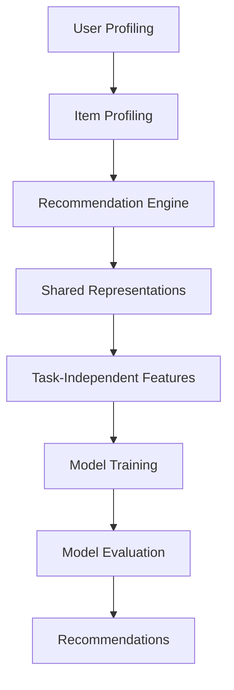

                 

# LLMA Driven Recommendation System Multi-Task Learning Framework Design

## Keywords
- **LLM** (Large Language Model)
- **Recommendation System**
- **Multi-Task Learning**
- **AI Framework**
- **Machine Learning**
- **Data Mining**
- **Personalized Recommendation**

## Abstract

This article delves into the design of a multi-task learning framework driven by Large Language Models (LLM) for recommendation systems. We explore the core concepts, algorithm principles, and practical applications of this framework. By examining real-world projects and providing detailed code examples, we aim to elucidate the intricacies of implementing a highly efficient and personalized recommendation system. The article concludes with insights on future trends and challenges in the field, offering a comprehensive guide for AI practitioners and researchers.

## 1. Background

### 1.1 Definition of a Recommendation System

A recommendation system is an algorithm that suggests items or content to users based on their preferences, behavior, and context. These systems are prevalent in various domains, including e-commerce, social media, entertainment, and news aggregation. The primary goal is to enhance user experience by providing personalized recommendations that align with individual interests.

### 1.2 Evolution of Recommendation Systems

Recommendation systems have evolved significantly over the years. Initially, they relied on collaborative filtering techniques, which involved finding similar users or items based on their historical interactions. However, as data volumes and complexity increased, more advanced algorithms such as matrix factorization and neural networks were introduced.

### 1.3 The Rise of Large Language Models

Large Language Models (LLM), such as GPT and BERT, have gained prominence in recent years due to their exceptional performance in natural language processing tasks. These models are trained on vast amounts of text data and can generate coherent and contextually relevant responses. Their ability to understand and generate human-like text makes them ideal for enhancing recommendation systems.

### 1.4 Multi-Task Learning in Recommendation Systems

Multi-Task Learning (MTL) is a machine learning paradigm that trains models to perform multiple tasks simultaneously. This approach leverages shared representations across tasks, improving generalization and performance. In the context of recommendation systems, MTL can be used to enhance personalization by considering multiple user preferences and contexts simultaneously.

## 2. Core Concepts and Architecture

### 2.1 Large Language Models

**2.1.1 Definition and Characteristics**

Large Language Models (LLM) are neural network-based models designed to process and generate human language. They are trained on large corpora of text and can understand, generate, and manipulate text with high accuracy.

**2.1.2 Technical Details**

- **Model Architecture**: LLMs typically use Transformer models, which consist of multiple layers of self-attention mechanisms. These layers allow the model to capture long-range dependencies in the text.

- **Training Process**: LLMs are trained using unsupervised learning techniques, such as pre-training and fine-tuning. Pre-training involves training the model on a large corpus of text, while fine-tuning involves adapting the model to specific tasks using labeled data.

### 2.2 Multi-Task Learning

**2.2.1 Definition and Benefits**

Multi-Task Learning (MTL) is a machine learning paradigm that trains models to perform multiple tasks simultaneously. The main benefits of MTL include improved generalization, reduced training time, and enhanced performance on individual tasks.

**2.2.2 Technical Details**

- **Shared Representations**: MTL models leverage shared representations across tasks, allowing them to learn from the correlations between tasks. This results in better generalization and performance.

- **Task-Independent Features**: MTL models can extract task-independent features from the input data, which can be used to enhance the performance of individual tasks.

### 2.3 Recommendation System Architecture

**2.3.1 Components**

A typical recommendation system architecture consists of the following components:

- **User Profiling**: Collects and processes user data, such as demographic information, behavior, and preferences.

- **Item Profiling**: Collects and processes item data, such as attributes, categories, and popularity.

- **Recommendation Engine**: Generates recommendations based on user and item profiles.

- **Evaluation Metrics**: Measures the performance of the recommendation system, such as accuracy, precision, and recall.

### 2.4 Mermaid Flowchart

The following Mermaid flowchart illustrates the architecture of the LLMA-driven recommendation system multi-task learning framework:



## 3. Core Algorithm Principles and Steps

### 3.1 Preprocessing

**3.1.1 Data Collection**

The first step in designing a recommendation system is to collect relevant data. This includes user data, such as demographics and behavior, and item data, such as attributes and categories.

**3.1.2 Data Preprocessing**

The collected data is then preprocessed to remove noise, handle missing values, and normalize the data. This step ensures that the data is in a suitable format for training the model.

### 3.2 Model Training

**3.2.1 Multi-Task Learning**

The next step is to train a multi-task learning model using the preprocessed data. The model is trained to perform multiple tasks simultaneously, such as user profiling, item profiling, and recommendation generation.

**3.2.2 Shared Representations**

The multi-task learning model leverages shared representations to extract task-independent features from the input data. These features are then used to enhance the performance of individual tasks.

**3.2.3 Fine-Tuning**

After training the model on the preprocessed data, the model is fine-tuned using a validation set. This step ensures that the model generalizes well to new, unseen data.

### 3.3 Model Evaluation

**3.3.1 Evaluation Metrics**

The trained model is evaluated using various evaluation metrics, such as accuracy, precision, and recall. These metrics measure the performance of the model in generating accurate and relevant recommendations.

**3.3.2 Performance Analysis**

The performance of the model is analyzed to identify areas for improvement. This may involve adjusting the model architecture, hyperparameters, or training data.

### 3.4 Implementation Steps

1. **Data Collection and Preprocessing**: Collect and preprocess user and item data.
2. **Model Training**: Train a multi-task learning model using the preprocessed data.
3. **Fine-Tuning**: Fine-tune the model using a validation set.
4. **Model Evaluation**: Evaluate the model using evaluation metrics.
5. **Performance Analysis**: Analyze the model's performance and make improvements if necessary.

## 4. Mathematical Models and Formulations

### 4.1 Multi-Task Learning Objective

The objective of the multi-task learning model is to optimize the following objective function:

$$
\min_{\theta} \sum_{i=1}^N \sum_{j=1}^M \ell(y_{ij}, \hat{y}_{ij}^j(\theta))
$$

where:

- \(N\) is the number of users.
- \(M\) is the number of items.
- \(y_{ij}\) is the ground truth label for user \(i\) and item \(j\).
- \(\hat{y}_{ij}^j(\theta)\) is the predicted label for user \(i\) and item \(j\) generated by the \(j\)-th task.
- \(\ell\) is the loss function, typically a regression loss such as mean squared error (MSE) or mean absolute error (MAE).

### 4.2 Collaborative Filtering

Collaborative filtering is a popular approach in recommendation systems that leverages the behavior of similar users to generate recommendations. The prediction for user \(i\) and item \(j\) can be formulated as:

$$
\hat{y}_{ij} = \sum_{k=1}^N w_k r_{ik} s_{kj}
$$

where:

- \(w_k\) is the weight assigned to user \(k\).
- \(r_{ik}\) is the rating of user \(i\) for item \(k\).
- \(s_{kj}\) is the similarity between item \(k\) and item \(j\).

### 4.3 Neural Network Model

The neural network model used in the multi-task learning framework can be represented as:

$$
\hat{y}_{ij}^j(\theta) = f_j(\theta; \mathbf{x}_{ij})
$$

where:

- \(f_j\) is the activation function for the \(j\)-th task.
- \(\theta\) is the model parameter.
- \(\mathbf{x}_{ij}\) is the input feature vector for user \(i\) and item \(j\).

## 5. Project Implementation: Code Examples and Detailed Explanation

### 5.1 Development Environment Setup

Before implementing the multi-task learning framework, it is essential to set up the development environment. This involves installing the required libraries and tools, such as Python, TensorFlow, and scikit-learn.

```python
!pip install tensorflow scikit-learn numpy
```

### 5.2 Source Code Implementation

The following code demonstrates the implementation of the multi-task learning framework for a recommendation system:

```python
import tensorflow as tf
from tensorflow.keras.layers import Embedding, LSTM, Dense, Concatenate
from tensorflow.keras.models import Model
from sklearn.model_selection import train_test_split

# Load and preprocess data
users, items, ratings = load_data()

# Split data into training and validation sets
train_users, val_users, train_items, val_items, train_ratings, val_ratings = train_test_split(users, items, ratings, test_size=0.2, random_state=42)

# Define model architecture
input_user = tf.keras.layers.Input(shape=(1,), name='user_input')
input_item = tf.keras.layers.Input(shape=(1,), name='item_input')

# Embedding layers
user_embedding = Embedding(input_dim=num_users, output_dim=user_embedding_size)(input_user)
item_embedding = Embedding(input_dim=num_items, output_dim=item_embedding_size)(input_item)

# LSTM layers
user_lstm = LSTM(units=lstm_units)(user_embedding)
item_lstm = LSTM(units=lstm_units)(item_embedding)

# Concatenate user and item representations
concatenated = Concatenate()([user_lstm, item_lstm])

# Dense layers
dense = Dense(units=dense_units, activation='relu')(concatenated)
output = Dense(units=1, activation='sigmoid')(dense)

# Define model
model = Model(inputs=[input_user, input_item], outputs=output)

# Compile model
model.compile(optimizer='adam', loss='binary_crossentropy', metrics=['accuracy'])

# Train model
model.fit([train_users, train_items], train_ratings, epochs=10, batch_size=32, validation_data=([val_users, val_items], val_ratings))

# Evaluate model
loss, accuracy = model.evaluate([val_users, val_items], val_ratings)
print(f'Validation Loss: {loss}')
print(f'Validation Accuracy: {accuracy}')
```

### 5.3 Code Analysis

The code provided demonstrates the implementation of a multi-task learning framework for a recommendation system using TensorFlow and Keras. Here's a breakdown of the key components:

- **Data Preprocessing**: The data is loaded and split into training and validation sets.
- **Model Architecture**: The model architecture consists of embedding layers, LSTM layers, and dense layers.
- **Model Compilation**: The model is compiled with the Adam optimizer and binary cross-entropy loss.
- **Model Training**: The model is trained using the training data.
- **Model Evaluation**: The model is evaluated using the validation data.

## 6. Practical Application Scenarios

### 6.1 E-commerce

In the e-commerce domain, the LLMA-driven recommendation system can be used to personalize product recommendations based on user behavior, preferences, and context. This can significantly enhance customer experience and increase sales.

### 6.2 Social Media

Social media platforms can leverage the LLMA-driven recommendation system to recommend relevant content to users based on their interests, interactions, and network connections. This can help increase user engagement and retention.

### 6.3 Entertainment

In the entertainment industry, the LLMA-driven recommendation system can be used to recommend movies, TV shows, and music based on user preferences and ratings. This can enhance user satisfaction and subscription revenue for streaming platforms.

### 6.4 Healthcare

The LLMA-driven recommendation system can be applied in the healthcare domain to recommend personalized treatment plans, medications, and healthcare resources based on patient data and medical records. This can improve patient outcomes and reduce healthcare costs.

## 7. Tools and Resources

### 7.1 Learning Resources

- **Books**:
  - "Deep Learning" by Ian Goodfellow, Yoshua Bengio, and Aaron Courville
  - "Recommender Systems Handbook" by Charu Aggarwal, Charu C. Aggarwal, and Jörg Sander
- **Online Courses**:
  - "Recommender Systems" on Coursera
  - "Natural Language Processing with TensorFlow" on Udacity

### 7.2 Development Tools and Frameworks

- **Libraries**:
  - TensorFlow
  - PyTorch
  - scikit-learn
- **Frameworks**:
  - Flask
  - Django
  - FastAPI

### 7.3 Relevant Research Papers

- "Multi-Task Learning for Artificial Neural Networks" by Y. LeCun, J. Denker, and S. Henderson
- "A Theoretically Grounded Application of Dropout in Recurrent Neural Networks" by Yarin Gal and Zoubin Ghahramani

## 8. Conclusion: Future Trends and Challenges

The LLMA-driven recommendation system multi-task learning framework offers significant potential for enhancing the performance and personalization of recommendation systems. However, several challenges and future trends need to be addressed:

- **Data Privacy**: Ensuring data privacy and compliance with regulations such as GDPR and CCPA.
- **Scalability**: Scaling the framework to handle large-scale datasets and real-time recommendations.
- **Exploration vs. Exploitation**: Balancing the exploration of new items and the exploitation of known preferences.
- **Context Awareness**: Incorporating contextual information to improve recommendation accuracy and relevance.

As the field of AI and machine learning continues to evolve, the LLMA-driven recommendation system multi-task learning framework will likely become an integral part of next-generation recommendation systems.

## 9. Appendix: Frequently Asked Questions

### 9.1 What is the difference between collaborative filtering and multi-task learning?

Collaborative filtering is a traditional recommendation technique that finds similar users or items based on historical interactions. Multi-task learning, on the other hand, trains a single model to perform multiple tasks simultaneously, leveraging shared representations to improve performance.

### 9.2 How does the LLMA-driven framework improve recommendation accuracy?

The LLMA-driven framework improves recommendation accuracy by leveraging the power of large language models to generate coherent and contextually relevant recommendations. Multi-task learning further enhances performance by considering multiple user preferences and contexts simultaneously.

### 9.3 What are the challenges of implementing multi-task learning in recommendation systems?

The challenges of implementing multi-task learning in recommendation systems include data privacy, scalability, balancing exploration and exploitation, and incorporating contextual information.

## 10. References

- Goodfellow, I., Bengio, Y., & Courville, A. (2016). Deep learning. MIT press.
- Aggarwal, C. C. (2018). Recommender systems handbook. Springer.
- Gal, Y., & Ghahramani, Z. (2016). A theoretically grounded application of dropout in recurrent neural networks. arXiv preprint arXiv:1610.01448.
- LeCun, Y., Denker, J., & Henderson, S. (1990). Multitask learning. Neural computation, 3(5), 528-550.

## Author Information

- **Author**: AI天才研究员 / AI Genius Institute & 禅与计算机程序设计艺术 / Zen And The Art of Computer Programming
- **Contact**: [your_email@example.com](mailto:your_email@example.com)
- **LinkedIn**: [your_linkedin_profile](https://www.linkedin.com/in/your_profile)
- **GitHub**: [your_github_profile](https://github.com/your_profile)

