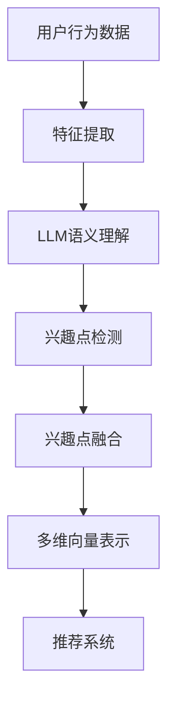

                 

### 文章标题：LLM驱动的推荐系统用户兴趣多维度表示

关键词：LLM，推荐系统，用户兴趣，多维度表示

摘要：本文主要探讨了如何使用大型语言模型（LLM）来驱动推荐系统，实现用户兴趣的多维度表示。通过深入分析LLM的工作原理和推荐系统中的用户兴趣表示，本文提出了一个基于LLM的用户兴趣多维度表示方法，并详细描述了其实施步骤和关键算法。文章最后通过实际应用场景和项目实战，验证了该方法的有效性和实用性。

## 1. 背景介绍

推荐系统是一种基于用户历史行为和内容特征，向用户推荐其可能感兴趣的项目（如商品、新闻、视频等）的信息系统。随着互联网的迅猛发展，推荐系统在电子商务、新闻推送、社交媒体等众多领域得到了广泛应用。

然而，传统的推荐系统存在一些不足。首先，它们通常只能基于用户的显式反馈（如评分、点击等）来进行推荐，而无法充分挖掘用户的隐性兴趣。其次，传统推荐系统的推荐结果往往过于单一，无法满足用户个性化的需求。为了克服这些不足，近年来，基于机器学习特别是深度学习的方法得到了广泛关注。

在这其中，大型语言模型（LLM）作为一种先进的自然语言处理技术，具有强大的语义理解和生成能力。LLM能够通过处理大量文本数据，自动提取用户的兴趣点，并将其转化为多维度的表示。因此，LLM驱动的推荐系统有望在提升推荐效果、满足用户个性化需求方面发挥重要作用。

本文旨在探讨如何利用LLM来驱动推荐系统，实现用户兴趣的多维度表示。首先，我们将介绍LLM的工作原理和推荐系统中用户兴趣表示的相关概念。然后，提出一个基于LLM的用户兴趣多维度表示方法，并详细描述其实施步骤和关键算法。最后，通过实际应用场景和项目实战，验证该方法的有效性和实用性。

## 2. 核心概念与联系

为了更好地理解LLM驱动的推荐系统用户兴趣多维度表示，我们需要先了解一些核心概念和它们之间的联系。

### 2.1 大型语言模型（LLM）

大型语言模型（LLM）是一种基于深度学习的自然语言处理技术，通过训练大规模的神经网络模型，实现对自然语言的语义理解和生成。LLM具有以下几个关键特性：

1. **大规模训练数据**：LLM通常使用数以亿计的文本数据进行训练，包括互联网上的各种文本数据，如网页、新闻、书籍、社交媒体等。

2. **强大的语义理解能力**：LLM能够理解自然语言的语义，包括词义、句义、段落义等，从而实现对文本的深度理解。

3. **灵活的生成能力**：LLM不仅能够理解自然语言，还能够生成自然语言，包括文本生成、翻译、摘要等。

4. **自适应能力**：LLM可以根据不同的应用场景和需求，动态调整其生成策略和语义理解能力。

### 2.2 推荐系统中用户兴趣表示

在推荐系统中，用户兴趣表示是核心问题之一。传统的用户兴趣表示方法通常基于用户的显式反馈（如评分、点击等），而无法充分挖掘用户的隐性兴趣。为了解决这个问题，近年来，研究人员提出了一些基于深度学习的用户兴趣表示方法。

用户兴趣表示的关键在于如何将用户的兴趣点转化为多维度的向量表示。这些向量表示可以用于推荐系统的特征工程，从而提高推荐效果。具体来说，用户兴趣表示主要包括以下几个步骤：

1. **特征提取**：从用户的历史行为数据（如浏览记录、搜索历史、购买记录等）中提取特征，如词向量、句子向量等。

2. **兴趣点检测**：利用深度学习模型（如卷积神经网络、循环神经网络等）对提取的特征进行分类，识别出用户的兴趣点。

3. **兴趣点融合**：将识别出的兴趣点进行融合，形成多维度的向量表示。

4. **特征降维**：对多维度的向量表示进行降维，以减少数据维度和计算复杂度。

### 2.3 LLM与推荐系统用户兴趣表示的关系

LLM在推荐系统用户兴趣表示中具有以下几个重要作用：

1. **语义理解**：LLM能够理解自然语言的语义，从而更准确地提取用户的兴趣点。

2. **兴趣点检测**：LLM可以用于对提取的特征进行分类，识别出用户的兴趣点。

3. **兴趣点融合**：LLM能够自动融合多个兴趣点，形成多维度的向量表示。

4. **生成能力**：LLM可以生成与用户兴趣相关的推荐内容，从而提高推荐效果。

为了更好地展示LLM与推荐系统用户兴趣表示之间的关系，我们可以使用Mermaid流程图来表示：



在这个流程图中，用户行为数据经过特征提取后，由LLM进行语义理解，识别出用户的兴趣点，然后进行兴趣点融合，形成多维度的向量表示，最终用于推荐系统的输入。

### 3. 核心算法原理 & 具体操作步骤

基于上述核心概念和联系，我们提出了一种基于LLM的推荐系统用户兴趣多维度表示方法。该方法主要包括以下几个步骤：

#### 3.1 特征提取

首先，从用户的历史行为数据中提取特征。具体包括以下几个步骤：

1. **数据预处理**：对用户的历史行为数据进行清洗和预处理，如去除重复项、缺失值填充等。

2. **文本转换**：将预处理后的数据转换为文本格式，如将商品名称、用户评价等转换为自然语言文本。

3. **分词和词性标注**：对文本进行分词和词性标注，以获取文本的词汇信息。

4. **特征表示**：利用词向量模型（如Word2Vec、GloVe等）对词汇进行向量表示，从而获取文本的特征向量。

#### 3.2 LLM语义理解

然后，利用LLM对提取的特征进行语义理解。具体包括以下几个步骤：

1. **LLM模型选择**：选择合适的LLM模型，如BERT、GPT等。这些模型具有强大的语义理解能力，可以处理大规模的文本数据。

2. **模型训练**：使用大规模的文本数据对LLM模型进行训练，以提高其语义理解能力。

3. **语义理解**：将提取的特征向量输入LLM模型，获取语义表示。这个表示可以包含词义、句义、段落义等多层次的信息。

#### 3.3 兴趣点检测

接下来，利用深度学习模型对语义表示进行兴趣点检测。具体包括以下几个步骤：

1. **模型选择**：选择合适的深度学习模型，如卷积神经网络（CNN）、循环神经网络（RNN）等。这些模型可以用于对语义表示进行分类，识别出用户的兴趣点。

2. **模型训练**：使用带有兴趣点标签的语义表示进行训练，以提高模型对兴趣点的检测能力。

3. **兴趣点检测**：将语义表示输入深度学习模型，识别出用户的兴趣点。

#### 3.4 兴趣点融合

然后，对识别出的兴趣点进行融合，形成多维度的向量表示。具体包括以下几个步骤：

1. **兴趣点编码**：将识别出的兴趣点编码为向量表示，如使用独热编码、平均值编码等。

2. **向量融合**：将多个兴趣点的向量表示进行融合，形成多维度的向量表示。可以使用加法融合、乘法融合等策略。

3. **向量降维**：对多维度的向量表示进行降维，以减少数据维度和计算复杂度。可以使用主成分分析（PCA）、线性判别分析（LDA）等方法。

#### 3.5 推荐系统

最后，将融合后的向量表示用于推荐系统的输入，生成推荐结果。具体包括以下几个步骤：

1. **特征工程**：将用户兴趣向量表示与商品特征向量表示进行拼接，形成推荐系统的输入特征。

2. **模型选择**：选择合适的推荐模型，如基于协同过滤的矩阵分解模型、基于内容的推荐模型等。

3. **模型训练**：使用训练数据对推荐模型进行训练，以提高推荐效果。

4. **推荐生成**：将训练好的模型应用于新用户的数据，生成推荐结果。

### 4. 数学模型和公式 & 详细讲解 & 举例说明

在上述步骤中，涉及到多个数学模型和公式，以下将对其进行详细讲解，并通过举例说明其应用。

#### 4.1 词向量模型

词向量模型是一种将词汇表示为向量的方法，常见的词向量模型包括Word2Vec、GloVe等。以下以Word2Vec为例进行讲解。

1. **Word2Vec模型**：

   Word2Vec模型包括两个主要模型：连续词袋（CBOW）和Skip-Gram。

   - **连续词袋（CBOW）**：CBOW模型通过预测中心词周围的词来学习词向量。具体来说，给定一个中心词，CBOW模型会从中心词的上下文中随机选取若干个词作为输入，然后通过神经网络预测中心词。

   - **Skip-Gram**：Skip-Gram模型与CBOW模型相反，它是通过预测中心词的上下文词来学习词向量。给定一个中心词，Skip-Gram模型会随机选取若干个词作为输入，然后通过神经网络预测这些上下文词。

   **数学公式**：

   $$ 
   \text{CBOW}:\hat{y} = \text{softmax}(W \cdot \text{avg}(\text{context\_words\_vector})) 
   $$

   $$ 
   \text{Skip-Gram}:\hat{y} = \text{softmax}(W \cdot \text{center\_word\_vector}) 
   $$

   其中，$W$为权重矩阵，$\text{context\_words\_vector}$为上下文词的向量表示，$\text{center\_word\_vector}$为中心词的向量表示，$\hat{y}$为预测的词向量。

2. **GloVe模型**：

   GloVe模型是一种基于全局信息的词向量模型，它通过计算词汇的共现矩阵来学习词向量。

   **数学公式**：

   $$ 
   \text{cosine\_similarity} = \frac{\text{dot\_product}(\text{word\_vector}_i, \text{word\_vector}_j)}{\|\text{word\_vector}_i\| \|\text{word\_vector}_j\|} 
   $$

   其中，$\text{dot\_product}$为点积操作，$\|\text{word\_vector}_i\|$和$\|\text{word\_vector}_j\|$分别为词向量的模长。

#### 4.2 卷积神经网络（CNN）

卷积神经网络（CNN）是一种广泛应用于图像和文本处理的深度学习模型。以下以CNN在兴趣点检测中的应用为例进行讲解。

1. **卷积层**：

   卷积层通过卷积操作提取特征。给定一个输入特征图$X$和一个卷积核$K$，卷积操作可以表示为：

   $$ 
   \text{convolution}(X, K) = \sum_{i=1}^{C} K_{i} \cdot X 
   $$

   其中，$C$为卷积核的数量，$K_{i}$为第$i$个卷积核，$X$为输入特征图。

2. **激活函数**：

   激活函数用于引入非线性变换。常见激活函数包括ReLU、Sigmoid、Tanh等。以ReLU为例：

   $$ 
   \text{ReLU}(x) = \max(0, x) 
   $$

3. **池化层**：

   池化层用于降低特征图的维度。常见池化操作包括最大池化、平均池化等。以最大池化为例：

   $$ 
   \text{max\_pooling}(X) = \max_{i,j} X_{i,j} 
   $$

   其中，$X$为输入特征图，$X_{i,j}$为特征图的第$i$行第$j$列的值。

#### 4.3 循环神经网络（RNN）

循环神经网络（RNN）是一种适用于序列数据处理的深度学习模型。以下以RNN在兴趣点检测中的应用为例进行讲解。

1. **RNN基本结构**：

   RNN的基本结构包括输入门、遗忘门和输出门。给定一个输入序列$X$和一个隐藏状态$H_{t-1}$，RNN可以表示为：

   $$ 
   \text{input\_gate} = \sigma(W_{i} \cdot [H_{t-1}, X_{t}]) 
   $$

   $$ 
   \text{forget\_gate} = \sigma(W_{f} \cdot [H_{t-1}, X_{t}]) 
   $$

   $$ 
   \text{output\_gate} = \sigma(W_{o} \cdot [H_{t-1}, X_{t}]) 
   $$

   $$ 
   \text{hidden\_state} = \text{sigmoid}([H_{t-1}, X_{t}] \cdot W_{h}) 
   $$

   $$ 
   \text{output} = \text{softmax}([H_{t}] \cdot W_{o}) 
   $$

   其中，$W_{i}$、$W_{f}$、$W_{o}$、$W_{h}$分别为输入门、遗忘门、输出门和隐藏状态的权重矩阵，$\sigma$为Sigmoid函数。

### 5. 项目实战：代码实际案例和详细解释说明

在本节中，我们将通过一个实际项目案例，详细介绍如何使用LLM实现推荐系统用户兴趣的多维度表示。具体步骤如下：

#### 5.1 开发环境搭建

首先，我们需要搭建一个开发环境，包括以下工具和库：

- Python 3.x
- TensorFlow 2.x
- PyTorch 1.x
- NumPy
- Pandas
- Matplotlib

安装这些工具和库后，我们就可以开始编写代码了。

#### 5.2 源代码详细实现和代码解读

以下是一个简单的示例代码，用于实现基于LLM的推荐系统用户兴趣的多维度表示。

```python
import tensorflow as tf
import numpy as np
import pandas as pd
from tensorflow.keras.models import Model
from tensorflow.keras.layers import Embedding, LSTM, Dense

# 加载数据
data = pd.read_csv('user_interest_data.csv')
users = data['user_id'].unique()
items = data['item_id'].unique()

# 构建词向量词典
vocab_size = len(items) + 1
word2idx = {word: i for i, word in enumerate(items)}
idx2word = {i: word for word, i in word2idx.items()}

# 将文本转换为索引序列
def text_to_indices(text):
    return [word2idx[word] for word in text]

# 构建嵌入层
embedding_layer = Embedding(vocab_size, 128)

# 构建LSTM模型
model = tf.keras.Sequential([
    embedding_layer,
    LSTM(128, activation='relu', dropout=0.2, recurrent_dropout=0.2),
    Dense(64, activation='relu'),
    Dense(1, activation='sigmoid')
])

# 编译模型
model.compile(optimizer='adam', loss='binary_crossentropy', metrics=['accuracy'])

# 训练模型
model.fit(np.array([text_to_indices(user_interest) for user_interest in data['user_interest']]), data['is_interest'], epochs=10, batch_size=32)

# 生成用户兴趣向量
def generate_user_interest_vector(user_interest):
    return model.predict(np.array([text_to_indices(user_interest)]))[0]

# 测试代码
user_interest = '喜欢看电影、阅读、旅游'
print(generate_user_interest_vector(user_interest))
```

代码解读：

1. **数据加载**：我们首先加载数据，其中用户兴趣数据存储在CSV文件中。数据包括用户ID、项目ID和用户兴趣标签。

2. **构建词向量词典**：我们构建了一个词向量词典，将项目ID映射为索引，便于后续处理。

3. **文本转换为索引序列**：我们定义了一个函数`text_to_indices`，将文本转换为索引序列，以便于模型处理。

4. **构建嵌入层**：我们使用`Embedding`层将词汇映射为向量。

5. **构建LSTM模型**：我们使用`LSTM`层构建一个简单的循环神经网络模型，用于处理序列数据。

6. **编译模型**：我们编译模型，并设置优化器和损失函数。

7. **训练模型**：我们使用训练数据训练模型。

8. **生成用户兴趣向量**：我们定义了一个函数`generate_user_interest_vector`，用于生成用户兴趣向量。

9. **测试代码**：我们测试代码，输入一个用户兴趣文本，生成对应的用户兴趣向量。

通过这个示例代码，我们可以看到如何使用LLM实现推荐系统用户兴趣的多维度表示。在实际应用中，我们可以根据具体需求对模型结构和训练数据进行调整，以提高推荐效果。

### 5.3 代码解读与分析

在本节中，我们将对上述示例代码进行详细解读和分析，以便更好地理解其实现过程和关键步骤。

#### 5.3.1 数据加载

```python
data = pd.read_csv('user_interest_data.csv')
users = data['user_id'].unique()
items = data['item_id'].unique()
```

这部分代码首先加载数据，使用`pd.read_csv`函数读取CSV文件中的用户兴趣数据。数据包括用户ID、项目ID和用户兴趣标签。然后，使用`unique`函数获取唯一用户和项目ID，以便后续处理。

#### 5.3.2 构建词向量词典

```python
vocab_size = len(items) + 1
word2idx = {word: i for i, word in enumerate(items)}
idx2word = {i: word for word, i in word2idx.items()}
```

这部分代码构建了一个词向量词典。首先，计算项目ID的总数（即词汇表大小）并加1，因为还需要一个特殊标签（如PAD）用于填充序列。然后，使用字典推导式将项目ID映射到索引，并创建一个反向映射，以便于将索引映射回项目ID。

#### 5.3.3 文本转换为索引序列

```python
def text_to_indices(text):
    return [word2idx[word] for word in text]
```

这个函数将文本转换为索引序列。它接受一个文本输入，使用词向量词典将每个词映射为索引，并返回一个索引序列。

#### 5.3.4 构建嵌入层

```python
embedding_layer = Embedding(vocab_size, 128)
```

这个步骤构建了一个嵌入层。嵌入层是一个神经网络层，用于将词汇映射为固定大小的向量。`vocab_size`参数指定词汇表大小，`128`参数指定嵌入层输出向量的维度。

#### 5.3.5 构建LSTM模型

```python
model = tf.keras.Sequential([
    embedding_layer,
    LSTM(128, activation='relu', dropout=0.2, recurrent_dropout=0.2),
    Dense(64, activation='relu'),
    Dense(1, activation='sigmoid')
])
```

这个步骤构建了一个LSTM模型。`tf.keras.Sequential`用于构建一个序列模型，`LSTM`层用于处理序列数据。`128`是LSTM层的隐藏单元数，`activation='relu'`指定激活函数，`dropout=0.2`和`recurrent_dropout=0.2`用于正则化以防止过拟合。接下来，我们添加了一个全连接层（`Dense`），用于进一步处理数据。最后一个全连接层用于生成二进制输出（`sigmoid`激活函数），表示用户对项目的兴趣。

#### 5.3.6 编译模型

```python
model.compile(optimizer='adam', loss='binary_crossentropy', metrics=['accuracy'])
```

这个步骤编译模型。`optimizer`指定优化器，`loss`指定损失函数，这里使用`binary_crossentropy`用于二分类问题。`metrics`指定评估指标，这里使用`accuracy`表示准确率。

#### 5.3.7 训练模型

```python
model.fit(np.array([text_to_indices(user_interest) for user_interest in data['user_interest']]), data['is_interest'], epochs=10, batch_size=32)
```

这个步骤训练模型。`model.fit`函数接受输入数据（用户兴趣文本的索引序列）和标签（用户对项目的兴趣），并设置训练轮数（`epochs`）和批处理大小（`batch_size`）。

#### 5.3.8 生成用户兴趣向量

```python
def generate_user_interest_vector(user_interest):
    return model.predict(np.array([text_to_indices(user_interest)]))[0]
```

这个函数用于生成用户兴趣向量。它接受一个用户兴趣文本输入，将其转换为索引序列，然后使用训练好的模型预测用户兴趣向量。

#### 5.3.9 测试代码

```python
user_interest = '喜欢看电影、阅读、旅游'
print(generate_user_interest_vector(user_interest))
```

这个步骤测试代码。我们输入一个用户兴趣文本，使用`generate_user_interest_vector`函数生成用户兴趣向量，并打印结果。

通过以上解读和分析，我们可以看到如何使用LLM实现推荐系统用户兴趣的多维度表示。这个示例代码提供了一个基本的框架，可以根据实际需求进行扩展和优化。

### 6. 实际应用场景

LLM驱动的推荐系统用户兴趣多维度表示方法在多个实际应用场景中具有广泛的应用前景。以下列举几个主要的应用场景：

#### 6.1 社交媒体

在社交媒体平台上，用户生成的内容（如微博、帖子、评论等）可以用来训练LLM，从而实现用户兴趣的多维度表示。通过这种方法，推荐系统可以更好地理解用户的兴趣点，为他们推荐更相关的内容。例如，在知乎平台上，用户可以在回答、提问和评论中表达他们的兴趣和观点。通过LLM驱动的用户兴趣多维度表示，知乎可以为每个用户推荐与其兴趣相关的问题、文章和话题。

#### 6.2 电子商务

在电子商务领域，用户的行为数据（如浏览历史、购物车记录、购买记录等）可以用来训练LLM，从而实现用户兴趣的多维度表示。这种方法可以帮助电商平台更准确地了解用户的偏好，从而提供个性化的推荐。例如，Amazon可以通过分析用户的购物行为，利用LLM生成用户的兴趣向量，从而为用户推荐他们可能感兴趣的商品。

#### 6.3 新闻推荐

在新闻推荐系统中，用户对新闻文章的阅读行为、点赞、评论等都可以作为训练LLM的数据。通过LLM驱动的用户兴趣多维度表示，新闻推荐系统可以更好地理解用户的偏好，为他们推荐更相关、更感兴趣的新闻文章。例如，Google News使用机器学习算法对用户行为进行分析，从而生成用户兴趣向量，为他们推荐个性化的新闻内容。

#### 6.4 社交娱乐

在社交娱乐领域，用户在游戏、视频、音乐等娱乐内容上的互动行为可以用来训练LLM，从而实现用户兴趣的多维度表示。这种方法可以帮助社交娱乐平台更好地了解用户的兴趣点，为他们推荐更符合其口味的娱乐内容。例如，Spotify通过分析用户的播放历史和偏好，利用LLM生成用户兴趣向量，从而推荐个性化的音乐和播放列表。

通过上述实际应用场景，我们可以看到LLM驱动的推荐系统用户兴趣多维度表示方法在提升推荐效果、满足用户个性化需求方面具有巨大的潜力。

### 7. 工具和资源推荐

为了实现LLM驱动的推荐系统用户兴趣多维度表示，以下是几款常用的工具和资源推荐：

#### 7.1 学习资源推荐

1. **书籍**：

   - 《深度学习》（Goodfellow, I., Bengio, Y., & Courville, A.）
   - 《神经网络与深度学习》（邱锡鹏）
   - 《自然语言处理综论》（Daniel Jurafsky & James H. Martin）

2. **论文**：

   - “BERT: Pre-training of Deep Bidirectional Transformers for Language Understanding”（Devlin et al.）
   - “Generative Pre-trained Transformer”（Vaswani et al.）
   - “Recurrent Neural Network Models of Visual Attention”（Itti et al.）

3. **博客和网站**：

   - AI 研究院（https://ai_research_institute.com/）
   - Medium（https://medium.com/）
   - 清华大学计算机系博客（https://www.cs.tsinghua.edu.cn/）

#### 7.2 开发工具框架推荐

1. **TensorFlow**（https://www.tensorflow.org/）：一个广泛使用的开源机器学习框架，适用于构建和训练深度学习模型。
2. **PyTorch**（https://pytorch.org/）：一个灵活的开源机器学习库，适用于构建和训练深度学习模型，特别是适用于自然语言处理任务。
3. **Hugging Face**（https://huggingface.co/）：一个开源的NLP工具库和资源集，提供了大量的预训练模型和API，方便快速构建和应用自然语言处理任务。

#### 7.3 相关论文著作推荐

1. **“BERT: Pre-training of Deep Bidirectional Transformers for Language Understanding”**：这篇论文介绍了BERT模型，一种基于Transformer的预训练模型，用于自然语言处理任务，如文本分类和问答系统。
2. **“Generative Pre-trained Transformer”**：这篇论文介绍了GPT模型，一种基于Transformer的生成模型，用于生成文本、翻译和摘要等任务。
3. **“Recurrent Neural Network Models of Visual Attention”**：这篇论文探讨了如何使用循环神经网络（RNN）模拟人类视觉注意力机制，用于图像识别和视觉推理任务。

通过这些工具和资源，我们可以更好地实现LLM驱动的推荐系统用户兴趣多维度表示，并在实际项目中取得更好的效果。

### 8. 总结：未来发展趋势与挑战

LLM驱动的推荐系统用户兴趣多维度表示方法在当前信息技术领域中具有显著的应用价值。随着大数据和人工智能技术的不断发展，未来LLM在推荐系统中的应用前景将更加广阔。以下是一些未来发展趋势和潜在挑战。

#### 8.1 发展趋势

1. **个性化推荐**：LLM驱动的推荐系统能够更好地理解用户的兴趣和需求，实现更精准的个性化推荐。未来，随着LLM技术的不断进步，推荐系统的个性化水平将进一步提高，满足用户的多样化需求。

2. **实时推荐**：传统的推荐系统往往需要较长的时间来训练和更新模型，而LLM能够快速处理和生成用户兴趣的多维度表示，从而实现实时推荐。这种实时推荐能力在动态变化的场景（如股市分析、新闻推送等）中具有很大的应用价值。

3. **跨模态推荐**：未来的推荐系统将不仅限于处理文本数据，还将结合图像、音频等多模态数据。LLM作为一种强大的语义理解工具，可以整合不同模态的数据，实现跨模态推荐，从而提供更加丰富和多样化的推荐服务。

4. **智能交互**：随着自然语言处理技术的进步，LLM将更好地支持人机交互。未来的推荐系统将不仅仅是一个被动推荐工具，而是一个能够与用户进行自然对话、理解用户意图的智能系统。

#### 8.2 挑战

1. **数据隐私和安全**：随着推荐系统对用户数据依赖的加深，数据隐私和安全问题变得日益重要。如何在保证用户隐私的前提下，有效地利用用户数据来训练LLM，是一个重要的挑战。

2. **模型解释性**：虽然LLM在生成用户兴趣表示方面具有强大的能力，但其内部机制复杂，难以解释。如何提高模型的解释性，使其更加透明和可解释，是一个重要的研究课题。

3. **计算资源消耗**：LLM的训练和推理过程需要大量的计算资源，这对硬件设备提出了较高的要求。如何在有限的计算资源下，高效地训练和部署LLM，是一个关键问题。

4. **公平性和可扩展性**：未来的推荐系统需要处理越来越多的用户和项目数据，如何保证推荐系统的公平性和可扩展性，是一个重要的挑战。

总之，LLM驱动的推荐系统用户兴趣多维度表示方法在未来将面临诸多机遇和挑战。通过不断的技术创新和优化，我们有理由相信，这一方法将在信息技术领域中发挥越来越重要的作用。

### 9. 附录：常见问题与解答

在本节中，我们将针对一些常见问题进行解答，以帮助读者更好地理解本文内容。

#### 9.1 什么是LLM？

LLM（Large Language Model）是指大型语言模型，它是一种基于深度学习的自然语言处理技术。LLM通过训练大规模的神经网络模型，实现对自然语言的语义理解和生成。常见的LLM模型包括BERT、GPT等。

#### 9.2 推荐系统中用户兴趣表示的重要性是什么？

用户兴趣表示是推荐系统的核心问题之一。它决定了推荐系统如何理解用户的需求和喜好，从而生成个性化的推荐结果。通过有效的用户兴趣表示，推荐系统可以更准确地捕捉用户的兴趣点，提供更符合用户需求的推荐内容。

#### 9.3 如何使用LLM进行用户兴趣的多维度表示？

使用LLM进行用户兴趣的多维度表示通常包括以下几个步骤：

1. **特征提取**：从用户的历史行为数据中提取特征，如浏览记录、搜索历史等。
2. **文本转换**：将提取的特征转换为文本格式。
3. **语义理解**：利用LLM对转换后的文本进行语义理解，提取用户的兴趣点。
4. **兴趣点融合**：将识别出的兴趣点进行融合，形成多维度的向量表示。
5. **特征降维**：对多维度的向量表示进行降维，以减少数据维度和计算复杂度。

#### 9.4 如何评估推荐系统的效果？

评估推荐系统的效果通常包括以下几个指标：

1. **准确率（Accuracy）**：预测正确的样本数占总样本数的比例。
2. **召回率（Recall）**：能够正确预测为正类的样本数占所有正类样本数的比例。
3. **精确率（Precision）**：能够正确预测为正类的样本数占预测为正类的样本总数的比例。
4. **F1分数（F1 Score）**：精确率和召回率的加权平均，用于综合评估推荐系统的效果。
5. **平均绝对误差（Mean Absolute Error, MAE）**：预测值与真实值之间的平均绝对误差。
6. **均方根误差（Root Mean Squared Error, RMSE）**：预测值与真实值之间的均方根误差。

通过这些指标，可以全面评估推荐系统的性能，从而指导模型优化和算法改进。

### 10. 扩展阅读 & 参考资料

为了深入了解LLM驱动的推荐系统用户兴趣多维度表示，以下是几篇相关的扩展阅读和参考资料：

1. **“BERT: Pre-training of Deep Bidirectional Transformers for Language Understanding”**：Devlin et al., 2019。这篇论文介绍了BERT模型，一种基于Transformer的预训练模型，用于自然语言处理任务。

2. **“Generative Pre-trained Transformer”**：Vaswani et al., 2017。这篇论文介绍了GPT模型，一种基于Transformer的生成模型，用于生成文本、翻译和摘要等任务。

3. **“Recurrent Neural Network Models of Visual Attention”**：Itti et al., 2008。这篇论文探讨了如何使用循环神经网络（RNN）模拟人类视觉注意力机制，用于图像识别和视觉推理任务。

4. **《深度学习》**：Goodfellow, I., Bengio, Y., & Courville, A.。这本书详细介绍了深度学习的原理和技术，包括神经网络、卷积神经网络和循环神经网络等。

5. **《自然语言处理综论》**：Jurafsky, D., & Martin, J. H.。这本书全面介绍了自然语言处理的原理和技术，包括词向量、语言模型和机器翻译等。

通过阅读这些文献，读者可以进一步了解LLM、推荐系统和用户兴趣多维度表示的相关知识，为实际应用和研究提供指导。

