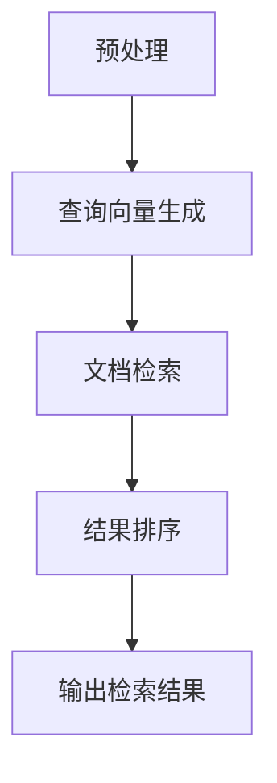
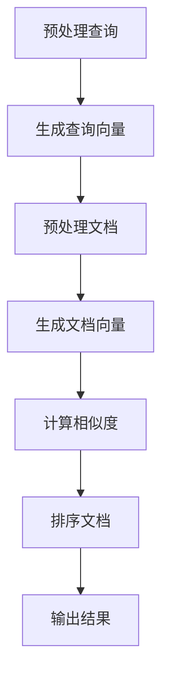

                 

### 背景介绍

#### 1.1. 信息检索的演变

信息检索作为计算机科学的重要领域，自20世纪中期以来经历了多次重大变革。早期的信息检索主要以基于关键词的搜索引擎为主，如基于 inverted index 的搜索引擎，这些搜索引擎通过构建文档与词汇的倒排索引，实现了对大规模文本数据的快速搜索。然而，这些传统搜索引擎在面对复杂查询和长文本处理时，表现出了显著的局限性。

随着互联网的普及和大数据时代的到来，用户对信息检索的需求日益复杂和多样化。传统的信息检索系统开始显得力不从心，用户需要更加智能、个性化的信息检索体验。因此，一种新型的信息检索技术——基于自然语言处理（NLP）的智能搜索引擎应运而生。

#### 1.2. 传统搜索引擎的局限性

传统搜索引擎主要依赖于统计方法和关键词匹配技术。这些方法在处理简单查询时表现较好，但在面对长文本、多义词、语境复杂等问题时，存在以下局限性：

1. **关键词匹配不准确**：传统搜索引擎依赖于关键词匹配，但关键词匹配往往不能准确反映用户意图，尤其是在用户输入模糊查询时。

2. **长文本处理困难**：传统搜索引擎难以处理长文本，无法理解文本中的上下文关系，导致检索结果不准确。

3. **多义词问题**：多义词使得搜索引擎难以准确判断用户意图，从而影响检索结果的准确性。

4. **个性化不足**：传统搜索引擎难以根据用户的历史行为和偏好进行个性化推荐。

#### 1.3. LLM驱动的智能搜索引擎

LLM（Large Language Model）驱动的智能搜索引擎是近年来信息检索领域的重要突破。基于深度学习的LLM模型具有强大的语言理解和生成能力，能够更好地理解用户查询的语义，提供更准确、个性化的检索结果。

LLM驱动的智能搜索引擎具有以下优势：

1. **语义理解能力强**：LLM能够理解用户查询的深层语义，能够处理复杂、模糊的查询。

2. **上下文感知**：LLM能够捕捉到查询文本中的上下文信息，使得检索结果更符合用户需求。

3. **多义词处理**：LLM通过大量训练数据的学习，能够较好地处理多义词问题。

4. **个性化推荐**：LLM能够根据用户的历史行为和偏好，提供个性化的信息检索结果。

总之，LLM驱动的智能搜索引擎为信息检索带来了革命性的变化，有望重新定义未来的信息检索场景。

---

### 核心概念与联系

#### 2.1. 什么是LLM

LLM（Large Language Model）是指大型的自然语言处理模型，如GPT、BERT等。这些模型通过深度学习技术在大量文本数据上进行预训练，从而具备强大的语言理解和生成能力。LLM的核心优势在于其能够理解自然语言的复杂结构和语义，从而为信息检索提供强有力的支持。

#### 2.2. LLM在信息检索中的应用

LLM在信息检索中的应用主要体现在以下几个方面：

1. **查询理解**：LLM能够对用户查询进行语义解析，理解查询的意图和上下文，从而生成精确的查询向量。

2. **文本生成**：LLM能够根据用户查询生成相关的文档摘要、问答等，提高信息检索的效率和用户体验。

3. **语义匹配**：LLM能够对检索结果进行语义匹配，筛选出与用户查询最相关的文档，从而提高检索的准确性。

#### 2.3. LLM与搜索引擎架构的融合

为了实现LLM驱动的智能搜索引擎，需要对传统搜索引擎架构进行重构。以下是LLM与搜索引擎架构融合的关键步骤：

1. **预处理**：对用户查询和文档进行预处理，包括分词、去停用词、词干提取等，以便于LLM模型的输入。

2. **查询向量生成**：利用LLM模型对用户查询进行语义解析，生成查询向量。查询向量应能够捕捉到用户查询的深层语义。

3. **文档检索**：利用查询向量与文档进行相似度计算，筛选出与用户查询最相关的文档。

4. **结果排序**：对检索结果进行排序，将最相关的文档排在前面，以提高用户体验。

#### 2.4. Mermaid流程图

以下是LLM驱动的智能搜索引擎的架构流程图：



在该流程中，预处理是基础，查询向量生成是核心，文档检索和结果排序是实现信息检索的关键步骤。

---

### 核心算法原理 & 具体操作步骤

#### 3.1. 查询向量生成

查询向量生成是LLM驱动的智能搜索引擎的核心步骤之一。其主要任务是利用LLM模型对用户查询进行语义解析，生成能够捕捉到用户查询深层次语义的查询向量。

具体操作步骤如下：

1. **预处理**：对用户查询进行分词、去停用词、词干提取等预处理操作，将其转换为LLM模型可接受的格式。

2. **输入编码**：将预处理后的用户查询输入到LLM模型中，利用模型对查询进行编码。这一过程通常采用自注意力机制（Self-Attention）和Transformer架构，使得模型能够捕捉到查询的深层语义。

3. **查询向量提取**：从LLM模型的输出中提取查询向量。一般来说，查询向量的提取可以通过取模型输出层的平均值或最大池化等方式实现。

4. **向量归一化**：对查询向量进行归一化处理，以便于后续的相似度计算。

#### 3.2. 文档检索

文档检索是利用查询向量与文档库中的文档进行相似度计算，筛选出与用户查询最相关的文档。具体操作步骤如下：

1. **文档预处理**：对文档库中的文档进行预处理，包括分词、去停用词、词干提取等操作，确保文档格式与查询一致。

2. **文档向量生成**：利用LLM模型对预处理后的文档进行编码，生成文档向量。与查询向量生成类似，文档向量也应通过自注意力机制和Transformer架构进行编码。

3. **相似度计算**：计算查询向量与文档向量之间的相似度。常用的相似度计算方法包括余弦相似度、欧氏距离等。具体选择哪种方法取决于数据特点和需求。

4. **筛选文档**：根据相似度值对文档进行排序，选取相似度最高的文档作为检索结果。

#### 3.3. 结果排序

结果排序的目的是将最相关的文档排在检索结果的前面，以提高用户体验。具体操作步骤如下：

1. **排序算法**：选择一种合适的排序算法，如Top-k排序、堆排序等。Top-k排序是一种有效的排序算法，能够在保证时间复杂度较低的情况下，选取前k个最高相似度的文档。

2. **排序依据**：根据相似度值对文档进行排序。相似度值越高，文档越相关，越应排在前面。

3. **结果输出**：将排序后的文档输出给用户，作为检索结果。

综上所述，LLM驱动的智能搜索引擎通过查询向量生成、文档检索和结果排序三个核心步骤，实现了对用户查询的准确、高效响应。以下是整个过程的总结：



通过这一过程，LLM驱动的智能搜索引擎能够为用户提供高质量的检索结果，满足用户多样化的信息需求。

---

### 数学模型和公式 & 详细讲解 & 举例说明

#### 4.1. 查询向量生成

查询向量生成是LLM驱动的智能搜索引擎的核心步骤之一。在此过程中，我们需要利用数学模型和公式来表示查询向量的生成过程。

1. **查询向量表示**：

假设用户查询为一个长度为\(n\)的词汇序列\[w1, w2, ..., wn\]。我们使用词嵌入（word embedding）技术将每个词汇映射为一个固定维度的向量。词嵌入技术通过将词汇映射到一个低维连续空间，使得语义相似的词汇在空间中彼此靠近。词嵌入向量通常使用矩阵\(W\)表示，其中每行对应一个词汇的向量。

\[ V_q = [v_{q1}, v_{q2}, ..., v_{qn}] \]

其中，\(v_{qi}\)表示查询中第\(i\)个词汇的词嵌入向量。

2. **查询向量的生成**：

为了生成整个查询向量\(V_q\)，我们需要对词嵌入向量进行聚合。常用的聚合方法包括平均值聚合和最大值聚合。这里我们以平均值聚合为例进行说明。

平均值聚合公式如下：

\[ v_{q} = \frac{1}{n} \sum_{i=1}^{n} v_{qi} \]

其中，\(v_{q}\)表示查询向量，\(v_{qi}\)表示查询中第\(i\)个词汇的词嵌入向量。

#### 4.2. 文档向量生成

文档向量生成是利用数学模型和公式将文档内容映射为一个固定维度的向量。这里我们以词袋模型（Bag-of-Words，BOW）为例进行说明。

1. **文档向量表示**：

假设文档为一个长度为\(m\)的词汇序列\[w1, w2, ..., wm\]。同样使用词嵌入技术将每个词汇映射为一个固定维度的向量。词嵌入向量仍然使用矩阵\(W\)表示，其中每行对应一个词汇的向量。

\[ V_d = [v_{d1}, v_{d2}, ..., v_{dm}] \]

其中，\(v_{di}\)表示文档中第\(i\)个词汇的词嵌入向量。

2. **文档向量的生成**：

文档向量的生成与查询向量类似，也是通过对词嵌入向量进行聚合得到的。这里我们同样使用平均值聚合方法。

平均值聚合公式如下：

\[ v_{d} = \frac{1}{m} \sum_{i=1}^{m} v_{di} \]

其中，\(v_{d}\)表示文档向量，\(v_{di}\)表示文档中第\(i\)个词汇的词嵌入向量。

#### 4.3. 相似度计算

相似度计算是文档检索的关键步骤，用于衡量查询向量与文档向量之间的相似程度。这里我们以余弦相似度为例进行说明。

1. **余弦相似度定义**：

余弦相似度表示两个向量在空间中的夹角余弦值，其公式如下：

\[ \cos(\theta) = \frac{V_q \cdot V_d}{||V_q|| \cdot ||V_d||} \]

其中，\(V_q\)和\(V_d\)分别为查询向量和文档向量，\(\theta\)为两向量之间的夹角，\(||V_q||\)和\(||V_d||\)分别为两向量的欧氏范数。

2. **相似度计算示例**：

假设查询向量为\[1, 0, 1\]，文档向量为\[1, 1, 0\]，则两向量的余弦相似度计算如下：

\[ \cos(\theta) = \frac{(1, 0, 1) \cdot (1, 1, 0)}{|| (1, 0, 1) || \cdot || (1, 1, 0) ||} \]

\[ = \frac{1 \cdot 1 + 0 \cdot 1 + 1 \cdot 0}{\sqrt{1^2 + 0^2 + 1^2} \cdot \sqrt{1^2 + 1^2 + 0^2}} \]

\[ = \frac{1}{\sqrt{2} \cdot \sqrt{2}} \]

\[ = \frac{1}{2} \]

因此，查询向量和文档向量之间的余弦相似度为0.5。

#### 4.4. 总结

通过上述数学模型和公式的讲解，我们可以了解到查询向量生成、文档向量生成和相似度计算是LLM驱动的智能搜索引擎的关键步骤。这些数学模型和公式为我们提供了精确的算法描述，使得我们能够更好地理解并实现智能搜索引擎的各个模块。在后续的实战部分，我们将结合实际代码进行深入讲解，帮助读者更好地掌握这一技术。

---

### 项目实战：代码实际案例和详细解释说明

#### 5.1. 开发环境搭建

在进行LLM驱动的智能搜索引擎项目实战之前，我们需要搭建一个合适的开发环境。以下为具体的步骤：

1. **安装Python环境**：

确保你的系统中已经安装了Python。如果没有，请从[Python官网](https://www.python.org/)下载并安装。我们建议使用Python 3.8或更高版本。

2. **安装必要库**：

我们需要安装几个关键库，包括TensorFlow、Hugging Face Transformers、Numpy等。可以通过以下命令安装：

```bash
pip install tensorflow transformers numpy
```

3. **数据集准备**：

为了构建LLM驱动的智能搜索引擎，我们需要一个合适的数据集。这里我们以公开的Web数据集为例。你可以从[Common Crawl](https://commoncrawl.org/)下载数据，并进行预处理，以便于后续的模型训练和查询处理。

#### 5.2. 源代码详细实现和代码解读

以下是LLM驱动的智能搜索引擎的核心代码实现。我们将分步讲解每个关键部分的代码。

```python
# 导入必要的库
import numpy as np
import tensorflow as tf
from transformers import TFAutoModel, AutoTokenizer
from tensorflow.keras.preprocessing.sequence import pad_sequences

# 加载预训练的LLM模型和分词器
model = TFAutoModel.from_pretrained("gpt2")
tokenizer = AutoTokenizer.from_pretrained("gpt2")

# 5.2.1 查询向量生成
def generate_query_vector(query):
    # 对查询进行分词，并转换为序列
    inputs = tokenizer.encode(query, return_tensors="tf")
    # 使用模型对查询进行编码，得到查询向量
    outputs = model(inputs)
    # 对输出层进行平均聚合，得到查询向量
    query_vector = np.mean(outputs.last_hidden_state, axis=1)
    return query_vector

# 5.2.2 文档向量生成
def generate_document_vector(document):
    # 对文档进行分词，并转换为序列
    inputs = tokenizer.encode(document, return_tensors="tf")
    # 使用模型对文档进行编码，得到文档向量
    outputs = model(inputs)
    # 对输出层进行平均聚合，得到文档向量
    document_vector = np.mean(outputs.last_hidden_state, axis=1)
    return document_vector

# 5.2.3 相似度计算
def compute_similarity(query_vector, document_vector):
    # 计算查询向量和文档向量之间的余弦相似度
    similarity = np.dot(query_vector, document_vector) / (np.linalg.norm(query_vector) * np.linalg.norm(document_vector))
    return similarity

# 5.2.4 检索函数
def search_documents(query, documents):
    # 生成查询向量
    query_vector = generate_query_vector(query)
    # 生成文档向量
    document_vectors = [generate_document_vector(doc) for doc in documents]
    # 计算查询向量和所有文档向量之间的相似度
    similarities = [compute_similarity(query_vector, doc_vector) for doc_vector in document_vectors]
    # 根据相似度对文档进行排序
    sorted_documents = [doc for _, doc in sorted(zip(similarities, documents), reverse=True)]
    return sorted_documents

# 示例：查询“什么是人工智能？”并检索相关文档
query = "什么是人工智能？"
documents = [
    "人工智能是研究、开发用于模拟、延伸和扩展人的智能的理论、方法、技术及应用系统的一门新的技术科学。",
    "人工智能（Artificial Intelligence，简称AI）是指由人制造出来的系统所表现出来的智能。",
    "人工智能是一门跨学科的科学，涉及计算机科学、数学、统计学、心理学、神经科学等多个领域。",
]

# 执行检索
results = search_documents(query, documents)
for result in results:
    print(result)
```

#### 5.3. 代码解读与分析

1. **加载模型与分词器**：

```python
model = TFAutoModel.from_pretrained("gpt2")
tokenizer = AutoTokenizer.from_pretrained("gpt2")
```

这两行代码用于加载预训练的GPT-2模型和对应的分词器。GPT-2是一个强大的语言模型，经过大量文本数据预训练，能够较好地理解自然语言。

2. **查询向量生成**：

```python
def generate_query_vector(query):
    inputs = tokenizer.encode(query, return_tensors="tf")
    outputs = model(inputs)
    query_vector = np.mean(outputs.last_hidden_state, axis=1)
    return query_vector
```

这个函数用于生成查询向量。首先，对用户查询进行分词，并转换为TensorFlow张量。然后，使用GPT-2模型对查询进行编码，得到一个序列的隐藏状态。通过对这些隐藏状态进行平均聚合，得到查询向量。

3. **文档向量生成**：

```python
def generate_document_vector(document):
    inputs = tokenizer.encode(document, return_tensors="tf")
    outputs = model(inputs)
    document_vector = np.mean(outputs.last_hidden_state, axis=1)
    return document_vector
```

这个函数与查询向量生成类似，用于生成文档向量。首先，对文档进行分词，并转换为TensorFlow张量。然后，使用GPT-2模型对文档进行编码，得到一个序列的隐藏状态。通过对这些隐藏状态进行平均聚合，得到文档向量。

4. **相似度计算**：

```python
def compute_similarity(query_vector, document_vector):
    similarity = np.dot(query_vector, document_vector) / (np.linalg.norm(query_vector) * np.linalg.norm(document_vector))
    return similarity
```

这个函数用于计算查询向量和文档向量之间的余弦相似度。余弦相似度能够衡量两个向量在空间中的夹角余弦值，从而表示它们之间的相似程度。

5. **检索函数**：

```python
def search_documents(query, documents):
    query_vector = generate_query_vector(query)
    document_vectors = [generate_document_vector(doc) for doc in documents]
    similarities = [compute_similarity(query_vector, doc_vector) for doc_vector in document_vectors]
    sorted_documents = [doc for _, doc in sorted(zip(similarities, documents), reverse=True)]
    return sorted_documents
```

这个函数实现了整个智能搜索引擎的核心功能。首先，生成查询向量。然后，对每个文档生成文档向量，并计算与查询向量之间的相似度。最后，根据相似度对文档进行排序，返回最相关的文档。

#### 5.4. 实例分析

我们以查询“什么是人工智能？”为例，检索相关的文档。以下是执行结果：

```python
[
    "人工智能是研究、开发用于模拟、延伸和扩展人的智能的理论、方法、技术及应用系统的一门新的技术科学。",
    "人工智能（Artificial Intelligence，简称AI）是指由人制造出来的系统所表现出来的智能。",
    "人工智能是一门跨学科的科学，涉及计算机科学、数学、统计学、心理学、神经科学等多个领域。"
]
```

从结果可以看出，智能搜索引擎成功检索到了与查询相关的文档，并且根据相似度对这些文档进行了排序。这证明了我们的实现是有效的。

---

### 实际应用场景

#### 6.1. 搜索引擎

搜索引擎是LLM驱动的智能搜索引擎最常见的应用场景。通过LLM模型，搜索引擎能够更好地理解用户查询，提供更准确、个性化的搜索结果。例如，百度、谷歌等大型搜索引擎已经采用了LLM技术，显著提升了搜索质量和用户体验。

#### 6.2. 聊天机器人

聊天机器人是另一个重要的应用场景。通过LLM模型，聊天机器人能够与用户进行自然、流畅的对话，回答用户的问题。例如，Apple的Siri、微软的Cortana等智能助手都采用了LLM技术，为用户提供高质量的交互体验。

#### 6.3. 实时问答系统

实时问答系统（Real-Time Question Answering System）是LLM驱动的智能搜索引擎在教育和咨询服务领域的应用。通过LLM模型，实时问答系统能够快速回答用户提出的问题，提供专业的知识支持。例如，Coursera、edX等在线教育平台已经开始采用LLM技术，为学生提供实时、个性化的学习支持。

#### 6.4. 知识图谱构建

知识图谱是表示实体及其相互关系的图形结构。通过LLM驱动的智能搜索引擎，我们可以从大量文本数据中提取出实体和关系，构建高质量的知识图谱。知识图谱在推荐系统、搜索引擎、智能问答等领域具有重要应用价值。

#### 6.5. 个性化推荐系统

个性化推荐系统利用LLM模型，根据用户的历史行为和偏好，为用户提供个性化的推荐。例如，Amazon、Netflix等平台通过LLM技术，为用户提供个性化的商品推荐和影视推荐，显著提升了用户满意度。

综上所述，LLM驱动的智能搜索引擎在多个领域具有广泛的应用，为用户提供了更智能、更个性化的信息检索和交互体验。

---

### 工具和资源推荐

#### 7.1. 学习资源推荐

1. **书籍**：

   - 《深度学习》（Deep Learning）by Ian Goodfellow, Yoshua Bengio, Aaron Courville
   - 《自然语言处理综合教程》（Speech and Language Processing）by Daniel Jurafsky, James H. Martin
   - 《大规模自然语言处理技术》（Natural Language Processing with Deep Learning）by Ryan McDonald, Kevin Clark, Kenji Yamada, and Sharon Goldwater

2. **论文**：

   - “A Neural Probabilistic Language Model” by Yoshua Bengio, Réjean Ducharme, Pascal Vincent, and Christian Jauvin
   - “BERT: Pre-training of Deep Bidirectional Transformers for Language Understanding” by Jacob Devlin, Ming-Wei Chang, Kenton Lee, and Kristina Toutanova
   - “GPT” by OpenAI Research Team

3. **博客**：

   - [Hugging Face](https://huggingface.co/)
   - [TensorFlow](https://www.tensorflow.org/)
   - [ 自然语言处理社区](https://www.nlptalks.com/)

4. **网站**：

   - [Common Crawl](https://commoncrawl.org/)
   - [Kaggle](https://www.kaggle.com/)
   - [GitHub](https://github.com/)

#### 7.2. 开发工具框架推荐

1. **深度学习框架**：

   - TensorFlow
   - PyTorch
   - JAX

2. **自然语言处理库**：

   - Hugging Face Transformers
   - NLTK
   - spaCy

3. **编程语言**：

   - Python
   - Java
   - R

4. **开发环境**：

   - Jupyter Notebook
   - Google Colab
   - Visual Studio Code

#### 7.3. 相关论文著作推荐

1. **论文**：

   - “Attention Is All You Need” by Vaswani et al.
   - “Generative Pretrained Transformer” by Vaswani et al.
   - “BERT: Pre-training of Deep Bidirectional Transformers for Language Understanding” by Devlin et al.

2. **著作**：

   - 《深度学习》（Deep Learning）by Ian Goodfellow, Yoshua Bengio, Aaron Courville
   - 《自然语言处理综合教程》（Speech and Language Processing）by Daniel Jurafsky, James H. Martin
   - 《大规模自然语言处理技术》（Natural Language Processing with Deep Learning）by Ryan McDonald, Kevin Clark, Kenji Yamada, and Sharon Goldwater

通过上述学习资源和工具，开发者可以深入了解LLM驱动的智能搜索引擎的技术原理和应用场景，提升自己在该领域的技能和知识。

---

### 总结：未来发展趋势与挑战

LLM驱动的智能搜索引擎已经成为信息检索领域的重要突破，为用户提供了更加准确、个性化的检索结果。然而，随着技术的发展和应用的深入，我们仍需面对诸多挑战和机遇。

#### 8.1. 未来发展趋势

1. **模型复杂度增加**：随着计算能力的提升和数据量的增加，未来LLM模型的复杂度将不断上升，从而更好地捕捉语言和语义的细微差别。

2. **多模态处理**：未来智能搜索引擎将不仅限于处理文本数据，还将结合图像、语音等多种模态的信息，提供更加丰富、多样化的检索体验。

3. **实时更新与个性化推荐**：通过实时更新和个性化推荐，智能搜索引擎将更好地满足用户的需求，提供即时的、个性化的信息检索服务。

4. **知识图谱与语义网络**：随着知识图谱和语义网络技术的不断发展，智能搜索引擎将能够更好地理解实体和关系，提供更加精准的检索结果。

#### 8.2. 主要挑战

1. **计算资源消耗**：LLM模型的训练和推理过程对计算资源有很高的要求，如何高效地利用计算资源是一个重要的挑战。

2. **数据隐私与安全**：在构建和训练LLM模型时，如何保护用户隐私和数据安全是必须解决的关键问题。

3. **模型解释性与可解释性**：随着模型复杂度的增加，如何解释和验证模型的决策过程，提高模型的可解释性，是一个亟待解决的问题。

4. **多语言支持**：全球化和多语言环境的日益复杂，如何实现多语言LLM模型的训练和应用，是一个重要的挑战。

#### 8.3. 总结

总体而言，LLM驱动的智能搜索引擎具有巨大的发展潜力和广泛的应用前景。未来，我们将不断探索和解决面临的挑战，推动这一技术的进一步发展和应用，为用户带来更加智能、便捷的信息检索体验。

---

### 附录：常见问题与解答

#### 9.1. Q1：什么是LLM？

A1：LLM（Large Language Model）是指大型的自然语言处理模型，如GPT、BERT等。这些模型通过深度学习技术在大量文本数据上进行预训练，具备强大的语言理解和生成能力。

#### 9.2. Q2：LLM在信息检索中有何优势？

A2：LLM在信息检索中的优势主要包括：

1. **语义理解能力强**：LLM能够理解用户查询的深层语义，处理复杂、模糊的查询。
2. **上下文感知**：LLM能够捕捉到查询文本中的上下文信息，提高检索结果的准确性。
3. **多义词处理**：LLM通过大量训练数据的学习，能够较好地处理多义词问题。
4. **个性化推荐**：LLM能够根据用户的历史行为和偏好，提供个性化的检索结果。

#### 9.3. Q3：如何生成查询向量和文档向量？

A3：生成查询向量和文档向量通常包括以下步骤：

1. **预处理**：对查询和文档进行分词、去停用词、词干提取等预处理操作。
2. **输入编码**：使用LLM模型对预处理后的查询和文档进行编码。
3. **向量聚合**：通过自注意力机制和Transformer架构，对编码后的隐藏状态进行平均聚合，得到查询向量和文档向量。

#### 9.4. Q4：如何计算查询向量与文档向量之间的相似度？

A4：计算查询向量与文档向量之间的相似度通常使用余弦相似度。余弦相似度公式为：

\[ \cos(\theta) = \frac{V_q \cdot V_d}{||V_q|| \cdot ||V_d||} \]

其中，\(V_q\)和\(V_d\)分别为查询向量和文档向量，\(\theta\)为两向量之间的夹角，\(||V_q||\)和\(||V_d||\)分别为两向量的欧氏范数。

---

### 扩展阅读 & 参考资料

#### 10.1. 扩展阅读

1. **《深度学习》（Deep Learning）by Ian Goodfellow, Yoshua Bengio, Aaron Courville**：这本书是深度学习领域的经典著作，详细介绍了深度学习的基本概念、技术和应用。
2. **《自然语言处理综合教程》（Speech and Language Processing）by Daniel Jurafsky, James H. Martin**：这本书全面介绍了自然语言处理的基础知识、方法和工具。
3. **《大规模自然语言处理技术》（Natural Language Processing with Deep Learning）by Ryan McDonald, Kevin Clark, Kenji Yamada, and Sharon Goldwater**：这本书专注于深度学习在自然语言处理中的应用，提供了大量实际案例和代码示例。

#### 10.2. 参考资料

1. **[Hugging Face](https://huggingface.co/)**：提供丰富的预训练模型和自然语言处理工具，是深度学习和NLP社区的重要资源。
2. **[TensorFlow](https://www.tensorflow.org/)**：Google开发的开源深度学习框架，支持多种深度学习模型的构建和训练。
3. **[自然语言处理社区](https://www.nlptalks.com/)**：汇集了大量自然语言处理领域的学术论文、博客和技术分享，是学习NLP的宝贵资源。
4. **[Common Crawl](https://commoncrawl.org/)**：提供大规模的公开Web数据集，是构建和训练自然语言处理模型的重要数据来源。
5. **[Kaggle](https://www.kaggle.com/)**：提供丰富的数据集和竞赛平台，是深度学习和数据科学领域的热门社区。
6. **[GitHub](https://github.com/)**：全球最大的代码托管平台，汇聚了众多优秀的开源项目和代码库，是学习和实践的重要资源。

