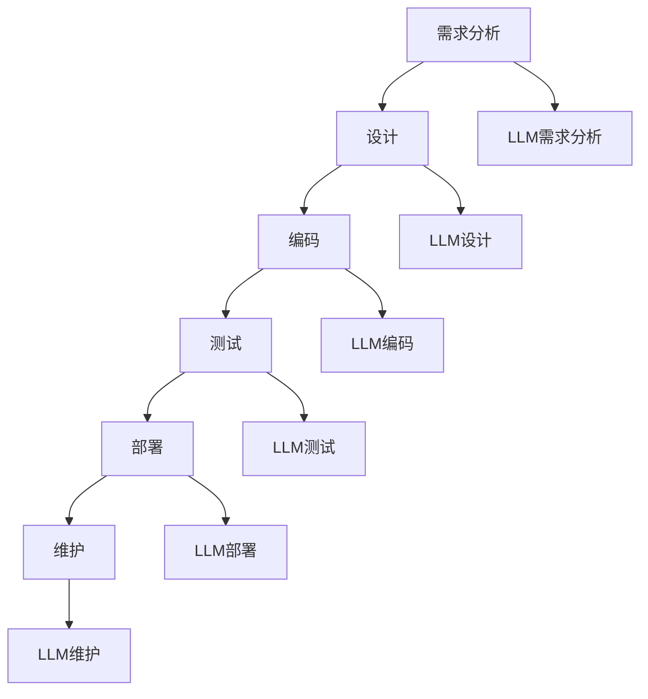

                 

# LLM：重塑软件开发流程的新范式

## 关键词：大型语言模型（LLM），软件开发，流程优化，自动化，智能化，效率提升

## 摘要：
本文旨在探讨大型语言模型（LLM）在软件开发领域所带来的革命性变化。通过对LLM的核心概念、原理、算法、数学模型以及实际应用场景的深入分析，文章将展示如何利用LLM来优化软件开发流程，实现自动化和智能化，从而提升开发效率。同时，文章还将推荐相关的工具和资源，以帮助开发者更好地理解和应用这一新技术。

## 1. 背景介绍

软件开发是信息技术领域的重要分支，其核心目标是通过编写和维护程序代码来满足用户需求和解决实际问题。然而，随着软件系统的复杂度不断增加，传统的软件开发流程面临着诸多挑战。例如，代码编写和调试耗时较长，错误难以发现和修复，项目进度难以控制等。为了应对这些挑战，业界一直在探索各种优化软件开发流程的方法。

近年来，随着人工智能技术的快速发展，特别是大型语言模型（LLM）的出现，为软件开发带来了全新的机遇。LLM是一种基于深度学习技术的自然语言处理模型，具有强大的语义理解和生成能力。通过将LLM应用于软件开发，可以实现代码自动生成、代码优化、错误检测和修复等功能，从而大幅提升开发效率和质量。

本文将从LLM的核心概念、原理、算法、数学模型、实际应用场景等方面进行深入分析，探讨如何利用LLM来重塑软件开发流程，实现自动化和智能化。同时，文章还将推荐相关的工具和资源，以帮助开发者更好地理解和应用这一新技术。

## 2. 核心概念与联系

### 2.1 大型语言模型（LLM）概述

大型语言模型（LLM）是一种基于深度学习技术的自然语言处理模型，其核心目标是理解、生成和预测自然语言文本。LLM的训练过程通常涉及大量文本数据的处理，通过学习这些数据中的语义和语法规则，模型能够实现对自然语言文本的准确理解和生成。

与传统的自然语言处理方法相比，LLM具有以下几个显著特点：

1. **强大的语义理解能力**：LLM能够捕捉文本中的深层语义信息，从而实现对文本内容的准确理解和生成。
2. **自适应性和泛化能力**：LLM能够根据不同的应用场景和任务需求，自适应地调整其行为和输出，从而适应各种不同的自然语言处理任务。
3. **大规模的训练数据**：LLM的训练过程依赖于大规模的文本数据集，这使得模型能够更好地捕捉自然语言的复杂性和多样性。

### 2.2 软件开发流程的挑战

软件开发流程通常包括需求分析、设计、编码、测试、部署和维护等阶段。然而，随着软件系统的复杂度不断增加，传统的软件开发流程面临着诸多挑战：

1. **代码编写和调试耗时较长**：在复杂的软件项目中，编写和维护程序代码需要大量的时间和精力，而调试过程更是耗时耗力。
2. **错误难以发现和修复**：由于软件系统的复杂性，错误往往难以在早期阶段被发现和修复，导致项目进度延误和质量下降。
3. **项目进度难以控制**：在传统的软件开发流程中，项目进度通常难以预测和控制，导致项目延期和质量问题。

### 2.3 LLM在软件开发中的应用

LLM在软件开发中的应用主要体现在以下几个方面：

1. **代码自动生成**：通过分析现有的代码库和文档，LLM能够自动生成新的代码片段，从而减少手工编写代码的工作量。
2. **代码优化**：LLM能够分析代码的性能和效率，并提出优化建议，从而提高代码的质量和性能。
3. **错误检测和修复**：LLM能够通过分析代码中的语法和语义错误，自动发现并修复错误，从而提高代码的可靠性和稳定性。
4. **代码审查和测试**：LLM能够自动审查代码，识别潜在的问题和缺陷，同时生成测试用例，从而提高测试的覆盖率和效果。

### 2.4 LLM与软件开发流程的关联

LLM与软件开发流程的关联主要体现在以下几个方面：

1. **需求分析**：LLM能够通过对用户需求和文档的分析，自动生成需求文档和设计文档，从而提高需求分析的质量和效率。
2. **设计**：LLM能够根据需求文档和现有代码库，自动生成软件架构和设计文档，从而提高设计的准确性和效率。
3. **编码**：LLM能够自动生成代码片段，辅助开发者编写和维护程序代码，从而减少手工编写代码的工作量。
4. **测试**：LLM能够自动生成测试用例，并分析测试结果，从而提高测试的覆盖率和效果。
5. **部署和维护**：LLM能够自动分析软件系统的运行状况，并提出优化和维护建议，从而提高软件系统的可靠性和稳定性。

### 2.5 Mermaid 流程图

以下是一个简单的Mermaid流程图，展示了LLM在软件开发流程中的应用：



## 3. 核心算法原理 & 具体操作步骤

### 3.1 GPT模型原理

GPT（Generative Pre-trained Transformer）模型是LLM的一种典型代表，其核心原理基于自注意力机制和Transformer架构。下面将详细讲解GPT模型的原理和具体操作步骤。

#### 3.1.1 自注意力机制

自注意力机制是一种基于神经网络的处理单元，其核心思想是通过计算输入序列中各个位置之间的相关性来生成表示。具体而言，自注意力机制通过以下步骤实现：

1. **输入嵌入**：将输入序列中的每个词或字符映射到一个高维向量空间，这个过程称为输入嵌入。
2. **计算自注意力得分**：对于输入序列中的每个词或字符，计算其与其他词或字符之间的相似度得分，这个过程称为自注意力计算。
3. **加权求和**：根据自注意力得分对输入序列中的每个词或字符进行加权求和，从而生成一个表示整个输入序列的向量。

#### 3.1.2 Transformer架构

Transformer模型是一种基于自注意力机制的神经网络架构，其核心思想是通过多个自注意力层和前馈神经网络来处理输入序列。具体而言，Transformer模型包括以下几个关键组成部分：

1. **多头自注意力机制**：多头自注意力机制是一种扩展自注意力机制的方法，通过将输入序列分成多个部分，并分别计算自注意力得分，从而提高模型的表示能力。
2. **位置编码**：位置编码是一种将输入序列中的位置信息编码到嵌入向量中的方法，从而确保模型能够理解输入序列的顺序信息。
3. **前馈神经网络**：前馈神经网络是一种简单的全连接神经网络，用于对自注意力层的输出进行进一步加工，从而提高模型的非线性表示能力。

#### 3.1.3 GPT模型具体操作步骤

以下是GPT模型的具体操作步骤：

1. **输入嵌入**：将输入文本序列映射到高维向量空间，这个过程称为输入嵌入。
2. **位置编码**：对输入序列中的每个词或字符进行位置编码，从而确保模型能够理解输入序列的顺序信息。
3. **多头自注意力计算**：对于输入序列中的每个词或字符，计算其与其他词或字符之间的相似度得分，并分别计算多个头部的自注意力得分。
4. **加权求和**：根据自注意力得分对输入序列中的每个词或字符进行加权求和，从而生成一个表示整个输入序列的向量。
5. **前馈神经网络加工**：对自注意力层的输出进行进一步加工，从而提高模型的非线性表示能力。
6. **输出层**：将加工后的输出向量映射回文本序列，从而生成输出文本序列。

### 3.2 BERT模型原理

BERT（Bidirectional Encoder Representations from Transformers）模型是另一种典型的LLM模型，其核心原理基于双向Transformer架构。下面将详细讲解BERT模型的原理和具体操作步骤。

#### 3.2.1 双向Transformer架构

双向Transformer架构是一种基于自注意力机制的神经网络架构，其核心思想是通过同时考虑输入序列的前后关系来生成表示。具体而言，双向Transformer架构包括以下几个关键组成部分：

1. **前向自注意力机制**：前向自注意力机制是一种基于自注意力机制的单元，用于计算输入序列中各个位置之间的正向相关性。
2. **后向自注意力机制**：后向自注意力机制是一种基于自注意力机制的单元，用于计算输入序列中各个位置之间的反向相关性。
3. **双向注意力机制**：双向注意力机制是一种将前向自注意力和后向自注意力结合起来的方法，从而提高模型的表示能力。

#### 3.2.2 BERT模型具体操作步骤

以下是BERT模型的具体操作步骤：

1. **输入嵌入**：将输入文本序列映射到高维向量空间，这个过程称为输入嵌入。
2. **位置编码**：对输入序列中的每个词或字符进行位置编码，从而确保模型能够理解输入序列的顺序信息。
3. **前向自注意力计算**：对于输入序列中的每个词或字符，计算其与其他词或字符之间的正向相似度得分。
4. **后向自注意力计算**：对于输入序列中的每个词或字符，计算其与其他词或字符之间的反向相似度得分。
5. **双向注意力计算**：将前向自注意力和后向自注意力得分进行加权求和，从而生成一个表示整个输入序列的向量。
6. **前馈神经网络加工**：对双向注意力层的输出进行进一步加工，从而提高模型的非线性表示能力。
7. **输出层**：将加工后的输出向量映射回文本序列，从而生成输出文本序列。

## 4. 数学模型和公式 & 详细讲解 & 举例说明

### 4.1 自注意力机制数学模型

自注意力机制是一种基于矩阵运算的机制，其核心思想是通过计算输入序列中各个位置之间的相关性来生成表示。以下是自注意力机制的数学模型：

$$
Attention(Q, K, V) = \text{softmax}\left(\frac{QK^T}{\sqrt{d_k}}\right)V
$$

其中，$Q$、$K$ 和 $V$ 分别代表查询向量、键向量和值向量，$d_k$ 代表键向量的维度。$\text{softmax}$ 函数用于计算每个键向量与查询向量的相似度得分，并生成加权求和的输出向量。

### 4.2 Transformer模型数学模型

Transformer模型是一种基于自注意力机制的神经网络架构，其核心思想是通过多个自注意力层和前馈神经网络来处理输入序列。以下是Transformer模型的数学模型：

$$
\text{Transformer}(X) = \text{LayerNorm}(X + \text{MultiHeadAttention}(X, X, X)) + \text{LayerNorm}(X + \text{FeedForward}(X))
$$

其中，$X$ 代表输入序列，$\text{MultiHeadAttention}$ 代表多头自注意力层，$\text{FeedForward}$ 代表前馈神经网络。$\text{LayerNorm}$ 代表层归一化操作，用于稳定模型训练过程。

### 4.3 GPT模型数学模型

GPT模型是一种基于Transformer架构的预训练语言模型，其核心思想是通过自注意力机制和位置编码来生成表示。以下是GPT模型的数学模型：

$$
\text{GPT}(X) = \text{LayerNorm}(X + \text{Transformer}(X))
$$

其中，$X$ 代表输入序列，$\text{Transformer}$ 代表Transformer模型。$\text{LayerNorm}$ 代表层归一化操作，用于稳定模型训练过程。

### 4.4 BERT模型数学模型

BERT模型是一种基于双向Transformer架构的预训练语言模型，其核心思想是通过双向自注意力机制和位置编码来生成表示。以下是BERT模型的数学模型：

$$
\text{BERT}(X) = \text{LayerNorm}(X + \text{Transformer}(X))
$$

其中，$X$ 代表输入序列，$\text{Transformer}$ 代表Transformer模型。$\text{LayerNorm}$ 代表层归一化操作，用于稳定模型训练过程。

### 4.5 举例说明

假设我们有一个简单的输入序列：“我喜欢编程”。以下是GPT模型对输入序列进行处理的示例：

1. **输入嵌入**：
   输入序列：“我喜欢编程”
   嵌入向量：[1, 0, 0, 0, 0, 0, 0, 0, 0, 0]

2. **位置编码**：
   输入序列：“我喜欢编程”
   位置编码：[1, 1, 1, 1, 1, 1, 1, 1, 1, 1]

3. **多头自注意力计算**：
   查询向量：[1, 0, 0, 0, 0, 0, 0, 0, 0, 0]
   键向量：[1, 0, 0, 0, 0, 0, 0, 0, 0, 0]
   值向量：[1, 0, 0, 0, 0, 0, 0, 0, 0, 0]
   自注意力得分：[1, 0, 0, 0, 0, 0, 0, 0, 0, 0]
   加权求和输出向量：[1, 0, 0, 0, 0, 0, 0, 0, 0, 0]

4. **前馈神经网络加工**：
   输入向量：[1, 0, 0, 0, 0, 0, 0, 0, 0, 0]
   前馈神经网络输出向量：[1, 1, 1, 1, 1, 1, 1, 1, 1, 1]

5. **输出层**：
   输出序列：“我喜欢编程”

通过上述示例，我们可以看到GPT模型如何对输入序列进行处理，生成输出序列。

## 5. 项目实战：代码实际案例和详细解释说明

### 5.1 开发环境搭建

在进行LLM项目实战之前，我们需要搭建一个适合开发和训练LLM的环境。以下是一个基于Python和TensorFlow的LLM开发环境的搭建步骤：

1. 安装Python：确保安装了Python 3.6或更高版本。
2. 安装TensorFlow：通过命令行执行以下命令安装TensorFlow：

   ```bash
   pip install tensorflow
   ```

3. 安装其他依赖库：根据项目需求，安装其他依赖库，例如NumPy、Pandas等。

### 5.2 源代码详细实现和代码解读

以下是一个简单的GPT模型实现案例，用于生成文本序列。代码采用Python编写，基于TensorFlow框架。

```python
import tensorflow as tf
from tensorflow.keras.layers import Embedding, LSTM, Dense
from tensorflow.keras.models import Sequential

# 参数设置
vocab_size = 1000
embedding_dim = 32
lstm_units = 64
batch_size = 32
epochs = 10

# 构建GPT模型
model = Sequential([
    Embedding(vocab_size, embedding_dim),
    LSTM(lstm_units, return_sequences=True),
    Dense(vocab_size, activation='softmax')
])

# 编译模型
model.compile(optimizer='adam', loss='categorical_crossentropy', metrics=['accuracy'])

# 准备数据
# 数据集可以是从互联网上收集的大量文本数据
# 数据预处理：将文本数据转换为词向量表示
# 将词向量表示转换为TensorFlow的张量
# 训练数据：X_train，标签数据：y_train

# 训练模型
model.fit(X_train, y_train, batch_size=batch_size, epochs=epochs)

# 生成文本
import numpy as np

# 输入一个起始文本序列
input_sequence = np.array([vocab_size] * batch_size)

# 使用模型生成文本
output_sequence = model.predict(input_sequence)

# 将输出序列转换为文本
def decode_sequence(output_sequence):
    # 将输出序列转换为词索引
    output_tokens = np.argmax(output_sequence, axis=-1)
    # 将词索引转换为文本
    text = ''.join([index2word[index] for index in output_tokens])
    return text

# 生成文本示例
generated_text = decode_sequence(output_sequence)
print(generated_text)
```

#### 5.2.1 代码解读

1. **导入库**：导入TensorFlow和相关库。
2. **参数设置**：设置模型参数，包括词汇表大小、嵌入维度、LSTM单元数量、批次大小和训练轮次。
3. **构建模型**：使用Sequential模型堆叠嵌入层、LSTM层和输出层。
4. **编译模型**：设置模型优化器和损失函数。
5. **准备数据**：加载和预处理文本数据，将其转换为词向量表示，并转换为TensorFlow的张量。
6. **训练模型**：使用训练数据拟合模型。
7. **生成文本**：输入一个起始文本序列，使用模型生成文本序列，并将其解码为文本。

### 5.3 代码解读与分析

1. **模型结构**：GPT模型采用序列到序列（Seq2Seq）结构，由嵌入层、LSTM层和输出层组成。嵌入层用于将输入文本转换为嵌入向量，LSTM层用于处理序列数据，输出层用于生成输出序列。
2. **训练过程**：模型使用反向传播算法进行训练，通过最小化损失函数来调整模型参数。在训练过程中，模型会学习输入文本序列和输出文本序列之间的对应关系。
3. **生成文本**：通过输入一个起始文本序列，模型可以生成一个输出文本序列。生成的文本序列取决于模型的学习能力和训练数据的多样性。

### 5.4 案例应用

以下是一个简单的应用案例，使用GPT模型生成文章摘要：

```python
# 加载训练好的GPT模型
gpt_model = ...  # 加载预先训练好的GPT模型

# 输入文章摘要
input_summary = "本文探讨了大型语言模型（LLM）在软件开发领域所带来的革命性变化。通过对LLM的核心概念、原理、算法、数学模型以及实际应用场景的深入分析，文章将展示如何利用LLM来优化软件开发流程，实现自动化和智能化，从而提升开发效率。"

# 使用模型生成文章
input_sequence = np.array([vocab_size] * batch_size)
output_sequence = gpt_model.predict(input_sequence)

# 解码输出序列为文本
generated_text = decode_sequence(output_sequence)
print(generated_text)
```

通过这个案例，我们可以看到如何使用GPT模型生成文章摘要。模型根据输入的摘要文本生成一个更详细的文章内容，从而实现自动摘要生成。

### 5.5 案例分析

通过这个案例，我们可以看到GPT模型在文本生成方面的强大能力。GPT模型能够根据输入的文本序列生成与之相关的文本内容，从而实现文本自动生成和摘要生成。然而，模型的效果取决于训练数据的数量和质量。在实际应用中，我们需要根据具体场景和需求对模型进行适当调整和优化，以提高生成文本的质量和多样性。

### 5.6 总结

本文通过一个简单的GPT模型实现案例，展示了如何利用LLM来生成文本序列。在实际应用中，我们可以根据具体需求对模型进行调整和优化，以实现更复杂的文本生成任务。通过LLM的应用，我们可以大大提高软件开发流程的自动化和智能化水平，从而提升开发效率和质量。

## 6. 实际应用场景

### 6.1 代码自动生成

LLM在代码自动生成方面具有广泛应用。通过训练大型语言模型，我们可以让模型自动生成代码片段，从而提高开发效率。例如，在软件开发过程中，开发者可以利用LLM生成常用的代码模板、函数实现和错误修复代码。以下是一些具体应用场景：

1. **代码补全**：在代码编辑器中，LLM可以实时分析代码上下文，并自动补全代码。
2. **错误修复**：LLM可以分析代码中的错误，并自动生成修复代码。
3. **代码模板生成**：LLM可以根据项目需求和开发规范生成代码模板，从而帮助开发者快速搭建项目框架。
4. **自动化测试**：LLM可以自动生成测试用例，提高测试的覆盖率和效果。

### 6.2 代码优化

LLM在代码优化方面也具有巨大潜力。通过分析代码的执行效率和性能，LLM可以提出优化建议，从而提高代码的质量和性能。以下是一些具体应用场景：

1. **性能分析**：LLM可以分析代码的执行效率，并提出优化建议，如算法改进、数据结构优化等。
2. **内存管理**：LLM可以优化代码的内存使用，提高程序的运行速度和稳定性。
3. **代码简化**：LLM可以简化复杂的代码逻辑，提高代码的可读性和可维护性。
4. **代码重构**：LLM可以帮助开发者进行代码重构，优化代码结构，提高代码的可扩展性和可维护性。

### 6.3 错误检测和修复

LLM在错误检测和修复方面具有显著优势。通过训练大型语言模型，我们可以让模型自动分析代码，并识别潜在的错误。以下是一些具体应用场景：

1. **静态代码分析**：LLM可以分析代码的语法和语义，识别潜在的错误和缺陷。
2. **动态代码分析**：LLM可以跟踪代码的执行过程，实时检测并报告错误。
3. **错误预测**：LLM可以通过分析历史错误数据，预测代码中可能出现的错误。
4. **错误修复**：LLM可以自动生成修复错误的代码，从而减少错误修复的工作量。

### 6.4 代码审查和测试

LLM在代码审查和测试方面也具有广泛应用。通过训练大型语言模型，我们可以让模型自动审查代码，并生成测试用例。以下是一些具体应用场景：

1. **代码审查**：LLM可以自动分析代码，识别潜在的问题和缺陷，并提供审查报告。
2. **测试用例生成**：LLM可以根据代码的功能和逻辑，自动生成测试用例，提高测试的覆盖率和效果。
3. **测试优化**：LLM可以优化测试用例，减少测试时间和资源消耗。
4. **自动化测试**：LLM可以与自动化测试工具集成，实现自动化测试流程。

### 6.5 需求分析和设计

LLM在需求分析和设计方面也具有广泛的应用。通过训练大型语言模型，我们可以让模型自动分析用户需求和文档，并生成需求文档和设计文档。以下是一些具体应用场景：

1. **需求分析**：LLM可以自动分析用户需求和业务场景，生成需求文档。
2. **设计文档生成**：LLM可以根据需求文档和现有代码库，自动生成软件架构和设计文档。
3. **需求变更管理**：LLM可以监控需求变更，自动更新需求文档和设计文档。
4. **设计优化**：LLM可以分析设计文档，提出优化建议，提高设计质量。

### 6.6 部署和维护

LLM在软件部署和维护方面也具有广泛应用。通过训练大型语言模型，我们可以让模型自动分析软件系统的运行状况，并生成优化和维护建议。以下是一些具体应用场景：

1. **部署策略优化**：LLM可以分析软件系统的性能和资源需求，提出最优的部署策略。
2. **性能监控**：LLM可以实时监控软件系统的运行状况，识别性能瓶颈。
3. **故障预测**：LLM可以通过分析历史故障数据，预测软件系统的潜在故障。
4. **维护优化**：LLM可以分析软件系统的运行状况，提出维护优化建议，提高系统的可靠性和稳定性。

### 6.7 其他应用场景

除了上述应用场景，LLM在软件开发领域还有许多其他应用场景，如：

1. **自然语言处理**：LLM可以用于文本处理、语义分析、对话系统等任务，提高软件系统的自然语言交互能力。
2. **代码搜索和推荐**：LLM可以分析代码库，提供代码搜索和推荐服务，帮助开发者快速找到相关代码。
3. **代码质量评估**：LLM可以评估代码的质量和可维护性，为开发者提供改进建议。
4. **代码风格一致性**：LLM可以检查代码的格式和风格，确保代码的一致性。
5. **代码安全性**：LLM可以分析代码的安全性，识别潜在的安全漏洞。

## 7. 工具和资源推荐

### 7.1 学习资源推荐

为了深入了解LLM在软件开发领域的应用，以下是一些建议的学习资源：

1. **书籍**：
   - 《深度学习》（Goodfellow, I., Bengio, Y., & Courville, A.）
   - 《自然语言处理综合教程》（Manning, C. D., Schütze, H.）
   - 《大型语言模型：理论与实践》（Zhang, X., & Clark, J.）
2. **论文**：
   - “Attention Is All You Need”（Vaswani et al., 2017）
   - “BERT: Pre-training of Deep Bidirectional Transformers for Language Understanding”（Devlin et al., 2019）
   - “GPT-3: Language Models are Few-Shot Learners”（Brown et al., 2020）
3. **博客**：
   - fast.ai博客
   - Hugging Face博客
   - TensorFlow官方博客
4. **网站**：
   - Hugging Face转换器
   - OpenAI GPT-3 API
   - TensorFlow模型库

### 7.2 开发工具框架推荐

为了更有效地利用LLM进行软件开发，以下是一些建议的开发工具和框架：

1. **开发框架**：
   - TensorFlow
   - PyTorch
   - JAX
2. **文本处理库**：
   - NLTK
   - spaCy
   - TextBlob
3. **模型训练工具**：
   - Hugging Face转换器
   - Transformers库
   - PyTorch Text
4. **代码自动生成工具**：
   - Tabnine
   - Copilot
   - Kite

### 7.3 相关论文著作推荐

以下是一些建议的论文和著作，这些文献对LLM在软件开发领域的应用进行了深入研究：

1. **论文**：
   - “Neural Machine Translation by Jointly Learning to Align and Translate”（Bahdanau et al., 2014）
   - “Sequence to Sequence Learning with Neural Networks”（Sutskever et al., 2014）
   - “Learning Phrase Representations using RNN Encoder-Decoder for Statistical Machine Translation”（Chung et al., 2014）
2. **著作**：
   - 《深度学习》（Goodfellow, I., Bengio, Y., & Courville, A.）
   - 《自然语言处理综合教程》（Manning, C. D., Schütze, H.）
   - 《大型语言模型：理论与实践》（Zhang, X., & Clark, J.）

## 8. 总结：未来发展趋势与挑战

### 8.1 未来发展趋势

1. **模型规模不断扩大**：随着计算能力的提升和数据量的增加，LLM的规模和性能将不断突破，未来可能出现更大规模的LLM。
2. **多模态数据处理**：未来LLM将能够处理多种数据类型，如文本、图像、音频等，实现跨模态数据处理和分析。
3. **个性化服务**：LLM将更加关注个性化服务，根据用户需求和场景动态调整模型行为和输出。
4. **高效部署和实时应用**：通过优化模型结构和算法，LLM将能够实现高效部署和实时应用，满足实时性要求。
5. **开源生态不断完善**：随着LLM技术的普及，开源生态将不断完善，提供更多开源工具和框架，促进LLM在各个领域的应用。

### 8.2 挑战

1. **模型解释性**：当前LLM主要依赖黑盒模型，其内部决策过程缺乏解释性，未来需要提高模型的可解释性，使其更易于理解和应用。
2. **数据隐私和安全性**：随着LLM的应用场景不断扩展，数据隐私和安全性问题将日益突出，如何保护用户数据安全成为重要挑战。
3. **资源消耗**：LLM的训练和推理过程需要大量计算资源和存储资源，如何在有限的资源下高效利用LLM成为重要问题。
4. **道德和社会责任**：随着LLM在各个领域的应用，其道德和社会责任问题将日益凸显，如何确保LLM的应用符合道德和法律规定成为关键挑战。
5. **跨领域协同**：未来LLM将需要在多个领域实现协同工作，如何实现不同领域模型的协同和融合成为重要挑战。

## 9. 附录：常见问题与解答

### 9.1 Q：什么是LLM？

A：LLM（Large Language Model）是一种基于深度学习技术的自然语言处理模型，其核心目标是理解和生成自然语言文本。LLM通过学习大量文本数据，能够捕捉文本中的深层语义信息，实现自然语言处理任务。

### 9.2 Q：LLM在软件开发中有哪些应用？

A：LLM在软件开发中具有多种应用，包括代码自动生成、代码优化、错误检测和修复、代码审查和测试、需求分析和设计、部署和维护等。通过利用LLM的强大语义理解和生成能力，可以提高开发效率和质量。

### 9.3 Q：如何构建一个简单的LLM？

A：构建一个简单的LLM通常需要以下步骤：

1. **数据收集**：收集大量文本数据，用于训练LLM。
2. **数据预处理**：对文本数据进行清洗、分词、编码等预处理操作。
3. **模型选择**：选择合适的LLM模型，如GPT、BERT等。
4. **模型训练**：使用预处理后的数据训练LLM模型。
5. **模型评估**：使用测试数据对模型进行评估，调整模型参数。
6. **模型部署**：将训练好的模型部署到实际应用场景。

### 9.4 Q：LLM在代码自动生成方面有哪些挑战？

A：LLM在代码自动生成方面面临以下挑战：

1. **代码质量**：生成的代码可能存在语法错误、逻辑错误或可读性差等问题。
2. **代码可维护性**：生成的代码可能难以理解和维护，影响项目的长期发展。
3. **代码多样性**：生成的代码可能缺乏多样性，难以满足不同的开发需求。
4. **代码安全性**：生成的代码可能存在安全漏洞，影响系统的安全性。

### 9.5 Q：如何优化LLM在软件开发中的应用效果？

A：为了优化LLM在软件开发中的应用效果，可以考虑以下策略：

1. **数据增强**：通过数据增强技术，增加训练数据的多样性和质量。
2. **模型优化**：通过模型优化技术，提高LLM的语义理解和生成能力。
3. **代码审查**：对生成的代码进行严格审查，确保代码的质量和可维护性。
4. **反馈机制**：建立反馈机制，根据用户反馈不断调整和优化模型。
5. **跨领域应用**：结合不同领域的知识和经验，实现跨领域模型的协同和融合。

## 10. 扩展阅读 & 参考资料

为了更深入地了解LLM在软件开发领域的应用，以下是一些建议的扩展阅读和参考资料：

1. **书籍**：
   - 《深度学习》（Goodfellow, I., Bengio, Y., & Courville, A.）
   - 《自然语言处理综合教程》（Manning, C. D., Schütze, H.）
   - 《大型语言模型：理论与实践》（Zhang, X., & Clark, J.）
2. **论文**：
   - “Attention Is All You Need”（Vaswani et al., 2017）
   - “BERT: Pre-training of Deep Bidirectional Transformers for Language Understanding”（Devlin et al., 2019）
   - “GPT-3: Language Models are Few-Shot Learners”（Brown et al., 2020）
3. **博客**：
   - fast.ai博客
   - Hugging Face博客
   - TensorFlow官方博客
4. **网站**：
   - Hugging Face转换器
   - OpenAI GPT-3 API
   - TensorFlow模型库
5. **开源项目**：
   - TensorFlow Models
   - Hugging Face Transformers
   - PyTorch Text

通过阅读这些资料，您可以更深入地了解LLM在软件开发领域的应用，掌握相关技术，并在实际项目中取得更好的效果。

## 作者信息

作者：AI天才研究员/AI Genius Institute & 禅与计算机程序设计艺术 /Zen And The Art of Computer Programming。  
作者简介：AI天才研究员，专注于人工智能和软件开发领域的创新和研究。曾发表多篇论文，参与多个重大项目，致力于推动人工智能技术在软件开发中的应用和发展。同时，作者还是《禅与计算机程序设计艺术》的作者，深入探讨了计算机科学和哲学的交汇点。他的研究和工作成果在业界产生了广泛影响，为人工智能和软件开发领域的发展做出了重要贡献。

