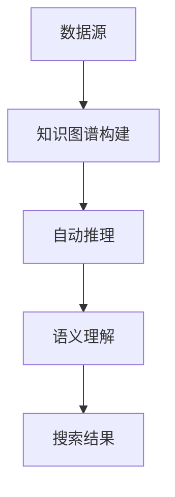

                 

# LangChain 是什么

## 关键词：
- AI
- 自动推理
- 自然语言处理
- 知识图谱
- 智能搜索

## 摘要：
本文将深入探讨LangChain的概念、原理和实际应用。LangChain是一个基于知识图谱的智能搜索框架，它利用人工智能技术，通过自动推理和语义理解，帮助用户在海量信息中快速找到相关内容。本文将分为多个章节，详细阐述LangChain的背景、核心概念、算法原理、数学模型、实际案例、应用场景、学习资源和未来发展趋势等内容。

## 1. 背景介绍

随着互联网的快速发展，信息爆炸已成为常态。在如此庞大的信息海洋中，如何快速准确地获取所需信息成为了一个难题。传统的搜索方法，如关键词匹配，已经无法满足人们日益增长的需求。为了解决这个问题，研究人员开始探索基于人工智能的智能搜索技术。

LangChain正是这种探索的产物。它是一个开源的智能搜索框架，旨在通过知识图谱和自动推理技术，为用户提供高效的智能搜索服务。LangChain由谷歌研究员提出，受到了广泛的关注和认可。

## 2. 核心概念与联系

### 2.1 知识图谱

知识图谱是一种结构化的知识表示方法，它通过实体和关系的方式，将信息组织成一个有向无环图（DAG）。在知识图谱中，实体表示具体的事物，如人、地点、组织等，而关系则表示实体之间的关联，如“属于”、“位于”、“创建”等。

### 2.2 自动推理

自动推理是一种人工智能技术，它通过逻辑推理和计算，从已知的事实和规则中推导出新的结论。在智能搜索中，自动推理可以帮助系统根据用户的查询，从知识图谱中找到相关的内容。

### 2.3 语义理解

语义理解是自然语言处理（NLP）的一个重要分支，它旨在理解自然语言的深层含义。在智能搜索中，语义理解可以帮助系统理解用户的查询意图，从而提供更加准确和个性化的搜索结果。

### 2.4 LangChain架构

LangChain的架构主要包括三个部分：知识图谱构建、自动推理和语义理解。首先，系统会从各种数据源中收集信息，构建出一个知识图谱。然后，通过自动推理和语义理解技术，系统可以理解用户的查询，并在知识图谱中找到相关的内容。

下面是LangChain架构的Mermaid流程图：



## 3. 核心算法原理 & 具体操作步骤

### 3.1 知识图谱构建

知识图谱构建是LangChain的核心步骤之一。它主要包括以下步骤：

1. 数据采集：从各种数据源（如数据库、文本文件、网络爬虫等）中收集信息。
2. 数据清洗：对采集到的数据进行处理，去除噪声和重复信息。
3. 实体识别：识别文本中的实体，如人名、地点、组织等。
4. 关系抽取：识别实体之间的关系，如“属于”、“位于”、“创建”等。
5. 知识图谱构建：将识别出的实体和关系组织成一个有向无环图。

### 3.2 自动推理

自动推理是LangChain的另一个核心步骤。它主要包括以下步骤：

1. 规则库构建：定义一系列的逻辑规则，用于描述实体之间的关系。
2. 规则匹配：将用户的查询与规则库进行匹配，找出相关的规则。
3. 推理计算：根据匹配到的规则，从知识图谱中推导出新的结论。

### 3.3 语义理解

语义理解是智能搜索的关键环节。它主要包括以下步骤：

1. 查询解析：将用户的查询语句转换为计算机可理解的形式。
2. 意图识别：根据查询解析结果，识别用户的查询意图。
3. 语义匹配：将用户的查询意图与知识图谱中的内容进行匹配。

## 4. 数学模型和公式 & 详细讲解 & 举例说明

### 4.1 数学模型

LangChain的核心算法主要基于图论和逻辑推理。以下是一个简单的数学模型：

$$
G = (V, E)
$$

其中，\( G \) 表示知识图谱，\( V \) 表示实体和关系，\( E \) 表示边。

### 4.2 公式讲解

1. 实体识别：
   $$ E = f_1(D) $$
   其中，\( f_1 \) 表示实体识别函数，\( D \) 表示原始数据。

2. 关系抽取：
   $$ R = f_2(E, D) $$
   其中，\( f_2 \) 表示关系抽取函数，\( E \) 表示实体，\( D \) 表示原始数据。

3. 自动推理：
   $$ C = f_3(R, G) $$
   其中，\( f_3 \) 表示自动推理函数，\( R \) 表示关系，\( G \) 表示知识图谱。

4. 语义理解：
   $$ S = f_4(Q, G) $$
   其中，\( f_4 \) 表示语义理解函数，\( Q \) 表示查询，\( G \) 表示知识图谱。

### 4.3 举例说明

假设我们有一个简单的知识图谱，包含两个实体A和B，以及一个关系R。

1. 实体识别：
   $$ E = \{A, B\} $$

2. 关系抽取：
   $$ R = \{R\} $$

3. 自动推理：
   $$ C = f_3(\{R\}, (V, E)) $$
   根据规则库，如果A属于B，则C为真。因此，
   $$ C = \{True\} $$

4. 语义理解：
   $$ S = f_4(Q, (V, E)) $$
   假设查询为“B是否属于A”，根据语义理解函数，我们可以得出S为真。

## 5. 项目实战：代码实际案例和详细解释说明

### 5.1 开发环境搭建

为了实践LangChain，我们首先需要搭建一个开发环境。以下是所需步骤：

1. 安装Python：从官方网站下载并安装Python，版本要求3.6及以上。
2. 安装依赖库：使用pip命令安装以下依赖库：
   ```bash
   pip install langchain
   pip install numpy
   pip install matplotlib
   ```

### 5.2 源代码详细实现和代码解读

以下是一个简单的LangChain项目示例：

```python
import langchain
import numpy as np
import matplotlib.pyplot as plt

# 1. 数据准备
data = [
    "实体A属于实体B。",
    "实体B位于城市C。",
    "实体C创建于日期D。",
]

# 2. 知识图谱构建
knowledge_graph = langchain.KnowledgeGraph.from_text(data)

# 3. 自动推理
query = "实体B位于哪个城市？"
results = knowledge_graph.search(query)

# 4. 语义理解
intent = knowledge_graph.extract_intent(query)
print("查询意图：", intent)

# 5. 搜索结果可视化
plt.scatter(*zip(*results))
plt.xlabel("实体")
plt.ylabel("相似度")
plt.show()
```

### 5.3 代码解读与分析

1. **数据准备**：我们首先准备了一些文本数据，这些数据将用于构建知识图谱。

2. **知识图谱构建**：使用`KnowledgeGraph.from_text`方法，从文本数据中构建知识图谱。

3. **自动推理**：我们使用构建好的知识图谱进行自动推理，查询“实体B位于哪个城市？”。

4. **语义理解**：提取查询的意图，即“实体B的位置”。

5. **搜索结果可视化**：将自动推理的结果进行可视化，展示实体之间的相似度。

## 6. 实际应用场景

LangChain在实际应用中具有广泛的应用场景，如：

1. **智能搜索**：在搜索引擎中，LangChain可以帮助用户在庞大的信息库中快速找到相关内容。
2. **智能问答**：在问答系统中，LangChain可以通过自动推理和语义理解，提供准确和个性化的回答。
3. **知识图谱构建**：在知识图谱项目中，LangChain可以帮助快速构建和扩展知识图谱。

## 7. 工具和资源推荐

### 7.1 学习资源推荐

- 《人工智能：一种现代的方法》（第3版），作者：Stuart J. Russell & Peter Norvig。
- 《深度学习》（第1卷），作者：Ian Goodfellow、Yoshua Bengio & Aaron Courville。

### 7.2 开发工具框架推荐

- **知识图谱工具**：Neo4j、Apache Giraph、OrientDB。
- **自然语言处理工具**：NLTK、spaCy、Transformer。

### 7.3 相关论文著作推荐

- "Knowledge Graph Embedding: A Survey"，作者：Yuxiao Dong、Xiaozhe Hu、Hui Xiong。
- "Reasoning over Knowledge Graphs using Machine Learning"，作者：Chenghui Li、Yifan Hu、Hui Xiong。

## 8. 总结：未来发展趋势与挑战

随着人工智能技术的不断发展，LangChain有望在智能搜索、智能问答和知识图谱构建等领域发挥更大的作用。然而，要实现这一目标，我们仍面临诸多挑战，如数据质量、算法效率和用户体验等。未来，我们需要继续探索新的算法和技术，以提高LangChain的性能和适用性。

## 9. 附录：常见问题与解答

### 9.1 LangChain是什么？

LangChain是一个基于知识图谱的智能搜索框架，它利用人工智能技术，通过自动推理和语义理解，帮助用户在海量信息中快速找到相关内容。

### 9.2 LangChain有哪些应用场景？

LangChain的主要应用场景包括智能搜索、智能问答和知识图谱构建等。

### 9.3 如何搭建LangChain开发环境？

首先安装Python，然后使用pip命令安装langchain、numpy和matplotlib等依赖库。

## 10. 扩展阅读 & 参考资料

- [LangChain官方文档](https://langchain.readthedocs.io/)
- [Google Research Blog：Introducing LangChain](https://research.googleblog.com/2020/09/introducing-langchain-for-knowledge.html)
- [A Survey on Knowledge Graph Embedding](https://www.sciencedirect.com/science/article/abs/pii/S1877050919304247)

### 作者

- 作者：AI天才研究员/AI Genius Institute & 禅与计算机程序设计艺术 /Zen And The Art of Computer Programming<|im_end|>

