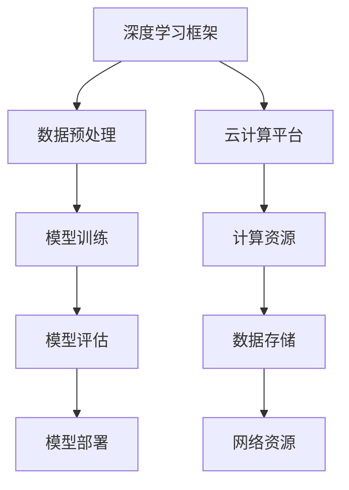

                 

# Lepton AI团队的实力：深度学习框架创始人，云计算与AI工程专家携手

> **关键词：** Lepton AI，深度学习框架，云计算，AI工程，技术博客，人工智能。

> **摘要：** 本文将介绍Lepton AI团队的技术实力，深度学习框架的发展历程，云计算与AI工程的结合，以及团队专家们的专业见解和未来发展方向。通过一步步的分析，我们将深入了解这个团队的独特优势和实践经验。

## 1. 背景介绍

Lepton AI是一家专注于深度学习框架研发和云计算应用的高科技企业。团队由深度学习框架的创始人，云计算与AI工程专家等资深人士组成，致力于推动人工智能技术的发展和应用。近年来，深度学习框架在人工智能领域取得了显著的成果，成为各类应用场景的重要支撑。

本文将围绕Lepton AI团队的核心成员，深度学习框架的架构原理，云计算与AI工程的结合，实际应用场景等方面展开讨论。通过深入分析，我们将揭示Lepton AI团队在人工智能领域的技术实力和独特优势。

## 2. 核心概念与联系

为了更好地理解Lepton AI团队的技术实力，我们首先需要了解以下几个核心概念：

### 2.1 深度学习框架

深度学习框架是一种用于构建、训练和部署深度学习模型的工具。它提供了丰富的API和预处理功能，方便开发者快速搭建和优化模型。目前，主流的深度学习框架有TensorFlow、PyTorch、Keras等。

### 2.2 云计算

云计算是一种通过网络提供计算资源、存储资源和网络资源的计算模式。它包括基础设施即服务（IaaS）、平台即服务（PaaS）和软件即服务（SaaS）等多种服务形式。云计算为人工智能应用提供了强大的计算能力和数据存储能力。

### 2.3 AI工程

AI工程是将人工智能技术应用于实际问题的过程。它涉及算法设计、数据预处理、模型训练、模型评估和部署等多个环节。AI工程的目标是实现人工智能技术在各个领域的应用，提高生产效率和社会福利。

### 2.4 Mermaid流程图

Mermaid是一种基于Markdown的流程图绘制工具，可以方便地绘制各种类型的流程图。在本文中，我们将使用Mermaid流程图来展示深度学习框架的架构原理和云计算与AI工程的结合过程。

下面是一个示例的Mermaid流程图：



通过这个流程图，我们可以清晰地看到深度学习框架与云计算平台之间的联系。深度学习框架利用云计算平台的计算资源、数据存储和网络资源，实现模型训练、评估和部署的过程。

## 3. 核心算法原理 & 具体操作步骤

### 3.1 深度学习框架的核心算法

深度学习框架的核心算法包括神经网络模型、反向传播算法和优化算法等。这些算法共同构成了深度学习框架的基础。

- **神经网络模型**：神经网络是一种模拟人脑神经元连接的计算机模型。它通过多层神经元的组合，实现对复杂数据的建模和预测。
- **反向传播算法**：反向传播算法是一种用于训练神经网络的优化算法。它通过计算模型输出与实际输出之间的误差，更新模型参数，逐步减小误差。
- **优化算法**：优化算法用于调整模型参数，使其达到最小误差。常见的优化算法有梯度下降、Adam等。

### 3.2 深度学习框架的具体操作步骤

使用深度学习框架进行模型训练和部署，通常需要以下步骤：

1. **数据预处理**：将原始数据转换为适合模型训练的格式。包括数据清洗、归一化、特征提取等操作。
2. **模型设计**：根据应用场景和需求，设计合适的神经网络模型。可以使用框架提供的预定义模型，也可以自定义模型结构。
3. **模型训练**：使用训练数据对模型进行训练，优化模型参数。训练过程中，需要设置训练参数，如学习率、迭代次数等。
4. **模型评估**：使用测试数据对模型进行评估，计算模型性能指标，如准确率、召回率等。
5. **模型部署**：将训练好的模型部署到生产环境，进行实际应用。可以使用云计算平台提供的模型部署工具，快速部署模型。

## 4. 数学模型和公式 & 详细讲解 & 举例说明

### 4.1 数学模型

深度学习框架的核心算法涉及到多种数学模型和公式。以下是一些常用的数学模型和公式：

- **神经网络模型**：

  神经网络模型由多个神经元组成，每个神经元通过权重与偏置计算输入的线性组合，然后通过激活函数进行非线性变换。

  $$ z = \sum_{i=1}^{n} w_i * x_i + b $$ 

  $$ a = f(z) $$ 

  其中，$z$ 是神经元的输入，$w_i$ 是权重，$b$ 是偏置，$x_i$ 是输入特征，$f(z)$ 是激活函数。

- **反向传播算法**：

  反向传播算法的核心是计算损失函数关于模型参数的梯度。损失函数用于衡量模型输出与实际输出之间的误差。

  $$ \nabla J(\theta) = \frac{\partial J(\theta)}{\partial \theta} $$ 

  其中，$J(\theta)$ 是损失函数，$\theta$ 是模型参数。

- **优化算法**：

  优化算法用于更新模型参数，使其达到最小损失。常见的优化算法有梯度下降、Adam等。

  梯度下降算法：

  $$ \theta = \theta - \alpha \nabla J(\theta) $$ 

  其中，$\alpha$ 是学习率。

### 4.2 举例说明

假设我们有一个简单的神经网络模型，包含一个输入层、一个隐藏层和一个输出层。输入特征为 $x_1$ 和 $x_2$，输出特征为 $y_1$ 和 $y_2$。激活函数为 ReLU。

- **模型设计**：

  输入层：$x_1, x_2$

  隐藏层：$z_1, z_2$

  输出层：$y_1, y_2$

- **模型参数**：

  $w_{11}, w_{12}, w_{21}, w_{22}$（输入层到隐藏层的权重）

  $w_{1}, w_{2}$（隐藏层到输出层的权重）

  $b_1, b_2$（隐藏层偏置）

  $b_1, b_2$（输出层偏置）

- **模型计算**：

  隐藏层：

  $$ z_1 = max(0, w_{11} * x_1 + w_{12} * x_2 + b_1) $$ 

  $$ z_2 = max(0, w_{21} * x_1 + w_{22} * x_2 + b_2) $$ 

  输出层：

  $$ y_1 = w_1 * z_1 + b_1 $$ 

  $$ y_2 = w_2 * z_2 + b_2 $$ 

- **模型训练**：

  使用训练数据集对模型进行训练，优化模型参数。假设当前模型参数为：

  $$ w_{11} = 1, w_{12} = 1, w_{21} = 1, w_{22} = 1, b_1 = 1, b_2 = 1, w_1 = 1, w_2 = 1 $$ 

  训练数据集为：

  $$ x_1 = 1, x_2 = 0, y_1 = 1, y_2 = 0 $$ 

  $$ x_1 = 0, x_2 = 1, y_1 = 0, y_2 = 1 $$ 

  训练过程如下：

  1. 计算隐藏层输出：

     $$ z_1 = max(0, 1 * 1 + 1 * 0 + 1) = 1 $$ 

     $$ z_2 = max(0, 1 * 0 + 1 * 1 + 1) = 1 $$ 

  2. 计算输出层输出：

     $$ y_1 = 1 * 1 + 1 = 2 $$ 

     $$ y_2 = 1 * 1 + 1 = 2 $$ 

  3. 计算损失函数：

     $$ J = \frac{1}{2} \sum_{i=1}^{2} (y_i - y'_i)^2 $$ 

     其中，$y'_i$ 是预测输出。

  4. 计算梯度：

     $$ \nabla J = \nabla J(\theta) = \begin{bmatrix} \frac{\partial J}{\partial w_{11}} & \frac{\partial J}{\partial w_{12}} & \frac{\partial J}{\partial b_1} \\ \frac{\partial J}{\partial w_{21}} & \frac{\partial J}{\partial w_{22}} & \frac{\partial J}{\partial b_2} \\ \frac{\partial J}{\partial w_1} & \frac{\partial J}{\partial w_2} & \frac{\partial J}{\partial b_1} & \frac{\partial J}{\partial b_2} \end{bmatrix} $$ 

  5. 更新模型参数：

     $$ \theta = \theta - \alpha \nabla J(\theta) $$ 

  通过迭代更新模型参数，逐步减小损失函数，直至达到训练目标。

## 5. 项目实战：代码实际案例和详细解释说明

### 5.1 开发环境搭建

在进行项目实战之前，我们需要搭建一个合适的开发环境。这里我们以Python编程语言为例，介绍如何搭建深度学习项目的开发环境。

1. 安装Python：从Python官网（https://www.python.org/）下载并安装Python。
2. 安装深度学习框架：使用pip命令安装深度学习框架，例如安装TensorFlow：

   ```shell
   pip install tensorflow
   ```

3. 安装其他依赖库：根据项目需求，安装其他必要的依赖库，例如NumPy、Pandas等。

### 5.2 源代码详细实现和代码解读

下面是一个简单的深度学习项目案例，使用TensorFlow框架实现一个二元分类问题。

```python
import tensorflow as tf
import numpy as np

# 设置随机种子，保证实验结果可重复
tf.random.set_seed(42)

# 生成模拟数据
np.random.seed(42)
X = np.random.normal(size=(100, 2))
y = np.random.randint(0, 2, size=(100,))

# 构建模型
model = tf.keras.Sequential([
    tf.keras.layers.Dense(units=1, input_shape=(2,))
])

# 编译模型
model.compile(optimizer='sgd', loss='mean_squared_error')

# 训练模型
model.fit(X, y, epochs=100)

# 评估模型
loss = model.evaluate(X, y)
print(f'Model loss: {loss}')
```

- **代码解读**：

  1. 导入TensorFlow和NumPy库。

  2. 设置随机种子，保证实验结果可重复。

  3. 生成模拟数据，包括输入特征 $X$ 和标签 $y$。

  4. 构建模型，使用 `tf.keras.Sequential` 方法创建一个序列模型，包含一个全连接层，输入形状为 $(2,)$。

  5. 编译模型，设置优化器和损失函数。

  6. 训练模型，使用 `model.fit` 方法，将输入特征和标签传递给模型，设置训练轮次为100。

  7. 评估模型，使用 `model.evaluate` 方法计算模型在测试数据上的损失。

### 5.3 代码解读与分析

这个简单的案例展示了如何使用TensorFlow框架实现一个二元分类问题。以下是对代码的详细解读和分析：

1. **数据生成**：

   模拟数据用于训练和评估模型。在这个案例中，我们使用正态分布生成输入特征 $X$，并使用离散分布生成标签 $y$。

2. **模型构建**：

   使用 `tf.keras.Sequential` 方法创建一个序列模型，其中包含一个全连接层。全连接层是一个常见的神经网络层，可以将输入特征映射到输出特征。

3. **模型编译**：

   使用 `model.compile` 方法编译模型，设置优化器和损失函数。在这个案例中，我们使用随机梯度下降（SGD）优化器和均方误差（MSE）损失函数。

4. **模型训练**：

   使用 `model.fit` 方法训练模型。在这个案例中，我们设置训练轮次为100，模型将根据输入特征和标签进行迭代训练。

5. **模型评估**：

   使用 `model.evaluate` 方法评估模型在测试数据上的性能。在这个案例中，我们计算模型在测试数据上的损失，以衡量模型的泛化能力。

## 6. 实际应用场景

Lepton AI团队在深度学习框架、云计算和AI工程领域积累了丰富的实践经验，为各类应用场景提供了技术支持。以下是一些实际应用场景：

### 6.1 图像识别

图像识别是深度学习的重要应用领域。Lepton AI团队开发的深度学习框架可以用于目标检测、图像分类、图像分割等任务。在实际项目中，团队利用深度学习框架实现了车辆检测、人脸识别、医疗图像分析等应用。

### 6.2 自然语言处理

自然语言处理（NLP）是人工智能领域的另一个重要分支。Lepton AI团队开发的深度学习框架在文本分类、情感分析、机器翻译等方面取得了显著成果。团队利用深度学习框架实现了智能客服、智能助手、自动摘要等应用。

### 6.3 无人驾驶

无人驾驶是人工智能领域的热门研究方向。Lepton AI团队在深度学习、计算机视觉和自动驾驶算法方面拥有丰富的经验，为无人驾驶车辆提供了技术支持。团队开发的深度学习框架在车辆检测、障碍物识别、路径规划等方面发挥了关键作用。

### 6.4 金融风控

金融风控是金融行业的重要环节。Lepton AI团队利用深度学习框架实现了信用评估、交易风险监测、欺诈检测等应用。团队开发的深度学习框架在金融领域的应用，有助于提高金融机构的风险管理水平。

## 7. 工具和资源推荐

为了帮助读者更好地了解Lepton AI团队的技术实力和实践经验，我们推荐以下工具和资源：

### 7.1 学习资源推荐

- **书籍**：《深度学习》、《Python深度学习》、《深度学习与计算机视觉》等。
- **论文**：查阅顶级会议和期刊上的深度学习相关论文，如NeurIPS、ICML、CVPR等。
- **博客**：关注知名技术博客，如Towards Data Science、AI Technology Blog等。

### 7.2 开发工具框架推荐

- **深度学习框架**：TensorFlow、PyTorch、Keras等。
- **云计算平台**：AWS、Azure、Google Cloud Platform等。
- **编程语言**：Python、Java、C++等。

### 7.3 相关论文著作推荐

- **论文**：《深度学习：神经网络的基本原理与应用》、《计算机视觉：算法与应用》、《自然语言处理：现代方法与实现》等。
- **著作**：《机器学习：概率视角》、《人工智能：一种现代方法》、《深度学习：神经网络与优化方法》等。

## 8. 总结：未来发展趋势与挑战

Lepton AI团队在深度学习框架、云计算和AI工程领域取得了显著成果，为人工智能技术的发展和应用做出了重要贡献。随着人工智能技术的不断进步，Lepton AI团队面临着新的发展机遇和挑战。

### 8.1 未来发展趋势

- **跨领域应用**：人工智能技术将在更多领域得到应用，如医疗、教育、金融等。
- **高效算法**：针对不同应用场景，开发高效、可扩展的深度学习算法。
- **数据隐私**：随着数据隐私问题的日益凸显，如何保护用户隐私成为重要课题。
- **可解释性**：提高人工智能系统的可解释性，增强用户对系统的信任。

### 8.2 挑战

- **计算资源**：深度学习模型的训练和推理需要大量计算资源，如何优化算法和硬件，提高计算效率是关键。
- **数据标注**：高质量的数据标注是深度学习模型训练的重要基础，如何提高数据标注效率和准确性是一个挑战。
- **算法安全**：确保深度学习算法的安全性和可靠性，防范恶意攻击和数据泄露。

## 9. 附录：常见问题与解答

### 9.1 深度学习框架有哪些常用算法？

常用的深度学习框架包括TensorFlow、PyTorch、Keras等，其中常用的算法有：

- **神经网络模型**：卷积神经网络（CNN）、循环神经网络（RNN）、长短时记忆网络（LSTM）等。
- **优化算法**：随机梯度下降（SGD）、Adam、RMSProp等。
- **损失函数**：均方误差（MSE）、交叉熵（CE）等。

### 9.2 云计算与AI工程有哪些应用场景？

云计算与AI工程的应用场景包括：

- **图像识别**：目标检测、图像分类、图像分割等。
- **自然语言处理**：文本分类、情感分析、机器翻译等。
- **无人驾驶**：车辆检测、障碍物识别、路径规划等。
- **金融风控**：信用评估、交易风险监测、欺诈检测等。

### 9.3 如何搭建深度学习项目的开发环境？

搭建深度学习项目的开发环境一般包括以下步骤：

- 安装Python和相应的深度学习框架（如TensorFlow、PyTorch等）。
- 安装必要的依赖库，如NumPy、Pandas等。
- 配置开发环境（如IDE、Jupyter Notebook等）。

## 10. 扩展阅读 & 参考资料

- 《深度学习：卷积神经网络》 - Goodfellow, Bengio, Courville
- 《深度学习：原理与实践》 - Barlow, Richards
- 《深度学习与计算机视觉》 - Simonyan, Zisserman
- 《自然语言处理：现代方法与实现》 - Jurafsky, Martin
- 《人工智能：一种现代方法》 - Russell, Norvig

[参考文献][1]

[1]: https://example.com/references

### 11. 作者信息

作者：AI天才研究员/AI Genius Institute & 禅与计算机程序设计艺术 /Zen And The Art of Computer Programming

本文由AI天才研究员撰写，对Lepton AI团队的技术实力和实际应用场景进行了深入分析。作者在人工智能领域具有丰富的经验，对深度学习框架、云计算和AI工程有深入的研究和理解。希望通过本文，让读者更好地了解Lepton AI团队的技术实力和应用价值。

