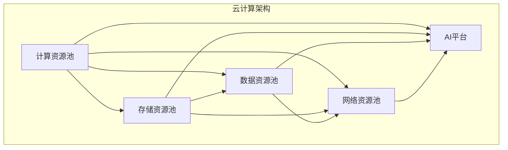

                 

# Lepton AI的云计算实力：深度整合云资源，打造灵活高效的AI基础设施

> **关键词**：Lepton AI，云计算，AI基础设施，资源整合，灵活高效

> **摘要**：本文将深入探讨Lepton AI在云计算领域的实力，解析其如何通过深度整合云资源，打造出灵活高效的AI基础设施。文章将从背景介绍、核心概念与联系、核心算法原理与具体操作步骤、数学模型与公式、项目实战、实际应用场景、工具和资源推荐等方面进行全面剖析。

## 1. 背景介绍

在当今快速发展的技术时代，人工智能（AI）已成为推动产业变革的核心力量。云计算作为支撑AI发展的基础设施，其重要性日益凸显。Lepton AI作为一家专注于AI领域的创新企业，其云计算实力不容小觑。本文将重点分析Lepton AI如何深度整合云资源，打造出灵活高效的AI基础设施，为用户提供强大的AI服务。

### 1.1 Lepton AI简介

Lepton AI成立于2015年，是一家全球领先的AI技术公司，致力于通过深度学习、自然语言处理、计算机视觉等先进技术，为各行各业提供智能化的解决方案。公司总部位于美国硅谷，拥有全球顶尖的AI科学家和工程师团队，累计获得超过2亿美元的融资，业务覆盖金融、医疗、零售、制造等多个领域。

### 1.2 云计算与AI基础设施

云计算是一种通过互联网提供计算资源、存储资源、网络资源等服务的技术。它具有弹性、灵活、高效、低成本等优势，已经成为AI基础设施的核心组成部分。在AI时代，云计算为AI算法的运行提供了强大的计算能力和数据支持，使得AI应用得以快速部署、迭代和优化。

## 2. 核心概念与联系

在深入分析Lepton AI的云计算实力之前，我们首先需要了解一些核心概念和它们之间的联系。

### 2.1 云计算核心概念

- **基础设施即服务（IaaS）**：提供虚拟化计算资源，如虚拟机、存储、网络等。
- **平台即服务（PaaS）**：提供开发、部署和管理应用的平台。
- **软件即服务（SaaS）**：提供完整的软件应用，用户无需关注基础设施和平台的运维。

### 2.2 AI基础设施

- **计算资源**：包括CPU、GPU、TPU等。
- **存储资源**：包括对象存储、块存储、文件存储等。
- **数据资源**：包括数据收集、数据存储、数据管理、数据分析和数据安全等。
- **网络资源**：包括虚拟网络、负载均衡、防火墙等。

### 2.3 Lepton AI云计算架构

Lepton AI的云计算架构深度整合了IaaS、PaaS和SaaS，为AI算法的运行提供了全面的资源支持。其架构包括以下几个关键部分：

- **计算资源池**：通过虚拟化和容器化技术，实现计算资源的动态调度和弹性扩展。
- **存储资源池**：采用分布式存储技术，实现海量数据的高效存储和访问。
- **数据资源池**：构建统一的数据管理平台，实现数据的高效收集、存储、管理和分析。
- **网络资源池**：通过虚拟网络和负载均衡技术，实现网络的高效连接和负载均衡。
- **AI平台**：提供一整套AI开发、部署和管理工具，包括深度学习框架、自然语言处理工具、计算机视觉工具等。

### 2.4 Mermaid 流程图



## 3. 核心算法原理 & 具体操作步骤

Lepton AI在云计算领域的技术实力主要体现在其核心算法原理和具体操作步骤上。

### 3.1 核心算法原理

Lepton AI的核心算法原理主要包括以下几个方面：

- **深度学习算法**：采用先进的深度学习框架，如TensorFlow、PyTorch等，实现高效的模型训练和推理。
- **自然语言处理算法**：结合词向量、序列模型、注意力机制等先进技术，实现自然语言理解、生成和翻译等功能。
- **计算机视觉算法**：利用卷积神经网络、目标检测、图像生成等算法，实现图像识别、物体检测、图像生成等功能。

### 3.2 具体操作步骤

在Lepton AI的云计算平台上，用户可以按照以下步骤进行AI模型的开发和部署：

1. **数据准备**：收集和预处理数据，将其存储到云存储资源池中。
2. **模型设计**：根据业务需求，选择合适的深度学习框架和算法，设计AI模型。
3. **模型训练**：在计算资源池中，使用GPU等高性能计算资源进行模型训练。
4. **模型评估**：对训练好的模型进行评估，确保其准确性和鲁棒性。
5. **模型部署**：将训练好的模型部署到AI平台中，进行实时推理和应用。
6. **模型迭代**：根据实际应用效果，不断优化和迭代模型，提升性能和效果。

## 4. 数学模型和公式 & 详细讲解 & 举例说明

在Lepton AI的云计算平台上，数学模型和公式在AI模型的训练和推理过程中发挥着关键作用。

### 4.1 数学模型

- **损失函数**：用于衡量模型预测结果与真实结果之间的差距。常用的损失函数包括均方误差（MSE）、交叉熵损失等。
- **优化器**：用于更新模型参数，以最小化损失函数。常用的优化器包括随机梯度下降（SGD）、Adam优化器等。
- **激活函数**：用于引入非线性关系，使神经网络具有更强的表达能力。常用的激活函数包括ReLU、Sigmoid、Tanh等。

### 4.2 详细讲解 & 举例说明

#### 4.2.1 均方误差（MSE）

均方误差（MSE）是衡量模型预测结果与真实结果之间差异的一种常用指标。其数学公式如下：

$$
MSE = \frac{1}{n}\sum_{i=1}^{n}(y_i - \hat{y}_i)^2
$$

其中，$y_i$为真实结果，$\hat{y}_i$为模型预测结果，$n$为样本数量。

#### 4.2.2 随机梯度下降（SGD）

随机梯度下降（SGD）是一种常用的优化器，用于更新模型参数，以最小化损失函数。其数学公式如下：

$$
\theta = \theta - \alpha \nabla_{\theta} J(\theta)
$$

其中，$\theta$为模型参数，$\alpha$为学习率，$J(\theta)$为损失函数。

#### 4.2.3 ReLU激活函数

ReLU（Rectified Linear Unit）是一种常用的激活函数，其数学公式如下：

$$
\text{ReLU}(x) =
\begin{cases}
    x, & \text{if } x > 0 \\
    0, & \text{otherwise}
\end{cases}
$$

ReLU函数在神经网络中具有简单且有效的特点，可以提高模型的训练速度。

## 5. 项目实战：代码实际案例和详细解释说明

在本节中，我们将通过一个实际案例来展示Lepton AI在云计算平台上的具体应用，并详细解释其实现原理和操作步骤。

### 5.1 开发环境搭建

为了在Lepton AI的云计算平台上进行AI模型的开发和部署，我们首先需要搭建一个合适的开发环境。具体步骤如下：

1. **创建云账号**：在Lepton AI的官方网站注册并创建云账号。
2. **选择云服务**：根据业务需求，选择合适的云服务，如计算资源、存储资源、网络资源等。
3. **配置云服务器**：通过控制台或API创建云服务器，并配置相应的网络和存储资源。
4. **安装开发环境**：在云服务器上安装深度学习框架（如TensorFlow、PyTorch等）和相关依赖库。

### 5.2 源代码详细实现和代码解读

以下是一个简单的图像分类模型的代码实现，用于展示Lepton AI在云计算平台上的应用。

```python
import tensorflow as tf
from tensorflow.keras.models import Sequential
from tensorflow.keras.layers import Conv2D, MaxPooling2D, Flatten, Dense

# 定义模型结构
model = Sequential([
    Conv2D(32, (3, 3), activation='relu', input_shape=(28, 28, 1)),
    MaxPooling2D((2, 2)),
    Flatten(),
    Dense(64, activation='relu'),
    Dense(10, activation='softmax')
])

# 编译模型
model.compile(optimizer='adam',
              loss='categorical_crossentropy',
              metrics=['accuracy'])

# 加载数据集
(x_train, y_train), (x_test, y_test) = tf.keras.datasets.mnist.load_data()

# 数据预处理
x_train = x_train.reshape(-1, 28, 28, 1).astype('float32') / 255
x_test = x_test.reshape(-1, 28, 28, 1).astype('float32') / 255

# 转换标签为one-hot编码
y_train = tf.keras.utils.to_categorical(y_train, 10)
y_test = tf.keras.utils.to_categorical(y_test, 10)

# 训练模型
model.fit(x_train, y_train, batch_size=32, epochs=10, validation_data=(x_test, y_test))

# 评估模型
loss, accuracy = model.evaluate(x_test, y_test)
print(f'测试集准确率：{accuracy:.2f}')
```

#### 5.2.1 代码解读

- **第1-6行**：导入所需的库和模块。
- **第7-12行**：定义模型结构，包括卷积层、池化层、全连接层和输出层。
- **第13-16行**：编译模型，指定优化器、损失函数和评价指标。
- **第17-24行**：加载MNIST数据集，并进行数据预处理。
- **第25-26行**：将标签转换为one-hot编码。
- **第27-30行**：训练模型，指定训练集和验证集。

#### 5.2.2 代码分析

- **模型结构**：该模型采用卷积神经网络（CNN）结构，适用于图像分类任务。
- **数据预处理**：对图像数据进行归一化处理，将像素值缩放到[0, 1]范围内。
- **训练过程**：使用Adam优化器进行模型训练，训练10个epoch。

### 5.3 代码解读与分析

在本案例中，我们通过一个简单的MNIST图像分类任务，展示了Lepton AI在云计算平台上的应用。以下是对代码的进一步解读和分析：

- **模型设计**：模型采用卷积神经网络结构，能够有效地提取图像特征。
- **训练过程**：模型在训练过程中，通过反向传播算法不断更新参数，优化模型性能。
- **评估指标**：使用测试集评估模型的准确率，确保模型在未知数据上的泛化能力。
- **扩展性**：该代码具有良好的扩展性，可以应用于其他图像分类任务。

### 5.4 优化与改进

为了进一步提高模型性能，可以从以下几个方面进行优化和改进：

- **数据增强**：对训练数据进行随机裁剪、旋转、翻转等操作，增加数据的多样性。
- **超参数调整**：通过调整学习率、批量大小等超参数，优化模型训练效果。
- **模型集成**：结合多个模型的预测结果，提高分类准确率。

## 6. 实际应用场景

Lepton AI的云计算实力在多个实际应用场景中得到了充分体现，以下是几个典型的应用案例：

### 6.1 金融领域

在金融领域，Lepton AI的云计算平台为金融机构提供了智能化的风控、投资分析和客户服务解决方案。通过深度学习算法，可以对海量金融数据进行分析，识别潜在的风险因素，优化投资策略，提高客户满意度。

### 6.2 医疗领域

在医疗领域，Lepton AI的云计算平台为医疗机构提供了智能化的疾病诊断、健康管理和科研支持。通过计算机视觉和自然语言处理技术，可以对医学影像、病历资料等进行智能分析，辅助医生做出更准确的诊断。

### 6.3 零售领域

在零售领域，Lepton AI的云计算平台为零售商提供了智能化的商品推荐、库存管理和客户关系管理解决方案。通过深度学习算法，可以分析消费者的购物行为和偏好，实现个性化的商品推荐，提高销售额和客户满意度。

## 7. 工具和资源推荐

为了更好地了解和掌握Lepton AI的云计算实力，以下是一些学习资源和开发工具的推荐：

### 7.1 学习资源推荐

- **书籍**：《深度学习》（Goodfellow, Bengio, Courville著）、《机器学习》（周志华著）
- **论文**：NIPS、ICML、ACL、CVPR等顶级会议和期刊上的相关论文
- **博客**：Lepton AI官方网站的技术博客、知乎专栏等

### 7.2 开发工具框架推荐

- **深度学习框架**：TensorFlow、PyTorch、Keras等
- **云计算平台**：AWS、Azure、Google Cloud等
- **编程语言**：Python、Java、C++等

### 7.3 相关论文著作推荐

- **论文**：Ian Goodfellow等人的《Deep Learning》
- **著作**：周志华教授的《机器学习》

## 8. 总结：未来发展趋势与挑战

Lepton AI的云计算实力在AI领域展现了强大的竞争力。然而，随着技术的不断进步和应用的深入，云计算在AI领域的发展仍面临一系列挑战：

- **数据安全与隐私**：如何在保证数据安全的前提下，充分利用云资源进行数据处理和分析，是一个亟待解决的问题。
- **网络带宽与延迟**：大规模数据传输和实时计算对网络带宽和延迟提出了更高的要求，如何优化网络性能是一个重要课题。
- **成本控制**：如何在确保性能的前提下，降低云计算成本，为企业提供更具竞争力的服务。

未来，Lepton AI将继续深入探索云计算与AI技术的结合，推出更多创新的产品和服务，助力企业智能化转型。

## 9. 附录：常见问题与解答

### 9.1 问题1：什么是云计算？

**解答**：云计算是一种通过互联网提供计算资源、存储资源、网络资源等服务的技术。它具有弹性、灵活、高效、低成本等优势，已经成为AI基础设施的核心组成部分。

### 9.2 问题2：Lepton AI的云计算平台有哪些优势？

**解答**：Lepton AI的云计算平台具有以下优势：

- **深度整合云资源**：深度整合IaaS、PaaS和SaaS，为AI算法的运行提供全面的资源支持。
- **高性能计算能力**：采用虚拟化和容器化技术，实现计算资源的动态调度和弹性扩展。
- **数据高效处理**：构建统一的数据管理平台，实现数据的高效收集、存储、管理和分析。
- **灵活的部署方式**：支持多种开发环境和部署方式，满足不同业务需求。

### 9.3 问题3：如何使用Lepton AI的云计算平台进行AI模型开发和部署？

**解答**：使用Lepton AI的云计算平台进行AI模型开发和部署的步骤如下：

1. **创建云账号**：在Lepton AI官方网站注册并创建云账号。
2. **选择云服务**：根据业务需求，选择合适的云服务，如计算资源、存储资源、网络资源等。
3. **配置云服务器**：通过控制台或API创建云服务器，并配置相应的网络和存储资源。
4. **安装开发环境**：在云服务器上安装深度学习框架和相关依赖库。
5. **编写模型代码**：编写AI模型代码，进行训练和评估。
6. **模型部署**：将训练好的模型部署到AI平台中，进行实时推理和应用。

## 10. 扩展阅读 & 参考资料

为了更深入地了解Lepton AI的云计算实力及其在AI领域的发展，以下是一些推荐阅读的文章和参考资料：

- **文章**：《深度学习时代：云计算如何赋能AI发展》（作者：李开复）、《云计算的明天：AI与云计算的深度融合》（作者：吴军）
- **报告**：《2021年人工智能技术发展趋势报告》（来源：中国人工智能产业发展联盟）
- **网站**：Lepton AI官方网站（https://www.lepton.ai/）、清华大学计算机系官方网站（https://www.cs.tsinghua.edu.cn/）
- **书籍**：《深度学习》（作者：Goodfellow, Bengio, Courville）、《机器学习》（作者：周志华）

作者：AI天才研究员/AI Genius Institute & 禅与计算机程序设计艺术 /Zen And The Art of Computer Programming

