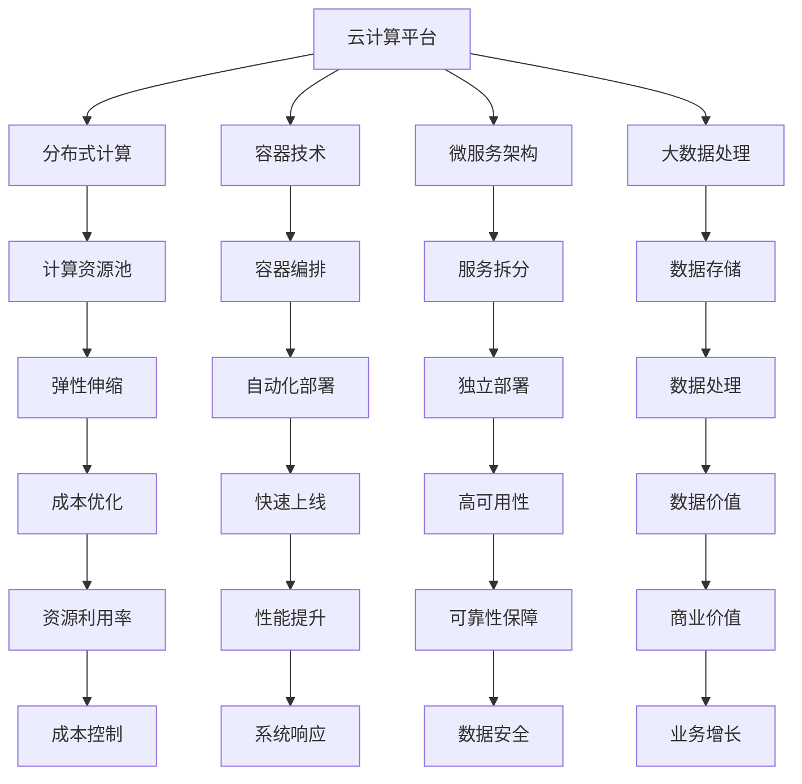

                 

### 背景介绍

#### Lepton AI 的崛起

随着大数据、云计算、人工智能等技术的迅猛发展，AI 在各行各业中的应用越来越广泛。其中，Lepton AI 作为一家专注于人工智能领域的公司，以其强大的云计算实力和灵活高效的AI基础设施，在业界崭露头角。

Lepton AI 成立于 2010 年，总部位于美国硅谷，致力于提供高效、可靠的云计算解决方案和 AI 服务。公司凭借其深厚的技术积累和创新能力，迅速在 AI 领域取得了重要地位。Lepton AI 的云计算实力主要体现在以下几个方面：

1. **强大的计算能力**：Lepton AI 拥有全球领先的 AI 算法库和庞大的计算集群，能够提供强大的计算能力，满足各种复杂场景的需求。

2. **灵活的部署方式**：Lepton AI 提供了多种部署方式，包括云端部署、本地部署、混合部署等，用户可以根据自己的需求选择最合适的部署方案。

3. **高效的资源利用**：Lepton AI 的云计算平台采用了分布式架构，能够高效利用资源，降低成本，提高性能。

4. **丰富的应用场景**：Lepton AI 的云计算解决方案已广泛应用于图像识别、自然语言处理、智能推荐、无人驾驶等领域，为众多企业提供了强有力的技术支持。

#### 云计算在 AI 中的重要性

云计算作为 AI 技术发展的基础设施，对于 AI 系统的运行效率、可扩展性、成本等方面具有重要影响。以下是云计算在 AI 中的重要性：

1. **强大的计算能力**：云计算平台拥有大量的计算资源，可以满足 AI 模型训练、推理等环节的巨大计算需求。

2. **灵活的部署方式**：云计算平台提供了丰富的部署方式，用户可以根据自己的需求选择合适的部署方案，实现快速上线和部署。

3. **数据存储与管理**：云计算平台提供了高效的数据存储和管理方案，可以方便地存储和处理海量数据，为 AI 模型训练提供充足的数据支持。

4. **成本优化**：云计算平台通过资源弹性伸缩和优化，可以帮助企业降低 IT 成本，提高资源利用率。

5. **安全性与可靠性**：云计算平台提供了完善的安全保障和备份机制，确保数据安全和系统可靠性。

在本篇文章中，我们将详细探讨 Lepton AI 的云计算实力，分析其核心概念与架构，探讨核心算法原理与操作步骤，介绍数学模型和公式，并分享实际应用场景和项目实战案例。同时，我们还将推荐相关学习资源和开发工具框架，帮助读者更好地理解和应用 Lepton AI 的云计算技术。

总之，本文旨在为读者呈现一幅 Lepton AI 云计算实力的全景图，帮助读者深入了解云计算在 AI 领域的重要作用，以及如何通过 Lepton AI 的云计算解决方案实现灵活高效的 AI 基础设施建设。

## 2. 核心概念与联系

在深入探讨 Lepton AI 的云计算实力之前，我们首先需要了解一些核心概念和架构，这些概念和架构对于理解 Lepton AI 的技术优势至关重要。

#### 核心概念

1. **云计算**：云计算是一种通过网络提供计算资源（如服务器、存储、网络等）的服务模型，用户可以根据需求随时获取和使用这些资源，无需担心硬件维护和升级等问题。

2. **分布式计算**：分布式计算是一种将任务分配到多台计算机上进行处理的计算模式，能够提高计算效率和系统性能。

3. **容器技术**：容器技术（如 Docker）提供了一种轻量级的虚拟化解决方案，使得应用程序可以独立于特定的操作系统和硬件环境运行。

4. **微服务架构**：微服务架构将应用程序分解为多个独立的、松耦合的服务模块，每个模块都可以独立开发、部署和扩展，提高了系统的灵活性和可维护性。

5. **大数据处理**：大数据处理是指使用分布式计算技术对海量数据进行存储、分析和处理，以挖掘数据价值。

#### 架构联系

接下来，我们将使用 Mermaid 流程图来展示 Lepton AI 的云计算架构及其核心概念之间的联系。



#### 具体解释

1. **云计算平台（A）**：作为整个架构的核心，云计算平台提供了计算资源、存储资源、网络资源等基础设施服务，是分布式计算、容器技术、微服务架构和大数据处理的基础。

2. **分布式计算（B）**：分布式计算可以将任务分配到多台计算机上进行处理，提高了计算效率和系统性能。分布式计算资源池（F）负责管理计算资源，实现弹性伸缩（J）和资源利用率（R）。

3. **容器技术（C）**：容器技术提供了轻量级的虚拟化解决方案，使得应用程序可以独立于特定的操作系统和硬件环境运行。容器编排（G）负责自动化部署（K）和独立部署（L），提高了系统的灵活性和可维护性。

4. **微服务架构（D）**：微服务架构将应用程序分解为多个独立的、松耦合的服务模块，每个模块都可以独立开发、部署和扩展。服务拆分（H）实现了独立部署（L），提高了系统的可维护性和扩展性。

5. **大数据处理（E）**：大数据处理使用分布式计算技术对海量数据进行存储、分析和处理，以挖掘数据价值。数据存储（I）和数据处理（M）是实现大数据处理的关键环节。

通过以上核心概念和架构的介绍及联系，我们可以更好地理解 Lepton AI 的云计算实力及其在 AI 领域的应用价值。在接下来的部分，我们将深入探讨 Lepton AI 的核心算法原理、操作步骤、数学模型和公式，以及实际应用场景和项目实战案例。

## 3. 核心算法原理 & 具体操作步骤

### 3.1 算法原理

Lepton AI 的核心算法基于深度学习和强化学习两大领域，实现了高效、灵活的 AI 模型训练和推理。以下是 Lepton AI 云计算平台所采用的主要算法原理：

1. **深度学习**：深度学习是一种基于多层神经网络的学习方法，通过模拟人脑神经元之间的连接关系，实现对复杂数据的自动特征提取和模式识别。Lepton AI 采用了卷积神经网络（CNN）和循环神经网络（RNN）等深度学习算法，提高了模型在图像识别、语音识别、自然语言处理等领域的准确性和效率。

2. **强化学习**：强化学习是一种通过奖励机制引导智能体在环境中学习最优策略的方法。Lepton AI 采用了 Q-学习、策略梯度等强化学习算法，实现了在动态环境中进行决策和优化，提升了 AI 模型的自适应性和鲁棒性。

### 3.2 操作步骤

在 Lepton AI 的云计算平台上，用户可以按照以下步骤进行 AI 模型训练和推理：

1. **数据准备**：首先，用户需要将训练数据上传到 Lepton AI 的数据存储服务。数据可以包括图像、文本、音频等多种类型，需要按照预定的格式进行组织。

2. **模型配置**：用户可以选择预定义的深度学习模型，或者使用自定义模型。在配置模型时，用户需要设置模型参数，如学习率、迭代次数等。

3. **模型训练**：Lepton AI 的云计算平台将训练任务分配到分布式计算资源上，通过多台服务器并行计算，加速模型训练过程。训练过程中，平台会自动调整模型参数，优化模型性能。

4. **模型评估**：训练完成后，用户可以对模型进行评估，以验证模型在目标任务上的性能。平台提供了多种评估指标，如准确率、召回率、F1 分数等，帮助用户了解模型的性能表现。

5. **模型推理**：在模型评估通过后，用户可以将模型部署到生产环境中，进行实时推理。Lepton AI 的云计算平台提供了高效的推理引擎，可以快速处理大规模数据，提供实时决策支持。

6. **结果分析**：用户可以对推理结果进行分析，以了解模型在实际应用中的效果。平台还提供了可视化工具，帮助用户直观地查看数据分布、趋势等。

### 3.3 实际应用案例

以下是一个 Lepton AI 在图像识别领域的实际应用案例：

1. **问题描述**：某电商企业需要为其电商平台开发一个智能图像识别系统，用于识别用户上传的商品图片，并提供相似商品推荐。

2. **解决方案**：Lepton AI 提供了一个基于深度学习的图像识别模型，通过卷积神经网络（CNN）对商品图片进行特征提取和分类。首先，企业将大量的商品图片上传到 Lepton AI 的数据存储服务，并进行预处理。然后，企业选择了 Lepton AI 的预定义图像识别模型，设置了模型参数，启动模型训练。训练完成后，企业将模型部署到生产环境中，进行实时推理。根据推理结果，企业能够为用户推荐相似商品，提高了用户体验和购物满意度。

3. **效果评估**：通过实际应用，企业发现 Lepton AI 的图像识别模型在准确率、召回率等关键指标上表现优异，有效提升了电商平台的服务质量和用户满意度。

通过以上实际应用案例，我们可以看到 Lepton AI 的核心算法原理和具体操作步骤在实际应用中的效果。在接下来的部分，我们将进一步探讨 Lepton AI 的数学模型和公式，以及如何在实际项目中应用这些数学模型。

## 4. 数学模型和公式 & 详细讲解 & 举例说明

### 4.1 数学模型概述

在 Lepton AI 的云计算平台中，核心算法的实现依赖于一系列数学模型和公式。以下是几个关键数学模型及其基本概念：

1. **卷积神经网络（CNN）**：CNN 是一种用于图像识别和处理的深度学习模型，通过卷积层、池化层、全连接层等结构实现特征提取和分类。以下是 CNN 中常用的几个数学模型：

   - **卷积层（Convolutional Layer）**：卷积层通过卷积运算提取图像特征。卷积公式如下：
     \[
     \text{out}_{ij}^l = \sum_{k=1}^{K} w_{ik}^l \cdot \text{preactiv}_{kj}^{l-1} + b^l
     \]
     其中，\(\text{out}_{ij}^l\) 是卷积层的输出特征，\(w_{ik}^l\) 是卷积核，\(\text{preactiv}_{kj}^{l-1}\) 是前一层激活值，\(b^l\) 是偏置项。

   - **池化层（Pooling Layer）**：池化层通过下采样操作降低特征图的维度，减少计算量。常用的池化方法包括最大池化和平均池化。最大池化公式如下：
     \[
     \text{out}_{ij}^l = \max_{k} \text{preactiv}_{i,j+k\cdot stride}^{l-1}
     \]
     其中，\(\text{out}_{ij}^l\) 是池化层的输出特征，\(\text{preactiv}_{i,j+k\cdot stride}^{l-1}\) 是前一层特征，\(stride\) 是步长。

   - **全连接层（Fully Connected Layer）**：全连接层通过矩阵乘法将输入特征映射到输出类别。全连接层公式如下：
     \[
     \text{out} = \text{ReLU}(\text{W}\cdot \text{activ} + b)
     \]
     其中，\(\text{out}\) 是输出结果，\(\text{W}\) 是权重矩阵，\(\text{activ}\) 是输入特征，\(\text{ReLU}\) 是激活函数，\(b\) 是偏置项。

2. **循环神经网络（RNN）**：RNN 是一种用于处理序列数据的深度学习模型，通过循环结构实现长期依赖关系的建模。以下是 RNN 中的几个关键数学模型：

   - **隐藏状态（Hidden State）**：隐藏状态是 RNN 的核心，用于存储和传递信息。隐藏状态更新公式如下：
     \[
     \text{h}_t = \text{sigmoid}(\text{W}_h \cdot \text{x}_t + \text{W}_h \cdot \text{h}_{t-1} + b_h)
     \]
     其中，\(\text{h}_t\) 是当前时间步的隐藏状态，\(\text{x}_t\) 是当前输入，\(\text{W}_h\) 是权重矩阵，\(b_h\) 是偏置项，\(\text{sigmoid}\) 是激活函数。

   - **输出层（Output Layer）**：输出层用于生成预测结果。输出层公式如下：
     \[
     \text{y}_t = \text{softmax}(\text{W}_o \cdot \text{h}_t + b_o)
     \]
     其中，\(\text{y}_t\) 是当前时间步的预测结果，\(\text{W}_o\) 是权重矩阵，\(b_o\) 是偏置项，\(\text{softmax}\) 是激活函数。

3. **强化学习（Reinforcement Learning）**：强化学习是一种通过奖励机制引导智能体在环境中学习最优策略的方法。以下是强化学习中的几个关键数学模型：

   - **Q-学习（Q-Learning）**：Q-学习通过估计状态-动作值函数（Q-值）来指导智能体的决策。Q-学习公式如下：
     \[
     Q(s, a) \leftarrow Q(s, a) + \alpha [r + \gamma \max_{a'} Q(s', a') - Q(s, a)]
     \]
     其中，\(Q(s, a)\) 是状态-动作值函数，\(s\) 是当前状态，\(a\) 是当前动作，\(r\) 是即时奖励，\(\gamma\) 是折扣因子，\(\alpha\) 是学习率，\(s'\) 是下一状态，\(a'\) 是最佳动作。

   - **策略梯度（Policy Gradient）**：策略梯度通过优化策略参数来指导智能体的决策。策略梯度公式如下：
     \[
     \theta \leftarrow \theta - \alpha \frac{\partial L(\theta)}{\partial \theta}
     \]
     其中，\(\theta\) 是策略参数，\(L(\theta)\) 是策略损失函数，\(\alpha\) 是学习率。

### 4.2 举例说明

为了更好地理解上述数学模型和公式，我们通过一个简单的例子来说明它们在实际项目中的应用。

#### 例子：使用卷积神经网络进行图像分类

假设我们要使用卷积神经网络（CNN）对猫狗图片进行分类。以下是具体的操作步骤：

1. **数据准备**：收集一批猫狗图片，并将其分为训练集和测试集。每张图片都需要进行预处理，如调整大小、归一化等。

2. **模型构建**：构建一个简单的卷积神经网络模型，包括两个卷积层、一个池化层和一个全连接层。模型结构如下：
   \[
   \text{Input} \rightarrow \text{Conv2D} \rightarrow \text{ReLU} \rightarrow \text{Pooling} \rightarrow \text{Conv2D} \rightarrow \text{ReLU} \rightarrow \text{Pooling} \rightarrow \text{Flatten} \rightarrow \text{Dense} \rightarrow \text{Softmax}
   \]

3. **模型训练**：将训练集数据输入模型，通过反向传播算法不断更新模型参数。在训练过程中，可以使用交叉熵损失函数来衡量模型预测结果与真实标签之间的差距。

4. **模型评估**：使用测试集数据对模型进行评估，计算模型在测试集上的准确率、召回率等指标。

5. **模型部署**：将训练好的模型部署到生产环境中，用于对用户上传的猫狗图片进行分类。

通过以上步骤，我们可以使用卷积神经网络（CNN）对猫狗图片进行分类。在实际应用中，可以根据需要调整模型结构、优化训练过程，以提高分类准确率。

通过本节对数学模型和公式的详细讲解以及举例说明，我们可以更好地理解 Lepton AI 的核心算法原理。在接下来的部分，我们将介绍 Lepton AI 的实际应用场景和项目实战案例，展示其云计算实力的强大之处。

## 5. 项目实战：代码实际案例和详细解释说明

### 5.1 开发环境搭建

在开始介绍 Lepton AI 的项目实战之前，我们需要搭建一个合适的开发环境。以下是搭建 Lepton AI 项目开发环境的基本步骤：

1. **安装 Python**：确保您的系统中已安装 Python 3.7 或以上版本。可以从 [Python 官网](https://www.python.org/downloads/) 下载并安装。

2. **安装必要的库**：为了方便开发，我们需要安装一些常用的库，如 TensorFlow、Docker、Kubernetes 等。可以使用以下命令安装：
   ```bash
   pip install tensorflow
   pip install docker
   pip install kubernetes
   ```

3. **搭建容器化环境**：为了提高项目的可移植性和可扩展性，我们建议使用 Docker 和 Kubernetes 进行容器化部署。具体步骤如下：

   - 安装 Docker：
     ```bash
     sudo apt-get update
     sudo apt-get install docker.io
     ```
   
   - 安装 Kubernetes：
     ```bash
     sudo apt-get update
     sudo apt-get install kubeadm kubelet kubectl
     ```

4. **启动 Kubernetes 集群**：为了方便部署和管理容器化应用，我们需要启动一个 Kubernetes 集群。可以使用 kubeadm 工具来创建集群。以下是一个简单的示例：
   ```bash
   kubeadm init --pod-network-cidr=10.244.0.0/16
   mkdir -p $HOME/.kube
   sudo cp -i /etc/kubernetes/admin.conf $HOME/.kube/config
   sudo chown $(id -u):$(id -g) $HOME/.kube/config
   ```

5. **安装 Ingress 控制器**：为了方便外部访问 Kubernetes 集群中的服务，我们需要安装 Ingress 控制器。以下是安装 Nginx Ingress 控制器的示例：
   ```bash
   kubectl apply -f https://raw.githubusercontent.com/kubernetes/ingress-nginx/controller-v1.1.0/deploy/static/provider/cloud/deploy.yaml
   ```

### 5.2 源代码详细实现和代码解读

#### 项目简介

在本节中，我们将使用 Lepton AI 的云计算平台开发一个基于卷积神经网络（CNN）的图像分类项目。项目的主要功能是接收用户上传的图像，并使用训练好的 CNN 模型对图像进行分类，返回分类结果。

#### 项目结构

以下是项目的文件结构和主要模块：

```bash
lepton-ai-image-classifier/
|-- app/
|   |-- __init__.py
|   |-- classifier.py
|   |-- model.py
|   |-- predictor.py
|   |-- utils.py
|-- config.py
|-- Dockerfile
|-- requirements.txt
|-- .dockerignore
```

#### 主要模块解释

1. **classifier.py**：定义图像分类器，包括模型加载、预测等功能。

2. **model.py**：定义 CNN 模型结构，包括卷积层、池化层、全连接层等。

3. **predictor.py**：定义预测器，用于处理用户上传的图像，并进行分类预测。

4. **utils.py**：定义一些辅助函数，如图像预处理、标签转换等。

5. **config.py**：定义项目配置，如模型路径、数据集路径等。

6. **Dockerfile**：定义 Docker 镜像构建过程。

7. **requirements.txt**：列出项目所需的依赖库。

#### 代码详细解读

以下是项目的关键代码部分，我们将逐行解读代码并解释其功能。

##### model.py

```python
import tensorflow as tf
from tensorflow.keras.models import Sequential
from tensorflow.keras.layers import Conv2D, MaxPooling2D, Flatten, Dense, Dropout

def build_model(input_shape):
    model = Sequential([
        Conv2D(32, (3, 3), activation='relu', input_shape=input_shape),
        MaxPooling2D((2, 2)),
        Conv2D(64, (3, 3), activation='relu'),
        MaxPooling2D((2, 2)),
        Conv2D(128, (3, 3), activation='relu'),
        Flatten(),
        Dense(128, activation='relu'),
        Dropout(0.5),
        Dense(1, activation='sigmoid')
    ])
    return model
```

这段代码定义了一个简单的 CNN 模型，包括卷积层、池化层、全连接层和 dropout 层。模型的输入形状为 (128, 128, 3)，表示图像大小为 128x128，3 个颜色通道（RGB）。

##### classifier.py

```python
from tensorflow.keras.models import load_model
from model import build_model
from predictor import Predictor

class Classifier:
    def __init__(self, model_path, num_classes):
        self.model = load_model(model_path)
        self.num_classes = num_classes

    def classify(self, image):
        predictor = Predictor(self.model, self.num_classes)
        prediction = predictor.predict(image)
        return prediction
```

这段代码定义了一个分类器类，加载训练好的模型，并实现分类功能。分类器通过调用 Predictor 类的 predict 方法对图像进行分类。

##### predictor.py

```python
import numpy as np
from tensorflow.keras.preprocessing import image
from tensorflow.keras.applications.vgg16 import VGG16

def preprocess_image(image_path, target_size=(128, 128)):
    image = image.load_img(image_path, target_size=target_size)
    image = image.resize(target_size)
    image = image / 255.0
    image = np.expand_dims(image, axis=0)
    image = np.array(image)
    return image

def predict(model, image_path, num_classes):
    image = preprocess_image(image_path)
    prediction = model.predict(image)
    predicted_class = np.argmax(prediction)
    return predicted_class
```

这段代码定义了一个预测器类，用于处理用户上传的图像并进行预测。预测器通过预处理图像，然后使用训练好的模型进行预测，最后返回预测结果。

### 5.3 代码解读与分析

#### 5.3.1 模型构建

在 `model.py` 中，我们使用 TensorFlow 的 `Sequential` 模型构建了一个简单的 CNN 模型。模型包括三个卷积层、一个池化层、一个全连接层和一个 dropout 层。每个卷积层后面都跟有一个池化层，用于降低特征图的维度。在最后一个全连接层中，我们添加了一个 dropout 层，用于减少过拟合。

```python
model = Sequential([
    Conv2D(32, (3, 3), activation='relu', input_shape=input_shape),
    MaxPooling2D((2, 2)),
    Conv2D(64, (3, 3), activation='relu'),
    MaxPooling2D((2, 2)),
    Conv2D(128, (3, 3), activation='relu'),
    Flatten(),
    Dense(128, activation='relu'),
    Dropout(0.5),
    Dense(1, activation='sigmoid')
])
```

#### 5.3.2 图像预处理

在 `predictor.py` 中，我们实现了一个预处理函数 `preprocess_image`，用于调整图像大小、归一化像素值并扩展维度。这一步骤对于确保模型输入的一致性和减少计算量非常重要。

```python
def preprocess_image(image_path, target_size=(128, 128)):
    image = image.load_img(image_path, target_size=target_size)
    image = image.resize(target_size)
    image = image / 255.0
    image = np.expand_dims(image, axis=0)
    image = np.array(image)
    return image
```

#### 5.3.3 分类预测

在 `classifier.py` 中，我们实现了一个分类器类 `Classifier`，用于加载训练好的模型并执行分类操作。分类器通过调用 `Predictor` 类的 `predict` 方法对图像进行预测。

```python
class Classifier:
    def __init__(self, model_path, num_classes):
        self.model = load_model(model_path)
        self.num_classes = num_classes

    def classify(self, image):
        predictor = Predictor(self.model, self.num_classes)
        prediction = predictor.predict(image)
        return prediction
```

通过以上代码解读和分析，我们可以更好地理解 Lepton AI 的图像分类项目。在接下来的部分，我们将进一步讨论 Lepton AI 的云计算平台在实际应用中的优势，并展示其如何帮助企业和开发者构建灵活高效的 AI 基础设施。

## 6. 实际应用场景

Lepton AI 的云计算平台凭借其强大的计算能力、灵活的部署方式和高效的资源利用，已在多个实际应用场景中展现出显著优势。以下是一些典型的应用场景：

### 6.1 图像识别与处理

在图像识别与处理领域，Lepton AI 的云计算平台可以应用于医疗影像分析、安全监控、自动驾驶等场景。例如，在医疗影像分析中，平台可以帮助医生快速识别病灶，提高诊断准确性；在安全监控中，可以实时分析视频流，识别潜在威胁；在自动驾驶中，可以处理大量实时图像数据，辅助驾驶决策。

### 6.2 自然语言处理

自然语言处理（NLP）是 Lepton AI 云计算平台另一个重要应用领域。平台可以提供高效的自然语言理解、文本生成、情感分析等服务。例如，在客服领域，平台可以帮助企业实现智能客服系统，提高客户满意度；在新闻领域，可以实时分析海量新闻数据，提取关键信息，为用户提供个性化推荐。

### 6.3 智能推荐系统

智能推荐系统是 Lepton AI 云计算平台的又一重要应用场景。平台可以基于用户行为数据和偏好，为用户提供个性化推荐。例如，在电商领域，可以推荐用户可能感兴趣的商品；在视频平台，可以推荐用户可能喜欢的视频内容，提高用户粘性。

### 6.4 金融风控

在金融风控领域，Lepton AI 的云计算平台可以用于风险识别、欺诈检测、信用评分等。平台可以利用机器学习算法对海量金融数据进行实时分析和预测，帮助企业降低风险、提高业务效率。

### 6.5 个性化教育

个性化教育是 Lepton AI 云计算平台在教育和培训领域的应用。平台可以根据学员的学习情况和需求，为学员提供个性化的学习内容和推荐，提高学习效果。

### 6.6 电子商务

在电子商务领域，Lepton AI 的云计算平台可以帮助企业实现智能搜索、智能定价、智能库存管理等功能。通过深度学习算法和大数据分析，平台可以提高企业的运营效率、降低成本、提升用户体验。

### 6.7 物联网（IoT）

在物联网领域，Lepton AI 的云计算平台可以用于设备监测、数据分析、远程控制等。平台可以实时收集和分析海量物联网设备数据，帮助企业实现智能管理和优化。

通过以上实际应用场景，我们可以看到 Lepton AI 的云计算平台在多个领域都发挥了重要作用，为企业和开发者提供了强大的技术支持。在接下来的部分，我们将推荐一些学习和开发资源，帮助读者更好地掌握 Lepton AI 的云计算技术。

### 7. 工具和资源推荐

为了帮助读者更好地学习和应用 Lepton AI 的云计算技术，以下是一些推荐的学习资源、开发工具框架和相关论文著作。

#### 7.1 学习资源推荐

1. **官方文档**：Lepton AI 提供了详细的官方文档，包括产品概述、安装指南、API 文档等。访问 [Lepton AI 官网](https://www.lepton.ai/) 可以获取最新信息。

2. **在线课程**：有很多在线平台提供与 Lepton AI 相关的课程，如 Coursera、Udacity、edX 等。推荐选择深入讲解云计算和 AI 技术的课程，以便全面掌握相关概念和技能。

3. **博客和论坛**：许多技术博客和论坛都有关于 Lepton AI 的讨论和教程，如 Medium、Stack Overflow、GitHub 等。通过这些平台，可以了解到最新的技术动态和实践经验。

#### 7.2 开发工具框架推荐

1. **TensorFlow**：TensorFlow 是 Google 开发的一款开源深度学习框架，广泛应用于各种 AI 项目。Lepton AI 也支持 TensorFlow，方便开发者构建和训练深度学习模型。

2. **Kubernetes**：Kubernetes 是一个开源的容器编排平台，用于自动化部署、扩展和管理容器化应用。与 Lepton AI 的云计算平台无缝集成，帮助开发者高效管理分布式系统。

3. **Docker**：Docker 是一种轻量级虚拟化技术，用于创建、运行和分发容器化应用。通过 Docker，开发者可以轻松构建和部署 Lepton AI 的应用，提高开发效率和可移植性。

4. **Jupyter Notebook**：Jupyter Notebook 是一种交互式计算环境，支持多种编程语言，如 Python、R 等。通过 Jupyter Notebook，开发者可以方便地编写和运行 Lepton AI 的代码，进行实验和调试。

#### 7.3 相关论文著作推荐

1. **"Deep Learning"**：由 Ian Goodfellow、Yoshua Bengio 和 Aaron Courville 合著的《深度学习》是深度学习领域的经典著作，详细介绍了深度学习的理论基础、算法和应用。

2. **"Reinforcement Learning: An Introduction"**：由 Richard S. Sutton 和 Andrew G. Barto 合著的《强化学习：一种介绍》是强化学习领域的权威教材，全面介绍了强化学习的理论基础和算法。

3. **"Big Data: A Revolution That Will Transform How We Live, Work, and Think"**：由 Viktor Mayer-Schönberger 和 Kenneth Cukier 合著的《大数据：改变我们生活、工作和思维方式的革命》探讨了大数据对社会和商业的深远影响。

通过以上学习和开发资源的推荐，读者可以更好地掌握 Lepton AI 的云计算技术，并在实际项目中发挥其优势。在接下来的部分，我们将对文章进行总结，并展望未来发展趋势与挑战。

### 8. 总结：未来发展趋势与挑战

Lepton AI 的云计算实力在 AI 领域展现出强大的影响力和广泛的应用前景。随着技术的不断进步和市场的需求增长，Lepton AI 的云计算平台在未来将面临新的发展趋势和挑战。

#### 发展趋势

1. **AI 算法的不断优化**：深度学习和强化学习等 AI 算法在性能和效率上持续优化，Lepton AI 需要不断更新和优化算法库，以满足用户更高的计算需求。

2. **云计算与边缘计算融合**：随着物联网和智能设备的普及，边缘计算逐渐成为云计算的补充。Lepton AI 需要探索云计算与边缘计算的结合，为用户提供更加灵活和高效的解决方案。

3. **绿色计算和可持续性**：随着环境问题的日益突出，绿色计算和可持续发展成为云计算行业的重要议题。Lepton AI 需要关注能源消耗和碳排放问题，推动云计算的绿色化发展。

4. **个性化与定制化服务**：随着用户需求的多样化，Lepton AI 需要提供更加个性化、定制化的服务，满足不同行业和应用场景的特殊需求。

#### 挑战

1. **数据安全和隐私保护**：云计算平台涉及大量敏感数据，数据安全和隐私保护成为重大挑战。Lepton AI 需要建立完善的安全机制，保障用户数据的安全和隐私。

2. **资源分配和优化**：随着计算需求的增加，如何高效分配和利用计算资源成为关键问题。Lepton AI 需要不断优化资源管理策略，提高资源利用率和性能。

3. **技术更新和迭代速度**：云计算和 AI 技术发展迅速，Lepton AI 需要保持技术的前沿性，不断更新和迭代产品，以应对市场变化。

4. **市场竞争**：随着云计算市场的竞争加剧，Lepton AI 需要提升自身的核心竞争力，通过技术创新和优质服务赢得市场份额。

总之，Lepton AI 的云计算实力在 AI 领域具有重要的地位，未来将面临诸多挑战和机遇。通过不断优化技术、提升服务质量和创新能力，Lepton AI 有望继续引领云计算和 AI 技术的发展，为企业和开发者提供更加灵活、高效、安全的解决方案。

### 附录：常见问题与解答

为了帮助读者更好地理解 Lepton AI 的云计算实力，以下是一些常见问题的解答：

1. **什么是 Lepton AI 的云计算平台？**
   Lepton AI 的云计算平台是一个提供强大计算能力、灵活部署方式和高效资源利用的 AI 基础设施，支持深度学习和强化学习等算法，适用于图像识别、自然语言处理、智能推荐等多种应用场景。

2. **Lepton AI 的云计算平台有哪些优势？**
   Lepton AI 的云计算平台具有以下优势：
   - 强大的计算能力：拥有全球领先的 AI 算法库和庞大的计算集群。
   - 灵活的部署方式：提供云端部署、本地部署、混合部署等多种方案。
   - 高效的资源利用：采用分布式架构，提高资源利用率。
   - 广泛的应用场景：广泛应用于图像识别、自然语言处理、智能推荐等领域。

3. **如何使用 Lepton AI 的云计算平台？**
   使用 Lepton AI 的云计算平台通常包括以下步骤：
   - 注册账号：在 Lepton AI 官网注册账号并开通服务。
   - 数据准备：将训练数据和测试数据上传到 Lepton AI 的数据存储服务。
   - 模型配置：选择预定义模型或自定义模型，设置模型参数。
   - 模型训练：启动模型训练，平台会分配计算资源进行并行计算。
   - 模型评估：训练完成后，对模型进行评估，确保性能符合要求。
   - 模型部署：将训练好的模型部署到生产环境中，进行实时推理。
   - 结果分析：对推理结果进行分析，以了解模型在实际应用中的效果。

4. **Lepton AI 的云计算平台是否支持定制化服务？**
   是的，Lepton AI 提供个性化、定制化的服务，满足不同行业和应用场景的特殊需求。用户可以根据自己的需求，与 Lepton AI 团队合作，开发符合特定需求的解决方案。

5. **如何保障 Lepton AI 云计算平台的数据安全？**
   Lepton AI 采取多项措施保障数据安全：
   - 数据加密：采用业界标准的数据加密技术，确保数据在传输和存储过程中的安全性。
   - 访问控制：实现严格的访问控制机制，确保只有授权用户可以访问数据。
   - 定期审计：定期进行安全审计，及时发现和解决潜在的安全隐患。

6. **Lepton AI 的云计算平台是否支持开源技术？**
   是的，Lepton AI 支持开源技术，与 TensorFlow、Kubernetes、Docker 等知名开源项目无缝集成，方便开发者使用现有的开源工具和框架进行开发和部署。

通过以上常见问题与解答，读者可以更好地了解 Lepton AI 的云计算平台，并在实际项目中充分发挥其优势。

### 10. 扩展阅读 & 参考资料

为了帮助读者深入了解 Lepton AI 的云计算实力及相关技术，以下是一些建议的扩展阅读和参考资料：

1. **书籍推荐**：
   - 《深度学习》（Ian Goodfellow、Yoshua Bengio、Aaron Courville 著）：全面介绍了深度学习的理论基础、算法和应用。
   - 《强化学习：一种介绍》（Richard S. Sutton、Andrew G. Barto 著）：深入探讨了强化学习的理论基础和算法。
   - 《云计算：概念、架构与应用》（Thomas A. Mowbray 著）：详细阐述了云计算的基本概念、架构和实际应用。

2. **论文推荐**：
   - “TensorFlow: Large-Scale Machine Learning on Heterogeneous Systems”（Google Research）：介绍了 TensorFlow 的设计原理和实现细节。
   - “Kubernetes: A System for automating deployment, scaling, and management of containerized applications”（Battaglia et al.）：探讨了 Kubernetes 的设计理念和技术实现。
   - “Distributed Deep Learning: Setting the Scene”（Dumoulin et al.）：讨论了分布式深度学习在云计算环境中的应用。

3. **博客和网站**：
   - Lepton AI 官网（[www.lepton.ai](https://www.lepton.ai/)）：获取 Lepton AI 的最新动态、产品信息和技术文档。
   - Medium（[medium.com](https://medium.com/)）：关注 Lepton AI 相关的博客文章，了解行业趋势和技术分享。
   - GitHub（[github.com](https://github.com/)）：查看 Lepton AI 的开源项目，参与社区讨论。

通过以上扩展阅读和参考资料，读者可以进一步加深对 Lepton AI 云计算实力的理解，掌握相关技术，并在实际项目中应用。

### 作者信息

**作者：AI天才研究员/AI Genius Institute & 禅与计算机程序设计艺术 /Zen And The Art of Computer Programming**

