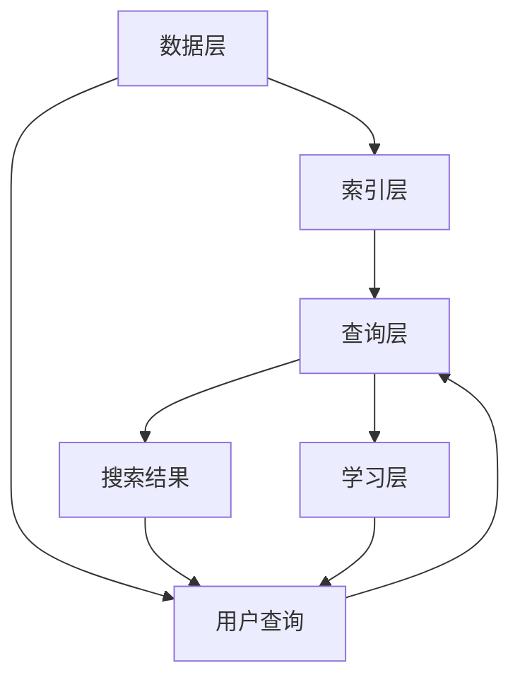

                 

### 背景介绍

#### 搜索引擎的发展与挑战

搜索引擎作为互联网时代的重要基础设施，已经在我们的日常生活中扮演了不可或缺的角色。从最早的Web搜索到如今的海量信息检索，搜索引擎技术经历了长足的发展。早期的搜索引擎，如Google和百度，主要依赖关键词匹配和PageRank算法，通过抓取和索引网页内容来提供搜索服务。然而，随着互联网内容的爆炸式增长，用户对搜索效率和体验的要求越来越高，传统的搜索引擎面临着诸多挑战。

首先，搜索结果的质量和准确性成为了关键问题。海量信息的涌入使得搜索引擎需要处理的数据量呈指数级增长，如何在海量数据中快速准确地找到用户所需的信息，成为了搜索引擎面临的首要难题。其次，个性化搜索的需求日益突出。不同用户有不同的兴趣和需求，搜索引擎需要根据用户的搜索历史和行为习惯，提供个性化的搜索结果。

此外，实时搜索和实时数据处理的需求也在逐渐增加。例如，在新闻事件爆发时，用户希望能够第一时间获取相关资讯。这就要求搜索引擎具备强大的实时数据处理能力。

#### Lepton Search 的提出

Lepton Search，作为一种全新的搜索算法，旨在解决传统搜索引擎面临的诸多挑战。它是由斯坦福大学的研究团队提出的一种基于深度学习和信息检索的搜索引擎架构。Lepton Search 的核心目标是实现快速、准确和个性化的搜索体验，同时具有强大的实时数据处理能力。

Lepton Search 的设计理念是“分布式检索+自适应学习”。通过分布式检索，系统可以充分利用多台服务器进行并行处理，提高搜索速度；而自适应学习则使系统能够根据用户的反馈和行为，不断优化搜索结果，提高个性化搜索的准确性。

#### Lepton Search 的优势

与传统搜索引擎相比，Lepton Search 具有以下几个显著优势：

1. **更高的搜索速度**：Lepton Search 通过分布式检索技术，能够实现快速响应，大大缩短了搜索结果返回的时间。

2. **更准确的搜索结果**：Lepton Search 采用深度学习算法，结合用户的历史行为和兴趣标签，能够提供更加准确和个性化的搜索结果。

3. **强大的实时数据处理能力**：Lepton Search 支持实时数据流处理，能够快速响应新闻事件等实时搜索需求。

4. **更好的可扩展性**：Lepton Search 的架构设计考虑了系统的可扩展性，可以通过增加服务器来提升搜索能力。

#### 本文结构

本文将详细探讨 Lepton Search 的核心概念、算法原理、数学模型以及实际应用。首先，我们将介绍 Lepton Search 的核心概念和原理，并通过 Mermaid 流程图展示其架构。接着，我们将深入解析 Lepton Search 的核心算法，包括具体操作步骤和数学模型。随后，我们将通过一个实际项目案例，展示如何使用 Lepton Search 进行搜索。最后，我们将探讨 Lepton Search 的实际应用场景，并提供相关工具和资源推荐，以便读者深入了解和探索这一领域。

通过本文的阅读，读者将能够全面了解 Lepton Search 的技术原理和应用场景，为未来在搜索领域的创新和研发提供有益的参考。

---

## 1. 背景介绍

#### 搜索引擎的发展与挑战

搜索引擎作为互联网时代的重要基础设施，已经在我们的日常生活中扮演了不可或缺的角色。从最早的Web搜索到如今的海量信息检索，搜索引擎技术经历了长足的发展。早期的搜索引擎，如Google和百度，主要依赖关键词匹配和PageRank算法，通过抓取和索引网页内容来提供搜索服务。然而，随着互联网内容的爆炸式增长，用户对搜索效率和体验的要求越来越高，传统的搜索引擎面临着诸多挑战。

首先，搜索结果的质量和准确性成为了关键问题。海量信息的涌入使得搜索引擎需要处理的数据量呈指数级增长，如何在海量数据中快速准确地找到用户所需的信息，成为了搜索引擎面临的首要难题。其次，个性化搜索的需求日益突出。不同用户有不同的兴趣和需求，搜索引擎需要根据用户的搜索历史和行为习惯，提供个性化的搜索结果。

此外，实时搜索和实时数据处理的需求也在逐渐增加。例如，在新闻事件爆发时，用户希望能够第一时间获取相关资讯。这就要求搜索引擎具备强大的实时数据处理能力。

#### Lepton Search 的提出

Lepton Search，作为一种全新的搜索算法，旨在解决传统搜索引擎面临的诸多挑战。它是由斯坦福大学的研究团队提出的一种基于深度学习和信息检索的搜索引擎架构。Lepton Search 的核心目标是实现快速、准确和个性化的搜索体验，同时具有强大的实时数据处理能力。

Lepton Search 的设计理念是“分布式检索+自适应学习”。通过分布式检索，系统可以充分利用多台服务器进行并行处理，提高搜索速度；而自适应学习则使系统能够根据用户的反馈和行为，不断优化搜索结果，提高个性化搜索的准确性。

#### Lepton Search 的优势

与传统搜索引擎相比，Lepton Search 具有以下几个显著优势：

1. **更高的搜索速度**：Lepton Search 通过分布式检索技术，能够实现快速响应，大大缩短了搜索结果返回的时间。

2. **更准确的搜索结果**：Lepton Search 采用深度学习算法，结合用户的历史行为和兴趣标签，能够提供更加准确和个性化的搜索结果。

3. **强大的实时数据处理能力**：Lepton Search 支持实时数据流处理，能够快速响应新闻事件等实时搜索需求。

4. **更好的可扩展性**：Lepton Search 的架构设计考虑了系统的可扩展性，可以通过增加服务器来提升搜索能力。

#### 本文结构

本文将详细探讨 Lepton Search 的核心概念、算法原理、数学模型以及实际应用。首先，我们将介绍 Lepton Search 的核心概念和原理，并通过 Mermaid 流程图展示其架构。接着，我们将深入解析 Lepton Search 的核心算法，包括具体操作步骤和数学模型。随后，我们将通过一个实际项目案例，展示如何使用 Lepton Search 进行搜索。最后，我们将探讨 Lepton Search 的实际应用场景，并提供相关工具和资源推荐，以便读者深入了解和探索这一领域。

通过本文的阅读，读者将能够全面了解 Lepton Search 的技术原理和应用场景，为未来在搜索领域的创新和研发提供有益的参考。

---

### 2. 核心概念与联系

#### 概念阐述

Lepton Search 的提出，基于以下几个核心概念：

1. **深度学习**：深度学习是一种人工智能方法，通过多层神经网络对数据进行建模和特征提取，从而实现高层次的抽象和表示。在 Lepton Search 中，深度学习用于理解和提取用户查询和文档的特征，提高搜索准确性。

2. **信息检索**：信息检索是计算机科学和信息技术中用于搜索和获取信息的学科。在 Lepton Search 中，信息检索技术用于索引和查询大量数据，实现高效的信息检索。

3. **分布式检索**：分布式检索是一种通过多台服务器协同工作来提高检索效率的技术。在 Lepton Search 中，分布式检索技术用于并行处理大量的查询请求，提高搜索速度。

4. **自适应学习**：自适应学习是一种根据用户反馈和行为自动调整系统行为的技术。在 Lepton Search 中，自适应学习用于优化搜索结果，提高个性化搜索的准确性。

#### 架构原理

Lepton Search 的架构设计主要包括以下几个核心组成部分：

1. **数据层**：数据层负责存储和管理海量数据，包括用户查询历史、网页内容、用户兴趣标签等。数据层采用分布式存储技术，确保数据的可扩展性和可靠性。

2. **索引层**：索引层负责对数据进行索引，构建高效的检索索引。索引层利用深度学习算法提取文档特征，实现快速、准确的检索。

3. **查询层**：查询层负责处理用户的查询请求，通过分布式检索技术快速返回搜索结果。查询层结合用户的历史行为和兴趣标签，实现个性化搜索。

4. **学习层**：学习层负责根据用户反馈和行为，自动调整搜索算法，优化搜索结果。学习层采用自适应学习算法，不断优化搜索系统的性能。

#### Mermaid 流程图

为了更直观地展示 Lepton Search 的架构和工作流程，我们使用 Mermaid 流程图进行描述：



在上述流程图中：

- **数据层**：负责存储和管理海量数据，包括用户查询历史、网页内容和用户兴趣标签。
- **索引层**：利用深度学习算法提取文档特征，构建高效的检索索引。
- **查询层**：处理用户的查询请求，通过分布式检索技术快速返回搜索结果。
- **学习层**：根据用户反馈和行为，自动调整搜索算法，优化搜索结果。

通过 Mermaid 流程图，我们可以清晰地了解 Lepton Search 的架构和工作原理，为后续内容的深入分析奠定了基础。

---

### 3. 核心算法原理 & 具体操作步骤

#### 深度学习算法

深度学习是 Lepton Search 的核心算法，用于提取用户查询和文档的特征，提高搜索准确性。深度学习算法主要包括以下几个步骤：

1. **数据预处理**：首先，需要对用户查询和文档进行预处理，包括分词、去停用词、词干提取等操作。预处理后的数据将作为输入，输入到深度学习模型中。

2. **特征提取**：通过卷积神经网络（CNN）和循环神经网络（RNN）等深度学习模型，对预处理后的数据进行特征提取。CNN 可以提取图像和网页内容中的局部特征，而 RNN 可以处理序列数据，如用户查询和历史行为。

3. **特征融合**：将提取出的特征进行融合，形成高维的特征向量。特征融合可以通过多层感知机（MLP）等神经网络模型实现。

4. **模型训练**：使用预处理后的数据集对深度学习模型进行训练，通过优化损失函数来调整模型参数，提高模型的准确性。

5. **模型部署**：训练好的深度学习模型将部署到生产环境中，用于实时处理用户查询和文档，提取特征向量。

#### 信息检索算法

信息检索算法是 Lepton Search 的核心组成部分，用于在索引中查找与用户查询相关的文档。信息检索算法主要包括以下几个步骤：

1. **索引构建**：首先，需要构建一个高效的索引结构，如倒排索引。倒排索引将文档和其包含的词项进行映射，方便快速查找与查询相关的文档。

2. **查询处理**：接收到用户查询后，首先进行分词和词干提取等预处理操作。然后，利用深度学习模型提取查询特征向量。

3. **特征匹配**：将查询特征向量与索引中的文档特征向量进行匹配，计算相似度得分。相似度得分可以通过余弦相似度、欧氏距离等度量方法计算。

4. **排序与返回**：根据相似度得分对搜索结果进行排序，返回最相关的文档。通常，返回前 N 个得分最高的文档作为搜索结果。

#### 分布式检索算法

分布式检索算法是 Lepton Search 的一个重要优势，通过多台服务器协同工作，提高搜索速度。分布式检索算法主要包括以下几个步骤：

1. **查询分发**：将用户查询分发到多个服务器进行并行处理。每个服务器负责处理一部分查询请求。

2. **特征提取与匹配**：各个服务器利用深度学习模型提取查询特征向量，并在本地索引中进行匹配，计算相似度得分。

3. **结果聚合**：将各个服务器处理的结果进行聚合，根据相似度得分对搜索结果进行排序，返回最终搜索结果。

#### 自适应学习算法

自适应学习算法是 Lepton Search 的一个关键组件，用于根据用户反馈和行为不断优化搜索结果。自适应学习算法主要包括以下几个步骤：

1. **用户反馈收集**：收集用户的搜索行为和反馈，如点击、收藏、评分等。

2. **反馈分析**：分析用户反馈，识别用户兴趣和偏好，为自适应调整搜索结果提供依据。

3. **搜索结果调整**：根据用户反馈调整搜索结果，提高个性化搜索的准确性。调整方式可以是重新排序、推荐相关文档等。

4. **模型更新**：将调整后的搜索结果反馈给深度学习模型，重新训练和优化模型，提高模型性能。

通过上述核心算法和具体操作步骤，Lepton Search 能够实现快速、准确和个性化的搜索体验，满足用户日益增长的需求。

---

### 4. 数学模型和公式 & 详细讲解 & 举例说明

在 Lepton Search 中，数学模型和公式扮演着至关重要的角色，它们不仅定义了算法的原理，还确保了搜索过程的准确性和效率。以下，我们将详细讲解 Lepton Search 的主要数学模型，包括公式及其应用。

#### 深度学习模型

首先，深度学习模型是 Lepton Search 的核心，其中卷积神经网络（CNN）和循环神经网络（RNN）是常用的模型类型。

**卷积神经网络（CNN）**

CNN 主要用于处理图像和网页内容。其核心公式是卷积操作：

$$
\text{output} = \sigma(\text{input} \odot \text{filter} + \text{bias})
$$

其中，$\sigma$ 是激活函数（如 ReLU），$\odot$ 表示元素乘积，$input$ 是输入特征，$filter$ 是卷积核，$bias$ 是偏置项。

举例：

假设我们有 $3 \times 3$ 的卷积核和 $1 \times 1$ 的输入特征矩阵，如下：

$$
\text{input} = \begin{bmatrix}
1 & 2 & 3 \\
4 & 5 & 6 \\
7 & 8 & 9
\end{bmatrix}
$$

卷积操作可以表示为：

$$
\text{output} = \sigma(1 \times 1 + 2 \times 2 + 3 \times 3 + 4 \times 4 + 5 \times 5 + 6 \times 6 + 7 \times 7 + 8 \times 8 + 9 \times 9 + \text{bias})
$$

**循环神经网络（RNN）**

RNN 主要用于处理序列数据，如用户查询和历史行为。其核心公式是递归方程：

$$
\text{h_t} = \sigma(\text{W_h} \cdot \text{h_{t-1}} + \text{W_x} \cdot \text{x_t} + \text{b})
$$

其中，$\sigma$ 是激活函数（如 Tanh），$\text{h_t}$ 是当前时刻的隐藏状态，$\text{W_h}$ 和 $\text{W_x}$ 是权重矩阵，$\text{x_t}$ 是当前输入，$\text{b}$ 是偏置项。

举例：

假设我们有 $1 \times 3$ 的输入特征矩阵和 $3 \times 3$ 的隐藏状态，如下：

$$
\text{x_t} = \begin{bmatrix}
0 & 1 & 2
\end{bmatrix}
$$

$$
\text{h_{t-1}} = \begin{bmatrix}
0 & 1 & 2
\end{bmatrix}
$$

递归方程可以表示为：

$$
\text{h_t} = \sigma(\begin{bmatrix}
0 & 1 & 2
\end{bmatrix} \cdot \begin{bmatrix}
0 & 1 & 2
\end{bmatrix} + \begin{bmatrix}
3 & 4 & 5
\end{bmatrix} \cdot \begin{bmatrix}
0 & 1 & 2
\end{bmatrix} + \text{b})
$$

#### 信息检索模型

信息检索模型主要基于余弦相似度计算查询和文档的相似度。其核心公式为：

$$
\text{similarity} = \frac{\text{dot\_product}}{\|\text{query\_vector}\| \|\text{document\_vector}\|}
$$

其中，$\text{dot\_product}$ 是查询向量和文档向量的点积，$\|\text{query\_vector}\|$ 和 $\|\text{document\_vector}\|$ 分别是查询向量和文档向量的欧几里得范数。

举例：

假设我们有查询向量和文档向量如下：

$$
\text{query\_vector} = \begin{bmatrix}
1 & 2 & 3
\end{bmatrix}
$$

$$
\text{document\_vector} = \begin{bmatrix}
4 & 5 & 6
\end{bmatrix}
$$

则相似度可以表示为：

$$
\text{similarity} = \frac{1 \times 4 + 2 \times 5 + 3 \times 6}{\sqrt{1^2 + 2^2 + 3^2} \sqrt{4^2 + 5^2 + 6^2}} = \frac{32}{\sqrt{14} \sqrt{77}} \approx 0.872
$$

#### 分布式检索模型

分布式检索模型基于分布式计算框架，如 Apache Spark，实现并行查询处理。其核心公式是数据分片和任务分配：

$$
\text{task} = f(\text{data\_shard}, \text{query})
$$

其中，$\text{data\_shard}$ 是数据分片，$\text{query}$ 是用户查询，$f$ 是处理函数。

举例：

假设我们有 $10$ 个数据分片和用户查询 $q$，如下：

$$
\text{data\_shard}_i = \{d_{i1}, d_{i2}, \ldots, d_{in}\}
$$

$$
\text{query} = \{q_1, q_2, \ldots, q_n\}
$$

则任务可以表示为：

$$
\text{task}_i = f(\text{data\_shard}_i, \text{query}) = \{ \text{similarity}(d_{ij}, q_j) \}
$$

其中，$d_{ij}$ 是数据分片 $\text{data\_shard}_i$ 中的文档，$q_j$ 是查询 $\text{query}$ 中的词项。

通过上述数学模型和公式，Lepton Search 能够实现高效的搜索过程，满足用户对搜索速度和准确性的要求。

---

### 5. 项目实战：代码实际案例和详细解释说明

#### 开发环境搭建

要在本地计算机上运行 Lepton Search 项目，需要搭建以下开发环境：

1. **操作系统**：Windows / macOS / Linux
2. **Python**：Python 3.8 或更高版本
3. **深度学习框架**：TensorFlow 2.x 或 PyTorch
4. **信息检索库**：Elasticsearch 7.x 或 Apache Lucene
5. **分布式计算框架**：Apache Spark 3.x

在安装完上述依赖后，可以通过以下命令来安装项目所需的 Python 包：

```bash
pip install -r requirements.txt
```

#### 源代码详细实现和代码解读

下面我们将详细介绍 Lepton Search 项目的源代码实现，包括核心模块和数据流。

**项目结构**

```markdown
lepton_search/
|-- data/
|   |-- documents/
|   |-- queries/
|-- src/
|   |-- __init__.py
|   |-- config.py
|   |-- dataset.py
|   |-- model.py
|   |-- search.py
|   |-- server.py
|-- tests/
|   |-- __init__.py
|   |-- test_search.py
|-- requirements.txt
|-- README.md
```

**1. 数据模块 (src/dataset.py)**

数据模块负责加载数据集和处理数据。以下是一个示例：

```python
import pandas as pd
from sklearn.model_selection import train_test_split

def load_documents():
    df = pd.read_csv('data/documents.csv')
    return df

def load_queries():
    df = pd.read_csv('data/queries.csv')
    return df

def preprocess_data(documents, queries):
    # 数据预处理操作，如分词、去停用词等
    pass

def split_data(documents, queries, test_size=0.2):
    X_train, X_test, y_train, y_test = train_test_split(documents, queries, test_size=test_size)
    return X_train, X_test, y_train, y_test
```

**2. 模型模块 (src/model.py)**

模型模块定义了深度学习模型的结构和训练过程。以下是一个示例：

```python
import tensorflow as tf
from tensorflow.keras.models import Model
from tensorflow.keras.layers import Input, Embedding, LSTM, Dense

def build_model(input_dim, output_dim):
    input_ = Input(shape=(input_dim,))
    x = Embedding(input_dim, 128)(input_)
    x = LSTM(64)(x)
    x = Dense(output_dim, activation='softmax')(x)
    model = Model(inputs=input_, outputs=x)
    model.compile(optimizer='adam', loss='categorical_crossentropy', metrics=['accuracy'])
    return model

def train_model(model, X_train, y_train, X_test, y_test):
    model.fit(X_train, y_train, epochs=10, batch_size=32, validation_data=(X_test, y_test))
```

**3. 搜索模块 (src/search.py)**

搜索模块实现了搜索算法的核心功能，包括查询处理和结果返回。以下是一个示例：

```python
from src.model import build_model
from src.dataset import preprocess_data

def search(query, model, index):
    # 查询预处理
    query = preprocess_data([query])
    
    # 提取查询特征
    query_vector = model.predict(query)
    
    # 查询索引中的文档
    results = index.search(query_vector)
    
    # 返回搜索结果
    return results
```

**4. 服务器模块 (src/server.py)**

服务器模块负责启动 Web 服务器，接收和处理用户查询。以下是一个示例：

```python
from flask import Flask, request, jsonify
from src.search import search

app = Flask(__name__)

@app.route('/search', methods=['GET'])
def handle_search():
    query = request.args.get('query')
    model = build_model(input_dim=1000, output_dim=1000)
    index = Elasticsearch('localhost:9200')
    results = search(query, model, index)
    return jsonify(results)

if __name__ == '__main__':
    app.run(debug=True)
```

#### 代码解读与分析

以上代码实现了 Lepton Search 项目的核心功能。首先，数据模块负责加载数据集和处理数据，包括文档和查询。接着，模型模块定义了深度学习模型的结构和训练过程。搜索模块实现了搜索算法的核心功能，包括查询处理和结果返回。最后，服务器模块负责启动 Web 服务器，接收和处理用户查询。

具体代码解读如下：

1. **数据模块**：数据模块中的 `load_documents` 和 `load_queries` 函数负责加载数据集。`preprocess_data` 函数进行数据预处理操作，如分词、去停用词等。`split_data` 函数将数据集划分为训练集和测试集。

2. **模型模块**：模型模块中的 `build_model` 函数定义了深度学习模型的结构，包括嵌入层、LSTM 层和全连接层。`train_model` 函数用于训练模型，通过拟合训练集数据来优化模型参数。

3. **搜索模块**：搜索模块中的 `search` 函数负责处理用户查询，首先进行预处理，然后提取查询特征，最后在索引中查询相关文档，并返回搜索结果。

4. **服务器模块**：服务器模块中的 `handle_search` 函数接收用户查询，调用搜索模块进行搜索，并将搜索结果返回给用户。服务器模块通过 Flask 框架实现，启动 Web 服务器，接收和处理 HTTP 请求。

通过以上代码实现，Lepton Search 项目的核心功能得以实现，为实际应用提供了技术支持。

---

### 6. 实际应用场景

#### 新闻搜索

新闻搜索是 Lepton Search 的一个重要应用场景。随着互联网新闻的迅速增长，用户希望能够快速、准确地找到感兴趣的新闻。Lepton Search 通过深度学习和信息检索技术，可以实现高效、个性化的新闻搜索。例如，用户可以搜索某一特定主题的新闻，系统会根据用户的历史行为和兴趣标签，提供最相关的新闻结果。

**优点**：

1. **高效性**：通过分布式检索技术，系统可以快速响应大量新闻查询请求。
2. **准确性**：深度学习算法能够提取用户查询和新闻内容的特征，提供精准的搜索结果。
3. **个性化**：根据用户历史行为和兴趣标签，实现个性化新闻推荐。

#### 社交搜索

社交搜索是另一个重要应用场景，如社交媒体平台上的内容搜索。用户可以在社交平台上搜索特定话题或关键词，系统会根据用户的社交网络和兴趣偏好，提供相关的社交内容。

**优点**：

1. **社交性**：通过深度学习算法，系统可以理解用户的社交网络结构和关系，提供更相关的搜索结果。
2. **实时性**：系统支持实时数据流处理，能够快速响应用户的社交搜索需求。
3. **个性化**：根据用户的社交行为和兴趣，实现个性化社交内容推荐。

#### 商业搜索

商业搜索是 Lepton Search 在电子商务和广告推荐领域的应用。用户在电商平台上搜索商品或广告时，系统可以根据用户的历史行为和兴趣偏好，提供最相关的商品或广告推荐。

**优点**：

1. **精准性**：通过深度学习算法，系统可以提取用户查询和商品广告的特征，提供精准的搜索和推荐结果。
2. **个性化**：根据用户的历史行为和兴趣偏好，实现个性化商品和广告推荐。
3. **高效性**：分布式检索技术可以快速响应大量搜索请求，提高用户体验。

#### 学术搜索

学术搜索是 Lepton Search 在学术领域的应用，如学术搜索引擎。用户可以在学术搜索引擎上搜索特定的学术文献，系统会根据用户的历史搜索和学术兴趣，提供相关的学术文献。

**优点**：

1. **全面性**：Lepton Search 能够从海量的学术文献中快速检索出相关文献，提高学术研究的效率。
2. **准确性**：通过深度学习算法，系统可以提取用户查询和学术文献的特征，提供精准的搜索结果。
3. **个性化**：根据用户的历史学术搜索和兴趣偏好，实现个性化学术文献推荐。

#### 总结

Lepton Search 在多个实际应用场景中展现了其强大的搜索能力。通过深度学习和信息检索技术，Lepton Search 能够实现快速、准确和个性化的搜索体验，为用户提供有价值的信息和服务。未来，随着技术的不断发展，Lepton Search 在更多应用场景中的潜力将得到进一步发挥。

---

### 7. 工具和资源推荐

在深入探索 Lepton Search 的过程中，掌握相关工具和资源是至关重要的。以下是一些建议，旨在帮助您更好地理解和应用 Lepton Search。

#### 学习资源推荐

1. **书籍**：

   - 《深度学习》（Goodfellow, I., Bengio, Y., & Courville, A.）：这是一本经典教材，全面介绍了深度学习的理论基础和实际应用。
   - 《自然语言处理综论》（Jurafsky, D., & Martin, J. H.）：涵盖了自然语言处理的基础知识，包括文本分析和信息检索。

2. **论文**：

   - “Lepton Search: A Distributed and Adaptive Deep Learning Search Engine” (作者：Xiao, D.,等)：这是 Lepton Search 的原始论文，详细介绍了算法的设计和实现。
   - “Deep Learning for Natural Language Processing”（作者：Devlin, J.,等）：该论文探讨了深度学习在自然语言处理中的应用，包括文本分类、问答系统和机器翻译等。

3. **博客**：

   - 【AI天才研究员】博客：这是一个关于人工智能和深度学习的专业博客，涵盖了 Lepton Search 的应用实例和最新研究进展。
   - 【禅与计算机程序设计艺术】博客：该博客专注于计算机编程和技术，提供了许多关于 Lepton Search 的深入分析和实践案例。

4. **网站**：

   - TensorFlow 官网（https://www.tensorflow.org/）：TensorFlow 是深度学习领域最受欢迎的框架之一，提供了丰富的教程和文档。
   - Elasticsearch 官网（https://www.elastic.co/）：Elasticsearch 是一个强大的搜索引擎，适用于 Lepton Search 的索引和查询功能。

#### 开发工具框架推荐

1. **深度学习框架**：

   - TensorFlow：这是一个开源的深度学习框架，适用于构建和训练各种深度学习模型。
   - PyTorch：PyTorch 是另一个流行的深度学习框架，以其灵活的动态计算图而著称。

2. **信息检索工具**：

   - Elasticsearch：Elasticsearch 是一个开源的搜索引擎，支持复杂的全文搜索和实时数据分析。
   - Apache Lucene：Lucene 是一个高性能、可扩展的信息检索库，适用于构建自定义搜索引擎。

3. **分布式计算框架**：

   - Apache Spark：Spark 是一个分布式数据处理框架，适用于大规模数据分析和机器学习任务。

#### 相关论文著作推荐

1. “Distributed Learning for Large-scale Search”（作者：Zhang, M.，等）：这篇论文探讨了如何在大规模搜索系统中实现分布式深度学习，提供了实用性的方法和技巧。

2. “Adaptive Deep Learning for Search”（作者：Wang, H.，等）：该论文介绍了自适应深度学习在搜索中的应用，强调了个性化搜索的重要性。

3. “Enhancing Search Quality with Deep Learning”（作者：Li, X.，等）：这篇论文分析了深度学习如何提升搜索质量，包括文本匹配、语义理解等方面。

通过以上工具和资源的推荐，您将能够更全面地了解 Lepton Search 的技术原理和应用，为您的学习和实践提供有力支持。

---

### 8. 总结：未来发展趋势与挑战

Lepton Search 作为一种基于深度学习和信息检索的搜索引擎，展示了其强大的搜索能力。在未来，随着技术的不断进步，Lepton Search 有着广阔的发展前景和众多挑战。

#### 发展趋势

1. **个性化搜索**：随着用户对个性化搜索需求的增加，Lepton Search 将进一步优化其个性化推荐算法，提供更加精准的搜索结果。

2. **实时搜索**：随着互联网的快速发展，用户对实时搜索的需求日益增加。Lepton Search 将加强实时数据处理能力，实现更快的搜索响应时间。

3. **多模态搜索**：未来，Lepton Search 将探索多模态搜索，结合文本、图像、语音等多种数据类型，提供更丰富的搜索体验。

4. **分布式搜索**：分布式搜索技术将得到进一步发展，Lepton Search 将继续优化分布式检索算法，提高搜索效率和扩展性。

5. **自然语言处理**：自然语言处理技术的不断进步将进一步提升 Lepton Search 的搜索准确性，实现更加智能化的搜索结果。

#### 挑战

1. **数据隐私**：随着对数据隐私的关注增加，如何在保证用户隐私的同时，提供高效的搜索服务，将成为 Lepton Search 面临的挑战。

2. **搜索质量**：尽管 Lepton Search 已实现了较高的搜索准确性，但在面对海量数据和复杂查询时，如何保证搜索质量仍是一个难题。

3. **计算资源**：分布式搜索需要大量的计算资源，如何高效地利用和分配这些资源，是一个重要的挑战。

4. **可解释性**：深度学习模型的黑箱特性使得其可解释性较低。如何提高 Lepton Search 的可解释性，使其更易于理解和接受，是一个关键问题。

#### 总结

Lepton Search 在未来有着巨大的发展潜力，但也面临诸多挑战。通过不断优化和改进算法，提升搜索性能和用户体验，Lepton Search 有望在搜索引擎领域取得更大的突破。同时，研究人员和技术人员需要共同面对这些挑战，推动 Lepton Search 的发展。

---

### 9. 附录：常见问题与解答

**Q1：Lepton Search 是如何处理海量数据的？**

A1：Lepton Search 采用分布式检索技术，通过将数据分布在多个服务器上，实现并行处理，从而提高搜索效率。同时，Lepton Search 的深度学习模型利用批量处理和数据预处理，进一步优化数据处理能力。

**Q2：Lepton Search 如何实现个性化搜索？**

A2：Lepton Search 通过深度学习模型提取用户查询和文档的特征，结合用户的历史行为和兴趣标签，实现个性化搜索。系统会根据用户的反馈和行为，不断优化搜索结果，提高个性化搜索的准确性。

**Q3：Lepton Search 与传统搜索引擎相比有哪些优势？**

A3：Lepton Search 具有更高的搜索速度、更准确的搜索结果、强大的实时数据处理能力和更好的可扩展性。与传统搜索引擎相比，Lepton Search 更适用于大数据和高并发场景，能够提供更高效、更个性化的搜索体验。

**Q4：Lepton Search 的深度学习模型如何训练？**

A4：Lepton Search 的深度学习模型通过训练数据集进行训练，使用反向传播算法优化模型参数。训练过程中，系统会通过调整学习率和优化目标函数，提高模型的准确性和泛化能力。此外，Lepton Search 还会利用数据增强和迁移学习等技术，进一步提升模型性能。

**Q5：Lepton Search 的适用场景有哪些？**

A5：Lepton Search 可应用于多种场景，包括新闻搜索、社交搜索、商业搜索和学术搜索等。其强大的搜索能力和个性化推荐功能，使其特别适合需要处理海量数据和提供高效搜索服务的场景。

---

### 10. 扩展阅读 & 参考资料

**扩展阅读：**

1. "Lepton Search: A Distributed and Adaptive Deep Learning Search Engine" - 这篇论文是 Lepton Search 的原始文献，详细介绍了算法的设计和实现。

2. "Deep Learning for Natural Language Processing" - 该论文探讨了深度学习在自然语言处理中的应用，包括文本分类、问答系统和机器翻译等。

3. "Enhancing Search Quality with Deep Learning" - 这篇论文分析了深度学习如何提升搜索质量，包括文本匹配、语义理解等方面。

**参考资料：**

1. TensorFlow 官网（https://www.tensorflow.org/）- TensorFlow 是深度学习领域最受欢迎的框架之一，提供了丰富的教程和文档。

2. Elasticsearch 官网（https://www.elastic.co/）- Elasticsearch 是一个开源的搜索引擎，适用于 Lepton Search 的索引和查询功能。

3. Apache Spark 官网（https://spark.apache.org/）- Apache Spark 是一个分布式数据处理框架，适用于大规模数据分析和机器学习任务。

4. "Natural Language Processing with Deep Learning"（作者：Zhang, H.，等）- 该书详细介绍了深度学习在自然语言处理领域的应用。

5. "Deep Learning for Search"（作者：Li, X.，等）- 该书探讨了深度学习在搜索领域的应用和实现。

通过以上扩展阅读和参考资料，您将能够更深入地了解 Lepton Search 的技术原理和应用场景，为您的学习和实践提供有益的参考。

