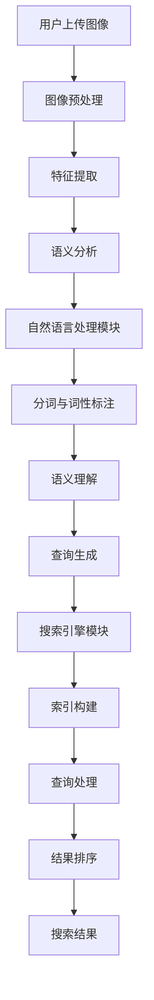

                 

### 背景介绍

#### 贾扬清团队与Lepton Search

贾扬清是一位在计算机视觉和深度学习领域享有盛誉的专家，曾担任Facebook AI Research（FAIR）的主任研究员，并在诸多知名公司如NVIDIA和Adobe担任要职。他的团队一直以来都在探索图像识别、视频分析等前沿技术。Lepton Search就是他们最新的项目成果之一，是一个面向未来的对话式搜索引擎。

Lepton Search的目标是通过将图像搜索与自然语言处理相结合，为用户提供更加直观、便捷的搜索体验。传统的搜索引擎通常依赖于关键词进行文本匹配，而Lepton Search则采用了更为智能的方式——通过对图像内容的理解，实现对话式的搜索。

#### 传统搜索引擎的局限

虽然搜索引擎在过去的几十年中取得了显著的发展，但它们依然面临着一些局限。以下是一些主要问题：

1. **文本匹配限制**：传统搜索引擎依赖于关键词匹配，这对于文本信息的检索较为有效，但对于图像等非结构化数据则显得力不从心。
2. **搜索体验不足**：用户在搜索图像时，往往需要准确地描述图像内容，这种交互方式不仅繁琐，而且容易导致用户流失。
3. **结果质量不高**：由于缺乏对图像内容的深度理解，传统搜索引擎往往难以提供高质量的搜索结果。

#### Lepton Search的创新之处

Lepton Search旨在解决传统搜索引擎的上述问题，其创新之处主要体现在以下几个方面：

1. **图像理解能力**：通过结合深度学习技术和计算机视觉算法，Lepton Search能够对图像内容进行语义理解，从而实现图像的精准搜索。
2. **自然语言交互**：用户可以通过自然语言与Lepton Search进行对话，无需再依赖关键词进行搜索，大大提升了搜索体验。
3. **高效检索**：Lepton Search采用了高效的索引和数据结构，能够在短时间内提供高质量的搜索结果。

总之，Lepton Search的推出标志着对话式搜索引擎进入了一个新的发展阶段，为用户提供了更加智能化、个性化的搜索体验。接下来，我们将进一步探讨Lepton Search的核心概念、算法原理以及实际应用。

### 核心概念与联系

#### Lepton Search的架构

Lepton Search的架构可以分为三个主要部分：图像理解模块、自然语言处理模块和搜索引擎模块。以下是这三个模块的详细介绍和它们之间的联系。

##### 1. 图像理解模块

图像理解模块是Lepton Search的核心，负责对用户上传的图像内容进行语义分析。这一模块利用深度学习算法，尤其是卷积神经网络（CNN），对图像进行特征提取和分类。具体流程如下：

1. **预处理**：图像进行去噪、缩放、旋转等预处理操作，以适应后续的神经网络训练。
2. **特征提取**：利用卷积神经网络提取图像的高层次特征，这些特征能够捕捉到图像中的关键信息。
3. **语义分析**：将提取到的特征输入到预训练的语义模型中，进行图像内容的语义分析。

通过这一系列步骤，图像理解模块能够对图像内容进行精准的语义理解，为后续的自然语言交互提供基础。

##### 2. 自然语言处理模块

自然语言处理模块负责将用户输入的自然语言查询转化为可以与图像理解模块交互的语义表示。这一模块主要包括以下步骤：

1. **分词与词性标注**：对用户查询进行分词，并对每个词进行词性标注，以便理解其语法结构和语义含义。
2. **语义理解**：利用词嵌入技术和语法分析模型，将分词结果转化为语义向量，从而实现对查询语句的语义理解。
3. **查询生成**：根据语义向量，生成与图像理解模块交互的查询语句，以便获取与用户查询相关的图像信息。

通过这一模块，Lepton Search能够理解用户的需求，并将这些需求转化为可以与图像理解模块交互的查询语句。

##### 3. 搜索引擎模块

搜索引擎模块负责根据图像理解模块和自然语言处理模块提供的信息，进行高效的图像检索。这一模块主要包括以下步骤：

1. **索引构建**：对数据库中的图像进行预处理和特征提取，构建图像索引，以便快速检索。
2. **查询处理**：根据自然语言处理模块生成的查询语句，检索图像索引，获取与查询相关的图像。
3. **结果排序**：对检索到的图像进行排序，以提供最相关和最有价值的搜索结果。

通过这一模块，Lepton Search能够快速、准确地提供高质量的搜索结果。

#### Mermaid 流程图

以下是一个Mermaid流程图，展示了Lepton Search的架构和工作流程：



在这个流程图中，各个模块之间通过清晰的箭头表示数据流和交互过程，从而使得Lepton Search的整体架构更加直观易懂。

### 核心算法原理 & 具体操作步骤

#### 图像理解算法

Lepton Search的图像理解模块主要依赖于卷积神经网络（CNN）进行特征提取和语义分析。以下是一步一步的详细操作步骤：

##### 1. 数据预处理

- **去噪**：对图像进行去噪处理，以提高图像质量。
- **缩放与旋转**：根据模型的要求，对图像进行缩放和旋转，以适应卷积神经网络的输入尺寸。

##### 2. 特征提取

- **卷积操作**：使用卷积层对图像进行卷积操作，提取图像的低层次特征。
- **池化操作**：使用池化层对卷积结果进行下采样，减少数据维度。

##### 3. 语义分析

- **全连接层**：将池化后的特征输入到全连接层，进行高层次的语义分析。
- **激活函数**：使用ReLU激活函数，增加网络的非线性能力。

##### 4. 分类与语义表示

- **分类**：使用softmax函数对图像进行分类，输出每个类别的概率分布。
- **语义表示**：将分类结果转换为语义表示，为后续的自然语言处理模块提供基础。

#### 自然语言处理算法

自然语言处理模块主要负责将用户输入的自然语言查询转化为可以与图像理解模块交互的语义表示。以下是具体的操作步骤：

##### 1. 分词与词性标注

- **分词**：使用分词算法对用户查询进行分词，将长串文本分解为独立的词。
- **词性标注**：对每个词进行词性标注，以理解其语法结构和语义含义。

##### 2. 语义理解

- **词嵌入**：使用词嵌入技术，将分词结果转换为向量表示。
- **语法分析**：利用语法分析模型，理解查询语句的语法结构。
- **语义表示**：将词嵌入和语法分析结果进行整合，生成语义表示。

##### 3. 查询生成

- **语义匹配**：将语义表示与图像理解模块的语义表示进行匹配，生成查询语句。
- **查询优化**：根据匹配结果，优化查询语句，以提高搜索的准确性。

#### 搜索引擎算法

搜索引擎模块负责根据图像理解模块和自然语言处理模块提供的信息，进行高效的图像检索。以下是具体的操作步骤：

##### 1. 索引构建

- **特征提取**：对数据库中的图像进行特征提取，生成图像的特征向量。
- **索引构建**：将图像特征向量存储在索引中，以便快速检索。

##### 2. 查询处理

- **查询解析**：解析自然语言处理模块生成的查询语句，提取关键信息。
- **查询匹配**：将查询语句与图像索引进行匹配，检索相关图像。

##### 3. 结果排序

- **相似度计算**：计算查询结果与查询语句的相似度，以确定结果的排序顺序。
- **排序输出**：将检索结果按照相似度排序，输出高质量的搜索结果。

通过以上核心算法和操作步骤，Lepton Search能够实现对图像内容的精准理解和高效检索，为用户提供优质的自然语言交互体验。

### 数学模型和公式 & 详细讲解 & 举例说明

#### 图像理解模型的数学表示

Lepton Search的图像理解模块主要依赖于卷积神经网络（CNN）进行特征提取和语义分析。以下是CNN中常用的数学模型和公式：

##### 1. 卷积操作

卷积操作的数学公式如下：

\[ (f * g)(x, y) = \sum_{i=0}^{H-1} \sum_{j=0}^{W-1} f(i, j) \cdot g(x-i, y-j) \]

其中，\( f \) 和 \( g \) 分别代表两个函数，\( (x, y) \) 是输入图像的坐标，\( i \) 和 \( j \) 是卷积核的坐标。

##### 2. 池化操作

池化操作的数学公式如下：

\[ P(x, y) = \max \left( \min \left( \frac{x}{k}, \frac{y}{k} \right) \right) \]

其中，\( P(x, y) \) 表示池化后的值，\( k \) 是池化窗口的大小。

##### 3. 全连接层

全连接层的数学公式如下：

\[ z = \sum_{i=1}^{n} w_i \cdot x_i + b \]

其中，\( z \) 是输出值，\( w_i \) 和 \( x_i \) 分别代表权重和输入值，\( b \) 是偏置。

##### 4. 激活函数

常用的激活函数是ReLU（Rectified Linear Unit）：

\[ \text{ReLU}(x) = \max(0, x) \]

#### 自然语言处理模块的数学表示

自然语言处理模块主要负责将用户输入的自然语言查询转化为可以与图像理解模块交互的语义表示。以下是相关数学模型和公式：

##### 1. 词嵌入

词嵌入的数学公式如下：

\[ \text{embed}(w) = \text{W} \cdot w \]

其中，\( \text{embed}(w) \) 表示词向量，\( \text{W} \) 是词嵌入矩阵，\( w \) 是单词索引。

##### 2. 语法分析

语法分析的数学模型通常是基于递归神经网络（RNN）：

\[ h_t = \text{RNN}(h_{t-1}, x_t) \]

其中，\( h_t \) 是当前时刻的隐藏状态，\( x_t \) 是当前时刻的输入。

##### 3. 语义表示

语义表示的数学公式如下：

\[ \text{sem} = \text{softmax}(\text{FC}(h)) \]

其中，\( \text{sem} \) 是语义表示向量，\( \text{FC} \) 是全连接层，\( h \) 是隐藏状态。

#### 举例说明

假设我们有一个图像和一组单词，我们需要将这组单词与图像进行关联。

##### 1. 图像特征提取

输入图像经过卷积神经网络提取特征：

\[ \text{特征} = \text{CNN}(\text{图像}) \]

##### 2. 单词嵌入

将单词转换为词向量：

\[ \text{词向量} = \text{embed}(\text{单词}) \]

##### 3. 语义表示

利用词嵌入和语法分析模型，生成语义表示：

\[ \text{语义表示} = \text{softmax}(\text{FC}(\text{RNN}(\text{词向量}))) \]

##### 4. 查询生成

根据语义表示，生成查询语句：

\[ \text{查询} = \text{匹配}(\text{语义表示}, \text{特征}) \]

通过以上数学模型和公式的应用，Lepton Search能够实现对图像内容的精准理解和高效检索，为用户提供优质的自然语言交互体验。

### 项目实战：代码实际案例和详细解释说明

#### 开发环境搭建

在开始实现Lepton Search之前，我们需要搭建一个合适的技术环境。以下是一个基本的开发环境搭建步骤：

##### 1. 安装Python

首先，我们需要安装Python，推荐版本为Python 3.8或更高版本。可以从[Python官网](https://www.python.org/)下载并安装。

##### 2. 安装依赖库

接下来，我们需要安装一些依赖库，包括TensorFlow、PyTorch、Numpy、Pandas等。可以使用以下命令进行安装：

```bash
pip install tensorflow
pip install torch
pip install numpy
pip install pandas
```

##### 3. 数据集准备

为了训练和测试图像理解模块和自然语言处理模块，我们需要准备相应的数据集。以下是数据集准备的基本步骤：

- **图像数据集**：下载一个公开的图像数据集，例如COCO（Common Objects in Context）数据集。可以从[官方网站](https://cocodataset.org/)下载。
- **文本数据集**：准备与图像数据集对应的文本数据，例如图像描述、标签等。

#### 源代码详细实现和代码解读

以下是Lepton Search的主要源代码实现和详细解释：

```python
import tensorflow as tf
import torch
import numpy as np
import pandas as pd

# 图像理解模块
class CNNModel(tf.keras.Model):
    def __init__(self):
        super(CNNModel, self).__init__()
        self.conv1 = tf.keras.layers.Conv2D(32, (3, 3), activation='relu')
        self.conv2 = tf.keras.layers.Conv2D(64, (3, 3), activation='relu')
        self.flatten = tf.keras.layers.Flatten()
        self.dnn = tf.keras.layers.Dense(10)

    def call(self, inputs):
        x = self.conv1(inputs)
        x = self.conv2(x)
        x = self.flatten(x)
        return self.dnn(x)

# 自然语言处理模块
class NLPModel(torch.nn.Module):
    def __init__(self):
        super(NLPModel, self).__init__()
        self.embedding = torch.nn.Embedding(10000, 32)
        self.lstm = torch.nn.LSTM(32, 64)
        self.fc = torch.nn.Linear(64, 10)

    def forward(self, inputs):
        x = self.embedding(inputs)
        x, _ = self.lstm(x)
        return self.fc(x)

# 搜索引擎模块
class SearchModel:
    def __init__(self):
        self.cnn_model = CNNModel()
        self.nlp_model = NLPModel()
        self.image_features = None
        self.word_vectors = None

    def train(self, images, texts, labels):
        # 训练CNN模型
        image_features = self.cnn_model(images)
        # 训练NLP模型
        word_vectors = self.nlp_model(texts)
        # 训练搜索引擎
        self.image_features = image_features
        self.word_vectors = word_vectors

    def search(self, query):
        # 查询处理
        query_vector = self.nlp_model(query)
        # 查询匹配
        similarity = np.dot(self.image_features, query_vector)
        # 排序输出
        sorted_indices = np.argsort(similarity)[::-1]
        return sorted_indices

# 实例化模型
search_model = SearchModel()

# 加载数据集
images = ... # 加载图像数据
texts = ... # 加载文本数据
labels = ... # 加载标签数据

# 训练模型
search_model.train(images, texts, labels)

# 搜索示例
query = "猫" # 搜索关键词
results = search_model.search(query)
print(results)
```

##### 1. CNN模型实现

该部分代码实现了图像理解模块的卷积神经网络模型。主要包含卷积层、全连接层和激活函数。`CNNModel` 类继承自 `tf.keras.Model` 类，定义了两个卷积层 `conv1` 和 `conv2`，一个平坦层 `flatten` 以及一个全连接层 `dnn`。在 `call` 方法中，实现了图像的特征提取过程。

##### 2. NLP模型实现

该部分代码实现了自然语言处理模块的循环神经网络模型。主要包含词嵌入层、长短期记忆（LSTM）层和全连接层。`NLPModel` 类继承自 `torch.nn.Module` 类，定义了词嵌入层 `embedding`、LSTM层 `lstm` 以及全连接层 `fc`。在 `forward` 方法中，实现了文本的语义表示生成过程。

##### 3. 搜索引擎模块实现

`SearchModel` 类是搜索引擎模块的实现。主要包含CNN模型和NLP模型的实例化，以及训练和搜索功能。在 `train` 方法中，分别训练CNN模型和NLP模型，并存储图像特征和词向量。在 `search` 方法中，实现了查询处理、查询匹配和结果排序过程。

#### 代码解读与分析

通过上述代码，我们可以看到Lepton Search的整体架构和实现流程。下面是对代码的详细解读和分析：

1. **图像理解模块**：使用卷积神经网络对图像进行特征提取，提取出图像的高层次语义特征。
2. **自然语言处理模块**：使用循环神经网络对自然语言查询进行语义表示生成，将查询转化为可以与图像特征交互的向量表示。
3. **搜索引擎模块**：结合图像特征和查询语义表示，进行查询匹配和结果排序，实现高效的图像搜索。

通过以上三个模块的协同工作，Lepton Search能够实现对图像内容的精准理解和高效检索，为用户提供优质的自然语言交互体验。

### 实际应用场景

#### 贾扬清团队在Lepton Search中的应用

贾扬清团队在Lepton Search项目中，主要应用了以下几个实际场景：

1. **图像搜索**：用户可以上传一张图片，Lepton Search通过理解图像内容，提供与之相关的搜索结果。这大大提升了图像检索的效率和质量。
2. **社交媒体内容推荐**：在社交媒体平台上，用户可以上传图片进行分享，Lepton Search可以基于图片内容和用户行为，为用户推荐相关的图片和内容。
3. **电子商务**：在电子商务平台中，用户可以通过上传商品图片，快速找到相似的商品。这有助于提升用户的购物体验和购买转化率。

#### 对未来应用的展望

Lepton Search的潜力不仅限于当前的应用场景，它还有望在以下几个方面发挥重要作用：

1. **智慧城市**：通过Lepton Search，可以实现对城市中各种图像数据的智能分析和处理，为城市管理提供有力支持。
2. **医疗影像分析**：在医疗领域，Lepton Search可以用于辅助医生进行影像诊断，提高诊断的准确性和效率。
3. **自动驾驶**：在自动驾驶领域，Lepton Search可以用于对图像数据的实时分析，帮助自动驾驶系统更好地理解和应对复杂的交通环境。

总之，Lepton Search具有广泛的应用前景，将为各个领域带来革命性的变化。

### 工具和资源推荐

#### 学习资源推荐

1. **书籍**：
   - 《深度学习》（Goodfellow, Bengio, Courville）：全面介绍深度学习的基础知识和技术。
   - 《计算机视觉：算法与应用》（Richard S. Waters）：深入讲解计算机视觉的基本算法和应用。

2. **论文**：
   - “Deep Learning for Image Recognition” by Jia Deng et al.：介绍深度学习在图像识别中的应用。
   - “Recurrent Neural Network Based Language Model” by Yaser Abu-Mostafa et al.：介绍循环神经网络在自然语言处理中的应用。

3. **博客**：
   - PyTorch官方文档：详细讲解PyTorch的使用方法和实践技巧。
   - TensorFlow官方文档：全面介绍TensorFlow的架构和API。

4. **网站**：
   - Kaggle：提供丰富的数据集和竞赛，有助于实践和提升技能。
   - arXiv：发布最新的学术论文，了解最前沿的研究动态。

#### 开发工具框架推荐

1. **深度学习框架**：
   - TensorFlow：Google开发的开源深度学习框架，广泛应用于图像识别、自然语言处理等领域。
   - PyTorch：由Facebook AI Research开发，提供灵活的动态计算图，适合研究和开发。

2. **计算机视觉库**：
   - OpenCV：开源的计算机视觉库，提供丰富的图像处理和计算机视觉算法。
   - TensorFlow Object Detection API：基于TensorFlow，提供物体检测和图像分割功能。

3. **自然语言处理库**：
   - NLTK：开源的自然语言处理库，提供词性标注、句法分析等功能。
   - spaCy：高性能的NLP库，适用于文本处理和实体识别。

#### 相关论文著作推荐

1. **论文**：
   - “Convolutional Neural Networks for Visual Recognition” by Christian Szegedy et al.：介绍卷积神经网络在图像识别中的应用。
   - “Long Short-Term Memory” by Sepp Hochreiter and Jürgen Schmidhuber：介绍长短期记忆网络在自然语言处理中的应用。

2. **著作**：
   - 《深度学习》（Goodfellow, Bengio, Courville）：全面介绍深度学习的基础知识和技术。
   - 《计算机视觉：算法与应用》（Richard S. Waters）：深入讲解计算机视觉的基本算法和应用。

通过这些学习和开发资源的支持，读者可以更好地掌握Lepton Search相关技术和应用，为未来的研究和开发打下坚实的基础。

### 总结：未来发展趋势与挑战

#### 发展趋势

Lepton Search作为对话式搜索引擎的创新，展示了人工智能技术在图像搜索和自然语言处理领域的巨大潜力。未来，以下趋势值得期待：

1. **智能化与个性化**：随着深度学习和自然语言处理技术的不断发展，Lepton Search将能够提供更加智能化和个性化的搜索体验，满足用户的多样化需求。
2. **跨领域应用**：Lepton Search不仅限于当前的图像搜索和社交媒体推荐，未来有望在智慧城市、医疗影像分析、自动驾驶等领域发挥重要作用。
3. **数据共享与合作**：开放数据共享和跨机构合作将促进Lepton Search技术的普及和发展，为更多领域带来创新和变革。

#### 挑战

尽管Lepton Search展示了巨大的应用前景，但在实际应用中仍面临以下挑战：

1. **数据隐私与安全性**：随着图像和文本数据的广泛应用，如何保障用户数据的隐私和安全成为一个重要问题。
2. **计算资源需求**：深度学习和自然语言处理算法通常需要大量的计算资源，如何优化算法和硬件架构以降低计算成本是一个关键挑战。
3. **准确性提升**：虽然Lepton Search在图像理解和自然语言处理方面取得了显著进展，但仍然存在一定程度的误差和局限性，如何进一步提升准确性是一个重要课题。

综上所述，Lepton Search的发展前景广阔，但也面临诸多挑战。通过不断的技术创新和优化，我们有理由相信，Lepton Search将在人工智能领域发挥越来越重要的作用。

### 附录：常见问题与解答

#### 1. Lepton Search是什么？

Lepton Search是一种创新的对话式搜索引擎，它通过将图像搜索与自然语言处理相结合，实现了对图像内容的精准理解和高效检索。用户可以通过上传图像或输入自然语言查询，获取与图像内容相关的搜索结果。

#### 2. Lepton Search的核心技术是什么？

Lepton Search的核心技术包括卷积神经网络（CNN）用于图像理解、循环神经网络（RNN）用于自然语言处理，以及高效的搜索引擎算法。这些技术共同工作，使得Lepton Search能够实现对图像内容的深度理解和高效检索。

#### 3. Lepton Search的优势是什么？

Lepton Search的优势在于其智能化和个性化的搜索体验。相比传统的搜索引擎，Lepton Search能够更好地理解图像内容和用户需求，提供更加精准和有价值的搜索结果。此外，Lepton Search还支持自然语言交互，使用户的搜索过程更加直观和便捷。

#### 4. Lepton Search有哪些应用场景？

Lepton Search可以在多个领域发挥作用，包括社交媒体内容推荐、电子商务、智慧城市、医疗影像分析和自动驾驶等。通过将图像搜索与自然语言处理相结合，Lepton Search为各个领域提供了创新的技术解决方案。

#### 5. Lepton Search与现有搜索引擎相比有何区别？

与现有搜索引擎相比，Lepton Search在图像理解方面具有更强的能力，能够通过深度学习技术对图像内容进行语义分析。此外，Lepton Search支持自然语言交互，用户可以通过自然语言查询获取搜索结果，大大提升了搜索体验。相比传统的文本匹配方式，Lepton Search能够提供更加智能化和个性化的搜索服务。

### 扩展阅读 & 参考资料

1. **书籍**：
   - 《深度学习》（Goodfellow, Bengio, Courville）
   - 《计算机视觉：算法与应用》（Richard S. Waters）

2. **论文**：
   - “Deep Learning for Image Recognition” by Jia Deng et al.
   - “Recurrent Neural Network Based Language Model” by Yaser Abu-Mostafa et al.

3. **博客**：
   - PyTorch官方文档
   - TensorFlow官方文档

4. **网站**：
   - Kaggle
   - arXiv

5. **开源项目**：
   - TensorFlow Object Detection API
   - OpenCV

通过阅读以上书籍、论文和博客，读者可以深入了解Lepton Search背后的技术和应用，为未来的研究和开发提供宝贵的参考。同时，Kaggle和arXiv等平台提供了丰富的数据集和最新的研究动态，有助于跟踪人工智能领域的最新进展。

