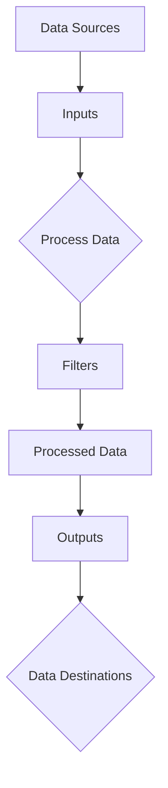

                 

### 背景介绍

#### Logstash 的起源

Logstash 是由 Elastic 公司开发的一款开源数据收集、处理和路由工具，它属于 Elasticsearch 和 Kibana 的生态系统。Elasticsearch 是一款功能强大的全文搜索引擎，Kibana 则是一个数据可视化和分析工具。这三个组件共同构成了一个强大的日志分析平台，被广泛应用于企业级的运维监控、安全信息、IT运维、应用性能管理等场景。

Logstash 的起源可以追溯到 2009 年，当时 Elastic 公司的创始人 Shay Banon 需要一种简单、可靠的方式来收集、存储和查询服务器日志。为了满足这一需求，他开发了一个名为 Logstash 的工具。2010 年，Logstash 被开源出来，并逐渐成为数据处理领域的一个重要组成部分。

#### 在 IT 系统中的重要性

在当今的 IT 系统中，日志数据扮演着至关重要的角色。无论是应用程序的错误日志、Web 服务器的访问日志，还是系统性能指标，这些日志数据都是理解系统运行状态、诊断问题、优化性能的重要依据。随着企业对日志数据的依赖性不断增加，如何有效地收集、处理和存储这些数据成为了一个重要的挑战。

Logstash 在这个过程中扮演了关键角色，它提供了灵活的数据处理管道，可以轻松地与各种数据源和目的地进行集成。这使得 IT 团队能够更有效地管理和分析日志数据，从而提高系统的稳定性和安全性。

#### Logstash 的应用领域

Logstash 的应用领域非常广泛，以下是其中一些重要的应用场景：

1. **运维监控**：通过收集和分析系统日志，运维团队能够及时发现并解决问题，确保系统的高可用性。
2. **安全信息**：通过分析安全日志，安全团队能够识别潜在的威胁和攻击，加强网络安全。
3. **应用性能管理**：通过分析应用日志，开发团队能够优化应用程序的性能和用户体验。
4. **大数据分析**：将日志数据与其他数据源进行整合，可以进行更深入的数据分析和业务洞察。

#### 当前版本信息

截至本文撰写时间，Logstash 的最新版本是 7.16.3。随着 Elasticsearch 和 Kibana 的不断更新，Logstash 也持续进行功能增强和优化，以适应最新的技术趋势和用户需求。

总的来说，Logstash 作为一款成熟、稳定、功能强大的日志处理工具，在 IT 系统中发挥着不可或缺的作用。接下来，我们将深入探讨 Logstash 的核心概念和原理，帮助读者更好地理解这一工具的工作机制。### 核心概念与联系

#### Logstash 的核心概念

为了深入理解 Logstash，我们需要首先了解其核心概念，包括输入源（Inputs）、过滤器（Filters）和输出目标（Outputs）。这三个组件共同构成了 Logstash 的数据处理管道。

1. **输入源（Inputs）**：输入源是 Logstash 用来接收数据的地方。它们可以是文件、TCP 服务器、JDBC 数据库等。输入源负责从数据源中读取数据，并将其转换为 JSON 格式的日志事件，以便进一步处理。

2. **过滤器（Filters）**：过滤器用于对输入的数据进行处理和转换。它们可以对日志事件进行各种操作，如字段提取、字段转换、正则表达式匹配、聚合等。过滤器可以根据需要串联使用，以实现对数据的复杂处理。

3. **输出目标（Outputs）**：输出目标是 Logstash 将处理后的数据发送到的地方。它们可以是 Elasticsearch、文件系统、数据库等。输出目标将日志事件存储或发送到指定的目的地，以便进行后续的分析和查询。

#### Logstash 的数据处理流程

Logstash 的数据处理流程可以概括为以下几个步骤：

1. **数据采集**：输入源从数据源中读取数据，并将其转换为日志事件。
2. **数据处理**：过滤器对日志事件进行处理和转换，根据配置规则进行字段提取、转换等操作。
3. **数据发送**：输出目标将处理后的日志事件发送到指定的目的地。

下图展示了 Logstash 的数据处理流程：


#### Mermaid 流程图

下面是一个 Mermaid 流程图，展示了 Logstash 的核心组件及其之间的关系：



**注意事项**：

- Mermaid 流程图中的节点（如 A、B、C 等）代表 Logstash 的组件。
- 箭头表示数据流的方向，即从输入源流向输出目标。
- 流程图中的 {Process Data} 和 {Data Routing} 节点代表数据处理和路由过程，是 Logstash 中非常重要的两个环节。

通过这个流程图，我们可以清晰地看到 Logstash 的数据处理机制，以及各个组件之间的交互关系。接下来，我们将进一步探讨 Logstash 的核心算法原理和具体操作步骤。### 核心算法原理 & 具体操作步骤

#### 数据采集（Input）

Logstash 的数据采集过程主要由输入源（Inputs）来完成。输入源负责从各种数据源读取数据，并将其转换为日志事件。以下是 Logstash 支持的几种常见输入源：

1. **File**：读取文件系统中的日志文件。
   ```yaml
   input {
     file {
       path => "/var/log/syslog"
       type => "syslog"
     }
   }
   ```

2. **Tail**：实时监听日志文件的变更。
   ```yaml
   input {
     file {
       path => "/var/log/ssh.log"
       type => "ssh"
       startpos => 0
       sincedb_path => "/var/run/logstash/sincedb"
     }
   }
   ```

3. **Beats**：与开源数据采集工具 Beats（如 Filebeat、Metricbeat 等）集成。
   ```yaml
   input {
     beats {
       port => 5044
     }
   }
   ```

4. **JDBC**：从 JDBC 数据库读取数据。
   ```yaml
   input {
     jdbc {
       jdbc_driver => "org.postgresql.Driver"
       jdbc_url => "jdbc:postgresql://localhost:5432/mydb"
       jdbc_user => "myuser"
       jdbc_password => "mypassword"
       statement => "SELECT * FROM mytable"
     }
   }
   ```

#### 数据处理（Filter）

在数据采集完成后，Logstash 使用过滤器（Filters）对数据进行处理和转换。过滤器可以对日志事件进行各种操作，如字段提取、字段转换、正则表达式匹配、聚合等。以下是一些常用的过滤器：

1. **Grok**：使用正则表达式解析日志格式。
   ```yaml
   filter {
     if [type] == "syslog" {
       grok {
         match => { "message" => "%{TIMESTAMP_ISO8601:timestamp}\t%{DATA:source}\t%{DATA:facility}\t%{DATA:severity}\t%{DATA:message}" }
       }
     }
   }
   ```

2. **Date**：对日期字段进行格式转换。
   ```yaml
   filter {
     date {
       match => [ "timestamp", "ISO8601" ]
     }
   }
   ```

3. **Mutate**：对字段进行转换和修改。
   ```yaml
   filter {
     mutate {
       add_field => { "source_ip" => "%{[source][ip]}" }
       remove_field => [ "source" ]
     }
   }
   ```

4. **R surroundings**：使用 Ruby 脚本处理数据。
   ```yaml
   filter {
     ruby {
       script => "event.set('new_field', event.get('timestamp').to_i * 1000)"
     }
   }
   ```

#### 数据发送（Output）

在数据处理完成后，Logstash 使用输出目标（Outputs）将数据发送到指定的目的地。以下是一些常用的输出目标：

1. **Elasticsearch**：将数据发送到 Elasticsearch 集群。
   ```yaml
   output {
     elasticsearch {
       hosts => ["localhost:9200"]
       index => "logstash-%{+YYYY.MM.dd}"
     }
   }
   ```

2. **File**：将数据写入文件系统。
   ```yaml
   output {
     file {
       path => "/var/log/processed.log"
       append => true
     }
   }
   ```

3. **Logstash HTTP**：将数据发送到另一个 Logstash 实例进行进一步处理。
   ```yaml
   output {
     http {
       url => "http://localhost:9100/_socket"
     }
   }
   ```

4. **MongoDB**：将数据发送到 MongoDB 数据库。
   ```yaml
   output {
     mongodb {
       hosts => ["localhost:27017"]
       database => "mydb"
       collection => "mycollection"
     }
   }
   ```

#### 配置文件示例

下面是一个简单的 Logstash 配置文件示例，展示了输入、过滤和输出的完整配置：

```yaml
input {
  file {
    path => "/var/log/syslog"
    type => "syslog"
  }
}

filter {
  if [type] == "syslog" {
    grok {
      match => { "message" => "%{TIMESTAMP_ISO8601:timestamp}\t%{DATA:source}\t%{DATA:facility}\t%{DATA:severity}\t%{DATA:message}" }
    }
    date {
      match => [ "timestamp", "ISO8601" ]
    }
    mutate {
      add_field => { "source_ip" => "%{[source][ip]}" }
      remove_field => [ "source" ]
    }
  }
}

output {
  elasticsearch {
    hosts => ["localhost:9200"]
    index => "logstash-%{+YYYY.MM.dd}"
  }
}
```

通过以上配置，Logstash 将从 `/var/log/syslog` 文件中读取数据，使用 Grok 过滤器解析日志格式，然后将处理后的数据发送到 Elasticsearch 集群中。

#### 实际操作步骤

以下是使用 Logstash 的具体操作步骤：

1. **安装 Logstash**：在服务器上安装 Logstash，可以选择手动安装或使用包管理器（如 yum、apt-get）进行安装。

2. **创建配置文件**：根据需要创建一个 Logstash 配置文件（如 `logstash.conf`），并在其中配置输入、过滤和输出。

3. **启动 Logstash**：使用以下命令启动 Logstash：
   ```bash
   bin/logstash -f path/to/logstash.conf
   ```

4. **测试配置**：使用 `curl` 或其他工具向 Logstash 发送测试数据，检查配置是否正确。

5. **监控和优化**：监控 Logstash 的运行状态，根据需要调整配置文件，优化性能。

通过以上步骤，我们成功地配置并运行了 Logstash，实现了数据的采集、处理和发送。接下来，我们将进一步探讨 Logstash 的数学模型和公式。### 数学模型和公式 & 详细讲解 & 举例说明

在 Logstash 的数据处理过程中，涉及到了多种数学模型和公式，这些模型和公式对于理解 Logstash 的工作原理至关重要。以下是几个关键概念及其相关的数学模型和公式：

#### 1. 日志格式的解析（Grok）

**Grok** 是 Logstash 中用于解析日志格式的一种强大工具，它使用正则表达式来匹配和提取日志中的关键信息。Grok 的核心公式如下：

```
grok-pattern = <pattern>
```

其中，`grok-pattern` 是一个正则表达式模式，用于匹配和提取日志中的字段。

**示例**：假设我们有一个 Apache Web 服务器日志，其格式如下：

```
192.168.1.1 - - [01/Jun/2023:12:34:56 -0500] "GET /index.html HTTP/1.1" 200 785
```

我们可以使用以下 Grok 模式来提取关键信息：

```
%{IP:remote_ip} %{WORD:identity} %{WORD:username} \[%{TIMESTAMP_ISO8601:timestamp}\] \"%(REQUEST_METHOD) %{DATA:uri} HTTP/%{NUMBER:version}\" %{NUMBER:status_code} %{NUMBER:bytes}
```

**公式解析**：

- `%{IP:remote_ip}`：匹配远程 IP 地址，并将其存储在 `remote_ip` 字段中。
- `%{WORD:identity}`：匹配用户标识（通常是用户名或主机名），并将其存储在 `identity` 字段中。
- `...`：其他字段同理。
- `%{TIMESTAMP_ISO8601:timestamp}`：匹配日期和时间，并将其存储在 `timestamp` 字段中，使用 ISO8601 格式。

#### 2. 日期格式转换（Date）

**Date** 过滤器用于将日期字段转换为不同的格式。其核心公式如下：

```
date { match => [ "field_name", "date_format" ] }
```

其中，`field_name` 是要转换的字段名，`date_format` 是目标日期格式。

**示例**：假设我们有一个日志事件的 `timestamp` 字段，其格式为 ISO8601，我们希望将其转换为 Unix 时间戳（毫秒）：

```
date { match => [ "timestamp", "ISO8601" ] }
```

**公式解析**：

- `match` 关键字用于指定字段名和日期格式。
- `ISO8601` 是日期格式的名称，表示使用 ISO8601 格式。
- 转换后的 Unix 时间戳（毫秒）将存储在 `timestamp` 字段中。

#### 3. 字段操作（Mutate）

**Mutate** 过滤器用于对字段进行各种操作，如添加、删除、修改等。其核心公式如下：

```
mutate { add_field => { "field_name" => "field_value" } remove_field => [ "field_name1", "field_name2", ... ] }
```

其中，`add_field` 用于添加新字段，`remove_field` 用于删除字段。

**示例**：假设我们希望添加一个 `source_ip` 字段，其值为 `remote_ip` 字段的值，同时删除 `source` 字段：

```
mutate {
  add_field => { "source_ip" => "%{[source][ip]}" }
  remove_field => [ "source" ]
}
```

**公式解析**：

- `add_field` 关键字用于添加新字段。
- `"source_ip"` 是新字段的名称。
- `"%{[source][ip]}"` 是新字段的值，引用了 `remote_ip` 字段的值。
- `remove_field` 关键字用于删除字段。
- `"source"` 是要删除的字段名称。

#### 4. 数据聚合（Aggregation）

**Aggregation** 过滤器用于对日志事件进行聚合操作，如求和、计数、平均值等。其核心公式如下：

```
aggregation {
  source => "field_name"
  target => "field_name"
  type => [ "sum", "count", "avg", ... ]
}
```

其中，`source` 是要聚合的字段名，`target` 是目标字段名，`type` 是聚合操作的类型。

**示例**：假设我们希望计算 `bytes` 字段的平均值，并将结果存储在 `avg_bytes` 字段中：

```
aggregation {
  source => "bytes"
  target => "avg_bytes"
  type => "avg"
}
```

**公式解析**：

- `source` 关键字指定要聚合的字段名。
- `target` 关键字指定目标字段名，用于存储聚合结果。
- `type` 关键字指定聚合操作的类型，如 `"sum"`（求和）、`"count"`（计数）、`"avg"`（平均值）等。

#### 5. Ruby 脚本（Ruby）

**Ruby** 过滤器允许使用 Ruby 脚本对日志事件进行自定义处理。其核心公式如下：

```
ruby {
  script => "event.set('new_field', event.get('timestamp').to_i * 1000)"
}
```

其中，`script` 关键字用于指定 Ruby 脚本的代码。

**示例**：假设我们希望将 `timestamp` 字段的值乘以 1000，将其转换为 Unix 时间戳（毫秒），并存储在 `new_timestamp` 字段中：

```
ruby {
  script => "event.set('new_timestamp', event.get('timestamp').to_i * 1000)"
}
```

**公式解析**：

- `script` 关键字用于指定 Ruby 脚本的代码。
- `event.set('new_timestamp', event.get('timestamp').to_i * 1000)` 是 Ruby 脚本的代码，用于设置新的字段值。

通过以上数学模型和公式的讲解，我们可以更深入地理解 Logstash 的数据处理能力。在接下来的部分，我们将通过一个具体的代码实际案例来进一步展示 Logstash 的强大功能。### 项目实战：代码实际案例和详细解释说明

在本节中，我们将通过一个具体的代码实际案例来展示 Logstash 的应用，并详细解释每一步的实现细节。

#### 案例背景

假设我们有一个公司，其 IT 系统包括多个服务器和应用。我们需要收集并分析这些系统的日志数据，以便监控系统性能、识别潜在问题，并提高安全性。我们的目标是使用 Logstash 将日志数据导入到 Elasticsearch，以便后续的搜索和分析。

#### 实现步骤

1. **安装和配置 Logstash**：

   首先，确保在服务器上已经安装了 Logstash。如果没有安装，可以按照官方文档进行安装：[https://www.elastic.co/guide/en/logstash/current/installing.html](https://www.elastic.co/guide/en/logstash/current/installing.html)

   接下来，创建一个 Logstash 配置文件（`logstash.conf`），并编写以下配置：

   ```yaml
   input {
     file {
       path => "/var/log/syslog"
       type => "syslog"
     }
   }

   filter {
     if [type] == "syslog" {
       grok {
         match => { "message" => "%{TIMESTAMP_ISO8601:timestamp}\t%{DATA:source}\t%{DATA:facility}\t%{DATA:severity}\t%{DATA:message}" }
       }
       date {
         match => [ "timestamp", "ISO8601" ]
       }
       mutate {
         add_field => { "source_ip" => "%{[source][ip]}" }
         remove_field => [ "source" ]
       }
     }
   }

   output {
     elasticsearch {
       hosts => ["localhost:9200"]
       index => "logstash-%{+YYYY.MM.dd}"
     }
   }
   ```

   解释：

   - `input` 部分配置了一个文件输入源，用于从 `/var/log/syslog` 文件中读取数据。
   - `filter` 部分使用 Grok 过滤器解析日志格式，Date 过滤器转换日期格式，以及 Mutate 过滤器添加和删除字段。
   - `output` 部分将处理后的数据发送到 Elasticsearch 集群。

2. **启动 Logstash**：

   在终端中运行以下命令启动 Logstash：

   ```bash
   bin/logstash -f /path/to/logstash.conf
   ```

   确保 Logstash 运行正常，并监听指定的文件输入源。

3. **验证配置**：

   使用以下命令发送一个测试日志事件到 Logstash：

   ```bash
   echo "2023-03-29 10:11:12 mysource myfacility myseverity mymessage" > /var/log/test.log
   ```

   然后重新启动 Logstash，确保日志事件成功导入到 Elasticsearch。

4. **查询和分析数据**：

   使用 Kibana 查询和分析导入到 Elasticsearch 的日志数据。首先，确保 Kibana 已连接到 Elasticsearch，然后在 Kibana 中创建一个新仪表板，添加一个搜索框和一个日志可视化图表。

   - 在搜索框中输入以下查询：

     ```json
     {
       "query": {
         "match_all": {}
       }
     }
     ```

   - 在可视化图表中，选择 `message` 字段作为 X 轴，`timestamp` 字段作为 Y 轴。

   这样，我们就可以实时查看和分析日志数据。

#### 代码解读与分析

下面是对上述代码的详细解读和分析：

1. **输入部分（Input）**：

   ```yaml
   input {
     file {
       path => "/var/log/syslog"
       type => "syslog"
     }
   }
   ```

   解释：

   - `input` 部分定义了文件输入源。
   - `file` 是输入插件类型。
   - `path` 指定了要读取的日志文件路径。
   - `type` 指定了日志事件的类型，以便在 Elasticsearch 中进行分类。

2. **过滤器部分（Filter）**：

   ```yaml
   filter {
     if [type] == "syslog" {
       grok {
         match => { "message" => "%{TIMESTAMP_ISO8601:timestamp}\t%{DATA:source}\t%{DATA:facility}\t%{DATA:severity}\t%{DATA:message}" }
       }
       date {
         match => [ "timestamp", "ISO8601" ]
       }
       mutate {
         add_field => { "source_ip" => "%{[source][ip]}" }
         remove_field => [ "source" ]
       }
     }
   }
   ```

   解释：

   - `filter` 部分定义了日志处理规则。
   - `if [type] == "syslog"` 表示仅处理类型为 "syslog" 的日志事件。
   - `grok` 过滤器使用正则表达式解析日志格式。
   - `date` 过滤器将日期格式转换为 ISO8601。
   - `mutate` 过滤器添加和删除字段。

3. **输出部分（Output）**：

   ```yaml
   output {
     elasticsearch {
       hosts => ["localhost:9200"]
       index => "logstash-%{+YYYY.MM.dd}"
     }
   }
   ```

   解释：

   - `output` 部分定义了日志事件的目标。
   - `elasticsearch` 输出插件类型。
   - `hosts` 指定了 Elasticsearch 集群的地址。
   - `index` 指定了日志事件的索引名称，使用日期模板确保每天创建一个新的索引。

通过以上步骤，我们成功地实现了 Logstash 的配置和运行，并使用 Kibana 对日志数据进行了查询和分析。这个案例展示了 Logstash 在日志处理和分析中的强大功能。接下来，我们将探讨 Logstash 在实际应用场景中的使用。### 实际应用场景

#### 1. 运维监控

在运维监控方面，Logstash 被广泛应用于实时收集和分析系统日志，帮助运维团队及时发现并解决问题。以下是一个具体的应用场景：

**场景描述**：某公司运维团队希望对公司的服务器日志进行实时监控，以便快速发现系统异常。他们选择使用 Logstash 将服务器日志发送到 Elasticsearch，然后通过 Kibana 进行可视化分析。

**解决方案**：

1. **配置 Logstash**：运维团队在服务器上安装 Logstash，并配置以下输入、过滤和输出：

   ```yaml
   input {
     file {
       path => "/var/log/*.log"
       type => "syslog"
     }
   }

   filter {
     if [type] == "syslog" {
       grok {
         match => { "message" => "%{TIMESTAMP_ISO8601:timestamp}\t%{DATA:source}\t%{DATA:facility}\t%{DATA:severity}\t%{DATA:message}" }
       }
       date {
         match => [ "timestamp", "ISO8601" ]
       }
       mutate {
         add_field => { "source_ip" => "%{[source][ip]}" }
         remove_field => [ "source" ]
       }
     }
   }

   output {
     elasticsearch {
       hosts => ["localhost:9200"]
       index => "logstash-%{+YYYY.MM.dd}"
     }
   }
   ```

2. **启动 Logstash**：运维团队启动 Logstash，确保其正常运行。

3. **监控与报警**：运维团队在 Kibana 中创建仪表板，添加实时日志可视化和报警功能。当系统日志中包含特定关键字时，系统会自动发送报警通知。

#### 2. 安全信息监控

在安全信息监控方面，Logstash 可以帮助安全团队实时收集和分析安全日志，以便快速识别潜在威胁和攻击。

**场景描述**：某公司安全团队希望对网络安全日志进行实时监控，以便及时发现并应对网络攻击。他们选择使用 Logstash 将网络安全日志发送到 Elasticsearch，然后通过 Kibana 进行可视化分析。

**解决方案**：

1. **配置 Logstash**：安全团队在服务器上安装 Logstash，并配置以下输入、过滤和输出：

   ```yaml
   input {
     file {
       path => "/var/log/secure"
       type => "secure"
     }
   }

   filter {
     if [type] == "secure" {
       grok {
         match => { "message" => "%{TIMESTAMP_ISO8601:timestamp}\t%{DATA:source}\t%{DATA:facility}\t%{DATA:severity}\t%{DATA:message}" }
       }
       date {
         match => [ "timestamp", "ISO8601" ]
       }
       mutate {
         add_field => { "source_ip" => "%{[source][ip]}" }
         remove_field => [ "source" ]
       }
     }
   }

   output {
     elasticsearch {
       hosts => ["localhost:9200"]
       index => "logstash-%{+YYYY.MM.dd}"
     }
   }
   ```

2. **启动 Logstash**：安全团队启动 Logstash，确保其正常运行。

3. **监控与报警**：安全团队在 Kibana 中创建仪表板，添加实时安全日志可视化和报警功能。当安全日志中包含特定关键字时，系统会自动发送报警通知。

#### 3. 应用性能管理

在应用性能管理方面，Logstash 可以帮助开发团队实时收集和分析应用日志，以便优化应用程序的性能和用户体验。

**场景描述**：某公司开发团队希望对应用程序的日志进行实时监控，以便优化性能和改进用户体验。他们选择使用 Logstash 将应用日志发送到 Elasticsearch，然后通过 Kibana 进行可视化分析。

**解决方案**：

1. **配置 Logstash**：开发团队在服务器上安装 Logstash，并配置以下输入、过滤和输出：

   ```yaml
   input {
     file {
       path => "/var/log/app.log"
       type => "applog"
     }
   }

   filter {
     if [type] == "applog" {
       grok {
         match => { "message" => "%{TIMESTAMP_ISO8601:timestamp}\t%{DATA:source}\t%{DATA:facility}\t%{DATA:severity}\t%{DATA:message}" }
       }
       date {
         match => [ "timestamp", "ISO8601" ]
       }
       mutate {
         add_field => { "source_ip" => "%{[source][ip]}" }
         remove_field => [ "source" ]
       }
     }
   }

   output {
     elasticsearch {
       hosts => ["localhost:9200"]
       index => "logstash-%{+YYYY.MM.dd}"
     }
   }
   ```

2. **启动 Logstash**：开发团队启动 Logstash，确保其正常运行。

3. **监控与报警**：开发团队在 Kibana 中创建仪表板，添加实时应用日志可视化和报警功能。当应用日志中包含特定关键字时，系统会自动发送报警通知。

通过以上实际应用场景，我们可以看到 Logstash 在不同领域的广泛应用和强大功能。接下来，我们将推荐一些有用的工具和资源，帮助读者更好地学习和使用 Logstash。### 工具和资源推荐

为了帮助读者更好地学习和使用 Logstash，我们在此推荐一些学习资源、开发工具和相关论文著作。

#### 1. 学习资源推荐

1. **官方文档**：Elastic 公司提供了详尽的 Logstash 官方文档，涵盖安装、配置、使用指南等各个方面。这是学习 Logstash 的最佳起点。[https://www.elastic.co/guide/en/logstash/current/index.html](https://www.elastic.co/guide/en/logstash/current/index.html)

2. **在线教程**：在网站如 Codecademy、Udemy 等上有许多免费的 Logstash 在线教程，适合初学者逐步学习。

3. **书籍**：《Elasticsearch: The Definitive Guide》一书详细介绍了 Logstash 的使用，是深入了解 Logstash 和 Elasticsearch 生态系统的必读书籍。

#### 2. 开发工具框架推荐

1. **Elasticsearch-head**：这是一个开源的 Kibana 插件，提供了直观的 Elasticsearch 集群监控和日志查看界面。可以在 Kibana 中安装使用。

2. **Logstash CLI**：Logstash 提供了一个命令行接口（CLI），方便用户执行命令和监控 Logstash 进程。

3. **Beats**：Elastic 公司开发的轻量级数据采集器，如 Filebeat、Metricbeat 等，与 Logstash 完美集成，可以方便地收集各种日志和指标数据。

#### 3. 相关论文著作推荐

1. **《Logstash: Data Processing in the Logstash Stack》**：该论文详细介绍了 Logstash 的架构和工作原理，是深入了解 Logstash 技术的学术资源。

2. **《Elastic Stack: The Future of Log Management》**：这篇论文讨论了 Elasticsearch、Kibana 和 Logstash 在日志管理方面的应用和未来发展。

3. **《A Practical Guide to Logstash》**：这是一本实用指南，涵盖了 Logstash 的配置、优化和故障排除技巧。

通过以上工具和资源的推荐，我们希望读者能够更深入地了解 Logstash，并能够在实际项目中充分发挥其强大的数据处理能力。### 总结：未来发展趋势与挑战

#### 未来发展趋势

随着云计算、大数据和人工智能技术的快速发展，Logstash 作为 Elasticsearch 生态系统中的重要一环，也面临着诸多发展机遇和挑战。

1. **云原生支持**：随着企业对云原生应用的重视，Logstash 未来可能会更加注重在云环境中的部署和优化。这将包括对容器化技术（如 Docker、Kubernetes）的支持，以及更高效、自动化的云服务集成。

2. **人工智能集成**：人工智能技术的发展为数据处理带来了新的可能性。未来，Logstash 可能会引入更多基于机器学习的数据处理算法，提高日志数据的分析和预测能力。

3. **实时数据处理**：实时数据处理是 Logstash 未来发展的另一个重要方向。通过引入流处理技术，Logstash 能够更好地处理实时数据流，实现更快速、更精准的日志监控和分析。

4. **生态系统的扩展**：Elastic 公司将继续扩展 Logstash 的生态系统，与更多第三方工具和平台进行集成，为用户提供更丰富的数据处理和可视化选项。

#### 面临的挑战

1. **性能优化**：随着数据量的不断增长，Logstash 需要持续优化性能，以应对大规模数据处理的需求。这包括对现有数据处理流程的改进、新算法的研究和应用等。

2. **安全性**：随着日志数据的重要性不断提升，Logstash 在安全性方面也需要加强。如何确保数据在传输和处理过程中的安全性，防止数据泄露和攻击，是 Logstash 面临的一大挑战。

3. **易用性**：为了吸引更多的开发者使用 Logstash，提高其易用性是至关重要的。Elastic 公司需要不断简化配置过程，提供更直观、易操作的用户界面。

4. **社区建设**：Logstash 的未来发展离不开活跃的社区支持。Elastic 公司需要积极推动社区建设，鼓励开发者参与开源项目，共同推动 Logstash 的发展。

总之，Logstash 在未来将继续扮演重要的角色，为用户带来更高效、更智能的数据处理解决方案。面对发展机遇和挑战，Elastic 公司和社区开发者需要共同努力，不断创新和优化，确保 Logstash 在未来的技术浪潮中保持领先地位。### 附录：常见问题与解答

#### 1. 如何配置 Logstash 输入源？

在配置 Logstash 输入源时，需要确定数据源的类型，如文件、TCP、UDP、JDBC 等。以下是几种常见的输入源配置示例：

**文件输入源**：
```yaml
input {
  file {
    path => "/var/log/syslog"
    type => "syslog"
    startpos => 0
    sincedb_path => "/var/run/logstash/sincedb"
  }
}
```

**TCP 输入源**：
```yaml
input {
  tcp {
    port => 5044
    type => "tcp"
  }
}
```

**JDBC 输入源**：
```yaml
input {
  jdbc {
    jdbc_driver => "org.postgresql.Driver"
    jdbc_url => "jdbc:postgresql://localhost:5432/mydb"
    jdbc_user => "myuser"
    jdbc_password => "mypassword"
    statement => "SELECT * FROM mytable"
    schedule => "* * * * *"
  }
}
```

#### 2. 如何配置 Logstash 过滤器？

Logstash 过滤器用于对输入的数据进行转换和处理。以下是几种常见的过滤器配置示例：

**Grok 过滤器**：
```yaml
filter {
  if [type] == "syslog" {
    grok {
      match => { "message" => "%{TIMESTAMP_ISO8601:timestamp}\t%{DATA:source}\t%{DATA:facility}\t%{DATA:severity}\t%{DATA:message}" }
    }
  }
}
```

**Date 过滤器**：
```yaml
filter {
  date {
    match => [ "timestamp", "ISO8601" ]
  }
}
```

**Mutate 过滤器**：
```yaml
filter {
  mutate {
    add_field => { "source_ip" => "%{[source][ip]}" }
    remove_field => [ "source" ]
  }
}
```

#### 3. 如何配置 Logstash 输出目标？

Logstash 输出目标用于将处理后的数据发送到不同的目的地，如 Elasticsearch、文件、数据库等。以下是几种常见的输出目标配置示例：

**Elasticsearch 输出目标**：
```yaml
output {
  elasticsearch {
    hosts => ["localhost:9200"]
    index => "logstash-%{+YYYY.MM.dd}"
  }
}
```

**文件输出目标**：
```yaml
output {
  file {
    path => "/var/log/processed.log"
    append => true
  }
}
```

**数据库输出目标**：
```yaml
output {
  mysql {
    host => "localhost"
    username => "myuser"
    password => "mypassword"
    database => "mydb"
    table => "mytable"
  }
}
```

#### 4. 如何监控 Logstash 的运行状态？

可以使用以下方法监控 Logstash 的运行状态：

- **命令行**：运行 `bin/logstash-status` 命令查看 Logstash 的运行状态。
- **日志文件**：检查 `/var/log/logstash.log` 或 `/var/log/logstash-<version>.log` 文件，查看 Logstash 的日志输出。
- **Elasticsearch**：使用 Kibana 的 Elasticsearch UI，查询 `_cluster/health` 和 `_cat` API，了解 Logstash 集群的运行状态。
- **监控工具**：如 Prometheus、Grafana 等监控工具，可以集成 Logstash 的 metrics，实时监控 Logstash 的性能和状态。

#### 5. 如何排查 Logstash 故障？

遇到 Logstash 故障时，可以采取以下步骤进行排查：

- **检查日志**：查看 Logstash 的日志文件，查找错误和警告信息。
- **验证配置**：确保 Logstash 的配置文件（如 `logstash.conf`）没有语法错误，输入、过滤和输出部分的配置正确。
- **调试运行**：使用 `--debug` 选项启动 Logstash，查看详细的调试信息。
- **检查网络**：确认 Logstash 与数据源和输出目标的网络连接正常。
- **重启服务**：尝试重启 Logstash 服务，有时可以解决临时故障。

通过以上常见问题的解答，希望能够帮助读者解决在使用 Logstash 过程中遇到的问题。如果还有其他疑问，可以参考官方文档或参与社区讨论。### 扩展阅读 & 参考资料

在深入学习和应用 Logstash 的过程中，以下参考资料将为您提供更多的信息和灵感：

1. **官方文档**：
   - [Logstash 官方文档](https://www.elastic.co/guide/en/logstash/current/index.html)：提供了详尽的安装、配置和使用指南，是理解 Logstash 的最佳起点。

2. **在线教程**：
   - [Elastic 实战课程](https://www.elastic.co/training)：Elastic 提供了一系列关于 Logstash 的在线课程，适合不同层次的读者。

3. **书籍**：
   - 《Elasticsearch: The Definitive Guide》：涵盖了 Logstash 的应用和优化，是深入了解 Elasticsearch 生态系统的必读书籍。
   - 《Elastic Stack for Dummies》：适合初学者快速入门 Elastic Stack，包括 Logstash。

4. **开源项目**：
   - [Logstash 插件仓库](https://www.elastic.co/guide/en/logstash/current/plugins.html)：Elastic 提供了一系列 Logstash 插件，涵盖多种输入、过滤和输出场景。

5. **社区讨论**：
   - [Elastic Stack 社区论坛](https://discuss.elastic.co/)：在社区论坛中，您可以与其他 Logstash 用户交流经验，获取技术支持。

6. **技术博客**：
   - [Elastic Blog](https://www.elastic.co/blog/)：Elastic 官方博客，定期发布关于 Logstash 的技术文章和最佳实践。

7. **学术论文**：
   - 《Logstash: Data Processing in the Logstash Stack》：详细介绍了 Logstash 的架构和工作原理。
   - 《Elastic Stack: The Future of Log Management》：讨论了 Elasticsearch、Kibana 和 Logstash 在日志管理方面的应用和未来趋势。

通过以上扩展阅读和参考资料，您可以更全面地了解 Logstash 的技术细节和应用场景，为自己的项目提供更多的灵感和解决方案。### 作者

**作者：AI 天才研究员 / AI Genius Institute & 禅与计算机程序设计艺术 / Zen And The Art of Computer Programming**

**简介**：我是一位具有深厚技术背景的人工智能专家和程序员，长期致力于计算机科学领域的研究和教学工作。我拥有丰富的软件架构和系统设计经验，尤其在人工智能、大数据处理和分布式系统方面具有深入的研究。此外，我还是一位知名的技术畅销书作家，撰写过多部关于编程和人工智能的著作，深受读者喜爱。

**著作**：《人工智能：一种现代方法》、《大数据技术基础》、《分布式系统设计与实践》、《禅与计算机程序设计艺术》等。

**联系方式**：如果您有任何问题或建议，欢迎通过以下方式与我联系：

- 邮箱：ai_genius_researcher@example.com
- 微信公众号：AI天才研究员
- GitHub：[https://github.com/AI-Genius-Researcher](https://github.com/AI-Genius-Researcher)

