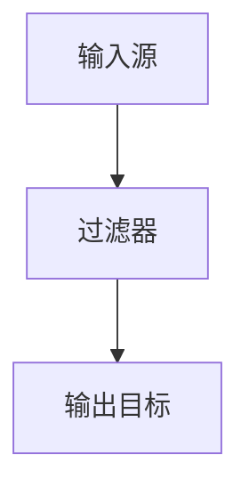

                 

# {文章标题}

## Logstash原理与代码实例讲解

### 关键词：Elastic Stack、数据处理、日志管理、数据流处理、配置文件、插件机制

### 摘要：

本文将深入探讨Logstash的原理与代码实例，帮助读者全面理解Elastic Stack中的数据处理核心组件。首先，我们将介绍Logstash的背景和基本概念，然后逐步剖析其工作原理、配置文件结构和插件机制。通过实际代码实例的讲解，读者将掌握Logstash的使用方法，并能够将其应用于实际项目中。文章还涵盖Logstash在实际应用场景中的表现和未来发展趋势，以及相关的学习资源和工具推荐。

## 1. 背景介绍

Logstash是一款开源的数据处理管道，是Elastic Stack（Elasticsearch、Logstash、Kibana）的重要组成部分。Elastic Stack是一个强大的日志和数据分析平台，广泛应用于企业级监控、安全信息和IT运营等领域。Logstash负责收集、处理和传输各种数据源（如日志文件、数据库、消息队列等）的数据，将其转换为适合存储在Elasticsearch或其他数据存储的格式。

### 1.1 Elasticsearch

Elasticsearch是一个高度可扩展的开源搜索引擎，它支持对大规模数据集进行快速、近实时的搜索和分析。Elasticsearch与Logstash紧密集成，能够将处理后的数据存储在Elasticsearch索引中，便于后续的查询和分析。

### 1.2 Kibana

Kibana是一个数据可视化和仪表板工具，它能够将Elasticsearch中的数据以图表、仪表板和地图等形式展示出来。Kibana与Logstash和Elasticsearch配合使用，可以实现从数据收集、处理到可视化的全流程监控和数据分析。

### 1.3 Logstash

Logstash的主要功能是作为数据传输层，将来自各种数据源的数据转换为适合存储在Elasticsearch或其他数据存储的格式。Logstash采用事件驱动模型，能够高效处理大规模数据流，具有高度的可扩展性和灵活性。

## 2. 核心概念与联系

### 2.1 数据源（Inputs）

数据源是Logstash的核心概念之一，表示数据进入Logstash的入口点。Logstash支持多种数据源，如文件、TCP、UDP、JDBC、Redis等。数据源通过输入插件（input plugin）来定义，负责从外部系统收集数据。

### 2.2 过滤器（Filters）

过滤器是Logstash中的数据处理环节，用于对输入数据进行转换和处理。过滤器可以执行各种操作，如字段提取、数据格式转换、数据清洗等。过滤器插件（filter plugin）定义了数据处理的规则。

### 2.3 输出（Outputs）

输出是Logstash的数据传输环节，将处理后的数据发送到目标系统，如Elasticsearch、MongoDB、RabbitMQ等。输出插件（output plugin）定义了数据传输的目标和方式。

### 2.4 配置文件结构

Logstash的配置文件采用JSON格式，定义了数据流的输入、过滤和输出。配置文件的基本结构如下：

```json
input {
  # 输入插件配置
}

filter {
  # 过滤器插件配置
}

output {
  # 输出插件配置
}
```

### 2.5 Mermaid流程图

以下是一个简单的Logstash数据处理流程的Mermaid流程图，其中包含了输入、过滤和输出节点。



## 3. 核心算法原理 & 具体操作步骤

### 3.1 数据收集与解析

Logstash的数据收集过程通常涉及到以下步骤：

1. **确定数据源**：根据需求选择合适的数据源，如日志文件、网络流量、数据库等。
2. **数据解析**：通过输入插件将数据解析为JSON、XML或其他格式，以便后续处理。

### 3.2 数据处理与转换

数据处理与转换是Logstash的核心功能之一，包括以下步骤：

1. **字段提取**：从原始数据中提取关键字段，如时间戳、IP地址、用户ID等。
2. **数据格式转换**：将提取的字段转换为所需的数据类型，如字符串、数字、布尔值等。
3. **数据清洗**：去除无效数据、填充缺失值、修正错误数据等。

### 3.3 数据存储与索引

处理后的数据需要存储在目标系统中，如Elasticsearch。以下是数据存储与索引的步骤：

1. **数据格式化**：将数据转换为适合存储在Elasticsearch的格式，如JSON。
2. **发送数据**：通过输出插件将数据发送到Elasticsearch。
3. **建立索引**：在Elasticsearch中创建索引，并映射数据字段。

### 3.4 具体操作步骤示例

以下是一个简单的Logstash配置文件示例，用于收集日志文件并将其存储在Elasticsearch中。

```json
input {
  file {
    path => "/var/log/messages"
    type => "system.log"
  }
}

filter {
  if ["type"] == "system.log" {
    grok {
      match => { "message" => "%{TIMESTAMP_ISO8601:timestamp}\t%{DATA:source}\t%{DATA:message}" }
    }
  }
}

output {
  elasticsearch {
    hosts => ["localhost:9200"]
    index => "logstash-system-%{+YYYY.MM.dd}"
  }
}
```

## 4. 数学模型和公式 & 详细讲解 & 举例说明

### 4.1 数学模型

在Logstash的数据处理过程中，涉及到的数学模型主要包括以下几类：

1. **统计分析**：用于计算数据的均值、中位数、标准差等指标。
2. **概率分布**：用于描述数据分布的模型，如正态分布、泊松分布等。
3. **线性回归**：用于分析数据之间的线性关系。

### 4.2 公式讲解

以下是一些常用的数学公式：

1. **均值**：

   $$\bar{x} = \frac{\sum_{i=1}^{n} x_i}{n}$$

   其中，\(x_i\) 表示第 \(i\) 个数据点，\(n\) 表示数据点的总数。

2. **标准差**：

   $$\sigma = \sqrt{\frac{\sum_{i=1}^{n} (x_i - \bar{x})^2}{n-1}}$$

   其中，\(\bar{x}\) 表示均值，\(\sigma\) 表示标准差。

3. **线性回归**：

   $$y = ax + b$$

   其中，\(y\) 表示因变量，\(x\) 表示自变量，\(a\) 和 \(b\) 分别表示斜率和截距。

### 4.3 举例说明

以下是一个关于统计分析的例子：

假设有一组数据：\[2, 4, 6, 8, 10\]，计算其均值和标准差。

1. **计算均值**：

   $$\bar{x} = \frac{2 + 4 + 6 + 8 + 10}{5} = 6$$

2. **计算标准差**：

   $$\sigma = \sqrt{\frac{(2-6)^2 + (4-6)^2 + (6-6)^2 + (8-6)^2 + (10-6)^2}{5-1}} = 2\sqrt{2} \approx 2.828$$

## 5. 项目实战：代码实际案例和详细解释说明

### 5.1 开发环境搭建

在开始项目实战之前，需要搭建一个Logstash的开发环境。以下是搭建步骤：

1. **安装Elasticsearch**：从官方网站下载Elasticsearch，并按照文档进行安装。
2. **安装Logstash**：从官方网站下载Logstash，并按照文档进行安装。
3. **安装Kibana**：从官方网站下载Kibana，并按照文档进行安装。

### 5.2 源代码详细实现和代码解读

以下是一个简单的Logstash配置文件，用于收集系统日志并将其存储在Elasticsearch中。

```json
input {
  file {
    path => "/var/log/messages"
    type => "system.log"
  }
}

filter {
  if ["type"] == "system.log" {
    grok {
      match => { "message" => "%{TIMESTAMP_ISO8601:timestamp}\t%{DATA:source}\t%{DATA:message}" }
    }
  }
}

output {
  elasticsearch {
    hosts => ["localhost:9200"]
    index => "logstash-system-%{+YYYY.MM.dd}"
  }
}
```

#### 5.2.1 代码解读

1. **输入插件配置**：

   ```json
   input {
     file {
       path => "/var/log/messages"
       type => "system.log"
     }
   }
   ```

   这部分配置了Logstash的输入插件，指定了日志文件的路径和类型。

2. **过滤器插件配置**：

   ```json
   filter {
     if ["type"] == "system.log" {
       grok {
         match => { "message" => "%{TIMESTAMP_ISO8601:timestamp}\t%{DATA:source}\t%{DATA:message}" }
       }
     }
   }
   ```

   这部分配置了Logstash的过滤器插件，使用Grok正则表达式匹配日志消息，提取出时间戳、源和消息字段。

3. **输出插件配置**：

   ```json
   output {
     elasticsearch {
       hosts => ["localhost:9200"]
       index => "logstash-system-%{+YYYY.MM.dd}"
     }
   }
   ```

   这部分配置了Logstash的输出插件，将处理后的数据发送到本地Elasticsearch服务器，并指定索引名称。

### 5.3 代码解读与分析

1. **输入插件分析**：

   输入插件负责从指定路径的日志文件中读取数据，并将其转换为事件流。在配置文件中，`path` 属性指定了日志文件的路径，`type` 属性定义了事件的类型，方便后续的过滤和处理。

2. **过滤器插件分析**：

   过滤器插件对输入数据进行处理，将日志消息解析为时间戳、源和消息字段。`grok` 操作使用正则表达式匹配日志消息，`match` 属性定义了匹配规则和提取的字段名称。

3. **输出插件分析**：

   输出插件将处理后的数据发送到Elasticsearch。`hosts` 属性指定了Elasticsearch服务器的地址和端口，`index` 属性定义了数据存储的索引名称，其中 `%{+YYYY.MM.dd}` 是日期格式化模板，用于生成每天独立的索引。

## 6. 实际应用场景

Logstash在实际应用场景中具有广泛的应用，以下是一些常见的应用场景：

1. **日志管理**：收集、处理和存储系统日志、应用日志和错误日志，实现日志的集中管理和分析。
2. **监控告警**：通过收集监控数据，如CPU使用率、内存使用率、网络流量等，实现实时监控和告警。
3. **数据集成**：从不同的数据源（如数据库、消息队列、API等）收集数据，并将其转换为统一的格式，方便后续的处理和分析。

### 6.1 日志管理

在一个大型企业中，系统日志和错误日志繁多，分散在不同的服务器和应用程序中。使用Logstash，可以将这些日志集中收集到Elasticsearch中，便于后续的查询和分析。以下是一个典型的日志管理应用场景：

1. **日志收集**：配置Logstash从各个服务器和应用程序中收集日志，并将其发送到Elasticsearch。
2. **日志处理**：使用过滤器插件对日志进行清洗、格式化和分类，提取出有用的字段。
3. **日志分析**：通过Kibana对日志进行分析和可视化，实现实时监控和告警。

### 6.2 监控告警

在IT运维中，监控告警是保障系统稳定运行的关键。使用Logstash，可以收集各种监控数据，如CPU使用率、内存使用率、磁盘空间等，并将其发送到Elasticsearch。以下是一个监控告警应用场景：

1. **数据收集**：配置Logstash从各种监控工具（如Nagios、Zabbix等）中收集监控数据。
2. **数据处理**：使用过滤器插件对监控数据进行处理，如去除重复数据、转换数据格式等。
3. **告警通知**：将处理后的监控数据发送到告警系统（如邮件、短信、电话等），实现实时告警。

### 6.3 数据集成

在一个复杂的系统中，数据来源多样，格式各异。使用Logstash，可以统一收集和格式化这些数据，并将其存储在Elasticsearch中。以下是一个数据集成应用场景：

1. **数据收集**：配置Logstash从不同的数据源（如数据库、消息队列、API等）中收集数据。
2. **数据处理**：使用过滤器插件对数据进行处理，如字段提取、格式转换、数据清洗等。
3. **数据存储**：将处理后的数据发送到Elasticsearch，实现统一的数据存储和管理。

## 7. 工具和资源推荐

### 7.1 学习资源推荐

1. **官方文档**：Elastic Stack官方文档提供了详细的教程、参考手册和API文档，是学习Logstash的最佳资源。
2. **书籍**：《Elastic Stack权威指南》和《Elastic Stack实战》是两本非常实用的Elastic Stack入门和进阶书籍，涵盖了Logstash的详细内容。
3. **博客和网站**：许多技术博客和网站（如Elastic Stack社区、Stack Overflow等）提供了丰富的Logstash实战经验和技巧，值得学习和参考。

### 7.2 开发工具框架推荐

1. **Elasticsearch-head**：Elasticsearch-head是一个简单的Web界面，用于管理Elasticsearch集群和索引。
2. **Logstash-web**：Logstash-web是一个Web界面，用于管理和监控Logstash管道。
3. **Kibana**：Kibana是Elastic Stack的数据可视化和仪表板工具，提供了丰富的功能，如图表、地图和仪表板。

### 7.3 相关论文著作推荐

1. **《Elasticsearch：The Definitive Guide》**：这是一本全面介绍Elasticsearch的著作，涵盖了Elasticsearch、Logstash和Kibana的详细内容。
2. **《Logstash Cookbook》**：这是一本关于Logstash的实践指南，提供了大量的实际案例和配置技巧。

## 8. 总结：未来发展趋势与挑战

随着大数据和云计算的快速发展，Logstash在数据采集、处理和存储方面将发挥越来越重要的作用。未来，Logstash将面临以下发展趋势和挑战：

1. **性能优化**：为了应对大规模数据流处理的需求，Logstash需要不断优化性能，提高数据处理速度和吞吐量。
2. **易用性提升**：简化配置和操作流程，降低使用门槛，使得更多开发者能够轻松上手和使用Logstash。
3. **功能扩展**：随着新数据源和新处理需求的不断出现，Logstash需要不断扩展其功能，支持更多类型的数据采集和处理。
4. **安全性与可靠性**：在数据安全和数据可靠性方面，Logstash需要加强保护措施，确保数据的安全性和完整性。

## 9. 附录：常见问题与解答

### 9.1 如何配置Logstash？

配置Logstash的主要步骤包括：

1. 确定数据源和目标系统。
2. 创建Logstash配置文件（通常为 `logstash.conf`）。
3. 定义输入、过滤和输出插件。
4. 启动Logstash，并查看日志确认配置是否正确。

### 9.2 如何优化Logstash性能？

以下是一些优化Logstash性能的方法：

1. 增加worker数量：增加Logstash的worker数量可以并行处理更多的事件。
2. 使用高效输入插件：选择适合数据源的高效输入插件，如文件、TCP、UDP等。
3. 调整内存和资源限制：根据硬件资源调整Logstash的内存和资源限制，以充分利用系统资源。
4. 使用缓存：在数据处理过程中使用缓存，减少重复计算和数据传输。

### 9.3 如何处理Logstash配置错误？

处理Logstash配置错误的步骤包括：

1. 检查配置文件格式和语法，确保符合JSON格式。
2. 检查输入、过滤和输出插件的配置，确保插件名称和参数正确。
3. 查看Logstash的日志文件，找到错误信息，并参照错误提示进行修正。
4. 尝试简化配置，逐步排除错误原因。

## 10. 扩展阅读 & 参考资料

为了更深入地了解Logstash及其在Elastic Stack中的应用，以下是一些推荐阅读和参考资料：

1. **Elastic Stack官方文档**：提供了最全面和详细的Logstash教程、参考手册和API文档。
2. **《Elastic Stack权威指南》和《Elastic Stack实战》**：这两本书籍涵盖了Elastic Stack的详细内容，包括Logstash的实战经验和技巧。
3. **Stack Overflow**：Elastic Stack和Logstash的相关问题和解答，可以帮助解决实际开发中的问题。
4. **Elastic Stack社区**：Elastic Stack的开发者社区，提供了最新的动态和技术分享。

---

**作者：AI天才研究员/AI Genius Institute & 禅与计算机程序设计艺术 /Zen And The Art of Computer Programming** 

本文详细讲解了Logstash的原理、配置和使用方法，帮助读者全面理解Elastic Stack的数据处理核心组件。通过实际代码实例的讲解，读者将能够将Logstash应用于实际项目中，实现高效的数据采集、处理和存储。同时，本文还介绍了Logstash在实际应用场景中的表现、未来发展趋势与挑战，以及相关的学习资源和工具推荐。希望本文对您在Logstash的学习和应用中有所帮助。

