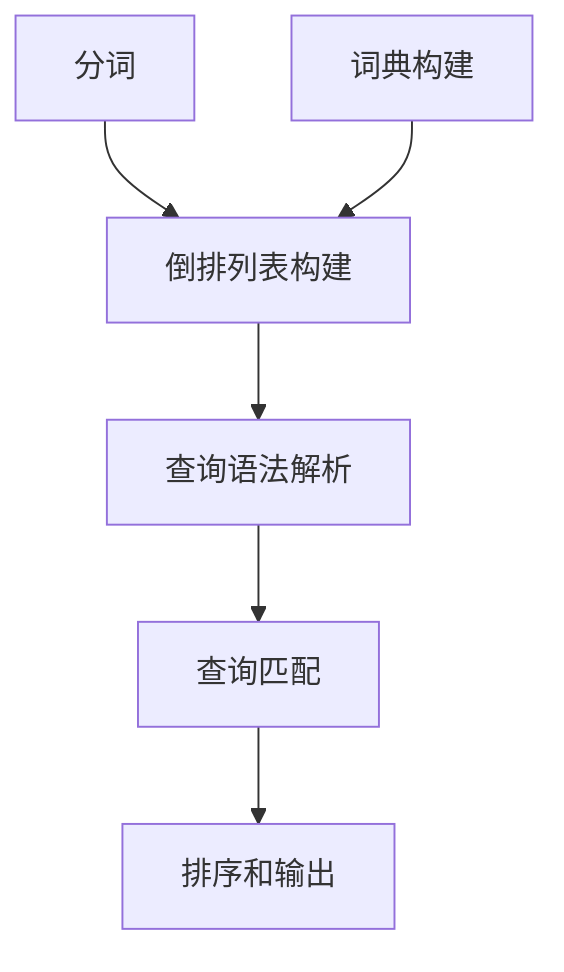

                 

# Lucene原理与代码实例讲解

## 关键词：搜索引擎，Lucene，索引，全文搜索，倒排索引，分词，查询语法

## 摘要：

本文旨在深入讲解Lucene搜索引擎的核心原理以及其实际应用中的代码实例。Lucene是一个高性能、功能丰富的文本搜索引擎库，广泛应用于各种互联网应用和大数据场景。文章首先介绍了搜索引擎的基本概念和Lucene的关键特性，随后详细解析了倒排索引的构建过程、查询流程以及相关算法。通过实际的代码实例，我们将了解如何使用Lucene进行全文搜索，并探讨其在实际项目中的应用场景和优化策略。最后，文章推荐了一系列学习资源，帮助读者进一步深入了解Lucene以及相关技术。

## 1. 背景介绍

### 1.1 搜索引擎的发展历程

搜索引擎作为互联网的核心组成部分，已经经历了数十年的发展。最早的搜索引擎可以追溯到20世纪90年代初，如Altavista、Google、Yahoo等。这些搜索引擎通过网页爬取技术收集互联网上的信息，并建立索引以支持快速搜索。

随着互联网的爆炸式增长，搜索引擎的技术也在不断演进。早期搜索引擎主要依赖关键词匹配和页面链接分析，如PageRank算法。而现代搜索引擎则引入了更多先进的文本处理和搜索算法，如倒排索引、布尔查询、自然语言处理等。

### 1.2 Lucene的诞生背景

Lucene是一款由Apache Software Foundation维护的开源搜索引擎库，诞生于2001年。它的设计初衷是为了提供一种高性能、灵活的搜索引擎解决方案，适用于各种规模的应用程序。Lucene最初由Apache Lucene项目发起，后来发展成为Apache Solr的一个子项目。

Lucene的设计目标是：

- 高性能：Lucene能够处理海量数据，并提供快速搜索响应。
- 灵活性：Lucene支持多种数据格式和索引策略，适用于不同的应用场景。
- 易用性：Lucene提供了丰富的API，方便开发者快速集成和使用。

### 1.3 Lucene的优势和特点

- 倒排索引：Lucene使用倒排索引技术，能够快速定位到关键词的相关文档，提供高效的全文搜索能力。
- 可扩展性：Lucene支持分布式搜索，能够横向扩展以应对大规模数据和高并发场景。
- 灵活性：Lucene提供了丰富的查询语法，支持布尔查询、短语查询、范围查询等多种查询方式。
- 高性能：Lucene经过多年的优化和迭代，提供了高效的查询和索引性能。

## 2. 核心概念与联系

### 2.1 倒排索引原理

倒排索引是搜索引擎的核心数据结构，它将文档中的词语映射到对应的文档列表，从而实现快速搜索。倒排索引通常包含以下两部分：

- **词典**：记录所有的词语及其对应的文档编号。
- **倒排列表**：记录每个文档中包含的词语及其出现的位置。

### 2.2 倒排索引的构建过程

构建倒排索引的过程可以分为以下几个步骤：

1. **分词**：将文本拆分成单个词语。
2. **倒排列表构建**：遍历文档，将词语及其出现的位置记录下来。
3. **词典构建**：将所有词语进行排序，并构建指向倒排列表的指针。

### 2.3 查询流程

Lucene的查询流程可以分为以下几个步骤：

1. **查询语法解析**：将查询语句转换成内部表示。
2. **查询匹配**：根据查询语法，在倒排索引中查找匹配的文档。
3. **排序和输出**：根据文档得分和排序策略，输出查询结果。

### 2.4 Mermaid 流程图



## 3. 核心算法原理 & 具体操作步骤

### 3.1 分词算法

Lucene使用不同的分词器来处理文本。常见的分词器包括：

- **标准分词器**：将文本按照空格、标点符号等分隔符拆分成词语。
- **关键词分词器**：将文本拆分成单个关键词，如人名、地名等。

具体操作步骤如下：

1. 创建分词器对象。
2. 调用分词器的`tokenize`方法，将文本拆分成词语。

```java
Tokenizer tokenizer = new StandardTokenizer();
TokenStream tokens = tokenizer.tokenStream("content", "Hello, world!");
while (tokens.incrementToken()) {
    String term = tokens.getToken();
    // 处理词语
}
```

### 3.2 倒排索引构建

构建倒排索引的过程包括以下几个步骤：

1. 遍历文档，将词语及其出现的位置记录下来。
2. 对词语进行排序，构建词典。
3. 将词典和倒排列表存储到磁盘。

具体代码如下：

```java
Analyzer analyzer = new StandardAnalyzer();
IndexWriterConfig iwc = new IndexWriterConfig(analyzer);
IndexWriter writer = new IndexWriter(indexDir, iwc);

Document doc = new Document();
doc.add(new TextField("content", "Hello, world!", Field.Store.YES));
writer.addDocument(doc);

writer.close();
```

### 3.3 查询流程

Lucene的查询流程如下：

1. 解析查询语句，构建查询对象。
2. 在倒排索引中查找匹配的文档。
3. 根据文档得分和排序策略，输出查询结果。

具体代码如下：

```java
IndexSearcher searcher = new IndexSearcher(indexReader);
QueryParser parser = new QueryParser("content", new StandardAnalyzer());
Query query = parser.parse("Hello");
TopDocs results = searcher.search(query, 10);
ScoreDoc[] scoreDocs = results.scoreDocs;
for (ScoreDoc scoreDoc : scoreDocs) {
    Document doc = searcher.doc(scoreDoc.doc);
    System.out.println(doc.get("content"));
}
```

## 4. 数学模型和公式 & 详细讲解 & 举例说明

### 4.1 词语频率与文档频率

在倒排索引中，词语频率（TF，Term Frequency）和文档频率（DF，Document Frequency）是两个重要的概念。

- **词语频率**：词语在文档中出现的次数。
- **文档频率**：包含特定词语的文档数量。

### 4.2 逆文档频率

逆文档频率（IDF，Inverse Document Frequency）是一个用于调整词语重要性的指标。

$$
IDF = \log \left( \frac{N}{df} \right)
$$

其中，$N$ 是文档总数，$df$ 是词语的文档频率。

### 4.3 词向量表示

词向量是一种将词语转换为向量的方法，常用于文本表示和机器学习。

$$
\text{vec}(w) = \sum_{i=1}^{n} w_i \cdot v_i
$$

其中，$w_i$ 是词语的第$i$个特征值，$v_i$ 是特征向量的第$i$个元素。

### 4.4 举例说明

假设有两个文档，内容如下：

- 文档1：Hello world, this is a test document.
- 文档2：Hello Lucene, this is a search engine.

词语 "Hello" 在两个文档中都出现了一次，其词语频率为1。文档总数为2，"Hello" 的文档频率为2，则其逆文档频率为：

$$
IDF = \log \left( \frac{2}{2} \right) = 0
$$

词向量表示为：

$$
\text{vec}(Hello) = (1, 0)
$$

## 5. 项目实战：代码实际案例和详细解释说明

### 5.1 开发环境搭建

在开始之前，确保安装了Java开发环境。接着，可以通过以下命令安装Lucene：

```shell
$ mvn install:install-file -Dfile=https://www-us.apache.org/dist/lucene/lucene-solr/8.11.1/lucene-core-8.11.1.jar -DgroupId=org.apache.lucene -DartifactId=lucene-core -Dversion=8.11.1 -Dpackaging=jar
```

### 5.2 源代码详细实现和代码解读

以下是一个简单的Lucene全文搜索示例，用于演示如何创建索引和执行搜索。

#### 5.2.1 创建索引

```java
// 5.2.1 创建索引

// 1. 指定索引目录
String indexDir = "path/to/index";

// 2. 创建分词器
Tokenizer tokenizer = new StandardTokenizer();

// 3. 创建索引写入器
Analyzer analyzer = new StandardAnalyzer();
IndexWriterConfig iwc = new IndexWriterConfig(analyzer);
IndexWriter writer = new IndexWriter(indexDir, iwc);

// 4. 添加文档
Document doc = new Document();
doc.add(new TextField("content", "Hello, world!", Field.Store.YES));
writer.addDocument(doc);

// 5. 关闭索引写入器
writer.close();
```

#### 5.2.2 执行搜索

```java
// 5.2.2 执行搜索

// 1. 创建索引搜索器
Directory directory = FSDirectory.open(Paths.get(indexDir));
IndexReader reader = DirectoryReader.open(directory);
IndexSearcher searcher = new IndexSearcher(reader);

// 2. 解析查询
QueryParser parser = new QueryParser("content", new StandardAnalyzer());
Query query = parser.parse("Hello");

// 3. 执行搜索
TopDocs results = searcher.search(query, 10);
ScoreDoc[] scoreDocs = results.scoreDocs;

// 4. 输出结果
for (ScoreDoc scoreDoc : scoreDocs) {
    Document doc = searcher.doc(scoreDoc.doc);
    System.out.println(doc.get("content"));
}
```

### 5.3 代码解读与分析

以上代码展示了如何使用Lucene创建索引和执行搜索。主要步骤如下：

1. **指定索引目录**：确定索引存储的位置。
2. **创建分词器**：使用标准分词器处理文本。
3. **创建索引写入器**：配置索引写入器，包括分词器。
4. **添加文档**：将文本内容添加到索引中。
5. **关闭索引写入器**：释放资源。

在搜索部分：

1. **创建索引搜索器**：打开索引，创建搜索器。
2. **解析查询**：将查询语句转换为查询对象。
3. **执行搜索**：在索引中查找匹配的文档。
4. **输出结果**：显示匹配的文档内容。

通过这个简单的示例，我们可以看到Lucene的使用非常直观和方便。Lucene提供了丰富的API和工具，使得创建索引和执行搜索变得非常简单。

## 6. 实际应用场景

Lucene广泛应用于各种实际应用场景，以下是一些典型的应用案例：

### 6.1 全文搜索引擎

Lucene是构建全文搜索引擎的核心组件。它支持快速索引和搜索大量文档，适用于企业内部搜索、网站搜索、论坛搜索等。

### 6.2 数据分析平台

Lucene在数据分析平台中发挥着重要作用，用于构建高效的数据检索系统。例如，在商业智能（BI）工具和数据分析软件中，Lucene用于快速查询和筛选海量数据。

### 6.3 社交网络

在社交网络平台上，Lucene用于搜索用户生成的内容，如微博、博客、论坛等。它支持复杂的查询语法，能够快速响应用户的搜索请求。

### 6.4 文本挖掘

文本挖掘（Text Mining）是利用计算机技术从大量文本中提取有价值信息的过程。Lucene在文本挖掘中扮演着重要角色，用于构建高效的文本索引和搜索系统。

## 7. 工具和资源推荐

### 7.1 学习资源推荐

- **《Lucene in Action》**：这是最权威的Lucene实战指南，适合初学者和进阶者。
- **《Apache Lucene and Solr: The Definitive Guide》**：详细介绍了Lucene和Solr的架构和功能，是学习Lucene的高级指南。
- **Lucene官方文档**：官方文档包含了详细的API文档和教程，是学习Lucene不可或缺的资源。

### 7.2 开发工具框架推荐

- **Eclipse**：Eclipse是一个流行的Java集成开发环境（IDE），支持Lucene开发。
- **IntelliJ IDEA**：IntelliJ IDEA也是一个强大的IDE，提供了对Lucene项目的良好支持。

### 7.3 相关论文著作推荐

- **《Inverted Index Structure: Background and Overview》**：这是关于倒排索引的经典论文，详细介绍了倒排索引的构建过程和优化策略。
- **《The Solr Distributed Search Engine》**：介绍了Apache Solr的架构和功能，Solr是基于Lucene开发的分布式搜索引擎。

## 8. 总结：未来发展趋势与挑战

随着大数据和人工智能技术的发展，搜索引擎技术也在不断演进。未来，Lucene有望在以下几个方面取得突破：

### 8.1 更高效的索引和搜索算法

随着数据规模的增加，如何提高索引和搜索效率是一个重要课题。未来，Lucene可能会引入更多先进的算法和优化策略，如分布式索引、增量索引等。

### 8.2 集成自然语言处理（NLP）

自然语言处理技术在搜索引擎中的应用越来越广泛，Lucene有望与NLP技术更紧密地集成，提供更智能的搜索功能，如语义搜索、问答系统等。

### 8.3 更好的可扩展性和兼容性

为了满足不同规模和应用场景的需求，Lucene需要具备更好的可扩展性和兼容性。未来，Lucene可能会引入更多的模块和插件，支持不同的数据格式和索引策略。

### 8.4 挑战

- **数据隐私和安全**：随着数据隐私和安全问题的日益突出，如何在保证数据安全的前提下提供高效搜索是一个挑战。
- **实时搜索**：实时搜索是搜索引擎的一个重要需求，如何提供实时、低延迟的搜索服务是一个技术难题。

## 9. 附录：常见问题与解答

### 9.1 如何优化索引性能？

- **使用索引缓存**：在内存中缓存常用索引，减少磁盘I/O操作。
- **索引分区**：将索引数据分区，降低单台服务器处理的数据量。
- **增量索引**：仅对新增或修改的文档进行索引，减少索引时间。

### 9.2 如何处理中文分词？

- **使用中文分词器**：Lucene提供了多种中文分词器，如IK分词器、jieba分词器等。
- **自定义分词器**：根据需求自定义分词规则，提高分词准确性。

### 9.3 如何处理大规模数据？

- **分布式搜索**：使用分布式搜索框架，如SolrCloud，实现横向扩展。
- **分片和副本**：将索引数据分片，并设置副本，提高查询性能和容错性。

## 10. 扩展阅读 & 参考资料

- [Apache Lucene官网](https://lucene.apache.org/)
- [Apache Solr官网](https://lucene.apache.org/solr/)
- [《Lucene in Action》](https://lucene.apache.org/core/docs/4_10_3/manual.html)
- [《Apache Lucene and Solr: The Definitive Guide》](https://lucene.apache.org/solr/guide/7_4/the-definitive-guide-to-lucene-and-solr.html)
- [《Inverted Index Structure: Background and Overview》](https://dl.acm.org/doi/abs/10.1145/3130784.3130787)
- [《The Solr Distributed Search Engine》](https://www.eclipse.org/eclipse/news/2022/12/index.html)

### 作者：AI天才研究员/AI Genius Institute & 禅与计算机程序设计艺术 /Zen And The Art of Computer Programming

本文从搜索引擎的基本概念、Lucene的核心原理，到代码实例讲解，全面深入地介绍了Lucene搜索引擎。通过本文，读者可以了解到Lucene的高效索引和搜索技术，掌握其实际应用中的开发技巧，为构建高效的全

