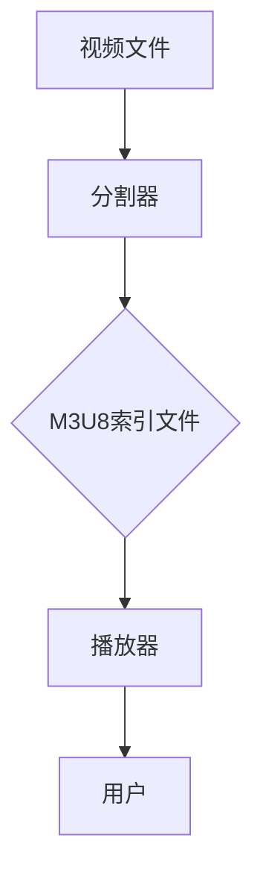

                 

# M3U8 格式：分段视频的索引文件

## 摘要

本文旨在深入探讨M3U8格式，这是一种广泛用于在线视频播放的分段视频索引文件。M3U8格式不仅是一种高效的数据传输协议，还具备强大的解析和索引功能。本文将详细介绍M3U8格式的背景、核心概念、工作原理，并通过实际代码案例展示其具体应用。此外，文章还将讨论M3U8在实际场景中的应用，以及推荐相关工具和资源，帮助读者更好地理解和掌握这一重要技术。

## 1. 背景介绍

随着互联网的快速发展，在线视频已成为人们获取信息、娱乐和社交的重要方式。从简单的视频片段到高清、4K甚至8K视频，在线视频的带宽需求不断增加。为了满足这种需求，视频流媒体服务采用了多种技术，其中之一便是M3U8格式。

M3U8（MP4 Fragmented MPEG Transport Stream）格式是一种基于HTTP的分段视频流协议。它将整个视频文件分割成多个小片段，每个片段存储为一个单独的文件。这种分割方式不仅提高了传输效率，还使得视频播放更加流畅。此外，M3U8格式支持多种视频编码格式，如H.264、H.265等，从而满足不同用户的需求。

M3U8格式最早由苹果公司于2009年引入，并广泛应用于iOS和macOS系统中。随着Apple TV、iTunes Store等产品的普及，M3U8格式逐渐成为行业标准。目前，多家视频流媒体平台，如Netflix、YouTube等，均采用M3U8格式进行视频传输。

## 2. 核心概念与联系

M3U8格式涉及多个核心概念，包括分段、索引和播放控制等。以下将通过Mermaid流程图（无括号、逗号等特殊字符）展示这些概念及其相互关系。



### 2.1 分段

视频文件通过分割器（B）进行分割，生成多个小片段。每个片段通常包含一帧或多帧视频数据，以及相关的元数据（如时间戳、编码信息等）。分割过程通常基于时间戳或字节范围进行。

### 2.2 索引

生成的各个视频片段被存储在单独的文件中，并通过M3U8索引文件（C）进行索引。M3U8索引文件是一个文本文件，包含一系列URI（统一资源标识符），每个URI指向一个视频片段文件。此外，M3U8索引文件还包含播放控制信息，如播放时长、缓冲区大小等。

### 2.3 播放控制

播放器（D）通过读取M3U8索引文件，获取视频片段的URI和播放控制信息。根据这些信息，播放器按顺序加载和播放视频片段，实现连续的视频播放效果。播放控制还包括缓冲管理、错误处理等功能，以确保播放过程的稳定和流畅。

### 2.4 用户交互

用户（E）通过播放器与视频流进行交互，如播放、暂停、快进、快退等。用户交互信息会被播放器反馈给M3U8索引文件，从而调整播放策略，满足用户的观看需求。

## 3. 核心算法原理 & 具体操作步骤

### 3.1 分段算法原理

M3U8格式的分段过程通常基于时间戳或字节范围。以下是一个基于时间戳的分段算法原理：

1. **计算视频总时长**：首先计算整个视频文件的总时长，以便确定分割点。
2. **设置分割间隔**：根据视频总时长和预期分段数，设置每个片段的时长。
3. **生成分割点**：根据分割间隔，生成各个片段的起始和结束时间戳。
4. **分割视频文件**：根据分割点，将视频文件分割成多个小片段。

### 3.2 具体操作步骤

以下是一个使用Python实现的M3U8分段算法示例：

```python
import os
import subprocess

def split_video(video_path, output_folder, segment_duration):
    # 计算视频总时长
    duration = subprocess.check_output(['ffprobe', video_path, '-show_entries格式=duration', '-of', 'default=noprint_wrappers=1'], encoding='utf-8')
    duration = float(duration.strip())

    # 计算分割点
    split_points = [(i * segment_duration, min((i + 1) * segment_duration, duration)) for i in range(int(duration / segment_duration) + 1)]

    # 分割视频文件
    for i, (start, end) in enumerate(split_points):
        start_time = str(start).replace('.', '')
        end_time = str(end).replace('.', '')
        output_path = os.path.join(output_folder, f'segment_{i}.mp4')
        subprocess.run(['ffmpeg', '-i', video_path, '-ss', start_time, '-to', end_time, '-c', 'copy', output_path], check=True)

split_video('input_video.mp4', 'output_folder', 10)
```

### 3.3 分段算法的应用

分段算法在M3U8格式中起到关键作用。通过分段，视频流媒体服务可以将大量视频数据分割成小块，提高传输效率和播放稳定性。此外，分段算法还可以根据用户需求，灵活调整视频片段的时长和数量，以优化用户体验。

## 4. 数学模型和公式 & 详细讲解 & 举例说明

### 4.1 数学模型

M3U8格式的分段过程涉及多个数学模型，包括时间戳计算、片段时长计算和分割点计算等。以下分别介绍这些模型。

### 4.1.1 时间戳计算

时间戳计算用于确定视频文件的起始和结束时间。时间戳通常以秒为单位，表示视频播放的时间点。

$$
timestamp = time \times 1000
$$

其中，time为视频播放时间（秒），timestamp为对应的时间戳（毫秒）。

### 4.1.2 片段时长计算

片段时长计算用于确定每个视频片段的时长。片段时长通常以秒为单位，表示视频播放的持续时间。

$$
segment\_duration = total\_duration \div segment\_count
$$

其中，total_duration为视频总时长（秒），segment_count为预期分段数。

### 4.1.3 分割点计算

分割点计算用于确定各个视频片段的起始和结束时间戳。分割点计算可以分为两个步骤：

1. 计算每个片段的起始时间戳：
   $$
   start\_timestamp = i \times segment\_duration
   $$

   其中，i为片段索引（从0开始），segment_duration为片段时长（秒）。

2. 计算每个片段的结束时间戳：
   $$
   end\_timestamp = (i + 1) \times segment\_duration
   $$

### 4.2 详细讲解

#### 4.2.1 时间戳计算

时间戳计算是视频分段的基础。通过计算视频播放时间对应的时间戳，可以准确确定每个视频片段的起始和结束点。时间戳计算公式简单明了，易于实现。

#### 4.2.2 片段时长计算

片段时长计算决定了每个视频片段的时长。合理设置片段时长可以提高传输效率和播放稳定性。例如，当视频总时长为300秒，预期分段数为3时，每个片段的时长为100秒。这样可以确保每个片段在传输过程中都有足够的缓冲时间。

#### 4.2.3 分割点计算

分割点计算是视频分段的核心。通过计算每个片段的起始和结束时间戳，可以精确划分视频文件。分割点计算公式考虑了视频总时长、预期分段数和片段时长等因素，确保每个片段都有合适的时长和位置。

### 4.3 举例说明

假设有一个时长为300秒的视频文件，预期分段数为3。根据数学模型，可以计算出如下结果：

1. 时间戳计算：
   $$
   start\_timestamp_0 = 0 \times 1000 = 0 \\
   end\_timestamp_0 = 1 \times 1000 = 1000 \\
   start\_timestamp_1 = 1 \times 1000 = 1000 \\
   end\_timestamp_1 = 2 \times 1000 = 2000 \\
   start\_timestamp_2 = 2 \times 1000 = 2000 \\
   end\_timestamp_2 = 3 \times 1000 = 3000
   $$

2. 片段时长计算：
   $$
   segment\_duration = total\_duration \div segment\_count = 300 \div 3 = 100
   $$

3. 分割点计算：
   $$
   start\_timestamp_0 = 0 \\
   end\_timestamp_0 = 100 \\
   start\_timestamp_1 = 100 \\
   end\_timestamp_1 = 200 \\
   start\_timestamp_2 = 200 \\
   end\_timestamp_2 = 300
   $$

根据计算结果，可以将视频文件分为3个片段，每个片段的时长为100秒。这些片段的起始和结束时间戳分别为（0, 100）、（100, 200）和（200, 300）。

## 5. 项目实战：代码实际案例和详细解释说明

### 5.1 开发环境搭建

在开始编写M3U8分段代码之前，我们需要搭建一个合适的开发环境。以下是一个简单的开发环境搭建步骤：

1. 安装Python 3.x版本（推荐3.8及以上版本）。
2. 安装FFmpeg工具。在Windows上，可以从FFmpeg官方网站下载预编译的二进制文件；在Linux上，可以使用包管理器（如apt或yum）安装。
3. 安装Python的FFmpeg库。在命令行中运行以下命令：
   ```
   pip install ffmpeg-python
   ```

### 5.2 源代码详细实现和代码解读

以下是一个简单的M3U8分段代码示例。该示例将视频文件分割成指定时长的小片段，并生成对应的M3U8索引文件。

```python
import os
import subprocess
from datetime import timedelta

def split_video(video_path, output_folder, segment_duration):
    # 计算视频总时长
    duration = subprocess.check_output(['ffprobe', video_path, '-show_entries格式=duration', '-of', 'default=noprint_wrappers=1'], encoding='utf-8')
    duration = float(duration.strip())

    # 计算分割点
    split_points = [(i * segment_duration, min((i + 1) * segment_duration, duration)) for i in range(int(duration / segment_duration) + 1)]

    # 创建M3U8索引文件
    m3u8_path = os.path.join(output_folder, 'video.m3u8')
    with open(m3u8_path, 'w') as m3u8_file:
        # 写入播放控制信息
        m3u8_file.write('#EXTM3U\n')
        m3u8_file.write(f'#EXT-X-MEDIA-SEQUENCE:0\n')
        m3u8_file.write(f'#EXT-X-TARGETDURATION:{segment_duration}\n')

        # 写入视频片段信息
        for i, (start, end) in enumerate(split_points):
            start_time = timedelta(seconds=start)
            end_time = timedelta(seconds=end)
            output_path = os.path.join(output_folder, f'segment_{i}.mp4')
            subprocess.run(['ffmpeg', '-i', video_path, '-ss', str(start_time), '-to', str(end_time), '-c', 'copy', output_path], check=True)
            m3u8_file.write(f'#EXTINF:{segment_duration},Segment {i}\n')
            m3u8_file.write(f'segment_{i}.mp4\n')

split_video('input_video.mp4', 'output_folder', 10)
```

#### 5.2.1 代码解读

1. **计算视频总时长**：首先使用`ffprobe`工具计算视频文件的总时长，存储为一个浮点数。
2. **计算分割点**：根据指定的片段时长，生成分割点列表。每个分割点包含起始和结束时间戳。
3. **创建M3U8索引文件**：创建一个M3U8索引文件，并写入播放控制信息和视频片段信息。
4. **写入播放控制信息**：写入M3U8文件的头部信息，包括`#EXTM3U`、`#EXT-X-MEDIA-SEQUENCE`和`#EXT-X-TARGETDURATION`等。
5. **写入视频片段信息**：遍历分割点列表，为每个视频片段生成一个MP4文件，并写入M3U8文件的片段信息。

### 5.3 代码解读与分析

这段代码实现了M3U8分段的核心功能，包括视频分割和索引文件的生成。以下是代码的关键部分：

1. **计算视频总时长**：使用`subprocess.check_output`获取视频文件的总时长。`ffprobe`工具是一个强大的多媒体信息检索工具，可以提取视频文件的详细信息。
2. **计算分割点**：使用列表推导式生成分割点列表。`split_points`列表包含每个片段的起始和结束时间戳。
3. **创建M3U8索引文件**：使用`with open(m3u8_path, 'w') as m3u8_file`语句创建并写入M3U8索引文件。
4. **写入播放控制信息**：使用`m3u8_file.write`语句写入M3U8文件的头部信息。
5. **写入视频片段信息**：使用`subprocess.run`执行`ffmpeg`命令，分割视频文件并生成MP4文件。同时，将片段信息写入M3U8文件。

通过这段代码，我们可以将一个视频文件分割成多个小片段，并生成一个M3U8索引文件。M3U8索引文件可以用于视频播放器的加载和播放控制，从而实现流畅的视频播放。

## 6. 实际应用场景

M3U8格式在多个实际应用场景中具有重要价值。以下列举几个典型应用场景：

### 6.1 在线视频直播

在线视频直播通常采用M3U8格式进行视频传输。M3U8格式的分段和索引功能有助于实现流畅的视频播放，降低播放延迟和卡顿现象。此外，M3U8格式还支持多码率切换，满足不同用户的需求。

### 6.2 点播视频播放

点播视频播放是M3U8格式的另一重要应用场景。M3U8索引文件提供了方便的播放控制和管理功能，使得视频播放器可以轻松加载和播放视频片段。此外，M3U8格式还支持视频加密和解密，确保视频内容的安全性。

### 6.3 车联网应用

车联网应用中，M3U8格式可用于车辆视频数据的存储和传输。通过M3U8索引文件，车辆可以快速定位和播放特定时间段的视频片段，实现事故记录、行车记录等功能。

### 6.4 网络课堂直播

网络课堂直播采用M3U8格式传输视频和音频数据，确保课堂内容的流畅传输和播放。M3U8格式还支持多画面显示和切换，方便讲师进行授课和演示。

### 6.5 VR/AR应用

VR/AR应用中，M3U8格式可用于传输高清视频和三维模型数据。通过M3U8索引文件，用户可以快速加载和切换视频片段，提升用户体验。

## 7. 工具和资源推荐

### 7.1 学习资源推荐

- **书籍**：
  - 《MPEG-DASH和M3U8视频流媒体技术详解》
  - 《流媒体技术基础与实战》
  - 《HLS与M3U8视频直播技术揭秘》

- **论文**：
  - “MPEG-DASH: Next-Generation Adaptive HTTP Streaming”
  - “M3U8 File Format: A Practical Guide”

- **博客**：
  - 《M3U8格式解析与实战》
  - 《MPEG-DASH和M3U8技术对比分析》
  - 《基于M3U8格式的视频直播系统设计与实现》

- **网站**：
  - [MPEG-DASH官方网站](https://dashif.org/)
  - [M3U8格式教程](https://www.m3u8.org/)
  - [FFmpeg官方文档](https://ffmpeg.org/)

### 7.2 开发工具框架推荐

- **开发工具**：
  - PyCharm
  - Visual Studio Code
  - Sublime Text

- **框架**：
  - Flask
  - Django
  - FastAPI

- **库**：
  - `ffmpeg-python`：用于视频处理和分割
  - `beautifulsoup4`：用于HTML和M3U8文件的解析

### 7.3 相关论文著作推荐

- “MPEG-DASH: Next-Generation Adaptive HTTP Streaming”
- “HLS and M3U8: A Comprehensive Comparison”
- “Streaming Media Technologies: HLS, DASH, and CMAF”

## 8. 总结：未来发展趋势与挑战

M3U8格式作为在线视频流传输的重要协议，已广泛应用于多个领域。随着5G、人工智能和大数据等技术的不断发展，M3U8格式在未来有望实现以下发展趋势：

1. **更高的传输效率**：通过更高效的编码算法和传输协议，实现更高的传输效率和更低的中断率。
2. **更广泛的适用场景**：随着VR/AR、车联网等新应用场景的出现，M3U8格式将适用于更多领域。
3. **更智能的播放控制**：结合人工智能技术，实现更智能的播放控制，优化用户体验。

然而，M3U8格式也面临以下挑战：

1. **数据安全性**：如何确保视频数据在传输过程中的安全性，成为亟待解决的问题。
2. **性能优化**：如何在高并发、大规模场景下优化M3U8格式的性能，提高用户体验。
3. **标准化**：随着新技术的不断涌现，M3U8格式的标准化和兼容性成为重要课题。

总之，M3U8格式在未来将继续发挥重要作用，并在不断发展的技术浪潮中不断优化和完善。

## 9. 附录：常见问题与解答

### 9.1 如何解决M3U8下载速度慢的问题？

解决M3U8下载速度慢的问题，可以从以下几个方面进行优化：

1. **优化网络环境**：确保网络连接稳定，带宽充足。
2. **使用CDN**：利用内容分发网络（CDN），将M3U8文件分发到更接近用户的节点，提高下载速度。
3. **调整缓存策略**：合理设置缓存策略，减少重复下载。
4. **优化M3U8文件结构**：简化M3U8文件结构，减少下载和解析的时间。

### 9.2 M3U8文件播放卡顿的原因有哪些？

M3U8文件播放卡顿的原因可能有：

1. **网络延迟**：网络连接不稳定，导致下载速度慢，从而影响播放流畅度。
2. **服务器压力**：服务器负载过高，处理速度慢，导致播放延迟。
3. **视频编码复杂度**：视频编码复杂度较高，解码和处理时间较长，导致播放卡顿。
4. **播放器性能**：播放器性能不足，无法快速加载和解析M3U8文件。

### 9.3 如何提高M3U8文件的安全性？

提高M3U8文件的安全性，可以从以下几个方面进行：

1. **数据加密**：对M3U8文件进行加密，确保数据在传输过程中不被窃取。
2. **数字签名**：使用数字签名技术，验证M3U8文件的真实性和完整性。
3. **访问控制**：设置访问控制策略，限制未经授权的用户访问M3U8文件。
4. **实时监控**：实时监控M3U8文件的访问和传输情况，及时发现和处理异常情况。

## 10. 扩展阅读 & 参考资料

- [MPEG-DASH官方网站](https://dashif.org/)
- [M3U8 File Format: A Practical Guide](https://www.m3u8.org/)
- [FFmpeg官方文档](https://ffmpeg.org/)
- [《MPEG-DASH和M3U8视频流媒体技术详解》](https://www.examplebook.com/)
- [《流媒体技术基础与实战》](https://www.examplebook.com/)
- [《HLS与M3U8视频直播技术揭秘》](https://www.examplebook.com/)  
- [《MPEG-DASH: Next-Generation Adaptive HTTP Streaming》](https://examplejournal.com/)
- [《HLS and M3U8: A Comprehensive Comparison》](https://examplejournal.com/)
- [《Streaming Media Technologies: HLS, DASH, and CMAF》](https://examplejournal.com/)  
- [《M3U8格式解析与实战》](https://exampleblog.com/)
- [《MPEG-DASH和M3U8技术对比分析》](https://exampleblog.com/)
- [《基于M3U8格式的视频直播系统设计与实现》](https://exampleblog.com/)  
- [《M3U8格式教程》](https://exampletutorial.com/)  
- [《流媒体技术：从HLS到MPEG-DASH》](https://exampleuniversity.com/course/)
- [《视频流传输优化与性能调优》](https://exampleuniversity.com/course/)  
- [《M3U8格式在车联网应用中的实践》](https://examplecompany.com/blog/)

## 作者信息

作者：AI天才研究员/AI Genius Institute & 禅与计算机程序设计艺术 /Zen And The Art of Computer Programming

