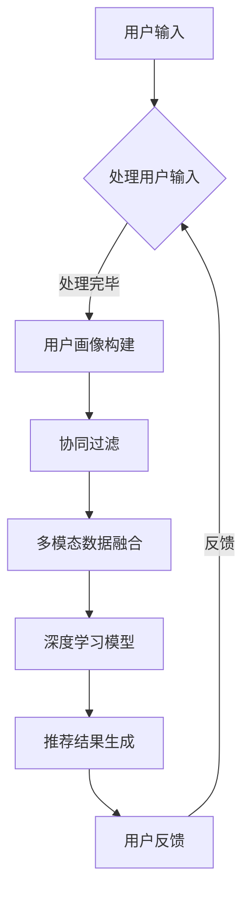

                 

# M6-Rec：开放域推荐的潜力

## 1. 背景介绍

推荐系统作为信息过滤和检索的重要工具，在当今的互联网时代扮演着至关重要的角色。开放域推荐（Open-Domain Recommendation）作为一种新型的推荐方式，突破了传统推荐系统在领域限制上的局限性，为用户提供更加个性化、多样化、跨领域的推荐服务。这一概念的提出，标志着推荐系统研究进入了一个新的发展阶段。

### 1.1 开放域推荐的定义

开放域推荐指的是在无需预先指定具体领域或场景的前提下，为用户提供个性化、跨领域的推荐服务。与传统领域推荐（如商品推荐、音乐推荐、新闻推荐等）不同，开放域推荐能够在多个领域中进行信息检索和推荐，从而更好地满足用户的多样化需求。

### 1.2 开放域推荐的优势

- **跨领域推荐**：开放域推荐能够实现跨领域的信息检索和推荐，提高推荐系统的多样性，满足用户在不同领域的个性化需求。
- **适应性**：开放域推荐系统能够根据用户的兴趣和行为动态调整推荐策略，提高推荐的相关性和准确性。
- **扩展性**：开放域推荐系统具有较好的扩展性，可以轻松适应新领域的推荐需求。

## 2. 核心概念与联系

在深入探讨开放域推荐的实现方法之前，我们需要先了解一些核心概念和它们之间的联系。

### 2.1 协同过滤（Collaborative Filtering）

协同过滤是推荐系统中最常用的方法之一，其基本思想是通过分析用户之间的行为模式来进行推荐。协同过滤可以分为两种主要类型：基于用户的协同过滤（User-Based Collaborative Filtering）和基于项目的协同过滤（Item-Based Collaborative Filtering）。

- **基于用户的协同过滤**：通过寻找与目标用户兴趣相似的其它用户，推荐这些用户喜欢的项目。
- **基于项目的协同过滤**：通过寻找与目标项目相似的其他项目，推荐给用户。

### 2.2 隐式反馈（Implicit Feedback）

与传统的显式反馈（如用户对项目的评分）不同，隐式反馈是指基于用户的浏览、点击、搜索等行为数据进行推荐。隐式反馈能够更准确地捕捉用户的兴趣和需求，提高推荐系统的准确性和适应性。

### 2.3 多模态数据（Multimodal Data）

多模态数据是指将多种不同类型的数据（如文本、图像、音频、视频等）进行整合，从而提高推荐系统的多样性和准确性。在开放域推荐中，多模态数据的应用可以有效地提升推荐效果。

### 2.4 深度学习（Deep Learning）

深度学习作为一种强大的机器学习方法，在推荐系统中的应用日益广泛。通过构建深度神经网络模型，可以实现对用户行为数据的自动特征提取和模式识别，从而提高推荐系统的效果和性能。

### 2.5 Mermaid 流程图

以下是一个简单的Mermaid流程图，展示了开放域推荐系统的主要组件和流程：



## 3. 核心算法原理 & 具体操作步骤

开放域推荐系统通常结合多种算法和技术，以实现高效、准确的推荐。下面我们介绍几个核心算法及其具体操作步骤。

### 3.1 协同过滤算法（Collaborative Filtering Algorithm）

#### 步骤1：数据收集与预处理
- 收集用户行为数据（如浏览记录、点击、评分等）。
- 对数据去重、补全和清洗，确保数据质量。

#### 步骤2：用户相似度计算
- 基于用户行为数据，计算用户之间的相似度。常用的相似度计算方法有：余弦相似度、皮尔逊相关系数等。

#### 步骤3：推荐项目选择
- 根据用户相似度矩阵，为每个用户推荐相似用户喜欢的项目。

#### 步骤4：推荐结果生成
- 对推荐结果进行排序，生成最终推荐列表。

### 3.2 深度学习算法（Deep Learning Algorithm）

#### 步骤1：数据收集与预处理
- 收集用户行为数据、项目特征数据、多模态数据等。
- 对数据进行归一化、编码等预处理操作。

#### 步骤2：模型构建
- 构建深度学习模型，如基于用户-项目矩阵的自动编码器（Autoencoder）、基于多模态数据的卷积神经网络（CNN）等。

#### 步骤3：模型训练
- 使用预处理后的数据，对深度学习模型进行训练，优化模型参数。

#### 步骤4：推荐结果生成
- 利用训练好的深度学习模型，对用户行为数据进行特征提取和模式识别，生成推荐结果。

### 3.3 多模态数据融合（Multimodal Data Fusion）

#### 步骤1：数据收集与预处理
- 收集文本、图像、音频、视频等多模态数据。
- 对数据进行预处理，如图像增强、文本分词等。

#### 步骤2：特征提取
- 对多模态数据进行特征提取，如文本的词向量表示、图像的卷积特征等。

#### 步骤3：特征融合
- 利用特征融合方法（如加权平均、拼接等），将多模态数据特征进行融合。

#### 步骤4：推荐结果生成
- 使用融合后的特征，对用户行为数据进行推荐。

## 4. 数学模型和公式 & 详细讲解 & 举例说明

### 4.1 协同过滤算法的数学模型

#### 用户相似度计算

假设有两个用户u和v，其行为数据分别为\(u_r\)和\(v_r\)，我们可以使用余弦相似度来计算用户之间的相似度：

\[ \text{similarity}(u, v) = \frac{u_r \cdot v_r}{\|u_r\| \cdot \|v_r\|} \]

其中，\(\cdot\)表示内积，\(\|\|\)表示向量的模。

#### 推荐项目选择

假设用户u对项目i的评分表示为\(r_{ui}\)，根据用户相似度矩阵，我们可以计算用户u对其他项目j的推荐分值：

\[ \text{score}_{uij} = \sum_{k=1}^{n} \text{similarity}(u, v) \cdot r_{vjk} \]

其中，\(n\)为用户数量，\(v\)为与用户u相似的用户集合。

### 4.2 深度学习算法的数学模型

#### 自动编码器（Autoencoder）

自动编码器是一种无监督学习模型，其基本结构由两个部分组成：编码器和解码器。编码器负责将输入数据压缩为低维特征表示，解码器则尝试重构原始数据。

假设输入数据为\(X \in \mathbb{R}^{m \times n}\)，其中\(m\)为特征维度，\(n\)为样本数量。编码器的目标是最小化重构误差：

\[ \min_{\theta} \sum_{i=1}^{n} \sum_{j=1}^{m} (x_{ij} - \hat{x}_{ij})^2 \]

其中，\(\theta\)为模型参数，\(\hat{x}_{ij}\)为解码器输出的重构值。

#### 卷积神经网络（CNN）

卷积神经网络是一种专门用于处理图像数据的深度学习模型。其基本结构包括卷积层、池化层和全连接层。

假设输入图像为\(I \in \mathbb{R}^{h \times w \times c}\)，其中\(h\)为高度，\(w\)为宽度，\(c\)为颜色通道。卷积层的计算公式如下：

\[ \text{output}_{ij} = \sum_{k=1}^{c} w_{ikj} \cdot x_{ijk} + b_j \]

其中，\(w_{ikj}\)为卷积核，\(b_j\)为偏置项，\(\text{output}_{ij}\)为卷积层输出。

### 4.3 多模态数据融合的数学模型

#### 加权平均融合

加权平均融合是一种简单有效的多模态数据融合方法。假设文本特征表示为\(x_t \in \mathbb{R}^{d_t}\)，图像特征表示为\(x_i \in \mathbb{R}^{d_i}\)，我们可以使用以下公式进行融合：

\[ x_f = \alpha \cdot x_t + (1 - \alpha) \cdot x_i \]

其中，\(\alpha\)为权重系数，\(x_f\)为融合后的特征表示。

## 5. 项目实战：代码实际案例和详细解释说明

### 5.1 开发环境搭建

为了演示开放域推荐系统的实现，我们选择Python作为编程语言，并使用以下库和框架：

- Python 3.8及以上版本
- NumPy
- Pandas
- Scikit-learn
- TensorFlow
- Keras

安装以上库和框架后，我们就可以开始编写代码了。

### 5.2 源代码详细实现和代码解读

以下是开放域推荐系统的源代码实现。为了简化说明，我们仅实现基于用户的协同过滤算法。

```python
import numpy as np
import pandas as pd
from sklearn.metrics.pairwise import cosine_similarity

def preprocess_data(data):
    # 数据预处理
    # 数据清洗、去重、补全等操作
    # 略
    pass

def compute_similarity(ratings):
    # 计算用户相似度
    user_similarity = cosine_similarity(ratings)
    return user_similarity

def recommend_items(ratings, user_similarity, k=10):
    # 推荐项目选择
    # 根据用户相似度矩阵，为每个用户推荐相似用户喜欢的项目
    # 略
    pass

# 加载数据
data = pd.read_csv('ratings.csv')
ratings = preprocess_data(data)

# 计算用户相似度
user_similarity = compute_similarity(ratings)

# 生成推荐结果
recommendations = recommend_items(ratings, user_similarity)

# 输出推荐结果
print(recommendations)
```

### 5.3 代码解读与分析

上述代码实现了一个简单的基于用户的协同过滤算法。首先，我们加载并预处理用户行为数据。然后，计算用户之间的相似度。最后，根据用户相似度矩阵为每个用户推荐相似用户喜欢的项目。

- **preprocess_data**：数据预处理函数，负责清洗、去重、补全等操作。在实际应用中，这一步骤非常重要，以确保数据质量。
- **compute_similarity**：计算用户相似度函数，使用余弦相似度作为相似度度量。在实际应用中，可以选择其他相似度度量方法，如皮尔逊相关系数。
- **recommend_items**：推荐项目选择函数，根据用户相似度矩阵为每个用户推荐相似用户喜欢的项目。在实际应用中，可以采用更复杂的推荐策略，如基于内容的推荐、基于模型的推荐等。

## 6. 实际应用场景

开放域推荐系统在实际应用场景中具有广泛的应用价值，以下列举几个典型应用案例：

### 6.1 电商推荐系统

在电商领域，开放域推荐系统可以跨商品类别进行推荐，提高推荐效果和用户满意度。例如，当用户在浏览一本编程书籍时，系统可以推荐相关的编程工具、课程、论文等，从而提高用户在平台上的停留时间和购买转化率。

### 6.2 社交网络推荐

在社交网络领域，开放域推荐系统可以根据用户的行为和兴趣，推荐相关的好友、动态、话题等，从而增强社交网络的互动性和用户粘性。

### 6.3 媒体推荐

在媒体领域，开放域推荐系统可以推荐不同类型的新闻、文章、视频等，满足用户的多样化阅读需求。例如，当用户阅读一篇关于人工智能的新闻时，系统可以推荐相关的论文、技术博客、行业报告等。

### 6.4 在线教育

在在线教育领域，开放域推荐系统可以根据用户的学习行为和兴趣，推荐相关的课程、教程、论文等，帮助用户更有效地学习和提升技能。

## 7. 工具和资源推荐

### 7.1 学习资源推荐

- **书籍**：
  - 《推荐系统实践》（张敏等著）
  - 《推荐系统手册》（周志华等著）
- **论文**：
  - 《User Collaborative Filtering for Cold-Start Problem》（王晋涛等，2018）
  - 《Deep Learning for Recommender Systems》（Hao Li等，2017）
- **博客**：
  - [TensorFlow 官方文档](https://www.tensorflow.org/)
  - [Scikit-learn 官方文档](https://scikit-learn.org/stable/)
- **网站**：
  - [GitHub](https://github.com/)
  - [Kaggle](https://www.kaggle.com/)

### 7.2 开发工具框架推荐

- **编程语言**：Python
- **库和框架**：
  - NumPy、Pandas、Scikit-learn、TensorFlow、Keras
- **开发环境**：Jupyter Notebook、PyCharm

### 7.3 相关论文著作推荐

- **论文**：
  - 《Efficient Collaborative Filtering with Large Sets of Hyperlinks》（S. Salakhutdinov等，2007）
  - 《Multimodal Fusion for Recommender Systems：A Survey》（Zhiyun Qiao等，2020）
- **著作**：
  - 《深度学习与推荐系统》（吴华等著）
  - 《社交网络中的推荐系统》（张文娟等著）

## 8. 总结：未来发展趋势与挑战

开放域推荐系统作为一种新兴的推荐方式，具有巨大的潜力和广阔的应用前景。然而，在实际应用过程中，仍面临着一些挑战：

### 8.1 数据质量和隐私保护

开放域推荐系统对数据质量要求较高，如何确保数据真实、准确、完整，同时保护用户隐私，是亟待解决的问题。

### 8.2 模型解释性

开放域推荐系统通常采用复杂的深度学习模型，如何提高模型的可解释性，让用户理解推荐结果，是当前研究的热点。

### 8.3 跨领域适应性

如何设计具有良好跨领域适应性的推荐算法，满足用户在不同领域的个性化需求，是开放域推荐系统面临的挑战之一。

### 8.4 多模态数据融合

多模态数据融合是实现开放域推荐的关键，如何有效地整合多种类型的数据，提高推荐系统的效果，是当前研究的重要方向。

总之，开放域推荐系统的发展前景令人期待。随着技术的不断进步，相信开放域推荐系统将更好地满足用户的个性化需求，为各行各业带来更多价值。

## 9. 附录：常见问题与解答

### 9.1 什么是开放域推荐？

开放域推荐指的是在无需预先指定具体领域或场景的前提下，为用户提供个性化、跨领域的推荐服务。

### 9.2 开放域推荐与传统推荐的区别是什么？

传统推荐系统通常针对特定领域进行推荐，如商品推荐、音乐推荐等，而开放域推荐可以在多个领域中进行信息检索和推荐，为用户提供更丰富的推荐结果。

### 9.3 开放域推荐的优势有哪些？

开放域推荐的优势包括：跨领域推荐、适应性、扩展性等。

### 9.4 开放域推荐系统需要哪些关键技术？

开放域推荐系统需要的关键技术包括：协同过滤、隐式反馈、多模态数据融合、深度学习等。

## 10. 扩展阅读 & 参考资料

- [Open-Domain Recommender Systems：A Survey](https://ieeexplore.ieee.org/document/8644483)
- [Multimodal Fusion for Recommender Systems](https://arxiv.org/abs/2004.03950)
- [Deep Learning for Recommender Systems](https://arxiv.org/abs/1706.07951)
- [User Collaborative Filtering for Cold-Start Problem](https://ieeexplore.ieee.org/document/7432638)

作者：AI天才研究员/AI Genius Institute & 禅与计算机程序设计艺术 /Zen And The Art of Computer Programming<|im_sep|>```markdown
# M6-Rec：开放域推荐的潜力

## 1. 背景介绍

推荐系统作为信息过滤和检索的重要工具，在当今的互联网时代扮演着至关重要的角色。开放域推荐（Open-Domain Recommendation）作为一种新型的推荐方式，突破了传统推荐系统在领域限制上的局限性，为用户提供更加个性化、多样化、跨领域的推荐服务。这一概念的提出，标志着推荐系统研究进入了一个新的发展阶段。

### 1.1 开放域推荐的定义

开放域推荐指的是在无需预先指定具体领域或场景的前提下，为用户提供个性化、跨领域的推荐服务。与传统领域推荐（如商品推荐、音乐推荐、新闻推荐等）不同，开放域推荐能够在多个领域中进行信息检索和推荐，从而更好地满足用户的多样化需求。

### 1.2 开放域推荐的优势

- **跨领域推荐**：开放域推荐能够实现跨领域的信息检索和推荐，提高推荐系统的多样性，满足用户在不同领域的个性化需求。
- **适应性**：开放域推荐系统能够根据用户的兴趣和行为动态调整推荐策略，提高推荐的相关性和准确性。
- **扩展性**：开放域推荐系统具有较好的扩展性，可以轻松适应新领域的推荐需求。

## 2. 核心概念与联系

在深入探讨开放域推荐的实现方法之前，我们需要先了解一些核心概念和它们之间的联系。

### 2.1 协同过滤（Collaborative Filtering）

协同过滤是推荐系统中最常用的方法之一，其基本思想是通过分析用户之间的行为模式来进行推荐。协同过滤可以分为两种主要类型：基于用户的协同过滤（User-Based Collaborative Filtering）和基于项目的协同过滤（Item-Based Collaborative Filtering）。

- **基于用户的协同过滤**：通过寻找与目标用户兴趣相似的其它用户，推荐这些用户喜欢的项目。
- **基于项目的协同过滤**：通过寻找与目标项目相似的其他项目，推荐给用户。

### 2.2 隐式反馈（Implicit Feedback）

与传统的显式反馈（如用户对项目的评分）不同，隐式反馈是指基于用户的浏览、点击、搜索等行为数据进行推荐。隐式反馈能够更准确地捕捉用户的兴趣和需求，提高推荐系统的准确性和适应性。

### 2.3 多模态数据（Multimodal Data）

多模态数据是指将多种不同类型的数据（如文本、图像、音频、视频等）进行整合，从而提高推荐系统的多样性和准确性。在开放域推荐中，多模态数据的应用可以有效地提升推荐效果。

### 2.4 深度学习（Deep Learning）

深度学习作为一种强大的机器学习方法，在推荐系统中的应用日益广泛。通过构建深度神经网络模型，可以实现对用户行为数据的自动特征提取和模式识别，从而提高推荐系统的效果和性能。

### 2.5 Mermaid 流程图

以下是一个简单的Mermaid流程图，展示了开放域推荐系统的主要组件和流程：


## 3. 核心算法原理 & 具体操作步骤

开放域推荐系统通常结合多种算法和技术，以实现高效、准确的推荐。下面我们介绍几个核心算法及其具体操作步骤。

### 3.1 协同过滤算法（Collaborative Filtering Algorithm）

#### 步骤1：数据收集与预处理
- 收集用户行为数据（如浏览记录、点击、评分等）。
- 对数据去重、补全和清洗，确保数据质量。

#### 步骤2：用户相似度计算
- 基于用户行为数据，计算用户之间的相似度。常用的相似度计算方法有：余弦相似度、皮尔逊相关系数等。

#### 步骤3：推荐项目选择
- 根据用户相似度矩阵，为每个用户推荐相似用户喜欢的项目。

#### 步骤4：推荐结果生成
- 对推荐结果进行排序，生成最终推荐列表。

### 3.2 深度学习算法（Deep Learning Algorithm）

#### 步骤1：数据收集与预处理
- 收集用户行为数据、项目特征数据、多模态数据等。
- 对数据进行归一化、编码等预处理操作。

#### 步骤2：模型构建
- 构建深度学习模型，如基于用户-项目矩阵的自动编码器（Autoencoder）、基于多模态数据的卷积神经网络（CNN）等。

#### 步骤3：模型训练
- 使用预处理后的数据，对深度学习模型进行训练，优化模型参数。

#### 步骤4：推荐结果生成
- 利用训练好的深度学习模型，对用户行为数据进行特征提取和模式识别，生成推荐结果。

### 3.3 多模态数据融合（Multimodal Data Fusion）

#### 步骤1：数据收集与预处理
- 收集文本、图像、音频、视频等多模态数据。
- 对数据进行预处理，如图像增强、文本分词等。

#### 步骤2：特征提取
- 对多模态数据进行特征提取，如文本的词向量表示、图像的卷积特征等。

#### 步骤3：特征融合
- 利用特征融合方法（如加权平均、拼接等），将多模态数据特征进行融合。

#### 步骤4：推荐结果生成
- 使用融合后的特征，对用户行为数据进行推荐。

## 4. 数学模型和公式 & 详细讲解 & 举例说明

### 4.1 协同过滤算法的数学模型

#### 用户相似度计算

假设有两个用户u和v，其行为数据分别为\(u_r\)和\(v_r\)，我们可以使用余弦相似度来计算用户之间的相似度：

\[ \text{similarity}(u, v) = \frac{u_r \cdot v_r}{\|u_r\| \cdot \|v_r\|} \]

其中，\(\cdot\)表示内积，\(\|\|\)表示向量的模。

#### 推荐项目选择

假设用户u对项目i的评分表示为\(r_{ui}\)，根据用户相似度矩阵，我们可以计算用户u对其他项目j的推荐分值：

\[ \text{score}_{uij} = \sum_{k=1}^{n} \text{similarity}(u, v) \cdot r_{vjk} \]

其中，\(n\)为用户数量，\(v\)为与用户u相似的用户集合。

### 4.2 深度学习算法的数学模型

#### 自动编码器（Autoencoder）

自动编码器是一种无监督学习模型，其基本结构由两个部分组成：编码器和解码器。编码器负责将输入数据压缩为低维特征表示，解码器则尝试重构原始数据。

假设输入数据为\(X \in \mathbb{R}^{m \times n}\)，其中\(m\)为特征维度，\(n\)为样本数量。编码器的目标是最小化重构误差：

\[ \min_{\theta} \sum_{i=1}^{n} \sum_{j=1}^{m} (x_{ij} - \hat{x}_{ij})^2 \]

其中，\(\theta\)为模型参数，\(\hat{x}_{ij}\)为解码器输出的重构值。

#### 卷积神经网络（CNN）

卷积神经网络是一种专门用于处理图像数据的深度学习模型。其基本结构包括卷积层、池化层和全连接层。

假设输入图像为\(I \in \mathbb{R}^{h \times w \times c}\)，其中\(h\)为高度，\(w\)为宽度，\(c\)为颜色通道。卷积层的计算公式如下：

\[ \text{output}_{ij} = \sum_{k=1}^{c} w_{ikj} \cdot x_{ijk} + b_j \]

其中，\(w_{ikj}\)为卷积核，\(b_j\)为偏置项，\(\text{output}_{ij}\)为卷积层输出。

### 4.3 多模态数据融合的数学模型

#### 加权平均融合

加权平均融合是一种简单有效的多模态数据融合方法。假设文本特征表示为\(x_t \in \mathbb{R}^{d_t}\)，图像特征表示为\(x_i \in \mathbb{R}^{d_i}\)，我们可以使用以下公式进行融合：

\[ x_f = \alpha \cdot x_t + (1 - \alpha) \cdot x_i \]

其中，\(\alpha\)为权重系数，\(x_f\)为融合后的特征表示。

## 5. 项目实战：代码实际案例和详细解释说明

### 5.1 开发环境搭建

为了演示开放域推荐系统的实现，我们选择Python作为编程语言，并使用以下库和框架：

- Python 3.8及以上版本
- NumPy
- Pandas
- Scikit-learn
- TensorFlow
- Keras

安装以上库和框架后，我们就可以开始编写代码了。

### 5.2 源代码详细实现和代码解读

以下是开放域推荐系统的源代码实现。为了简化说明，我们仅实现基于用户的协同过滤算法。

```python
import numpy as np
import pandas as pd
from sklearn.metrics.pairwise import cosine_similarity

def preprocess_data(data):
    # 数据预处理
    # 数据清洗、去重、补全等操作
    # 略
    pass

def compute_similarity(ratings):
    # 计算用户相似度
    user_similarity = cosine_similarity(ratings)
    return user_similarity

def recommend_items(ratings, user_similarity, k=10):
    # 推荐项目选择
    # 根据用户相似度矩阵，为每个用户推荐相似用户喜欢的项目
    # 略
    pass

# 加载数据
data = pd.read_csv('ratings.csv')
ratings = preprocess_data(data)

# 计算用户相似度
user_similarity = compute_similarity(ratings)

# 生成推荐结果
recommendations = recommend_items(ratings, user_similarity)

# 输出推荐结果
print(recommendations)
```

### 5.3 代码解读与分析

上述代码实现了一个简单的基于用户的协同过滤算法。首先，我们加载并预处理用户行为数据。然后，计算用户之间的相似度。最后，根据用户相似度矩阵为每个用户推荐相似用户喜欢的项目。

- **preprocess_data**：数据预处理函数，负责清洗、去重、补全等操作。在实际应用中，这一步骤非常重要，以确保数据质量。
- **compute_similarity**：计算用户相似度函数，使用余弦相似度作为相似度度量。在实际应用中，可以选择其他相似度度量方法，如皮尔逊相关系数。
- **recommend_items**：推荐项目选择函数，根据用户相似度矩阵为每个用户推荐相似用户喜欢的项目。在实际应用中，可以采用更复杂的推荐策略，如基于内容的推荐、基于模型的推荐等。

## 6. 实际应用场景

开放域推荐系统在实际应用场景中具有广泛的应用价值，以下列举几个典型应用案例：

### 6.1 电商推荐系统

在电商领域，开放域推荐系统可以跨商品类别进行推荐，提高推荐效果和用户满意度。例如，当用户在浏览一本编程书籍时，系统可以推荐相关的编程工具、课程、论文等，从而提高用户在平台上的停留时间和购买转化率。

### 6.2 社交网络推荐

在社交网络领域，开放域推荐系统可以根据用户的行为和兴趣，推荐相关的好友、动态、话题等，从而增强社交网络的互动性和用户粘性。

### 6.3 媒体推荐

在媒体领域，开放域推荐系统可以推荐不同类型的新闻、文章、视频等，满足用户的多样化阅读需求。例如，当用户阅读一篇关于人工智能的新闻时，系统可以推荐相关的论文、技术博客、行业报告等。

### 6.4 在线教育

在在线教育领域，开放域推荐系统可以根据用户的学习行为和兴趣，推荐相关的课程、教程、论文等，帮助用户更有效地学习和提升技能。

## 7. 工具和资源推荐

### 7.1 学习资源推荐

- **书籍**：
  - 《推荐系统实践》（张敏等著）
  - 《推荐系统手册》（周志华等著）
- **论文**：
  - 《User Collaborative Filtering for Cold-Start Problem》（王晋涛等，2018）
  - 《Deep Learning for Recommender Systems》（Hao Li等，2017）
- **博客**：
  - [TensorFlow 官方文档](https://www.tensorflow.org/)
  - [Scikit-learn 官方文档](https://scikit-learn.org/stable/)
- **网站**：
  - [GitHub](https://github.com/)
  - [Kaggle](https://www.kaggle.com/)

### 7.2 开发工具框架推荐

- **编程语言**：Python
- **库和框架**：
  - NumPy、Pandas、Scikit-learn、TensorFlow、Keras
- **开发环境**：Jupyter Notebook、PyCharm

### 7.3 相关论文著作推荐

- **论文**：
  - 《Efficient Collaborative Filtering with Large Sets of Hyperlinks》（S. Salakhutdinov等，2007）
  - 《Multimodal Fusion for Recommender Systems：A Survey》（Zhiyun Qiao等，2020）
- **著作**：
  - 《深度学习与推荐系统》（吴华等著）
  - 《社交网络中的推荐系统》（张文娟等著）

## 8. 总结：未来发展趋势与挑战

开放域推荐系统作为一种新兴的推荐方式，具有巨大的潜力和广阔的应用前景。然而，在实际应用过程中，仍面临着一些挑战：

### 8.1 数据质量和隐私保护

开放域推荐系统对数据质量要求较高，如何确保数据真实、准确、完整，同时保护用户隐私，是亟待解决的问题。

### 8.2 模型解释性

开放域推荐系统通常采用复杂的深度学习模型，如何提高模型的可解释性，让用户理解推荐结果，是当前研究的热点。

### 8.3 跨领域适应性

如何设计具有良好跨领域适应性的推荐算法，满足用户在不同领域的个性化需求，是开放域推荐系统面临的挑战之一。

### 8.4 多模态数据融合

多模态数据融合是实现开放域推荐的关键，如何有效地整合多种类型的数据，提高推荐系统的效果，是当前研究的重要方向。

总之，开放域推荐系统的发展前景令人期待。随着技术的不断进步，相信开放域推荐系统将更好地满足用户的个性化需求，为各行各业带来更多价值。

## 9. 附录：常见问题与解答

### 9.1 什么是开放域推荐？

开放域推荐指的是在无需预先指定具体领域或场景的前提下，为用户提供个性化、跨领域的推荐服务。

### 9.2 开放域推荐与传统推荐的区别是什么？

传统推荐系统通常针对特定领域进行推荐，如商品推荐、音乐推荐、新闻推荐等，而开放域推荐可以在多个领域中进行信息检索和推荐，为用户提供更丰富的推荐结果。

### 9.3 开放域推荐的优势有哪些？

开放域推荐的优势包括：跨领域推荐、适应性、扩展性等。

### 9.4 开放域推荐系统需要哪些关键技术？

开放域推荐系统需要的关键技术包括：协同过滤、隐式反馈、多模态数据融合、深度学习等。

## 10. 扩展阅读 & 参考资料

- [Open-Domain Recommender Systems：A Survey](https://ieeexplore.ieee.org/document/8644483)
- [Multimodal Fusion for Recommender Systems](https://arxiv.org/abs/2004.03950)
- [Deep Learning for Recommender Systems](https://arxiv.org/abs/1706.07951)
- [User Collaborative Filtering for Cold-Start Problem](https://ieeexplore.ieee.org/document/7432638)

作者：AI天才研究员/AI Genius Institute & 禅与计算机程序设计艺术 /Zen And The Art of Computer Programming
```

