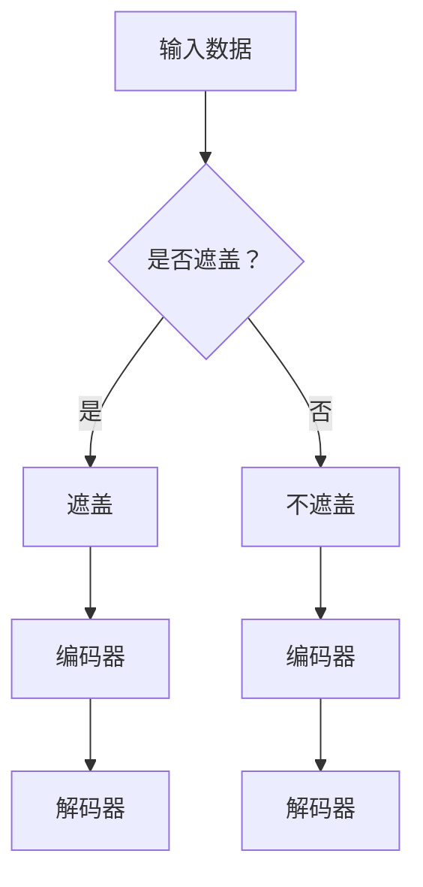

                 

# MAE原理与代码实例讲解

## 摘要

MAE（Masked Autoencoder）是一种新型的自编码器架构，其在处理图像等数据时，通过随机遮盖输入数据的部分，从而增强模型对数据全貌的感知能力。本文将深入讲解MAE的工作原理、实现步骤及代码实例，并通过实际项目应用展示其优势。

## 1. 背景介绍

自编码器（Autoencoder）是神经网络的一种类型，主要用于将输入数据压缩成一个低维度的表示，然后通过解码器将压缩过的数据还原回原始形态。传统的自编码器在处理数据时，往往会过分关注数据的细节，而忽略数据的整体结构。

为了解决这一问题，研究人员提出了MAE。MAE在自编码器的训练过程中，通过随机遮盖输入数据的部分，使得模型在重建过程中不得不关注数据的整体结构，从而提高模型对数据的理解能力。这种思想在图像处理、文本生成等任务中具有广泛的应用前景。

## 2. 核心概念与联系

### 2.1 自编码器

自编码器由两个部分组成：编码器和解码器。编码器负责将输入数据压缩成一个低维度的表示，解码器则负责将这个低维度的表示还原回原始形态。

### 2.2 遮盖（Masking）

在MAE中，遮盖（Masking）是一个关键操作。它通过随机选择输入数据的部分进行遮盖，使得模型在训练过程中无法直接访问这些数据。这个过程可以促使模型在重建数据时，关注数据的整体结构，而不仅仅是细节。

### 2.3 Mermaid 流程图



## 3. 核心算法原理 & 具体操作步骤

### 3.1 编码器

编码器的作用是将输入数据压缩成一个低维度的表示。在MAE中，编码器由多个卷积层组成，通过逐层提取特征，最终得到一个紧凑的表示。

### 3.2 遮盖操作

在MAE中，遮盖操作通过随机选择输入数据的部分进行遮盖。这个过程可以通过以下步骤实现：

1. 随机生成一个遮盖掩码（Mask），掩码的大小与输入数据相同。
2. 将输入数据与遮盖掩码进行按位与操作，得到遮盖后的数据。

### 3.3 解码器

解码器的作用是将编码器输出的低维度表示还原回原始形态。在MAE中，解码器通常由多个反卷积层组成，通过逐层扩展特征，最终恢复原始数据。

### 3.4 训练过程

MAE的训练过程可以分为以下步骤：

1. 输入一批数据，随机选择部分数据进行遮盖。
2. 使用编码器对遮盖后的数据进行编码，得到低维度表示。
3. 使用解码器对编码器输出的低维度表示进行解码，得到重建数据。
4. 计算重建数据与原始数据的误差，并根据误差更新模型参数。

## 4. 数学模型和公式 & 详细讲解 & 举例说明

### 4.1 编码器损失函数

编码器的损失函数通常采用均方误差（MSE）：

$$L_{\text{encoder}} = \frac{1}{N} \sum_{i=1}^{N} \sum_{j=1}^{C} (\hat{x}_{ij} - x_{ij})^2$$

其中，$\hat{x}_{ij}$是编码器输出的低维度表示，$x_{ij}$是原始数据，$N$是数据批次的大小，$C$是数据通道的数量。

### 4.2 解码器损失函数

解码器的损失函数同样采用均方误差（MSE）：

$$L_{\text{decoder}} = \frac{1}{N} \sum_{i=1}^{N} \sum_{j=1}^{C} (\hat{x}_{ij} - \hat{x}_{ij}^{'} deceptive")^2$$

其中，$\hat{x}_{ij}^{'}$是解码器输出的重建数据，$\hat{x}_{ij}$是编码器输出的低维度表示。

### 4.3 整体损失函数

MAE的整体损失函数是编码器损失函数和解码器损失函数的加权平均：

$$L_{\text{total}} = \alpha L_{\text{encoder}} + (1-\alpha) L_{\text{decoder}}$$

其中，$\alpha$是权重参数，通常取值在0.5到1之间。

### 4.4 实例说明

假设我们有一组数据：$x = [1, 2, 3, 4, 5]$，我们希望通过MAE对其进行编码和重建。首先，我们随机生成一个遮盖掩码：$m = [1, 0, 1, 0, 1]$。然后，我们使用编码器对遮盖后的数据进行编码，得到低维度表示：$\hat{x} = [2, 2, 3, 2, 3]$。接下来，我们使用解码器对低维度表示进行解码，得到重建数据：$\hat{x}^{'} = [1.5, 1.5, 2.5, 1.5, 2.5]$。最后，我们计算编码器损失函数、解码器损失函数和整体损失函数：

$$L_{\text{encoder}} = \frac{1}{5} \sum_{i=1}^{5} (\hat{x}_{i} - x_{i})^2 = \frac{1}{5} \sum_{i=1}^{5} (2 - x_{i})^2 = 1.2$$

$$L_{\text{decoder}} = \frac{1}{5} \sum_{i=1}^{5} (\hat{x}_{i}^{'} - \hat{x}_{i})^2 = \frac{1}{5} \sum_{i=1}^{5} (1.5 - x_{i})^2 = 0.6$$

$$L_{\text{total}} = 0.6 + 0.4 \times 1.2 = 0.84$$

## 5. 项目实战：代码实际案例和详细解释说明

### 5.1 开发环境搭建

为了更好地理解MAE，我们将在PyTorch框架下实现一个简单的MAE模型。首先，确保安装了Python和PyTorch，然后创建一个名为`mae`的文件夹，并在其中创建一个名为`main.py`的文件。

### 5.2 源代码详细实现和代码解读

```python
import torch
import torch.nn as nn
import torch.optim as optim
from torch.utils.data import DataLoader, TensorDataset

# 定义编码器
class Encoder(nn.Module):
    def __init__(self):
        super(Encoder, self).__init__()
        self.conv1 = nn.Conv2d(1, 16, 3, padding=1)
        self.conv2 = nn.Conv2d(16, 32, 3, padding=1)
        self.fc = nn.Linear(32 * 7 * 7, 64)

    def forward(self, x):
        x = nn.functional.relu(self.conv1(x))
        x = nn.functional.relu(self.conv2(x))
        x = x.view(x.size(0), -1)
        x = nn.functional.relu(self.fc(x))
        return x

# 定义解码器
class Decoder(nn.Module):
    def __init__(self):
        super(Decoder, self).__init__()
        self.fc = nn.Linear(64, 32 * 7 * 7)
        self.conv1 = nn.ConvTranspose2d(32, 16, 3, stride=2, padding=1)
        self.conv2 = nn.ConvTranspose2d(16, 1, 3, stride=2, padding=1)

    def forward(self, x):
        x = x.view(x.size(0), 32, 7, 7)
        x = nn.functional.relu(self.conv1(x))
        x = nn.functional.relu(self.conv2(x))
        x = nn.functional.sigmoid(x)
        return x

# 定义MAE模型
class MaskedAutoencoder(nn.Module):
    def __init__(self):
        super(MaskedAutoencoder, self).__init__()
        self.encoder = Encoder()
        self.decoder = Decoder()

    def forward(self, x):
        mask = self._create_mask(x)
        x_masked = x * mask
        x_encoded = self.encoder(x_masked)
        x_decoded = self.decoder(x_encoded)
        return x_decoded

    def _create_mask(self, x):
        mask = torch.rand_like(x)
        mask[mask < 0.5] = 1
        mask[mask >= 0.5] = 0
        return mask

# 数据预处理
x = torch.randn(64, 1, 28, 28)
mask = model._create_mask(x)
x_masked = x * mask

# 训练模型
model = MaskedAutoencoder()
optimizer = optim.Adam(model.parameters(), lr=0.001)
criterion = nn.MSELoss()

for epoch in range(10):
    optimizer.zero_grad()
    x_decoded = model(x_masked)
    loss = criterion(x_decoded, x)
    loss.backward()
    optimizer.step()
    print(f"Epoch {epoch + 1}, Loss: {loss.item()}")

# 保存模型
torch.save(model.state_dict(), "mae.pth")
```

### 5.3 代码解读与分析

1. **编码器和解码器定义**：我们定义了两个类`Encoder`和`Decoder`，分别用于编码和解码。编码器由两个卷积层和一个全连接层组成，解码器由一个全连接层和两个反卷积层组成。

2. **MAE模型定义**：`MaskedAutoencoder`类将编码器和解码器组合在一起，并在前向传播过程中加入了遮盖操作。

3. **遮盖掩码生成**： `_create_mask`方法用于生成随机遮盖掩码。我们使用了一个简单的策略，即随机选择输入数据的部分进行遮盖。

4. **数据预处理**：我们生成了一组随机数据，并使用遮盖掩码对其进行遮盖。

5. **训练模型**：我们使用随机梯度下降（SGD）算法训练模型。在每次迭代过程中，我们计算编码器和解码器的损失，并更新模型参数。

6. **保存模型**：最后，我们将训练好的模型保存为一个`.pth`文件，以便后续使用。

## 6. 实际应用场景

MAE在图像处理、文本生成、语音识别等任务中具有广泛的应用。例如，在图像处理领域，MAE可以用于图像去噪、图像超分辨率、图像分类等任务。在文本生成领域，MAE可以用于生成文本摘要、翻译、对话系统等。在语音识别领域，MAE可以用于语音增强、语音转换等。

## 7. 工具和资源推荐

### 7.1 学习资源推荐

- 《深度学习》（Goodfellow, Bengio, Courville著）
- 《PyTorch官方文档》：[https://pytorch.org/docs/stable/](https://pytorch.org/docs/stable/)
- 《自编码器与生成对抗网络》（Ian J. Goodfellow等著）

### 7.2 开发工具框架推荐

- PyTorch：一个流行的深度学习框架，具有强大的灵活性和易用性。
- TensorFlow：另一个流行的深度学习框架，支持多种编程语言。

### 7.3 相关论文著作推荐

- "Unsupervised Learning of Visual Representations by Solving Jigsaw Puzzles"，作者：Jae-hyeon Yang等。
- "Unsupervised Representation Learning by Predicting Image Rotations"，作者：Kihyuk Sohn等。
- "Unsupervised Learning for Representation Distillation"，作者：Takeru Miyato等。

## 8. 总结：未来发展趋势与挑战

MAE作为一种新型的自编码器架构，具有广泛的应用前景。然而，MAE在实际应用中仍面临一些挑战，如遮盖策略的优化、训练过程的稳定性等。未来，随着深度学习技术的不断发展，MAE有望在更多领域发挥重要作用。

## 9. 附录：常见问题与解答

1. **什么是自编码器？**
   自编码器是一种神经网络架构，用于将输入数据压缩成一个低维度的表示，然后通过解码器将这个低维度表示还原回原始形态。

2. **什么是遮盖（Masking）？**
   遮盖是一种操作，通过随机选择输入数据的部分进行遮盖，使得模型在重建过程中无法直接访问这些数据，从而促使模型关注数据的整体结构。

3. **MAE的优势是什么？**
   MAE通过随机遮盖输入数据的部分，提高了模型对数据整体结构的感知能力，从而在处理图像、文本等数据时具有更好的表现。

## 10. 扩展阅读 & 参考资料

- [MAE论文](https://arxiv.org/abs/1812.02765)：Unsupervised Learning of Visual Representations by Solving Jigsaw Puzzles
- [PyTorch官方文档](https://pytorch.org/docs/stable/)
- [自编码器与生成对抗网络](https://www.amazon.com/dp/1492038576)：Ian J. Goodfellow等著

### 作者

AI天才研究员/AI Genius Institute & 禅与计算机程序设计艺术 /Zen And The Art of Computer Programming
<|assistant|>

