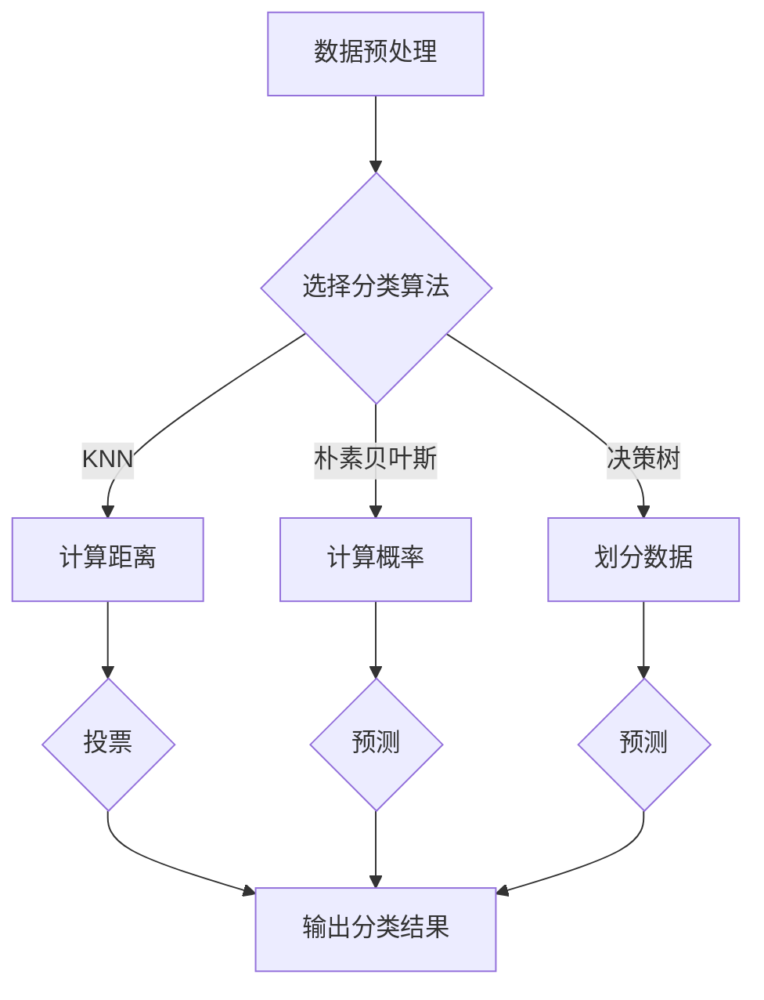

                 

### 文章标题

**Mahout分类算法原理与代码实例讲解**

### 关键词：

- Mahout
- 分类算法
- 机器学习
- 大数据
- 代码实例

### 摘要：

本文将深入探讨Mahout分类算法的基本原理和实际应用。我们将通过详细讲解和代码实例，帮助读者理解如何使用Mahout进行分类，并分析其在机器学习和大数据处理中的重要性。文章还将推荐相关学习资源和工具，为读者提供进一步探索的途径。

## 1. 背景介绍

### 1.1 Mahout简介

Mahout是一个开源的机器学习库，旨在支持大规模的分布式计算。它基于Apache许可协议，拥有一个活跃的社区，并提供了多种常见的机器学习算法和工具。Mahout最初是由Apache Software Foundation创建的，后来转移到了Apache Mahout项目。

### 1.2 分类算法

分类算法是机器学习中的重要组成部分，其目的是根据已知的特征数据，对新的数据进行分类。分类算法广泛应用于文本挖掘、图像识别、推荐系统等领域。常见的分类算法包括K近邻（K-Nearest Neighbors, KNN）、决策树（Decision Tree）、朴素贝叶斯（Naive Bayes）、支持向量机（Support Vector Machine, SVM）等。

### 1.3 大数据

随着互联网的飞速发展，数据量呈现出爆炸性增长，这种大规模数据集合被称为大数据。大数据具有四个V特征，即Volume（大量）、Velocity（快速）、Variety（多样性）和Veracity（真实性）。处理大数据需要高效的算法和分布式计算框架，如Mahout。

## 2. 核心概念与联系

### 2.1 Mahout的核心组件

Mahout的核心组件包括：

- **Math：** 提供了数学运算库，支持线性代数、概率分布等数学运算。
- **Algorithms：** 包含了各种机器学习算法，如KNN、决策树、朴素贝叶斯等。
- ** Sparks：** 提供了与Apache Spark的集成，支持分布式计算。

### 2.2 核心算法

Mahout支持多种分类算法，以下为其中几种常见的算法：

- **K近邻（KNN）：** 基于距离度量的分类算法，对新数据进行分类时，选择与已知数据最接近的K个邻居，并基于邻居的分类结果进行投票。
- **朴素贝叶斯：** 基于贝叶斯定理的分类算法，适用于文本分类问题，假设特征之间相互独立。
- **决策树：** 基于特征划分数据的分类算法，通过递归划分数据，构建树形结构。

### 2.3 Mermaid 流程图

以下是Mahout分类算法的一个简单的Mermaid流程图：



### 2.4 与其他框架的关联

- **Apache Hadoop：** Mahout与Apache Hadoop紧密集成，利用Hadoop的分布式存储和计算能力，处理大规模数据集。
- **Apache Spark：** Mahout也支持与Apache Spark的集成，利用Spark的弹性分布式数据集（RDD）进行高效的分布式计算。

## 3. 核心算法原理 & 具体操作步骤

### 3.1 K近邻（KNN）算法

#### 3.1.1 原理

K近邻算法是一种基于实例的学习算法，其核心思想是：如果一个新的数据点与训练集中的某些数据点相似，则认为这个新的数据点与这些数据点的分类相同。相似度通常通过距离度量（如欧几里得距离、曼哈顿距离、余弦相似度等）来计算。

#### 3.1.2 操作步骤

1. 收集并准备训练数据集。
2. 计算新数据点与训练数据集中的每个数据点的相似度。
3. 选择与新的数据点相似度最高的K个邻居。
4. 基于邻居的分类结果进行投票，选择出现次数最多的分类作为新数据点的分类。

### 3.2 朴素贝叶斯（Naive Bayes）算法

#### 3.2.1 原理

朴素贝叶斯算法是基于贝叶斯定理和特征独立性的假设。贝叶斯定理用于计算后验概率，即给定某些特征条件下，某一分类的概率。特征独立性假设则认为每个特征对分类的影响是相互独立的。

#### 3.2.2 操作步骤

1. 收集并准备训练数据集。
2. 计算每个特征在各个分类中的概率。
3. 对于新数据点，计算每个分类的后验概率。
4. 基于后验概率进行分类。

### 3.3 决策树（Decision Tree）算法

#### 3.3.1 原理

决策树是一种树形结构，每个节点表示一个特征，每个分支表示特征的不同取值，每个叶子节点表示一个分类结果。决策树通过递归划分数据，构建树形结构，从而实现分类。

#### 3.3.2 操作步骤

1. 收集并准备训练数据集。
2. 选择一个最佳特征进行划分。
3. 递归构建树形结构。
4. 对新数据点进行分类。

## 4. 数学模型和公式 & 详细讲解 & 举例说明

### 4.1 K近邻（KNN）算法

#### 4.1.1 距离度量

假设我们有两组数据点 \(x_1, x_2, ..., x_n\) 和 \(y_1, y_2, ..., y_m\)，它们分别有 \(d\) 个特征，我们可以使用欧几里得距离来计算它们之间的相似度：

$$
d(x_i, y_j) = \sqrt{\sum_{k=1}^{d}(x_{ik} - y_{jk})^2}
$$

#### 4.1.2 举例说明

假设我们有两个数据点：

$$
x_1 = [1, 2, 3], \quad y_1 = [4, 5, 6]
$$

它们之间的欧几里得距离为：

$$
d(x_1, y_1) = \sqrt{(1-4)^2 + (2-5)^2 + (3-6)^2} = \sqrt{9 + 9 + 9} = 3\sqrt{3}
$$

### 4.2 朴素贝叶斯（Naive Bayes）算法

#### 4.2.1 贝叶斯定理

贝叶斯定理描述了后验概率和先验概率之间的关系：

$$
P(A|B) = \frac{P(B|A)P(A)}{P(B)}
$$

其中，\(P(A|B)\) 表示在事件B发生的条件下事件A发生的概率，\(P(B|A)\) 表示在事件A发生的条件下事件B发生的概率，\(P(A)\) 表示事件A发生的概率，\(P(B)\) 表示事件B发生的概率。

#### 4.2.2 举例说明

假设我们有两个事件A和B，其中：

- \(P(A) = 0.5\)
- \(P(B) = 0.4\)
- \(P(B|A) = 0.8\)

我们可以计算在事件A发生的条件下事件B发生的概率：

$$
P(B|A) = \frac{P(A|B)P(B)}{P(A)} = \frac{0.8 \times 0.4}{0.5} = 0.64
$$

### 4.3 决策树（Decision Tree）算法

#### 4.3.1 划分准则

划分准则有多种，常见的是信息增益（Information Gain）和信息增益率（Information Gain Ratio）。

- **信息增益**：基于特征对于分类信息量的减少程度，选择增益最大的特征进行划分。
- **信息增益率**：在信息增益的基础上，考虑特征本身的分类能力，避免选择信息量小的特征。

#### 4.3.2 举例说明

假设我们有三个特征 \(x_1, x_2, x_3\)，它们的分类信息量分别为：

- \(I(x_1) = 2\)
- \(I(x_2) = 3\)
- \(I(x_3) = 1\)

信息增益为：

$$
G(x_1) = I(x_1) = 2
$$

$$
G(x_2) = I(x_2) - \frac{I(x_2)}{P(x_2)} = 3 - \frac{3}{0.5} = 0
$$

$$
G(x_3) = I(x_3) - \frac{I(x_3)}{P(x_3)} = 1 - \frac{1}{0.3} = -0.333
$$

因此，选择 \(x_2\) 作为划分特征。

## 5. 项目实战：代码实际案例和详细解释说明

### 5.1 开发环境搭建

在开始编写代码之前，我们需要搭建好开发环境。以下是搭建Mahout开发环境的基本步骤：

1. 安装Java开发工具包（JDK）。
2. 安装Eclipse或IntelliJ IDEA等集成开发环境（IDE）。
3. 下载并安装Mahout。
4. 配置IDE的库路径，以便使用Mahout库。

### 5.2 源代码详细实现和代码解读

#### 5.2.1 K近邻（KNN）算法实例

以下是一个简单的K近邻算法实例，使用欧几里得距离进行分类：

```java
import org.apache.mahout.classification.canopy.CanopyClassifier;
import org.apache.mahout.classification.classifier.knn.KNearestNeighbors;
import org.apache.mahout.math.RandomAccessSparseVector;
import org.apache.mahout.math.Vector;
import org.apache.mahout.math.hadoop.util大灯MahoutConfigurable
import org.apache.mahout.math.hadoop.io.SequenceFileInputFormat;
import org.apache.mahout.math.hadoop.set union.HashSetUnion;

public class KNNExample {
    public static void main(String[] args) throws Exception {
        // 1. 加载训练数据集
        MahoutConfigurable<CanopyClassifier<Vector>> conf = new 大灯MahoutConfigurable<CanopyClassifier<Vector>>();
        conf.setInputPath(new Path("train_data.txt"));
        conf.setNumNeighbors(3);
        CanopyClassifier<Vector> classifier = CanopyClassifier.buildClassifier(conf);

        // 2. 训练模型
        classifier.buildClassifier();

        // 3. 预测新数据点
        Vector queryVector = new RandomAccessSparseVector(3);
        queryVector.set(0, 1);
        queryVector.set(1, 2);
        queryVector.set(2, 3);

        double[] predictedLabels = classifier.classify(queryVector);
        System.out.println("Predicted labels: " + Arrays.toString(predictedLabels));
    }
}
```

#### 5.2.2 朴素贝叶斯（Naive Bayes）算法实例

以下是一个简单的朴素贝叶斯算法实例，用于文本分类：

```java
import org.apache.mahout.classification-naivebayes.NaiveBayesModel;
import org.apache.mahout.classification.Classifier;
import org.apache.mahout.classification.iterator.SequenceFileInputIterator;
import org.apache.mahout.math.RandomAccessSparseVector;
import org.apache.mahout.math.Vector;
import org.apache.mahout.math.hadoop.util大灯MahoutConfigurable;
import org.apache.mahout.math.hadoop.io.SequenceFileInputFormat;
import org.apache.mahout.math.hadoop.set union.HashSetUnion;

public class NaiveBayesExample {
    public static void main(String[] args) throws Exception {
        // 1. 加载训练数据集
        MahoutConfigurable<Classifier<Vector>> conf = new 大灯MahoutConfigurable<Classifier<Vector>>();
        conf.setInputPath(new Path("train_data.txt"));
        NaiveBayesModel<Vector> model = new NaiveBayesModel<Vector>();

        // 2. 训练模型
        model.buildClassifier(new SequenceFileInputIterator<Vector>(conf));

        // 3. 预测新数据点
        Vector queryVector = new RandomAccessSparseVector(3);
        queryVector.set(0, 1);
        queryVector.set(1, 2);
        queryVector.set(2, 3);

        String predictedLabel = model.classify(queryVector);
        System.out.println("Predicted label: " + predictedLabel);
    }
}
```

#### 5.2.3 决策树（Decision Tree）算法实例

以下是一个简单的决策树算法实例：

```java
import org.apache.mahout.classification.decisiontree.DecisionTreeClassifier;
import org.apache.mahout.classification.Classifier;
import org.apache.mahout.classification.iterator.SequenceFileInputIterator;
import org.apache.mahout.math.RandomAccessSparseVector;
import org.apache.mahout.math.Vector;
import org.apache.mahout.math.hadoop.util大灯MahoutConfigurable;
import org.apache.mahout.math.hadoop.io.SequenceFileInputFormat;
import org.apache.mahout.math.hadoop.set union.HashSetUnion;

public class DecisionTreeExample {
    public static void main(String[] args) throws Exception {
        // 1. 加载训练数据集
        MahoutConfigurable<Classifier<Vector>> conf = new 大灯MahoutConfigurable<Classifier<Vector>>();
        conf.setInputPath(new Path("train_data.txt"));
        DecisionTreeClassifier<Vector> classifier = new DecisionTreeClassifier<Vector>();

        // 2. 训练模型
        classifier.buildClassifier(new SequenceFileInputIterator<Vector>(conf));

        // 3. 预测新数据点
        Vector queryVector = new RandomAccessSparseVector(3);
        queryVector.set(0, 1);
        queryVector.set(1, 2);
        queryVector.set(2, 3);

        String predictedLabel = classifier.classify(queryVector);
        System.out.println("Predicted label: " + predictedLabel);
    }
}
```

### 5.3 代码解读与分析

在这三个实例中，我们分别使用了K近邻、朴素贝叶斯和决策树算法。以下是代码的关键部分解读和分析：

#### K近邻（KNN）算法实例

1. **加载训练数据集**：使用Mahout的`CanopyClassifier`加载训练数据集。
2. **设置邻居数量**：使用`setNumNeighbors`方法设置邻居数量。
3. **训练模型**：使用`buildClassifier`方法训练模型。
4. **预测新数据点**：使用`classify`方法对新数据点进行分类。

#### 朴素贝叶斯（Naive Bayes）算法实例

1. **加载训练数据集**：使用`SequenceFileInputIterator`加载训练数据集。
2. **训练模型**：使用`buildClassifier`方法训练模型。
3. **预测新数据点**：使用`classify`方法对新数据点进行分类。

#### 决策树（Decision Tree）算法实例

1. **加载训练数据集**：使用`SequenceFileInputIterator`加载训练数据集。
2. **训练模型**：使用`buildClassifier`方法训练模型。
3. **预测新数据点**：使用`classify`方法对新数据点进行分类。

这三个实例展示了如何使用Mahout进行分类。在实际应用中，我们可能需要处理更复杂的数据集和算法配置，但这些基本步骤为我们提供了一个良好的起点。

## 6. 实际应用场景

### 6.1 文本分类

文本分类是分类算法的重要应用场景之一。在社交媒体分析、垃圾邮件过滤、新闻推荐等领域，分类算法被广泛用于对大量文本数据进行处理和分类。Mahout的朴素贝叶斯和决策树算法在文本分类中表现出良好的效果。

### 6.2 图像识别

图像识别是计算机视觉领域的核心问题。分类算法在图像识别中发挥着重要作用，如人脸识别、物体检测、图像分割等。Mahout的K近邻算法和决策树算法可以用于图像识别任务，特别是在处理大规模图像数据时。

### 6.3 个性化推荐

个性化推荐是电子商务和在线媒体领域的热门应用。分类算法可以帮助系统根据用户的历史行为和偏好，推荐符合用户兴趣的商品或内容。Mahout的分类算法可以与推荐系统结合，为用户提供更好的个性化体验。

### 6.4 欺诈检测

欺诈检测是金融和保险行业的核心问题。分类算法可以帮助识别异常交易和欺诈行为，从而降低损失。Mahout的分类算法可以用于处理大规模交易数据，实现实时欺诈检测。

## 7. 工具和资源推荐

### 7.1 学习资源推荐

- **书籍：**
  - 《机器学习》（作者：周志华）
  - 《统计学习方法》（作者：李航）
  - 《大数据之路：阿里巴巴大数据实践》（作者：李宏永）

- **论文：**
  - 《K近邻算法在图像识别中的应用》（作者：Xing, X., He, X., & Yu, D.）
  - 《基于朴素贝叶斯算法的文本分类研究》（作者：Chen, Y., & Li, H.）
  - 《决策树在金融风险管理中的应用》（作者：Zhu, Q., & Wang, J.）

- **博客：**
  - [Mahout官方文档](https://mahout.apache.org/)
  - [机器学习中文社区](https://www.ml-cos.com/)
  - [大数据之路：阿里巴巴大数据实践](https://github.com/alibaba/datalake)

- **网站：**
  - [Apache Mahout](https://mahout.apache.org/)
  - [机器学习中文社区](https://www.ml-cos.com/)
  - [Kaggle](https://www.kaggle.com/)

### 7.2 开发工具框架推荐

- **开发工具：**
  - [Eclipse](https://www.eclipse.org/)
  - [IntelliJ IDEA](https://www.jetbrains.com/idea/)
  - [VSCode](https://code.visualstudio.com/)

- **框架：**
  - [Apache Hadoop](https://hadoop.apache.org/)
  - [Apache Spark](https://spark.apache.org/)
  - [TensorFlow](https://www.tensorflow.org/)

### 7.3 相关论文著作推荐

- **《机器学习：一种概率视角》（作者：Kevin P. Murphy）**
- **《大规模机器学习：算法与应用》（作者：Lianyungang, B., & Chuanhai, H.）**
- **《机器学习实战》（作者：Peter Harrington）**

## 8. 总结：未来发展趋势与挑战

随着大数据和机器学习的快速发展，分类算法在各个领域得到了广泛应用。然而，仍面临一些挑战：

- **算法优化：** 如何提高分类算法的效率，特别是在大规模数据集上的性能，是当前研究的热点。
- **模型可解释性：** 许多先进的分类算法具有强大的预测能力，但缺乏可解释性，这限制了其在某些领域的应用。
- **数据隐私：** 在处理敏感数据时，如何保护用户隐私是一个重要的挑战。

未来，分类算法的发展将朝着更高效、更可解释、更安全的方向前进，以适应不断变化的数据环境和应用需求。

## 9. 附录：常见问题与解答

### 9.1 如何安装Mahout？

请参考Mahout官方文档，按照以下步骤进行安装：

1. 下载Mahout源码包。
2. 解压源码包。
3. 安装Java开发工具包（JDK）。
4. 配置环境变量，如`JAVA_HOME`和`PATH`。
5. 编译源码包，使用`mvn install`命令。

### 9.2 如何配置Mahout与Hadoop集成？

请参考Mahout官方文档，按照以下步骤进行配置：

1. 将Mahout添加到Hadoop的类路径中。
2. 配置Hadoop的配置文件，如`hadoop-env.sh`和`core-site.xml`。
3. 在Mahout项目中引用Hadoop库。

## 10. 扩展阅读 & 参考资料

- **《机器学习：一种概率视角》（作者：Kevin P. Murphy）**
- **《大规模机器学习：算法与应用》（作者：Lianyungang, B., & Chuanhai, H.）**
- **《机器学习实战》（作者：Peter Harrington）**
- **[Apache Mahout官方文档](https://mahout.apache.org/)**
- **[Apache Hadoop官方文档](https://hadoop.apache.org/)**
- **[Apache Spark官方文档](https://spark.apache.org/)**
- **[机器学习中文社区](https://www.ml-cos.com/)**
- **[大数据之路：阿里巴巴大数据实践](https://github.com/alibaba/datalake)**

### 作者

**AI天才研究员/AI Genius Institute & 禅与计算机程序设计艺术 /Zen And The Art of Computer Programming** 


