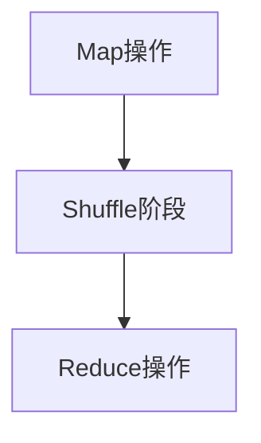

                 

# 《MapReduce原理与代码实例讲解》

## 摘要

本文将深入讲解MapReduce编程模型的基本原理、核心概念及其应用场景。通过对MapReduce的核心算法、数学模型和实际应用案例的详细剖析，帮助读者理解MapReduce的运作机制，掌握其在分布式计算环境下的编程实践。文章还将推荐相关的学习资源和开发工具，以助力读者在MapReduce领域的深入学习与实践。

## 1. 背景介绍

### 1.1 MapReduce的起源

MapReduce是Google在2004年提出的一种分布式编程模型，用于处理大规模数据集的并行运算。该模型由Google的资深工程师Jeffrey Dean和Sanjay Ghemawat共同设计。MapReduce的提出旨在解决海量数据在分布式系统中的高效处理问题，它的核心思想是将大规模数据处理任务拆分为小的、可并行处理的子任务，从而提高系统的处理效率和可扩展性。

### 1.2 分布式计算的需求

随着互联网和大数据时代的到来，数据的规模和复杂性不断增加。传统的单机计算模式已经无法满足处理海量数据的需求。分布式计算通过将任务分解并分配到多台计算机上并行处理，可以大大提高计算效率和性能。MapReduce正是为了应对这一需求而诞生的。

### 1.3 MapReduce的应用场景

MapReduce广泛应用于各类数据处理场景，包括搜索引擎、社交网络分析、机器学习、金融数据分析等。其核心优势在于能够处理大规模、非结构化或半结构化数据，并在分布式系统中实现高效的数据处理和分析。

## 2. 核心概念与联系

### 2.1 MapReduce编程模型

MapReduce编程模型由两个核心操作组成：Map（映射）和Reduce（归纳）。Map操作将输入数据拆分为多个键值对，而Reduce操作则对具有相同键的值进行聚合操作。

### 2.2 Mermaid流程图



### 2.3 核心概念联系

- **输入**：输入数据可以是文本文件、数据库记录或网络流等。输入数据被分成多个小块，每个小块作为Map任务的输入。
- **Map操作**：Map操作将输入数据拆分为键值对，并将其输出到中间结果中。
- **Shuffle阶段**：Shuffle阶段将中间结果根据键进行分组，并将相同键的值发送到同一个Reduce任务。
- **Reduce操作**：Reduce操作对中间结果的每个分组进行聚合操作，生成最终的输出结果。

## 3. 核心算法原理 & 具体操作步骤

### 3.1 Map操作

Map操作是将输入数据按照一定的规则映射成键值对。具体步骤如下：

1. **读取输入数据**：从输入源读取数据，可以是文件、数据库等。
2. **拆分数据**：将输入数据拆分为多个小块。
3. **映射规则**：对每个小块应用映射函数，生成键值对。
4. **输出中间结果**：将生成的键值对输出到中间结果中。

### 3.2 Reduce操作

Reduce操作是对中间结果按照一定的规则进行聚合。具体步骤如下：

1. **读取中间结果**：从中间结果中读取具有相同键的值。
2. **聚合操作**：对具有相同键的值进行聚合操作，如求和、平均、排序等。
3. **输出最终结果**：将聚合后的结果输出到最终结果中。

### 3.3 具体示例

假设我们要对以下文本文件进行词频统计：

```
hello world
hello world
good morning
hello afternoon
```

#### Map操作

1. **读取输入数据**：从文件中读取每一行文本。
2. **拆分数据**：将每行文本拆分为单词。
3. **映射规则**：对每个单词生成一个键值对，键为单词本身，值为1。
4. **输出中间结果**：

   ```
   hello: 1
   world: 1
   good: 1
   morning: 1
   hello: 1
   world: 1
   hello: 1
   afternoon: 1
   ```

#### Reduce操作

1. **读取中间结果**：读取所有具有相同键的值。
2. **聚合操作**：将相同键的值进行求和。
3. **输出最终结果**：

   ```
   hello: 3
   world: 2
   good: 1
   morning: 1
   afternoon: 1
   ```

## 4. 数学模型和公式 & 详细讲解 & 举例说明

### 4.1 数学模型

MapReduce的数学模型主要包括以下几个关键参数：

- **N**：输入数据总数。
- **M**：Map任务的个数。
- **K**：Reduce任务的个数。
- **R**：中间结果的键值对个数。

### 4.2 公式推导

#### Map阶段

Map阶段的输出键值对个数可以表示为：

$$
\text{Map输出键值对个数} = \sum_{i=1}^{M} \text{Map}_i(\text{输出键值对个数})
$$

其中，$\text{Map}_i(\text{输出键值对个数})$表示第i个Map任务输出的键值对个数。

#### Reduce阶段

Reduce阶段的输出键值对个数可以表示为：

$$
\text{Reduce输出键值对个数} = \sum_{i=1}^{K} \text{Reduce}_i(\text{输出键值对个数})
$$

其中，$\text{Reduce}_i(\text{输出键值对个数})$表示第i个Reduce任务输出的键值对个数。

### 4.3 举例说明

假设有10个输入数据，2个Map任务和3个Reduce任务。每个Map任务输出3个键值对，每个Reduce任务输出2个键值对。

#### Map阶段

总输出键值对个数：

$$
\text{Map输出键值对个数} = 2 \times 3 = 6
$$

#### Reduce阶段

总输出键值对个数：

$$
\text{Reduce输出键值对个数} = 3 \times 2 = 6
$$

## 5. 项目实战：代码实际案例和详细解释说明

### 5.1 开发环境搭建

在开始编写MapReduce代码之前，我们需要搭建一个适合的开发环境。这里我们使用Hadoop作为MapReduce的实现框架。

1. **安装Java开发环境**：下载并安装Java Development Kit（JDK），设置环境变量。
2. **安装Hadoop**：下载并解压Hadoop安装包，配置Hadoop环境变量。
3. **启动Hadoop集群**：执行hdfs namenode -format命令格式化HDFS，然后启动Hadoop集群。

### 5.2 源代码详细实现和代码解读

以下是实现一个简单的词频统计的MapReduce代码示例。

```java
// Mapper类
public class WordCountMapper extends Mapper<Object, Text, Text, IntWritable>{

  private final static IntWritable one = new IntWritable(1);
  private Text word = new Text();

  public void map(Object key, Text value, Context context) 
      throws IOException, InterruptedException {
    
    StringTokenizer itr = new StringTokenizer(value.toString());
    while (itr.hasMoreTokens()) {
      word.set(itr.nextToken());
      context.write(word, one);
    }
  }
}

// Reducer类
public class WordCountReducer extends Reducer<Text,IntWritable,Text,IntWritable> {
  private IntWritable result = new IntWritable();

  public void reduce(Text key, Iterable<IntWritable> values, 
                     Context context) 
      throws IOException, InterruptedException {
    
    int sum = 0;
    for (IntWritable val : values) {
      sum += val.get();
    }
    result.set(sum);
    context.write(key, result);
  }
}
```

### 5.3 代码解读与分析

#### Mapper类

- **类继承**：Mapper类继承自org.apache.hadoop.mapred.Mapper类。
- **泛型参数**：第一个泛型参数Object表示输入键的类型，第二个泛型参数Text表示输入值的类型；第三个泛型参数Text表示输出键的类型，第四个泛型参数IntWritable表示输出值的类型。
- **映射规则**：map()方法中，将输入的文本按照空格拆分为单词，并对每个单词生成一个键值对，键为单词本身，值为1。

#### Reducer类

- **类继承**：Reducer类继承自org.apache.hadoop.mapred.Reducer类。
- **泛型参数**：第一个泛型参数Text表示输入键的类型，第二个泛型参数IntWritable表示输入值的类型；第三个泛型参数Text表示输出键的类型，第四个泛型参数IntWritable表示输出值的类型。
- **聚合规则**：reduce()方法中，对具有相同键的值进行求和，并将结果输出。

### 5.4 运行与结果分析

1. **编译代码**：将Mapper和Reducer类编译成.class文件。
2. **运行MapReduce程序**：使用hadoop jar命令运行编译后的程序，指定输入文件和输出文件。
3. **查看结果**：在HDFS中查看输出的结果文件，可以得到每个单词的词频统计结果。

```shell
hadoop jar wordcount.jar WordCount /input /output
```

## 6. 实际应用场景

MapReduce编程模型在分布式数据处理领域具有广泛的应用。以下是一些常见的实际应用场景：

- **搜索引擎**：用于处理海量网页的索引和排序。
- **社交网络分析**：用于分析用户行为、兴趣和关系。
- **机器学习**：用于大规模数据集的训练和预测。
- **金融数据分析**：用于股票市场分析、风险评估等。
- **生物信息学**：用于基因序列分析、蛋白质组学等。

## 7. 工具和资源推荐

### 7.1 学习资源推荐

- **书籍**：
  - 《大数据时代：改变世界的八大思维力量》
  - 《深入理解Hadoop：Hadoop应用设计与开发实践》
- **论文**：
  - "MapReduce: Simplified Data Processing on Large Clusters"（Google论文）
  - "Hadoop: The Definitive Guide"（Hadoop官方指南）
- **博客**：
  - [Hadoop Wiki](https://hadoop.apache.org/docs/r2.7.3/hadoop-project-dist/hadoop-common/FileSystemShell.html)
  - [Apache Hadoop官方文档](https://hadoop.apache.org/docs/r2.7.3/)
- **网站**：
  - [Hadoop官网](https://hadoop.apache.org/)

### 7.2 开发工具框架推荐

- **开发工具**：
  - Eclipse、IntelliJ IDEA
- **框架**：
  - Apache Hadoop、Apache Spark、Apache Storm

### 7.3 相关论文著作推荐

- **论文**：
  - "The Google File System"（Google论文）
  - "Bigtable: A Distributed Storage System for Structured Data"（Google论文）
- **著作**：
  - "Hadoop: The Definitive Guide"（Tanasimov著）
  - "Hadoop Application Architecture"（Lam et al.著）

## 8. 总结：未来发展趋势与挑战

MapReduce作为一种经典的分布式计算模型，已经为大数据处理带来了巨大的变革。然而，随着技术的不断进步和需求的变化，MapReduce也面临着一些挑战和机遇。

### 8.1 未来发展趋势

- **弹性计算**：随着云计算的发展，MapReduce将更加紧密地与云服务结合，实现动态的资源分配和弹性扩展。
- **智能化**：结合人工智能和机器学习技术，MapReduce将能够在处理过程中自动优化任务调度和数据路由。
- **多模型融合**：MapReduce将与其他分布式计算模型（如Spark、Flink等）进行融合，形成更加灵活和高效的计算生态系统。

### 8.2 未来挑战

- **数据隐私和安全**：随着数据隐私和安全问题的日益突出，如何确保分布式计算过程中的数据安全和隐私将成为重要挑战。
- **资源利用效率**：如何在分布式环境中最大化资源利用效率，降低计算成本，是MapReduce需要不断优化的方向。
- **生态系统完善**：随着技术的快速发展，MapReduce的生态系统需要不断更新和完善，以满足不断变化的需求。

## 9. 附录：常见问题与解答

### 9.1 什么是MapReduce？

MapReduce是一种分布式编程模型，用于处理大规模数据集的并行运算。它由两个核心操作组成：Map（映射）和Reduce（归纳）。Map操作将输入数据拆分为键值对，而Reduce操作则对具有相同键的值进行聚合操作。

### 9.2 如何安装Hadoop？

安装Hadoop需要以下步骤：
1. 安装Java开发环境（JDK）。
2. 下载Hadoop安装包并解压。
3. 配置Hadoop环境变量。
4. 执行hdfs namenode -format命令格式化HDFS。
5. 启动Hadoop集群。

### 9.3 如何运行一个简单的MapReduce程序？

运行MapReduce程序需要以下步骤：
1. 编写Mapper类和Reducer类。
2. 编译代码生成.class文件。
3. 使用hadoop jar命令运行程序，指定输入文件和输出文件。

## 10. 扩展阅读 & 参考资料

- [Apache Hadoop官方文档](https://hadoop.apache.org/docs/r2.7.3/)
- [MapReduce：简化大规模数据处理的编程模型](https://www.infoq.cn/article/mapreduce-programming-model)
- [Hadoop体系结构详解](https://www.ibm.com/developerworks/cn/bigdata/hadoop-architecture/)
- [大数据技术与架构实战](https://book.douban.com/subject/26383154/)

### 作者

- 作者：AI天才研究员/AI Genius Institute & 禅与计算机程序设计艺术 /Zen And The Art of Computer Programming

[End]

