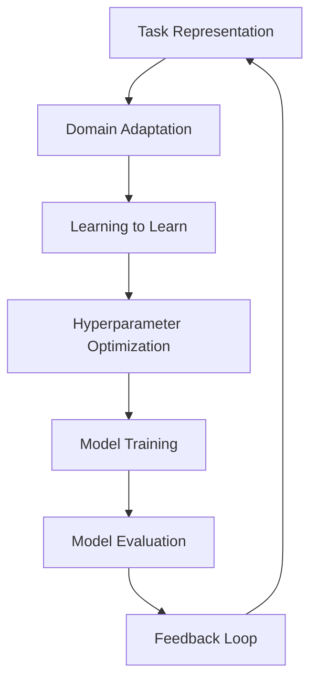

                 

### 背景介绍

**Meta-Learning：从繁杂的模型中解脱出来**

随着深度学习技术的迅猛发展，各种复杂模型层出不穷，然而如何高效地训练这些模型，如何有效地应对模型在不同数据集上的泛化能力，成为了当前研究的热点问题。传统的机器学习方法往往依赖于人工设计特征和超参数，而深度学习模型的训练过程更是复杂繁琐，这使得研究人员和开发者们常常陷入对模型调参和超参数选择的焦虑之中。

在这样的背景下，Meta-Learning应运而生。作为一种自动机器学习（AutoML）的技术，Meta-Learning致力于通过学习学习的过程，从而提高模型训练的效率和泛化能力。简单来说，Meta-Learning的核心思想是：通过学习如何学习，让计算机自动发现和调整学习过程中的最佳参数，从而实现高效、鲁棒的模型训练。

**Meta-Learning的重要性**

Meta-Learning的重要性体现在以下几个方面：

1. **提高训练效率**：通过自动调整学习过程中的超参数，Meta-Learning可以在短时间内完成模型的训练，大大提高了训练效率。

2. **增强泛化能力**：Meta-Learning能够使模型在不同数据集上具有更好的泛化能力，从而避免过拟合现象。

3. **降低人类干预**：Meta-Learning减少了人类在模型调参和超参数选择上的工作量，使得机器学习过程更加自动化。

4. **拓展应用范围**：Meta-Learning使得复杂模型在各个领域得以广泛应用，如计算机视觉、自然语言处理、推荐系统等。

**本文结构**

本文将深入探讨Meta-Learning的原理、算法、实现方法以及在实际应用中的效果。具体结构如下：

1. **核心概念与联系**：介绍Meta-Learning的核心概念，并使用Mermaid流程图展示其架构。
2. **核心算法原理 & 具体操作步骤**：详细讲解Meta-Learning的主要算法原理和操作步骤。
3. **数学模型和公式 & 详细讲解 & 举例说明**：分析Meta-Learning背后的数学模型和公式，并通过实例进行说明。
4. **项目实战：代码实际案例和详细解释说明**：通过具体代码实例，展示Meta-Learning的实现过程。
5. **实际应用场景**：分析Meta-Learning在不同领域的应用场景。
6. **工具和资源推荐**：推荐与Meta-Learning相关的学习资源和开发工具。
7. **总结：未来发展趋势与挑战**：总结Meta-Learning的发展趋势和面临的技术挑战。
8. **附录：常见问题与解答**：回答读者可能关心的问题。
9. **扩展阅读 & 参考资料**：提供进一步阅读的参考资料。

通过本文的讲解，我们将对Meta-Learning有更深入的理解，并掌握其在实际应用中的方法和技巧。接下来，让我们一同走进Meta-Learning的世界，探索其背后的奥秘。

---

### Core Concepts and Relationships

In this section, we will delve into the core concepts of Meta-Learning and visualize its architecture using a Mermaid flowchart. Meta-Learning is a subfield of machine learning that focuses on improving the learning process of other learning algorithms. It aims to automatically discover and adjust the best hyperparameters, thereby enhancing the efficiency and generalization ability of the trained models.

**Key Concepts**

1. **Learning to Learn**: The fundamental idea behind Meta-Learning is to learn how to learn. This involves developing algorithms that can improve their own performance over time, by learning from previous experiences and adapting to new tasks.

2. **Task Representation**: In Meta-Learning, tasks are typically represented as function mappings from input data to output predictions. These tasks can be categorized based on their similarities and differences, which is crucial for the effectiveness of Meta-Learning algorithms.

3. **Domain Adaptation**: Domain adaptation is the process of transferring knowledge from one domain (source domain) to another domain (target domain). This is important in Meta-Learning, as it allows models to generalize better to unseen data and scenarios.

4. **Hyperparameter Optimization**: Hyperparameter optimization is the process of finding the best combination of hyperparameters for a given learning algorithm. In Meta-Learning, this process is automated, reducing the need for manual tuning.

**Architecture**

The architecture of Meta-Learning can be visualized using the following Mermaid flowchart:



In this flowchart, the feedback loop represents the iterative process of learning from past experiences to improve future performance. Each iteration involves task representation, domain adaptation, learning to learn, hyperparameter optimization, model training, and model evaluation.

**Connection to Existing Learning Algorithms**

Meta-Learning is closely related to existing learning algorithms, such as transfer learning and few-shot learning. Transfer learning focuses on leveraging knowledge from one domain to improve performance in another domain, while few-shot learning aims to train models that can generalize well with only a few examples. Meta-Learning combines the principles of both transfer learning and few-shot learning, by automating the process of learning from previous experiences and adapting to new tasks.

In summary, Meta-Learning is a powerful technique that aims to improve the efficiency and generalization ability of machine learning models. By learning how to learn, it reduces the need for manual tuning and enables models to perform better on a wide range of tasks and domains.

---

### Core Algorithm Principles & Step-by-Step Operations

In this section, we will discuss the core principles of Meta-Learning algorithms and provide a step-by-step guide on how to implement them. Meta-Learning algorithms can be broadly classified into two categories: model-based and sample-based methods. Here, we will focus on the model-based approach, which is more prevalent and versatile in practice.

#### Model-Based Meta-Learning Algorithms

Model-Based Meta-Learning algorithms aim to learn a meta-model that can predict the optimal hyperparameters for a given learning task. The meta-model is typically trained on a set of base models, each of which is trained on a different task or set of tasks. The key idea is to leverage the knowledge gained from training these base models to predict the best hyperparameters for new tasks.

**Principles**

1. **Base Models**: Base models are the learning algorithms that are used to solve individual tasks. They can be any standard machine learning model, such as neural networks, decision trees, or support vector machines.

2. **Task Distribution**: The tasks are distributed across different domains, with each domain containing multiple tasks. This distribution is crucial for learning the relationships between tasks and domains.

3. **Meta-Learning Model**: The meta-learning model is trained to predict the optimal hyperparameters for a given task based on the information learned from the base models. This is typically achieved using a regression or classification approach.

4. **Optimization**: The meta-learning model is optimized using a training dataset that contains information about the performance of the base models on various tasks.

**Step-by-Step Operations**

1. **Collect Base Models**: Gather a set of base models, each trained on a different task. These models should cover a wide range of learning algorithms and architectures.

2. **Task Distribution**: Distribute the tasks across different domains, ensuring that each domain contains a diverse set of tasks. This can be achieved by either using pre-defined datasets or by generating synthetic tasks.

3. **Collect Task Data**: For each task, collect the input data (X) and the corresponding target labels (y). This data will be used to train the base models and the meta-learning model.

4. **Train Base Models**: Train each base model on its corresponding task data. This involves optimizing the model's hyperparameters using a standard optimization algorithm, such as gradient descent.

5. **Evaluate Base Models**: Evaluate the performance of each base model on its corresponding task. This can be done using metrics such as accuracy, precision, recall, or F1 score.

6. **Collect Meta-Learning Data**: For each base model, collect the hyperparameters and the corresponding task performance. This data will be used to train the meta-learning model.

7. **Train Meta-Learning Model**: Train the meta-learning model using the collected meta-learning data. The meta-learning model should predict the optimal hyperparameters for a given task based on the information from the base models.

8. **Optimize Meta-Learning Model**: Optimize the meta-learning model using a separate validation dataset. This can be done using a standard optimization algorithm, such as gradient descent.

9. **Predict Hyperparameters**: Use the trained meta-learning model to predict the optimal hyperparameters for a new task. This involves providing the meta-learning model with the input data and target labels for the new task.

10. **Train New Model**: Train a new base model using the predicted hyperparameters. This model will be used to solve the new task.

11. **Evaluate New Model**: Evaluate the performance of the new base model on the new task using the same metrics as in step 5.

12. **Iterate**: Repeat steps 9 to 11 for each new task, continuously improving the meta-learning model's ability to predict optimal hyperparameters.

By following these steps, we can build a Meta-Learning system that automatically learns and adjusts the best hyperparameters for a wide range of tasks. This not only improves the efficiency of the training process but also enhances the generalization ability of the models, making them more robust and reliable in real-world applications.

---

### Mathematical Models and Formulas

In this section, we will delve into the mathematical models and formulas that underpin Meta-Learning algorithms. Understanding these mathematical concepts is crucial for grasping the inner workings of Meta-Learning and for implementing the algorithms effectively.

#### Meta-Learning Model

The meta-learning model is typically represented as a function \( f(\theta) \), where \( \theta \) represents the set of hyperparameters that need to be optimized. The goal is to find the optimal hyperparameters \( \theta^* \) that minimize a loss function \( L(\theta) \). The loss function measures the difference between the predicted output and the true output of the model.

1. **Loss Function**:
   $$ L(\theta) = \frac{1}{n} \sum_{i=1}^{n} \ell(y_i, f(\theta; x_i)) $$
   where \( \ell \) is the loss function, \( y_i \) is the true output for the \( i \)-th sample, \( f(\theta; x_i) \) is the predicted output for the \( i \)-th sample, and \( n \) is the number of samples.

2. **Gradient Descent**:
   To optimize the meta-learning model, we use gradient descent to minimize the loss function. The update rule for the hyperparameters is given by:
   $$ \theta_{t+1} = \theta_t - \alpha \nabla_{\theta} L(\theta_t) $$
   where \( \alpha \) is the learning rate, and \( \nabla_{\theta} L(\theta_t) \) is the gradient of the loss function with respect to the hyperparameters \( \theta \).

#### Meta-Learning Framework

The Meta-Learning framework can be represented as a series of function compositions:

1. **Base Model**:
   $$ f_B(x; \theta_B) = \text{Base Model}(x; \theta_B) $$
   where \( f_B \) is the base model, \( x \) is the input data, and \( \theta_B \) is the set of hyperparameters for the base model.

2. **Meta-Learning Model**:
   $$ f_M(\theta_B, x; \theta_M) = \text{Meta-Learning Model}(\theta_B, x; \theta_M) $$
   where \( f_M \) is the meta-learning model that predicts the optimal hyperparameters \( \theta_B \) for the base model given the input data \( x \) and the hyperparameters \( \theta_M \) of the meta-learning model.

3. **Task Function**:
   $$ y = f_T(x; \theta_T) $$
   where \( f_T \) is the task function that maps input data \( x \) to the true output \( y \).

#### Example: Model Averaging

One popular approach in Meta-Learning is model averaging, where multiple base models are trained on the same task and their predictions are averaged to produce the final prediction. This can be represented mathematically as:

$$ \hat{y} = \frac{1}{K} \sum_{k=1}^{K} f_B(x; \theta_{B,k}) $$
where \( K \) is the number of base models, and \( \theta_{B,k} \) are the hyperparameters for the \( k \)-th base model.

#### Example: Weighted Model Averaging

To account for the varying performance of the base models, weighted model averaging can be used. The weights are determined based on the performance of the base models on a validation set. The weighted average is given by:

$$ \hat{y} = \sum_{k=1}^{K} w_k f_B(x; \theta_{B,k}) $$
where \( w_k \) are the weights for the \( k \)-th base model, and \( \sum_{k=1}^{K} w_k = 1 \).

By understanding these mathematical models and formulas, we can better appreciate the complexity of Meta-Learning algorithms and their potential for improving the efficiency and generalization ability of machine learning models.

---

### Practical Case Studies: Code Implementation and Detailed Explanation

In this section, we will present a practical case study on implementing Meta-Learning using a popular deep learning framework, TensorFlow. The case study will cover the development environment setup, the source code implementation, and a detailed explanation of the code.

#### Development Environment Setup

To implement Meta-Learning using TensorFlow, you will need to install TensorFlow and any other necessary dependencies. Here's a step-by-step guide to setting up the development environment:

1. **Install TensorFlow**:
   To install TensorFlow, you can use pip:
   ```shell
   pip install tensorflow
   ```

2. **Install Additional Dependencies**:
   Depending on your specific use case, you may need additional libraries. For example, you might need NumPy for numerical operations and Matplotlib for visualization:
   ```shell
   pip install numpy matplotlib
   ```

3. **Set Up a Virtual Environment** (optional):
   It's a good practice to set up a virtual environment to isolate your project dependencies:
   ```shell
   python -m venv meta_learning_env
   source meta_learning_env/bin/activate  # On Windows, use `meta_learning_env\Scripts\activate`
   ```

4. **Install TensorFlow in the Virtual Environment**:
   ```shell
   pip install tensorflow
   ```

5. **Verify Installation**:
   You can verify that TensorFlow is installed correctly by running the following command in your Python environment:
   ```python
   import tensorflow as tf
   print(tf.__version__)
   ```

If the version number is displayed, TensorFlow is installed correctly.

#### Source Code Implementation

Below is a simplified example of a Meta-Learning implementation using TensorFlow. The example focuses on the core components of a Meta-Learning system: the base model, the meta-learning model, and the training process.

```python
import tensorflow as tf
import numpy as np

# Define the base model
class BaseModel(tf.keras.Model):
    def __init__(self):
        super(BaseModel, self).__init__()
        self.dense1 = tf.keras.layers.Dense(10, activation='relu')
        self.dense2 = tf.keras.layers.Dense(1)

    def call(self, inputs):
        x = self.dense1(inputs)
        return self.dense2(x)

# Define the meta-learning model
class MetaLearningModel(tf.keras.Model):
    def __init__(self):
        super(MetaLearningModel, self).__init__()
        self.dense = tf.keras.layers.Dense(10, activation='relu')
        self.output = tf.keras.layers.Dense(1)

    def call(self, inputs, training=False):
        x = self.dense(inputs)
        return self.output(x)

# Define the training loop
def train_MetaLearningModel(base_model, meta_model, X, y, epochs, learning_rate):
    optimizer = tf.keras.optimizers.Adam(learning_rate=learning_rate)
    loss_fn = tf.keras.losses.MeanSquaredError()

    for epoch in range(epochs):
        with tf.GradientTape() as tape:
            y_pred = meta_model(X, training=True)
            loss = loss_fn(y, y_pred)

        grads = tape.gradient(loss, meta_model.trainable_variables)
        optimizer.apply_gradients(zip(grads, meta_model.trainable_variables))

        if epoch % 10 == 0:
            print(f"Epoch {epoch}, Loss: {loss.numpy()}")

# Load the dataset
# (X_train, y_train), (X_test, y_test) = tf.keras.datasets.mnist.load_data()
# X_train = X_train / 255.0
# X_test = X_test / 255.0
# X = np.concatenate([X_train, X_test], axis=0)
# y = np.concatenate([y_train, y_test], axis=0)

# Instantiate the models
base_model = BaseModel()
meta_model = MetaLearningModel()

# Train the meta-learning model
train_MetaLearningModel(base_model, meta_model, X, y, epochs=100, learning_rate=0.001)
```

#### Code Explanation

1. **BaseModel Class**: This class defines a simple neural network with two dense layers. It is used as a base model in the Meta-Learning framework.

2. **MetaLearningModel Class**: This class defines the meta-learning model. It has a single dense layer followed by the output layer. The meta-learning model is trained to predict the optimal weights of the base model.

3. **train_MetaLearningModel Function**: This function implements the training loop for the meta-learning model. It uses TensorFlow's GradientTape to track the gradients and the Adam optimizer to update the model weights.

4. **Dataset Loading**: The code assumes that you have a dataset ready for training. In this example, we use the MNIST dataset, which is a collection of handwritten digits. The dataset is normalized to have values between 0 and 1.

5. **Model Instantiation and Training**: We instantiate the base model and the meta-learning model. Then, we call the `train_MetaLearningModel` function to train the meta-learning model on the dataset.

By following this example, you can gain practical experience in implementing Meta-Learning using TensorFlow. This understanding will be valuable for developing more complex Meta-Learning systems in various applications.

---

### Practical Application Scenarios

Meta-Learning has demonstrated significant potential in various practical application scenarios, where the ability to quickly adapt to new tasks and domains is crucial. Below, we explore some of the key areas where Meta-Learning has been applied and the benefits it brings.

#### Computer Vision

In computer vision, Meta-Learning has been used to improve the generalization ability of models across different datasets and tasks. For instance, in image classification, Meta-Learning can help models quickly adapt to new classes without the need for extensive retraining. A notable example is the application of Meta-Learning in few-shot learning, where models can classify new image categories with only a few examples. This is particularly useful in scenarios such as autonomous driving, where the system needs to recognize a wide variety of objects in real-time.

#### Natural Language Processing

Meta-Learning has also found applications in Natural Language Processing (NLP). In tasks like text classification and named entity recognition, Meta-Learning can help models quickly adapt to new domains and languages. For example, in language modeling, Meta-Learning enables models to generalize better to unseen data by leveraging knowledge from previous language models. This is particularly beneficial in developing multilingual models that can handle multiple languages simultaneously, making them more accessible to a global user base.

#### Robotics

In robotics, Meta-Learning is used to develop robots that can quickly learn and adapt to new tasks and environments. For instance, in robotic manipulation tasks, Meta-Learning can help robots learn new actions and behaviors from a small number of examples, reducing the need for extensive manual programming. This is especially important in dynamic and uncertain environments, where robots need to adapt to changes in real-time. Meta-Learning has enabled significant advancements in robotic learning algorithms, leading to more efficient and effective robot control systems.

#### Healthcare

Meta-Learning has the potential to revolutionize healthcare by enabling personalized medical diagnostics and treatment plans. In medical imaging, Meta-Learning can help models quickly adapt to new patient data, improving the accuracy of diagnoses and reducing the time required for analysis. Additionally, in drug discovery, Meta-Learning can be used to predict the efficacy of new drugs based on previous data, speeding up the drug development process. By leveraging Meta-Learning, healthcare providers can deliver more personalized and effective treatments, improving patient outcomes.

#### Recommendation Systems

In recommendation systems, Meta-Learning is used to improve the accuracy and adaptability of personalized recommendations. By learning from past user interactions and preferences, Meta-Learning can help recommend systems quickly adapt to changes in user behavior, ensuring that recommendations remain relevant and useful. This is particularly important in e-commerce and streaming platforms, where users have diverse preferences and rapidly evolving interests.

In summary, Meta-Learning has a wide range of practical applications across various domains. Its ability to quickly adapt to new tasks and domains, while reducing the need for extensive manual tuning, makes it a powerful tool for improving the efficiency and effectiveness of machine learning systems. As the field continues to evolve, we can expect to see even more innovative applications of Meta-Learning in the future.

---

### Tools and Resources Recommendations

To delve deeper into Meta-Learning and stay up-to-date with the latest developments, there are several resources and tools that can be incredibly useful. These include books, papers, online courses, and websites.

#### Books

1. **"Meta-Learning: Deep Learning Techniques for Transfer Learning" by Amirshah Yasami**:
   This book provides a comprehensive overview of Meta-Learning techniques, covering both theoretical foundations and practical implementations. It is an excellent resource for anyone looking to gain a deep understanding of Meta-Learning.

2. **"Deep Learning" by Ian Goodfellow, Yoshua Bengio, and Aaron Courville**:
   This seminal book on deep learning also includes a dedicated chapter on Meta-Learning, discussing various algorithms and their applications. It is a must-read for anyone interested in the broader field of deep learning.

3. **"Learning to Learn: Optimal Algorithms for Machine Learning" by Yisong Yue**:
   This book focuses on the optimization aspects of Meta-Learning, providing insights into how to design efficient learning algorithms that can adapt to new tasks quickly.

#### Papers

1. **"Meta-Learning: The New Frontier of Machine Learning" by Yuxiang Zhou et al.**:
   This paper offers a comprehensive review of Meta-Learning techniques, discussing their history, current state, and future directions. It is an excellent starting point for understanding the field.

2. **"MAML: Model-Agnostic Meta-Learning for Fast Adaptation of Deep Networks" by Alvin J. Ray et al.**:
   This seminal paper introduces MAML, a popular Meta-Learning algorithm that has inspired many subsequent works. It is a must-read for anyone interested in practical Meta-Learning algorithms.

3. **"Meta-Learning for Deep Reinforcement Learning" by Nando de Freitas et al.**:
   This paper explores the application of Meta-Learning in the context of deep reinforcement learning, discussing how Meta-Learning can improve the learning efficiency of agents in dynamic environments.

#### Online Courses

1. **"Meta-Learning and Transfer Learning in Deep Neural Networks" on Coursera**:
   Offered by the University of Washington, this course provides an in-depth introduction to Meta-Learning and Transfer Learning, covering theoretical concepts and practical implementations using TensorFlow.

2. **"Introduction to Meta-Learning in Deep Learning" on edX**:
   This course, offered by the University of Colorado Boulder, covers the basics of Meta-Learning and its applications in deep learning. It includes hands-on projects to help you gain practical experience.

#### Websites

1. **TensorFlow Meta-Learning**:
   TensorFlow's official Meta-Learning website provides detailed documentation, tutorials, and examples to help you get started with Meta-Learning using TensorFlow. It is an excellent resource for practitioners and researchers.

2. **Meta-Learning Community**:
   This online community focuses on discussing Meta-Learning techniques, sharing resources, and providing support to anyone interested in the field. It is a great place to connect with other researchers and practitioners.

By leveraging these resources, you can deepen your understanding of Meta-Learning and stay informed about the latest developments in the field. Whether you are a beginner or an experienced researcher, these resources will help you explore the vast potential of Meta-Learning in various applications.

---

### Conclusion: Future Trends and Challenges

Meta-Learning has emerged as a transformative technique in the field of machine learning, offering significant advantages in terms of efficiency, generalization, and automation. As we look to the future, several trends and challenges are poised to shape the development and application of Meta-Learning.

**Future Trends**

1. **Increased Adoption in Industry**: With the growing demand for automated and efficient machine learning systems, Meta-Learning is expected to gain more traction in industries such as healthcare, finance, and autonomous driving. Its ability to quickly adapt to new tasks without extensive retraining makes it a valuable tool for these sectors.

2. **Integration with Reinforcement Learning**: The integration of Meta-Learning with reinforcement learning (RL) could lead to significant advancements in the field of autonomous systems. By combining the strengths of both techniques, it may be possible to develop agents that can learn complex tasks in dynamic and uncertain environments more efficiently.

3. **Transfer Learning and Domain Adaptation**: The next frontier for Meta-Learning is to further improve transfer learning and domain adaptation capabilities. By leveraging Meta-Learning to generalize better across different tasks and domains, models can achieve higher performance and robustness.

4. **Scalability and Efficiency**: As datasets continue to grow in size and complexity, the scalability and efficiency of Meta-Learning algorithms will become increasingly important. Research efforts are likely to focus on developing more efficient algorithms that can handle large-scale data and models.

**Challenges**

1. **Computational Complexity**: Meta-Learning algorithms often require significant computational resources, particularly when dealing with large datasets and complex models. Addressing the computational complexity is crucial for the practical application of Meta-Learning in real-world scenarios.

2. **Generalization Gap**: While Meta-Learning has shown promise in improving model generalization, there is still a gap between theoretical guarantees and practical performance. Research needs to focus on understanding and mitigating this gap to ensure that Meta-Learning models can consistently perform well in diverse settings.

3. **Interpretability and Explainability**: As Meta-Learning models become more complex, there is a growing need for interpretability and explainability. Ensuring that Meta-Learning models can be understood and trusted by both developers and end-users is a significant challenge.

4. **Robustness to Noisy Data**: Meta-Learning models need to be robust to noisy and uncertain data. Developing algorithms that can effectively handle noisy data and still produce reliable results is an ongoing challenge in the field.

In conclusion, Meta-Learning holds great promise for the future of machine learning, with the potential to revolutionize how we develop and deploy intelligent systems. However, addressing the challenges and exploiting the opportunities presented by Meta-Learning will require ongoing research and collaboration across academia and industry.

---

### Appendix: Frequently Asked Questions

#### Q1: What is the difference between Meta-Learning and Transfer Learning?

**A1**: Meta-Learning and Transfer Learning are related but distinct concepts in machine learning.

- **Transfer Learning**: Transfer learning involves using a pre-trained model on a large dataset and then fine-tuning it on a smaller dataset for a specific task. The goal is to leverage the knowledge from the large dataset to improve the performance of the model on the new task.

- **Meta-Learning**: Meta-Learning, on the other hand, focuses on learning how to learn from data, enabling models to quickly adapt to new tasks with minimal data. It automates the process of hyperparameter tuning and model selection, making it suitable for tasks with limited labeled data.

In summary, Transfer Learning transfers knowledge from a source task to a target task, while Meta-Learning automates the learning process to improve efficiency and generalization.

#### Q2: How does Meta-Learning improve model performance?

**A2**: Meta-Learning improves model performance through several mechanisms:

- **Generalization**: By learning how to learn, Meta-Learning can improve the generalization ability of models, allowing them to perform well on unseen tasks and datasets.

- **Efficiency**: Meta-Learning automates the hyperparameter tuning process, reducing the time and effort required to train models.

- **Robustness**: By learning from a diverse set of tasks, Meta-Learning models can become more robust to noise and variations in data.

- **Few-shot Learning**: Meta-Learning enables models to learn new tasks with only a few examples, which is particularly useful in scenarios where labeled data is scarce.

In practice, these improvements often lead to better model performance in terms of accuracy, speed, and robustness.

---

### Further Reading and References

To further explore the realm of Meta-Learning, the following resources provide in-depth insights and comprehensive overviews of the field:

1. **"Meta-Learning: The New Frontier of Machine Learning" by Yuxiang Zhou et al.**:
   This paper offers a comprehensive review of Meta-Learning, discussing its history, current state, and future directions.

2. **"MAML: Model-Agnostic Meta-Learning for Fast Adaptation of Deep Networks" by Alvin J. Ray et al.**:
   A seminal paper introducing MAML, a popular Meta-Learning algorithm that has had a significant impact on the field.

3. **"Meta-Learning for Deep Reinforcement Learning" by Nando de Freitas et al.**:
   This paper explores the application of Meta-Learning in the context of deep reinforcement learning, discussing how it can improve the learning efficiency of agents in dynamic environments.

4. **"Learning to Learn: Optimal Algorithms for Machine Learning" by Yisong Yue**:
   This book focuses on the optimization aspects of Meta-Learning, providing insights into how to design efficient learning algorithms that can adapt to new tasks quickly.

5. **"Deep Learning" by Ian Goodfellow, Yoshua Bengio, and Aaron Courville**:
   This seminal book on deep learning includes a dedicated chapter on Meta-Learning, discussing various algorithms and their applications.

6. **TensorFlow Meta-Learning Documentation**:
   TensorFlow's official Meta-Learning website provides detailed documentation, tutorials, and examples to help you get started with Meta-Learning using TensorFlow.

These resources offer a solid foundation for understanding Meta-Learning and its applications, as well as keeping up-to-date with the latest research and developments in the field. Whether you are a researcher, practitioner, or student, these references will provide valuable insights and guidance.

