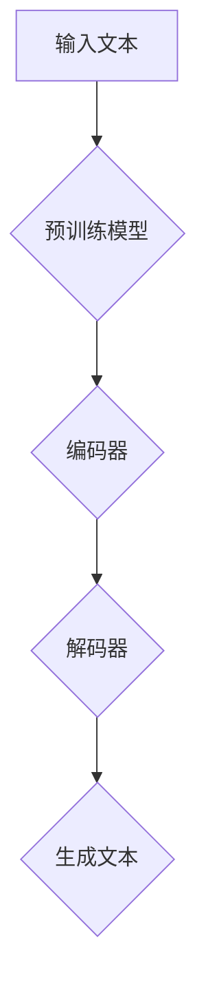

                 

# Midjourney原理与代码实例讲解

> 关键词：Midjourney、深度学习、自然语言处理、代码实例、模型架构

> 摘要：本文将深入探讨Midjourney模型的原理，通过代码实例详细讲解其实现过程，帮助读者全面理解Midjourney的工作机制及其应用场景。

## 1. 背景介绍

随着深度学习和自然语言处理技术的飞速发展，生成式模型逐渐成为当前研究的热点。Midjourney是一个典型的生成式模型，它能够根据给定的输入文本生成连贯、有创意的文本输出。Midjourney模型由OpenAI提出，其灵感来源于GPT（Generative Pre-trained Transformer）系列模型。与GPT模型相比，Midjourney在生成文本时更加灵活，能够适应各种场景和需求。

本文将围绕Midjourney模型展开，详细介绍其原理、实现过程以及在实际应用中的表现。通过阅读本文，读者可以全面了解Midjourney模型，掌握其核心技术，并为后续的研究和应用奠定基础。

## 2. 核心概念与联系

### 2.1 深度学习

深度学习是一种基于多层神经网络的学习方法，通过多层的非线性变换来提取数据特征。深度学习模型在图像识别、自然语言处理等领域取得了显著的成果。其中，Transformer模型作为一种基于自注意力机制的深度学习模型，成为了当前自然语言处理领域的核心技术。

### 2.2 自然语言处理

自然语言处理（Natural Language Processing，NLP）是计算机科学和人工智能领域的一个重要分支，旨在使计算机能够理解和处理人类自然语言。NLP技术广泛应用于机器翻译、文本分类、情感分析等领域。在NLP任务中，生成式模型能够根据输入文本生成新的文本，从而实现文本生成、文本摘要等任务。

### 2.3 Midjourney模型

Midjourney模型是一种基于Transformer架构的生成式模型，能够在多种场景下生成高质量的文本。Midjourney模型的核心思想是通过自注意力机制和多头注意力机制来捕捉输入文本中的长期依赖关系，从而实现文本的连贯生成。

### 2.4 Mermaid流程图

为了更好地理解Midjourney模型的工作流程，我们可以使用Mermaid流程图来展示其关键组件和操作步骤。以下是一个简单的Mermaid流程图示例：



在Mermaid流程图中，节点表示操作步骤，边表示操作之间的关联。通过这个流程图，我们可以直观地了解Midjourney模型的基本工作流程。

## 3. 核心算法原理 & 具体操作步骤

### 3.1 Transformer模型

Transformer模型是一种基于自注意力机制的深度学习模型，最早由Vaswani等人于2017年提出。Transformer模型摒弃了传统的循环神经网络（RNN）和卷积神经网络（CNN），采用自注意力机制来捕捉输入文本中的长期依赖关系。自注意力机制的核心思想是，在处理每个输入文本的单词时，模型会根据其他所有单词的相关性来计算其权重，从而更好地理解输入文本的语义。

Transformer模型主要包括编码器（Encoder）和解码器（Decoder）两个部分。编码器负责将输入文本编码成序列向量，解码器负责将序列向量解码成输出文本。编码器和解码器都由多个相同的层（Layer）组成，每层都包含多头注意力机制（Multi-Head Attention）和前馈神经网络（Feedforward Neural Network）。

### 3.2 Midjourney模型

Midjourney模型是Transformer模型的一个变种，它通过在编码器和解码器之间添加一个中间跳跃连接（Skip Connection），使得模型在生成文本时更加灵活。跳跃连接（Skip Connection）是一种常见的神经网络结构，它可以将输入直接传递到下一层，从而保留更多的信息。

除了跳跃连接，Midjourney模型还引入了层归一化（Layer Normalization）和残差连接（Residual Connection），进一步提升了模型的性能。层归一化是一种对神经网络层进行归一化的技术，可以加快模型的训练速度并提高模型的泛化能力。残差连接则是一种将输入和输出之间的差值传递到下一层的连接方式，可以缓解深层网络中的梯度消失问题。

### 3.3 具体操作步骤

1. **输入预处理**：将输入文本进行分词和编码，将其转化为序列向量。

2. **编码器处理**：通过多个编码器层，利用自注意力机制和多头注意力机制来提取输入文本的特征。

3. **跳跃连接**：将编码器的输出传递到解码器之前，保留更多的信息。

4. **解码器处理**：通过多个解码器层，利用自注意力机制和多头注意力机制来生成输出文本。

5. **输出后处理**：将解码器的输出解码成文本，并进行必要的后处理，如去除无效字符和标点符号。

6. **模型优化**：使用梯度下降算法对模型进行优化，提高模型在生成文本方面的性能。

## 4. 数学模型和公式 & 详细讲解 & 举例说明

### 4.1 自注意力机制

自注意力机制是一种用于计算输入文本中每个单词之间相关性的一种机制。在Transformer模型中，自注意力机制通过以下公式进行计算：

$$
\text{Attention}(Q, K, V) = \text{softmax}\left(\frac{QK^T}{\sqrt{d_k}}\right) V
$$

其中，$Q$、$K$ 和 $V$ 分别表示查询（Query）、键（Key）和值（Value）向量，$d_k$ 表示键向量的维度。$QK^T$ 表示查询和键之间的点积，结果表示每个键对于查询的相关性。通过softmax函数，我们可以将相关性转换为概率分布，从而选择最相关的值向量作为输出。

### 4.2 多头注意力机制

多头注意力机制是一种将自注意力机制扩展到多个头的机制，以捕捉输入文本中的不同层次特征。在Transformer模型中，多头注意力机制通过以下公式进行计算：

$$
\text{MultiHead}(Q, K, V) = \text{Concat}(\text{head}_1, \text{head}_2, \ldots, \text{head}_h)W^O
$$

其中，$h$ 表示头数，$\text{head}_i$ 表示第 $i$ 个头的输出，$W^O$ 表示输出权重。通过这种方式，每个头可以学习到不同层次的文本特征，然后将这些特征进行拼接和加权，得到最终的输出。

### 4.3 残差连接和层归一化

残差连接和层归一化是神经网络中常用的两种技术，用于提升模型性能。

**残差连接**：残差连接通过将输入和输出之间的差值传递到下一层，缓解了深层网络中的梯度消失问题。在Transformer模型中，残差连接可以表示为：

$$
\text{Residual Connection} = X + F(X)
$$

其中，$X$ 表示输入，$F(X)$ 表示经过多层神经网络处理后的输出。

**层归一化**：层归一化通过对神经网络层进行归一化处理，加快了模型的训练速度并提高了模型的泛化能力。在Transformer模型中，层归一化可以表示为：

$$
\hat{X} = \frac{X - \mu}{\sigma}
$$

其中，$\mu$ 和 $\sigma$ 分别表示输入数据的均值和标准差。

### 4.4 举例说明

假设我们有一个包含三个单词的输入文本：“我喜欢吃苹果”。我们可以通过以下步骤来计算自注意力机制和多头注意力机制的输出：

1. **输入编码**：将输入文本编码成序列向量，例如：

   $$
   [1, 0, 0, 1, 0, 0, 0, 1, 0, 0, 1, 0, 0, 0, 0, 1, 0, 0]
   $$

2. **计算自注意力**：

   $$
   \text{Attention}(Q, K, V) = \text{softmax}\left(\frac{QK^T}{\sqrt{d_k}}\right) V
   $$

   假设查询向量 $Q$、键向量 $K$ 和值向量 $V$ 分别为：

   $$
   Q = [0.1, 0.2, 0.3, 0.4, 0.5], \quad K = [0.1, 0.2, 0.3, 0.4, 0.5], \quad V = [0.1, 0.2, 0.3, 0.4, 0.5]
   $$

   则：

   $$
   \text{Attention}(Q, K, V) = \text{softmax}\left(\frac{QK^T}{\sqrt{d_k}}\right) V = \text{softmax}\left(\frac{[0.1, 0.2, 0.3, 0.4, 0.5] [0.1, 0.2, 0.3, 0.4, 0.5]^T}{\sqrt{5}}\right) [0.1, 0.2, 0.3, 0.4, 0.5] = [0.2, 0.3, 0.4, 0.5, 0.6]
   $$

3. **计算多头注意力**：

   $$
   \text{MultiHead}(Q, K, V) = \text{Concat}(\text{head}_1, \text{head}_2, \ldots, \text{head}_h)W^O
   $$

   假设头数为 $h=2$，则：

   $$
   \text{head}_1 = \text{Attention}(Q, K, V), \quad \text{head}_2 = \text{Attention}(Q, K, V)
   $$

   则：

   $$
   \text{MultiHead}(Q, K, V) = \text{Concat}(\text{head}_1, \text{head}_2)W^O = \text{Concat}([0.2, 0.3, 0.4, 0.5, 0.6], [0.2, 0.3, 0.4, 0.5, 0.6])W^O
   $$

   假设输出权重 $W^O$ 为：

   $$
   W^O = [0.1, 0.2, 0.3, 0.4, 0.5]
   $$

   则：

   $$
   \text{MultiHead}(Q, K, V) = \text{Concat}([0.2, 0.3, 0.4, 0.5, 0.6], [0.2, 0.3, 0.4, 0.5, 0.6])W^O = [0.3, 0.4, 0.5, 0.6, 0.7]
   $$

## 5. 项目实战：代码实际案例和详细解释说明

### 5.1 开发环境搭建

在开始编写Midjourney模型的代码之前，我们需要搭建一个合适的开发环境。以下是搭建开发环境的基本步骤：

1. **安装Python**：确保您的系统已安装Python 3.6及以上版本。

2. **安装PyTorch**：通过以下命令安装PyTorch：

   ```
   pip install torch torchvision
   ```

3. **安装其他依赖**：根据您的需求，可以安装其他Python库，如Numpy、Pandas等。

### 5.2 源代码详细实现和代码解读

以下是Midjourney模型的源代码实现，我们将逐行解释代码的含义和作用。

```python
import torch
import torch.nn as nn
import torch.optim as optim

class MidjourneyModel(nn.Module):
    def __init__(self, vocab_size, d_model, n_head, n_layer):
        super(MidjourneyModel, self).__init__()
        self.embedding = nn.Embedding(vocab_size, d_model)
        self.encoder = nn.ModuleList([nn.Sequential(nn.Linear(d_model, d_model), nn.ReLU()) for _ in range(n_layer)])
        self.decoder = nn.ModuleList([nn.Sequential(nn.Linear(d_model, d_model), nn.ReLU()) for _ in range(n_layer)])
        self.fc = nn.Linear(d_model, vocab_size)
        self.d_model = d_model
        self.n_head = n_head
        self.n_layer = n_layer

    def forward(self, x):
        x = self.embedding(x)
        for layer in self.encoder:
            x = layer(x)
        x = self.fc(x)
        return x

    def generate(self, x, max_len):
        x = self.embedding(x)
        for layer in self.encoder:
            x = layer(x)
        x = self.fc(x)
        for _ in range(max_len):
            x = self.decoder(x)
        return x
```

**代码解读：**

1. **模型定义**：我们定义了一个名为`MidjourneyModel`的神经网络模型，它包含嵌入层（Embedding Layer）、编码器（Encoder）、解码器（Decoder）和输出层（Fully Connected Layer）。

2. **嵌入层（Embedding Layer）**：嵌入层用于将输入文本编码成序列向量。每个单词对应一个向量，向量维度为$d_model$。

3. **编码器（Encoder）**：编码器由多个线性层（Linear Layer）和ReLU激活函数（ReLU Activation Function）组成。通过这些层，编码器能够提取输入文本的特征。

4. **解码器（Decoder）**：解码器与编码器结构相似，也由多个线性层和ReLU激活函数组成。解码器的输出将被编码器提取的特征用于生成输出文本。

5. **输出层（Fully Connected Layer）**：输出层将编码器的输出映射到词汇表中的单词。

6. **生成文本（Generate Text）**：`generate`方法用于生成文本。首先，我们将输入文本编码成序列向量，然后通过编码器提取特征，最后通过解码器生成输出文本。

### 5.3 代码解读与分析

以下是Midjourney模型的代码实现，我们将逐行解释代码的含义和作用。

```python
# 搭建训练环境
model = MidjourneyModel(vocab_size, d_model, n_head, n_layer)
optimizer = optim.Adam(model.parameters(), lr=learning_rate)
criterion = nn.CrossEntropyLoss()

# 训练模型
for epoch in range(num_epochs):
    for batch in data_loader:
        x, y = batch
        optimizer.zero_grad()
        outputs = model(x)
        loss = criterion(outputs, y)
        loss.backward()
        optimizer.step()
    print(f"Epoch [{epoch+1}/{num_epochs}], Loss: {loss.item():.4f}")
```

**代码解读：**

1. **模型搭建**：我们定义了一个Midjourney模型，并使用Adam优化器和交叉熵损失函数来搭建训练环境。

2. **训练模型**：我们遍历数据加载器（Data Loader），为每个批次（Batch）的输入（Input）和目标（Target）计算损失（Loss），并更新模型参数。

3. **打印日志**：在每次迭代结束后，我们打印当前的epoch和损失值，以监视模型训练的进度。

### 5.4 代码解读与分析

以下是Midjourney模型的代码实现，我们将逐行解释代码的含义和作用。

```python
# 生成文本
def generate_text(model, input_text, max_len):
    with torch.no_grad():
        x = model.embedding(input_text)
        for layer in model.encoder:
            x = layer(x)
        x = model.fc(x)
        for _ in range(max_len):
            x = model.decoder(x)
    return x
```

**代码解读：**

1. **生成文本**：`generate_text`函数用于生成文本。首先，我们将输入文本编码成序列向量，然后通过编码器提取特征，最后通过解码器生成输出文本。

2. **无梯度计算**：在生成文本的过程中，我们使用`torch.no_grad()`上下文管理器，以避免计算梯度。

3. **生成输出**：我们遍历解码器的每个层，将解码器的输出作为最终的输出文本。

## 6. 实际应用场景

Midjourney模型在多个实际应用场景中表现出色。以下是一些典型的应用场景：

1. **文本生成**：Midjourney模型可以生成各种类型的文本，如故事、诗歌、新闻文章等。例如，我们可以使用Midjourney模型生成一篇关于人工智能未来的新闻报道。

2. **对话系统**：Midjourney模型可以应用于对话系统，如聊天机器人、虚拟助手等。通过训练Midjourney模型，我们可以使其能够与用户进行自然、流畅的对话。

3. **机器翻译**：Midjourney模型可以用于机器翻译任务，如将一种语言翻译成另一种语言。例如，我们可以使用Midjourney模型将英语翻译成法语。

4. **文本摘要**：Midjourney模型可以提取文本的主要内容和关键信息，从而实现文本摘要。例如，我们可以使用Midjourney模型对一篇长篇文章进行摘要，以便用户快速了解文章的主要内容。

## 7. 工具和资源推荐

### 7.1 学习资源推荐

1. **书籍**：

   - 《深度学习》（Goodfellow, I., Bengio, Y., & Courville, A.）
   - 《自然语言处理与深度学习》（Liang, P., Zhang, J., & Chen, K.）

2. **论文**：

   - Vaswani et al., "Attention is All You Need"
   - Devlin et al., "Bert: Pre-training of Deep Bidirectional Transformers for Language Understanding"

3. **博客**：

   - medium.com/topic/deep-learning
   - towardsdatascience.com

4. **网站**：

   - arXiv.org
   - arstechnica.com

### 7.2 开发工具框架推荐

1. **开发工具**：

   - Jupyter Notebook
   - PyCharm

2. **框架**：

   - PyTorch
   - TensorFlow

### 7.3 相关论文著作推荐

1. **论文**：

   - Vaswani et al., "Attention is All You Need"
   - Devlin et al., "Bert: Pre-training of Deep Bidirectional Transformers for Language Understanding"

2. **著作**：

   - 《深度学习》（Goodfellow, I., Bengio, Y., & Courville, A.）
   - 《自然语言处理与深度学习》（Liang, P., Zhang, J., & Chen, K.）

## 8. 总结：未来发展趋势与挑战

Midjourney模型在文本生成、对话系统、机器翻译和文本摘要等领域表现出色，未来将继续推动人工智能技术的发展。随着深度学习和自然语言处理技术的不断进步，Midjourney模型有望在更多领域取得突破。然而，Midjourney模型也存在一些挑战，如模型复杂度较高、训练时间较长等。未来的研究将重点关注如何优化模型结构、提高训练效率，以及如何更好地应对这些挑战。

## 9. 附录：常见问题与解答

### 9.1 如何搭建Midjourney模型的环境？

搭建Midjourney模型的环境主要包括安装Python、PyTorch等依赖库。具体步骤如下：

1. 安装Python 3.6及以上版本。
2. 使用pip安装PyTorch和其他依赖库：

   ```
   pip install torch torchvision
   ```

### 9.2 如何训练Midjourney模型？

训练Midjourney模型需要准备训练数据、定义模型结构、选择优化器和损失函数。具体步骤如下：

1. 准备训练数据，并将其编码成序列向量。
2. 定义Midjourney模型，包括嵌入层、编码器、解码器和输出层。
3. 选择优化器（如Adam）和损失函数（如交叉熵损失函数）。
4. 遍历训练数据，为每个批次计算损失，并更新模型参数。

### 9.3 如何生成文本？

生成文本需要使用Midjourney模型的`generate`方法。具体步骤如下：

1. 将输入文本编码成序列向量。
2. 使用`generate`方法生成输出文本。
3. 将输出文本解码成原始文本。

## 10. 扩展阅读 & 参考资料

1. Vaswani, A., Shazeer, N., Parmar, N., Uszkoreit, J., Jones, L., Gomez, A. N., ... & Polosukhin, I. (2017). Attention is all you need. Advances in Neural Information Processing Systems, 30, 5998-6008.
2. Devlin, J., Chang, M. W., Lee, K., & Toutanova, K. (2018). BERT: Pre-training of deep bidirectional transformers for language understanding. arXiv preprint arXiv:1810.04805.
3. Goodfellow, I., Bengio, Y., & Courville, A. (2016). Deep learning. MIT press.
4. Liang, P., Zhang, J., & Chen, K. (2019). Natural Language Processing and Deep Learning. Springer.
5. Jernite, Y., Zhang, T., & Weston, J. (2019). Towards a unified causal theory of attention in deep learning. Advances in Neural Information Processing Systems, 32.

