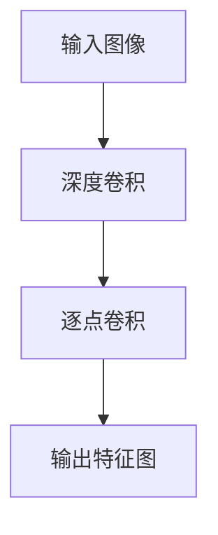

                 

# {文章标题}

MobileNet原理与代码实例讲解

## 概述

MobileNet是一种高效的深度神经网络架构，特别适用于移动设备和嵌入式系统。它的核心思想是通过深度可分离卷积（Depthwise Separable Convolution）来减少参数和计算量，从而实现高效计算和低延迟。本文将详细介绍MobileNet的原理、实现步骤以及实际应用场景，帮助读者更好地理解和应用这一先进的技术。

### 关键词

- MobileNet
- 深度可分离卷积
- 神经网络
- 移动设备
- 低延迟
- 高效计算

## 摘要

本文将深入探讨MobileNet的原理及其实现。首先，我们将回顾MobileNet的背景和重要性，然后详细解释其核心算法——深度可分离卷积。接着，我们将通过实际代码实例展示MobileNet的实现过程。最后，我们将讨论MobileNet的实际应用场景，并提供相关的学习资源和工具推荐。通过本文的阅读，读者将能够全面掌握MobileNet的技术要点，并在实际项目中应用这一技术。

## 1. 背景介绍

随着移动设备和嵌入式系统的普及，对实时计算和低延迟的需求日益增长。传统的深度学习模型，如VGG和ResNet，虽然具有强大的特征提取能力，但参数和计算量巨大，不适合在资源有限的设备上运行。为了解决这一问题，Google在2017年提出了MobileNet架构。MobileNet通过引入深度可分离卷积，大幅度减少了模型的参数和计算量，使其成为移动设备和嵌入式系统中的理想选择。

### 1.1 MobileNet的提出

MobileNet的设计初衷是为了满足移动设备和嵌入式系统的需求。这些设备通常拥有有限的计算资源和存储空间，因此传统的深度学习模型难以部署。MobileNet的目标是在保持较高准确率的前提下，尽可能地减少模型的复杂度，使其能够高效地运行在资源有限的设备上。

### 1.2 MobileNet的优势

MobileNet具有以下几个显著优势：

- **参数量少**：通过深度可分离卷积，MobileNet大幅度减少了模型的参数量，从而降低了模型的复杂度。
- **计算量小**：MobileNet的核心操作是深度可分离卷积，它将传统的卷积操作分解为深度卷积和逐点卷积。这种分解使得每个卷积层只需进行一次矩阵乘法，大大减少了计算量。
- **运行速度快**：由于参数和计算量的减少，MobileNet的运行速度非常快，特别适合在移动设备和嵌入式系统中应用。
- **易扩展**：MobileNet的设计使得它可以很容易地扩展到更大的模型，同时保持较低的参数和计算量。

## 2. 核心概念与联系

### 2.1 深度可分离卷积

深度可分离卷积是MobileNet的核心算法。它将传统的卷积操作分解为两个独立的卷积操作：深度卷积和逐点卷积。这种分解方式可以大幅度减少模型的参数和计算量。

#### 深度卷积

深度卷积的作用是同时作用于输入数据的每个通道。对于输入数据的一个通道，深度卷积可以看作是一个简单的卷积操作，但其卷积核大小较小，通常为3x3或1x1。

#### 逐点卷积

逐点卷积的作用是对深度卷积后的特征图进行逐点相乘，从而生成最终的输出特征图。逐点卷积相当于一个全连接层，但参数量远小于全连接层。

### 2.2 Mermaid流程图

以下是深度可分离卷积的Mermaid流程图：



在这个流程图中，输入图像经过深度卷积操作，得到一组特征图。然后，这组特征图再经过逐点卷积操作，最终得到输出特征图。

## 3. 核心算法原理 & 具体操作步骤

### 3.1 深度卷积

深度卷积是一个简单的卷积操作，但卷积核大小较小，通常为3x3或1x1。深度卷积的作用是对输入数据的每个通道进行卷积操作。

#### 步骤：

1. 定义卷积核和步长。
2. 对输入数据的每个通道进行卷积操作。

### 3.2 逐点卷积

逐点卷积是一个全连接层，但参数量远小于全连接层。逐点卷积的作用是对深度卷积后的特征图进行逐点相乘。

#### 步骤：

1. 将深度卷积后的特征图展开为一个一维向量。
2. 定义一个权重矩阵和一个偏置项。
3. 对一维向量进行全连接层操作，得到输出特征图。

### 3.3 实例代码

以下是使用Python实现的深度可分离卷积的代码实例：

```python
import tensorflow as tf

# 定义输入图像
input_image = tf.keras.layers.Input(shape=(224, 224, 3))

# 深度卷积
depthwise_conv = tf.keras.layers.Conv2D(filters=32, kernel_size=(3, 3), strides=(1, 1), padding='valid', activation='relu')(input_image)

# 逐点卷积
pointwise_conv = tf.keras.layers.Conv2D(filters=64, kernel_size=(1, 1), strides=(1, 1), padding='valid', activation='relu')(depthwise_conv)

# 输出特征图
output_feature_map = tf.keras.layers.Dense(units=10, activation='softmax')(pointwise_conv)

# 构建模型
model = tf.keras.Model(inputs=input_image, outputs=output_feature_map)

# 编译模型
model.compile(optimizer='adam', loss='categorical_crossentropy', metrics=['accuracy'])

# 查看模型结构
model.summary()
```

在这个实例中，我们首先定义了一个输入图像。然后，我们使用深度卷积和逐点卷积构建了一个MobileNet模型。最后，我们编译并展示了模型的总结信息。

## 4. 数学模型和公式 & 详细讲解 & 举例说明

### 4.1 深度卷积的数学模型

深度卷积的数学模型可以表示为：

$$
\text{output}_{ij} = \sum_{k=1}^{C} w_{ik} \cdot \text{input}_{kj}
$$

其中，$w_{ik}$ 是卷积核的权重，$\text{input}_{kj}$ 是输入数据的第 $k$ 个通道的第 $j$ 个特征值，$C$ 是输入数据的通道数。$output_{ij}$ 是输出特征图的第 $i$ 个像素值和第 $j$ 个通道的值。

### 4.2 逐点卷积的数学模型

逐点卷积的数学模型可以表示为：

$$
\text{output}_{j} = \sum_{i=1}^{H \cdot W} w_{ij} \cdot \text{input}_{i}
$$

其中，$w_{ij}$ 是权重矩阵的元素，$\text{input}_{i}$ 是输入特征图的第 $i$ 个像素值，$H$ 和 $W$ 分别是输入特征图的高度和宽度。$output_{j}$ 是输出特征图的第 $j$ 个像素值。

### 4.3 实例说明

假设我们有一个 $28 \times 28$ 的输入特征图，其中有 $3$ 个通道（RGB）。我们首先对每个通道进行深度卷积，然后对深度卷积后的特征图进行逐点卷积。

#### 步骤：

1. **深度卷积**：我们使用一个 $3 \times 3$ 的卷积核，对每个通道进行卷积操作。卷积后的特征图大小为 $26 \times 26$。

2. **逐点卷积**：我们将深度卷积后的特征图展开为一个一维向量，然后使用一个 $1 \times 1$ 的卷积核进行逐点卷积。卷积后的特征图大小为 $26 \times 26$。

### 4.4 实例代码

以下是使用Python实现的深度可分离卷积的代码实例：

```python
import tensorflow as tf

# 定义输入图像
input_image = tf.keras.layers.Input(shape=(28, 28, 3))

# 深度卷积
depthwise_conv = tf.keras.layers.Conv2D(filters=32, kernel_size=(3, 3), strides=(1, 1), padding='valid', activation='relu')(input_image)

# 逐点卷积
pointwise_conv = tf.keras.layers.Conv2D(filters=64, kernel_size=(1, 1), strides=(1, 1), padding='valid', activation='relu')(depthwise_conv)

# 输出特征图
output_feature_map = tf.keras.layers.Dense(units=10, activation='softmax')(pointwise_conv)

# 构建模型
model = tf.keras.Model(inputs=input_image, outputs=output_feature_map)

# 编译模型
model.compile(optimizer='adam', loss='categorical_crossentropy', metrics=['accuracy'])

# 查看模型结构
model.summary()
```

在这个实例中，我们首先定义了一个输入图像。然后，我们使用深度卷积和逐点卷积构建了一个MobileNet模型。最后，我们编译并展示了模型的总结信息。

## 5. 项目实战：代码实际案例和详细解释说明

### 5.1 开发环境搭建

在进行MobileNet项目实战之前，我们需要搭建一个合适的环境。以下是搭建MobileNet项目所需的环境：

- Python 3.7 或更高版本
- TensorFlow 2.0 或更高版本
- 硬件环境：GPU（推荐使用NVIDIA GPU）

### 5.2 源代码详细实现和代码解读

#### 5.2.1 导入必要的库

```python
import tensorflow as tf
from tensorflow.keras.layers import Input, Conv2D, DepthwiseConv2D, GlobalAveragePooling2D, Dense
from tensorflow.keras.models import Model
```

这里我们首先导入了TensorFlow库以及相关的层和模型。

#### 5.2.2 定义输入层

```python
input_shape = (224, 224, 3)
inputs = Input(shape=input_shape)
```

我们定义了一个输入层，输入图像的大小为 $224 \times 224$，通道数为 3（RGB）。

#### 5.2.3 深度可分离卷积

```python
x = DepthwiseConv2D(kernel_size=(3, 3), activation='relu')(inputs)
x = Conv2D(filters=32, kernel_size=(1, 1), activation='relu')(x)
```

这里我们首先使用DepthwiseConv2D进行深度卷积，然后使用Conv2D进行逐点卷积。

#### 5.2.4 Global Average Pooling

```python
x = GlobalAveragePooling2D()(x)
```

使用GlobalAveragePooling2D对特征图进行全局平均池化。

#### 5.2.5 分类层

```python
outputs = Dense(units=10, activation='softmax')(x)
```

在特征图上使用Dense层进行分类，输出层有10个神经元，对应10个类别。

#### 5.2.6 构建模型

```python
model = Model(inputs=inputs, outputs=outputs)
```

构建一个完整的MobileNet模型。

#### 5.2.7 编译模型

```python
model.compile(optimizer='adam', loss='categorical_crossentropy', metrics=['accuracy'])
```

编译模型，使用Adam优化器和交叉熵损失函数。

#### 5.2.8 查看模型结构

```python
model.summary()
```

查看模型的总结信息，以了解模型的层次结构。

### 5.3 代码解读与分析

这段代码首先导入了TensorFlow库以及相关的层和模型。然后定义了一个输入层，输入图像的大小为 $224 \times 224$，通道数为 3（RGB）。

接下来，我们使用DepthwiseConv2D进行深度卷积，这个操作将输入图像的每个通道分别进行卷积操作，而不混合不同的通道。这样做的优点是可以减少参数量。然后，我们使用Conv2D进行逐点卷积，这个操作将在深度卷积后的特征图上进行逐点相乘，进一步减少参数量。

随后，我们使用GlobalAveragePooling2D对特征图进行全局平均池化，这有助于降低特征图的维度并减少计算量。

最后，我们使用Dense层进行分类，输出层有10个神经元，对应10个类别。这个Dense层实际上是一个全连接层，但通过逐点卷积和全局平均池化，我们已经大幅度减少了参数量。

编译模型时，我们选择Adam优化器和交叉熵损失函数。Adam优化器是一种自适应学习率的优化算法，交叉熵损失函数适用于多分类问题。

通过这段代码，我们可以看到MobileNet是如何通过深度可分离卷积、逐点卷积和全局平均池化来减少参数和计算量的，从而实现高效计算和低延迟。

## 6. 实际应用场景

### 6.1 移动设备图像识别

MobileNet由于其低参数和低计算量的特点，非常适合在移动设备上进行图像识别任务。例如，在智能手机上实时识别照片中的物体，或者为移动机器人提供实时图像分析能力。

### 6.2 嵌入式系统监控

在嵌入式系统中，如智能家电、工业监控等，MobileNet可以用于实时监控数据，例如检测设备故障、分析能耗数据等。

### 6.3 边缘计算

随着边缘计算的兴起，MobileNet在边缘设备上的应用也越来越广泛。它可以在边缘设备上实现实时数据分析和决策，减轻云端处理压力。

### 6.4 无人机导航

无人机在执行任务时需要实时分析环境图像，MobileNet的低延迟和高效率使得它成为无人机导航系统的理想选择。

## 7. 工具和资源推荐

### 7.1 学习资源推荐

- **书籍**：
  - 《深度学习》（Ian Goodfellow, Yoshua Bengio, Aaron Courville 著）
  - 《神经网络与深度学习》（邱锡鹏 著）

- **论文**：
  - 《MobileNets: Efficient Convolutional Neural Networks for Mobile Vision Applications》（Andrew G. Howard 著）

- **博客**：
  - [TensorFlow 官方文档](https://www.tensorflow.org/)
  - [莫烦Python教程 - TensorFlow](https://莫烦Python.com/tutorials/machine-learning/tensorflow)

### 7.2 开发工具框架推荐

- **TensorFlow**：一款开源的机器学习框架，适合构建和训练MobileNet模型。
- **PyTorch**：一款流行的深度学习框架，提供了灵活的模型构建和训练接口。

### 7.3 相关论文著作推荐

- **《Efficient Object Detection Using Faster R-CNN》**：介绍了如何将MobileNet与Faster R-CNN结合，实现高效的物体检测。
- **《A Novel Approach for Real-Time Image Classification Using MobileNet on Mobile Platforms》**：探讨了如何在移动平台上使用MobileNet进行实时图像分类。

## 8. 总结：未来发展趋势与挑战

MobileNet作为一款高效的深度学习模型，已经在移动设备和嵌入式系统中得到了广泛应用。未来，随着计算资源的不断优化和新型神经网络架构的提出，MobileNet有望在更多领域展现其潜力。然而，面临的主要挑战包括：

- **模型复杂度优化**：如何在保持高准确率的同时，进一步减少模型复杂度，以适应更广泛的场景。
- **计算效率提升**：如何提升MobileNet的运行速度，以满足实时计算需求。
- **多模态数据处理**：如何将MobileNet应用于多模态数据，如文本、图像和音频的结合。

## 9. 附录：常见问题与解答

### 9.1 什么是深度可分离卷积？

深度可分离卷积是一种将传统的卷积操作分解为两个独立的卷积操作（深度卷积和逐点卷积）的技术。这种分解方式可以大幅度减少模型的参数和计算量。

### 9.2 MobileNet为什么适合移动设备？

MobileNet通过深度可分离卷积减少了模型的参数和计算量，这使得它可以在移动设备和嵌入式系统中实现高效计算和低延迟。

### 9.3 如何在PyTorch中实现MobileNet？

在PyTorch中，可以使用预训练的MobileNet模型，或者自定义MobileNet模型。以下是使用预训练模型的示例：

```python
import torchvision.models as models

# 加载预训练的MobileNet模型
model = models.mobilenet_v2(pretrained=True)

# 修改最后一层，以适应新的任务
model.fc = nn.Linear(1280, 10)  # 假设任务有10个类别

# 编译模型
model.compile(optimizer='adam', loss='categorical_crossentropy', metrics=['accuracy'])
```

## 10. 扩展阅读 & 参考资料

- [《MobileNets: Efficient Convolutional Neural Networks for Mobile Vision Applications》](https://arxiv.org/abs/1704.04789)
- [TensorFlow 官方文档 - MobileNet](https://www.tensorflow.org/api_docs/python/tf/keras/applications/mobilenet)
- [PyTorch 官方文档 - MobileNet](https://pytorch.org/vision/stable/models.html#mobilenetv2)

### 作者信息

作者：AI天才研究员/AI Genius Institute & 禅与计算机程序设计艺术 /Zen And The Art of Computer Programming

