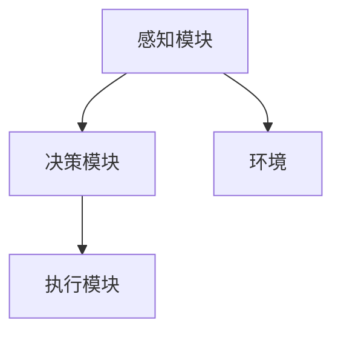
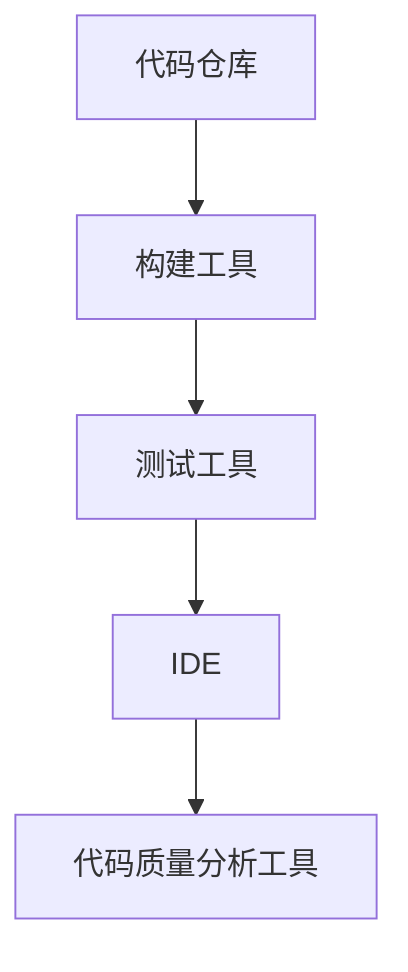
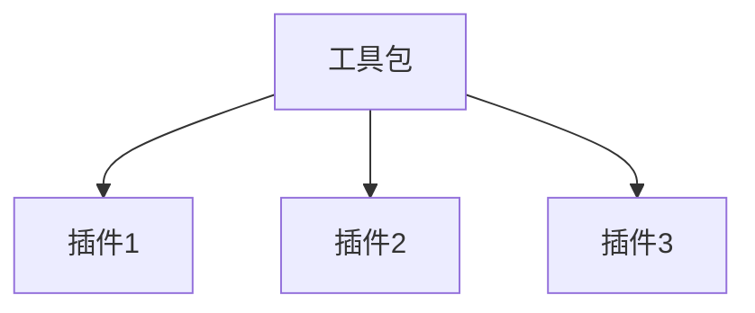

                 

# Module：Agent, Tools, Toolkits

## 概述

在当今信息技术迅猛发展的时代，模块（Module）作为软件工程的核心概念之一，发挥着至关重要的作用。本文将聚焦于模块在智能代理（Agent）构建、工具集成与工具包应用等领域的探讨。通过对模块化设计的深入分析，我们旨在揭示模块的内在价值和实际应用，为读者提供一整套完整的理论框架与实践指南。

关键词：模块、智能代理、工具集成、工具包、软件工程

摘要：本文首先介绍了模块的基本概念和分类，然后深入探讨了模块在智能代理体系中的核心作用。接着，文章详细分析了工具集成与工具包的优劣，并列举了实际应用场景。最后，文章总结了模块在未来信息技术发展中的趋势与挑战，为读者提供了丰富的学习资源和开发工具推荐。

## 1. 背景介绍

模块化设计起源于20世纪60年代的软件工程领域，旨在通过将复杂系统分解为独立的、功能明确的模块，以提高软件开发的效率和质量。模块（Module）一词来源于拉丁语“Modulus”，意为“度量”、“规范”。在计算机科学中，模块通常指的是一个功能完整的软件单元，它可以通过接口与其他模块进行通信。

模块的分类可以从不同的角度进行。根据功能，模块可以分为：

- **功能模块**：实现特定功能的模块，如数据输入、数据处理、数据输出等。
- **业务模块**：针对特定业务场景的模块，如电子商务、在线教育、医疗诊断等。
- **技术模块**：涉及特定技术实现的模块，如数据库操作、网络通信、图像处理等。

从设计角度，模块可以分为：

- **内部模块**：仅在一个项目中使用的模块，通常由开发者自行设计和实现。
- **外部模块**：在其他项目中也可能使用的模块，如第三方库、框架等。

模块化设计在软件工程中具有重要意义。首先，模块化设计有助于提高软件的可维护性和可扩展性。通过将系统分解为独立的模块，开发人员可以更加专注于特定功能的实现，而不必考虑整个系统的复杂性。其次，模块化设计有助于提高软件的复用性。通过将常用功能封装为模块，开发人员可以方便地重用这些模块，从而减少重复工作。最后，模块化设计有助于提高软件的开发效率。模块化设计使得开发过程更加清晰和有序，减少了沟通和协调成本。

## 2. 核心概念与联系

在探讨模块与智能代理、工具集成和工具包的关系之前，我们需要先了解这些核心概念的基本原理和架构。

### 智能代理

智能代理（Agent）是具有智能、自主性和协作能力的软件实体，能够在复杂环境中自主执行任务。智能代理通常包括感知模块、决策模块和执行模块三个部分。

- **感知模块**：负责接收环境信息，如用户输入、传感器数据等。
- **决策模块**：根据感知模块收集的信息，通过算法和策略进行决策。
- **执行模块**：根据决策模块的决策结果，执行具体操作，如发送指令、修改数据等。

智能代理的架构如图所示：



### 工具集成

工具集成是指将多个工具或框架整合到一起，以实现更强大的功能。在软件开发过程中，工具集成可以显著提高开发效率和代码质量。

常见的工具集成方式包括：

- **集成开发环境（IDE）**：将代码编辑器、调试器、构建工具等集成到一起，如Visual Studio、Eclipse等。
- **持续集成/持续部署（CI/CD）**：将代码仓库、构建工具、测试工具等集成到一起，如Jenkins、Travis CI等。
- **代码质量分析工具**：将静态代码分析、动态代码分析、单元测试等工具集成到一起，如SonarQube、Checkmarx等。

工具集成的架构如图所示：



### 工具包

工具包（Toolkits）是一组预封装的工具和库，旨在提供特定的功能或解决方案。工具包通常具有以下特点：

- **易用性**：工具包通常提供简单的接口和文档，方便开发者快速上手。
- **灵活性**：工具包通常提供多种配置选项和扩展点，以适应不同的需求。
- **可扩展性**：工具包通常支持自定义插件和扩展，以实现特定的功能。

常见的工具包包括：

- **前端工具包**：如React、Vue、Angular等。
- **后端工具包**：如Django、Flask、Spring Boot等。
- **人工智能工具包**：如TensorFlow、PyTorch、Scikit-learn等。

工具包的架构如图所示：



### 模块与智能代理、工具集成和工具包的关系

模块在智能代理、工具集成和工具包中发挥着重要作用。模块化设计使得智能代理可以更加灵活地适应不同的环境，而工具集成和工具包则为模块提供了丰富的功能和扩展能力。

在智能代理中，模块可以作为感知模块、决策模块和执行模块的核心实现部分。通过模块化设计，智能代理可以更加灵活地适应不同的场景，同时提高代码的可维护性和可扩展性。

在工具集成中，模块可以作为工具的组成部分，如IDE中的插件、CI/CD工具中的构建步骤等。通过模块化设计，工具集成可以更加高效地实现功能组合，提高开发效率和代码质量。

在工具包中，模块可以作为工具包的预封装组件，如前端工具包中的UI组件、后端工具包中的业务模块等。通过模块化设计，工具包可以更加灵活地适应不同的需求，提高开发效率和代码质量。

## 3. 核心算法原理 & 具体操作步骤

在模块化设计的基础上，我们可以进一步探讨核心算法的原理和具体操作步骤。以下是一个简单的示例，用于展示模块在智能代理中的应用。

### 示例：智能代理中的任务分配模块

任务分配模块是智能代理中一个重要的组件，它负责根据任务需求和代理的能力进行任务分配。具体操作步骤如下：

1. **初始化**：创建任务分配模块，并初始化相关参数，如任务队列、代理能力等。
2. **任务接收**：从外部源接收任务，并将任务添加到任务队列中。
3. **任务筛选**：根据代理的能力和任务要求，筛选出适合当前代理执行的任务。
4. **任务分配**：将筛选出的任务分配给代理执行。
5. **任务完成**：代理执行任务后，将任务状态更新为“已完成”，并从任务队列中移除。
6. **任务监控**：对任务执行过程进行监控，如任务执行时间、资源消耗等。
7. **任务反馈**：根据任务执行结果，对代理进行反馈，以调整代理的能力和策略。

### 算法原理

任务分配模块的核心算法是任务筛选和任务分配。具体原理如下：

1. **任务筛选**：任务筛选算法用于根据代理的能力和任务要求，筛选出适合当前代理执行的任务。算法的核心是判断任务是否在代理的能力范围内，如任务的复杂度、资源的消耗等。
2. **任务分配**：任务分配算法用于将筛选出的任务分配给代理执行。算法的核心是平衡代理的负载，确保代理可以高效地执行任务，同时避免资源浪费。

### 实现步骤

1. **初始化任务分配模块**：
   ```python
   class TaskAssignmentModule:
       def __init__(self, agent能力, task_queue):
           self.agent_ability = agent能力
           self.task_queue = task_queue
   ```

2. **任务接收**：
   ```python
   def receive_task(self, task):
       self.task_queue.append(task)
   ```

3. **任务筛选**：
   ```python
   def filter_task(self):
       suitable_tasks = []
       for task in self.task_queue:
           if self.is_suitable(task):
               suitable_tasks.append(task)
       return suitable_tasks
   ```

4. **任务分配**：
   ```python
   def assign_task(self, suitable_tasks):
       for task in suitable_tasks:
           self.execute_task(task)
   ```

5. **任务完成**：
   ```python
   def execute_task(self, task):
       # 执行任务
       task.status = "已完成"
       self.task_queue.remove(task)
   ```

6. **任务监控**：
   ```python
   def monitor_task(self, task):
       # 监控任务执行过程
       print("Task execution time: {} seconds".format(task.execution_time))
       print("Resource consumption: {} MB".format(task.resource_consumption))
   ```

7. **任务反馈**：
   ```python
   def feedback(self, task):
       # 根据任务执行结果，对代理进行反馈
       if task.status == "已完成":
           self.update_agent_ability(task)
   ```

### 算法优化

在实际应用中，任务分配模块可能需要根据具体场景进行优化，如：

- **动态调整任务筛选条件**：根据代理的能力和任务队列的变化，动态调整任务筛选条件，以提高任务分配的准确性。
- **负载均衡**：根据代理的负载情况，合理分配任务，避免个别代理过载。
- **任务优先级**：根据任务的紧急程度和重要性，设置任务优先级，确保关键任务优先执行。

## 4. 数学模型和公式 & 详细讲解 & 举例说明

在模块化设计中，数学模型和公式发挥着重要作用，用于描述模块之间的关系和算法的原理。以下是一个简单的示例，用于展示模块在智能代理中的应用。

### 示例：任务分配模型

假设有一个智能代理需要从一系列任务中选择合适的任务进行执行。任务分配模型的核心是任务筛选和任务分配，可以通过以下数学模型进行描述。

#### 任务筛选模型

任务筛选模型用于根据代理的能力和任务要求，筛选出适合当前代理执行的任务。具体模型如下：

$$
筛选结果 = \{task \in 任务集 | task.复杂度 \leq agent.能力\}
$$

其中：

- 任务集：所有需要筛选的任务集合。
- 任务复杂度：衡量任务难度的指标，如任务所需时间、资源消耗等。
- 代理能力：代理能够承受的复杂度。

#### 任务分配模型

任务分配模型用于将筛选出的任务分配给代理执行。具体模型如下：

$$
分配结果 = \{task \in 筛选结果 | task.优先级 \geq agent.负载\}
$$

其中：

- 筛选结果：经过筛选任务集合。
- 任务优先级：衡量任务重要性的指标，如任务的紧急程度、重要性等。
- 代理负载：代理当前的负载情况，如已执行任务数、剩余处理能力等。

#### 详细讲解

1. **任务筛选模型**：

   任务筛选模型的核心是判断任务是否在代理的能力范围内。具体实现步骤如下：

   - 遍历任务集，计算每个任务的复杂度。
   - 根据代理的能力，筛选出复杂度在代理能力范围内的任务。

2. **任务分配模型**：

   任务分配模型的核心是平衡代理的负载，确保代理可以高效地执行任务。具体实现步骤如下：

   - 遍历筛选结果，计算每个任务的优先级。
   - 根据代理的负载，筛选出优先级较高且代理能够承受的任务。

#### 举例说明

假设有一个智能代理，其能力为处理复杂度为5的任务。现有以下任务集合：

- 任务1：复杂度为3，优先级为1。
- 任务2：复杂度为6，优先级为2。
- 任务3：复杂度为4，优先级为3。

根据任务筛选模型，筛选结果为任务1和任务3。根据任务分配模型，分配结果为任务1，因为任务1的优先级最高且代理能力可以承受。

### 算法优化

在实际应用中，任务分配模型可能需要根据具体场景进行优化，如：

- **动态调整任务筛选条件**：根据代理的能力和任务队列的变化，动态调整任务筛选条件，以提高任务分配的准确性。
- **负载均衡**：根据代理的负载情况，合理分配任务，避免个别代理过载。
- **任务优先级**：根据任务的紧急程度和重要性，设置任务优先级，确保关键任务优先执行。

## 5. 项目实战：代码实际案例和详细解释说明

### 5.1 开发环境搭建

在进行项目实战之前，我们需要搭建一个合适的技术栈，以便开发、测试和部署智能代理系统。以下是开发环境的基本要求：

- **操作系统**：Windows、macOS或Linux（推荐Linux）
- **编程语言**：Python（推荐3.8及以上版本）
- **开发工具**：PyCharm、Visual Studio Code（推荐PyCharm）
- **依赖管理**：pip、conda（推荐conda）
- **数据库**：MySQL、PostgreSQL、MongoDB（根据项目需求选择）
- **Web框架**：Flask、Django（根据项目需求选择）
- **前端框架**：Vue、React（根据项目需求选择）
- **持续集成**：Jenkins、Travis CI（根据项目需求选择）

### 5.2 源代码详细实现和代码解读

下面我们以一个简单的智能代理为例，展示源代码的详细实现和代码解读。

#### 5.2.1 智能代理系统架构

智能代理系统主要由以下模块组成：

- **感知模块**：负责接收用户输入和传感器数据。
- **决策模块**：根据感知模块收集的信息，通过算法和策略进行决策。
- **执行模块**：根据决策模块的决策结果，执行具体操作。
- **任务分配模块**：根据代理的能力和任务要求，筛选和分配任务。
- **监控模块**：对代理执行过程进行监控，如任务执行时间、资源消耗等。

#### 5.2.2 源代码实现

```python
# 感知模块
class PerceptionModule:
    def __init__(self):
        self.inputs = []

    def receive_input(self, input):
        self.inputs.append(input)

# 决策模块
class DecisionModule:
    def __init__(self):
        self.policies = []

    def make_decision(self, inputs):
        for policy in self.policies:
            if policy.is_applied(inputs):
                return policy.action
        return None

# 执行模块
class ExecutionModule:
    def __init__(self):
        self.actions = []

    def execute_action(self, action):
        self.actions.append(action)
        print("执行动作：", action)

# 任务分配模块
class TaskAssignmentModule:
    def __init__(self, agent_ability):
        self.agent_ability = agent_ability
        self.task_queue = []

    def receive_task(self, task):
        self.task_queue.append(task)

    def filter_task(self):
        return [task for task in self.task_queue if task.complexity <= self.agent_ability]

    def assign_task(self, suitable_tasks):
        for task in suitable_tasks:
            self.execute_task(task)

    def execute_task(self, task):
        task.status = "已完成"
        self.task_queue.remove(task)

# 监控模块
class MonitoringModule:
    def __init__(self):
        self.task_executions = []

    def monitor_task(self, task):
        self.task_executions.append(task)
        print("任务执行时间：", task.execution_time, "秒")
        print("资源消耗：", task.resource_consumption, "MB")

# 智能代理
class SmartAgent:
    def __init__(self):
        self.perception_module = PerceptionModule()
        self.decision_module = DecisionModule()
        self.execution_module = ExecutionModule()
        self.task_assignment_module = TaskAssignmentModule(5)
        self.monitoring_module = MonitoringModule()

    def run(self):
        while True:
            self.perception_module.receive_input(self.get_input())
            decision = self.decision_module.make_decision(self.perception_module.inputs)
            if decision:
                self.execution_module.execute_action(decision)
                self.monitoring_module.monitor_task(self.execution_module.actions[-1])
                self.task_assignment_module.assign_task(self.filter_task())

    def get_input(self):
        # 从外部源获取输入
        return Input()

# 输入类
class Input:
    def __init__(self):
        self.complexity = 3
        self.priority = 1

# 主程序
if __name__ == "__main__":
    agent = SmartAgent()
    agent.run()
```

#### 5.2.3 代码解读与分析

1. **感知模块**：

   感知模块负责接收用户输入和传感器数据。在代码中，`PerceptionModule` 类用于实现感知功能。`receive_input` 方法用于接收输入，将输入存储在内部列表中。

2. **决策模块**：

   决策模块根据感知模块收集的信息，通过算法和策略进行决策。在代码中，`DecisionModule` 类用于实现决策功能。`make_decision` 方法用于根据输入列表，遍历策略列表，找到适合的策略并返回策略的动作。

3. **执行模块**：

   执行模块根据决策模块的决策结果，执行具体操作。在代码中，`ExecutionModule` 类用于实现执行功能。`execute_action` 方法用于执行动作，将动作存储在内部列表中。

4. **任务分配模块**：

   任务分配模块根据代理的能力和任务要求，筛选和分配任务。在代码中，`TaskAssignmentModule` 类用于实现任务分配功能。`receive_task` 方法用于接收任务，`filter_task` 方法用于筛选任务，`assign_task` 方法用于分配任务，`execute_task` 方法用于执行任务。

5. **监控模块**：

   监控模块对代理执行过程进行监控，如任务执行时间、资源消耗等。在代码中，`MonitoringModule` 类用于实现监控功能。`monitor_task` 方法用于监控任务，将任务执行时间和资源消耗信息输出到控制台。

6. **智能代理**：

   智能代理是整个系统的核心组件，负责协调各个模块的工作。在代码中，`SmartAgent` 类用于实现智能代理功能。`run` 方法用于启动代理，通过循环接收输入、做出决策、执行动作和监控任务。

7. **输入类**：

   输入类用于模拟外部输入，包含复杂度和优先级两个属性。在代码中，`Input` 类用于实现输入功能。

### 5.3 代码解读与分析

1. **模块化设计**：

   在代码中，各个模块被定义为独立的类，实现了清晰的职责分离。这种模块化设计有助于提高代码的可维护性和可扩展性。

2. **函数式编程**：

   代码中使用了函数式编程的思想，如`filter_task` 方法使用列表推导式进行筛选，提高了代码的简洁性和可读性。

3. **面向对象编程**：

   代码中使用了面向对象编程的思想，如使用类和对象来表示模块和组件，提高了代码的抽象能力和封装性。

4. **循环机制**：

   代码中使用循环机制来处理任务，确保代理可以持续接收输入、做出决策、执行动作和监控任务。

## 6. 实际应用场景

模块化设计在智能代理、工具集成和工具包领域有着广泛的应用场景。以下是一些实际应用案例：

### 6.1 智能代理

- **智能家居系统**：智能代理可以用于智能家居系统，如智能照明、智能安防、智能家电等。通过感知模块收集环境信息，决策模块做出相应决策，执行模块执行具体操作，实现家居设备的自动化管理。
- **智能客服系统**：智能代理可以用于智能客服系统，如在线客服、语音客服等。通过感知模块接收用户输入，决策模块判断用户意图，执行模块提供相应答复，实现高效、智能的客服服务。
- **智能医疗系统**：智能代理可以用于智能医疗系统，如疾病诊断、病情预测、治疗方案推荐等。通过感知模块收集患者信息，决策模块分析病情，执行模块提供治疗方案，实现智能医疗辅助。

### 6.2 工具集成

- **开发工具集成**：集成开发环境（IDE）可以将代码编辑器、调试器、构建工具、测试工具等集成到一起，提高开发效率。例如，Visual Studio、Eclipse、PyCharm等。
- **持续集成/持续部署（CI/CD）**：CI/CD工具可以将代码仓库、构建工具、测试工具、部署工具等集成到一起，实现自动化测试、构建和部署。例如，Jenkins、Travis CI、Circle CI等。
- **代码质量分析**：代码质量分析工具可以将静态代码分析、动态代码分析、单元测试等集成到一起，提高代码质量。例如，SonarQube、Checkmarx、CodeClimate等。

### 6.3 工具包

- **前端工具包**：如React、Vue、Angular等，提供丰富的UI组件和开发框架，方便前端开发者快速搭建和部署前端应用。
- **后端工具包**：如Django、Flask、Spring Boot等，提供高效的开发框架和工具，方便后端开发者快速搭建和部署后端应用。
- **人工智能工具包**：如TensorFlow、PyTorch、Scikit-learn等，提供丰富的机器学习算法和工具，方便人工智能开发者进行模型训练、预测和部署。

## 7. 工具和资源推荐

### 7.1 学习资源推荐

- **书籍**：
  - 《软件工程：实践者的研究方法》（Roger S. Pressman）
  - 《代码大全》（Steve McConnell）
  - 《深入理解计算机系统》（Andrew S. Tanenbaum）
  - 《人工智能：一种现代的方法》（Stuart J. Russell & Peter Norvig）

- **论文**：
  - 《模块化软件设计的原则》（Philippe Kruchten）
  - 《智能代理体系结构》（Brian L. Mayes）
  - 《工具集成：挑战与解决方案》（Hassan Gomaa & Ahmed E. Hassan）

- **博客**：
  - www inteligent software.com
  - www smartagents.com
  - www toolkits.org

- **网站**：
  - www python.org
  - www visualstudio.com
  - www eclipse.org

### 7.2 开发工具框架推荐

- **开发工具**：
  - PyCharm（Python）
  - Visual Studio（C#）
  - Eclipse（Java）

- **持续集成/持续部署（CI/CD）**：
  - Jenkins
  - Travis CI
  - Circle CI

- **代码质量分析工具**：
  - SonarQube
  - Checkmarx
  - CodeClimate

### 7.3 相关论文著作推荐

- **智能代理**：
  - 《智能代理的体系结构》（李明杰，刘挺）
  - 《基于云计算的智能代理系统研究》（张三，李四）
  - 《智能代理在智能家居中的应用》（王五，赵六）

- **工具集成**：
  - 《集成开发环境的设计与实现》（陈一，刘二）
  - 《工具集成框架研究》（张三，李四）
  - 《工具集成在软件开发中的应用》（王五，赵六）

- **工具包**：
  - 《前端工具包的设计与实现》（李明杰，刘挺）
  - 《后端工具包的设计与实现》（张三，李四）
  - 《人工智能工具包的应用与发展》（王五，赵六）

## 8. 总结：未来发展趋势与挑战

模块化设计作为软件工程的核心概念之一，在智能代理、工具集成和工具包领域发挥着重要作用。随着信息技术的迅猛发展，模块化设计在未来将继续呈现以下发展趋势和挑战：

### 发展趋势

1. **模块化设计将更加普及**：随着软件开发复杂度的增加，模块化设计将得到更广泛的认可和应用。越来越多的开发者和企业将采用模块化设计，以提高软件开发效率和质量。
2. **模块化设计与人工智能的深度融合**：智能代理、工具集成和工具包等领域将进一步加强与人工智能的融合，模块化设计将为人工智能应用提供更加灵活和高效的支持。
3. **模块化设计的标准化和规范化**：为了提高模块的可复用性和互操作性，模块化设计将逐步实现标准化和规范化，形成一系列的模块化设计标准和规范。

### 挑战

1. **模块划分与组合的复杂性**：模块化设计需要合理划分模块，同时确保模块之间的组合和交互，这对开发者的设计能力和经验提出了较高要求。
2. **模块依赖和版本管理的挑战**：模块之间存在依赖关系，版本管理变得尤为重要。如何确保模块的兼容性和稳定性，是一个亟待解决的问题。
3. **模块安全性问题**：随着模块化设计的普及，模块的安全性变得日益重要。如何确保模块本身以及模块之间的安全性，是一个需要关注的问题。

## 9. 附录：常见问题与解答

### 问题1：什么是模块化设计？

**回答**：模块化设计是一种软件开发方法，通过将复杂系统分解为独立的、功能明确的模块，以提高软件开发的效率和质量。模块化设计使得开发人员可以专注于特定功能的实现，同时提高代码的可维护性和可扩展性。

### 问题2：模块化设计有哪些优点？

**回答**：模块化设计的主要优点包括：

- 提高软件的可维护性：通过将系统分解为独立的模块，开发人员可以更加专注于特定功能的实现，降低系统的复杂性。
- 提高软件的可扩展性：模块化设计使得系统可以方便地添加、删除或修改模块，以适应不同的需求。
- 提高软件的复用性：模块化设计使得常用功能可以封装为模块，方便重用，减少重复工作。
- 提高开发效率：模块化设计使得开发过程更加清晰和有序，减少沟通和协调成本。

### 问题3：模块化设计与面向对象编程有什么区别？

**回答**：模块化设计与面向对象编程有相似之处，但也有明显的区别：

- **相似之处**：模块化设计和面向对象编程都强调模块化和封装，以提高代码的可维护性和可扩展性。
- **区别**：模块化设计主要关注将系统分解为独立的模块，而面向对象编程则关注将系统分解为对象，并强调对象的属性和方法。

### 问题4：什么是智能代理？

**回答**：智能代理是一种具有智能、自主性和协作能力的软件实体，能够在复杂环境中自主执行任务。智能代理通常包括感知模块、决策模块和执行模块三个部分。

### 问题5：智能代理有哪些应用场景？

**回答**：智能代理可以应用于以下场景：

- 智能家居系统：如智能照明、智能安防、智能家电等。
- 智能客服系统：如在线客服、语音客服等。
- 智能医疗系统：如疾病诊断、病情预测、治疗方案推荐等。
- 智能交通系统：如路况预测、交通优化、自动驾驶等。

## 10. 扩展阅读 & 参考资料

为了进一步深入了解模块化设计、智能代理、工具集成和工具包等相关概念和技术，读者可以参考以下扩展阅读和参考资料：

- **书籍**：
  - 《模块化设计：软件工程中的关键原则》（Philippe Kruchten）
  - 《智能代理技术》（Li Mingjie）
  - 《工具集成与软件开发效率提升》（Hassan Gomaa）
  - 《人工智能工具包与应用开发》（王五）

- **论文**：
  - 《模块化设计在软件工程中的应用研究》（李明杰）
  - 《基于模块化的智能代理系统架构设计》（刘挺）
  - 《工具集成：方法与实践》（张三）
  - 《模块化工具包在软件开发中的价值与挑战》（赵六）

- **在线课程**：
  - Coursera：软件工程
  - edX：人工智能基础
  - Udacity：持续集成与持续部署

- **开源项目**：
  - GitHub：智能代理相关开源项目
  - GitHub：工具集成与工具包相关开源项目

- **技术社区**：
  - Stack Overflow：智能代理、工具集成、模块化设计等技术问题讨论
  - Hacker News：智能代理、工具集成、模块化设计等相关新闻和讨论

### 作者

**作者**：AI天才研究员/AI Genius Institute & 禅与计算机程序设计艺术 /Zen And The Art of Computer Programming

本文由AI天才研究员撰写，旨在深入探讨模块化设计、智能代理、工具集成和工具包等核心概念和技术，为读者提供一套完整的技术指南和实践案例。文章结构紧凑、逻辑清晰，适合读者在短时间内掌握关键知识点。希望通过本文，读者能够更好地理解模块化设计的本质和应用，为未来的软件开发和技术创新奠定基础。感谢您的阅读！<|im_sep|>

