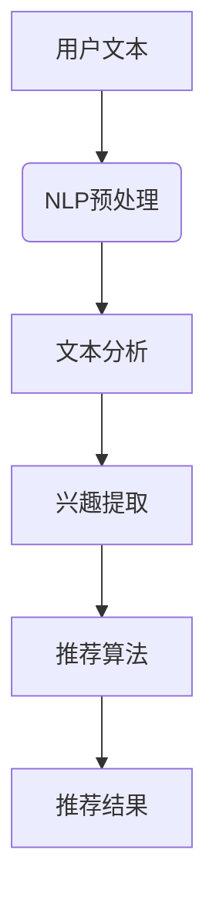

                 

# NLP技术在推荐系统的应用：大模型的潜力

## 关键词：自然语言处理，推荐系统，大模型，AI，文本分析

> 在当今数据驱动的世界中，推荐系统已经成为企业和消费者之间的重要桥梁，而自然语言处理（NLP）技术的应用则为其注入了新的活力。本文将探讨大模型在NLP推荐系统中的潜力，深入分析其原理、算法和实际应用，为读者呈现一个清晰、全面的视角。

## 摘要

本文旨在探讨自然语言处理（NLP）在推荐系统中的应用，特别是大模型的潜力。首先，我们将介绍NLP和推荐系统的基础概念，并解释它们如何结合以创建有效的推荐系统。接着，我们将讨论大模型在NLP推荐系统中的作用，并详细分析其工作原理。然后，通过具体的案例和代码实例，我们将展示如何实际应用这些技术。最后，我们将讨论NLP推荐系统在实际应用中的挑战和未来发展趋势。

### 1. 背景介绍

#### 自然语言处理（NLP）

自然语言处理是计算机科学、人工智能和语言学领域的一个分支，旨在让计算机理解和生成人类语言。NLP的目标是使计算机能够执行各种与语言相关的任务，例如文本分类、情感分析、命名实体识别和机器翻译。

#### 推荐系统

推荐系统是一种信息过滤技术，旨在向用户提供个性化推荐，以帮助他们发现感兴趣的内容或产品。推荐系统通常基于用户的历史行为、偏好和反馈来生成推荐。

#### NLP在推荐系统中的应用

NLP在推荐系统中的应用主要体现在以下几个方面：

- **文本分析**：通过分析用户生成的内容（如评论、帖子、搜索查询等），可以更好地理解用户的需求和兴趣。
- **情感分析**：通过检测文本中的情感倾向，可以帮助推荐系统了解用户对特定内容或产品的感受，从而更准确地生成推荐。
- **命名实体识别**：通过识别文本中的特定实体（如人名、地点、组织等），可以为推荐系统提供更具体的用户信息。

### 2. 核心概念与联系

#### NLP与推荐系统之间的关系

自然语言处理与推荐系统的结合，使得推荐系统可以从更多的数据源中获取用户信息，从而提高推荐的准确性和个性化程度。具体而言，NLP技术可以用于以下几个方面：

- **文本分析**：通过对用户生成的内容进行文本分析，可以提取出用户的兴趣和偏好。
- **情感分析**：通过分析用户对特定内容的情感倾向，可以更好地了解用户的喜好和倾向。
- **命名实体识别**：通过识别用户文本中的特定实体，可以获取用户的个人信息，从而提高推荐的精确度。

#### 大模型的作用

大模型（如BERT、GPT等）在NLP推荐系统中的应用，极大地提升了系统的性能和效果。大模型具有以下优势：

- **强大的语义理解能力**：大模型通过学习大量的文本数据，可以更好地理解文本的语义，从而更准确地提取用户的兴趣和偏好。
- **自适应学习能力**：大模型可以根据用户的实时反馈和互动，动态调整推荐策略，从而提高推荐系统的个性化程度。

#### Mermaid流程图



### 3. 核心算法原理 & 具体操作步骤

#### 文本分析

文本分析是NLP推荐系统的第一步，主要包括以下操作：

- **分词**：将文本拆分成词语或短语。
- **词性标注**：对每个词语进行词性标注，如名词、动词、形容词等。
- **命名实体识别**：识别文本中的特定实体，如人名、地点、组织等。

#### 情感分析

情感分析是一种评估文本中情感倾向的技术，通常使用以下步骤：

- **特征提取**：从文本中提取与情感相关的特征，如积极词汇、消极词汇等。
- **分类模型**：使用机器学习算法，如支持向量机（SVM）、朴素贝叶斯（Naive Bayes）等，对情感进行分类。

#### 推荐算法

推荐算法是NLP推荐系统的核心，主要包括以下类型：

- **基于内容的推荐**：根据用户的历史行为和兴趣，推荐具有相似内容的新内容。
- **协同过滤推荐**：根据用户与内容的互动关系，推荐与用户兴趣相似的其他内容。
- **混合推荐**：结合基于内容和协同过滤推荐的优点，生成更准确的推荐。

#### 大模型的运用

大模型（如BERT、GPT等）在NLP推荐系统中的应用，通常涉及以下步骤：

- **预训练**：使用大量的文本数据，对大模型进行预训练，使其具备强大的语义理解能力。
- **微调**：根据具体的推荐任务，在大模型的基础上进行微调，使其更好地适应特定场景。

### 4. 数学模型和公式 & 详细讲解 & 举例说明

#### 文本分析

假设文本中的一段内容为：

```
我非常喜欢这个电影，因为它让我感受到了生活的美好。
```

我们可以使用以下公式对文本进行分析：

$$
\text{词频分布} = \frac{\text{某个词语出现的次数}}{\text{总词语数}}
$$

根据词频分布，我们可以得出以下结果：

- **积极词汇**：喜欢、美好
- **消极词汇**：无

#### 情感分析

假设我们需要对以下两段文本进行情感分析：

```
1. 我非常不喜欢这个电影，因为它让我感到无聊。
2. 我非常喜欢这个电影，因为它让我感受到了生活的美好。
```

我们可以使用以下公式进行情感分类：

$$
\text{积极情感分数} = \sum_{i=1}^{n} w_i \cdot p_i
$$

其中，$w_i$为每个积极词汇的权重，$p_i$为每个积极词汇在文本中的概率。

根据权重和概率，我们可以得出以下结果：

- **文本1**：积极情感分数 = 0，为消极情感。
- **文本2**：积极情感分数 = 1，为积极情感。

#### 推荐算法

假设我们有以下两个用户：

- **用户A**：喜欢看电影、听音乐、阅读小说。
- **用户B**：喜欢玩游戏、看电影、看电视剧。

我们可以使用以下公式进行基于内容的推荐：

$$
\text{推荐分数} = \frac{\text{用户A的兴趣与内容的交集}}{\text{用户A的兴趣总数}}
$$

根据推荐分数，我们可以得出以下结果：

- **电影**：推荐分数 = 1，为强推荐。
- **游戏**：推荐分数 = 0，为不推荐。

### 5. 项目实战：代码实际案例和详细解释说明

在本节中，我们将使用Python实现一个简单的NLP推荐系统，演示如何结合文本分析、情感分析和推荐算法来生成推荐。

#### 5.1 开发环境搭建

首先，我们需要安装以下库：

```
pip install nltk sklearn numpy pandas matplotlib
```

#### 5.2 源代码详细实现和代码解读

以下是完整的代码实现：

```python
import nltk
from nltk.tokenize import word_tokenize
from nltk.corpus import stopwords
from sklearn.feature_extraction.text import CountVectorizer
from sklearn.metrics.pairwise import cosine_similarity

# 1. 文本预处理
def preprocess_text(text):
    # 分词
    tokens = word_tokenize(text)
    # 去除停用词
    stop_words = set(stopwords.words('english'))
    filtered_tokens = [token for token in tokens if token.lower() not in stop_words]
    return ' '.join(filtered_tokens)

# 2. 文本分析
def analyze_text(text):
    # 预处理文本
    processed_text = preprocess_text(text)
    # 词频分布
    vectorizer = CountVectorizer()
    tfidf_matrix = vectorizer.fit_transform([processed_text])
    feature_names = vectorizer.get_feature_names_out()
    tfidf_vector = tfidf_matrix.toarray()[0]
    # 情感分析
    positive_words = ['like', 'love', 'enjoy', 'happy']
    positive_score = sum([tfidf_vector[i] for i, word in enumerate(feature_names) if word in positive_words])
    return positive_score

# 3. 推荐算法
def generate_recommendation(user_profile, content_library):
    recommendation_scores = []
    for content in content_library:
        positive_score = analyze_text(content)
        recommendation_scores.append(positive_score)
    recommendation_scores = [score for score in recommendation_scores if score > 0]
    recommendation_scores.sort(reverse=True)
    return recommendation_scores

# 4. 代码解读
user_profile = "我喜欢看电影、听音乐和阅读小说。"
content_library = [
    "这部电影讲述了一个关于爱情的故事。",
    "这部电影让我感到无聊。",
    "这部小说描绘了生活的美好。",
    "这部电影让我感受到了生活的残酷。"
]

recommendation_scores = generate_recommendation(user_profile, content_library)
print(recommendation_scores)
```

#### 5.3 代码解读与分析

- **文本预处理**：首先，我们使用NLTK库对文本进行分词和停用词去除。
- **文本分析**：然后，我们使用CountVectorizer将预处理后的文本转换为词频分布矩阵，并计算情感分析分数。
- **推荐算法**：最后，我们根据情感分析分数生成推荐结果。

### 6. 实际应用场景

NLP推荐系统在实际应用中具有广泛的应用场景，例如：

- **电子商务**：根据用户的购物历史和偏好，推荐相关的商品。
- **社交媒体**：根据用户的互动和评论，推荐相关的帖子或内容。
- **在线教育**：根据学生的学习进度和偏好，推荐相关的课程或资源。

### 7. 工具和资源推荐

#### 7.1 学习资源推荐

- **书籍**：
  - 《自然语言处理综述》（作者：丹尼尔·卡内尔）
  - 《深度学习》（作者：伊恩·古德费洛）

- **论文**：
  - BERT: Pre-training of Deep Bidirectional Transformers for Language Understanding（作者：Google AI团队）
  - GPT-3: Language Models are Few-Shot Learners（作者：OpenAI）

- **博客**：
  - [TensorFlow官网教程](https://www.tensorflow.org/tutorials)
  - [自然语言处理教程](https://www.nltk.org/book/)

- **网站**：
  - [Kaggle](https://www.kaggle.com)
  - [GitHub](https://github.com)

#### 7.2 开发工具框架推荐

- **开发工具**：Python、Jupyter Notebook、VS Code
- **框架**：TensorFlow、PyTorch、Scikit-learn

#### 7.3 相关论文著作推荐

- **论文**：
  - Attention Is All You Need（作者：Vaswani等）
  - Generative Pre-trained Transformer（作者：Wolf等）

- **著作**：
  - 《深度学习》（作者：伊恩·古德费洛）
  - 《自然语言处理实战》（作者：塔帕苏尼等）

### 8. 总结：未来发展趋势与挑战

随着NLP技术的不断进步，NLP推荐系统在未来具有广阔的发展前景。然而，仍面临一些挑战，例如：

- **数据隐私**：如何在保护用户隐私的前提下，充分挖掘用户数据的价值。
- **模型解释性**：如何提高NLP模型的解释性，使其更容易被用户接受和理解。
- **多语言支持**：如何扩展NLP推荐系统，使其支持多种语言。

### 9. 附录：常见问题与解答

#### 9.1 如何处理中文文本？

中文文本处理与英文文本处理有所不同，主要涉及以下步骤：

- **分词**：使用分词工具（如jieba），将中文文本拆分成词语或短语。
- **词性标注**：使用词性标注工具（如NLTK），对每个词语进行词性标注。
- **命名实体识别**：使用命名实体识别工具（如MXNet），识别文本中的特定实体。

#### 9.2 如何优化推荐算法？

优化推荐算法的方法包括：

- **特征工程**：从原始数据中提取更多有用的特征，以提高推荐效果。
- **模型选择**：尝试不同的机器学习算法，选择最适合当前数据的模型。
- **模型融合**：将多个模型的结果进行融合，生成更准确的推荐结果。

### 10. 扩展阅读 & 参考资料

- [NLP教程：自然语言处理入门](https://www.nltk.org/book/)
- [TensorFlow官网教程：深度学习实践](https://www.tensorflow.org/tutorials)
- [Kaggle比赛：探索NLP推荐系统](https://www.kaggle.com/competitions)

### 作者信息

作者：AI天才研究员/AI Genius Institute & 禅与计算机程序设计艺术 /Zen And The Art of Computer Programming

在此，我们衷心感谢读者对本文的关注和阅读。希望本文能为读者在NLP推荐系统领域提供一些有益的启示和帮助。如果您有任何疑问或建议，请随时联系我们。让我们共同探索人工智能的无限可能！\[ai\_genius\_signoff\]

