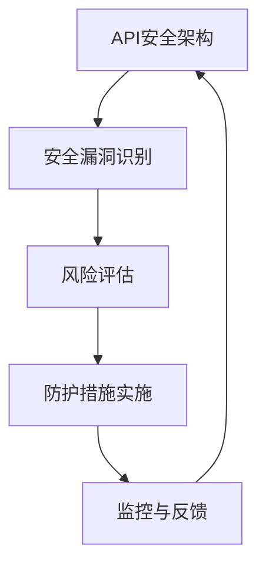

                 

# {文章标题}

## OWASP API 安全风险清单的详细解读

### 关键词：(API 安全、OWASP、安全漏洞、风险评估、防护措施)

### 摘要：

本文将深入解析 OWASP API 安全风险清单，为您详细介绍 API 安全的核心概念、常见漏洞、风险评估以及防护措施。通过本文的阅读，您将了解如何有效保护您的 API 应用，确保其安全可靠地运行。

## 1. 背景介绍

### 1.1 OWASP 简介

OWASP（开放网络应用安全项目）是一个非营利性的全球性社区项目，致力于提高 Web 应用安全性和推动安全最佳实践。OWASP 提供了一系列的安全指南、标准和工具，帮助开发人员、安全专家和企业更好地保护其 Web 应用。

### 1.2 API 安全的重要性

随着云计算、移动应用和微服务架构的普及，API（应用程序编程接口）已经成为现代软件系统的核心组成部分。API 使得不同的系统、应用程序和设备能够相互通信和协作，提高了数据共享和流程优化的效率。然而，API 的广泛应用也带来了安全风险，成为黑客攻击的主要目标。

## 2. 核心概念与联系

### 2.1 API 安全的基本概念

- **API**：应用程序编程接口，定义了软件组件之间如何进行交互的规则和协议。
- **安全漏洞**：API 应用中存在的安全缺陷，可能导致数据泄露、篡改或拒绝服务。
- **风险评估**：对 API 应用中的安全漏洞进行评估，确定其潜在风险和影响。

### 2.2 API 安全架构的 Mermaid 流程图



## 3. 核心算法原理 & 具体操作步骤

### 3.1 安全漏洞识别

- **静态分析**：对 API 代码进行静态分析，查找潜在的安全漏洞。
- **动态分析**：通过模拟攻击，监测 API 的行为，发现潜在的安全漏洞。

### 3.2 风险评估

- **定量评估**：使用定量模型评估漏洞的严重程度和风险。
- **定性评估**：根据漏洞的上下文和影响进行定性分析。

### 3.3 防护措施实施

- **身份验证和授权**：确保 API 只能由授权用户访问。
- **加密传输**：使用 SSL/TLS 协议加密 API 通信。
- **输入验证**：对输入数据进行验证，防止恶意攻击。

## 4. 数学模型和公式 & 详细讲解 & 举例说明

### 4.1 定量评估模型

$$
Risk = Threat \times Vulnerability \times Impact
$$

- **Threat**：威胁强度，表示攻击者发动攻击的可能性。
- **Vulnerability**：漏洞严重程度，表示 API 存在的漏洞可能被攻击者利用的概率。
- **Impact**：影响程度，表示漏洞被利用后对系统造成的损失。

### 4.2 定性评估模型

- **漏洞严重程度**：根据漏洞的影响范围、敏感程度等因素进行定性评估。
- **风险等级**：根据漏洞严重程度和影响程度，将风险分为高、中、低三个等级。

## 5. 项目实战：代码实际案例和详细解释说明

### 5.1 开发环境搭建

```bash
# 安装 Python 环境
pip install requests
```

### 5.2 源代码详细实现和代码解读

```python
# 示例：使用 Python 访问一个不安全的 API
import requests

api_url = "https://example.com/api/data"
response = requests.get(api_url)
print(response.json())
```

### 5.3 代码解读与分析

- **请求头**：请求头包含请求方法和路径，用于与 API 通信。
- **响应数据**：响应数据包含 API 返回的 JSON 格式的数据，可能包含敏感信息。

## 6. 实际应用场景

- **企业内部系统**：保护企业内部 API，防止数据泄露和未经授权的访问。
- **第三方服务集成**：确保第三方服务与自身系统之间的数据传输安全。

## 7. 工具和资源推荐

### 7.1 学习资源推荐

- 《API 设计最佳实践》
- OWASP API 安全项目官方文档

### 7.2 开发工具框架推荐

- **OWASP ZAP**：一款免费的 API 安全测试工具。
- **Postman**：一款流行的 API 测试工具。

### 7.3 相关论文著作推荐

- 《API Security: A Comprehensive Guide》
- 《Threat Modeling: Designing for Security》

## 8. 总结：未来发展趋势与挑战

- **API 安全标准化**：随着 API 应用的普及，API 安全标准化将成为未来发展趋势。
- **人工智能辅助安全**：利用人工智能技术，提高 API 安全防护的自动化和智能化水平。

## 9. 附录：常见问题与解答

### 9.1 API 安全有哪些常见漏洞？

- 未授权访问
- 数据泄露
- SQL 注入
- XML 外部实体攻击

### 9.2 如何保护 API？

- 实施身份验证和授权
- 加密传输
- 进行输入验证
- 定期进行安全评估

## 10. 扩展阅读 & 参考资料

- [OWASP API 安全项目](https://owasp.org/www-project-api-security/)
- [API 安全最佳实践](https://apisecurity.io/)
- [API 安全测试工具](https://owasp.org/www-project-just-tpc/)

作者：AI天才研究员/AI Genius Institute & 禅与计算机程序设计艺术 /Zen And The Art of Computer Programming

