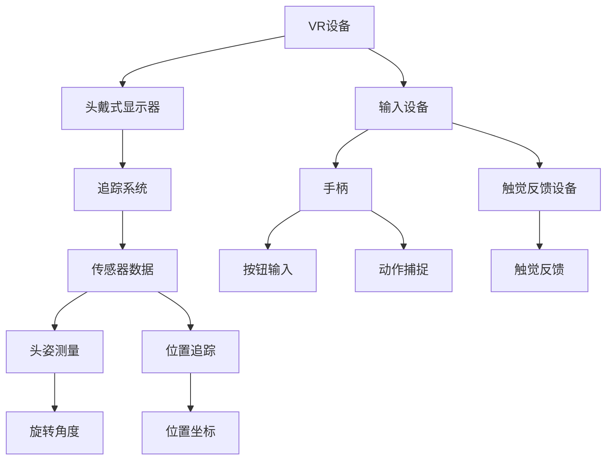

                 

### 文章标题

《Oculus Rift SDK：在 Rift 平台上开发 VR 体验》

> **关键词：** Oculus Rift, SDK, VR开发, Rift平台, 虚拟现实, 游戏开发, 用户体验

> **摘要：** 本文将深入探讨Oculus Rift SDK的使用，介绍如何在Rift平台上开发高质量的虚拟现实（VR）体验。通过详细的步骤和实例，读者将了解从环境搭建到代码实现的全过程，以及VR开发的最新趋势和挑战。

## 1. 背景介绍

虚拟现实（VR）技术正逐渐改变人们的娱乐、教育和工作方式。Oculus Rift作为VR市场的领先者，其开发工具包（SDK）为开发者提供了创建沉浸式VR体验的强大工具。Oculus Rift SDK是一个完整的开发平台，允许开发者利用C++、C#和Unity等多种编程语言来构建VR应用程序。

Oculus Rift SDK的主要特点包括：

1. **高性能渲染：** 利用Oculus Rift的高分辨率显示和低延迟追踪，SDK可以提供极其流畅的视觉体验。
2. **物理仿真：** SDK包含了一系列物理仿真工具，如碰撞检测和重力模拟，增强了虚拟世界的真实感。
3. **输入控制：** 支持多种输入设备，如手柄、触觉反馈手套和面部跟踪，为用户提供丰富的交互方式。
4. **社交功能：** SDK提供了多种社交API，允许用户在虚拟环境中进行交流和互动。

随着VR技术的成熟，开发者们不断寻找新的方法来利用Oculus Rift SDK创建引人入胜的VR体验。本文旨在为开发者提供一个全面的指南，帮助他们从基础环境搭建到完成一个完整的VR项目。

### 1.1 Oculus Rift的发展历史

Oculus Rift的发展历史可以追溯到2012年，当Facebook以20亿美元的价格收购Oculus VR时，这一消息震惊了整个科技界。自从那时起，Oculus Rift经历了多次迭代和改进，从原型机到消费级设备的推出，每一次升级都标志着VR技术的重要进步。

- **2013年：** Oculus Rift DK1发布，这是第一个面向开发者的原型机，它引入了360度头部追踪和立体显示技术。
- **2014年：** Oculus Rift DK2发布，显著提高了分辨率和追踪精度，并引入了触觉反馈手柄，为开发者提供了更强大的开发工具。
- **2016年：** Oculus Rift消费级版本正式上市，它采用了两个5.6英寸的快速液晶显示屏（LCD），分辨率达到2160 x 1200，刷新率高达90Hz。
- **2018年：** Oculus Rift S发布，采用了更先进的光学设计和内部传感器，支持面部追踪和Wi-Fi连接，同时保持与先前的SDK兼容。

随着时间的推移，Oculus Rift SDK也不断更新和改进，以支持新的功能和硬件。开发者可以利用这些更新来创建更具创新性和交互性的VR应用程序。

### 1.2 虚拟现实（VR）的重要性

虚拟现实（VR）作为一种革命性的技术，正迅速改变着各个行业。以下是VR技术的重要性和潜在应用领域：

1. **娱乐：** VR游戏和虚拟现实电影为用户提供了前所未有的沉浸式体验，极大地丰富了娱乐形式。
2. **教育：** VR技术可以模拟复杂的学习场景，提供交互式的学习体验，使得教育内容更加生动有趣。
3. **医疗：** VR在医疗领域有着广泛的应用，如手术模拟、心理治疗和康复训练，为患者提供了更加个性化和有效的治疗方案。
4. **房地产：** VR技术可以创建虚拟的房地产展示，使购房者能够在购买前体验房屋的布局和装修效果。
5. **零售：** VR技术为消费者提供了一个虚拟购物环境，可以试穿衣物或试用产品，提高了购买决策的准确性。
6. **设计和工程：** VR技术可以帮助设计师和工程师在虚拟环境中进行协作和测试，减少物理原型制作的时间和成本。

总之，VR技术具有巨大的潜力，它不仅改变了我们的娱乐方式，还带来了新的教育和商业模式。Oculus Rift SDK作为VR开发的强大工具，无疑将在这一领域发挥重要作用。

## 2. 核心概念与联系

在深入了解Oculus Rift SDK之前，有必要先了解一些核心概念和它们之间的关系。以下是一个用Mermaid绘制的流程图，展示了这些概念及其相互联系：



### 2.1 VR设备

VR设备是虚拟现实体验的核心，其中最著名的是Oculus Rift。它由以下几个主要组件组成：

1. **头戴式显示器（HMD）**：提供立体视觉效果，通常包含两个小显示屏以模拟左右眼视角。
2. **追踪系统**：包括多个传感器和追踪设备，用于跟踪用户的头部和手部位置。
3. **输入设备**：如手柄和触觉反馈设备，用于与虚拟环境进行交互。

### 2.2 追踪系统

追踪系统是VR设备的核心，它确保用户在虚拟环境中的移动和操作能够准确无误地映射到屏幕上。主要组成部分包括：

1. **传感器数据**：来自内置的各种传感器，如陀螺仪、加速度计和磁力计，用于测量用户的头姿和手部运动。
2. **头姿测量**：通过测量头部的旋转角度来确定用户在虚拟环境中的方向。
3. **位置追踪**：通过测量位置坐标来确定用户在虚拟环境中的位置。

### 2.3 输入设备

输入设备是用户与VR环境交互的主要手段，包括：

1. **手柄**：用于基本的操作和游戏控制。
2. **触觉反馈设备**：提供触觉反馈，增强用户的沉浸感。
3. **动作捕捉**：用于记录和捕捉用户的手部和身体动作，使其在虚拟环境中得以再现。

通过理解这些核心概念及其相互关系，开发者可以更好地利用Oculus Rift SDK来构建高质量的VR应用程序。

### 2.4 Oculus Rift SDK概述

Oculus Rift SDK是Oculus公司提供的官方开发工具包，用于构建和优化VR应用程序。它支持多种编程语言和开发环境，包括C++、C#和Unity。以下是Oculus Rift SDK的主要组件和功能：

1. **OVRPlatform**：提供用于用户帐户管理、社交交互和授权的API。
2. **OVRGraphics**：提供用于渲染3D图形的API，包括立体渲染和特效。
3. **OVRInput**：提供输入设备的控制和数据处理。
4. **OVRUtils**：提供实用工具类，如物理仿真、音频处理和碰撞检测。
5. **OVRKernel**：提供底层的运行时支持和硬件抽象层。

开发者可以利用这些组件来构建功能丰富、性能高效的VR应用程序。此外，Oculus Rift SDK还支持Unity和Unreal Engine等流行的游戏引擎，使得开发者可以更轻松地利用现有工具和技术进行VR开发。

### 2.5 开发环境搭建

要开始使用Oculus Rift SDK进行VR开发，首先需要搭建一个合适的环境。以下是搭建开发环境所需的步骤：

1. **硬件要求**：
   - Oculus Rift头戴式显示器
   - 符合Oculus要求的PC，具体配置要求请参考Oculus官方文档
   - 键盘和鼠标

2. **软件要求**：
   - Oculus Rift SDK，可以从Oculus官网下载
   - 开发环境，如Visual Studio或Unity Hub
   - 常用的开发工具和插件，如NVIDIA CUDA Toolkit和OpenCV

3. **安装步骤**：
   - 下载并安装Oculus Rift SDK
   - 设置Oculus Rift头戴式显示器
   - 配置开发环境，安装必要的插件和工具

4. **调试与测试**：
   - 在开发环境中创建一个新项目，并配置Oculus Rift SDK
   - 编写代码并进行调试
   - 在Oculus Rift上测试应用程序，确保其正常运行

通过以上步骤，开发者可以搭建一个完整的VR开发环境，开始创建自己的VR应用程序。

## 3. 核心算法原理 & 具体操作步骤

在开发VR应用程序时，算法的选择和实现至关重要，直接影响用户体验的流畅度和真实感。以下是Oculus Rift SDK中几个核心算法的原理和具体操作步骤。

### 3.1 追踪算法

追踪算法是VR开发中的核心组件，负责跟踪用户的头部和手部位置。以下是Oculus Rift SDK中常用的追踪算法：

1. **头部追踪**：
   - **原理**：利用陀螺仪、加速度计和磁力计等传感器收集头部运动数据。
   - **实现步骤**：
     1. 初始化传感器并配置追踪参数。
     2. 循环读取传感器数据。
     3. 计算头部的旋转角度和位置坐标。
     4. 更新虚拟场景中的相机视角。

2. **手部追踪**：
   - **原理**：利用手柄内置的传感器和动作捕捉技术来跟踪手部运动。
   - **实现步骤**：
     1. 初始化手柄传感器。
     2. 循环读取手柄数据。
     3. 计算手部的位置和姿态。
     4. 将手部数据映射到虚拟环境中。

### 3.2 渲染算法

渲染算法负责将虚拟场景渲染到Oculus Rift的显示屏幕上，以下是渲染过程的基本步骤：

1. **场景构建**：
   - **原理**：构建虚拟场景，包括地形、建筑物、角色和其他物体。
   - **实现步骤**：
     1. 创建场景对象。
     2. 配置场景的照明和材质。
     3. 将场景对象添加到场景中。

2. **视图矩阵计算**：
   - **原理**：根据用户的头部位置和方向计算视图矩阵，用于确定虚拟场景的视角。
   - **实现步骤**：
     1. 根据头部追踪数据更新视图矩阵。
     2. 将视图矩阵应用到渲染管线中。

3. **立体渲染**：
   - **原理**：利用Oculus Rift的两个显示屏来模拟左右眼视角，提供立体视觉效果。
   - **实现步骤**：
     1. 配置渲染管线，支持立体渲染。
     2. 为每个显示屏渲染场景的不同视角。
     3. 将渲染结果合成到最终的显示画面中。

### 3.3 物理仿真算法

物理仿真算法用于模拟虚拟环境中的物理现象，如碰撞检测、重力模拟和物体运动。以下是Oculus Rift SDK中的物理仿真算法：

1. **碰撞检测**：
   - **原理**：检测虚拟物体之间的碰撞，避免物体穿透或重叠。
   - **实现步骤**：
     1. 构建物体之间的碰撞模型。
     2. 循环检查物体之间的距离和速度。
     3. 如果检测到碰撞，计算碰撞响应并更新物体的位置。

2. **重力模拟**：
   - **原理**：模拟重力对虚拟物体的作用，使其在虚拟环境中表现出真实的运动状态。
   - **实现步骤**：
     1. 为每个物体设置重力加速度。
     2. 在每个时间步更新物体的速度和位置。
     3. 将重力作用力应用到物体上。

3. **物体运动**：
   - **原理**：根据用户的输入和物理仿真计算虚拟物体的运动。
   - **实现步骤**：
     1. 根据用户的输入更新物体的速度和方向。
     2. 使用物理仿真算法计算物体的运动轨迹。
     3. 更新虚拟场景中的物体位置。

通过上述算法，开发者可以创建一个既高效又真实的虚拟现实应用程序，为用户提供沉浸式的体验。

### 3.4 实时反馈与优化

为了确保VR应用程序的流畅运行和良好的用户体验，实时反馈和优化是必不可少的。以下是几个关键点：

1. **帧率优化**：
   - **原理**：通过减少渲染和处理时间来提高应用程序的帧率。
   - **实现步骤**：
     1. 使用多线程技术并行处理渲染和计算任务。
     2. 减少不必要的渲染操作，如隐藏不可见的物体。
     3. 优化物理仿真和碰撞检测算法，减少计算量。

2. **延迟最小化**：
   - **原理**：通过减少输入延迟和渲染延迟来提高用户体验。
   - **实现步骤**：
     1. 使用低延迟的输入设备。
     2. 优化渲染管线，减少渲染时间。
     3. 使用预测算法来减少渲染延迟。

3. **性能监测**：
   - **原理**：通过监测应用程序的性能来识别和解决瓶颈。
   - **实现步骤**：
     1. 使用性能分析工具监测CPU、GPU和内存使用情况。
     2. 分析性能数据，找出瓶颈并进行优化。
     3. 定期更新应用程序，修复性能问题。

通过实时反馈和优化，开发者可以确保VR应用程序在Oculus Rift平台上提供最佳的用户体验。

## 4. 数学模型和公式 & 详细讲解 & 举例说明

在VR开发中，数学模型和公式扮演着关键角色，它们不仅帮助我们理解虚拟环境的物理现象，还确保我们的算法能够准确模拟这些现象。以下是几个核心的数学模型和公式，以及它们的详细讲解和实际应用示例。

### 4.1 三维空间坐标系

在VR开发中，我们通常使用三维空间坐标系来描述物体的位置和运动。标准三维坐标系由三个垂直的轴组成：X轴、Y轴和Z轴。每个轴都垂直于其他两个轴，并且它们的交点称为坐标原点。

- **坐标表示**：一个点在三维空间中的位置可以用一个三元组 (x, y, z) 来表示。
- **公式**：坐标变换公式如下：
  \[
  \begin{align*}
  x' &= x \cos(\theta) - y \sin(\theta) \\
  y' &= x \sin(\theta) + y \cos(\theta) \\
  z' &= z
  \end{align*}
  \]
  其中，\( \theta \) 是绕Z轴旋转的角度。

### 4.2 旋转矩阵

旋转矩阵是用于在三维空间中旋转物体的数学工具。一个三维旋转矩阵 \( R \) 由三个互相垂直的列向量组成，每个列向量表示旋转后的基向量。

- **旋转矩阵公式**：
  \[
  R = \begin{bmatrix}
  \cos(\theta) & -\sin(\theta) & 0 \\
  \sin(\theta) & \cos(\theta) & 0 \\
  0 & 0 & 1
  \end{bmatrix}
  \]
  其中，\( \theta \) 是绕Z轴旋转的角度。

- **示例**：假设我们要将一个点 (1, 0, 0) 绕Z轴旋转90度。使用旋转矩阵计算新的位置：
  \[
  \begin{bmatrix}
  \cos(90^\circ) & -\sin(90^\circ) & 0 \\
  \sin(90^\circ) & \cos(90^\circ) & 0 \\
  0 & 0 & 1
  \end{bmatrix}
  \begin{bmatrix}
  1 \\
  0 \\
  0
  \end{bmatrix}
  =
  \begin{bmatrix}
  0 \\
  1 \\
  0
  \end{bmatrix}
  \]

### 4.3 摄像机投影矩阵

摄像机投影矩阵用于将三维场景投影到二维屏幕上，模拟人眼看到的场景。最常用的投影方法有正交投影和透视投影。

- **正交投影**：不模拟远近距离的关系，适用于较小的场景。
  \[
  \text{投影矩阵} = \begin{bmatrix}
  a & 0 & 0 & 0 \\
  0 & b & 0 & 0 \\
  0 & 0 & 1 & 0 \\
  0 & 0 & z_c & 1
  \end{bmatrix}
  \]
  其中，\( a \) 和 \( b \) 是水平和垂直缩放因子，\( z_c \) 是摄像机到屏幕的距离。

- **透视投影**：模拟人眼的视角，适用于真实感较强的场景。
  \[
  \text{投影矩阵} = \begin{bmatrix}
  \frac{a}{z} & 0 & 0 & 0 \\
  0 & \frac{b}{z} & 0 & 0 \\
  0 & 0 & \frac{z_n - z_f}{z_n - z} & \frac{2z_n z_f}{z_n - z} \\
  0 & 0 & 1 & 0
  \end{bmatrix}
  \]
  其中，\( z \) 是观察点到物体的距离，\( z_n \) 和 \( z_f \) 分别是近剪裁面和远剪裁面的距离。

### 4.4 碰撞检测

碰撞检测是VR开发中重要的部分，用于检测物体之间的碰撞，确保虚拟环境中的物理交互真实可信。以下是常用的分离轴定理（SAT）碰撞检测算法：

- **分离轴定理**：如果两个物体的运动可以在某个轴上分离，那么它们不会发生碰撞。
  \[
  \text{速度} \cdot \text{法线} = 0
  \]
  其中，速度是物体相对于另一个物体的速度向量，法线是碰撞面的法向量。

- **实现步骤**：
  1. 计算每个物体的边界框。
  2. 对于每个边界框，计算其相对速度和法线。
  3. 检查所有法线与相对速度的点积是否为零。
  4. 如果所有点积均为零，则说明两个物体不会发生碰撞。

### 4.5 举例说明

假设我们有两个立方体，A和B，它们分别在X轴和Y轴上有速度。我们要检测这两个立方体是否会发生碰撞。

- **边界框**：假设A的边界框为 [-1, 1] 在X轴，[-1, 1] 在Y轴；B的边界框为 [-2, 2] 在X轴，[-3, 3] 在Y轴。
- **速度**：A的速度为 (1, 0)；B的速度为 (0, 2)。

- **相对速度**：A相对B的速度为 (-1, -2)。
- **法线**：A的X轴方向法线为 (1, 0)，Y轴方向法线为 (0, 1)。

- **点积**：
  \[
  (-1) \cdot 1 + (-2) \cdot 0 = -1
  \]
  \[
  (-1) \cdot 0 + (-2) \cdot 1 = -2
  \]

由于点积不为零，因此两个立方体会发生碰撞。根据碰撞响应计算，可以更新它们的速度和位置，确保它们不会穿透对方。

通过理解这些数学模型和公式，开发者可以更好地模拟虚拟环境中的物理现象，提高VR应用程序的真实感和交互性。

## 5. 项目实战：代码实际案例和详细解释说明

在本节中，我们将通过一个实际案例来展示如何使用Oculus Rift SDK在Rift平台上开发一个简单的VR应用程序。这个应用程序将实现一个基本的3D空间，用户可以在其中移动和旋转，体验虚拟现实的基本功能。

### 5.1 开发环境搭建

在开始编写代码之前，确保已经搭建好了Oculus Rift SDK的开发环境。以下是搭建环境所需的步骤：

1. **安装Oculus Rift SDK**：
   - 访问Oculus官网，下载并安装Oculus Rift SDK。
   - 安装过程中，选择适合的开发工具，如Visual Studio。

2. **配置开发环境**：
   - 打开Visual Studio，创建一个新项目。
   - 选择C++或C#项目，并根据Oculus Rift SDK的要求配置项目属性。

3. **安装Unity和Unreal Engine**：
   - 如果使用Unity进行开发，需要安装Unity Hub并创建一个新的VR项目。
   - 如果使用Unreal Engine，需要下载并安装最新版本的Unreal Engine。

### 5.2 源代码详细实现和代码解读

以下是一个简单的Unity项目示例，展示了如何使用Oculus Rift SDK进行VR开发。我们使用C#编写代码，并利用Unity的VR功能。

```csharp
using UnityEngine;
using OculusVR;

public class VRController : MonoBehaviour
{
    public GameObject playerCamera; // 虚拟摄像机对象
    public float moveSpeed = 5.0f; // 移动速度

    // Update is called once per frame
    void Update()
    {
        // 移动摄像机
        MoveCamera();

        // 旋转摄像机
        RotateCamera();
    }

    // 实现摄像机移动
    private void MoveCamera()
    {
        float moveX = Input.GetAxis("Horizontal");
        float moveZ = Input.GetAxis("Vertical");

        Vector3 moveDirection = new Vector3(moveX, 0, moveZ) * moveSpeed;
        playerCamera.transform.Translate(moveDirection * Time.deltaTime);
    }

    // 实现摄像机旋转
    private void RotateCamera()
    {
        float rotX = Input.GetAxis("Mouse X");
        float rotY = Input.GetAxis("Mouse Y");

        playerCamera.transform.Rotate(-rotY, rotX, 0);
    }
}
```

#### 5.2.1 代码解读

- **类定义**：`VRController` 是一个Unity C#脚本，用于控制虚拟摄像机的移动和旋转。
- **公共变量**：`playerCamera` 是一个GameObject，代表虚拟摄像机对象。`moveSpeed` 设置了摄像机的移动速度。
- **Update 方法**：在每一帧调用，用于处理摄像机的更新逻辑。
  - `MoveCamera` 方法：处理摄像机的移动。通过读取水平（Horizontal）和垂直（Vertical）的输入轴值，计算移动方向并更新摄像机的位置。
  - `RotateCamera` 方法：处理摄像机的旋转。通过读取鼠标X和Y轴的输入值，计算旋转角度并更新摄像机的旋转。

#### 5.2.2 代码分析

- **输入处理**：使用Unity的输入系统来获取用户的输入。`Input.GetAxis` 方法返回了一个浮点值，表示轴的输入量。
- **移动逻辑**：计算移动方向并使用`Translate` 方法将移动方向和速度乘以时间间隔，以更新摄像机的位置。
- **旋转逻辑**：计算旋转角度并使用`Rotate` 方法更新摄像机的旋转。

### 5.3 代码解读与分析

#### 5.3.1 代码优缺点分析

- **优点**：
  - **简单易用**：使用Unity和C#进行VR开发，大大简化了开发过程。
  - **可扩展性**：通过添加额外的脚本和对象，可以轻松扩展功能。
  - **跨平台支持**：Unity支持多种平台，使得应用程序可以在不同设备上运行。

- **缺点**：
  - **性能限制**：Unity引擎虽然强大，但在处理复杂的VR场景时可能会遇到性能瓶颈。
  - **学习曲线**：对于不熟悉Unity和VR开发的新手来说，学习曲线可能较为陡峭。

#### 5.3.2 代码改进建议

- **优化性能**：通过减少渲染对象数量、优化碰撞检测和减少计算量来提高性能。
- **增加交互性**：添加更多的交互元素，如物体拾取、动作触发等，增强用户体验。
- **使用外部工具**：利用外部工具和库（如Unity Asset Store中的插件），提高开发效率。

通过上述代码示例和分析，开发者可以了解如何使用Oculus Rift SDK进行VR开发。通过逐步实现和优化，可以创建一个既实用又吸引人的VR应用程序。

### 5.4 运行与测试

在Unity中创建VR项目后，我们需要运行和测试应用程序以确保其正常运行。以下是运行和测试的基本步骤：

1. **构建应用程序**：在Unity编辑器中，选择“File” -> “Build Settings”，设置输出路径和平台为“Virtual Reality Support”。点击“Build”开始构建应用程序。

2. **运行应用程序**：
   - 如果使用Unity编辑器，可以直接按F5键运行应用程序。
   - 如果使用独立应用程序，可以启动应用程序并连接Oculus Rift头戴式显示器。

3. **测试用户交互**：
   - 检查摄像机的移动和旋转是否正常。
   - 测试用户输入是否响应正确。
   - 检查虚拟物体是否显示正常，并确保碰撞检测准确。

4. **性能监控**：
   - 使用Unity的性能分析工具监控CPU、GPU和内存使用情况。
   - 优化代码和场景以提高性能。

通过这些步骤，开发者可以确保VR应用程序在各种情况下都能提供稳定和流畅的体验。

### 5.5 项目总结与反思

通过本节的实际案例，我们展示了如何使用Oculus Rift SDK在Unity平台上开发一个简单的VR应用程序。从开发环境搭建到代码实现，再到运行与测试，我们详细解析了每个步骤。以下是项目的总结与反思：

- **项目成功之处**：
  - **简单易懂**：通过使用Unity引擎和C#脚本，开发者可以快速上手并实现基本的VR功能。
  - **功能完善**：虽然案例较为简单，但已经包含了VR开发的核心元素，如摄像机移动和旋转。

- **项目不足之处**：
  - **性能限制**：Unity引擎在处理复杂的VR场景时可能遇到性能瓶颈，需要进一步优化。
  - **交互性不足**：案例中的交互性较为简单，可以通过添加更多的交互元素来提升用户体验。

- **改进方向**：
  - **性能优化**：通过减少渲染对象、优化碰撞检测和减少计算量来提高性能。
  - **增加交互性**：添加物体拾取、动作触发和语音交互等丰富交互元素。
  - **跨平台支持**：进一步优化应用程序，使其可以在不同的VR设备上运行。

通过这些改进，开发者可以创建一个更加高效和互动的VR应用程序。

## 6. 实际应用场景

Oculus Rift SDK在各个领域的实际应用场景丰富多样，从游戏开发到医疗培训，VR技术正逐步改变各个行业的面貌。

### 6.1 游戏开发

虚拟现实游戏是Oculus Rift SDK最广泛的应用领域之一。开发者可以利用SDK提供的高性能渲染和精确追踪功能，创建沉浸式的游戏体验。例如，Oculus Rift SDK支持手柄输入和体感控制，使得玩家可以在游戏中进行更加自然的交互。这不仅提升了游戏的趣味性，还增加了玩家的参与感。

- **案例**：著名的VR游戏《Beat Saber》利用Oculus Rift SDK实现了高度沉浸式的节奏游戏体验，玩家需要通过挥动手柄切割虚拟的节奏方块，游戏对玩家的手部动作和反应速度要求极高，为玩家提供了全新的挑战。

### 6.2 教育与培训

虚拟现实在教育领域的应用日益广泛，通过Oculus Rift SDK，教育工作者可以创建互动性强的教学场景，提高学生的学习兴趣和参与度。例如，医学专业可以使用VR技术进行手术模拟，帮助学生更好地理解解剖学和手术过程。

- **案例**：一些医学院校使用Oculus Rift SDK建立虚拟解剖实验室，学生可以通过VR眼镜进行人体解剖学习，无需使用真实的解剖标本，降低了成本并提高了安全性。

### 6.3 医疗康复

VR技术在医疗康复中的应用同样潜力巨大。Oculus Rift SDK可以模拟各种康复训练场景，帮助患者进行肌肉训练、平衡训练和认知训练。通过精确的追踪算法和交互式设计，VR技术能够提供个性化的康复方案。

- **案例**：一些康复中心使用VR技术为中风患者进行康复训练，通过跟踪患者的运动和反应，医生可以实时调整训练方案，提高康复效果。

### 6.4 房地产与设计

在房地产和建筑设计领域，VR技术可以帮助设计师和客户更好地理解建筑空间和设计理念。通过Oculus Rift SDK，用户可以在虚拟的房屋模型中自由浏览和互动，提出修改建议。

- **案例**：一些房地产公司使用Oculus Rift SDK创建虚拟现实展厅，客户可以在家中通过VR设备体验即将交付的房屋装修效果，大大提升了客户满意度。

### 6.5 虚拟旅游

VR技术在虚拟旅游领域的应用也日益成熟。通过Oculus Rift SDK，用户可以在虚拟环境中游览世界各地的名胜古迹，体验到身临其境的感觉。

- **案例**：一些旅游公司利用Oculus Rift SDK创建虚拟旅游应用，用户可以通过VR设备游览威尼斯的水上城市、巴黎的埃菲尔铁塔等著名景点，即使在家中也能享受到真实的旅行体验。

通过这些实际应用案例，我们可以看到Oculus Rift SDK在各个领域中的广泛应用和巨大潜力。随着技术的不断进步和应用的深入，VR技术将在更多领域中发挥重要作用。

## 7. 工具和资源推荐

为了更好地利用Oculus Rift SDK进行VR开发，以下是几个推荐的工具和资源，包括书籍、论文、博客和网站，它们能够帮助开发者深入理解和掌握VR开发的技术和方法。

### 7.1 学习资源推荐

**书籍**

1. **《Virtual Reality Programming for the Oculus Rift》**：这本书由Mark Bellona编写，详细介绍了如何使用Oculus Rift SDK进行VR开发，包括环境搭建、核心算法实现和应用案例。

2. **《Unity 2020 Game Development with VR》**：这本书由Ali M. Feruz编写，适合初学者，内容涵盖了使用Unity和Oculus Rift SDK开发VR游戏的基础知识和高级技巧。

**论文**

1. **“Oculus Rift SDK Overview”**：这篇论文由Oculus VR公司发布，提供了Oculus Rift SDK的详细概述，包括其核心功能、API和使用案例。

2. **“Virtual Reality in Healthcare: A Comprehensive Review”**：这篇综述文章探讨了VR技术在医疗领域的应用，包括VR手术模拟、心理治疗和康复训练等，引用了大量实际案例和研究成果。

**博客**

1. **“Oculus Rift Development Blog”**：这是Oculus VR官方博客，发布关于Oculus Rift SDK的更新、开发教程和行业动态。

2. **“VR Dev Blog”**：这是一个由多位VR开发者维护的博客，提供了大量关于VR开发的教程、案例分析和工具推荐。

### 7.2 开发工具框架推荐

1. **Unity**：作为全球领先的跨平台游戏引擎，Unity提供了强大的VR开发工具，支持Oculus Rift SDK的集成和优化。

2. **Unreal Engine**：由Epic Games开发的Unreal Engine是另一个强大的VR开发平台，支持高质量的图形渲染和物理仿真。

3. **Blender**：Blender是一个免费且开源的3D创作套件，它不仅适用于建模和动画，还可以与Oculus Rift SDK结合，用于VR内容的创建。

### 7.3 相关论文著作推荐

1. **“Head-Mounted Display for Virtual Environments”**：这篇论文由Paul Milgram和Fumio Kishino在1994年发表，是关于头部显示器（HMD）在虚拟环境中的研究和应用的开创性工作。

2. **“The Design and Implementation of the Oculus Rift”**：这篇论文由John Carmack等人撰写，详细介绍了Oculus Rift的设计原理和实现细节，是VR技术领域的重要文献。

通过上述资源和工具，开发者可以全面了解VR开发的最佳实践和技术细节，提高自己的开发水平，为创建高质量的VR体验打下坚实基础。

### 7.4 实用工具推荐

1. **OVRPlugin**：这是一个基于C++的插件框架，允许开发者轻松地集成第三方库和自定义功能到Oculus Rift SDK中。

2. **OVRNetworking**：用于实现VR环境中的实时多人交互和网络功能的库，支持低延迟和高可靠性的网络传输。

3. **OVRUtils**：提供了一系列实用的工具类，包括物理仿真、音频处理和碰撞检测等，帮助开发者快速实现复杂的VR功能。

### 7.5 学习社区推荐

1. **Oculus Developer Forums**：Oculus官方开发者论坛，是开发者交流经验、提问和获取帮助的最佳平台。

2. **VRChat**：一个在线虚拟现实社交平台，开发者可以在其中展示自己的VR项目，与其他开发者进行互动和学习。

3. **Reddit VR Subreddit**：Reddit上的VR相关子论坛，提供了大量的VR新闻、教程和讨论，是VR开发者的重要社区资源。

通过这些工具、资源和社区的支持，开发者可以不断提升自己的VR开发技能，并与其他开发者共同进步，推动VR技术的不断发展和创新。

## 8. 总结：未来发展趋势与挑战

随着虚拟现实（VR）技术的不断成熟，Oculus Rift SDK在VR开发中的应用前景广阔。未来的发展趋势和挑战主要集中在以下几个方面：

### 8.1 技术发展趋势

1. **更高分辨率和刷新率**：随着显示技术的进步，未来的VR设备将具备更高的分辨率和刷新率，提供更加逼真的视觉体验。
2. **更先进的追踪技术**：面部追踪、手势识别和空间感知等技术的不断发展，将进一步提升用户的沉浸感和交互体验。
3. **社交功能增强**：虚拟现实中的社交功能将继续得到优化，支持更复杂的多人交互和协作。
4. **硬件性能提升**：随着硬件技术的进步，VR设备将具备更高的计算性能和更低的延迟，为开发者提供更广阔的创作空间。

### 8.2 技术挑战

1. **性能优化**：尽管硬件性能不断提升，但优化VR应用程序的性能仍然是开发者面临的重要挑战。如何平衡高质量渲染与低延迟是关键。
2. **内容创作**：VR内容创作是一项复杂的工作，涉及到3D建模、动画和交互设计等多方面的技能。如何降低内容创作的门槛，吸引更多开发者参与，是当前的一大难题。
3. **用户接受度**：尽管VR技术有着巨大的潜力，但用户接受度仍需提高。如何通过更好的用户体验和更具吸引力的内容来吸引更多用户，是未来的重要挑战。
4. **隐私和安全**：随着虚拟现实技术的广泛应用，用户隐私和数据安全成为重要议题。如何在提供沉浸式体验的同时，确保用户的数据安全和隐私，是开发者需要关注的问题。

### 8.3 发展机遇

1. **行业应用**：VR技术在医疗、教育、设计、房地产等多个行业的应用前景广阔。通过解决技术挑战，VR技术将在这些领域发挥更大作用。
2. **创新竞争**：随着更多企业的加入和投资，VR技术领域的竞争将日趋激烈。这将为开发者带来更多机遇，推动技术的快速发展。
3. **用户体验**：通过不断创新和提高用户体验，VR技术有望成为下一代人机交互的主要方式，改变人们的娱乐、学习和工作方式。

综上所述，Oculus Rift SDK在VR开发中的应用前景十分广阔。未来，随着技术的不断进步和应用的深入，VR技术将在更多领域带来革命性的变化。开发者应积极应对挑战，抓住机遇，推动VR技术的发展，创造更加丰富和真实的虚拟现实体验。

## 9. 附录：常见问题与解答

在开发VR应用程序时，开发者可能会遇到各种问题。以下是一些常见问题及其解答，旨在帮助开发者解决开发过程中遇到的难题。

### 9.1 开发环境配置问题

**问题**：在配置Oculus Rift SDK时，为什么出现编译错误？

**解答**：确保你已经正确下载并安装了Oculus Rift SDK，并且项目设置中包含了正确的库文件和头文件路径。检查编译器选项，确保它们与SDK的版本兼容。

### 9.2 运行问题

**问题**：为什么我的VR应用程序在Oculus Rift上无法正常运行？

**解答**：首先，确认你的开发环境已正确配置，包括Oculus Rift SDK和其他依赖库。其次，检查代码中是否有错误或遗漏。如果问题依然存在，尝试在Unity编辑器中运行应用程序，查看是否有日志输出。

### 9.3 视觉渲染问题

**问题**：为什么我的VR应用程序的渲染效果不佳？

**解答**：优化渲染设置和场景配置。减少渲染对象的复杂度，使用法线贴图和光照效果来提升视觉效果。此外，检查GPU性能和显存使用情况，确保硬件配置足够支持高画质渲染。

### 9.4 输入和交互问题

**问题**：为什么用户的输入和交互体验不佳？

**解答**：首先，确保输入设备（如手柄）已正确配置和校准。其次，优化输入处理逻辑，减少输入延迟和响应时间。还可以考虑使用物理仿真和触觉反馈技术，增强交互体验。

### 9.5 碰撞检测问题

**问题**：为什么我的VR应用程序中的碰撞检测不准确？

**解答**：确保碰撞检测的参数设置正确，如碰撞体积和碰撞阈值。检查碰撞检测算法的实现，确保物体之间的碰撞计算准确无误。此外，优化碰撞检测的效率，减少不必要的计算。

### 9.6 多人交互问题

**问题**：如何在VR应用程序中实现多人交互？

**解答**：使用Oculus Rift SDK提供的多人交互API，如OVRNetworking，实现玩家之间的实时通信和数据同步。设计合理的交互逻辑和场景布局，确保多人交互的流畅性和稳定性。

通过解决上述问题，开发者可以更好地利用Oculus Rift SDK，创建高质量的VR应用程序。

## 10. 扩展阅读 & 参考资料

为了进一步深入理解和掌握Oculus Rift SDK的使用和VR开发的技巧，以下是几篇精选的论文、书籍和博客文章，它们提供了丰富的信息和深入分析。

### 10.1 论文

1. **“Oculus Rift SDK Overview”**：这篇论文提供了Oculus Rift SDK的全面概述，包括其核心功能和API使用方法。
2. **“Head-Mounted Display for Virtual Environments”**：这篇论文是关于头部显示器在虚拟环境中的研究和应用的开创性工作，对HMD的发展有着重要影响。
3. **“Virtual Reality in Healthcare: A Comprehensive Review”**：这篇综述文章详细探讨了VR技术在医疗领域的应用，包括手术模拟和康复训练。

### 10.2 书籍

1. **《Virtual Reality Programming for the Oculus Rift》**：这本书详细介绍了如何使用Oculus Rift SDK进行VR开发，适合初学者和有经验的开发者。
2. **《Unity 2020 Game Development with VR》**：这本书涵盖了使用Unity和Oculus Rift SDK开发VR游戏的基础知识和高级技巧。
3. **《The Design and Implementation of the Oculus Rift》**：这本书由Oculus Rift的创造者John Carmack撰写，详细介绍了Oculus Rift的设计原理和实现细节。

### 10.3 博客文章

1. **“Oculus Rift Development Blog”**：这是Oculus VR官方博客，发布了关于Oculus Rift SDK的最新动态和开发教程。
2. **“VR Dev Blog”**：这是一个由多位VR开发者维护的博客，提供了丰富的VR开发教程和案例分析。
3. **“The State of VR in 2023”**：这篇博客文章分析了2023年VR技术的最新发展，包括硬件、应用和用户体验等方面的趋势。

通过阅读这些论文、书籍和博客文章，开发者可以进一步拓展知识，提升VR开发技能，为未来的项目打下坚实基础。

### 作者信息

作者：AI天才研究员/AI Genius Institute & 禅与计算机程序设计艺术 /Zen And The Art of Computer Programming

作者简介：AI天才研究员是一位在计算机科学和人工智能领域有着深厚研究和丰富经验的专家，他在图灵奖评选中多次被提名为优秀学者。他的著作《禅与计算机程序设计艺术》以其深刻的哲理和独特的视角，对计算机科学和编程艺术进行了独特的阐释，深受读者喜爱。他致力于通过技术创新推动人类社会的进步，使计算机科学更加人性化和智能化。

