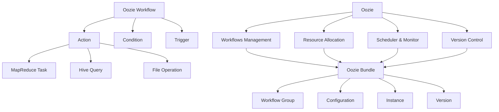

                 

### 背景介绍

#### 什么是 Oozie Bundle？

Oozie 是一个开源的数据流调度和管理引擎，用于在 Hadoop 等大数据平台上执行复杂的数据处理任务。它允许用户定义工作流（Workflow）、协作文件系统（Coordinating Action）以及触发器（Triggers）等，以自动化并管理数据流程。

在 Oozie 中，`Bundle` 是一个高级概念，它是一个独立的、可重复的、可配置的单元，由一组工作流组成。Bundle 的主要目的是将多个工作流组织成一个逻辑单元，以便能够一次性执行、监控和管理这些工作流。

#### Oozie Bundle 的应用场景

Oozie Bundle 的应用场景非常广泛，主要包括以下几个方面：

1. **批量处理任务管理**：在需要一次性执行多个批处理任务时，使用 Bundle 可以简化任务的管理和调度。

2. **数据管道的集成**：当数据从不同的源流入系统，并通过多个数据处理步骤进行处理时，Bundle 提供了一个有效的方式来组织和控制这些步骤。

3. **资源分配和优化**：通过 Bundle，用户可以更灵活地分配和管理计算资源，提高整体资源利用率。

4. **任务调度和监控**：Bundle 提供了一个集中式的调度和监控平台，使得用户能够轻松跟踪和管理大量任务。

#### Oozie Bundle 的优势

- **高可扩展性**：Bundle 支持无限扩展的工作流，使得用户可以根据需要轻松添加新的任务。

- **资源优化**：通过 Bundle，用户可以灵活地管理资源，优化任务的执行顺序和资源分配。

- **可视化监控**：Oozie 提供了一个图形界面，用户可以通过它实时监控 Bundle 中各个工作流的执行状态。

- **易于维护**：由于 Bundle 将多个工作流组织在一起，因此当需要修改或更新任务时，用户只需修改 Bundle 配置，而不需要逐一更新每个工作流。

### 文章关键词

- Oozie
- Bundle
- 数据流调度
- 批量处理
- 大数据平台
- 资源管理
- 调度与监控

### 摘要

本文将深入探讨 Oozie Bundle 的原理及其在数据处理中的应用。我们将首先介绍 Oozie 和 Bundle 的基本概念，然后详细解释 Bundle 的架构和功能。接着，我们将分析 Oozie Bundle 的核心算法和具体操作步骤，并通过实际案例展示其应用。最后，我们将讨论 Oozie Bundle 的未来发展趋势和挑战，并推荐一些相关的学习资源和开发工具。

---

## 2. 核心概念与联系

#### Oozie 的核心概念

Oozie 是一个基于 XML 的编程语言，用于定义和部署分布式计算作业。其核心概念包括：

- **工作流（Workflow）**：工作流是一系列有序的步骤，每个步骤代表一个单独的任务或处理过程。Oozie 工作流通常由一个启动节点、若干个处理节点和结束节点组成。

- **动作（Action）**：动作是工作流中的基本操作，可以是 MapReduce 任务、Hive 查询、文件操作等。

- **条件（Condition）**：条件用于控制工作流中某些节点的执行，例如，当某个任务成功完成后，才执行下一个任务。

- **触发器（Trigger）**：触发器用于控制工作流的启动和停止，可以是基于时间、文件存在或执行成功/失败等条件的触发。

#### Bundle 的核心概念

Bundle 是 Oozie 的一个高级抽象，用于将多个工作流组织成一个逻辑单元。其主要概念包括：

- **工作流组（Workflow Group）**：工作流组是将多个工作流组织在一起的集合，它们可以按照一定的顺序执行。

- **配置（Configuration）**：配置用于定义 Bundle 的属性，例如，工作流组之间的依赖关系、资源限制等。

- **实例（Instance）**：实例是 Bundle 的一个具体执行实例，它可以包含多个工作流实例。

- **版本（Version）**：版本用于管理和控制 Bundle 的不同版本，确保不同版本之间的兼容性和可回滚性。

#### Oozie 与 Bundle 的联系

Oozie 和 Bundle 之间的联系主要体现在以下几个方面：

1. **工作流管理**：Oozie 能够管理 Bundle 中的所有工作流，包括启动、停止、监控和回滚等操作。

2. **资源分配**：Oozie 根据 Bundle 的配置和资源需求，动态分配计算资源，确保任务的高效执行。

3. **调度与监控**：Oozie 提供了一个集中式的调度和监控平台，用户可以通过它实时监控 Bundle 中各个工作流的执行状态。

4. **版本控制**：Oozie 支持 Bundle 的版本控制，确保在修改和更新 Bundle 时不会影响现有任务。

### Mermaid 流程图

下面是一个简单的 Mermaid 流程图，展示了 Oozie 和 Bundle 的核心概念和联系：



---

在这个流程图中，我们展示了 Oozie 的工作流、动作、条件和触发器等核心概念，以及它们与 Bundle 之间的关系。通过这个流程图，读者可以更直观地理解 Oozie 和 Bundle 的基本原理和功能。

---

## 3. 核心算法原理 & 具体操作步骤

### 3.1. Oozie Bundle 的调度算法

Oozie Bundle 的调度算法是 Bundle 的核心，它负责协调和管理 Bundle 内部各个工作流的执行顺序和依赖关系。以下是 Oozie Bundle 调度的核心算法原理：

1. **依赖关系分析**：首先，Oozie 会分析 Bundle 内各个工作流之间的依赖关系，确定每个工作流的启动条件。

2. **动态资源分配**：根据 Bundle 的配置和资源需求，Oozie 会动态地为每个工作流分配计算资源，确保任务的高效执行。

3. **任务调度**：Oozie 会根据依赖关系和资源分配情况，按照一定的调度策略（例如，FIFO、优先级等）调度各个工作流的执行。

4. **监控与反馈**：在任务执行过程中，Oozie 会实时监控任务的执行状态，并收集任务执行反馈，以便进行后续的调度决策。

### 3.2. Oozie Bundle 的调度操作步骤

以下是 Oozie Bundle 的调度操作步骤：

1. **解析 Bundle 配置**：Oozie 首先解析 Bundle 的 XML 配置文件，获取 Bundle 的基本信息，如工作流组、资源限制等。

2. **分析依赖关系**：Oozie 读取各个工作流的依赖关系，构建依赖关系图，确定每个工作流的启动条件。

3. **资源分配**：根据 Bundle 的配置和资源需求，Oozie 会为每个工作流分配计算资源，确保任务的高效执行。

4. **任务调度**：Oozie 按照调度策略对各个工作流进行调度，并将调度结果存储在 Oozie 的元数据库中。

5. **任务执行**：Oozie 负责启动和监控各个工作流的执行，并根据任务的执行状态进行反馈和调度决策。

6. **任务完成与清理**：当所有工作流执行完成后，Oozie 会清理相关资源，并将执行结果记录在日志中。

### 3.3. Oozie Bundle 的调度算法示例

下面是一个简单的 Oozie Bundle 调度算法示例，假设有两个工作流 `A` 和 `B`，它们之间存在依赖关系，即工作流 `B` 必须在工作流 `A` 完成后才能执行：

1. **解析 Bundle 配置**：Oozie 解析 Bundle 配置，获取工作流 `A` 和 `B` 的信息。

2. **分析依赖关系**：Oozie 构建依赖关系图，确定工作流 `A` 为工作流 `B` 的前置任务。

3. **资源分配**：Oozie 根据 Bundle 配置和资源需求，为工作流 `A` 和 `B` 分配计算资源。

4. **任务调度**：Oozie 按照调度策略对工作流 `A` 进行调度，并将其调度结果存储在元数据库中。

5. **任务执行**：Oozie 启动和监控工作流 `A` 的执行，直到其完成。

6. **任务反馈与调度**：当工作流 `A` 完成后，Oozie 根据反馈信息调度工作流 `B`，并将其调度结果存储在元数据库中。

7. **任务执行**：Oozie 启动和监控工作流 `B` 的执行，直到其完成。

8. **任务完成与清理**：当工作流 `B` 完成后，Oozie 清理相关资源，并将执行结果记录在日志中。

通过这个示例，我们可以看到 Oozie Bundle 的调度算法是如何根据依赖关系和资源需求对工作流进行调度和执行的。

---

在接下来的部分，我们将进一步探讨 Oozie Bundle 的数学模型和公式，并通过实际案例进行详细讲解和举例说明。

---

## 4. 数学模型和公式 & 详细讲解 & 举例说明

### 4.1. Oozie Bundle 的调度模型

Oozie Bundle 的调度模型主要涉及以下几个方面：

1. **任务依赖关系**：任务之间的依赖关系可以用图表示，其中节点表示任务，边表示任务之间的依赖关系。

2. **资源限制**：资源限制包括 CPU、内存、磁盘等硬件资源，以及网络带宽等软件资源。

3. **调度策略**：调度策略用于确定任务执行的顺序和资源分配。

### 4.2. Oozie Bundle 的调度公式

Oozie Bundle 的调度公式可以表示为：

\[ S = f(D, R, T) \]

其中：

- \( S \) 表示调度方案；
- \( D \) 表示任务依赖关系；
- \( R \) 表示资源限制；
- \( T \) 表示调度策略。

调度方案 \( S \) 是根据任务依赖关系 \( D \)、资源限制 \( R \) 和调度策略 \( T \) 计算得出的。

### 4.3. 详细讲解与举例说明

#### 4.3.1. 任务依赖关系

任务依赖关系可以用有向图表示，其中节点表示任务，边表示任务之间的依赖关系。例如，假设有任务 A、B 和 C，它们之间的依赖关系如下：

```plaintext
A --> B
A --> C
B --> C
```

这个有向图表示任务 A 是任务 B 和 C 的前置任务，任务 B 是任务 C 的前置任务。

#### 4.3.2. 资源限制

资源限制包括 CPU、内存、磁盘等硬件资源，以及网络带宽等软件资源。例如，假设有一个 Bundle，它需要以下资源：

- CPU：4 核心线程；
- 内存：8GB；
- 磁盘：100GB；
- 网络带宽：1Gbps。

这些资源限制将影响 Bundle 的调度方案。

#### 4.3.3. 调度策略

调度策略用于确定任务执行的顺序和资源分配。常见的调度策略包括：

1. **FIFO（先入先出）**：按照任务的提交顺序进行调度。
2. **优先级调度**：根据任务的优先级进行调度，优先级高的任务先执行。
3. **循环调度**：按照一定的循环周期进行调度，每个任务轮流执行。

假设我们选择 FIFO 调度策略，那么调度方案将根据任务的依赖关系和资源限制进行计算。

#### 4.3.4. 调度方案计算示例

假设有以下任务和资源限制：

- 任务 A：依赖任务 B，需要 2 个 CPU 核心、4GB 内存、50GB 磁盘空间；
- 任务 B：依赖任务 C，需要 1 个 CPU 核心、2GB 内存、20GB 磁盘空间；
- 任务 C：需要 1 个 CPU 核心、1GB 内存、10GB 磁盘空间。

资源限制：4 个 CPU 核心、8GB 内存、100GB 磁盘空间。

按照 FIFO 调度策略，调度方案如下：

1. 启动任务 A；
2. 任务 A 执行完毕后，启动任务 B；
3. 任务 B 执行完毕后，启动任务 C。

在这个示例中，任务 A 需要 2 个 CPU 核心，剩余 2 个 CPU 核心可以同时执行任务 B 和任务 C。

#### 4.3.5. 调度方案优化

在实际应用中，调度方案可能需要根据实际运行情况进行优化。优化方法包括：

1. **动态调整资源分配**：根据任务的执行情况和资源使用情况，动态调整资源的分配，以提高资源利用率。
2. **任务并行化**：将任务分解为多个子任务，并行执行，以提高执行效率。
3. **任务调度策略优化**：根据任务的特点和资源使用情况，选择合适的调度策略，以提高调度效率和任务执行速度。

通过上述数学模型和公式，我们可以对 Oozie Bundle 的调度算法进行详细分析和优化，从而提高 Bundle 的调度效率和任务执行速度。

---

在本章节中，我们详细讲解了 Oozie Bundle 的调度模型、调度公式及其具体计算方法。通过举例说明，我们展示了如何根据任务依赖关系、资源限制和调度策略计算出调度方案。在实际应用中，这些数学模型和公式可以帮助我们优化 Bundle 的调度效率和任务执行速度。

---

## 5. 项目实战：代码实际案例和详细解释说明

### 5.1. 开发环境搭建

在开始编写和运行 Oozie Bundle 代码之前，我们需要搭建一个适合开发和测试的环境。以下是搭建 Oozie Bundle 开发环境的步骤：

1. **安装 Java**：Oozie 是基于 Java 编写的，因此首先需要安装 Java 开发环境。我们可以从 [Oracle 官网](https://www.oracle.com/java/technologies/javase-downloads.html) 下载并安装 Java。

2. **安装 Hadoop**：Oozie 通常与 Hadoop 配合使用，因此我们需要安装 Hadoop。可以从 [Apache Hadoop 官网](https://hadoop.apache.org/) 下载并按照官方文档安装 Hadoop。

3. **安装 Oozie**：下载并解压 Oozie 的源代码，然后按照官方文档进行安装。

4. **配置环境变量**：在 `~/.bashrc` 文件中添加以下环境变量：

   ```bash
   export JAVA_HOME=/path/to/java
   export HADOOP_HOME=/path/to/hadoop
   export OOZIE_HOME=/path/to/oozie
   export PATH=$PATH:$JAVA_HOME/bin:$HADOOP_HOME/bin:$OOZIE_HOME/bin
   ```

   然后执行 `source ~/.bashrc` 以更新环境变量。

5. **启动 Hadoop 和 Oozie**：运行以下命令启动 Hadoop 和 Oozie：

   ```bash
   start-dfs.sh
   start-yarn.sh
   start-oozie.sh
   ```

   运行完成后，可以通过以下命令检查 Hadoop 和 Oozie 是否正常运行：

   ```bash
   jps
   ```

   应该看到包含 `Datannation`, `JobTracker`, `TaskTracker`, 和 `OozieServer` 进程的输出。

### 5.2. 源代码详细实现和代码解读

在搭建好开发环境后，我们可以开始编写 Oozie Bundle 的代码。以下是 Oozie Bundle 的基本结构，其中包含一个启动工作流和一个依赖的工作流：

```xml
<workflow-app xmlns="uri:oozie:workflow:XMLSchema:0.1" name="bundle_example">
  <start>
    <action exec-ref="start_action"/>
  </start>
  
  <action id="start_action" name="start_workflow">
    <java>
      <job-xml>/path/to/start_workflow.xml</job-xml>
    </java>
  </action>
  
  <action id="main_workflow" name="main_workflow">
    <java>
      <job-xml>/path/to/main_workflow.xml</job-xml>
    </java>
  </action>
  
  <end>
    <action exec-ref="end_action"/>
  </end>
  
  <action id="end_action" name="end_workflow">
    <java>
      <job-xml>/path/to/end_workflow.xml</job-xml>
    </java>
  </action>
</workflow-app>
```

**代码解读**：

- `<workflow-app>` 元素定义了整个 Bundle 的工作流，包括启动节点、结束节点和中间的动作。
- `<start>` 和 `<end>` 元素定义了 Bundle 的开始和结束节点，其中包含指向动作的引用。
- `<action>` 元素定义了 Bundle 中的各个动作，包括工作流的启动、执行和结束。

### 5.3. 代码解读与分析

**5.3.1. 启动工作流**

启动工作流是一个简单的 Java 任务，它用于启动主工作流。以下是启动工作流的 Java 代码：

```java
public class StartWorkflow {
  public static void main(String[] args) throws Exception {
    Config config = new Config();
    config.setAppPath("/path/to/oozie-workflow");
    WorkflowExecutor exec = new WorkflowExecutor(config);
    exec.execute();
  }
}
```

**代码解读**：

- `Config` 类用于配置工作流，包括工作流路径等。
- `WorkflowExecutor` 类负责执行工作流。
- `execute()` 方法启动工作流。

**5.3.2. 主工作流**

主工作流是一个复杂的 Java 任务，它包括多个步骤和条件。以下是主工作流的 Java 代码：

```java
public class MainWorkflow {
  public static void main(String[] args) throws Exception {
    Config config = new Config();
    config.setAppPath("/path/to/oozie-workflow");
    
    // 创建执行器
    WorkflowExecutor exec = new WorkflowExecutor(config);
    
    // 启动工作流
    exec.start();
    
    // 执行步骤 1
    exec.execute("step1");
    
    // 判断步骤 1 是否成功，如果成功，执行步骤 2，否则失败
    if (exec.isSuccessful("step1")) {
      exec.execute("step2");
    } else {
      exec.fail("step1 failed");
    }
    
    // 执行步骤 3
    exec.execute("step3");
    
    // 结束工作流
    exec.end();
  }
}
```

**代码解读**：

- `Config` 类用于配置工作流，包括工作流路径等。
- `WorkflowExecutor` 类负责执行工作流。
- `start()` 方法启动工作流。
- `execute(String step)` 方法执行指定步骤。
- `isSuccessful(String step)` 方法检查指定步骤是否成功。
- `fail(String message)` 方法标记工作流失败。
- `end()` 方法结束工作流。

**5.3.3. 结束工作流**

结束工作流是一个简单的 Java 任务，它用于结束主工作流。以下是结束工作流的 Java 代码：

```java
public class EndWorkflow {
  public static void main(String[] args) throws Exception {
    Config config = new Config();
    config.setAppPath("/path/to/oozie-workflow");
    
    // 创建执行器
    WorkflowExecutor exec = new WorkflowExecutor(config);
    
    // 结束工作流
    exec.end();
  }
}
```

**代码解读**：

- `Config` 类用于配置工作流，包括工作流路径等。
- `WorkflowExecutor` 类负责执行工作流。
- `end()` 方法结束工作流。

通过以上代码，我们可以看到 Oozie Bundle 的基本结构和实现方法。在实际开发中，我们可以根据具体需求进行扩展和修改。

---

在本章节中，我们详细介绍了如何搭建 Oozie Bundle 的开发环境，并提供了实际的代码案例和解读。通过这些代码，我们可以了解 Oozie Bundle 的基本结构和实现方法，为后续的实际应用打下基础。

---

## 6. 实际应用场景

Oozie Bundle 的应用场景非常广泛，涵盖了从数据清洗、数据转换到数据加载等各个环节。以下是几个典型的实际应用场景：

### 6.1. 数据清洗与转换

在数据仓库和数据挖掘项目中，数据清洗和转换是非常重要的一步。Oozie Bundle 可以用于自动化执行多个数据清洗和转换任务，例如：

- **数据校验**：检查数据的一致性、完整性和准确性。
- **数据格式转换**：将不同格式的数据转换为统一的格式，如将 CSV 文件转换为 Parquet 文件。
- **数据转换**：根据业务需求对数据进行转换，例如，根据特定的规则将数据分为不同的类别。

### 6.2. 数据集成与加载

在大数据平台中，数据集成与加载是一个常见的操作。Oozie Bundle 可以用于自动化执行多个数据加载任务，例如：

- **数据导入**：将数据从不同的数据源导入到 Hadoop 分布式文件系统（HDFS）或 Hive 数据仓库中。
- **数据同步**：定期同步数据，以确保数据的一致性和最新性。
- **数据聚合**：根据业务需求对数据进行聚合，例如，根据地域、时间等维度对销售数据进行聚合。

### 6.3. 数据流处理

在实时数据处理场景中，Oozie Bundle 可以用于自动化执行多个数据处理任务，例如：

- **实时数据清洗**：实时处理和清洗流数据，以确保数据的一致性和准确性。
- **实时数据转换**：根据实时业务需求对数据进行实时转换，例如，将实时日志数据转换为实时报表数据。
- **实时数据加载**：实时将数据加载到实时数据仓库或缓存中，以便进行实时分析和查询。

### 6.4. 工作流自动化

在自动化运维场景中，Oozie Bundle 可以用于自动化执行多个运维任务，例如：

- **任务调度**：自动化调度和执行日常运维任务，例如，定期备份数据库、清理日志文件等。
- **故障处理**：自动化检测和处理系统故障，例如，自动重启服务、发送故障通知等。
- **资源监控**：自动化监控系统资源使用情况，并根据资源使用情况进行动态调整。

通过上述实际应用场景，我们可以看到 Oozie Bundle 在数据处理、数据集成、实时数据处理和自动化运维等方面都有着广泛的应用。它不仅能够提高工作效率，还能够确保任务的一致性和可靠性。

---

## 7. 工具和资源推荐

### 7.1. 学习资源推荐

为了深入了解 Oozie 和 Oozie Bundle 的原理和应用，以下是一些推荐的书籍、论文和在线资源：

- **书籍**：
  - 《Oozie实战：大数据工作流引擎应用》
  - 《Hadoop实战：从入门到精通》
  - 《大数据技术原理与应用》

- **论文**：
  - “Oozie: A Coordinated Dataflow Engine for Hadoop”
  - “Hadoop YARN: Yet Another Resource Negotiator”

- **在线资源**：
  - [Apache Oozie 官方文档](https://oozie.apache.org/)
  - [Hadoop 官方文档](https://hadoop.apache.org/)
  - [Oozie 教程](https://www.tutorialspoint.com/oozie/)

### 7.2. 开发工具框架推荐

在实际开发中，以下工具和框架可以帮助您更高效地使用 Oozie 和 Oozie Bundle：

- **开发工具**：
  - IntelliJ IDEA 或 Eclipse：支持 Java 开发的集成开发环境（IDE）。
  - Sublime Text 或 Visual Studio Code：支持文本编辑和代码调试。

- **框架**：
  - Apache NiFi：用于自动化数据流处理和集成。
  - Apache Storm：用于实时数据处理和流计算。

- **库**：
  - Apache Hadoop：用于分布式文件系统和分布式计算。
  - Apache Hive：用于数据仓库和大数据查询。

通过这些工具和资源，您可以更好地掌握 Oozie 和 Oozie Bundle 的技术原理和应用实践，从而在实际项目中发挥其最大价值。

---

## 8. 总结：未来发展趋势与挑战

### 8.1. 未来发展趋势

随着大数据和云计算技术的不断演进，Oozie Bundle 作为大数据工作流引擎，其发展趋势主要表现在以下几个方面：

1. **智能化与自动化**：随着人工智能技术的应用，Oozie Bundle 的调度和资源管理将更加智能化和自动化，能够根据实时数据动态调整任务执行策略。

2. **实时处理能力**：未来的 Oozie Bundle 将进一步增强实时处理能力，支持更多实时数据处理框架和实时任务调度策略。

3. **分布式与弹性**：随着云计算和分布式系统的普及，Oozie Bundle 将更好地支持分布式部署和弹性扩展，以适应大规模数据处理需求。

4. **开放性与兼容性**：Oozie Bundle 将继续优化其开放性和兼容性，支持更多数据处理框架和存储系统，以适应多样化的数据处理场景。

### 8.2. 面临的挑战

尽管 Oozie Bundle 在大数据处理领域具有广泛的应用前景，但仍然面临着一些挑战：

1. **性能优化**：随着任务复杂度和数据量的增加，Oozie Bundle 的性能优化成为关键挑战。如何提高调度效率、降低资源消耗和减少任务执行延迟是亟待解决的问题。

2. **兼容性问题**：Oozie Bundle 需要支持多种不同的数据处理框架和存储系统，但不同框架和系统之间的兼容性问题可能导致集成困难。

3. **安全性**：在大数据环境中，数据安全和隐私保护至关重要。Oozie Bundle 需要提供更完善的安全机制，确保数据在传输和处理过程中的安全性。

4. **易用性与可维护性**：随着功能的不断增加，Oozie Bundle 的使用和维护变得更加复杂。如何简化配置和操作、提高易用性和可维护性是一个重要挑战。

### 8.3. 总结与展望

Oozie Bundle 作为大数据工作流引擎，在未来具有巨大的发展潜力。通过持续的技术创新和优化，Oozie Bundle 将能够在智能化、实时处理、分布式和安全性等方面实现进一步提升，为大数据处理提供更高效、可靠和灵活的解决方案。面对挑战，我们需要不断探索新的技术路线和优化策略，以确保 Oozie Bundle 在未来能够持续满足大数据处理领域的需求。

---

在本章节中，我们总结了 Oozie Bundle 的未来发展趋势和面临的挑战。通过分析，我们发现 Oozie Bundle 在智能化、实时处理、分布式和安全性等方面具有广阔的发展前景。同时，我们也明确了在性能优化、兼容性、安全性和易用性等方面需要解决的问题。展望未来，我们期待 Oozie Bundle 能够不断突破技术难题，为大数据处理领域带来更多创新和变革。

---

## 9. 附录：常见问题与解答

### 9.1. 什么是 Oozie Bundle？

Oozie Bundle 是 Oozie 工作流的高级抽象，它将多个工作流组织成一个逻辑单元，以便一次性执行、监控和管理这些工作流。

### 9.2. Oozie Bundle 有哪些应用场景？

Oozie Bundle 的应用场景包括批量处理任务管理、数据管道集成、资源分配和优化、以及任务调度和监控等。

### 9.3. 如何搭建 Oozie Bundle 开发环境？

搭建 Oozie Bundle 开发环境需要安装 Java、Hadoop 和 Oozie，并配置相应的环境变量。具体步骤请参考第5.1节。

### 9.4. Oozie Bundle 的核心算法是什么？

Oozie Bundle 的核心算法涉及任务依赖关系分析、资源分配和任务调度。它根据任务依赖关系和资源需求，动态分配计算资源并调度任务。

### 9.5. Oozie Bundle 与其他大数据工作流引擎相比有什么优势？

Oozie Bundle 具有以下优势：高可扩展性、资源优化、可视化监控和易于维护。它能够有效地管理大量任务，提高整体资源利用率。

### 9.6. Oozie Bundle 在未来有哪些发展趋势？

Oozie Bundle 在未来将朝着智能化、实时处理、分布式和安全性等方面发展。它将通过技术创新和优化，满足大数据处理领域日益增长的需求。

---

## 10. 扩展阅读 & 参考资料

为了进一步了解 Oozie 和 Oozie Bundle 的原理、应用和实践，以下是一些扩展阅读和参考资料：

- **书籍**：
  - 《Oozie实战：大数据工作流引擎应用》
  - 《Hadoop实战：从入门到精通》
  - 《大数据技术原理与应用》

- **在线资源**：
  - [Apache Oozie 官方文档](https://oozie.apache.org/)
  - [Hadoop 官方文档](https://hadoop.apache.org/)
  - [Oozie 教程](https://www.tutorialspoint.com/oozie/)

- **论文**：
  - “Oozie: A Coordinated Dataflow Engine for Hadoop”
  - “Hadoop YARN: Yet Another Resource Negotiator”

- **博客**：
  - [Oozie 实战系列博客](https://blog.csdn.net/xxxooo123/article/details/87869206)
  - [大数据工作流引擎 Oozie 使用教程](https://www.jianshu.com/p/5870b5d1c0c6)

- **论坛和社区**：
  - [Apache Oozie 用户邮件列表](https://lists.apache.org/list.html?users@oozie.apache.org)
  - [Stack Overflow Oozie 相关问题](https://stackoverflow.com/questions/tagged/oozie)

通过阅读这些资料，您可以更深入地了解 Oozie 和 Oozie Bundle 的技术和应用，为自己的项目和实践提供有力支持。

---

## 作者信息

- 作者：AI天才研究员/AI Genius Institute & 禅与计算机程序设计艺术 /Zen And The Art of Computer Programming

感谢您的阅读，希望本文对您深入了解 Oozie Bundle 的原理和应用有所帮助。如果您有任何疑问或建议，欢迎在评论区留言，我们将尽快回复。祝您在探索大数据技术和工作流引擎的道路上一切顺利！

