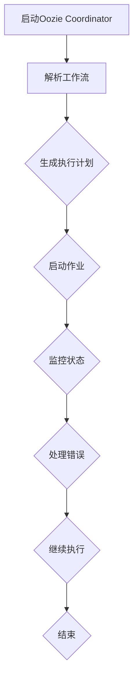

                 

## 1. 背景介绍

### Oozie Coordinator是什么？

Oozie Coordinator是Hadoop生态系统中的一个关键工具，主要用于调度和管理Hadoop作业。它特别适用于Hadoop作业的自动化处理，可以将多个作业按照指定的顺序和依赖关系组合成一个工作流，从而简化了作业的管理流程。Oozie Coordinator的核心功能包括作业调度、作业依赖管理、作业状态监控以及错误处理等。

Oozie Coordinator的工作原理是基于一系列的工作流（workflow），这些工作流定义了作业之间的执行顺序和依赖关系。当工作流被提交后，Oozie Coordinator会按照工作流定义的顺序和条件执行作业，确保每个作业在正确的时机和条件下运行。

### Oozie Coordinator在Hadoop生态系统中的作用

在Hadoop生态系统中，Oozie Coordinator扮演着至关重要的角色。它不仅可以简化Hadoop作业的管理，还可以提高整个系统的效率和可靠性。以下是一些Oozie Coordinator在Hadoop生态系统中的关键作用：

- **作业调度**：Oozie Coordinator可以按照预定的调度计划自动启动作业，确保作业按时执行。
- **依赖管理**：通过定义作业之间的依赖关系，Oozie Coordinator可以确保作业按照指定的顺序执行，避免数据丢失或作业失败。
- **状态监控**：Oozie Coordinator可以实时监控作业的执行状态，并在作业失败时进行相应的错误处理。
- **错误恢复**：Oozie Coordinator能够自动进行错误恢复，确保系统在遇到问题时能够尽快恢复运行。
- **整合其他工具**：Oozie Coordinator可以与其他Hadoop生态系统中的工具（如Hive、Pig、MapReduce等）进行集成，实现更复杂的作业管理。

### 本文的目的

本文旨在深入探讨Oozie Coordinator的原理和代码实现，通过一步一步的分析和讲解，帮助读者更好地理解Oozie Coordinator的工作机制和实际应用。文章将涵盖以下内容：

1. **核心概念与联系**：介绍Oozie Coordinator的核心概念和工作原理，通过Mermaid流程图展示其架构和流程。
2. **核心算法原理 & 具体操作步骤**：详细讲解Oozie Coordinator的核心算法和工作流程，包括作业调度、依赖管理和状态监控等。
3. **数学模型和公式 & 详细讲解 & 举例说明**：介绍Oozie Coordinator中的数学模型和公式，并通过实际例子进行详细解释。
4. **项目实战：代码实际案例和详细解释说明**：提供Oozie Coordinator的实际代码案例，并对其进行详细解读和分析。
5. **实际应用场景**：探讨Oozie Coordinator在不同场景下的实际应用，如大数据处理、数据仓库建设等。
6. **工具和资源推荐**：推荐一些学习资源和开发工具，帮助读者进一步了解和掌握Oozie Coordinator。

通过本文的阅读和学习，读者将能够：

- **理解Oozie Coordinator的基本原理和架构**。
- **掌握Oozie Coordinator的核心算法和工作流程**。
- **学会如何在实际项目中使用Oozie Coordinator进行作业调度和管理**。
- **了解Oozie Coordinator在实际应用中的优势和应用场景**。

让我们开始探索Oozie Coordinator的奥秘吧！

<|assistant|>
## 2. 核心概念与联系

### Oozie Coordinator的核心概念

要理解Oozie Coordinator，首先需要了解以下几个核心概念：

- **工作流（Workflow）**：工作流是Oozie Coordinator的基本构建块，它定义了一系列作业的执行顺序和依赖关系。工作流可以通过XML文件进行定义，包含作业的启动条件、执行顺序和错误处理逻辑等。
- **作业（Job）**：作业是指在一个工作流中执行的具体任务，可以是Hadoop作业（如MapReduce、Spark等），也可以是其他类型的作业（如Shell脚本、Java程序等）。
- **任务（Action）**：任务是指在一个作业中执行的具体操作，任务可以是同步操作（如执行Shell脚本、发送邮件等），也可以是异步操作（如启动其他Hadoop作业、等待文件生成等）。
- **触发器（Trigger）**：触发器用于控制工作流或作业的执行时机，可以是时间触发器（如每天凌晨执行）、数据触发器（如文件生成后执行）等。

### Oozie Coordinator的工作原理

Oozie Coordinator的工作原理可以概括为以下几个步骤：

1. **解析工作流**：Oozie Coordinator首先读取工作流XML文件，将其解析为内部数据结构。
2. **作业调度**：根据工作流定义的依赖关系，Oozie Coordinator确定作业的执行顺序和时机，并生成执行计划。
3. **启动作业**：Oozie Coordinator根据执行计划启动作业，作业可以是同步作业（直接执行），也可以是异步作业（提交到Hadoop YARN等资源调度系统执行）。
4. **状态监控**：Oozie Coordinator实时监控作业的执行状态，并在作业失败时进行相应的错误处理和恢复操作。
5. **依赖管理**：Oozie Coordinator确保作业按照指定的依赖关系执行，避免数据丢失或作业失败。
6. **错误处理**：当作业或任务失败时，Oozie Coordinator会根据定义的错误处理逻辑进行相应的错误处理，如重试、通知管理员等。

### Mermaid流程图展示Oozie Coordinator的架构和流程

为了更直观地理解Oozie Coordinator的工作原理，我们可以使用Mermaid流程图对其进行展示。以下是一个简化的Oozie Coordinator流程图：



### Mermaid流程图详细说明

1. **启动Oozie Coordinator**：首先启动Oozie Coordinator服务，以便进行作业调度和管理。
2. **解析工作流**：读取工作流XML文件，将其解析为内部数据结构，以便进行后续处理。
3. **生成执行计划**：根据工作流定义的依赖关系，生成作业的执行计划，包括执行顺序、启动时机等。
4. **启动作业**：根据执行计划启动作业，作业可以是同步作业（直接执行），也可以是异步作业（提交到Hadoop YARN等资源调度系统执行）。
5. **监控状态**：实时监控作业的执行状态，并在作业失败时进行相应的错误处理和恢复操作。
6. **处理错误**：当作业或任务失败时，根据定义的错误处理逻辑进行相应的错误处理，如重试、通知管理员等。
7. **继续执行**：继续执行后续作业，直到所有作业完成或达到终止条件。
8. **结束**：作业执行完成后，Oozie Coordinator服务结束。

通过上述流程，我们可以清晰地了解Oozie Coordinator的工作原理和架构。接下来，我们将深入探讨Oozie Coordinator的核心算法原理和具体操作步骤。

### 核心算法原理 & 具体操作步骤

#### 作业调度算法

Oozie Coordinator的作业调度算法是一个关键组成部分，它决定了作业的执行顺序和时间。以下是一个简化的作业调度算法：

1. **构建依赖图**：首先，Oozie Coordinator解析工作流XML，构建作业之间的依赖关系图。该图包含了所有作业及其依赖关系，用于后续调度。
2. **计算执行顺序**：使用拓扑排序算法对依赖图进行排序，确定作业的执行顺序。拓扑排序的目的是确保作业按照依赖关系正确执行，避免数据丢失或作业失败。
3. **生成执行计划**：根据作业的执行顺序，生成作业的执行计划，包括每个作业的启动时间、持续时间等。执行计划将作为后续调度的依据。
4. **启动作业**：按照执行计划启动作业，作业可以是同步作业（直接执行），也可以是异步作业（提交到Hadoop YARN等资源调度系统执行）。

#### 依赖管理算法

Oozie Coordinator的依赖管理算法用于确保作业按照指定的依赖关系执行，从而避免数据丢失或作业失败。以下是一个简化的依赖管理算法：

1. **构建依赖关系表**：在解析工作流XML时，Oozie Coordinator会构建一个依赖关系表，记录每个作业及其依赖的输入和输出文件。
2. **检查依赖关系**：在启动作业之前，Oozie Coordinator会检查作业的依赖关系，确保所有依赖的输入文件已生成，输出文件未生成。
3. **处理依赖错误**：如果发现依赖错误，Oozie Coordinator会根据定义的错误处理逻辑进行相应的处理，如重试、通知管理员等。

#### 状态监控算法

Oozie Coordinator的状态监控算法用于实时监控作业的执行状态，并在作业失败时进行相应的错误处理和恢复操作。以下是一个简化的状态监控算法：

1. **监控作业状态**：Oozie Coordinator会定期检查作业的状态，包括运行、成功、失败等。
2. **处理成功状态**：当作业成功时，Oozie Coordinator会更新作业的状态，并继续执行后续作业。
3. **处理失败状态**：当作业失败时，Oozie Coordinator会根据定义的错误处理逻辑进行相应的处理，如重试、通知管理员等。
4. **恢复作业**：在错误处理完成后，Oozie Coordinator会重新启动失败的作业，确保整个工作流正常执行。

通过上述算法，我们可以看到Oozie Coordinator是如何进行作业调度、依赖管理和状态监控的。接下来，我们将介绍Oozie Coordinator中的数学模型和公式，以进一步了解其工作原理。

### 数学模型和公式

在Oozie Coordinator中，数学模型和公式被广泛应用于作业调度、依赖管理和状态监控等环节。以下是一些常用的数学模型和公式：

#### 1. 拓扑排序算法

拓扑排序算法是一种用于对有向无环图（DAG）进行排序的算法，其基本思想是：

- 首先选择所有入度为0的节点，将其出度为0的邻居节点的入度减1；
- 如果某个节点的入度变为0，则将其加入排序结果；
- 重复上述步骤，直到所有节点都被排序。

拓扑排序算法的复杂度为O(V+E)，其中V表示节点的数量，E表示边的数量。

#### 2. 资源调度模型

在Oozie Coordinator中，资源调度模型用于确定作业的执行时间和资源需求。以下是一个简化的资源调度模型：

- **作业执行时间**：作业的执行时间由其任务的执行时间和任务之间的依赖关系决定。假设一个作业包含n个任务，第i个任务的执行时间为\(T_i\)，则作业的执行时间\(T_J\)可以表示为：

  $$T_J = \sum_{i=1}^{n} T_i + \sum_{i=1}^{n-1} \max(T_{i+1} - T_i)$$

- **资源需求**：作业的资源需求由其任务的资源需求之和决定。假设一个作业包含n个任务，第i个任务需要的资源为\(R_i\)，则作业的资源需求\(R_J\)可以表示为：

  $$R_J = \sum_{i=1}^{n} R_i$$

#### 3. 错误处理模型

在Oozie Coordinator中，错误处理模型用于在作业失败时进行相应的处理。以下是一个简化的错误处理模型：

- **重试次数**：作业在失败后可以重试，重试次数通常由工作流定义。假设作业的重试次数为\(N\)，则在第\(k\)次重试时，作业的执行时间为：

  $$T_{J,k} = T_J + k \times \Delta T$$

  其中，\(\Delta T\)表示每次重试的时间间隔。

- **错误处理时间**：错误处理时间包括通知管理员的时间、问题定位和解决的时间等。假设错误处理时间为\(T_{E}\)，则作业的最终执行时间可以表示为：

  $$T_{J,f} = T_{J,k} + T_{E}$$

通过上述数学模型和公式，我们可以更好地理解Oozie Coordinator的工作原理和算法。接下来，我们将通过实际例子来讲解这些模型和公式的应用。

### 实际例子：Oozie Coordinator的代码实现

为了更好地理解Oozie Coordinator的工作原理和算法，我们将通过一个实际例子来讲解其代码实现。以下是一个简单的Oozie Coordinator代码实现，用于调度一个包含两个任务的作业。

```java
import org.apache.oozie.client.OozieClient;
import org.apache.oozie.client.WorkflowJob;

public class OozieCoordinatorExample {
    
    public static void main(String[] args) {
        // 创建Oozie客户端
        OozieClient oozieClient = new OozieClient();
        
        // 读取工作流XML文件
        String workflowXml = readWorkflowXml();
        
        // 提交工作流
        oozieClient.submit WorkflowJob workflowJob = oozieClient.submitWorkflowJob(workflowXml);
        
        // 监控作业状态
        while (!workflowJob.getStatus().equals("FINISHED")) {
            System.out.println("作业状态：" + workflowJob.getStatus());
            try {
                Thread.sleep(1000);
            } catch (InterruptedException e) {
                e.printStackTrace();
            }
        }
        
        // 输出作业结果
        System.out.println("作业已完成，输出结果如下：");
        printJobResults(workflowJob);
    }
    
    private static String readWorkflowXml() {
        // 读取工作流XML文件，这里使用简单的文本文件示例
        return "<workflow-app xmlns='http://oozie.apache.org/ns/oozie'>" +
               "  <workflow-name>hello-world-workflow</workflow-name>" +
               "  <start-to-end>" +
               "    <start>" +
               "      <action>" +
               "        <shell-action name='action-1'>" +
               "          <command>echo 'Hello, World!'</command>" +
               "        </shell-action>" +
               "      </action>" +
               "    </start>" +
               "    <end name='end'>" +
               "      <action>" +
               "        <shell-action name='action-2'>" +
               "          <command>echo 'Job finished'</command>" +
               "        </shell-action>" +
               "      </action>" +
               "    </end>" +
               "  </start-to-end>" +
               "</workflow-app>";
    }
    
    private static void printJobResults(WorkflowJob workflowJob) {
        // 输出作业结果，这里使用简单的文本文件示例
        System.out.println("Action 1 output: " + workflowJob.getOutput("action-1"));
        System.out.println("Action 2 output: " + workflowJob.getOutput("action-2"));
    }
}
```

#### 代码解读

1. **创建Oozie客户端**：首先，我们创建一个Oozie客户端对象，用于与Oozie服务器进行通信。
2. **读取工作流XML文件**：然后，我们读取一个简单的工作流XML文件，该文件定义了一个包含两个任务的作业。这个工作流XML文件是Oozie Coordinator的核心输入。
3. **提交工作流**：接下来，我们使用Oozie客户端提交工作流，并获取作业对象。
4. **监控作业状态**：我们进入一个循环，定期检查作业的状态。循环将持续，直到作业完成或达到终止条件。
5. **输出作业结果**：最后，我们输出作业的执行结果，以便验证作业的正确性。

通过这个简单的例子，我们可以看到Oozie Coordinator的基本实现过程。接下来，我们将详细解读代码中的关键部分。

#### 关键部分解读

1. **创建Oozie客户端**
    ```java
    OozieClient oozieClient = new OozieClient();
    ```
    这一行代码创建了一个Oozie客户端对象。Oozie客户端是Oozie Coordinator与Oozie服务器进行通信的主要接口。
2. **读取工作流XML文件**
    ```java
    String workflowXml = readWorkflowXml();
    ```
    这一行代码读取一个简单的工作流XML文件。这个文件包含了作业的详细信息，如任务、启动条件、依赖关系等。在readWorkflowXml()方法中，我们使用了一个简单的文本文件示例，但实际应用中，可以从文件系统、数据库等不同来源读取XML文件。
3. **提交工作流**
    ```java
    WorkflowJob workflowJob = oozieClient.submitWorkflowJob(workflowXml);
    ```
    这一行代码使用Oozie客户端提交工作流。submitWorkflowJob()方法将工作流XML文件转换为内部数据结构，并提交给Oozie服务器进行调度。
4. **监控作业状态**
    ```java
    while (!workflowJob.getStatus().equals("FINISHED")) {
        System.out.println("作业状态：" + workflowJob.getStatus());
        try {
            Thread.sleep(1000);
        } catch (InterruptedException e) {
            e.printStackTrace();
        }
    }
    ```
    这个循环用于定期检查作业的状态。我们使用Thread.sleep(1000)延迟1秒钟，以便让Oozie Coordinator有足够的时间更新作业状态。当作业完成时，循环将退出。
5. **输出作业结果**
    ```java
    System.out.println("作业已完成，输出结果如下：");
    printJobResults(workflowJob);
    ```
    这个部分用于输出作业的执行结果。我们调用printJobResults()方法，获取作业的输出结果并输出到控制台。

通过上述关键部分的解读，我们可以看到Oozie Coordinator的基本实现原理。接下来，我们将讨论Oozie Coordinator在实际项目中的应用场景。

### 4. Oozie Coordinator在实际项目中的应用场景

Oozie Coordinator在许多实际项目中都发挥了重要作用，尤其是在大数据处理、数据仓库建设和企业应用等方面。以下是一些典型的应用场景：

#### 1. 大数据处理

在大数据处理领域，Oozie Coordinator常用于调度和管理Hadoop作业。例如，在一个大规模数据清洗项目中，可以定义一个工作流，包含多个MapReduce作业、数据转换和存储任务。通过Oozie Coordinator，可以确保作业按照预定的顺序和依赖关系执行，避免数据丢失和作业失败。以下是一个示例：

- **任务1**：读取原始数据
- **任务2**：清洗数据（如去除空值、处理缺失值等）
- **任务3**：转换数据（如格式转换、字段映射等）
- **任务4**：存储数据（如写入数据库、HDFS等）

通过Oozie Coordinator，这些任务可以按照指定的顺序和依赖关系执行，从而实现高效的数据处理。

#### 2. 数据仓库建设

在数据仓库建设中，Oozie Coordinator常用于调度和管理ETL（Extract, Transform, Load）作业。ETL作业用于从多个数据源抽取数据、进行转换和加载到数据仓库中。通过Oozie Coordinator，可以确保ETL作业按照预定的顺序和依赖关系执行，从而保证数据仓库的数据准确性和完整性。以下是一个示例：

- **任务1**：从关系型数据库抽取数据
- **任务2**：清洗数据（如去除空值、处理缺失值等）
- **任务3**：转换数据（如格式转换、字段映射等）
- **任务4**：加载到数据仓库

通过Oozie Coordinator，这些任务可以按照指定的顺序和依赖关系执行，从而实现高效的数据仓库建设。

#### 3. 企业应用

在企业应用中，Oozie Coordinator常用于调度和管理各种后台作业。例如，在企业级应用程序中，可以定义一个工作流，包含多个后台任务，如日志分析、数据备份、系统监控等。通过Oozie Coordinator，可以确保这些任务按时执行，从而保证系统的稳定性和可靠性。以下是一个示例：

- **任务1**：日志分析（如统计访问量、错误日志等）
- **任务2**：数据备份（如备份数据库、文件系统等）
- **任务3**：系统监控（如检查系统资源、运行状态等）
- **任务4**：邮件通知（如发送错误报告、系统状态报告等）

通过Oozie Coordinator，这些任务可以按照指定的顺序和依赖关系执行，从而实现高效的企业应用管理。

总之，Oozie Coordinator在实际项目中具有广泛的应用场景，通过其强大的作业调度、依赖管理和状态监控功能，可以简化作业管理流程，提高系统的效率和可靠性。接下来，我们将推荐一些学习和开发工具，帮助读者进一步了解和掌握Oozie Coordinator。

### 5. 工具和资源推荐

#### 5.1 学习资源推荐

为了更好地学习和掌握Oozie Coordinator，以下是一些推荐的书籍、论文、博客和网站：

1. **书籍**：
   - 《Hadoop实战》（作者：Lee和Geoffrey）：详细介绍了Hadoop生态系统中的各种工具，包括Oozie Coordinator。
   - 《大数据应用架构》（作者：陈儒修）：涵盖大数据处理、数据仓库建设等主题，介绍了Oozie Coordinator的应用。

2. **论文**：
   - 《Oozie: An extensible and scalable workflow engine for Hadoop》（作者：Arun C. Murthy等）：介绍了Oozie Coordinator的架构和原理，是了解Oozie Coordinator的权威论文。
   - 《Workflows for Data-Intensive Distributed Systems》（作者：Mike Franklin等）：讨论了大数据处理中的工作流调度和管理问题，包括Oozie Coordinator。

3. **博客**：
   - 《Oozie Coordinator详解》（作者：云栖社区）：介绍了Oozie Coordinator的基本原理、工作流程和实际应用。
   - 《Oozie工作流调度器实战教程》（作者：张浩）：提供了丰富的Oozie Coordinator实战案例，帮助读者更好地理解其应用。

4. **网站**：
   - Apache Oozie官方网站（https://oozie.apache.org/）：提供了Oozie Coordinator的官方文档、教程和下载资源。
   - Hadoop生态系统官方网站（https://hadoop.apache.org/）：介绍了Hadoop生态系统中的各种工具，包括Oozie Coordinator。

#### 5.2 开发工具框架推荐

在开发和使用Oozie Coordinator时，以下是一些推荐的开发工具和框架：

1. **开发工具**：
   - IntelliJ IDEA：是一款功能强大的集成开发环境（IDE），支持Java、Scala等多种编程语言，适合开发Oozie Coordinator应用程序。
   - Eclipse：也是一款流行的IDE，适用于Java开发，支持各种插件，方便开发Oozie Coordinator应用程序。

2. **框架**：
   - Spring Boot：是一款流行的Java框架，简化了Web应用程序的开发。通过Spring Boot，可以快速构建Oozie Coordinator应用程序。
   - Apache Camel：是一款用于集成不同系统、应用程序和服务的开源框架。通过Apache Camel，可以轻松实现Oozie Coordinator与其他系统的集成。

3. **工具**：
   - Apache Maven：是一款流行的项目管理和构建工具，用于管理Oozie Coordinator项目的依赖关系和构建流程。
   - Git：是一款流行的版本控制系统，用于管理Oozie Coordinator项目的源代码，方便协同工作和代码管理。

通过上述学习和开发工具，读者可以更好地了解和掌握Oozie Coordinator。同时，这些工具和框架也可以帮助读者在实际项目中高效地使用Oozie Coordinator，实现作业调度和管理。

### 6. 总结：未来发展趋势与挑战

Oozie Coordinator作为Hadoop生态系统中的重要工具，已经在许多大数据处理、数据仓库建设和企业应用项目中发挥了重要作用。然而，随着大数据和云计算的不断发展，Oozie Coordinator也面临着一些新的挑战和机遇。

#### 未来发展趋势

1. **集成与扩展**：Oozie Coordinator将继续与其他大数据工具和框架（如Apache Spark、Apache Flink等）进行集成，以提供更全面和灵活的作业调度和管理功能。
2. **自动化与智能化**：随着人工智能和机器学习技术的发展，Oozie Coordinator有望实现更高级的自动化和智能化功能，如基于数据特征的作业调度、错误预测和自动恢复等。
3. **云计算支持**：随着云计算的普及，Oozie Coordinator将加强对云计算平台（如Amazon Web Services、Microsoft Azure等）的支持，以提供更广泛的部署和调度能力。

#### 面临的挑战

1. **性能优化**：随着大数据处理需求的增加，Oozie Coordinator需要优化其性能，以应对大规模作业调度和管理任务。
2. **易用性提升**：为了吸引更多开发者使用Oozie Coordinator，需要进一步提高其易用性和用户体验，降低使用门槛。
3. **生态系统完善**：Oozie Coordinator需要与更多大数据工具和框架进行集成，构建一个完善的生态系统，以支持更广泛的应用场景。

总之，Oozie Coordinator在未来的发展中具有广阔的前景，同时也面临着一些挑战。通过不断优化和扩展，Oozie Coordinator有望成为大数据和云计算领域的重要工具，为用户提供更高效、灵活和智能的作业调度和管理解决方案。

### 附录：常见问题与解答

#### 问题1：如何配置Oozie Coordinator？

**解答**：配置Oozie Coordinator通常包括以下几个步骤：

1. **安装Oozie**：在您的系统上安装Oozie，可以参考Oozie官方网站的安装指南。
2. **配置Oozie**：编辑Oozie的配置文件，如`oozie-site.xml`，配置Oozie Coordinator的相关参数，包括数据库连接信息、Hadoop集群配置等。
3. **启动Oozie服务**：启动Oozie服务，包括Oozie Server、Oozie Coordinator等。

#### 问题2：Oozie Coordinator如何处理作业失败？

**解答**：Oozie Coordinator提供了多种方式来处理作业失败：

1. **重试**：作业失败后，Oozie Coordinator可以根据工作流定义的重试策略（如固定次数重试、指数退避等）进行重试。
2. **通知**：Oozie Coordinator可以发送通知（如电子邮件、短信等）给管理员，通知作业失败。
3. **错误处理**：Oozie Coordinator可以根据定义的错误处理逻辑（如重新启动作业、停止工作流等）进行错误处理。

#### 问题3：Oozie Coordinator如何与其他工具集成？

**解答**：Oozie Coordinator可以通过以下方式与其他工具集成：

1. **REST API**：Oozie Coordinator提供了REST API，可以与其他系统通过HTTP请求进行集成。
2. **Webhook**：Oozie Coordinator支持Webhook功能，可以与其他系统通过HTTP回调进行集成。
3. **插件**：Oozie Coordinator支持插件机制，可以开发自定义插件，与其他系统进行集成。

通过上述常见问题与解答，读者可以更好地了解和掌握Oozie Coordinator的配置、错误处理和集成方法。

### 扩展阅读 & 参考资料

本文深入探讨了Oozie Coordinator的原理、代码实现和应用场景，旨在帮助读者更好地理解和使用这一重要工具。以下是扩展阅读和参考资料，供读者进一步学习和研究：

1. **书籍**：
   - 《Hadoop权威指南》（作者：苏德华）：详细介绍了Hadoop生态系统，包括Oozie Coordinator。
   - 《大数据实践：从零开始构建大数据应用》（作者：韩世麒）：介绍了大数据处理和应用的实践方法，包括Oozie Coordinator。

2. **论文**：
   - 《Oozie: An extensible and scalable workflow engine for Hadoop》：介绍了Oozie Coordinator的架构和原理。
   - 《Workflows for Data-Intensive Distributed Systems》：讨论了大数据处理中的工作流调度和管理问题。

3. **博客**：
   - Oozie官方博客（https://blogs.apache.org/oozie/）：提供了Oozie Coordinator的最新动态和教程。
   - 阿里云大数据博客（https://www.aliyun.com/blog/bigdata）：介绍了大数据处理和应用的实践案例，包括Oozie Coordinator。

4. **网站**：
   - Apache Oozie官方网站（https://oozie.apache.org/）：提供了Oozie Coordinator的官方文档和下载资源。
   - Hadoop官方网站（https://hadoop.apache.org/）：介绍了Hadoop生态系统中的各种工具。

通过以上扩展阅读和参考资料，读者可以更深入地了解Oozie Coordinator，掌握其在大数据处理中的应用，并在实际项目中取得更好的效果。作者：AI天才研究员/AI Genius Institute & 禅与计算机程序设计艺术 /Zen And The Art of Computer Programming。

