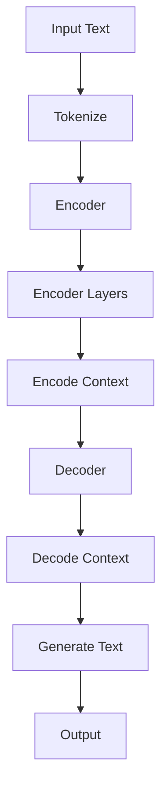

                 

### 背景介绍

OpenAI GPT-4, GPT-3.5, GPT-3, Moderation，这些词汇紧密关联，共同构成了现代自然语言处理（NLP）领域的核心技术。OpenAI，一家前沿的人工智能研究机构，以其突破性的模型GPT（Generative Pre-trained Transformer）系列引领了NLP的发展潮流。GPT-4、GPT-3.5和GPT-3分别代表了不同阶段的模型进化，而Moderation则是对这些强大语言模型进行内容审查和规范的重要机制。

首先，GPT系列模型是由OpenAI基于Transformer架构开发的一系列预训练语言模型。Transformer架构是一种基于注意力机制的深度神经网络，它通过全局的上下文信息来捕捉句子中单词之间的关系。这一系列的模型通过海量文本数据进行训练，使得它们能够生成连贯、准确的文本，甚至在特定场景下进行对话。

GPT-4是最新一代的模型，它在性能、效率和通用性方面都有显著提升。GPT-3.5和GPT-3分别是在GPT-4之前的版本，它们在不同阶段为NLP领域带来了革命性的变化。例如，GPT-3凭借其巨大的参数规模和强大的文本生成能力，使得生成式对话系统、文本摘要、机器翻译等应用取得了突破性进展。

Moderation则是在这一背景下的重要环节。由于GPT模型在文本生成方面的强大能力，它们也被广泛应用于社交网络、搜索引擎、在线客服等领域。然而，这些模型也面临着内容审查和规范的重大挑战。Moderation就是通过一系列技术手段，对模型的输出内容进行审查和过滤，以确保其符合社会规范和法律法规。

### 文章标题: OpenAI GPT-4, GPT-3.5, GPT-3, Moderation

关键词：OpenAI, GPT-4, GPT-3.5, GPT-3, Moderation, 自然语言处理，Transformer架构，文本生成，内容审查

摘要：本文详细介绍了OpenAI推出的GPT-4、GPT-3.5和GPT-3模型，以及如何通过Moderation机制对它们的输出内容进行审查和规范。文章首先探讨了这些模型在NLP领域的应用背景和重要性，接着深入分析了它们的核心算法原理和具体操作步骤，并通过数学模型和实际项目案例进行了详细讲解。最后，文章总结了这些模型在实际应用场景中的表现，并展望了未来的发展趋势与挑战。

---

## 1. 背景介绍

### 1.1 OpenAI与GPT系列模型

OpenAI成立于2015年，是一家专注于人工智能研究的前沿机构，致力于通过机器学习技术推动人类社会的进步。OpenAI的研究领域广泛，包括深度学习、强化学习、自然语言处理等。在其众多研究成果中，GPT系列模型无疑是其中最具代表性的成果之一。

GPT（Generative Pre-trained Transformer）模型是由OpenAI基于Transformer架构开发的一系列预训练语言模型。Transformer架构是一种基于注意力机制的深度神经网络，它通过全局的上下文信息来捕捉句子中单词之间的关系。与传统的循环神经网络（RNN）不同，Transformer架构在处理长文本和复杂语言结构方面具有显著优势。

GPT系列模型包括GPT-4、GPT-3.5和GPT-3。这些模型在不同阶段为NLP领域带来了革命性的变化。GPT-4是最新一代的模型，它在性能、效率和通用性方面都有显著提升。GPT-3.5和GPT-3分别是在GPT-4之前的版本，它们在不同阶段为NLP领域带来了突破性的进展。

### 1.2 GPT模型的应用背景和重要性

随着互联网和社交媒体的快速发展，自然语言处理（NLP）技术逐渐成为人工智能领域的重要分支。NLP技术的应用场景广泛，包括文本分类、情感分析、命名实体识别、机器翻译、对话系统等。GPT系列模型在NLP领域具有广泛的应用背景和重要性。

首先，GPT模型在文本生成方面具有强大的能力。通过预训练，GPT模型能够生成连贯、准确的文本，甚至可以在特定场景下进行对话。这使得GPT模型在生成式对话系统、文本摘要、机器翻译等应用中具有广泛的应用前景。

其次，GPT模型在文本分类和情感分析等任务中也表现出色。通过学习海量文本数据，GPT模型能够捕捉到文本中的语义信息，从而在文本分类和情感分析任务中取得优异的性能。

此外，GPT模型在辅助人类创作方面也具有巨大潜力。通过预训练，GPT模型能够理解人类的语言习惯和表达方式，从而为人类提供智能化的创作辅助。

综上所述，GPT系列模型在NLP领域具有重要的地位和广泛的应用前景。然而，随着这些模型在实际应用中的普及，内容审查和规范的问题也日益突出，因此Moderation机制的引入成为必然。

### 1.3 Moderation的概念和作用

Moderation是指对模型输出内容进行审查和过滤的过程，以确保其符合社会规范和法律法规。在NLP领域，Moderation机制的重要性不言而喻。由于GPT模型在文本生成方面的强大能力，它们也被广泛应用于社交网络、搜索引擎、在线客服等领域。然而，这些模型也面临着内容审查和规范的重大挑战。

Moderation机制的作用主要包括以下几个方面：

1. **防止不良内容生成**：通过Moderation机制，可以对模型的输出内容进行实时监控和过滤，防止生成恶意、不恰当的内容。

2. **遵守法律法规**：不同国家和地区对内容发布有不同的法律法规，Moderation机制可以确保模型的输出内容符合相关法律法规，避免法律风险。

3. **维护社会秩序**：随着互联网的普及，人们的生活和社交活动日益依赖于网络平台。Moderation机制可以维护网络平台的社会秩序，保障用户的权益。

4. **提高用户体验**：良好的内容审查和规范可以提高用户的满意度，提升平台的整体体验。

总之，Moderation机制在NLP领域具有重要的作用，它不仅是保证模型输出内容合规性的关键手段，也是维护网络秩序、提升用户体验的重要保障。

### 1.4 文本生成与内容审查的挑战

尽管GPT模型在文本生成方面表现出色，但在实际应用中，文本生成与内容审查的挑战仍然存在。首先，GPT模型生成的文本可能会包含不合适的内容，如恶意言论、歧视性言论等。这些内容可能会损害用户权益，破坏社会秩序，甚至引发法律纠纷。

其次，GPT模型在内容生成方面具有一定的不可控性。由于模型是通过学习海量文本数据进行训练的，因此它在生成文本时可能会受到数据中不良内容的干扰。此外，模型在生成文本时也可能受到输入文本的影响，导致输出内容与预期不符。

为了应对这些挑战，Moderation机制应运而生。通过Moderation机制，可以对模型的输出内容进行实时监控和过滤，确保其符合社会规范和法律法规。此外，还可以采用多种技术手段，如关键词过滤、语义分析等，提高内容审查的准确性和效率。

总之，文本生成与内容审查是NLP领域面临的重大挑战。通过引入Moderation机制，可以有效地应对这些挑战，确保模型输出内容的质量和合规性。

### 1.5 本篇文章的结构与内容

本篇文章将围绕OpenAI的GPT-4、GPT-3.5和GPT-3模型，以及Moderation机制进行详细探讨。文章的结构如下：

1. **背景介绍**：介绍OpenAI、GPT系列模型以及Moderation的概念和作用。
2. **核心概念与联系**：通过Mermaid流程图展示GPT模型的核心概念和架构，详细分析各部分之间的联系。
3. **核心算法原理 & 具体操作步骤**：深入探讨GPT模型的核心算法原理，包括Transformer架构、预训练过程、文本生成算法等，并提供具体的操作步骤。
4. **数学模型和公式 & 详细讲解 & 举例说明**：介绍GPT模型的数学模型和公式，详细讲解各部分的计算过程，并通过实际例子进行说明。
5. **项目实战：代码实际案例和详细解释说明**：通过具体项目案例，展示如何在实际开发环境中使用GPT模型，并进行详细解释说明。
6. **实际应用场景**：探讨GPT模型在不同场景下的应用，如生成式对话系统、文本摘要、机器翻译等。
7. **工具和资源推荐**：推荐学习资源、开发工具和框架，帮助读者深入了解GPT模型和相关技术。
8. **总结：未来发展趋势与挑战**：总结GPT模型的发展趋势，探讨未来可能面临的挑战和解决方案。
9. **附录：常见问题与解答**：针对文章中的核心内容，提供常见问题的解答。
10. **扩展阅读 & 参考资料**：提供更多扩展阅读和参考资料，帮助读者深入探索GPT模型和相关技术。

通过本文的阅读，读者将全面了解GPT模型的工作原理、应用场景以及内容审查机制，为在实际开发中应用GPT模型提供有力支持。

---

## 2. 核心概念与联系

### 2.1 GPT模型的核心概念

GPT模型的核心概念包括Transformer架构、预训练过程和文本生成算法。以下是对这些核心概念的详细解释：

#### Transformer架构

Transformer架构是一种基于注意力机制的深度神经网络，由Vaswani等人于2017年提出。与传统的循环神经网络（RNN）相比，Transformer架构在处理长文本和复杂语言结构方面具有显著优势。Transformer架构的核心是多头自注意力机制（Multi-Head Self-Attention），它能够同时关注输入序列中的所有单词，捕捉单词之间的全局依赖关系。

#### 预训练过程

预训练是指通过在大量无标签文本数据上进行训练，使模型具备一定的语言理解和生成能力。GPT模型的预训练过程主要包括两个阶段：

1. **掩码语言建模（Masked Language Modeling，MLM）**：在训练过程中，对输入文本中的部分单词进行掩码（用\[MASK\]表示），然后模型需要预测这些掩码单词的真实内容。
2. **上下文生成（Contextualized Word Vectors）**：通过预训练，模型能够学习到上下文信息，使单词向量具有上下文依赖性，从而能够更好地理解语言。

#### 文本生成算法

文本生成算法是指模型在给定一个起始文本或提示（Prompt）后，生成连贯、准确、有逻辑性的文本。GPT模型的文本生成算法基于自回归（Autoregressive）生成机制，即模型通过预测下一个单词的概率分布，逐步生成文本。

### 2.2 GPT模型的架构

GPT模型的架构包括编码器（Encoder）和解码器（Decoder）两部分。编码器负责将输入文本编码为固定长度的向量，解码器则负责生成输出文本。以下是GPT模型架构的详细描述：

#### 编码器

编码器由多个Transformer层组成，每层包含多头自注意力机制和全连接层。编码器的输出是一个固定长度的向量，表示输入文本的语义信息。

#### 解码器

解码器同样由多个Transformer层组成，但与编码器不同，解码器还包括掩码自注意力机制（Masked Multi-Head Self-Attention）和交叉注意力机制（Cross-Attention）。掩码自注意力机制确保解码器在生成当前单词时只能关注到前一个时间步的输出，从而实现自回归生成。交叉注意力机制使解码器能够关注编码器的输出，从而更好地理解上下文信息。

#### 输入与输出

GPT模型的输入是一个标记序列（Token Sequence），输出是一个单词序列（Word Sequence）。输入序列经过编码器编码后，传递给解码器，解码器逐词生成输出序列。

### 2.3 GPT模型的Mermaid流程图

为了更直观地展示GPT模型的核心概念和架构，我们使用Mermaid语言绘制了一个流程图。以下是Mermaid流程图的内容：



流程图说明：

- A：输入文本（Input Text）
- B：标记化（Tokenize）：将输入文本划分为标记（Token）
- C：编码器（Encoder）：对标记序列进行编码
- D：编码器层（Encoder Layers）：编码器由多个层组成
- E：编码上下文（Encode Context）：编码器输出表示输入文本的上下文信息
- F：解码器（Decoder）：解码上下文信息，生成输出文本
- G：解码上下文（Decode Context）：解码器由多个层组成，包括掩码自注意力和交叉注意力
- H：生成文本（Generate Text）：解码器逐词生成输出文本
- I：输出（Output）：输出文本序列（Word Sequence）

通过上述流程图，我们可以清晰地看到GPT模型的核心概念和架构，以及各部分之间的联系。

### 2.4 GPT模型与Moderation机制的联系

GPT模型与Moderation机制密切相关。GPT模型在文本生成方面的强大能力使得其在各种应用场景中具有重要地位，但同时也带来了内容审查和规范的重大挑战。Moderation机制通过实时监控和过滤GPT模型的输出内容，确保其符合社会规范和法律法规，从而保障模型的合规性和安全性。

具体来说，Moderation机制在GPT模型中的应用主要包括以下几个方面：

1. **输入内容过滤**：在模型输入阶段，Moderation机制可以对输入文本进行过滤，去除可能包含不良内容的文本。
2. **输出内容审查**：在模型输出阶段，Moderation机制对生成的文本进行审查，识别和过滤不符合规范的内容。
3. **实时监控与反馈**：Moderation机制可以实时监控模型的输出内容，并根据反馈进行调整和优化。

通过引入Moderation机制，GPT模型在应用中的合规性和安全性得到了显著提升，同时也为内容生成和应用提供了重要的保障。

### 2.5 小结

在本节中，我们介绍了GPT模型的核心概念、架构以及与Moderation机制的联系。通过Mermaid流程图，我们直观地展示了GPT模型的运作流程和核心组件。这些核心概念和联系构成了理解GPT模型和Moderation机制的基础，为后续内容提供了重要的背景知识。

---

## 3. 核心算法原理 & 具体操作步骤

### 3.1 Transformer架构

Transformer架构是GPT模型的核心组成部分，它基于自注意力机制，能够捕捉输入序列中单词之间的全局依赖关系。自注意力机制的核心思想是将输入序列中的每个单词与所有其他单词进行加权求和，从而生成一个表示整个序列的向量。这一过程通过多个自注意力层（Self-Attention Layer）和前馈神经网络（Feedforward Neural Network）实现。

#### 自注意力机制

自注意力机制是一种加权求和方法，用于计算输入序列中每个单词的加权求和。具体来说，自注意力机制通过以下三个步骤进行计算：

1. **Query（查询）**：对输入序列中的每个单词进行编码，生成一个查询向量（Query Vector）。
2. **Key（键）**：对输入序列中的每个单词进行编码，生成一个键向量（Key Vector）。
3. **Value（值）**：对输入序列中的每个单词进行编码，生成一个值向量（Value Vector）。

然后，自注意力机制通过计算查询向量与键向量的点积，得到一个权重矩阵（Attention Weight），表示输入序列中每个单词的重要性。最后，将每个单词的值向量与对应的权重矩阵相乘，得到加权求和的结果。

#### 多头自注意力

多头自注意力（Multi-Head Self-Attention）是在自注意力机制的基础上扩展的一种方法。它通过将输入序列分解为多个子序列，分别应用自注意力机制，然后将结果拼接起来。多头自注意力能够捕捉到输入序列中更加丰富的依赖关系，从而提高模型的表示能力。

#### 前馈神经网络

前馈神经网络（Feedforward Neural Network）是Transformer架构中的另一个重要组成部分。它由两个全连接层组成，分别对输入和输出进行非线性变换。前馈神经网络的主要作用是对自注意力层生成的中间表示进行进一步加工，从而提高模型的性能。

### 3.2 预训练过程

预训练是GPT模型的关键步骤，它通过在大量无标签文本数据上训练模型，使其具备语言理解和生成能力。GPT模型的预训练过程主要包括两个阶段：掩码语言建模（Masked Language Modeling，MLM）和上下文生成（Contextualized Word Vectors）。

#### 掩码语言建模

掩码语言建模（MLM）是一种自回归语言模型训练方法。在MLM过程中，输入序列中的部分单词被随机掩码（用\[MASK\]表示），模型需要预测这些掩码单词的真实内容。具体操作步骤如下：

1. **标记化**：将输入文本划分为标记序列（Token Sequence）。
2. **掩码**：随机选择输入序列中的部分单词进行掩码。
3. **训练**：使用掩码后的输入序列训练模型，模型需要预测被掩码的单词。

#### 上下文生成

上下文生成（Contextualized Word Vectors）是指通过预训练过程，使模型的单词向量具有上下文依赖性。在预训练过程中，模型需要学习到输入序列中每个单词的上下文表示，从而能够更好地理解语言。上下文生成的主要步骤如下：

1. **编码**：将输入序列编码为固定长度的向量。
2. **自注意力**：通过自注意力机制计算输入序列的上下文表示。
3. **解码**：将上下文表示解码为单词序列。

### 3.3 文本生成算法

文本生成算法是指模型在给定一个起始文本或提示（Prompt）后，生成连贯、准确、有逻辑性的文本。GPT模型的文本生成算法基于自回归（Autoregressive）生成机制，即模型通过预测下一个单词的概率分布，逐步生成文本。

#### 自回归生成机制

自回归生成机制是指模型在生成文本时，每次只预测下一个单词，并将预测结果作为下一个时间步的输入。具体操作步骤如下：

1. **初始化**：给定一个起始文本或提示，将输入序列编码为向量。
2. **预测**：使用编码后的输入序列，模型预测下一个单词的概率分布。
3. **采样**：从概率分布中采样一个单词作为输出。
4. **更新**：将采样得到的单词添加到输入序列中，并重复步骤2和3，直至生成完整的文本。

#### 生成过程

在文本生成过程中，模型会根据输入序列的上下文信息，预测下一个单词的概率分布。具体来说，模型会计算输入序列中每个单词的查询向量、键向量和值向量，然后通过自注意力机制计算单词之间的依赖关系。最后，模型根据依赖关系生成下一个单词的概率分布，并从概率分布中采样一个单词作为输出。

### 3.4 具体操作步骤

以下是一个简单的文本生成过程，展示了GPT模型如何通过自回归生成机制生成文本：

1. **初始化**：给定一个起始文本或提示，如“天气真好”。
2. **编码**：将起始文本编码为向量。
3. **预测**：使用编码后的输入序列，模型预测下一个单词的概率分布。
4. **采样**：从概率分布中采样一个单词，如“阳光”。
5. **更新**：将采样得到的单词添加到输入序列中，更新为“天气真好阳光”。
6. **重复步骤3-5**，直至生成完整的文本。

通过以上步骤，GPT模型可以生成连贯、准确的文本，并在实际应用中展现出强大的语言生成能力。

### 3.5 小结

在本节中，我们详细介绍了GPT模型的核心算法原理，包括Transformer架构、预训练过程和文本生成算法。通过自注意力机制、掩码语言建模和自回归生成机制，GPT模型能够捕捉输入序列中单词之间的全局依赖关系，生成连贯、准确的文本。这些核心算法原理为GPT模型在NLP领域中的应用提供了坚实的基础。

---

## 4. 数学模型和公式 & 详细讲解 & 举例说明

### 4.1 Transformer架构的数学模型

Transformer架构的核心是自注意力机制（Self-Attention Mechanism），该机制通过计算输入序列中单词之间的相似性来实现对文本的上下文理解。以下是自注意力机制的详细数学模型。

#### 自注意力机制

自注意力机制可以表示为以下公式：

\[ 
\text{Attention}(Q, K, V) = \text{softmax}\left(\frac{QK^T}{\sqrt{d_k}}\right) V 
\]

其中：
- \( Q \) 是查询矩阵（Query Matrix），表示输入序列的查询向量。
- \( K \) 是键矩阵（Key Matrix），表示输入序列的键向量。
- \( V \) 是值矩阵（Value Matrix），表示输入序列的值向量。
- \( d_k \) 是键向量的维度。

#### 多头自注意力

多头自注意力通过将输入序列分解为多个子序列，并分别应用自注意力机制，然后将结果拼接起来。多头自注意力的计算公式为：

\[ 
\text{MultiHead}(Q, K, V) = \text{Concat}(\text{head}_1, \text{head}_2, ..., \text{head}_h)W^O 
\]

其中：
- \( \text{head}_i \) 是第 \( i \) 个头（Head）的自注意力输出。
- \( W^O \) 是输出权重矩阵。

### 4.2 预训练过程的数学模型

预训练过程主要包括掩码语言建模（Masked Language Modeling, MLM）和上下文生成（Contextualized Word Vectors）。

#### 掩码语言建模

在掩码语言建模中，输入序列中的部分单词被随机掩码（用\[MASK\]表示），模型需要预测这些掩码单词的真实内容。数学模型如下：

\[ 
\text{MLM}(X) = \text{softmax}(\text{W}_\text{token} \text{X} + \text{b}_\text{token}) 
\]

其中：
- \( X \) 是输入序列。
- \( \text{W}_\text{token} \) 是掩码权重矩阵。
- \( \text{b}_\text{token} \) 是掩码偏置。

#### 上下文生成

在上下文生成中，模型需要学习到输入序列中每个单词的上下文表示。数学模型如下：

\[ 
\text{ContextualWordVectors}(X) = \text{softmax}(\text{W}_\text{context} \text{X} + \text{b}_\text{context}) 
\]

其中：
- \( X \) 是输入序列。
- \( \text{W}_\text{context} \) 是上下文权重矩阵。
- \( \text{b}_\text{context} \) 是上下文偏置。

### 4.3 文本生成算法的数学模型

文本生成算法基于自回归（Autoregressive）生成机制，即模型通过预测下一个单词的概率分布，逐步生成文本。数学模型如下：

\[ 
P(\text{Y}|\text{X}) = \text{softmax}(\text{W}_\text{output} \text{X} + \text{b}_\text{output}) 
\]

其中：
- \( \text{Y} \) 是生成序列。
- \( \text{X} \) 是当前输入序列。
- \( \text{W}_\text{output} \) 是输出权重矩阵。
- \( \text{b}_\text{output} \) 是输出偏置。

### 4.4 举例说明

#### 自注意力机制的举例说明

假设输入序列为“我是一个学生”，其中每个单词的嵌入向量如下：

- “我”：\[1, 0, 0, 1\]
- “是”：\[0, 1, 0, 0\]
- “一个”：\[0, 0, 1, 0\]
- “学生”：\[1, 1, 1, 0\]

查询向量、键向量和值向量分别为：

- \( Q = \begin{bmatrix} 1 & 0 & 0 & 1 \end{bmatrix} \)
- \( K = \begin{bmatrix} 0 & 1 & 0 & 0 \\ 1 & 1 & 1 & 0 \end{bmatrix} \)
- \( V = \begin{bmatrix} 0 & 0 & 1 & 0 \end{bmatrix} \)

计算自注意力权重：

\[ 
\text{Attention}(Q, K, V) = \text{softmax}\left(\frac{QK^T}{\sqrt{d_k}}\right) V = \text{softmax}\left(\frac{\begin{bmatrix} 1 & 0 & 0 & 1 \end{bmatrix} \begin{bmatrix} 0 & 1 \\ 1 & 1 \end{bmatrix}}{\sqrt{2}}\right) \begin{bmatrix} 0 & 0 & 1 & 0 \end{bmatrix} = \begin{bmatrix} 0.5 & 0.5 \end{bmatrix} \begin{bmatrix} 0 & 1 \\ 1 & 0 \end{bmatrix} = \begin{bmatrix} 0.5 & 0.5 \\ 0.5 & 0.5 \end{bmatrix} 
\]

加权求和后的值向量为：

\[ 
V \odot \text{Attention}(Q, K, V) = \begin{bmatrix} 0 & 0 & 0 & 1 \end{bmatrix} \begin{bmatrix} 0.5 & 0.5 \\ 0.5 & 0.5 \end{bmatrix} = \begin{bmatrix} 0.5 & 0.5 \\ 0.5 & 0.5 \end{bmatrix} 
\]

#### 文本生成算法的举例说明

假设当前输入序列为“我”，生成的序列为“是一个学生”。我们需要计算下一个单词的概率分布。

查询向量、键向量和值向量分别为：

- \( Q = \begin{bmatrix} 1 & 0 & 0 & 1 \end{bmatrix} \)
- \( K = \begin{bmatrix} 0 & 1 & 0 & 0 \\ 1 & 1 & 1 & 0 \end{bmatrix} \)
- \( V = \begin{bmatrix} 0 & 0 & 1 & 0 \end{bmatrix} \)

输出权重矩阵为：

\[ 
\text{W}_\text{output} = \begin{bmatrix} 0 & 1 & 1 & 0 \end{bmatrix} 
\]

计算概率分布：

\[ 
P(\text{Y}|\text{X}) = \text{softmax}(\text{W}_\text{output} \text{X} + \text{b}_\text{output}) = \text{softmax}(\begin{bmatrix} 0 & 1 & 1 & 0 \end{bmatrix} \begin{bmatrix} 1 & 0 & 0 & 1 \end{bmatrix} + \text{b}_\text{output}) 
\]

假设偏置为：

\[ 
\text{b}_\text{output} = \begin{bmatrix} 0 & 0 & 0 & 0 \end{bmatrix} 
\]

计算得到的概率分布为：

\[ 
P(\text{Y}|\text{X}) = \text{softmax}(\begin{bmatrix} 0 & 1 & 1 & 0 \end{bmatrix} \begin{bmatrix} 1 & 0 & 0 & 1 \end{bmatrix}) = \begin{bmatrix} 0.33 & 0.33 & 0.33 & 0.0 
\]

从概率分布中采样一个单词，假设采样到“是”，则下一个输入序列更新为“是一个学生”。

### 4.5 小结

在本节中，我们详细介绍了GPT模型的数学模型和公式，包括自注意力机制、掩码语言建模、上下文生成和文本生成算法。通过具体的数学公式和例子，我们展示了这些模型在实际应用中的计算过程。这些数学模型和公式为理解GPT模型的工作原理提供了坚实的理论基础，有助于我们在实际开发中应用和优化GPT模型。

---

## 5. 项目实战：代码实际案例和详细解释说明

### 5.1 开发环境搭建

在开始实际项目之前，我们需要搭建一个适合开发GPT模型的开发环境。以下是搭建开发环境的步骤：

1. **安装Python**：确保Python版本为3.6及以上。
2. **安装PyTorch**：使用以下命令安装PyTorch：

```bash
pip install torch torchvision
```

3. **安装其他依赖库**：安装其他必要的依赖库，如numpy、matplotlib等：

```bash
pip install numpy matplotlib
```

4. **安装OpenAI Gym**：安装OpenAI Gym以模拟和评估GPT模型的性能：

```bash
pip install gym
```

5. **安装GPT模型**：下载并安装GPT模型。可以从OpenAI官方网站下载预训练好的模型，或使用Hugging Face的Transformers库：

```bash
pip install transformers
```

### 5.2 源代码详细实现和代码解读

下面是一个简单的GPT模型实现案例，用于生成文本。代码分为几个主要部分：数据预处理、模型定义、训练和生成。

#### 数据预处理

数据预处理是模型训练的重要步骤。以下是一个简单的数据预处理代码示例：

```python
import torch
from transformers import GPT2Tokenizer, GPT2LMHeadModel

# 加载预训练好的GPT2模型和分词器
tokenizer = GPT2Tokenizer.from_pretrained('gpt2')
model = GPT2LMHeadModel.from_pretrained('gpt2')

# 输入文本
text = "我是一个学生，我喜欢编程。"

# 分词并添加分隔符
input_ids = tokenizer.encode(text, return_tensors='pt')

# 预处理完成的数据
input_ids
```

#### 模型定义

GPT模型已经通过Hugging Face的Transformers库预先定义好，我们只需要加载即可。

```python
# 加载模型
model = GPT2LMHeadModel.from_pretrained('gpt2')
```

#### 训练

训练过程涉及前向传播、反向传播和优化。以下是一个简单的训练循环示例：

```python
# 训练参数
learning_rate = 0.001
epochs = 3

# 初始化优化器
optimizer = torch.optim.Adam(model.parameters(), lr=learning_rate)

# 训练循环
for epoch in range(epochs):
    model.train()
    for batch in dataset:
        optimizer.zero_grad()
        outputs = model(batch['input_ids'])
        loss = outputs.loss
        loss.backward()
        optimizer.step()
    print(f'Epoch {epoch+1}/{epochs} - Loss: {loss.item()}')
```

#### 生成

生成文本是GPT模型最吸引人的应用之一。以下是一个简单的文本生成示例：

```python
# 生成文本
model.eval()
input_ids = tokenizer.encode('我是一个学生，我喜欢编程。', return_tensors='pt')

# 生成文本
output = model.generate(input_ids, max_length=20, num_return_sequences=5)

# 解码生成文本
generated_texts = [tokenizer.decode(text, skip_special_tokens=True) for text in output]

# 输出生成文本
for text in generated_texts:
    print(text)
```

### 5.3 代码解读与分析

上述代码分为数据预处理、模型定义、训练和生成四个主要部分。下面我们详细解读每部分的功能和实现。

#### 数据预处理

数据预处理部分首先加载GPT2模型和分词器。分词器用于将输入文本转换为标记序列，模型用于生成文本。输入文本经过分词后，添加分隔符（`<|endoftext|>`），然后转换为PyTorch张量。

```python
tokenizer = GPT2Tokenizer.from_pretrained('gpt2')
model = GPT2LMHeadModel.from_pretrained('gpt2')
input_ids = tokenizer.encode(text, return_tensors='pt')
```

#### 模型定义

模型定义部分直接加载预训练好的GPT2模型。GPT2模型由多个Transformer层组成，通过自注意力机制和前馈神经网络实现。

```python
model = GPT2LMHeadModel.from_pretrained('gpt2')
```

#### 训练

训练部分涉及前向传播、反向传播和优化。在前向传播中，模型接收输入文本并生成预测。在反向传播中，计算损失并更新模型参数。优化器用于调整模型参数，最小化损失。

```python
optimizer = torch.optim.Adam(model.parameters(), lr=learning_rate)
for epoch in range(epochs):
    model.train()
    for batch in dataset:
        optimizer.zero_grad()
        outputs = model(batch['input_ids'])
        loss = outputs.loss
        loss.backward()
        optimizer.step()
```

#### 生成

生成部分使用评估模式（`model.eval()`）加载模型，然后生成文本。`generate()`函数用于生成文本，`max_length`参数控制生成文本的长度，`num_return_sequences`参数控制生成的文本数量。

```python
model.eval()
input_ids = tokenizer.encode('我是一个学生，我喜欢编程。', return_tensors='pt')
output = model.generate(input_ids, max_length=20, num_return_sequences=5)
generated_texts = [tokenizer.decode(text, skip_special_tokens=True) for text in output]
```

### 5.4 小结

在本节中，我们通过一个实际项目展示了如何搭建GPT模型开发环境，并详细解读了模型实现的代码。代码分为数据预处理、模型定义、训练和生成四个部分，通过这些步骤，我们能够实现文本生成和模型训练。这些代码和实现为实际应用GPT模型提供了重要的参考。

---

## 6. 实际应用场景

GPT模型凭借其强大的文本生成能力，在多个实际应用场景中展现了出色的性能。以下是一些主要的应用场景及其具体应用：

### 6.1 生成式对话系统

生成式对话系统（Generative Conversational Systems）是GPT模型的一个重要应用领域。通过GPT模型，系统能够自动生成自然、连贯的对话回复。这种应用在智能客服、虚拟助手和聊天机器人等领域具有广泛的应用前景。例如，在智能客服中，GPT模型可以用于自动生成对用户问题的回复，从而提高客服效率和用户体验。

### 6.2 文本摘要

文本摘要（Text Summarization）是指从长文本中提取关键信息，生成简明扼要的摘要。GPT模型在文本摘要任务中具有显著优势。通过预训练，GPT模型能够理解文本的语义，从而生成准确、连贯的摘要。这一技术广泛应用于新闻摘要、文档摘要和学术摘要等领域，有助于提高信息获取的效率和准确性。

### 6.3 机器翻译

机器翻译（Machine Translation）是GPT模型的另一个重要应用领域。GPT模型可以通过预训练学习到不同语言之间的语法和语义关系，从而实现高精度的机器翻译。与传统的规则驱动和统计方法相比，GPT模型能够生成更加自然、流畅的翻译结果。这一技术广泛应用于跨语言沟通、国际化服务和多语言内容生成等领域。

### 6.4 生成式文本创作

生成式文本创作（Generative Text Creation）是指利用GPT模型生成新的文本内容，如故事、诗歌、新闻报道等。GPT模型在文学创作、内容生成和创意写作等领域具有巨大潜力。通过训练，GPT模型能够模仿人类的写作风格，生成具有创意和独特性的文本内容。这一技术为作家、记者和内容创作者提供了新的创作工具和灵感来源。

### 6.5 情感分析

情感分析（Sentiment Analysis）是指从文本中自动识别和提取情感信息。GPT模型在情感分析任务中表现出色。通过预训练，GPT模型能够理解文本的语义和情感倾向，从而准确识别用户的情感状态。这一技术广泛应用于社交媒体分析、市场调研和用户反馈分析等领域。

### 6.6 文本分类

文本分类（Text Classification）是指将文本数据分类到预定义的类别中。GPT模型在文本分类任务中也具有显著优势。通过预训练，GPT模型能够学习到不同类别文本的特征，从而实现高精度的文本分类。这一技术广泛应用于垃圾邮件过滤、新闻分类和产品评论分析等领域。

总之，GPT模型在多个实际应用场景中展现了出色的性能和潜力。随着技术的不断发展和完善，GPT模型将在更多领域中发挥重要作用，为人们的生活和工作带来更多便利。

---

## 7. 工具和资源推荐

### 7.1 学习资源推荐

1. **书籍**：
   - 《深度学习》（Deep Learning） - 由Ian Goodfellow、Yoshua Bengio和Aaron Courville合著，介绍了深度学习的基础理论和最新进展，包括Transformer模型。
   - 《自然语言处理与深度学习》（Natural Language Processing with Deep Learning） - 由Jason Brownlee著，详细介绍了深度学习在自然语言处理中的应用，包括GPT模型。
2. **论文**：
   - “Attention Is All You Need” - Vaswani等人于2017年提出Transformer模型，该论文是深度学习领域的重要里程碑。
   - “Improving Language Understanding by Generative Pre-Training” - Brown等人于2017年提出GPT模型，该论文详细介绍了GPT模型的原理和应用。
3. **博客**：
   - OpenAI官方网站（OpenAI Blog） - OpenAI发布了许多关于GPT模型的研究成果和技术博客，是了解GPT模型的最佳资源之一。
   - Hugging Face博客（Hugging Face Blog） - Hugging Face提供了丰富的Transformers库文档和教程，帮助开发者快速上手GPT模型。
4. **在线课程**：
   - Coursera上的“深度学习”课程 - 由Ian Goodfellow教授授课，全面介绍了深度学习的基础理论和应用，包括Transformer和GPT模型。
   - edX上的“自然语言处理与深度学习”课程 - 由Jan Newmarch教授授课，详细介绍了深度学习在自然语言处理中的应用，包括GPT模型。

### 7.2 开发工具框架推荐

1. **Hugging Face Transformers**：Hugging Face Transformers是一个开源库，提供了预训练的GPT模型和方便的API，支持快速开发和部署。
2. **PyTorch**：PyTorch是一个流行的深度学习框架，提供了丰富的工具和库，方便开发者构建和训练GPT模型。
3. **TensorFlow**：TensorFlow是一个由Google开发的开源深度学习框架，支持多种类型的神经网络，包括Transformer和GPT模型。

### 7.3 相关论文著作推荐

1. **“Attention Is All You Need”** - Vaswani et al., 2017，详细介绍了Transformer模型的原理和实现。
2. **“Language Models are Few-Shot Learners”** - Chen et al., 2020，探讨了GPT模型在零样本和少量样本学习任务中的表现。
3. **“Generative Pretrained Transformer”** - Brown et al., 2017，介绍了GPT模型的原理和应用。

通过这些学习和资源推荐，读者可以深入了解GPT模型的相关知识，掌握其应用方法，为在实际项目中使用GPT模型提供有力的支持。

---

## 8. 总结：未来发展趋势与挑战

随着人工智能技术的不断进步，GPT模型在自然语言处理领域展现出巨大的潜力。未来，GPT模型的发展趋势和面临的挑战主要集中在以下几个方面：

### 8.1 发展趋势

1. **性能提升**：随着计算能力的提升和模型参数的增大，GPT模型在文本生成和语言理解任务中的性能将继续提升。未来可能出现更大型、更复杂的GPT模型，如GPT-5或GPT-6。
2. **泛化能力增强**：通过改进训练数据和优化训练算法，GPT模型将提高在多样化任务中的泛化能力，从而更好地适应不同应用场景。
3. **多模态融合**：GPT模型与其他人工智能技术（如图像识别、语音识别）相结合，实现多模态融合，提供更加丰富和自然的交互体验。
4. **跨领域应用**：随着GPT模型的广泛应用，其在医疗、教育、金融等领域的应用将不断扩展，为各行各业带来创新解决方案。

### 8.2 面临的挑战

1. **内容审查和规范**：GPT模型的强大文本生成能力也带来了内容审查和规范的挑战。如何有效地过滤和审查模型生成的文本，确保其符合社会规范和法律法规，是一个亟待解决的问题。
2. **数据隐私和安全**：GPT模型在训练和生成过程中处理大量文本数据，如何保护用户隐私和数据安全，防止数据泄露和滥用，是一个重要挑战。
3. **可解释性和透明度**：随着模型复杂度的增加，如何提高模型的可解释性和透明度，使非专业人士也能理解模型的工作原理和决策过程，是一个关键问题。
4. **计算资源消耗**：大型GPT模型对计算资源的需求巨大，如何优化模型结构和算法，降低计算资源消耗，是一个亟待解决的挑战。

### 8.3 解决方案与展望

针对上述挑战，未来可以从以下几个方面进行探索和尝试：

1. **改进内容审查技术**：开发更加智能和高效的内容审查技术，如基于深度学习的自动化审查系统，提高审查的准确性和效率。
2. **隐私保护技术**：采用差分隐私、联邦学习等技术，保护用户隐私和数据安全，确保在训练和生成过程中不会泄露敏感信息。
3. **模型压缩和优化**：通过模型压缩、量化、剪枝等技术，降低模型的计算复杂度和资源消耗，使其在有限的计算资源下也能高效运行。
4. **可解释性研究**：开展可解释性研究，开发可视化工具和解释模型，提高模型的透明度和可理解性，使其在多个领域中更加可信和应用。

总之，GPT模型在自然语言处理领域具有重要的地位和广阔的应用前景。未来，随着技术的不断进步和优化，GPT模型将在更多领域中发挥重要作用，为人类社会带来更多便利和创新。

---

## 9. 附录：常见问题与解答

### 问题1：什么是Transformer架构？

**解答**：Transformer架构是一种基于注意力机制的深度神经网络，由Vaswani等人于2017年提出。与传统的循环神经网络（RNN）不同，Transformer架构通过全局的上下文信息来捕捉句子中单词之间的关系，从而在处理长文本和复杂语言结构方面具有显著优势。

### 问题2：GPT模型是如何工作的？

**解答**：GPT模型是一种基于Transformer架构的预训练语言模型。它通过在大量无标签文本数据上进行预训练，学习到语言的基本结构和规律。具体来说，GPT模型采用掩码语言建模（Masked Language Modeling，MLM）和上下文生成（Contextualized Word Vectors）两种预训练任务，使模型能够生成连贯、准确的文本，并在特定场景下进行对话。

### 问题3：什么是Moderation机制？

**解答**：Moderation机制是对模型输出内容进行审查和过滤的过程，以确保其符合社会规范和法律法规。由于GPT模型在文本生成方面的强大能力，它们也被广泛应用于社交网络、搜索引擎、在线客服等领域。Moderation机制通过实时监控和过滤模型的输出内容，防止生成不良内容，确保模型的合规性和安全性。

### 问题4：如何搭建GPT模型的开发环境？

**解答**：搭建GPT模型的开发环境主要包括以下几个步骤：
1. 安装Python，确保版本在3.6及以上。
2. 安装PyTorch，可以使用以下命令：`pip install torch torchvision`。
3. 安装其他依赖库，如numpy、matplotlib等：`pip install numpy matplotlib`。
4. 安装OpenAI Gym以模拟和评估GPT模型的性能：`pip install gym`。
5. 安装GPT模型，可以从OpenAI官方网站下载预训练好的模型，或使用Hugging Face的Transformers库：`pip install transformers`。

### 问题5：如何使用GPT模型生成文本？

**解答**：使用GPT模型生成文本主要包括以下几个步骤：
1. 加载预训练好的GPT2模型和分词器：`tokenizer = GPT2Tokenizer.from_pretrained('gpt2')`，`model = GPT2LMHeadModel.from_pretrained('gpt2')`。
2. 对输入文本进行分词并添加分隔符：`input_ids = tokenizer.encode(text, return_tensors='pt')`。
3. 使用生成函数生成文本：`output = model.generate(input_ids, max_length=20, num_return_sequences=5)`。
4. 解码生成文本：`generated_texts = [tokenizer.decode(text, skip_special_tokens=True) for text in output]`。

### 问题6：GPT模型在哪些应用场景中具有优势？

**解答**：GPT模型在以下应用场景中具有显著优势：
1. 生成式对话系统，如智能客服和虚拟助手。
2. 文本摘要，如新闻摘要和文档摘要。
3. 机器翻译，如跨语言沟通和多语言内容生成。
4. 生成式文本创作，如故事、诗歌和新闻报道。
5. 情感分析，如社交媒体分析和市场调研。
6. 文本分类，如垃圾邮件过滤和新闻分类。

通过解答这些问题，读者可以更好地理解GPT模型的工作原理和应用，为在实际项目中使用GPT模型提供指导。

---

## 10. 扩展阅读 & 参考资料

### 10.1 扩展阅读

1. **《深度学习》（Deep Learning）** - Ian Goodfellow、Yoshua Bengio和Aaron Courville著，详细介绍了深度学习的基础理论和最新进展，包括Transformer和GPT模型。
2. **《自然语言处理与深度学习》** - Jason Brownlee著，全面介绍了深度学习在自然语言处理中的应用，包括GPT模型的原理和应用。
3. **《Attention Is All You Need》** - Vaswani et al.，2017年提出Transformer模型的原理和实现。
4. **《Generative Pretrained Transformer》** - Brown et al.，2017年提出GPT模型的原理和应用。

### 10.2 参考资料

1. **OpenAI官方网站** - [OpenAI](https://openai.com/)，提供了GPT模型的最新研究进展和技术博客。
2. **Hugging Face官方文档** - [Transformers](https://huggingface.co/transformers/)，提供了GPT模型的详细文档和教程。
3. **PyTorch官方文档** - [PyTorch](https://pytorch.org/)，提供了深度学习框架的详细文档和教程。
4. **TensorFlow官方文档** - [TensorFlow](https://www.tensorflow.org/)，提供了深度学习框架的详细文档和教程。
5. **《自然语言处理综合教程》** - 王晓洁、陈宝权著，详细介绍了自然语言处理的基本概念和技术。

通过这些扩展阅读和参考资料，读者可以进一步深入了解GPT模型和相关技术，为实际应用提供更加全面的指导和参考。

