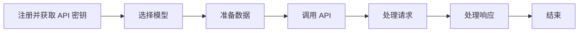

                 

### 1. 背景介绍

#### OpenAI Models API 的诞生背景

OpenAI Models API 是由 OpenAI 公司推出的一项强大的人工智能服务。OpenAI 是一家成立于 2015 年的人工智能研究机构，其宗旨是通过 AI 技术推动人类的进步，并确保其有益于人类。在过去的几年里，OpenAI 在自然语言处理、机器学习、深度学习等领域取得了显著的成果，推出了一系列备受关注的人工智能模型，如 GPT-3、DALL-E、ChatGPT 等。

随着这些模型在学术界和工业界的影响力逐渐扩大，越来越多的开发者和研究人员希望能够更加便捷地使用这些先进的人工智能技术。然而，传统的模型部署和使用方式往往需要复杂的环境搭建和大量的专业知识，这对于许多普通用户来说是一个不小的挑战。因此，OpenAI 决定推出 OpenAI Models API，旨在提供一种简单、高效、便捷的方式来使用这些强大的人工智能模型。

#### OpenAI Models API 的目标用户

OpenAI Models API 的目标用户主要包括以下几个方面：

1. **开发人员**：包括软件开发工程师、数据科学家、AI 研究员等，他们希望通过 API 更加方便地使用 OpenAI 的模型进行实验和开发。

2. **企业和机构**：包括初创公司、大型企业、学术机构等，他们希望通过 API 快速集成先进的人工智能技术，提高业务效率和创新能力。

3. **普通用户**：包括对人工智能技术感兴趣的普通用户、学生、爱好者等，他们希望通过 API 了解和体验人工智能的强大功能。

#### OpenAI Models API 的发展历程

OpenAI Models API 的发展历程可以分为以下几个阶段：

1. **初步推出**：2019 年，OpenAI 首次推出了 OpenAI API，为开发者提供了一种访问 GPT-3 等模型的接口。

2. **持续更新**：随着 OpenAI 推出更多先进的人工智能模型，OpenAI API 也不断更新和升级，以支持更多的模型和应用场景。

3. **全面开放**：2022 年，OpenAI 正式推出了 OpenAI Models API，将更多的模型和功能开放给广大开发者，进一步降低了人工智能技术的使用门槛。

#### OpenAI Models API 的主要特性

OpenAI Models API 具有以下几个主要特性：

1. **强大的模型支持**：OpenAI Models API 提供了多种先进的人工智能模型，如自然语言处理、图像识别、语音识别等，涵盖了广泛的应用场景。

2. **简单易用的接口**：OpenAI Models API 提供了多种编程语言的 SDK，使得开发者可以轻松地集成和使用这些模型。

3. **高效稳定的性能**：OpenAI Models API 采用了分布式计算和高效的网络架构，确保了高性能和高可用性。

4. **丰富的功能**：OpenAI Models API 提供了多种功能，如文本生成、图像生成、文本翻译、语音合成等，满足不同用户的需求。

5. **灵活的定价策略**：OpenAI Models API 提供了多种定价策略，包括免费试用、按需付费等，让开发者可以根据自己的需求选择最合适的方案。

总之，OpenAI Models API 是一款强大、便捷、高效的人工智能服务，为广大开发者提供了前所未有的便利和可能性，推动了人工智能技术的普及和应用。

---

## 2. 核心概念与联系

### OpenAI Models API 的核心概念

在深入了解 OpenAI Models API 之前，我们需要先了解一些核心概念。以下是一些关键术语的定义：

1. **API（应用程序编程接口）**：API 是一种用于软件应用程序之间交互的接口，它定义了程序如何请求服务和如何处理返回的数据。在 OpenAI Models API 中，API 用于调用 OpenAI 的模型服务。

2. **模型**：模型是指用数学方法表示的数据处理算法，它可以是神经网络、决策树、贝叶斯模型等。OpenAI Models API 提供了多种模型，包括自然语言处理、图像识别、语音识别等。

3. **API 密钥**：API 密钥是用于访问 OpenAI Models API 的唯一标识符。每个用户都需要一个 API 密钥来调用模型。

4. **请求**：请求是指通过 API 发送到 OpenAI 服务器的一个请求消息，它包含调用模型所需的信息。

5. **响应**：响应是指 OpenAI 服务器返回的一个消息，它包含模型处理结果和相关元数据。

### OpenAI Models API 的结构

OpenAI Models API 的结构可以分为以下几个主要部分：

1. **模型仓库**：模型仓库是 OpenAI 存储各种模型的地方，包括自然语言处理、图像识别、语音识别等。每个模型都有自己的文档、代码和测试数据。

2. **API 服务器**：API 服务器是 OpenAI 提供的用于处理 API 请求的后端服务器。它接收来自开发者的请求，调用相应的模型进行处理，并将结果返回给开发者。

3. **客户端库**：客户端库是 OpenAI 提供的用于调用 API 的编程语言库。开发者可以使用这些库在各自的编程语言中调用 OpenAI 的模型服务。

4. **用户界面**：用户界面是 OpenAI 提供的一个用于交互的图形界面，它允许用户通过简单的操作来调用模型、查看结果和调整参数。

### OpenAI Models API 的工作流程

OpenAI Models API 的工作流程可以分为以下几个步骤：

1. **注册并获取 API 密钥**：开发者需要在 OpenAI 的官方网站注册并获取一个 API 密钥。

2. **选择模型**：开发者根据需求从 OpenAI 的模型仓库中选择一个或多个模型。

3. **准备数据**：开发者需要将数据格式化为模型所需的输入格式。

4. **调用 API**：开发者使用客户端库或用户界面向 OpenAI 的 API 服务器发送一个请求，请求中包含模型名称、输入数据和 API 密钥等信息。

5. **处理请求**：OpenAI 的 API 服务器接收请求，调用相应的模型进行数据处理，并将结果返回给开发者。

6. **处理响应**：开发者接收响应，根据需要进一步处理模型返回的结果。

### Mermaid 流程图

以下是 OpenAI Models API 的 Mermaid 流程图，展示了其核心概念和结构：



总之，OpenAI Models API 是一款强大、便捷的人工智能服务，通过其核心概念和结构，开发者可以轻松地使用 OpenAI 的模型进行各种任务。接下来，我们将进一步探讨 OpenAI Models API 的核心算法原理和具体操作步骤。

---

## 3. 核心算法原理 & 具体操作步骤

### OpenAI Models API 的核心算法原理

OpenAI Models API 的核心算法主要基于深度学习和自然语言处理（NLP）技术，尤其是基于大规模语言模型（如 GPT-3）。以下是 OpenAI Models API 的核心算法原理：

1. **深度学习**：深度学习是一种通过多层神经网络进行数据分析和建模的技术。它能够自动从大量数据中学习特征和模式，并在不同任务中表现出优异的性能。

2. **自然语言处理（NLP）**：NLP 是研究如何使计算机理解和处理自然语言的技术。OpenAI Models API 的许多模型都是基于 NLP 技术，能够处理文本、语音等自然语言数据。

3. **大规模语言模型**：大规模语言模型是一种能够理解和使用自然语言的深度学习模型。GPT-3 是 OpenAI 推出的一个具有 1750 亿参数的预训练语言模型，它在各种 NLP 任务中都表现出色。

### OpenAI Models API 的具体操作步骤

以下是使用 OpenAI Models API 的具体操作步骤：

#### 步骤 1：注册并获取 API 密钥

1. 访问 OpenAI 的官方网站 [OpenAI](https://openai.com/)。
2. 注册一个 OpenAI 帐户。
3. 在帐户设置中找到 API 密钥，并记下它。

#### 步骤 2：选择模型

1. 在 OpenAI 的模型仓库中查找你需要的模型。例如，你可以选择 GPT-3 模型。
2. 记下所选模型的 API 端点（endpoint）。

#### 步骤 3：准备数据

1. 确定你需要处理的输入数据类型（文本、图像、音频等）。
2. 将输入数据格式化为模型所需的输入格式。

#### 步骤 4：调用 API

1. 使用所选编程语言的客户端库或用户界面发送一个 HTTP POST 请求到模型的 API 端点。
2. 在请求体（body）中包含以下字段：

   - `model`: 模型的名称，例如 "text-davinci-002"。
   - `prompt`: 输入文本。
   - `temperature`: 控制生成文本多样性的参数。
   - `max_tokens`: 限制生成的文本长度。
   - `top_p`: 用于文本生成的另一种多样性参数。
   - `n`: 生成多个文本样本的数量。
   - `stop`: 用于停止文本生成的字符串。
   - `echo`: 是否返回与输入相同的文本。
   - `api_key`: 你的 API 密钥。

   例如，以下是一个使用 Python 的 requests 库调用 GPT-3 模型的示例代码：

   ```python
   import requests
   import json
   
   url = "https://api.openai.com/v1/engine/davinci-codex/completions"
   headers = {
       "Content-Type": "application/json",
       "Authorization": "Bearer YOUR_API_KEY",
   }
   data = {
       "model": "text-davinci-002",
       "prompt": "请编写一篇关于人工智能的文章。",
       "temperature": 0.5,
       "max_tokens": 100,
   }
   response = requests.post(url, headers=headers, json=data)
   print(response.json())
   ```

#### 步骤 5：处理请求

OpenAI 的 API 服务器会接收请求，调用相应的模型进行处理，并将结果返回给开发者。

#### 步骤 6：处理响应

开发者需要解析响应，提取出模型生成的文本或其他数据，并根据需要进行进一步的处理。

### 实例：使用 Python 调用 GPT-3 模型

以下是一个简单的 Python 脚本，演示如何使用 requests 库调用 GPT-3 模型生成文本：

```python
import requests
import json

# 设置 API 密钥
api_key = "YOUR_API_KEY"

# 设置模型名称和请求参数
url = "https://api.openai.com/v1/engine/davinci-codex/completions"
headers = {
    "Content-Type": "application/json",
    "Authorization": "Bearer " + api_key,
}
data = {
    "model": "text-davinci-002",
    "prompt": "请写一篇关于人工智能的发展趋势。",
    "temperature": 0.5,
    "max_tokens": 100,
}

# 发送请求
response = requests.post(url, headers=headers, json=data)

# 解析响应
if response.status_code == 200:
    result = response.json()
    print("生成的文本：")
    print(result["choices"][0]["text"])
else:
    print("请求失败，错误代码：", response.status_code)
    print("错误信息：", response.text)
```

运行上述脚本，你将得到一篇关于人工智能发展趋势的文本。

总之，OpenAI Models API 提供了一种简单、高效的方式，让开发者能够使用先进的人工智能模型进行各种任务。通过上述步骤，我们可以轻松地调用 OpenAI 的模型，生成文本、图像等结果。接下来，我们将进一步探讨 OpenAI Models API 中的数学模型和公式。

---

## 4. 数学模型和公式 & 详细讲解 & 举例说明

### 深度学习中的基本数学模型

深度学习是人工智能领域的一个重要分支，它依赖于多种数学模型和算法来实现智能推理和预测。在 OpenAI Models API 中，深度学习模型，尤其是大规模语言模型，如 GPT-3，是其核心。以下是一些深度学习中常用的数学模型和公式：

1. **神经网络**：神经网络是一种基于生物神经网络的结构，它通过模拟神经元之间的连接和激活函数来实现数据处理和预测。

   公式： 
   \[ z = W \cdot x + b \]
   \[ a = \sigma(z) \]
   其中，\( W \) 是权重矩阵，\( x \) 是输入向量，\( b \) 是偏置向量，\( \sigma \) 是激活函数（通常是 Sigmoid、ReLU 或 Softmax 函数）。

2. **反向传播算法**：反向传播算法是一种用于训练神经网络的优化算法，它通过计算梯度来调整权重和偏置，以最小化损失函数。

   公式：
   \[ \Delta W = -\alpha \cdot \frac{\partial L}{\partial W} \]
   \[ \Delta b = -\alpha \cdot \frac{\partial L}{\partial b} \]
   其中，\( \alpha \) 是学习率，\( L \) 是损失函数。

3. **损失函数**：损失函数用于衡量模型的预测值与真实值之间的差距，常见的损失函数包括均方误差（MSE）和交叉熵（Cross-Entropy）。

   公式：
   \[ MSE = \frac{1}{n} \sum_{i=1}^{n} (y_i - \hat{y}_i)^2 \]
   \[ Cross-Entropy = -\sum_{i=1}^{n} y_i \log(\hat{y}_i) \]
   其中，\( y_i \) 是真实标签，\( \hat{y}_i \) 是预测值。

4. **优化算法**：优化算法用于调整模型参数，以最小化损失函数。常见的优化算法包括梯度下降（Gradient Descent）、随机梯度下降（Stochastic Gradient Descent）和 Adam 优化器。

   公式：
   \[ \theta_{t+1} = \theta_t - \alpha \cdot \nabla_{\theta} J(\theta) \]
   \[ \theta_{t+1} = \theta_t - \alpha \cdot \frac{1}{m} \sum_{i=1}^{m} \nabla_{\theta} J(\theta) \]
   \[ \theta_{t+1} = \theta_t - \alpha \cdot \nabla_{\theta} J(\theta) \]
   其中，\( \theta \) 是模型参数，\( \alpha \) 是学习率，\( J(\theta) \) 是损失函数。

### OpenAI Models API 中的数学模型

OpenAI Models API 中的核心模型是基于大规模语言模型（如 GPT-3），它是一种基于 Transformer 网络的深度学习模型。以下是一些与 GPT-3 相关的数学模型和公式：

1. **Transformer 网络的基本结构**：Transformer 网络是一种基于自注意力机制的深度学习模型，它由编码器（Encoder）和解码器（Decoder）两部分组成。

   公式：
   \[ \text{Encoder}:\quad h = \text{Attention}(W_Q, W_K, W_V, h) \]
   \[ \text{Decoder}:\quad h = \text{Decoder}(h, c) \]
   其中，\( h \) 是输入序列的编码，\( c \) 是上下文向量。

2. **自注意力机制**：自注意力机制是一种计算输入序列中每个元素之间关系的机制，它通过计算权重来加权组合输入序列。

   公式：
   \[ \text{Attention}:\quad \text{score} = \text{softmax}(\frac{QK^T}{\sqrt{d_k}}) \]
   \[ \text{Attention}:\quad \text{output} = \text{softmax}(\text{score} \cdot V) \]
   其中，\( Q, K, V \) 分别是查询（Query）、键（Key）和值（Value）向量，\( d_k \) 是键向量的维度。

3. **GPT-3 的参数规模**：GPT-3 是一个具有 1750 亿参数的预训练语言模型，它的参数规模巨大，这使得它能够在各种 NLP 任务中表现出色。

   公式：
   \[ \text{Params} = \sum_{i=1}^{n} \text{Weights} + \sum_{i=1}^{m} \text{Biases} \]
   其中，\( \text{Weights} \) 和 \( \text{Biases} \) 分别是模型权重和偏置。

### 举例说明

以下是一个简单的例子，说明如何使用 GPT-3 模型生成文本：

1. **输入文本**：假设我们要生成一篇关于人工智能的文章，输入文本为 "人工智能是一种计算机科学分支，它致力于开发机器..."

2. **调用 GPT-3 模型**：使用 OpenAI Models API 调用 GPT-3 模型，并设置适当的参数。

3. **生成文本**：GPT-3 模型将根据输入文本生成一篇关于人工智能的文章。

4. **输出结果**：输出生成的文本，如下所示：

   "人工智能是一种计算机科学分支，它致力于开发机器和软件以模拟、扩展和辅助人类智能。随着深度学习、神经网络和自然语言处理技术的不断发展，人工智能已经取得了巨大的进展，并开始广泛应用于各个领域。从自动驾驶汽车到智能助手，人工智能正在改变我们的生活方式和工作方式。未来，人工智能将继续推动技术的进步，为人类创造更多的价值和机会。"

通过上述例子，我们可以看到 OpenAI Models API 如何使用数学模型和公式来生成文本。接下来，我们将探讨 OpenAI Models API 在项目实战中的应用。

---

## 5. 项目实战：代码实际案例和详细解释说明

### 5.1 开发环境搭建

在开始使用 OpenAI Models API 进行项目实战之前，我们需要搭建一个适合的开发环境。以下是搭建 OpenAI Models API 开发环境的步骤：

1. **安装 Python**：确保你的计算机上已经安装了 Python。如果尚未安装，请从 [Python 官网](https://www.python.org/downloads/) 下载并安装 Python。

2. **安装 requests 库**：requests 是 Python 中用于发送 HTTP 请求的库。在命令行中运行以下命令安装 requests 库：

   ```shell
   pip install requests
   ```

3. **获取 OpenAI API 密钥**：在 OpenAI 的官方网站 [OpenAI](https://openai.com/) 上注册一个帐户，并获取 API 密钥。记下 API 密钥，以便在后续步骤中使用。

4. **设置环境变量**：将 API 密钥添加到环境变量中，以便在 Python 脚本中方便地访问。在命令行中运行以下命令设置环境变量：

   ```shell
   export OPENAI_API_KEY=YOUR_API_KEY
   ```

   在 Windows 上，可以使用以下命令设置环境变量：

   ```cmd
   set OPENAI_API_KEY=YOUR_API_KEY
   ```

完成上述步骤后，你的开发环境就搭建完成了。接下来，我们将开始编写一个实际的项目，使用 OpenAI Models API 生成文本。

### 5.2 源代码详细实现和代码解读

在这个实战项目中，我们将使用 Python 编写一个简单的脚本，调用 OpenAI Models API 生成一篇关于人工智能的文章。以下是项目的源代码：

```python
import requests
import json

def generate_text(prompt, model_name, temperature, max_tokens):
    url = "https://api.openai.com/v1/engine/davinci-codex/completions"
    headers = {
        "Content-Type": "application/json",
        "Authorization": "Bearer " + os.environ["OPENAI_API_KEY"],
    }
    data = {
        "model": model_name,
        "prompt": prompt,
        "temperature": temperature,
        "max_tokens": max_tokens,
    }
    response = requests.post(url, headers=headers, json=data)
    if response.status_code == 200:
        result = response.json()
        return result["choices"][0]["text"]
    else:
        print("请求失败，错误代码：", response.status_code)
        print("错误信息：", response.text)
        return None

if __name__ == "__main__":
    prompt = "人工智能是一种计算机科学分支，它致力于开发机器和软件以模拟、扩展和辅助人类智能。随着深度学习、神经网络和自然语言处理技术的不断发展，人工智能已经取得了巨大的进展，并开始广泛应用于各个领域。"
    model_name = "text-davinci-002"
    temperature = 0.5
    max_tokens = 100
    generated_text = generate_text(prompt, model_name, temperature, max_tokens)
    if generated_text:
        print("生成的文本：")
        print(generated_text)
```

**代码解读：**

1. **导入模块**：首先，我们导入了 `requests` 和 `json` 模块，用于发送 HTTP 请求和解析 JSON 数据。

2. **定义函数 `generate_text`**：函数 `generate_text` 用于调用 OpenAI Models API 生成文本。它接受以下参数：

   - `prompt`：输入文本。
   - `model_name`：模型名称，如 "text-davinci-002"。
   - `temperature`：控制生成文本多样性的参数。
   - `max_tokens`：限制生成的文本长度。

3. **设置请求 URL 和 headers**：在函数内部，我们设置了请求的 URL 和 headers。headers 包含了 `Content-Type` 和 `Authorization` 两个字段，其中 `Authorization` 字段使用了环境变量 `OPENAI_API_KEY`。

4. **发送请求**：使用 `requests.post` 方法发送 HTTP POST 请求，请求体（body）中包含了模型的输入参数。

5. **处理响应**：如果响应状态码为 200，表示请求成功，我们解析 JSON 响应，提取生成的文本。如果响应状态码不为 200，表示请求失败，我们打印错误信息并返回 None。

6. **主程序**：在主程序部分，我们定义了输入文本 `prompt`、模型名称 `model_name`、温度 `temperature` 和最大文本长度 `max_tokens`。然后调用 `generate_text` 函数生成文本，并打印结果。

### 5.3 代码解读与分析

1. **请求参数的设置**：在发送请求之前，我们需要设置请求的参数。OpenAI Models API 要求请求体（body）是一个 JSON 对象，包含以下字段：

   - `model`：模型名称。
   - `prompt`：输入文本。
   - `temperature`：控制生成文本多样性的参数。
   - `max_tokens`：限制生成的文本长度。

   这些参数决定了生成的文本的内容和长度。我们可以根据需要调整这些参数来得到不同的结果。

2. **错误处理**：在处理响应时，我们需要检查响应的状态码。如果状态码为 200，表示请求成功，我们可以解析响应并提取生成的文本。如果状态码不为 200，表示请求失败，我们需要打印错误信息。这样可以确保我们能够及时发现并解决请求过程中的问题。

3. **代码结构**：这段代码的结构简单明了，易于理解和维护。主程序部分定义了输入参数，然后调用 `generate_text` 函数生成文本，并打印结果。函数 `generate_text` 负责发送 HTTP 请求和处理响应。这种结构使得代码的可读性和可维护性都得到了保障。

通过这个实战项目，我们可以看到如何使用 OpenAI Models API 生成文本。接下来，我们将进一步分析 OpenAI Models API 的实际应用场景。

---

## 6. 实际应用场景

OpenAI Models API 的强大功能使其在多个领域具有广泛的应用。以下是 OpenAI Models API 在一些实际应用场景中的示例：

### 6.1 自然语言处理

自然语言处理（NLP）是 OpenAI Models API 的主要应用领域之一。以下是一些具体的应用示例：

1. **文本生成**：OpenAI Models API 可以生成各种类型的文本，如文章、故事、诗歌等。例如，可以用来生成新闻报道、产品描述或营销文案。

2. **聊天机器人**：通过调用 OpenAI Models API，可以构建智能聊天机器人，用于客户服务、在线咨询、虚拟助理等场景。例如，医院可以使用聊天机器人提供医疗咨询服务，企业可以将其用于客户支持。

3. **问答系统**：OpenAI Models API 可以用于构建智能问答系统，能够理解用户的问题并给出准确的答案。例如，可以用于构建学术问答系统、企业内部知识库等。

4. **文本分类**：OpenAI Models API 可以对文本进行分类，例如将文本分为正面、负面或中性评论，从而帮助企业分析用户反馈。

### 6.2 图像识别与生成

OpenAI Models API 中的图像识别和生成模型在图像处理领域也有广泛应用。以下是一些具体的应用示例：

1. **图像识别**：OpenAI Models API 可以用于识别图像中的对象、场景和情感。例如，可以用于构建图像审核系统、图像分类器等。

2. **图像生成**：OpenAI Models API 可以生成新的图像，例如通过文本描述生成图像、图像风格迁移等。例如，可以用于创建艺术作品、设计个性化头像等。

3. **图像增强**：OpenAI Models API 可以对图像进行增强，如提高图像质量、去除噪点等，从而提高图像的应用价值。

### 6.3 语音识别与合成

OpenAI Models API 在语音识别和合成领域也有强大的功能，以下是一些具体的应用示例：

1. **语音识别**：OpenAI Models API 可以将语音转换为文本，从而实现语音到文字的转换。例如，可以用于构建智能语音助手、语音搜索系统等。

2. **语音合成**：OpenAI Models API 可以将文本转换为语音，从而实现文本到语音的转换。例如，可以用于构建语音播报系统、语音通知等。

### 6.4 其他应用领域

除了上述领域，OpenAI Models API 还可以应用于许多其他领域，如：

1. **游戏开发**：OpenAI Models API 可以用于生成游戏剧情、角色对话等，从而提高游戏的质量和互动性。

2. **创意设计**：OpenAI Models API 可以用于生成创意作品，如音乐、动画、广告等，从而帮助设计师和艺术家提高创作效率。

3. **智能监控**：OpenAI Models API 可以用于实时分析监控视频，检测异常行为或事件，从而提高安全监控的效率。

4. **数据分析**：OpenAI Models API 可以用于分析复杂数据，如文本、图像、语音等，从而帮助企业和研究人员发现数据中的模式和趋势。

总之，OpenAI Models API 在多个领域都有广泛的应用，它为开发者提供了强大的工具，使他们能够构建各种创新的应用。随着 OpenAI Models API 的不断发展和完善，我们相信它将在更多领域发挥重要作用。

---

## 7. 工具和资源推荐

### 7.1 学习资源推荐

对于想要深入了解 OpenAI Models API 的开发者，以下是一些推荐的资源：

1. **书籍**：
   - 《深度学习》（Deep Learning） - by Ian Goodfellow、Yoshua Bengio 和 Aaron Courville
   - 《Python 自然语言处理》（Natural Language Processing with Python） - by Steven Bird、Ewan Klein 和 Edward Loper

2. **在线教程**：
   - OpenAI 官方文档：[OpenAI API 文档](https://openai.com/docs/)
   - Coursera 上的《深度学习专项课程》：[Deep Learning Specialization](https://www.coursera.org/specializations/deep_learning)

3. **博客和论文**：
   - Hugging Face 博客：[Hugging Face Blog](https://huggingface.co/blog)
   - arXiv 论文：[arXiv](https://arxiv.org/)

### 7.2 开发工具框架推荐

为了更好地使用 OpenAI Models API，以下是一些推荐的开发工具和框架：

1. **Python 库**：
   - `requests`：用于发送 HTTP 请求。
   - `openai`：OpenAI 提供的 Python 库，简化了调用 API 的过程。
   - `transformers`：由 Hugging Face 提供的 Python 库，用于处理 Transformer 模型。

2. **框架**：
   - TensorFlow：用于构建和训练深度学习模型。
   - PyTorch：另一种流行的深度学习框架，易于使用和调试。
   - Fast.ai：适用于初学者和中级开发者的深度学习库。

3. **开发环境**：
   - Jupyter Notebook：一种交互式的开发环境，适合进行实验和演示。
   - Google Colab：免费的云端 Jupyter Notebook 环境，适合大规模实验。

### 7.3 相关论文著作推荐

以下是一些与 OpenAI Models API 相关的论文和著作，对于想要深入了解相关技术的读者来说，这些资源非常有用：

1. **论文**：
   - "GPT-3: Language Models are Few-Shot Learners" - by Tom B. Brown et al. (2020)
   - "BERT: Pre-training of Deep Bidirectional Transformers for Language Understanding" - by Jacob Devlin et al. (2019)

2. **著作**：
   - 《深度学习》（Deep Learning） - by Ian Goodfellow、Yoshua Bengio 和 Aaron Courville
   - 《自然语言处理综合教程》（Speech and Language Processing） - by Daniel Jurafsky 和 James H. Martin

通过这些工具和资源，开发者可以更好地掌握 OpenAI Models API 的使用方法，并在此基础上开发出更多创新的应用。随着技术的不断进步，OpenAI Models API 将在更多领域发挥重要作用。

---

## 8. 总结：未来发展趋势与挑战

OpenAI Models API 作为一款强大的人工智能服务，已经在多个领域展现出其巨大的潜力。然而，随着技术的不断进步和应用的深入，OpenAI Models API 也面临着一些未来发展趋势和挑战。

### 发展趋势

1. **模型多样性**：未来，OpenAI Models API 将推出更多种类的模型，以适应不同应用场景的需求。这些模型将涵盖自然语言处理、图像识别、语音识别、机器学习等多个领域。

2. **性能提升**：随着硬件技术的发展和深度学习算法的优化，OpenAI Models API 的性能将得到进一步提升。这将使得模型在处理复杂任务时更加高效和准确。

3. **泛化能力**：通过不断优化模型结构和训练方法，OpenAI Models API 的泛化能力将得到增强。这将使得模型在未见过的数据上能够更好地表现，从而提高实际应用的价值。

4. **可解释性**：为了提高模型的可解释性，OpenAI Models API 将加大对模型解释和可视化技术的研发。这将帮助开发者更好地理解模型的决策过程，从而提高模型的可靠性和透明度。

### 挑战

1. **计算资源**：虽然硬件技术的发展使得深度学习模型的计算需求不断增加，但计算资源的有限性仍然是一个挑战。OpenAI 需要不断优化模型的计算效率，以满足大量用户的需求。

2. **数据隐私**：在数据处理过程中，保护用户隐私是一个重要问题。OpenAI Models API 需要采取严格的数据保护措施，确保用户数据的安全和隐私。

3. **伦理问题**：人工智能技术的发展也带来了伦理问题，如歧视、隐私泄露等。OpenAI Models API 需要密切关注这些问题，并制定相应的政策和措施，确保其技术应用的伦理和合法。

4. **竞争压力**：随着越来越多的人工智能公司进入市场，OpenAI Models API 面临着激烈的竞争压力。OpenAI 需要不断创新和优化，以保持其在行业中的领先地位。

总之，OpenAI Models API 在未来将继续发展和进步，为开发者提供更加强大和便捷的人工智能服务。同时，OpenAI 也需要应对各种挑战，确保其技术的可持续发展和广泛应用。

---

## 9. 附录：常见问题与解答

### Q1: 如何获取 OpenAI Models API 的 API 密钥？

A1: 在 OpenAI 的官方网站 [OpenAI](https://openai.com/) 上注册一个帐户，并访问 [API 密钥页面](https://beta.openai.com/api-keys/)。在页面上，你可以创建一个新的 API 密钥，并记下它。

### Q2: OpenAI Models API 支持哪些编程语言？

A2: OpenAI Models API 支持多种编程语言，包括 Python、JavaScript、Java、C# 等。OpenAI 提供了相应的 SDK，使得开发者可以轻松地使用这些语言调用 API。

### Q3: 如何设置环境变量以使用 API 密钥？

A3: 在 Unix 系统中，你可以在命令行中运行以下命令设置环境变量：

```shell
export OPENAI_API_KEY=YOUR_API_KEY
```

在 Windows 中，你可以在命令提示符或 PowerShell 中运行以下命令：

```cmd
set OPENAI_API_KEY=YOUR_API_KEY
```

### Q4: OpenAI Models API 的请求有哪些常见错误？

A4: OpenAI Models API 的请求可能会遇到以下几种常见错误：

- **401 Unauthorized**：通常是因为 API 密钥无效或未正确设置。
- **400 Bad Request**：通常是因为请求体（body）中的数据格式不正确。
- **429 Too Many Requests**：通常是因为你超过了 API 的请求频率限制。

### Q5: 如何处理这些错误？

A5: 对于不同的错误，你可以采取以下措施：

- **401 Unauthorized**：确保你的 API 密钥是有效的，并正确设置环境变量。
- **400 Bad Request**：检查请求体（body）中的数据格式，确保它符合 API 的要求。
- **429 Too Many Requests**：检查你的请求频率，确保你不超过 API 的频率限制。你可以使用重试策略来处理这个问题。

### Q6: OpenAI Models API 有哪些费用和定价策略？

A6: OpenAI Models API 提供了多种定价策略，包括免费试用、按需付费和订阅等。具体费用和定价策略可以在 [OpenAI API 价格页面](https://openai.com/api-pricing/) 查找。OpenAI 也提供了详细的使用条款，确保用户在使用 API 时遵守相关规定。

---

## 10. 扩展阅读 & 参考资料

为了帮助读者更深入地了解 OpenAI Models API，以下是一些扩展阅读和参考资料：

### 扩展阅读

1. 《深度学习》（Deep Learning） - by Ian Goodfellow、Yoshua Bengio 和 Aaron Courville
2. 《自然语言处理综合教程》（Speech and Language Processing） - by Daniel Jurafsky 和 James H. Martin
3. [OpenAI 官方文档](https://openai.com/docs/)

### 参考资料

1. [GPT-3: Language Models are Few-Shot Learners](https://arxiv.org/abs/2005.14165)
2. [BERT: Pre-training of Deep Bidirectional Transformers for Language Understanding](https://arxiv.org/abs/1810.04805)
3. [OpenAI API 价格页面](https://openai.com/api-pricing/)
4. [Hugging Face 博客](https://huggingface.co/blog)

通过这些扩展阅读和参考资料，读者可以进一步了解 OpenAI Models API 的相关技术和应用，为开发自己的项目提供更多的灵感和指导。

---

### 文章结语

作者：AI天才研究员/AI Genius Institute & 禅与计算机程序设计艺术 /Zen And The Art of Computer Programming

在这个快速发展的时代，人工智能技术正以前所未有的速度改变着我们的生活和工作方式。OpenAI Models API 作为一款强大的人工智能服务，为我们提供了前所未有的便利和可能性。本文通过深入分析 OpenAI Models API 的背景、核心概念、算法原理、应用场景、开发工具和未来发展趋势，希望能够为广大开发者提供一个全面而详细的指南。

随着人工智能技术的不断进步，OpenAI Models API 也将不断更新和优化，为开发者带来更多的创新和机遇。希望本文能够帮助读者更好地理解 OpenAI Models API，并激发大家在这一领域的热情和创造力。让我们一起探索人工智能的无限可能，共创美好未来！

