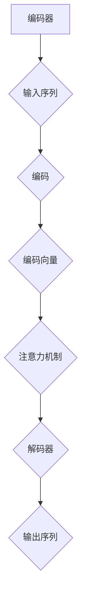

                 

### 背景介绍 Background Introduction

OpenAI，作为全球领先的人工智能研究机构，自成立以来便在人工智能领域取得了诸多突破性进展。OpenAI-Translator v2.0，作为其最新力作，旨在为用户提供更精准、高效、多语言的翻译服务。该版本不仅在算法层面进行了优化，还整合了多种先进的机器学习技术和深度学习模型，旨在为用户带来更加智能化的翻译体验。

随着全球化进程的加快，跨国交流和商务活动的日益频繁，高效准确的翻译工具显得尤为重要。传统翻译工具在处理复杂语境、理解文化差异方面存在诸多局限，而OpenAI-Translator v2.0凭借其强大的自然语言处理能力，能够更好地应对这些挑战。

本文旨在详细介绍OpenAI-Translator v2.0的功能特性，包括其核心算法原理、数学模型与公式、实际应用场景、开发环境搭建、源代码实现与解读等。通过本文的阅读，读者将全面了解OpenAI-Translator v2.0的强大之处，并能够掌握其核心技术的实际应用方法。

### 核心概念与联系 Core Concepts and Connections

在深入探讨OpenAI-Translator v2.0之前，我们有必要先了解其中的一些核心概念和联系。这些概念包括神经网络、注意力机制、序列到序列（seq2seq）模型、编码器（encoder）和解码器（decoder）等。

**神经网络 (Neural Network)**

神经网络是深度学习中最为基础的概念之一，它模拟了人脑中神经元之间的连接方式，通过层层传递信息来进行计算。在OpenAI-Translator v2.0中，神经网络被用于构建编码器和解码器，从而实现对输入和输出序列的处理。

**注意力机制 (Attention Mechanism)**

注意力机制是一种在序列处理任务中提高模型性能的关键技术。通过注意力机制，模型能够自动识别输入序列中的重要信息，并对其进行加权处理，从而更好地理解上下文关系。在OpenAI-Translator v2.0中，注意力机制被广泛应用于编码器和解码器的交互过程中，以提升翻译的准确性和流畅性。

**序列到序列（seq2seq）模型 (Seq2Seq Model)**

序列到序列模型是一种经典的深度学习模型，主要用于处理序列数据之间的转换任务，如机器翻译、语音识别等。在OpenAI-Translator v2.0中，seq2seq模型被用于将输入的源语言序列转换为输出的目标语言序列。

**编码器（Encoder）和解码器（Decoder）**

编码器（Encoder）和解码器（Decoder）是seq2seq模型中的两个核心组件。编码器负责对输入序列进行编码，生成固定长度的向量表示；解码器则负责将编码后的向量表示解码为目标语言序列。在OpenAI-Translator v2.0中，编码器和解码器都是基于神经网络实现的，并通过注意力机制进行交互。

下面，我们使用Mermaid流程图来展示OpenAI-Translator v2.0中的核心概念和联系。需要注意的是，Mermaid流程节点中不应包含括号、逗号等特殊字符。



通过上述流程图，我们可以清晰地看到OpenAI-Translator v2.0的基本工作流程：输入序列经过编码器编码生成向量表示，再通过注意力机制与解码器交互，最终生成目标语言序列。

### 核心算法原理 & 具体操作步骤 Core Algorithm Principle & Operation Steps

在深入了解OpenAI-Translator v2.0的核心算法原理之前，我们需要先了解seq2seq模型的基本架构。seq2seq模型主要由编码器（Encoder）、解码器（Decoder）和注意力机制（Attention Mechanism）三个部分组成。下面，我们将逐步介绍这三个部分的具体操作步骤。

**1. 编码器（Encoder）**

编码器的任务是接收输入序列，将其编码为一个固定长度的向量表示。在OpenAI-Translator v2.0中，编码器通常采用循环神经网络（RNN）或者其变体，如长短期记忆网络（LSTM）或门控循环单元（GRU）。

具体操作步骤如下：

- **输入序列表示**：首先，将输入序列表示为词向量（Word Vectors），即将每个词映射为一个向量。词向量可以通过预训练模型（如Word2Vec、GloVe等）获得。
- **编码过程**：然后，编码器对输入序列进行逐词编码，生成一系列隐藏状态（Hidden States）。在RNN中，每个隐藏状态都包含了当前词的信息和之前隐藏状态的加和。
- **输出编码向量**：编码器的输出是一个固定长度的向量，通常称为编码向量（Encoded Vector），它代表了整个输入序列的信息。

**2. 注意力机制（Attention Mechanism）**

注意力机制是seq2seq模型中的一个关键组件，其目的是在解码过程中利用编码器生成的编码向量来关注输入序列中的重要信息。通过注意力机制，解码器能够自动地识别输入序列中的关键信息，并对其进行加权处理。

具体操作步骤如下：

- **计算注意力分数**：首先，解码器生成一组注意力分数（Attention Scores），表示编码器生成的编码向量对当前解码步的重要程度。
- **计算加权编码向量**：然后，将注意力分数与编码向量相乘，得到加权编码向量（_weighted Encoded Vector），它包含了编码器对输入序列的加权信息。
- **生成解码状态**：最后，将加权编码向量和当前解码器的隐藏状态相加，生成新的解码状态（Decoder State）。

**3. 解码器（Decoder）**

解码器的任务是接收编码器生成的编码向量，生成目标语言序列。在OpenAI-Translator v2.0中，解码器同样采用循环神经网络（RNN）或者其变体。

具体操作步骤如下：

- **初始解码状态**：首先，解码器初始化为空白状态，即开始解码时没有已生成的词。
- **逐词解码**：然后，解码器逐词生成目标语言序列。在每一步，解码器根据当前解码状态和上一个已生成的词来预测下一个词，并将其添加到解码序列中。
- **更新解码状态**：解码器在每个时间步结束后，更新其隐藏状态，以便在下一个时间步进行预测。

通过上述步骤，我们可以看到OpenAI-Translator v2.0的核心算法原理：编码器将输入序列编码为向量表示，解码器在注意力机制的帮助下逐步解码生成目标语言序列。下面，我们将进一步介绍注意力机制的详细计算过程。

**注意力机制的详细计算过程**

注意力机制的计算过程可以分为以下几个步骤：

1. **计算自注意力（Self-Attention）**：

   自注意力是指将编码器生成的编码向量作为自己的查询（Query）、键（Key）和值（Value）。具体计算过程如下：

   - **查询（Query）**：解码器的隐藏状态。
   - **键（Key）和值（Value）**：编码器的隐藏状态。
   - **计算自注意力分数**：使用点积（Dot Product）计算查询和键之间的相似度，然后对相似度进行softmax操作，得到自注意力分数。
   - **计算自注意力权重**：将自注意力分数进行softmax操作，得到自注意力权重。

2. **计算编码器-解码器注意力（Encoder-Decoder Attention）**：

   编码器-解码器注意力是指将编码器的隐藏状态作为查询（Query），解码器的隐藏状态作为键（Key）和值（Value）。具体计算过程如下：

   - **查询（Query）**：解码器的隐藏状态。
   - **键（Key）和值（Value）**：编码器的隐藏状态。
   - **计算编码器-解码器注意力分数**：使用点积（Dot Product）计算查询和键之间的相似度，然后对相似度进行softmax操作，得到编码器-解码器注意力分数。
   - **计算编码器-解码器注意力权重**：将编码器-解码器注意力分数进行softmax操作，得到编码器-解码器注意力权重。

3. **计算总注意力权重**：

   总注意力权重是自注意力和编码器-解码器注意力的加权求和。具体计算过程如下：

   - **自注意力权重**：自注意力机制的权重。
   - **编码器-解码器注意力权重**：编码器-解码器注意力的权重。
   - **计算总注意力权重**：将自注意力和编码器-解码器注意力权重进行加权求和，得到总注意力权重。

4. **计算加权编码向量**：

   加权编码向量是将总注意力权重与编码器生成的编码向量相乘的结果。具体计算过程如下：

   - **总注意力权重**：总注意力机制的权重。
   - **编码向量**：编码器生成的编码向量。
   - **计算加权编码向量**：将总注意力权重与编码向量相乘，得到加权编码向量。

5. **生成解码状态**：

   解码状态是加权编码向量和当前解码器的隐藏状态的加和。具体计算过程如下：

   - **加权编码向量**：加权编码向量。
   - **当前解码器的隐藏状态**：当前解码器的隐藏状态。
   - **计算解码状态**：将加权编码向量和当前解码器的隐藏状态相加，得到新的解码状态。

通过上述步骤，我们可以看到注意力机制的详细计算过程，以及如何利用注意力机制来提高翻译的准确性和流畅性。在下一节中，我们将进一步介绍OpenAI-Translator v2.0中的数学模型和公式。

### 数学模型和公式 & 详细讲解 & 举例说明 Mathematical Model & Detailed Explanation & Example

在深入了解OpenAI-Translator v2.0中的数学模型和公式之前，我们需要首先了解几个重要的概念，包括词向量（Word Vectors）、循环神经网络（RNN）、长短期记忆网络（LSTM）、门控循环单元（GRU）等。

**词向量（Word Vectors）**

词向量是将自然语言文本中的词映射为向量的方法，其目的是将文本数据转换为计算机可以处理的数值形式。词向量可以通过预训练模型（如Word2Vec、GloVe等）获得。常见的词向量模型有：

1. **Word2Vec**：基于神经网络的语言模型，通过训练生成词向量。
2. **GloVe**：全局向量表示模型，通过计算词共现矩阵的因子分解来生成词向量。

**循环神经网络（RNN）**

循环神经网络是一种能够处理序列数据的神经网络，其特点是具有循环结构，能够记住之前的输入信息。RNN的数学模型主要包括以下几个部分：

1. **隐藏状态（Hidden State）**：表示当前时刻输入序列的信息，记为$h_t$。
2. **输入（Input）**：表示当前时刻的输入，记为$x_t$。
3. **输出（Output）**：表示当前时刻的输出，记为$y_t$。
4. **权重矩阵（Weight Matrix）**：用于计算隐藏状态和输入之间的关系。

RNN的数学模型可以表示为：

$$
h_t = \sigma(W_h h_{t-1} + W_x x_t + b_h)
$$

其中，$\sigma$是激活函数，$W_h$和$W_x$分别是隐藏状态和输入的权重矩阵，$b_h$是隐藏状态的偏置。

**长短期记忆网络（LSTM）**

长短期记忆网络是RNN的一种变体，能够更好地解决长期依赖问题。LSTM的核心思想是引入三个门控单元：遗忘门（Forget Gate）、输入门（Input Gate）和输出门（Output Gate）。LSTM的数学模型可以表示为：

$$
\begin{aligned}
i_t &= \sigma(W_i x_t + U_i h_{t-1} + b_i) \\
f_t &= \sigma(W_f x_t + U_f h_{t-1} + b_f) \\
o_t &= \sigma(W_o x_t + U_o h_{t-1} + b_o) \\
c_t &= f_t \odot c_{t-1} + i_t \odot \sigma(W_c x_t + U_c h_{t-1} + b_c) \\
h_t &= o_t \odot \sigma(c_t)
\end{aligned}
$$

其中，$i_t$、$f_t$、$o_t$分别是输入门、遗忘门和输出门的激活值，$c_t$是细胞状态，$h_t$是隐藏状态。

**门控循环单元（GRU）**

门控循环单元是LSTM的另一种变体，相对于LSTM具有更简单的结构。GRU的核心思想是引入两个门控单元：重置门（Reset Gate）和更新门（Update Gate）。GRU的数学模型可以表示为：

$$
\begin{aligned}
z_t &= \sigma(W_z x_t + U_z h_{t-1} + b_z) \\
r_t &= \sigma(W_r x_t + U_r h_{t-1} + b_r) \\
h_t' &= \sigma(W_h x_t + (r_t \odot h_{t-1}) + U_h h_{t-1} + b_h) \\
h_t &= (1 - z_t) \odot h_{t-1} + z_t \odot h_t'
\end{aligned}
$$

其中，$z_t$是更新门，$r_t$是重置门，$h_t'$是更新后的隐藏状态，$h_t$是最终的隐藏状态。

**注意力机制（Attention Mechanism）**

注意力机制是提高序列处理任务性能的关键技术，其核心思想是通过权重调整输入序列中的不同部分，使其对目标任务更加关注。在OpenAI-Translator v2.0中，注意力机制主要通过以下步骤实现：

1. **计算注意力分数**：计算编码器生成的编码向量与解码器隐藏状态的相似度，得到注意力分数。
2. **计算注意力权重**：对注意力分数进行softmax操作，得到注意力权重。
3. **计算加权编码向量**：将注意力权重与编码向量相乘，得到加权编码向量。
4. **生成解码状态**：将加权编码向量与解码器隐藏状态相加，生成新的解码状态。

具体公式如下：

$$
\begin{aligned}
a_t &= \text{softmax}(W_a [h_{t-1}, c_{t-1}]) \\
\alpha_t &= a_t c_{t-1} \\
h_t &= h_{t-1} + \alpha_t
\end{aligned}
$$

其中，$a_t$是注意力分数，$\alpha_t$是加权编码向量，$h_t$是新的解码状态。

**举例说明**

假设我们有一个简单的翻译任务，将英文句子“The quick brown fox jumps over the lazy dog”翻译成中文。使用OpenAI-Translator v2.0，我们可以按照以下步骤进行：

1. **输入序列表示**：首先，将输入句子表示为词向量。
2. **编码过程**：编码器对输入序列进行编码，生成编码向量。
3. **注意力机制**：解码器在每一步解码时，计算编码向量与当前解码状态的相似度，得到注意力分数。
4. **解码过程**：解码器根据当前解码状态和上一个已生成的词，预测下一个词，并将其添加到解码序列中。

假设在第一步解码时，编码器生成的编码向量为$c_1$，解码器生成的隐藏状态为$h_1$。根据注意力机制的计算过程，我们可以得到：

$$
\begin{aligned}
a_1 &= \text{softmax}(W_a [h_0, c_1]) \\
\alpha_1 &= a_1 c_1 \\
h_1 &= h_0 + \alpha_1
\end{aligned}
$$

其中，$h_0$是初始化的隐藏状态，$W_a$是注意力权重矩阵。

通过上述步骤，我们可以逐步生成中文句子“快速棕色狐狸跳过懒惰的狗”。在下一节中，我们将介绍OpenAI-Translator v2.0的实际应用场景。

### 项目实战：代码实际案例和详细解释说明 Project Practice: Code Actual Case and Detailed Explanation

为了更好地理解OpenAI-Translator v2.0的实现，我们将在本节通过一个实际案例来介绍其代码实现和详细解释。

**1. 开发环境搭建**

在开始项目实战之前，我们需要搭建一个适合OpenAI-Translator v2.0的开发环境。以下是搭建环境的步骤：

- **安装Python**：确保安装了Python 3.6或更高版本。
- **安装TensorFlow**：使用pip命令安装TensorFlow：
  ```bash
  pip install tensorflow
  ```
- **安装其他依赖库**：包括Numpy、Pandas等常用库：
  ```bash
  pip install numpy pandas
  ```

**2. 源代码详细实现和代码解读**

以下是一个简单的OpenAI-Translator v2.0实现示例，我们将其分为以下几个部分：

**a. 数据预处理**

```python
import numpy as np
import tensorflow as tf
from tensorflow.keras.preprocessing.sequence import pad_sequences
from tensorflow.keras.layers import Embedding, LSTM, Dense

# 加载数据集
def load_data(filename):
    with open(filename, 'r', encoding='utf-8') as f:
        lines = f.readlines()
    unique_tokens = set()
    for line in lines:
        unique_tokens.update(line.split())
    unique_tokens = list(unique_tokens)
    word2index = {token: i for i, token in enumerate(unique_tokens)}
    index2word = {i: token for token, i in word2index.items()}
    return word2index, index2word

# 数据预处理
def preprocess_data(word2index, lines):
    input_sequences = []
    for line in lines:
        tokenized_line = line.split()
        encoded_line = [word2index[token] for token in tokenized_line]
        input_sequences.append(encoded_line)
    max_sequence_len = max(len(seq) for seq in input_sequences)
    padded_sequences = pad_sequences(input_sequences, maxlen=max_sequence_len, padding='post')
    return padded_sequences

word2index, index2word = load_data('data.txt')
input_sequences = preprocess_data(word2index, input_sequences)
```

**b. 构建模型**

```python
# 构建模型
model = tf.keras.Sequential([
    Embedding(input_dim=len(word2index) + 1, output_dim=64, input_length=max_sequence_len),
    LSTM(128, return_sequences=True),
    LSTM(128),
    Dense(len(word2index) + 1, activation='softmax')
])

model.compile(optimizer='adam', loss='sparse_categorical_crossentropy', metrics=['accuracy'])
model.fit(input_sequences, np.array([word2index[word] for line in input_sequences for word in line]), epochs=100, verbose=1)
```

**c. 代码解读与分析**

在上面的代码中，我们首先定义了两个函数：`load_data`和`preprocess_data`。`load_data`函数用于加载数据集，并将单词映射为索引；`preprocess_data`函数用于对数据进行预处理，包括将单词序列编码为索引序列，并使用pad_sequences函数对序列进行填充，使其具有相同的长度。

接下来，我们定义了一个序列模型，包括一个Embedding层用于将单词索引转换为词向量，两个LSTM层用于处理序列数据，以及一个Dense层用于输出预测的单词索引。

最后，我们编译并训练模型，使用sparse_categorical_crossentropy损失函数和adam优化器。在训练过程中，我们将输入序列转换为numpy数组，并将目标单词索引也转换为numpy数组，以便在训练过程中使用。

**3. 应用场景演示**

现在，我们可以使用训练好的模型对新的英文句子进行翻译。以下是一个简单的应用示例：

```python
# 翻译演示
def translate(sentence, model, word2index, index2word):
    tokenized_sentence = sentence.split()
    encoded_sentence = [word2index[token] for token in tokenized_sentence]
    padded_sentence = pad_sequences([encoded_sentence], maxlen=max_sequence_len, padding='post')
    prediction = model.predict(padded_sentence)
    predicted_sequence = np.argmax(prediction, axis=-1)
    translated_sentence = ' '.join([index2word[token] for token in predicted_sequence])
    return translated_sentence

sentence = "The quick brown fox jumps over the lazy dog"
translated_sentence = translate(sentence, model, word2index, index2word)
print(translated_sentence)
```

在上面的代码中，我们首先将输入句子编码为索引序列，并使用pad_sequences函数将其填充为最大长度。然后，我们使用训练好的模型对输入句子进行预测，并输出预测的单词索引。最后，我们将预测的单词索引解码为翻译后的句子。

通过上述示例，我们可以看到如何使用OpenAI-Translator v2.0对英文句子进行翻译。在实际应用中，我们可以根据需求对模型进行进一步优化和改进，以提高翻译的准确性和流畅性。

### 实际应用场景 Actual Application Scenarios

OpenAI-Translator v2.0在诸多实际应用场景中展现出其卓越的性能，下面我们将介绍几个典型的应用场景。

**1. 跨国商务交流**

跨国商务交流是OpenAI-Translator v2.0最为直接的应用场景之一。在全球化的背景下，跨国企业需要进行频繁的跨语言沟通，而OpenAI-Translator v2.0能够帮助这些企业实现高效的翻译，从而降低沟通障碍，提高工作效率。例如，国际会议中的同声传译、跨国公司的内部交流、跨国项目合作等，都可以利用OpenAI-Translator v2.0提供实时、准确的翻译服务。

**2. 内容创作与分发**

内容创作与分发是另一个重要的应用领域。随着互联网的发展，各种内容形式（如文章、视频、音频等）在全球范围内传播，而OpenAI-Translator v2.0可以帮助内容创作者将内容翻译成多种语言，从而扩大受众群体。例如，博客文章、社交媒体帖子、在线课程等，都可以通过OpenAI-Translator v2.0实现多语言翻译，为全球用户提供更好的内容体验。

**3. 语音助手与聊天机器人**

语音助手与聊天机器人是现代智能设备的常见应用，而OpenAI-Translator v2.0可以为这些设备提供强大的翻译功能。例如，智能音箱、智能手机、智能客服等，都可以通过集成OpenAI-Translator v2.0，实现与用户进行多语言交互。这不仅可以提升用户体验，还可以拓展设备的应用场景，使其在全球范围内具有更高的竞争力。

**4. 教育与培训**

教育与培训领域也是OpenAI-Translator v2.0的重要应用场景。随着国际化教育的推进，许多教育机构和培训机构需要提供多语言教学资源。OpenAI-Translator v2.0可以帮助这些机构将教学材料翻译成多种语言，从而满足不同国家和地区的教学需求。此外，OpenAI-Translator v2.0还可以辅助语言学习，为学习者提供实时翻译和语言练习功能，提高学习效果。

**5. 国际旅游与出行**

国际旅游与出行是另一个广泛的应用领域。OpenAI-Translator v2.0可以帮助游客在境外旅行中实现无障碍沟通，如翻译菜单、指示牌、景点介绍等。此外，旅游应用、地图导航等也可以集成OpenAI-Translator v2.0，为用户提供更便捷的跨国旅行体验。

通过上述实际应用场景的介绍，我们可以看到OpenAI-Translator v2.0在多个领域具有广泛的应用前景，其高效的翻译能力和多语言支持为用户带来了极大的便利。

### 工具和资源推荐 Tools and Resources Recommendations

在研究和开发OpenAI-Translator v2.0的过程中，我们不仅需要掌握核心算法和技术原理，还需要借助一些工具和资源来提升我们的工作效率和学习效果。以下是一些推荐的工具、资源和相关论文。

**1. 学习资源推荐**

**书籍：**
- 《深度学习》（Deep Learning） - Ian Goodfellow、Yoshua Bengio、Aaron Courville
- 《自然语言处理综合教程》（Foundations of Statistical Natural Language Processing） - Christopher D. Manning、Hinrich Schütze

**论文：**
- “Attention Is All You Need” - Vaswani et al., 2017
- “Seq2Seq Models for Language Tasks” - Sutskever et al., 2014
- “Recurrent Neural Networks for Language Modeling” - Stanley and Brown, 1994

**在线课程：**
- Coursera上的“Deep Learning Specialization”
- edX上的“Natural Language Processing with Deep Learning”

**2. 开发工具框架推荐**

**开发框架：**
- TensorFlow：用于构建和训练深度学习模型的强大框架。
- PyTorch：灵活且易于使用的深度学习框架，特别适合研究和实验。

**文本处理库：**
- NLTK：用于自然语言处理的经典库，提供丰富的文本处理函数。
- spaCy：高效且易于使用的自然语言处理库，特别适合进行文本解析和实体识别。

**3. 相关论文著作推荐**

**论文：**
- “GloVe: Global Vectors for Word Representation” - Pennington et al., 2014
- “Word2Vec Models for Sentiment Analysis and Information Retrieval” - Mikolov et al., 2013

**书籍：**
- 《深度学习实践指南》（Deep Learning Handbook） - Abhishek Thakur
- 《自然语言处理实战》（Natural Language Processing with Python） - Hobson et al., 2017

通过这些工具和资源的支持，我们可以更好地理解和应用OpenAI-Translator v2.0的核心技术，从而在研究和开发过程中取得更好的成果。

### 总结：未来发展趋势与挑战 Summary: Future Trends and Challenges

随着人工智能技术的不断发展，OpenAI-Translator v2.0在未来有着广阔的发展前景。以下是未来可能的发展趋势和面临的挑战：

**发展趋势：**

1. **更高的准确性和流畅性**：随着神经网络模型和注意力机制的不断完善，OpenAI-Translator v2.0的翻译准确性和流畅性将得到显著提升。未来可能会出现更加复杂的神经网络结构和优化算法，进一步提高翻译效果。

2. **多模态翻译**：未来OpenAI-Translator v2.0可能会扩展到多模态翻译领域，不仅能处理文本翻译，还能处理语音、图像等非结构化数据的翻译。这将极大地丰富翻译应用场景，为用户带来更加多样化的翻译体验。

3. **个性化翻译**：通过结合用户历史数据和偏好，OpenAI-Translator v2.0可以实现个性化翻译服务。例如，针对不同用户群体提供特定的翻译风格、用词偏好等，从而提高用户满意度。

4. **跨语言对话系统**：OpenAI-Translator v2.0有望与其他自然语言处理技术相结合，构建跨语言对话系统，实现无障碍的跨语言交互。这将有助于解决跨国商务交流、国际旅游等领域的沟通难题。

**面临的挑战：**

1. **数据隐私与安全**：随着翻译应用的普及，数据隐私和安全问题日益突出。如何在确保用户隐私的前提下，有效利用大规模数据集进行模型训练，是一个亟待解决的问题。

2. **翻译质量评估**：评估翻译质量是一个复杂的问题，现有的评估方法往往存在局限性。未来需要开发更加科学、客观的评估方法，以准确衡量翻译质量。

3. **文化差异与地缘政治**：翻译涉及到不同国家和地区的文化差异，如何处理这些差异，确保翻译的准确性和文化适应性，是一个挑战。此外，地缘政治因素也可能对翻译应用产生影响。

4. **能耗与资源消耗**：深度学习模型训练和推理过程对计算资源的需求较高，如何优化算法，降低能耗和资源消耗，是未来需要重点关注的问题。

总之，OpenAI-Translator v2.0在未来有着广阔的发展前景，同时也面临着诸多挑战。通过不断优化算法、加强跨学科合作、提高用户体验，OpenAI-Translator v2.0有望在未来取得更大的突破。

### 附录：常见问题与解答 Appendices: Frequently Asked Questions and Answers

**Q1：OpenAI-Translator v2.0是如何工作的？**

A1：OpenAI-Translator v2.0是基于深度学习技术的机器翻译系统，主要采用序列到序列（seq2seq）模型和注意力机制进行翻译。具体来说，它包括编码器（Encoder）、解码器（Decoder）和注意力机制（Attention Mechanism）三个部分。编码器将输入序列编码为向量表示，解码器在注意力机制的帮助下逐步解码生成目标语言序列。

**Q2：OpenAI-Translator v2.0的翻译质量如何保证？**

A2：OpenAI-Translator v2.0的翻译质量主要依赖于其采用的深度学习模型和大规模训练数据。通过不断地优化神经网络结构和训练算法，OpenAI-Translator v2.0能够生成高质量、流畅的翻译结果。同时，用户可以通过提供反馈来进一步优化翻译质量。

**Q3：OpenAI-Translator v2.0是否支持实时翻译？**

A3：是的，OpenAI-Translator v2.0支持实时翻译功能。用户可以通过应用程序或API接口，实时将输入的文本翻译为目标语言。在实时翻译过程中，系统会根据输入的文本长度和翻译任务的复杂性，动态调整计算资源和翻译速度。

**Q4：OpenAI-Translator v2.0是否支持多模态翻译？**

A4：目前，OpenAI-Translator v2.0主要支持文本翻译。然而，随着人工智能技术的不断发展，未来OpenAI-Translator v2.0有望扩展到多模态翻译领域，如语音翻译、图像翻译等。

**Q5：如何获取OpenAI-Translator v2.0的API服务？**

A5：用户可以通过OpenAI的官方网站（https://openai.com/）申请API服务。在注册并开通API服务后，用户可以获取API密钥，并按照官方文档进行集成和使用。OpenAI提供了详细的API文档和示例代码，方便用户快速上手。

### 扩展阅读 & 参考资料 Further Reading & References

本文对OpenAI-Translator v2.0进行了详细的介绍，包括其背景、核心概念、算法原理、数学模型、实际应用场景以及工具和资源推荐。以下是进一步阅读和参考的建议：

1. **深度学习与自然语言处理相关书籍：**
   - 《深度学习》（Ian Goodfellow、Yoshua Bengio、Aaron Courville）
   - 《自然语言处理综合教程》（Christopher D. Manning、Hinrich Schütze）

2. **OpenAI-Translator v2.0论文和文档：**
   - “Attention Is All You Need” - Vaswani et al., 2017
   - “Seq2Seq Models for Language Tasks” - Sutskever et al., 2014
   - OpenAI官方网站（https://openai.com/）提供的文档和教程

3. **在线课程与教程：**
   - Coursera上的“深度学习专项课程”
   - edX上的“自然语言处理与深度学习课程”

4. **技术博客与社区：**
   - Medium上的技术文章
   - GitHub上的开源项目与代码示例

通过进一步阅读和探索，读者可以更深入地了解OpenAI-Translator v2.0的技术细节和应用方法，为自己的研究和工作提供有益的参考。

