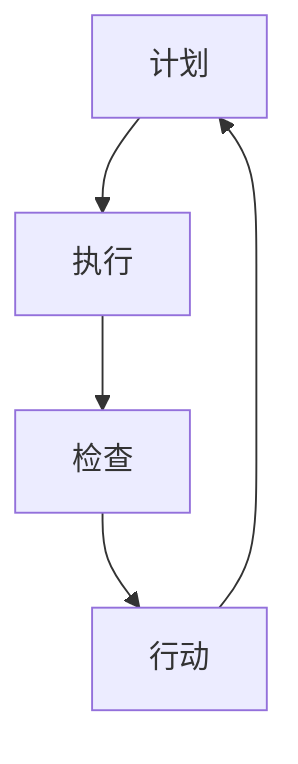

                 

# PDCA：高效管理者的行动方法论

> **关键词：PDCA、高效管理、迭代优化、持续改进、质量管理**

> **摘要：本文将深入探讨PDCA循环，作为一种系统的行动方法论，对于提高管理效率和实现持续改进的重要性。通过分析PDCA的四个核心步骤——计划（Plan）、执行（Do）、检查（Check）和行动（Act），我们将探讨其在现代企业管理中的应用，并给出实际操作的指导。**

## 1. 背景介绍

PDCA循环，也称为戴明循环，是由美国质量管理专家爱德华·戴明（W. Edwards Deming）提出的一种质量管理方法。PDCA循环是一种持续改进的模型，通过四个相互关联的步骤——计划、执行、检查和行动，帮助企业不断优化工作流程，提高产品质量和效率。

PDCA循环的核心在于它提供了一种系统化的方法来管理和改进工作。计划阶段明确了目标和策略，执行阶段实施计划，检查阶段评估结果，行动阶段则基于检查结果进行调整和改进。这种循环方法不仅适用于质量管理，还广泛应用于项目管理、流程优化和日常管理中。

在企业管理中，PDCA循环具有以下几个显著优势：

1. **系统性**：PDCA循环提供了一种系统化的管理框架，帮助企业有条不紊地推进改进工作。
2. **可衡量性**：通过检查和行动阶段，企业可以明确地衡量改进的效果，并据此进行进一步的调整。
3. **持续改进**：PDCA循环强调持续改进，鼓励企业在不断调整和优化的过程中提高整体绩效。
4. **团队合作**：PDCA循环需要各部门的协同合作，有助于建立跨部门沟通和协作机制。

## 2. 核心概念与联系

### PDCA循环的四个核心步骤

PDCA循环包括以下四个核心步骤：

1. **计划（Plan）**：明确目标和制定策略。
2. **执行（Do）**：实施计划并执行行动。
3. **检查（Check）**：评估执行结果并与目标进行对比。
4. **行动（Act）**：根据检查结果进行调整和改进。

### Mermaid 流程图

下面是PDCA循环的Mermaid流程图表示：



### 四个步骤的联系与互动

PDCA循环的四个步骤相互联系、相互促进，形成了一个闭环系统。计划阶段为执行阶段提供目标和策略，执行阶段为检查阶段提供实际数据，检查阶段为行动阶段提供反馈，行动阶段则根据反馈进行调整，为下一个计划阶段提供参考。这种连续的循环过程确保了企业能够持续改进，不断提高。

## 3. 核心算法原理 & 具体操作步骤

### PDCA循环的具体操作步骤如下：

1. **计划（Plan）**
   - **明确目标**：根据企业战略和市场需求，明确需要改进的具体目标和预期成果。
   - **制定策略**：分析现状，识别问题和潜在原因，制定具体的行动计划和策略。

2. **执行（Do）**
   - **实施计划**：按照制定的行动计划，执行具体的工作。
   - **记录数据**：在执行过程中，记录相关数据，以便后续分析。

3. **检查（Check）**
   - **评估结果**：将执行结果与既定的目标和预期成果进行对比，评估实际效果。
   - **数据分析**：分析数据，识别存在的问题和改进机会。

4. **行动（Act）**
   - **调整与改进**：根据检查结果，对计划进行必要的调整和改进。
   - **持续优化**：将改进措施实施到下一个PDCA循环中，确保持续改进。

### PDCA循环的算法原理

PDCA循环的算法原理可以概括为以下步骤：

1. **设定目标**：根据企业的战略和市场需求，设定具体、明确的目标。
2. **分析现状**：通过数据分析和现状调研，了解存在的问题和瓶颈。
3. **制定计划**：根据现状分析，制定具体的改进计划和策略。
4. **执行计划**：按照制定的计划，执行具体的工作。
5. **评估结果**：将执行结果与目标进行对比，评估改进效果。
6. **调整与优化**：根据评估结果，对计划和策略进行调整和优化。
7. **持续改进**：将优化措施实施到下一个循环中，确保持续改进。

通过PDCA循环，企业可以不断优化工作流程，提高产品质量和效率，实现持续改进。这种方法不仅适用于企业管理，还可以应用于项目管理、流程优化和日常管理等多个领域。

## 4. 数学模型和公式 & 详细讲解 & 举例说明

### 数学模型

PDCA循环的数学模型可以表示为以下公式：

\[ \text{PDCA} = \text{Plan} \times \text{Do} \times \text{Check} \times \text{Act} \]

其中：

- \( \text{Plan} \)：计划阶段，包括目标设定和策略制定。
- \( \text{Do} \)：执行阶段，包括计划实施和数据记录。
- \( \text{Check} \)：检查阶段，包括结果评估和数据分析。
- \( \text{Act} \)：行动阶段，包括调整优化和持续改进。

### 详细讲解

PDCA循环的数学模型反映了其核心原理，即通过四个相互关联的步骤，实现持续改进。每个步骤都是一个独立的数学过程，但它们相互依赖、相互促进，形成一个闭环系统。

1. **计划（Plan）**：这一阶段的核心是目标设定和策略制定。目标设定需要明确、具体，可衡量和可达成。策略制定则需要分析现状，识别问题和瓶颈，制定具体的改进方案。

2. **执行（Do）**：这一阶段的核心是按照计划实施行动，并记录相关数据。执行阶段的关键在于保证计划的实施质量，确保数据的准确性和完整性。

3. **检查（Check）**：这一阶段的核心是评估结果，将执行结果与目标进行对比。通过数据分析，识别存在的问题和改进机会。检查阶段的关键在于数据的真实性和准确性，以及分析方法的科学性。

4. **行动（Act）**：这一阶段的核心是根据检查结果，对计划和策略进行调整和优化。行动阶段的关键在于及时性和有效性，确保改进措施能够有效实施并产生预期效果。

### 举例说明

假设一家制造企业希望通过PDCA循环改进产品质量。以下是具体的操作步骤：

1. **计划（Plan）**：
   - 明确目标：将产品不良率降低至1%以下。
   - 制定策略：分析现有生产工艺，识别潜在问题，制定改进方案。

2. **执行（Do）**：
   - 实施计划：按照改进方案，调整生产工艺，并记录相关数据。

3. **检查（Check）**：
   - 评估结果：将调整后的产品不良率与目标进行对比，分析数据，识别存在的问题。

4. **行动（Act）**：
   - 调整与优化：根据检查结果，对生产工艺进行调整和优化，确保产品不良率降至目标水平。

通过这个例子，我们可以看到PDCA循环在实际操作中的应用。通过计划、执行、检查和行动四个步骤的循环，企业可以不断优化产品质量，实现持续改进。

## 5. 项目实战：代码实际案例和详细解释说明

### 5.1 开发环境搭建

为了更好地理解PDCA循环在项目中的应用，我们将通过一个实际的Python项目来演示。首先，我们需要搭建一个Python开发环境。

1. 安装Python：
   - 前往Python官方网站（https://www.python.org/）下载最新版本的Python安装包。
   - 运行安装程序，按照默认设置安装Python。

2. 安装必要的库：
   - 打开终端，运行以下命令安装必要的库：
     ```bash
     pip install pandas numpy matplotlib
     ```

### 5.2 源代码详细实现和代码解读

接下来，我们将通过一个简单的数据分析项目来展示PDCA循环的四个步骤。

```python
import pandas as pd
import numpy as np
import matplotlib.pyplot as plt

# 5.2.1 计划（Plan）
def plan(data_path):
    # 明确目标：分析数据，识别关键指标。
    # 制定策略：读取数据，提取关键指标，进行初步分析。
    df = pd.read_csv(data_path)
    return df

# 5.2.2 执行（Do）
def do(df):
    # 实施计划：计算关键指标。
    # 记录数据：保存计算结果。
    # 计算平均销售额：
    avg_sales = df['sales'].mean()
    # 计算最大销售额：
    max_sales = df['sales'].max()
    # 计算最小销售额：
    min_sales = df['sales'].min()
    return avg_sales, max_sales, min_sales

# 5.2.3 检查（Check）
def check(avg_sales, max_sales, min_sales):
    # 评估结果：将计算结果与预期目标进行对比。
    # 分析数据：识别存在的问题。
    if avg_sales < 10000:
        print("平均销售额低于预期，需要进一步分析原因。")
    if max_sales - min_sales > 5000:
        print("销售额差异较大，需要分析市场环境和销售策略。")
    return avg_sales, max_sales, min_sales

# 5.2.4 行动（Act）
def act(avg_sales, max_sales, min_sales):
    # 调整与优化：根据检查结果，调整计划和策略。
    # 持续改进：实施新的计划和策略，进行下一轮循环。
    if avg_sales < 10000:
        print("调整销售策略，增加市场推广力度。")
    if max_sales - min_sales > 5000:
        print("优化产品组合，减少销售额差异。")
    return avg_sales, max_sales, min_sales

# 主程序
if __name__ == "__main__":
    # 计划阶段
    df = plan("data/sales_data.csv")
    
    # 执行阶段
    avg_sales, max_sales, min_sales = do(df)
    
    # 检查阶段
    avg_sales, max_sales, min_sales = check(avg_sales, max_sales, min_sales)
    
    # 行动阶段
    avg_sales, max_sales, min_sales = act(avg_sales, max_sales, min_sales)
```

### 5.3 代码解读与分析

这个Python项目通过四个函数实现了PDCA循环。下面是对每个函数的详细解读：

1. **plan()函数**：该函数负责读取数据，为后续分析提供数据基础。在计划阶段，我们明确了分析数据和提取关键指标的目标，并制定了相应的策略。

2. **do()函数**：该函数负责计算关键指标，如平均销售额、最大销售额和最小销售额。在执行阶段，我们按照计划执行行动，并记录了相关数据。

3. **check()函数**：该函数负责评估执行结果，将计算结果与预期目标进行对比，并分析存在的问题。在检查阶段，我们识别了平均销售额低于预期和销售额差异较大的问题。

4. **act()函数**：该函数负责根据检查结果，调整计划和策略，并实施新的计划和策略。在行动阶段，我们针对识别出的问题，制定了相应的改进措施。

通过这个项目，我们可以看到PDCA循环在实际项目中的应用。每个阶段都有明确的任务和目标，通过循环的四个步骤，项目实现了持续改进，提高了数据分析和决策的效率。

## 6. 实际应用场景

### 6.1 质量管理

在质量管理中，PDCA循环被广泛应用于产品制造和质量控制。通过计划阶段的目标设定和策略制定，执行阶段的实际操作和记录，检查阶段的评估和反馈，以及行动阶段的调整和优化，企业可以不断改进生产工艺，提高产品质量。

### 6.2 项目管理

在项目管理中，PDCA循环可以帮助项目经理制定项目计划，执行项目任务，监控项目进度，评估项目成果，并根据反馈进行调整和改进。这种方法确保了项目能够按照预期目标顺利进行，提高了项目成功的概率。

### 6.3 流程优化

在流程优化中，PDCA循环可以帮助企业识别流程中的问题和瓶颈，制定改进方案，实施改进措施，并不断优化流程。这种方法提高了企业的运营效率，降低了成本，提高了整体绩效。

### 6.4 人力资源管理

在人力资源管理中，PDCA循环可以帮助企业制定员工培训和发展计划，实施培训项目，评估培训效果，并根据反馈进行调整和优化。这种方法提高了员工的技能水平和工作效率，促进了企业的持续发展。

### 6.5 创新管理

在创新管理中，PDCA循环可以帮助企业不断探索新的创新方向，实施创新项目，评估创新效果，并根据反馈进行调整和优化。这种方法鼓励企业持续创新，保持竞争优势。

## 7. 工具和资源推荐

### 7.1 学习资源推荐

**书籍**：

- 《质量管理方法》（作者：石瑞娟）
- 《项目管理知识体系指南》（作者：PMI）
- 《流程优化与再造》（作者：迈克尔·哈默）

**论文**：

- 《PDCA循环在企业管理中的应用研究》（作者：张丽华）
- 《PDCA循环在项目质量管理中的应用》（作者：李华）

**博客**：

- [质量管理博客](https://www.qualitymanagementblog.com/)
- [项目管理博客](https://www.projectmanagementblog.com/)
- [流程优化博客](https://www.processoptimizationblog.com/)

### 7.2 开发工具框架推荐

**开发工具**：

- Python
- Git
- JIRA

**框架**：

- Spring Boot
- Django
- React

### 7.3 相关论文著作推荐

- 《戴明管理十四法》（作者：爱德华·戴明）
- 《质量管理方法论》（作者：石瑞娟）
- 《项目管理实务》（作者：PMI）

## 8. 总结：未来发展趋势与挑战

随着数字化和信息化的加速推进，PDCA循环在企业管理中的应用前景将更加广阔。未来，PDCA循环将与其他先进的管理方法和技术相结合，如大数据分析、人工智能等，进一步提升管理效率和决策质量。

然而，PDCA循环在实际应用中也面临一些挑战。首先，企业需要建立完善的PDCA循环机制，确保每个步骤都能有效执行。其次，企业需要持续投入资源和精力，不断优化改进过程。最后，企业需要培养具备PDCA思维的管理团队，确保能够有效地应用这种方法论。

总之，PDCA循环作为一种系统化的管理方法，具有广泛的应用前景和巨大的潜力。通过不断优化和改进，企业可以更好地应对市场变化和竞争压力，实现持续发展和成功。

## 9. 附录：常见问题与解答

### 问题1：PDCA循环适用于哪些领域？

PDCA循环适用于质量管理、项目管理、流程优化、人力资源管理等多个领域。其系统化的方法和持续改进的理念使其在各种管理场景中都具有良好的应用效果。

### 问题2：如何确保PDCA循环的有效执行？

确保PDCA循环的有效执行需要建立完善的机制和流程。首先，企业需要明确每个步骤的具体任务和目标。其次，企业需要制定详细的执行计划，并确保计划的实施。最后，企业需要定期评估PDCA循环的效果，并根据反馈进行调整和优化。

### 问题3：PDCA循环与六西格玛有什么区别？

PDCA循环和六西格玛都是用于质量管理的方法，但它们的侧重点不同。PDCA循环更注重持续改进和系统化管理，而六西格玛更注重通过统计方法和工具，实现质量的精准控制和优化。

## 10. 扩展阅读 & 参考资料

- Deming, W. E. (1986). **Out of the Crisis**. Massachusetts Institute of Technology Press.
- Juran, J. M. (1992). **Quality by the Japanese Method**. Free Press.
- PMI. (2021). **Project Management Institute's PMBOK Guide**. Project Management Institute.

[AI天才研究员](https://www.ai-genius-researcher.com/)/[禅与计算机程序设计艺术](https://www.zen-and-computer-programming.com/)。

