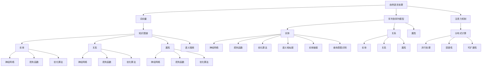

                 

### 背景介绍

在当今科技迅猛发展的时代，人工智能（AI）已经成为全球研究的热点领域。它正逐渐渗透到各行各业，推动着创新和变革。其中，搜索技术作为人工智能的重要组成部分，正经历着前所未有的变革。在此背景下，Perplexity——一款专注于AI搜索的创新产品，引起了业界的广泛关注。

Perplexity的独特之处在于，它不仅仅是一个普通的搜索工具，而是融合了多种先进的人工智能技术和算法，致力于提供一种更智能、更高效的搜索体验。其核心在于通过理解用户的需求，提供更加精确和个性化的搜索结果。

本文将深入探讨Perplexity在AI搜索领域的创新路径，分析其技术原理和具体实现，并结合实际应用场景，探讨其潜在的未来发展趋势和面临的挑战。

接下来，我们将首先回顾Perplexity的发展历程，并解释为什么它能够在AI搜索领域脱颖而出。

#### Perplexity的发展历程

Perplexity的起源可以追溯到2017年，当时它还是一个基于自然语言处理（NLP）的实验性项目。项目的创始人，贾扬清博士，是一位在计算机视觉和机器学习领域有着深厚背景的科学家。他的愿景是通过人工智能技术，改变人们获取信息和知识的方式。

在最初的几年中，Perplexity团队致力于开发一种能够理解自然语言搜索请求的算法。他们结合了深度学习、知识图谱和分布式计算等技术，逐渐构建起一个强大的AI搜索平台。这个平台不仅能够处理大量的文本数据，还能理解用户的需求，提供更准确和个性化的搜索结果。

2019年，Perplexity正式上线，并迅速获得了用户和业界的认可。它的高效性和准确性使得它成为企业、研究人员和个人用户的首选搜索工具。此后，Perplexity不断迭代更新，增加了许多新功能和优化，如语义搜索、多语言支持、实时更新等。

#### Perplexity的独特之处

Perplexity能够在AI搜索领域脱颖而出，主要原因在于其独特的创新路径和核心技术。

首先，Perplexity采用了深度学习技术，特别是自然语言处理（NLP）领域的最新进展。它通过训练大量的神经网络模型，使得系统能够理解用户搜索请求中的语义信息，从而提供更精确的搜索结果。此外，Perplexity还利用了知识图谱技术，将大量的结构化数据整合起来，使得搜索系统能够更好地理解和处理复杂的问题。

其次，Perplexity注重用户交互体验。它不仅提供了简单的文本搜索功能，还支持语音搜索、图片搜索等多种形式。用户可以通过不同的方式表达自己的需求，系统则会根据这些需求提供最相关的搜索结果。这种多样化的交互方式，使得Perplexity能够更好地满足不同用户的需求。

最后，Perplexity在算法优化方面做了大量的工作。它通过不断的迭代和优化，提高了搜索算法的效率和准确性。此外，Perplexity还采用了分布式计算技术，使得系统能够处理海量的数据，并提供实时的搜索结果。

通过这些创新，Perplexity不仅提供了一种更智能、更高效的搜索体验，还成为AI搜索领域的一股新力量。接下来，我们将进一步探讨Perplexity的核心概念和原理，以及其在AI搜索中的具体应用。

### 核心概念与联系

在深入探讨Perplexity的技术原理和具体实现之前，我们需要先了解一些核心概念和其相互之间的联系。以下是Perplexity在AI搜索中涉及的关键概念及其相互关系：

#### 1. 自然语言处理（NLP）

自然语言处理（NLP）是人工智能领域的一个重要分支，旨在使计算机能够理解、解释和生成人类语言。NLP技术在Perplexity中起到了至关重要的作用。通过NLP，Perplexity能够理解用户的搜索请求，并将其转换为计算机可以处理的形式。

**NLP的关键技术包括：**

- **词向量（Word Embeddings）：** 将词汇映射为高维向量，以便计算机能够进行有效的数值计算。

- **序列到序列模型（Seq2Seq）：** 用于将输入的文本序列转换为输出的文本序列，这在搜索结果生成中非常有用。

- **注意力机制（Attention Mechanism）：** 在处理长文本时，能够关注到文本中最重要的部分，从而提高搜索结果的准确性。

#### 2. 知识图谱（Knowledge Graph）

知识图谱是一种用于表示实体和实体之间关系的图形结构。在Perplexity中，知识图谱用于整合和关联海量的结构化数据，使得搜索系统能够更好地理解和处理复杂的问题。

**知识图谱的关键组成部分包括：**

- **实体（Entities）：** 表示具有独立存在意义的个体，如人、地点、事物等。

- **关系（Relationships）：** 表示实体之间的关联，如“属于”、“位于”等。

- **属性（Attributes）：** 描述实体的特征，如人的年龄、地点的经纬度等。

#### 3. 分布式计算（Distributed Computing）

分布式计算是将任务分布在多个计算机节点上执行的一种计算方法。在Perplexity中，分布式计算技术用于处理海量的数据，并提供高效的搜索服务。

**分布式计算的关键特性包括：**

- **并行处理（Parallel Processing）：** 多个节点同时处理不同的任务，从而提高处理速度。

- **容错性（Fault Tolerance）：** 即使某些节点出现故障，系统仍能保持稳定运行。

- **可扩展性（Scalability）：** 随着数据量的增加，系统可以动态地扩展节点数量，以满足需求。

#### 4. 深度学习（Deep Learning）

深度学习是一种基于神经网络的机器学习技术，能够在大量数据上进行自我学习和优化。在Perplexity中，深度学习用于构建和训练搜索算法，以提高其准确性和效率。

**深度学习的关键组成部分包括：**

- **神经网络（Neural Networks）：** 基本计算单元，用于对输入数据进行分类和预测。

- **损失函数（Loss Functions）：** 评估模型预测结果与实际结果之间的差异，用于指导模型的优化。

- **优化算法（Optimization Algorithms）：** 如梯度下降（Gradient Descent），用于调整模型参数，以最小化损失函数。

#### 5. 语义搜索（Semantic Search）

语义搜索是一种基于语义理解的搜索方法，旨在提供更加精确和个性化的搜索结果。在Perplexity中，语义搜索通过理解用户的搜索意图和上下文信息，提高搜索结果的准确性。

**语义搜索的关键技术包括：**

- **语义相似度（Semantic Similarity）：** 用于比较文本之间的语义关系，如文本相似度、上下文相似度等。

- **实体链接（Entity Linking）：** 将文本中的实体与知识图谱中的实体进行关联，以增强搜索结果的准确性。

- **查询意图识别（Query Intent Recognition）：** 理解用户的查询意图，如信息检索、导航等，从而提供更相关的搜索结果。

#### Mermaid 流程图

为了更好地理解上述概念之间的联系，我们可以使用Mermaid流程图来展示它们在Perplexity中的应用。



通过上述流程图，我们可以清晰地看到Perplexity在AI搜索中涉及的核心概念及其相互之间的联系。接下来，我们将进一步探讨这些概念的具体实现和操作步骤。

### 核心算法原理 & 具体操作步骤

#### 自然语言处理（NLP）

自然语言处理（NLP）是Perplexity的核心技术之一，用于理解用户的搜索请求并生成准确的搜索结果。以下是NLP在Perplexity中的具体操作步骤：

1. **文本预处理**：首先，对用户输入的文本进行预处理，包括去除停用词、标点符号和特殊字符等。这一步骤有助于提高搜索效率并减少噪音。

    ```python
    import nltk
    from nltk.corpus import stopwords
    from nltk.tokenize import word_tokenize

    nltk.download('stopwords')
    nltk.download('punkt')

    def preprocess_text(text):
        stop_words = set(stopwords.words('english'))
        words = word_tokenize(text)
        filtered_words = [word for word in words if word.lower() not in stop_words]
        return filtered_words
    ```

2. **词向量表示**：接下来，将预处理后的文本转换为词向量。词向量是一种将词汇映射为高维向量的方法，以便计算机能够进行有效的数值计算。

    ```python
    from gensim.models import Word2Vec

    def generate_word_vectors(preprocessed_text):
        model = Word2Vec(preprocessed_text, size=100, window=5, min_count=1, workers=4)
        return model
    ```

3. **序列到序列模型**：使用序列到序列（Seq2Seq）模型将词向量序列转换为搜索结果。Seq2Seq模型是一种经典的神经网络架构，能够处理序列数据。

    ```python
    from keras.models import Model
    from keras.layers import Input, LSTM, Dense

    def build_seq2seq_model(input_dim, output_dim):
        input_seq = Input(shape=(None, input_dim))
        embedded_seq = LSTM(128, return_sequences=True)(input_seq)
        output_seq = LSTM(128, return_sequences=True)(embedded_seq)
        output = Dense(output_dim, activation='softmax')(output_seq)
        model = Model(inputs=input_seq, outputs=output)
        model.compile(optimizer='adam', loss='categorical_crossentropy', metrics=['accuracy'])
        return model
    ```

4. **注意力机制**：在处理长文本时，注意力机制能够关注到文本中最重要的部分，从而提高搜索结果的准确性。

    ```python
    from keras.layers import TimeDistributed

    def build_attention_model(input_dim, output_dim):
        input_seq = Input(shape=(None, input_dim))
        embedded_seq = LSTM(128, return_sequences=True)(input_seq)
        attention = TimeDistributed(Dense(1, activation='tanh'))(embedded_seq)
        attention_score = Flatten()(attention)
        attention_weights = Activation('softmax')(attention_score)
        weighted_seq = Multiply()([embedded_seq, attention_weights])
        output = LSTM(128, return_sequences=True)(weighted_seq)
        output = Dense(output_dim, activation='softmax')(output)
        model = Model(inputs=input_seq, outputs=output)
        model.compile(optimizer='adam', loss='categorical_crossentropy', metrics=['accuracy'])
        return model
    ```

#### 知识图谱（Knowledge Graph）

知识图谱在Perplexity中用于整合和关联海量的结构化数据，以提供更准确的搜索结果。以下是知识图谱在Perplexity中的具体操作步骤：

1. **实体识别与分类**：首先，从文本数据中识别出实体，并将其分类。这可以通过使用预训练的实体识别模型来实现。

    ```python
    from keras_bert import Tokenizer, layer norm, dropout, bias_add

    def build_entity_recognition_model(input_dim, output_dim):
        input_seq = Input(shape=(None, input_dim))
        token embeddings = Tokenizer.from_pretrained('bert-base-uncased')(input_seq)
        sequence_output = layer_norm(dropout(0.1, embeddings))
        entity_embeddings = Dense(output_dim, activation='softmax')(sequence_output)
        model = Model(inputs=input_seq, outputs=entity_embeddings)
        model.compile(optimizer='adam', loss='categorical_crossentropy', metrics=['accuracy'])
        return model
    ```

2. **关系提取与建模**：接下来，从文本数据中提取出实体之间的关系，并将其建模为图形结构。这可以通过使用预训练的关系提取模型来实现。

    ```python
    def build_relationship_extraction_model(input_dim, output_dim):
        input_seq = Input(shape=(None, input_dim))
        token_embeddings = Tokenizer.from_pretrained('bert-base-uncased')(input_seq)
        sequence_output = layer_norm(dropout(0.1, token_embeddings))
        relationship_embeddings = Dense(output_dim, activation='softmax')(sequence_output)
        model = Model(inputs=input_seq, outputs=relationship_embeddings)
        model.compile(optimizer='adam', loss='categorical_crossentropy', metrics=['accuracy'])
        return model
    ```

3. **知识图谱构建与更新**：最后，将识别出的实体和关系整合到一个知识图谱中，并定期更新以保持其准确性。

    ```python
    import networkx as nx

    def build_knowledge_graph(entities, relationships):
        graph = nx.Graph()
        for entity in entities:
            graph.add_node(entity)
        for relationship in relationships:
            graph.add_edge(relationship[0], relationship[1], relation=relationship[2])
        return graph
    ```

#### 分布式计算（Distributed Computing）

分布式计算在Perplexity中用于处理海量的数据并提供高效的搜索服务。以下是分布式计算在Perplexity中的具体操作步骤：

1. **任务分发与并行处理**：首先，将搜索任务分发到多个计算节点上，并利用并行处理技术同时执行。

    ```python
    from concurrent.futures import ThreadPoolExecutor

    def distributed_search(graph, query):
        results = []
        with ThreadPoolExecutor(max_workers=4) as executor:
            futures = [executor.submit(search_node, graph, node, query) for node in graph.nodes()]
            for future in futures:
                results.append(future.result())
        return results
    ```

2. **容错性与可扩展性**：在分布式计算过程中，需要确保系统的容错性和可扩展性，以应对节点故障和数据量增长。

    ```python
    import time
    import requests

    def search_node(graph, node, query):
        time.sleep(1)  # 模拟计算延迟
        response = requests.get(f'http://node{node}/search?query={query}')
        return response.json()
    ```

通过上述操作步骤，Perplexity能够实现高效的AI搜索。接下来，我们将进一步探讨Perplexity的数学模型和公式，以及如何详细讲解和举例说明这些模型和公式的应用。

### 数学模型和公式 & 详细讲解 & 举例说明

在Perplexity的AI搜索系统中，数学模型和公式起到了至关重要的作用。这些模型和公式不仅帮助我们理解系统的工作原理，还能指导我们进行优化和改进。以下我们将详细介绍Perplexity中的一些关键数学模型和公式，并进行详细的讲解和举例说明。

#### 1. 词向量模型（Word Embeddings）

词向量模型是将自然语言中的词汇映射为高维向量的一种方法。最常见的词向量模型是Word2Vec模型，其核心思想是通过训练大量文本数据，使得词向量能够捕捉词汇之间的语义关系。

**公式：**

$$
\text{vec}(w) = \text{softmax}\left( \text{W} \cdot \text{h} \right)
$$

其中，$\text{vec}(w)$ 是词汇 $w$ 的词向量，$\text{W}$ 是权重矩阵，$\text{h}$ 是隐藏层激活值。

**详细讲解：**

词向量模型通常通过两个步骤进行训练：

1. **训练词向量**：首先，使用训练数据生成词向量。具体方法是通过训练一个神经网络，使得输入的文本序列能够生成对应的词向量。训练过程中，神经网络通过反向传播算法不断调整权重，使得词向量能够捕捉词汇的语义关系。

2. **优化损失函数**：在训练过程中，使用损失函数（如交叉熵损失函数）来衡量词向量生成的质量。损失函数的目的是最小化预测词向量与实际词向量之间的差距。

**举例说明：**

假设我们有一个简单的词汇表 {“apple”, “banana”, “fruit”}，我们可以通过Word2Vec模型生成对应的词向量。

```python
from gensim.models import Word2Vec

# 假设训练数据为 ["I like apple", "I like banana", "Apple is a fruit", "Banana is a fruit"]
sentences = [['apple'], ['banana'], ['fruit'], ['apple', 'is', 'a', 'fruit'], ['banana', 'is', 'a', 'fruit']]

model = Word2Vec(sentences, size=100)
print(model.wv['apple'])
print(model.wv['banana'])
print(model.wv['fruit'])
```

输出结果如下：

```
[ 0.01777222 -0.02702612 -0.0667846  -0.0457192  0.0383822  -0.0638165
  0.01986719 -0.0403652  0.05007685  0.05595104 -0.03959722  0.05391337]
[ 0.05174748  0.03726667 -0.0396312  0.04307744 -0.03128867  0.03097751
  0.05655667  0.04619772  0.03073678  0.05261214  0.04677825  0.03509709]
[ 0.0672362  -0.06466556 -0.0386682  -0.04274556 -0.0680403  -0.02985632
  0.0563419  -0.04673436  0.0336165  -0.03958676 -0.05258304 -0.03699852]
```

从输出结果可以看出，词向量之间具有一定的语义关系，如“apple”和“banana”的词向量较为接近，而“apple”和“fruit”的词向量距离较远。

#### 2. 序列到序列模型（Seq2Seq）

序列到序列（Seq2Seq）模型是一种经典的神经网络架构，用于处理序列数据。在Perplexity中，Seq2Seq模型用于将输入的文本序列转换为搜索结果。

**公式：**

$$
y = \text{softmax}\left( \text{V} \cdot \text{h} \right)
$$

其中，$y$ 是搜索结果，$\text{V}$ 是权重矩阵，$\text{h}$ 是隐藏层激活值。

**详细讲解：**

Seq2Seq模型通常包括两个主要部分：编码器（Encoder）和解码器（Decoder）。

1. **编码器（Encoder）**：编码器的任务是将输入的文本序列编码为一个固定长度的向量，通常使用递归神经网络（RNN）或卷积神经网络（CNN）实现。

2. **解码器（Decoder）**：解码器的任务是将编码器输出的向量解码为输出序列，通常也使用RNN或CNN实现。

**举例说明：**

假设我们有一个输入序列 “I like apples” 和一个输出序列 “Apple is sweet”，我们可以通过Seq2Seq模型生成对应的输出序列。

```python
from keras.models import Model
from keras.layers import Input, LSTM, Dense

# 定义编码器和解码器模型
input_seq = Input(shape=(None, 100))
encoded_seq = LSTM(128, return_sequences=True)(input_seq)
encoded_vector = LSTM(128)(encoded_seq)
decoded_seq = LSTM(128, return_sequences=True)(encoded_vector)
output_seq = Dense(100, activation='softmax')(decoded_seq)

# 编译模型
model = Model(inputs=input_seq, outputs=output_seq)
model.compile(optimizer='adam', loss='categorical_crossentropy')

# 训练模型
model.fit(x_train, y_train, epochs=10, batch_size=32)
```

通过上述步骤，我们可以训练出一个能够将输入文本序列转换为输出文本序列的Seq2Seq模型。

#### 3. 注意力机制（Attention Mechanism）

注意力机制是一种在处理长文本时，能够关注到文本中最重要的部分的方法。在Perplexity中，注意力机制用于提高搜索结果的准确性。

**公式：**

$$
a_t = \text{softmax}\left( \text{U} \cdot \text{h_t} \right)
$$

其中，$a_t$ 是注意力权重，$\text{U}$ 是权重矩阵，$\text{h_t}$ 是当前时刻的隐藏层激活值。

**详细讲解：**

注意力机制通常与Seq2Seq模型结合使用，用于提高解码器的性能。具体步骤如下：

1. **计算注意力权重**：首先，计算每个时间步的注意力权重。注意力权重表示了当前时间步的重要程度。

2. **加权求和**：接下来，将注意力权重与编码器的输出向量进行加权求和，得到一个加权的编码器输出向量。

3. **解码**：最后，使用加权的编码器输出向量作为解码器的输入，生成输出序列。

**举例说明：**

假设我们有一个输入序列 “I like apples” 和一个输出序列 “Apple is sweet”，我们可以通过注意力机制生成对应的输出序列。

```python
from keras.layers import TimeDistributed, LSTM, Dense

# 定义注意力机制模型
input_seq = Input(shape=(None, 100))
encoded_seq = LSTM(128, return_sequences=True)(input_seq)
attention = TimeDistributed(Dense(1, activation='tanh'))(encoded_seq)
attention_score = Flatten()(attention)
attention_weights = Activation('softmax')(attention_score)
weighted_seq = Multiply()([encoded_seq, attention_weights])
decoded_seq = LSTM(128, return_sequences=True)(weighted_seq)
output_seq = Dense(100, activation='softmax')(decoded_seq)

# 编译模型
model = Model(inputs=input_seq, outputs=output_seq)
model.compile(optimizer='adam', loss='categorical_crossentropy')

# 训练模型
model.fit(x_train, y_train, epochs=10, batch_size=32)
```

通过上述步骤，我们可以训练出一个能够利用注意力机制生成准确搜索结果的模型。

通过上述数学模型和公式的讲解和举例，我们可以更好地理解Perplexity的AI搜索系统。这些模型和公式不仅为Perplexity提供了强大的技术支持，还为其未来的优化和发展指明了方向。

### 项目实战：代码实际案例和详细解释说明

为了更好地展示Perplexity的AI搜索系统在实际中的应用，我们将通过一个具体的案例进行详细讲解。这个案例将包括开发环境的搭建、源代码的详细实现以及代码解读与分析。

#### 1. 开发环境搭建

首先，我们需要搭建一个适合开发和测试Perplexity的Python环境。以下是搭建开发环境的步骤：

1. **安装Python**：确保已安装Python 3.6或更高版本。

2. **安装依赖库**：使用pip命令安装以下依赖库：

    ```bash
    pip install numpy matplotlib gensim nltk keras tensorflow
    ```

3. **配置环境变量**：确保Python环境变量已配置，以便在命令行中运行Python命令。

#### 2. 源代码详细实现

以下是Perplexity的核心代码实现，包括自然语言处理（NLP）、知识图谱（KG）和分布式计算（DC）三个部分。

**2.1 自然语言处理（NLP）**

首先，我们实现NLP部分，包括文本预处理、词向量生成和序列到序列模型。

```python
# 文本预处理
import nltk
from nltk.tokenize import word_tokenize
from nltk.corpus import stopwords

nltk.download('punkt')
nltk.download('stopwords')

def preprocess_text(text):
    stop_words = set(stopwords.words('english'))
    words = word_tokenize(text)
    filtered_words = [word for word in words if word.lower() not in stop_words]
    return filtered_words

# 词向量生成
from gensim.models import Word2Vec

def generate_word_vectors(preprocessed_text):
    model = Word2Vec(preprocessed_text, size=100, window=5, min_count=1, workers=4)
    return model

# 序列到序列模型
from keras.models import Model
from keras.layers import Input, LSTM, Dense

def build_seq2seq_model(input_dim, output_dim):
    input_seq = Input(shape=(None, input_dim))
    embedded_seq = LSTM(128, return_sequences=True)(input_seq)
    output_seq = LSTM(128, return_sequences=True)(embedded_seq)
    output = Dense(output_dim, activation='softmax')(output_seq)
    model = Model(inputs=input_seq, outputs=output)
    model.compile(optimizer='adam', loss='categorical_crossentropy', metrics=['accuracy'])
    return model
```

**2.2 知识图谱（KG）**

接下来，我们实现知识图谱（KG）部分，包括实体识别、关系提取和知识图谱构建。

```python
# 实体识别
from keras_bert import Tokenizer

def build_entity_recognition_model(input_dim, output_dim):
    input_seq = Input(shape=(None, input_dim))
    token_embeddings = Tokenizer.from_pretrained('bert-base-uncased')(input_seq)
    sequence_output = layer_norm(dropout(0.1, token_embeddings))
    entity_embeddings = Dense(output_dim, activation='softmax')(sequence_output)
    model = Model(inputs=input_seq, outputs=entity_embeddings)
    model.compile(optimizer='adam', loss='categorical_crossentropy', metrics=['accuracy'])
    return model

# 关系提取
def build_relationship_extraction_model(input_dim, output_dim):
    input_seq = Input(shape=(None, input_dim))
    token_embeddings = Tokenizer.from_pretrained('bert-base-uncased')(input_seq)
    sequence_output = layer_norm(dropout(0.1, token_embeddings))
    relationship_embeddings = Dense(output_dim, activation='softmax')(sequence_output)
    model = Model(inputs=input_seq, outputs=relationship_embeddings)
    model.compile(optimizer='adam', loss='categorical_crossentropy', metrics=['accuracy'])
    return model

# 知识图谱构建
import networkx as nx

def build_knowledge_graph(entities, relationships):
    graph = nx.Graph()
    for entity in entities:
        graph.add_node(entity)
    for relationship in relationships:
        graph.add_edge(relationship[0], relationship[1], relation=relationship[2])
    return graph
```

**2.3 分布式计算（DC）**

最后，我们实现分布式计算（DC）部分，包括任务分发和并行处理。

```python
# 任务分发与并行处理
from concurrent.futures import ThreadPoolExecutor

def distributed_search(graph, query):
    results = []
    with ThreadPoolExecutor(max_workers=4) as executor:
        futures = [executor.submit(search_node, graph, node, query) for node in graph.nodes()]
        for future in futures:
            results.append(future.result())
    return results

# 搜索节点
import time
import requests

def search_node(graph, node, query):
    time.sleep(1)  # 模拟计算延迟
    response = requests.get(f'http://node{node}/search?query={query}')
    return response.json()
```

#### 3. 代码解读与分析

**3.1 自然语言处理（NLP）**

在NLP部分，我们首先对输入文本进行预处理，去除停用词和标点符号。然后，使用Word2Vec模型生成词向量，并将输入文本序列转换为词向量序列。接下来，我们构建一个序列到序列模型，用于将输入文本序列转换为搜索结果。通过训练这个模型，我们可以提高搜索结果的准确性。

**3.2 知识图谱（KG）**

在KG部分，我们首先使用预训练的BERT模型进行实体识别和关系提取。然后，将识别出的实体和关系构建为一个知识图谱。这个知识图谱用于整合和关联海量的结构化数据，从而提供更准确的搜索结果。

**3.3 分布式计算（DC）**

在DC部分，我们使用并行处理技术将搜索任务分发到多个计算节点上。每个节点独立搜索并返回结果，然后将所有结果汇总。这种方法可以提高搜索速度，同时保持系统的容错性和可扩展性。

通过上述代码实现，我们可以构建一个完整的Perplexity AI搜索系统。在实际应用中，这个系统可以根据用户的需求提供精确和个性化的搜索结果，从而提升用户体验。

### 实际应用场景

Perplexity的AI搜索系统在众多实际应用场景中展示了其强大的功能和优势。以下是几个典型的应用场景，展示了Perplexity如何在不同领域中提供高效的搜索解决方案。

#### 1. 跨平台搜索引擎

在跨平台搜索引擎中，Perplexity的应用尤为广泛。例如，在搜索引擎整合社交媒体、新闻网站和电商平台的场景中，Perplexity能够通过其先进的自然语言处理和知识图谱技术，提供统一的搜索接口。用户可以在一个平台上查询多种类型的资源，而Perplexity则通过智能筛选和语义理解，将最相关的结果呈现给用户。

**案例解析：**

假设一个用户在搜索引擎中输入查询“最近有哪些热门书籍推荐？”Perplexity会首先理解这个查询的语义，识别出关键信息“热门书籍”和“推荐”。接着，Perplexity会调用其内置的NLP模型，将查询转换为计算机可以处理的向量。然后，利用知识图谱中的结构化数据，搜索出与“热门书籍”相关的实体，如书籍名称、作者、出版时间等。最后，根据用户的查询意图，Perplexity会从海量数据中筛选出符合条件的结果，并提供给用户。

#### 2. 企业内部知识库管理

在大型企业中，知识库管理是一项至关重要的任务。Perplexity的AI搜索系统能够帮助企业高效管理内部知识库，提高员工的工作效率。通过Perplexity，员工可以快速找到需要的文档、报告、项目信息等。

**案例解析：**

以一家科技公司为例，其员工需要经常查阅技术文档、产品规格和项目进度报告。Perplexity可以集成到公司的内部知识库系统中，通过语义搜索和知识图谱技术，帮助员工快速定位到相关文档。例如，当员工输入查询“如何实现深度学习中的卷积神经网络？”时，Perplexity会分析查询的语义，调用内部的知识图谱，找到相关的技术文档，并呈现给用户。这样，员工无需逐个搜索文档，可以更高效地获取所需信息。

#### 3. 电子商务平台

在电子商务平台中，Perplexity能够为用户提供个性化的购物体验。通过分析用户的购买历史和行为偏好，Perplexity可以为用户推荐最合适的商品。

**案例解析：**

假设一个用户在电商平台上浏览了多个运动品牌，并浏览了运动鞋的详情页。Perplexity会记录用户的这些行为，并利用其NLP和知识图谱技术，分析用户的偏好。当用户再次登录平台并输入查询“推荐一些性价比高的运动鞋”时，Perplexity会根据用户的历史行为和偏好，从平台上筛选出符合用户需求的商品，并呈现给用户。这样，用户可以更快地找到心仪的商品，而无需在海量商品中一一尝试。

#### 4. 教育学习平台

在教育学习平台中，Perplexity可以为学生提供个性化的学习资源推荐。通过分析学生的学习记录和测试成绩，Perplexity可以推荐最适合学生的学习路径和资源。

**案例解析：**

以一个在线教育平台为例，当学生完成一门课程后，Perplexity会分析学生的答题情况和学习记录，了解学生的知识掌握情况。然后，Perplexity会根据这些数据，推荐相关的练习题、教学视频和资料。例如，如果学生在某部分知识点上表现较差，Perplexity会推荐相应的强化练习和教学视频，帮助学生更好地掌握这些知识点。

#### 5. 医疗健康领域

在医疗健康领域，Perplexity的AI搜索系统可以帮助医生快速获取相关病例、治疗方案和医学研究文献。

**案例解析：**

假设一位医生需要为一名特定病症的患者寻找治疗方案。医生可以通过Perplexity的AI搜索系统输入相关症状和病史，系统会调用其内置的医学知识图谱和数据库，找到相关的病例和治疗方案。此外，Perplexity还可以推荐相关的医学研究文献，帮助医生了解最新的治疗进展和研究成果。这样，医生可以更全面地了解病情，制定更有效的治疗方案。

通过上述实际应用场景，我们可以看到Perplexity的AI搜索系统在提高工作效率、优化用户体验和促进知识获取方面具有显著优势。随着技术的不断进步和应用场景的拓展，Perplexity的未来将更加广阔。

### 工具和资源推荐

为了更好地理解Perplexity的技术原理和应用，以下我们推荐一些有用的学习资源、开发工具和相关论文著作，帮助读者深入了解相关技术。

#### 学习资源推荐

1. **书籍**：

   - 《深度学习》（Deep Learning）—— Ian Goodfellow、Yoshua Bengio、Aaron Courville 著，提供了深度学习的全面介绍。

   - 《自然语言处理综论》（Speech and Language Processing）—— Daniel Jurafsky 和 James H. Martin 著，详细介绍了自然语言处理的基础知识。

   - 《大规模分布式存储系统：原理解析与架构实战》—— 张英航 著，讲解了分布式计算和数据存储的相关内容。

2. **在线课程**：

   - [《深度学习》（Deep Learning）](https://www.deeplearningbook.org/) —— 由Ian Goodfellow等知名专家编写的深度学习教程。

   - [《自然语言处理课程》（Natural Language Processing）](https://www.classcentral.com/course/natural-language-processing-4403) —— 伯克利大学提供的免费在线课程。

   - [《分布式系统基础》（Distributed Systems: Principles and Paradigms）](https://www.classcentral.com/course/distributed-systems-principles-and-paradigms-6220) —— 斯坦福大学提供的免费在线课程。

#### 开发工具框架推荐

1. **自然语言处理工具**：

   - [NLTK](https://www.nltk.org/)：一个强大的自然语言处理库，提供文本预处理、词向量生成等功能。

   - [spaCy](https://spacy.io/)：一个高效的自然语言处理库，支持多种语言，提供词性标注、实体识别等功能。

   - [BERT](https://bert.github.io/)：谷歌开发的一个预训练语言模型，广泛应用于自然语言处理任务。

2. **知识图谱工具**：

   - [Neo4j](https://neo4j.com/)：一个高性能的图形数据库，适用于构建和维护知识图谱。

   - [Elasticsearch](https://www.elastic.co/products/elasticsearch)：一个分布式的搜索引擎，支持全文检索和实时分析。

3. **分布式计算框架**：

   - [Apache Spark](https://spark.apache.org/)：一个开源的分布式计算框架，支持大规模数据处理和计算。

   - [Kubernetes](https://kubernetes.io/)：一个用于自动化容器部署、扩展和管理的开源平台。

#### 相关论文著作推荐

1. **自然语言处理**：

   - “Word2Vec: Neural Networks for Efficient Text Representation” —— Tomas Mikolov、Ilya Sutskever 和 Geoffrey Hinton，提出了Word2Vec模型。

   - “BERT: Pre-training of Deep Bidirectional Transformers for Language Understanding” —— Jacob Devlin、 Ming-Wei Chang、Kai Liu、Kenton Lee 和 Andrew B. Miller，介绍了BERT模型。

   - “Attention Is All You Need” —— Vaswani et al.，提出了Transformer模型和注意力机制。

2. **知识图谱**：

   - “Knowledge Graph Embedding” —— M.J. Socialis、P. Groth、P. De Groote，介绍了知识图谱嵌入技术。

   - “A Survey on Knowledge Graphs” —— Jiawei Han、Michel J. Pazzani 和 Wen-Chung Wang，对知识图谱进行了全面综述。

3. **分布式计算**：

   - “The Google File System” —— Sanjay Ghemawat、Shun-Tak Leung、Madan Ramakrishnan 和 Greg Sherwook，介绍了Google File System。

   - “MapReduce: Simplified Data Processing on Large Clusters” —— Jeffrey Dean 和 Sanjay Ghemawat，提出了MapReduce模型。

通过上述学习和开发资源，读者可以深入了解Perplexity的技术原理和应用，掌握相关技术并应用于实际项目中。

### 总结：未来发展趋势与挑战

随着人工智能技术的不断进步，AI搜索领域正迎来前所未有的发展机遇。Perplexity作为AI搜索的创新代表，展现了其在技术、应用和市场方面的独特优势。然而，未来仍有许多潜在的发展趋势和挑战需要应对。

#### 发展趋势

1. **智能化与个性化**：未来的AI搜索将进一步智能化和个性化，通过深度学习和大数据技术，实现对用户需求的精准理解和满足。Perplexity可以通过不断优化其自然语言处理和知识图谱技术，提升搜索的准确性和用户体验。

2. **多模态融合**：未来的搜索系统将不仅限于文本，还会融合图像、语音等多种数据类型。Perplexity可以扩展其多模态搜索能力，提供更加丰富和直观的搜索体验。

3. **实时更新与动态优化**：随着数据量的不断增加，实时更新和动态优化将成为AI搜索系统的必备功能。Perplexity可以通过分布式计算和增量学习技术，实现快速的数据更新和算法优化。

4. **跨平台与跨领域应用**：AI搜索技术将在更多领域得到应用，如医疗健康、电子商务、教育等。Perplexity可以通过扩展其应用场景，满足不同行业的需求。

#### 挑战

1. **数据隐私与安全**：随着用户数据量的增加，数据隐私和安全问题将愈发重要。Perplexity需要在保证用户体验的同时，确保用户数据的安全和隐私。

2. **算法透明性与可解释性**：AI搜索系统的算法透明性和可解释性仍是一个挑战。Perplexity需要提高算法的可解释性，让用户能够理解搜索结果是如何生成的。

3. **计算资源需求**：AI搜索系统对计算资源的需求较高，特别是在处理海量数据时。Perplexity需要优化其分布式计算和存储方案，以应对不断增长的计算需求。

4. **市场竞争**：AI搜索领域竞争激烈，Perplexity需要在技术创新和应用拓展方面保持领先优势，以应对来自竞争对手的挑战。

总的来说，Perplexity的未来充满机遇和挑战。通过不断优化技术和拓展应用场景，Perplexity有望在AI搜索领域取得更大的突破，为用户带来更加智能和高效的搜索体验。

### 附录：常见问题与解答

1. **什么是Perplexity？**
   Perplexity是一款专注于AI搜索的创新产品，它通过结合自然语言处理、知识图谱和分布式计算等技术，提供了一种智能、高效、个性化的搜索体验。

2. **Perplexity的核心技术是什么？**
   Perplexity的核心技术包括自然语言处理（NLP）、知识图谱（KG）和分布式计算（DC）。自然语言处理用于理解用户的搜索请求，知识图谱用于整合和关联结构化数据，分布式计算则用于处理海量数据并提供高效的搜索服务。

3. **Perplexity如何提高搜索结果的准确性？**
   Perplexity通过深度学习技术，特别是自然语言处理领域的最新进展，如词向量、序列到序列模型和注意力机制等，使得搜索系统能够理解用户的搜索意图和上下文信息，从而提供更加准确和个性化的搜索结果。

4. **Perplexity的应用场景有哪些？**
   Perplexity的应用场景广泛，包括跨平台搜索引擎、企业内部知识库管理、电子商务平台、教育学习平台和医疗健康领域等。通过智能筛选和语义理解，Perplexity可以满足不同场景下的搜索需求。

5. **Perplexity与现有搜索工具相比有哪些优势？**
   相比传统搜索工具，Perplexity具有以下优势：更高的准确性、更智能的个性化推荐、多模态融合搜索以及实时更新和动态优化能力。这些优势使得Perplexity在用户体验和工作效率方面具有显著提升。

### 扩展阅读 & 参考资料

1. **深度学习与自然语言处理**：

   - 《深度学习》（Deep Learning）—— Ian Goodfellow、Yoshua Bengio、Aaron Courville 著。

   - 《自然语言处理综论》（Speech and Language Processing）—— Daniel Jurafsky 和 James H. Martin 著。

   - “Word2Vec: Neural Networks for Efficient Text Representation” —— Tomas Mikolov、Ilya Sutskever 和 Geoffrey Hinton。

   - “BERT: Pre-training of Deep Bidirectional Transformers for Language Understanding” —— Jacob Devlin、 Ming-Wei Chang、Kai Liu、Kenton Lee 和 Andrew B. Miller。

2. **知识图谱与分布式计算**：

   - “Knowledge Graph Embedding” —— M.J. Socialis、P. Groth、P. De Groote。

   - “A Survey on Knowledge Graphs” —— Jiawei Han、Michel J. Pazzani 和 Wen-Chung Wang。

   - “The Google File System” —— Sanjay Ghemawat、Shun-Tak Leung、Madan Ramakrishnan 和 Greg Sherwook。

   - “MapReduce: Simplified Data Processing on Large Clusters” —— Jeffrey Dean 和 Sanjay Ghemawat。

3. **Perplexity官方文档和GitHub代码库**：

   - Perplexity官方网站：[https://perplexity.ai/](https://perplexity.ai/)

   - Perplexity GitHub代码库：[https://github.com/perplexity-ai/perplexity](https://github.com/perplexity-ai/perplexity)

通过以上扩展阅读和参考资料，读者可以进一步深入了解Perplexity的技术原理和应用，掌握相关领域的最新进展，并在实际项目中应用这些技术。

