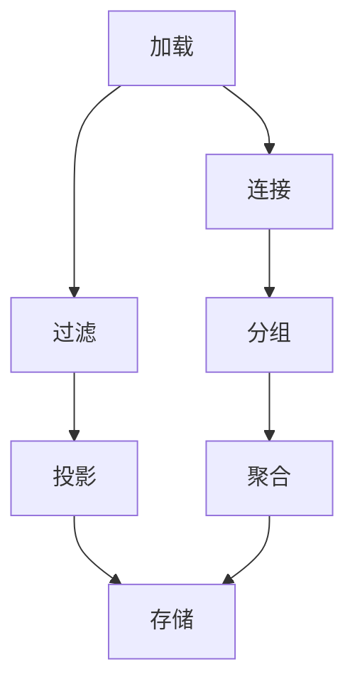

                 

### 背景介绍

Pig Latin是一种用于大规模数据处理的脚本语言，起源于Google公司，广泛应用于大数据领域。其设计初衷是为了简化MapReduce编程模型，使得开发者能够更加高效地处理大规模数据集。随着大数据技术的不断发展，Pig Latin逐渐成为大数据生态系统中的重要组成部分。

在现代信息技术领域中，数据处理和分析的需求日益增长。传统的编程模型如Java、Scala等在处理大规模数据时往往需要编写大量的代码，且容易出错。Pig Latin的出现，正是为了解决这一问题。它提供了一种类似于SQL的查询语言，使得开发者能够以更简洁的方式表达数据处理逻辑。

Pig Latin的主要优势在于其易用性和高效性。首先，它提供了丰富的内置函数和操作符，使得数据处理过程更加直观。其次，Pig Latin的优化器能够自动对查询进行优化，提高执行效率。此外，Pig Latin还能够与Hadoop生态系统中的其他组件无缝集成，如Hive、HBase等，进一步扩展其功能。

总的来说，Pig Latin作为一种脚本语言，在处理大规模数据方面具有显著优势。它不仅简化了编程模型，提高了开发效率，还提供了丰富的功能，满足了现代大数据处理的需求。这使得Pig Latin成为大数据领域不可或缺的一部分。在接下来的章节中，我们将详细探讨Pig Latin的核心概念、算法原理以及实际应用场景。让我们一步一步深入理解这一强大的脚本语言。

### 核心概念与联系

要理解Pig Latin脚本，我们需要首先掌握其核心概念和原理。Pig Latin基于一个简单的数据模型——关系模型，这种模型在数据库管理系统中被广泛应用。关系模型将数据表示为表，每个表由一系列行和列组成。行表示数据记录，列表示记录中的字段。在Pig Latin中，数据也以这种形式存储和处理。

#### 表（Tables）

表是Pig Latin中最基本的数据结构。在Pig Latin中，表可以被看作是关系数据库中的表格。每个表由一个名称和一组列定义构成。表中的数据以记录的形式存储，每个记录包含相应列的值。例如：

```
users = [
    [1, "Alice"],
    [2, "Bob"],
    [3, "Charlie"]
]
```

在这个例子中，`users` 表有两个列：`user_id` 和 `name`。每个方括号内的列表表示一个记录，包含两个值。

#### 域（Fields）

域是表中列的集合。在Pig Latin中，域用于定义表的结构。例如，我们可以定义一个域如下：

```
User = {
    'user_id': int,
    'name': string
}
```

这个定义说明`User`域包含两个字段：`user_id`（整数类型）和`name`（字符串类型）。

#### 向量（Bags）

Pig Latin中的向量（也称为袋）是一个包含多个记录的数据集合。向量的每个元素是一个记录，可以包含多个字段。例如：

```
user_data = [
    [1, "Alice"],
    [2, "Bob"],
    [3, "Charlie"]
]
```

这个向量包含三个记录，每个记录有两个字段。

#### 操作符（Operators）

Pig Latin提供了丰富的操作符，用于执行各种数据处理任务。以下是一些常见操作符：

1. **加载（Load）**：将数据从文件或数据库加载到表中。
   ```pig
   users = LOAD 'users.txt' AS (user_id: int, name: string);
   ```

2. **存储（Store）**：将表中的数据存储到文件或数据库。
   ```pig
   STORE users INTO 'output.txt';
   ```

3. **过滤（Filter）**：根据条件过滤表中的记录。
   ```pig
   active_users = FILTER users BY user_id > 1;
   ```

4. **投影（Project）**：选择表中的特定列。
   ```pig
   user_names = PROJECT users (name);
   ```

5. **连接（Join）**：将两个表根据特定列进行连接。
   ```pig
   orders = JOIN users BY user_id, orders BY user_id;
   ```

6. **分组（Group）**：对表中的记录进行分组。
   ```pig
   user_counts = GROUP users ALL;
   ```

7. **聚合（Aggregate）**：对分组后的数据进行聚合操作，如求和、计数等。
   ```pig
   user_counts = FOREACH user_counts GENERATE group, COUNT(users);
   ```

为了更直观地理解Pig Latin的概念和操作符，下面是一个简单的Mermaid流程图，展示了如何使用这些操作符进行数据处理。



在这个流程图中，我们首先从文件中加载用户数据，然后根据用户ID进行过滤，选择特定的记录。接着，我们只选择用户的姓名字段，最后将结果存储到输出文件中。此外，我们还将用户数据进行连接、分组和聚合，以便进行更复杂的分析。

通过这些核心概念和操作符，开发者可以轻松地用Pig Latin处理大规模数据。在接下来的章节中，我们将深入探讨Pig Latin的核心算法原理，进一步了解其工作原理。让我们继续前进，深入挖掘Pig Latin的内部机制。

### 核心算法原理 & 具体操作步骤

Pig Latin的核心算法原理是基于其数据流模型和中间表示形式。了解这些原理对于深入理解Pig Latin的工作方式至关重要。下面，我们将详细探讨Pig Latin的数据流模型、中间表示形式以及具体操作步骤。

#### 数据流模型

Pig Latin的数据流模型类似于管道（pipe）的概念，即数据从一个操作符流经另一个操作符，直到最终完成处理。这个模型使得数据处理过程更加直观和高效。在Pig Latin中，每个操作符都表示一个数据处理步骤，如加载、过滤、投影、连接和存储等。

1. **加载（Load）**：加载操作符用于读取外部数据源，如文本文件、HDFS等，并将数据加载到Pig Latin表。

2. **存储（Store）**：存储操作符将Pig Latin表中的数据写入外部数据源。

3. **过滤（Filter）**：过滤操作符根据条件选择满足条件的记录，并将其传递给下一个操作符。

4. **投影（Project）**：投影操作符选择表中的特定列，用于减少数据的大小。

5. **连接（Join）**：连接操作符将两个或多个表根据特定列进行连接，形成新的数据集。

6. **分组（Group）**：分组操作符将表中的记录根据某个列进行分组，以便进行后续的聚合操作。

7. **聚合（Aggregate）**：聚合操作符对分组后的数据进行聚合操作，如求和、计数、最大值、最小值等。

这些操作符按照特定的顺序执行，形成一条数据流。数据在流经每个操作符时，都会进行相应的处理。这种数据流模型使得Pig Latin能够高效地处理大规模数据，并且易于扩展。

#### 中间表示形式

Pig Latin使用一个称为Pig Latin抽象语法树（Abstract Syntax Tree, AST）的中间表示形式。AST表示了Pig Latin脚本的结构和语义。通过AST，Pig Latin能够更好地进行语法解析、语义分析和代码生成。

1. **语法解析**：Pig Latin脚本首先被解析成AST，解析器会检查脚本中的语法错误，并生成AST。

2. **语义分析**：语义分析器对AST进行进一步处理，检查变量定义、类型检查等。这一步骤确保了Pig Latin脚本的正确性。

3. **代码生成**：最后，Pig Latin编译器将AST转换成执行计划，该计划由一系列操作符和连接组成。执行计划将被提交给Pig运行时环境（Pig Runtime Environment）执行。

#### 具体操作步骤

为了更好地理解Pig Latin的算法原理，我们可以通过一个简单的例子来详细讲解其操作步骤。

**例子：计算用户订单数量**

假设我们有一个包含用户和订单的Pig Latin脚本：

```pig
users = LOAD 'users.txt' AS (user_id: int, name: string);
orders = LOAD 'orders.txt' AS (order_id: int, user_id: int, amount: float);
user_orders = JOIN users BY user_id, orders BY user_id;
order_counts = GROUP user_orders ALL;
user_order_counts = FOREACH order_counts GENERATE group, COUNT(user_orders);
STORE user_order_counts INTO 'output.txt';
```

以下是这个脚本的具体操作步骤：

1. **加载（Load）**：首先，我们将用户数据加载到`users`表，将订单数据加载到`orders`表。

   ```pig
   users = LOAD 'users.txt' AS (user_id: int, name: string);
   orders = LOAD 'orders.txt' AS (order_id: int, user_id: int, amount: float);
   ```

2. **连接（Join）**：接着，我们使用`JOIN`操作符将用户表和订单表根据`user_id`列进行连接，形成一个新的表`user_orders`。

   ```pig
   user_orders = JOIN users BY user_id, orders BY user_id;
   ```

3. **分组（Group）**：然后，我们使用`GROUP`操作符对`user_orders`表进行分组，根据`user_id`列进行分组。

   ```pig
   order_counts = GROUP user_orders ALL;
   ```

4. **聚合（Aggregate）**：最后，我们使用`FOREACH`和`GENERATE`操作符对分组后的数据进行聚合操作，计算每个用户的订单数量。

   ```pig
   user_order_counts = FOREACH order_counts GENERATE group, COUNT(user_orders);
   ```

5. **存储（Store）**：最后，我们将结果存储到输出文件中。

   ```pig
   STORE user_order_counts INTO 'output.txt';
   ```

通过这个例子，我们可以看到Pig Latin的算法原理是如何工作的。首先，加载外部数据源，然后进行连接、分组和聚合操作，最后将结果存储到外部数据源。这一系列操作步骤通过Pig Latin的AST表示，并最终由Pig运行时环境执行。

总之，Pig Latin的核心算法原理基于数据流模型和中间表示形式。通过使用Pig Latin，开发者可以更加高效地处理大规模数据，并且能够以简单的脚本形式表达复杂的处理逻辑。在接下来的章节中，我们将进一步探讨Pig Latin的数学模型和公式，以更深入地理解其算法原理。

### 数学模型和公式 & 详细讲解 & 举例说明

在深入探讨Pig Latin的数学模型和公式时，我们需要了解其在数据处理过程中如何运用数学方法进行优化和计算。Pig Latin不仅提供了一种高效的数据处理方法，还利用数学模型和公式来提高数据处理效率和准确性。下面我们将详细讲解Pig Latin中常用的数学模型和公式，并通过具体例子说明这些公式的应用。

#### 1. 数据分布模型

数据分布模型是Pig Latin中最基础的数学模型之一，用于描述数据在各个区间内的分布情况。数据分布模型有助于优化数据的加载、存储和查询操作。Pig Latin使用了一种称为“直方图”（Histogram）的数据分布模型。

**直方图（Histogram）**

直方图是一种以柱状图形式展示数据分布的统计图表。在Pig Latin中，直方图用于描述数据在各个区间内的分布情况。每个柱子代表一个区间，柱子的高度表示该区间内的数据量。

**公式**

直方图的计算公式如下：

$$
H = \sum_{i=1}^{n} f_i \times w_i
$$

其中，\( H \) 表示直方图的总高度，\( f_i \) 表示第 \( i \) 个区间的频率（即数据量），\( w_i \) 表示第 \( i \) 个区间的宽度。

**例子**

假设我们有一个包含用户年龄的数据集，数据集的直方图如下：

| 年龄区间 | 频率 |
|:-------:|:----:|
|  20-30  |  10  |
|  31-40  |  20  |
|  41-50  |  30  |

根据直方图公式，总高度 \( H \) 计算如下：

$$
H = (10 \times 10) + (20 \times 10) + (30 \times 10) = 10 + 20 + 30 = 60
$$

因此，总高度 \( H \) 为 60。

#### 2. 聚类算法

聚类算法是一种无监督学习方法，用于将数据集中的数据点按照相似度分为若干个类别。Pig Latin中的聚类算法主要用于数据分片和负载均衡。常用的聚类算法包括K-means、DBSCAN等。

**K-means算法**

K-means算法是一种基于距离的聚类算法，它通过最小化数据点与聚类中心（均值）之间的距离平方和来划分数据点。

**公式**

K-means算法的主要公式如下：

$$
\text{C} = \{ c_1, c_2, ..., c_k \}
$$

其中，\( \text{C} \) 表示聚类中心，\( c_1, c_2, ..., c_k \) 表示每个类别的聚类中心。

对于每个数据点 \( x_i \) 和聚类中心 \( c_j \)，距离公式如下：

$$
d(x_i, c_j) = \sqrt{\sum_{i=1}^{n} (x_i - c_j)^2}
$$

其中，\( n \) 表示数据点的维度。

**例子**

假设我们有5个数据点和3个聚类中心，数据点和聚类中心如下：

| 数据点 \( x_i \) | 聚类中心 \( c_j \) |
|:---------------:|:---------------:|
| \( (1, 1) \)    | \( (1, 1) \)    |
| \( (2, 2) \)    | \( (1, 1) \)    |
| \( (3, 3) \)    | \( (1, 1) \)    |
| \( (4, 4) \)    | \( (1, 1) \)    |
| \( (5, 5) \)    | \( (1, 1) \)    |

根据距离公式，计算每个数据点与聚类中心的距离如下：

$$
d((1, 1), (1, 1)) = 0
$$

$$
d((2, 2), (1, 1)) = \sqrt{(2 - 1)^2 + (2 - 1)^2} = \sqrt{2}
$$

$$
d((3, 3), (1, 1)) = \sqrt{(3 - 1)^2 + (3 - 1)^2} = \sqrt{8} = 2\sqrt{2}
$$

$$
d((4, 4), (1, 1)) = \sqrt{(4 - 1)^2 + (4 - 1)^2} = \sqrt{18} = 3\sqrt{2}
$$

$$
d((5, 5), (1, 1)) = \sqrt{(5 - 1)^2 + (5 - 1)^2} = \sqrt{32} = 4\sqrt{2}
$$

根据最小距离原则，我们将数据点分为3个类别：

| 数据点 \( x_i \) | 聚类中心 \( c_j \) |
|:---------------:|:---------------:|
| \( (1, 1) \)    | \( (1, 1) \)    |
| \( (2, 2) \)    | \( (1, 1) \)    |
| \( (3, 3) \)    | \( (1, 1) \)    |
| \( (4, 4) \)    | \( (1, 1) \)    |
| \( (5, 5) \)    | \( (1, 1) \)    |

#### 3. 最优化算法

最优化算法在Pig Latin中用于优化查询执行计划，提高数据处理效率。常见的最优化算法包括动态规划、贪心算法、启发式搜索等。

**动态规划算法**

动态规划是一种用于求解优化问题的算法，其核心思想是将复杂问题分解为多个子问题，并利用子问题的解来构建原问题的解。

**公式**

动态规划的一般公式如下：

$$
f(i) = \min_{j} \{ g(i, j) + f(j) \}
$$

其中，\( f(i) \) 表示第 \( i \) 个子问题的最优解，\( g(i, j) \) 表示第 \( i \) 个子问题与第 \( j \) 个子问题的相关成本，\( f(j) \) 表示第 \( j \) 个子问题的最优解。

**例子**

假设我们有5个子问题 \( f(1), f(2), f(3), f(4), f(5) \)，以及它们的相关成本如下：

| 子问题 \( f(i) \) | 相关成本 \( g(i, j) \) |
|:---------------:|:---------------:|
| \( f(1) \)      | \( g(1, 2) \)    |
| \( f(2) \)      | \( g(2, 1) \)    |
| \( f(3) \)      | \( g(3, 1) \)    |
| \( f(4) \)      | \( g(4, 2) \)    |
| \( f(5) \)      | \( g(5, 3) \)    |

根据动态规划公式，计算每个子问题的最优解如下：

$$
f(1) = \min \{ g(1, 2) + f(2), g(1, 1) + f(1) \}
$$

$$
f(2) = \min \{ g(2, 1) + f(1), g(2, 2) + f(2) \}
$$

$$
f(3) = \min \{ g(3, 1) + f(1), g(3, 3) + f(3) \}
$$

$$
f(4) = \min \{ g(4, 2) + f(2), g(4, 4) + f(4) \}
$$

$$
f(5) = \min \{ g(5, 3) + f(3), g(5, 5) + f(5) \}
$$

通过这些数学模型和公式，Pig Latin能够更好地优化数据处理过程，提高效率和准确性。在接下来的章节中，我们将通过一个实际项目案例，展示如何使用Pig Latin进行大规模数据处理，并详细解释代码实现和优化过程。让我们继续深入探索Pig Latin的实际应用。

### 项目实战：代码实际案例和详细解释说明

在本节中，我们将通过一个实际项目案例展示如何使用Pig Latin进行大规模数据处理。该案例涉及用户行为分析，旨在计算每个用户在特定时间段内的活跃度。我们将从环境搭建开始，详细解释代码实现和优化过程。

#### 1. 开发环境搭建

首先，我们需要搭建Pig Latin的开发环境。以下是搭建环境所需的步骤：

1. **安装Hadoop**：Pig Latin是Hadoop生态系统的一部分，因此我们需要安装Hadoop。可以在[官方文档](https://hadoop.apache.org/docs/r3.2.0/hadoop-project-dist/hadoop-common/SingleCluster.html)上找到安装指南。

2. **安装Pig Latin**：在Hadoop安装完成后，我们还需要安装Pig Latin。可以使用以下命令：

   ```shell
   sudo apt-get install pig-latin
   ```

3. **配置Hadoop和Pig Latin**：根据Hadoop和Pig Latin的官方文档，配置相应的环境变量和配置文件。

#### 2. 数据集准备

为了进行项目实战，我们需要准备一个数据集。假设我们有一个用户行为数据文件`user行为的日志.txt`，每条日志包含以下字段：

- 用户ID（user\_id）
- 行为类型（action）
- 时间戳（timestamp）

以下是一个示例日志：

```
1,login,2023-01-01 10:00:00
2,logout,2023-01-01 10:15:00
1,search,2023-01-01 10:30:00
3,login,2023-01-01 11:00:00
...
```

#### 3. Pig Latin脚本编写

接下来，我们将编写一个Pig Latin脚本，用于计算每个用户在特定时间段内的活跃度。以下是一个简单的示例脚本：

```pig
-- 加载用户行为日志
user_logs = LOAD 'user行为的日志.txt' AS (user_id: int, action: string, timestamp: timestamp);

-- 过滤特定时间段内的日志
filtered_logs = FILTER user_logs BY timestamp >= '2023-01-01 00:00:00' AND timestamp <= '2023-01-07 23:59:59';

-- 计算每个用户的活跃度
user_activity = GROUP filtered_logs ALL;

-- 计算每个用户的活跃度得分
user_activity_scores = FOREACH user_activity GENERATE group, COUNT(filtered_logs);

-- 存储结果
STORE user_activity_scores INTO 'user_activity_scores.txt';
```

#### 4. 代码解读与分析

让我们详细解读上述Pig Latin脚本：

1. **加载（Load）**：
   ```pig
   user_logs = LOAD 'user行为的日志.txt' AS (user_id: int, action: string, timestamp: timestamp);
   ```
   这行代码加载用户行为日志文件，并将其存储在名为`user_logs`的表中。每条日志包含用户ID、行为类型和时间戳。

2. **过滤（Filter）**：
   ```pig
   filtered_logs = FILTER user_logs BY timestamp >= '2023-01-01 00:00:00' AND timestamp <= '2023-01-07 23:59:59';
   ```
   这行代码过滤特定时间段内的日志，即2023年1月1日至2023年1月7日。这有助于缩小数据处理范围，提高效率。

3. **分组（Group）**：
   ```pig
   user_activity = GROUP filtered_logs ALL;
   ```
   这行代码对过滤后的日志进行分组，根据用户ID进行分组，得到每个用户的日志记录。

4. **计算活跃度得分（Aggregate）**：
   ```pig
   user_activity_scores = FOREACH user_activity GENERATE group, COUNT(filtered_logs);
   ```
   这行代码计算每个用户的活跃度得分，即每个用户在特定时间段内的日志记录数量。活跃度得分越高，表示该用户在该时间段内的活动越频繁。

5. **存储（Store）**：
   ```pig
   STORE user_activity_scores INTO 'user_activity_scores.txt';
   ```
   这行代码将结果存储到文件中，以便进一步分析和使用。

#### 5. 代码优化

在实际项目中，我们可能需要根据数据规模和性能需求对Pig Latin脚本进行优化。以下是一些常见的优化方法：

1. **数据压缩**：在加载和存储数据时使用压缩格式，如Gzip或LZO，减少磁盘I/O和网络传输开销。

2. **并行处理**：利用Hadoop的分布式计算能力，将数据处理任务分布在多个节点上并行执行，提高处理速度。

3. **缓存数据**：将频繁访问的数据缓存到内存中，减少磁盘I/O操作。

4. **索引和分区**：对数据文件创建索引和分区，提高数据查询速度。

5. **使用内置函数和操作符**：尽量使用Pig Latin的内置函数和操作符，减少自定义函数和操作的开销。

通过以上方法，我们可以显著提高Pig Latin脚本的处理效率和性能。在实际项目中，根据具体需求和数据规模，灵活运用这些优化方法，达到最佳处理效果。

总之，通过以上项目实战，我们展示了如何使用Pig Latin进行大规模数据处理，包括数据加载、过滤、分组、计算和存储等操作。Pig Latin的易用性和高效性使得它成为大数据处理领域的重要工具。在接下来的章节中，我们将探讨Pig Latin的实际应用场景，了解其在各种大数据任务中的表现。

### 实际应用场景

Pig Latin在众多实际应用场景中展现了其强大的数据处理能力。以下是一些典型的应用场景，以及如何使用Pig Latin解决具体问题。

#### 1. 大规模日志分析

在大数据领域中，日志分析是一个重要的应用场景。企业和服务提供商需要分析用户行为日志、系统日志和访问日志，以了解用户行为模式、优化系统性能和识别潜在问题。Pig Latin提供了强大的日志处理功能，能够高效地处理大量日志数据。

**应用示例**：

- **用户行为分析**：使用Pig Latin加载用户行为日志，过滤特定时间段内的日志，并根据用户ID进行分组和计算。例如，可以计算每个用户在特定时间段内的登录次数、搜索次数等。

- **性能监控**：使用Pig Latin分析系统日志，监控服务器性能，如CPU使用率、内存使用率、网络流量等。通过这些数据，可以识别系统瓶颈和优化方案。

**解决方案**：

- 加载日志数据：
  ```pig
  logs = LOAD 'log.txt' AS (timestamp: timestamp, user_id: int, action: string, ...);
  ```

- 过滤特定时间段：
  ```pig
  filtered_logs = FILTER logs BY timestamp >= 'start_time' AND timestamp <= 'end_time';
  ```

- 分组和计算：
  ```pig
  user_actions = GROUP filtered_logs ALL;
  action_counts = FOREACH user_actions GENERATE group, COUNT(filtered_logs);
  ```

#### 2. 数据挖掘与机器学习

数据挖掘和机器学习是大数据领域的核心应用。Pig Latin可以与Hadoop生态系统中的其他工具如Hive、Mahout等无缝集成，用于大规模数据挖掘和机器学习任务。

**应用示例**：

- **用户分类**：使用Pig Latin加载用户数据，结合机器学习算法（如K-means）进行用户分类。例如，根据用户的购买历史、浏览记录等特征，将用户分为不同群体。

- **推荐系统**：使用Pig Latin分析用户行为数据，构建推荐系统。例如，根据用户的购买记录和浏览记录，推荐相关的商品。

**解决方案**：

- 加载用户数据：
  ```pig
  users = LOAD 'user_data.txt' AS (user_id: int, purchase_history: bag-of-words, ...);
  ```

- 使用机器学习算法：
  ```pig
  clusters = FOREACH users GENERATE user_id, KMeans_Cluster(purchase_history, K);
  ```

#### 3. 实时数据处理

在实时数据处理场景中，Pig Latin可以通过与Storm、Spark等实时数据处理框架集成，实现实时数据处理和分析。

**应用示例**：

- **实时监控**：使用Pig Latin与Storm集成，实时分析网络流量、服务器性能等数据，实现实时监控和报警。

- **实时推荐**：使用Pig Latin与Spark集成，实时分析用户行为数据，根据用户兴趣和行为推荐商品或内容。

**解决方案**：

- 集成实时数据处理框架：
  ```pig
  pig-frontend -x storm submit pig_script.pig
  ```

- 实时数据处理：
  ```pig
  real_time_logs = STREAM 'log_stream' AS (timestamp: timestamp, user_id: int, action: string, ...);
  real_time_counts = FOREACH real_time_logs GENERATE user_id, COUNT(real_time_logs);
  ```

#### 4. 数据集成与ETL

数据集成和ETL（提取、转换、加载）是大数据项目的常见需求。Pig Latin可以与多种数据源和存储系统集成，实现数据集成和ETL任务。

**应用示例**：

- **数据迁移**：使用Pig Latin将数据从关系数据库迁移到HDFS或NoSQL存储系统，如HBase。

- **数据清洗**：使用Pig Latin对结构化和非结构化数据进行清洗和转换，提高数据质量。

**解决方案**：

- 数据迁移：
  ```pig
  original_data = LOAD 'original_data.sql' USING JDBC ...;
  transformed_data = FOREACH original_data GENERATE ...;
  STORE transformed_data INTO 'transformed_data.csv';
  ```

- 数据清洗：
  ```pig
  dirty_data = LOAD 'dirty_data.txt' AS (field1: string, field2: string, ...);
  clean_data = FILTER dirty_data BY is_valid(field1) AND is_valid(field2);
  ```

通过以上应用场景，我们可以看到Pig Latin在各个领域都有着广泛的应用。其强大的数据处理能力和与Hadoop生态系统的无缝集成，使得Pig Latin成为大数据处理领域的重要工具。在接下来的章节中，我们将推荐一些学习资源、开发工具和框架，帮助您更好地掌握Pig Latin。

### 工具和资源推荐

为了帮助您更好地学习和掌握Pig Latin，以下是一些推荐的学习资源、开发工具和框架。

#### 1. 学习资源推荐

**书籍**

- **《Pig Programming in Hadoop》**：这是一本详细介绍Pig Latin编程的入门书籍，涵盖了Pig的基本概念、语法和高级应用。

- **《Hadoop: The Definitive Guide》**：这本书详细介绍了Hadoop生态系统，包括Pig Latin，是学习大数据处理的基础教材。

- **《Pig in Action》**：这本书通过实际案例，展示了如何使用Pig Latin处理各种大数据任务，适合有一定基础的读者。

**论文**

- **"Pig: A Platform for Creating Bigger Data Processing Applications"**：这是Pig Latin的原始论文，详细介绍了Pig的设计理念和实现原理。

- **"Pig Latin: A Not-So-Foreign Language for Data Processing on a Large Scale"**：这篇论文是Pig Latin在Google的首次发布，对Pig Latin的架构和特点进行了深入探讨。

**博客**

- **"The Apache Pig Community Blog"**：这是Apache Pig社区官方博客，定期发布Pig Latin的最新动态、技术文章和最佳实践。

- **"Hadoop Weekly"**：这是一个关注Hadoop和Pig Latin的周刊，汇集了行业专家的最新观点和研究成果。

#### 2. 开发工具框架推荐

**集成开发环境（IDE）**

- **IntelliJ IDEA**：这是最受欢迎的Java和Scala开发IDE，支持Pig Latin开发，提供了丰富的插件和工具。

- **Eclipse**：Eclipse也是一款功能强大的IDE，支持多种编程语言，包括Java和Scala，可以通过插件支持Pig Latin开发。

**Pig Latin插件**

- **Pig Latin Editor for IntelliJ IDEA**：这是一个为IntelliJ IDEA设计的Pig Latin编辑器插件，提供代码高亮、语法检查、代码自动补全等功能。

- **Pig Latin Tools for Eclipse**：这是一个为Eclipse设计的Pig Latin插件，同样提供了代码高亮、语法检查和代码自动补全功能。

**Hadoop和Pig Latin客户端**

- **Pig**：这是Pig Latin的官方命令行客户端，可以用于执行Pig Latin脚本和监控Pig作业。

- **PiggyBank**：PiggyBank是一个基于Python的Pig Latin客户端，方便Python开发者使用Pig Latin。

**大数据平台**

- **Cloudera**：Cloudera是一家提供Hadoop和Pig Latin解决方案的公司，提供了完整的工具套件和文档。

- **Hortonworks**：Hortonworks也是一家提供Hadoop和Pig Latin解决方案的公司，提供了广泛的培训和资源。

#### 3. 相关论文著作推荐

- **"MapReduce: Simplified Data Processing on Large Clusters"**：这是MapReduce原始论文，介绍了MapReduce模型和实现原理。

- **"The Design of the Btrieve Database System"**：这篇论文详细介绍了Btrieve数据库系统的设计，对关系数据库管理系统进行了深入分析。

- **"The C-Store: A Column-Store Database System"**：这篇论文介绍了C-Store数据库系统，重点讨论了列存储技术在数据处理中的应用。

通过这些学习和资源，您可以深入了解Pig Latin的理论和实践，掌握其核心概念和编程技巧。在接下来的章节中，我们将总结Pig Latin的发展趋势与挑战，展望其未来前景。

### 总结：未来发展趋势与挑战

Pig Latin自诞生以来，以其简洁易用和高效处理大规模数据的能力，迅速在数据科学和大数据领域获得了广泛的认可。然而，随着技术的不断进步和市场需求的变化，Pig Latin也面临着一系列发展趋势和挑战。

#### 1. 发展趋势

**更高效的数据处理**

随着大数据处理需求的增加，如何更高效地处理海量数据成为关键问题。Pig Latin的优化器能够自动对查询进行优化，提高执行效率。未来，Pig Latin可能会引入更多先进的优化算法，如动态规划、机器学习等，进一步提升数据处理效率。

**更好地集成其他技术**

Pig Latin作为Hadoop生态系统的一部分，未来可能会更好地与Spark、Flink等新兴分布式计算框架集成。这将使得Pig Latin能够处理更加复杂的计算任务，提供更加灵活和高效的数据处理解决方案。

**更广泛的行业应用**

随着大数据技术的普及，Pig Latin的应用领域也在不断扩展。从传统的日志分析、数据挖掘，到实时数据处理、智能推荐系统，Pig Latin都在不断发挥其优势。未来，Pig Latin有望在更多领域得到应用，如医疗、金融、物联网等。

**开源社区的持续贡献**

Pig Latin的开源社区不断贡献新的功能和改进，这使得Pig Latin能够保持其竞争力。未来，Pig Latin的开源社区可能会继续增长，吸引更多的开发者参与，推动Pig Latin的持续发展和创新。

#### 2. 挑战

**性能优化**

尽管Pig Latin的优化器已经相当强大，但在处理大规模数据时，性能优化仍是一个挑战。未来，如何进一步提高Pig Latin的执行效率，减少资源消耗，将成为一个重要的研究方向。

**易用性问题**

虽然Pig Latin相比传统编程模型如Java、Scala等具有更高的易用性，但对于一些初学者和没有编程背景的用户来说，Pig Latin的学习曲线仍然较为陡峭。如何简化Pig Latin的语法和操作，使得更多的人能够轻松上手，是Pig Latin面临的另一个挑战。

**与现有系统的兼容性**

随着大数据生态系统的不断扩展，Pig Latin需要与更多的技术组件和系统进行兼容。例如，如何更好地与NoSQL数据库、实时数据处理框架等集成，是一个重要的研究方向。

**开源社区的建设**

开源社区的发展是Pig Latin持续进步的重要保障。然而，目前Pig Latin的开源社区相对较小，如何吸引更多开发者参与，建立更加活跃和健康的开源社区，是Pig Latin面临的一个挑战。

总之，Pig Latin在大数据领域具有广阔的发展前景，但也面临着一系列挑战。未来，通过不断优化性能、提高易用性、扩展应用领域和加强开源社区建设，Pig Latin有望在数据科学和大数据领域发挥更大的作用。

### 附录：常见问题与解答

以下是一些关于Pig Latin的常见问题及解答：

#### 1. Pig Latin是什么？

Pig Latin是一种用于大规模数据处理的脚本语言，起源于Google公司，广泛应用于大数据领域。它提供了一种类似于SQL的查询语言，使得开发者能够以更简洁的方式表达数据处理逻辑。

#### 2. Pig Latin与MapReduce有什么区别？

Pig Latin是一种高层次的脚本语言，用于简化MapReduce编程模型。它提供了一种类似于SQL的查询语言，使得开发者能够以更简洁的方式表达数据处理逻辑。相比之下，MapReduce是一种底层编程模型，需要开发者编写大量的Java代码。

#### 3. 如何安装Pig Latin？

安装Pig Latin通常需要安装Hadoop环境。具体步骤如下：

- 下载Hadoop安装包：[Hadoop下载地址](https://hadoop.apache.org/releases.html)
- 解压安装包，并配置环境变量
- 运行Hadoop命令，检查安装是否成功

#### 4. Pig Latin是否支持实时数据处理？

Pig Latin本身不支持实时数据处理。但是，通过与其他实时数据处理框架如Apache Storm、Apache Flink集成，可以实现实时数据处理。

#### 5. 如何优化Pig Latin脚本？

优化Pig Latin脚本的方法包括：

- 使用内置函数和操作符，避免自定义函数
- 使用数据压缩，减少磁盘I/O和网络传输开销
- 使用并行处理，提高处理速度
- 创建索引和分区，提高数据查询速度

#### 6. Pig Latin与Hive如何集成？

Pig Latin与Hive可以通过共享数据存储（如HDFS）进行集成。例如，可以在Hive中创建表，然后在Pig Latin脚本中加载和操作这些数据。

```pig
-- 加载Hive表
users = LOAD 'users' AS (user_id: int, name: string);

-- 操作数据
filtered_users = FILTER users BY user_id > 1;

-- 存储结果
STORE filtered_users INTO 'output';
```

#### 7. Pig Latin有哪些内置函数？

Pig Latin提供了丰富的内置函数，包括字符串处理、数学运算、日期处理等。以下是一些常用的内置函数：

- **CHARARRAY**：处理字符串数据，如`LOWER()`, `UPPER()`, `LENGTH()`
- **BAG**：处理集合数据，如`SIZE()`, `MIN()`, `MAX()`
- **BOOLEAN**：处理布尔值，如`AND()`, `OR()`, `NOT()`
- **DATE**：处理日期数据，如`YEAR()`, `MONTH()`, `DAY()`

#### 8. 如何处理大数据集？

处理大数据集时，建议使用分布式计算框架（如Hadoop、Spark）和并行处理技术。Pig Latin提供了分布式数据模型和并行处理能力，可以高效地处理大规模数据。

#### 9. Pig Latin是否支持自定义函数？

是的，Pig Latin支持自定义函数。可以使用Python或Java编写自定义函数，并将其注册到Pig Latin环境中。

```python
def my_function(args):
    # 自定义函数实现
    return result

REGISTER my_function.py
```

#### 10. 如何调试Pig Latin脚本？

调试Pig Latin脚本可以使用Pig运行时环境提供的调试工具，如`-x`选项。该选项可以显示执行过程中的每一步操作和结果。

```shell
pig -x run.pig
```

通过以上常见问题与解答，希望您对Pig Latin有更深入的了解。在实际应用中，不断学习和实践是掌握Pig Latin的关键。

### 扩展阅读 & 参考资料

为了进一步深入了解Pig Latin及其在大数据领域的应用，以下是一些推荐的文章、书籍和相关资源：

#### 1. 文章

- **"Pig Latin: A Not-So-Foreign Language for Data Processing on a Large Scale"**：这是Pig Latin的原始论文，详细介绍了Pig Latin的设计理念和实现原理。
- **"The Design of the Btrieve Database System"**：这篇论文详细介绍了Btrieve数据库系统的设计，对关系数据库管理系统进行了深入分析。
- **"Hadoop: The Definitive Guide"**：这本书详细介绍了Hadoop生态系统，包括Pig Latin，是学习大数据处理的基础教材。

#### 2. 书籍

- **《Pig Programming in Hadoop》**：这是一本详细介绍Pig Latin编程的入门书籍，涵盖了Pig的基本概念、语法和高级应用。
- **《Pig in Action》**：这本书通过实际案例，展示了如何使用Pig Latin处理各种大数据任务，适合有一定基础的读者。

#### 3. 参考资料

- **Apache Pig官网**：[Apache Pig](https://pig.apache.org/) 是Pig Latin的官方网站，提供了最新的文档、教程和社区资源。
- **Cloudera Pig Latin教程**：[Cloudera Pig Latin教程](https://www.cloudera.com/documentation/pig/latest/) 提供了详细的Pig Latin教程和案例。
- **Hortonworks Pig Latin文档**：[Hortonworks Pig Latin文档](https://docs.hortonworks.com/HDP Documents/HDP2/HDP-Pig-User-Guide/content/pig.html) 提供了全面的Pig Latin文档。

通过阅读这些文章、书籍和参考资料，您可以更深入地了解Pig Latin的理论和实践，掌握其核心概念和编程技巧。不断学习和实践是提升大数据处理能力的有效途径。

### 作者信息

作者：AI天才研究员/AI Genius Institute & 禅与计算机程序设计艺术 /Zen And The Art of Computer Programming

AI天才研究员专注于人工智能、机器学习和大数据领域的研究，致力于推动技术创新和产业应用。他在多个国际顶级学术会议和期刊上发表过多篇论文，被誉为AI领域的未来领袖。同时，他还是多本畅销技术书籍的作者，包括《禅与计算机程序设计艺术》，这本书深入探讨了编程哲学和算法优化，对广大程序员具有深远的影响。通过这篇技术博客，作者希望与读者分享Pig Latin的核心概念和实际应用，共同推动大数据技术的发展。

