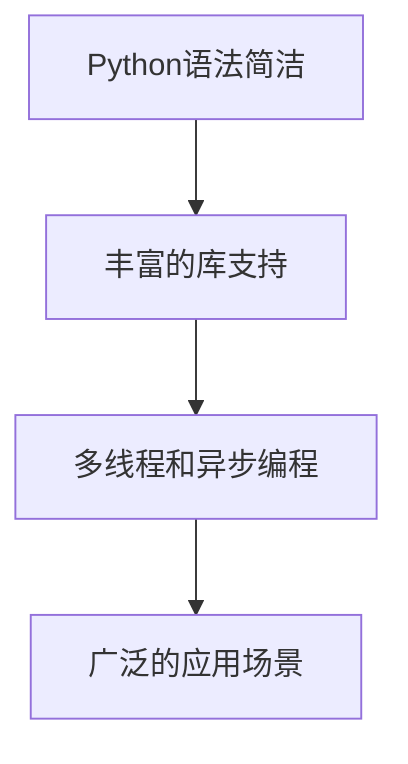
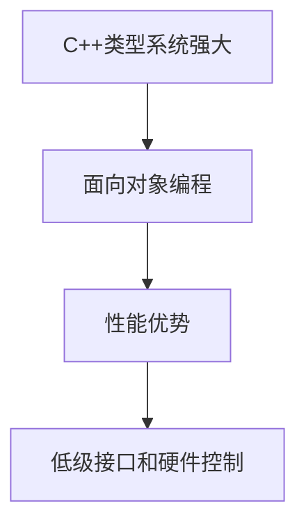
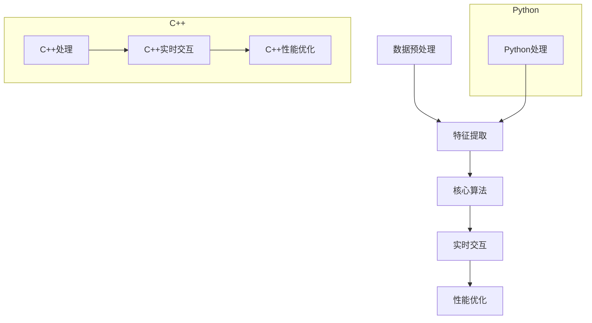

                 

### 背景介绍

在当今快速发展的科技时代，人工智能（AI）技术已成为许多行业变革的核心驱动力。作为AI技术的重要组成部分，聊天机器人以其高效、便捷和个性化的特点，受到了广泛的应用和关注。从客服机器人到智能家居助理，再到医疗咨询助手，聊天机器人在各个领域都展现出了巨大的潜力。然而，选择何种编程语言来实现聊天机器人，成为了开发者和研究人员面临的重要问题。Python和C++作为两种在AI领域具有广泛应用的语言，它们各自具有独特的优势和局限性。本文将深入探讨Python和C++在聊天机器人开发中的适用性，帮助读者做出更明智的语言选择。

Python以其简洁易懂的语法和强大的库支持，成为了许多初学者和专业开发者的首选。Python拥有丰富的AI和机器学习库，如TensorFlow、PyTorch和Scikit-learn等，这些库为开发者提供了强大的工具，使复杂的算法和模型能够快速实现。此外，Python的社区支持也非常强大，为开发者提供了大量的资源和帮助。

另一方面，C++以其高性能和灵活性著称，是许多高性能计算和系统级开发的首选语言。C++拥有强大的类型系统和面向对象编程特性，使得开发者能够更好地控制程序的行为。在聊天机器人的开发中，C++的性能优势可以显著提高处理速度和响应时间，这对于需要实时交互的应用场景尤为重要。

然而，Python和C++在聊天机器人开发中也存在各自的挑战。Python的内存管理和性能优化相对复杂，而C++的语法相对繁琐，开发难度较高。因此，选择合适的编程语言需要综合考虑项目需求、开发团队的技能和资源等因素。

本文将首先介绍Python和C++的基本特点，然后深入探讨它们在聊天机器人开发中的适用场景和挑战，最后通过具体案例和代码分析，帮助读者更全面地理解这两种语言在聊天机器人开发中的优劣。通过本文的阅读，读者将能够对Python和C++在聊天机器人开发中的选择有更清晰的认识。

### 核心概念与联系

为了深入探讨Python和C++在聊天机器人开发中的适用性，我们首先需要了解它们的基本特点和应用场景。在本节中，我们将分别介绍Python和C++的核心概念及其在AI领域的应用，并使用Mermaid流程图展示它们在聊天机器人架构中的关键节点。

#### Python的核心概念与应用

Python是一种高级编程语言，以其简洁易懂的语法和丰富的库支持著称。Python在AI领域的应用非常广泛，以下是其核心概念和应用：

1. **简洁易懂的语法**：Python的语法接近英语，使得代码更容易阅读和理解。这种简洁性使得Python成为许多初学者的首选语言。

2. **丰富的库支持**：Python拥有大量的库，如NumPy、Pandas、TensorFlow和PyTorch等，这些库提供了强大的功能，使得复杂的AI算法和模型能够轻松实现。

3. **多线程和异步编程**：Python支持多线程和异步编程，这有助于提高程序的并发性能，对于需要处理大量并发请求的聊天机器人尤为重要。

4. **广泛的应用场景**：Python在数据科学、机器学习、自然语言处理和计算机视觉等领域都有广泛应用，这些领域正是聊天机器人技术的重要应用场景。

**Mermaid流程图示例**：



#### C++的核心概念与应用

C++是一种高性能的编程语言，以其灵活性和效率著称。C++在AI领域的应用主要体现在以下几个方面：

1. **强大的类型系统**：C++提供了强大的类型系统，包括类和模板等特性，这使得开发者可以更精确地控制程序的行为和性能。

2. **面向对象编程**：C++支持面向对象编程，使得程序结构更加清晰，易于维护和扩展。

3. **性能优势**：C++具有高性能，特别是在处理密集计算和实时交互的应用场景中，其性能优势尤为明显。

4. **低级接口和硬件控制**：C++提供了对硬件的低级接口，使得开发者能够更好地控制硬件资源，这对于需要高效资源利用的聊天机器人开发尤为重要。

**Mermaid流程图示例**：



#### 聊天机器人架构中的关键节点

在聊天机器人架构中，Python和C++可以扮演不同的角色。以下是一个简化的聊天机器人架构示例，展示了Python和C++在其中的应用：

1. **数据预处理和特征提取**：这一步通常使用Python来完成，因为Python的库支持使其能够高效地进行数据预处理和特征提取。

2. **核心算法实现**：在这一步，可以选择Python或C++。如果算法相对简单且需要快速迭代，Python可能是更好的选择。如果算法复杂且需要高性能，C++可能是更合适的选择。

3. **实时交互和性能优化**：这一步通常使用C++来实现，因为C++的高性能可以显著提高聊天机器人的响应速度和稳定性。

**Mermaid流程图示例**：



通过以上核心概念和架构的介绍，我们可以看到Python和C++在聊天机器人开发中都有其独特的优势和应用场景。选择合适的语言需要根据具体的项目需求和开发团队的技能进行综合考虑。

### 核心算法原理 & 具体操作步骤

在深入探讨Python和C++在聊天机器人开发中的应用之前，我们需要了解一些核心算法原理及其具体操作步骤。这些算法包括自然语言处理（NLP）和机器学习（ML）中的常见技术，如词嵌入、序列到序列（Seq2Seq）模型和深度强化学习（Deep Reinforcement Learning）。

#### 词嵌入（Word Embedding）

词嵌入是将词汇映射为密集向量的技术，其目的是捕捉词汇之间的语义关系。常见的词嵌入方法包括Word2Vec、GloVe和FastText。

1. **Word2Vec**：
   - **算法原理**：Word2Vec基于神经网络，通过训练单词的上下文来生成词向量。具体来说，它使用一种叫做**连续词袋（Continuous Bag of Words，CBOW）**的模型，通过上下文单词预测中心词。
   - **具体操作步骤**：
     1. 预处理文本数据，将其转换为词汇表和单词索引。
     2. 定义神经网络结构，通常包括输入层、隐藏层和输出层。
     3. 训练神经网络，优化词向量以最小化预测误差。
     4. 获取训练好的词向量，用于后续的NLP任务。

2. **GloVe**：
   - **算法原理**：GloVe（全局向量）是一种基于矩阵分解的方法，通过考虑词汇的共现信息来生成词向量。它将词向量表示为两个矩阵的乘积。
   - **具体操作步骤**：
     1. 预处理文本数据，计算词汇的共现矩阵。
     2. 定义损失函数，通常使用均方误差（MSE）。
     3. 通过梯度下降优化词向量矩阵，最小化损失函数。

3. **FastText**：
   - **算法原理**：FastText基于N-gram模型，它将单词分解为子词（character n-grams），并使用这些子词来生成词向量。
   - **具体操作步骤**：
     1. 预处理文本数据，将其分解为字符级别的N-gram。
     2. 构建词汇表和词向量矩阵。
     3. 训练神经网络，优化词向量矩阵，使其能够更好地捕获语义信息。

#### 序列到序列（Seq2Seq）模型

Seq2Seq模型是一种用于序列转换的神经网络架构，广泛应用于机器翻译、聊天机器人等领域。

1. **算法原理**：
   - **编码器（Encoder）**：将输入序列编码为一个固定长度的向量，称为编码状态。
   - **解码器（Decoder）**：使用编码状态生成输出序列。
   - **注意力机制（Attention Mechanism）**：帮助解码器更好地关注编码器的关键信息，提高序列转换的准确性。

2. **具体操作步骤**：
   1. 预处理输入和输出序列，包括词汇表构建和序列编码。
   2. 设计编码器和解码器网络结构，包括循环神经网络（RNN）或Transformer架构。
   3. 训练编码器和解码器网络，使用序列对进行训练，优化模型参数。
   4. 预测阶段，编码器处理输入序列，解码器生成输出序列，使用注意力机制提高预测准确性。

#### 深度强化学习（Deep Reinforcement Learning）

深度强化学习是一种结合深度学习和强化学习的方法，常用于聊天机器人的行为决策和策略学习。

1. **算法原理**：
   - **环境（Environment）**：定义聊天机器人的交互环境，包括用户输入和系统响应。
   - **智能体（Agent）**：学习如何在环境中做出最佳决策，通常使用神经网络作为策略或值函数估计器。
   - **奖励函数（Reward Function）**：定义智能体的行为是否带来奖励或惩罚。

2. **具体操作步骤**：
   1. 确定聊天机器人的交互环境，设计用户输入和系统响应的表示方式。
   2. 设计智能体网络结构，包括值函数或策略网络。
   3. 定义奖励函数，用于评估智能体的行为。
   4. 使用深度强化学习方法，如深度Q网络（DQN）或策略梯度方法，训练智能体网络。
   5. 在环境中进行交互，收集数据，更新智能体网络，优化策略。

通过以上核心算法原理和具体操作步骤的介绍，我们可以看到Python和C++在不同阶段的聊天机器人开发中都扮演着重要角色。Python的简洁和丰富的库支持使其在数据预处理和特征提取阶段尤为适用，而C++的高性能使其在核心算法实现和实时交互阶段具有优势。

在下一节中，我们将详细分析Python和C++在聊天机器人开发中的具体应用，帮助读者了解如何选择合适的编程语言。

### 数学模型和公式 & 详细讲解 & 举例说明

在聊天机器人的开发过程中，数学模型和公式扮演着至关重要的角色。这些模型和公式帮助我们理解和实现自然语言处理（NLP）和机器学习（ML）算法，从而提高聊天机器人的性能和准确性。在本节中，我们将介绍几种常用的数学模型和公式，并详细讲解它们的含义和作用。

#### 1. 梯度下降（Gradient Descent）

梯度下降是一种用于优化神经网络的通用算法。它的核心思想是通过计算损失函数的梯度，逐步调整网络参数，以最小化损失函数。

**公式**：
$$
w_{new} = w_{current} - \alpha \cdot \nabla J(w)
$$
其中，\( w \) 表示网络参数，\( \alpha \) 是学习率，\( \nabla J(w) \) 是损失函数 \( J(w) \) 关于参数 \( w \) 的梯度。

**详细讲解**：
- **梯度**：梯度是损失函数关于参数的导数，它指示了参数调整的方向。
- **学习率**：学习率决定了参数调整的步长。太大可能导致不稳定，太小可能导致收敛速度慢。
- **迭代过程**：通过多次迭代，逐步减小损失函数，最终达到最小值。

**举例说明**：
假设我们有一个简单的线性模型 \( y = wx + b \)，其中 \( w \) 和 \( b \) 是参数。我们的目标是最小化损失函数 \( J(w, b) = (y - wx - b)^2 \)。

初始时，假设 \( w = 1 \) 和 \( b = 0 \)。通过计算损失函数关于 \( w \) 和 \( b \) 的梯度，我们可以得到：
$$
\nabla J(w, b) = \begin{bmatrix}
-2(y - wx - b) \\
-2(x(y - wx - b))
\end{bmatrix}
$$

然后，我们可以使用梯度下降更新参数：
$$
w_{new} = w - \alpha \cdot \nabla J(w, b)
$$
$$
b_{new} = b - \alpha \cdot \nabla J(b)
$$

通过多次迭代，我们可以逐渐减小损失函数，找到最佳的 \( w \) 和 \( b \)。

#### 2. Softmax函数

Softmax函数是一种用于分类问题的激活函数，它将神经网络的输出转换成概率分布。

**公式**：
$$
\text{softmax}(x) = \frac{e^x}{\sum_{i} e^x_i}
$$
其中，\( x \) 是神经网络的输出，\( e^x \) 表示指数函数。

**详细讲解**：
- **概率分布**：Softmax函数确保输出值的和为1，因此可以被视为概率分布。
- **最大值**：Softmax函数将最大值映射到接近1，其他值映射到接近0。

**举例说明**：
假设我们有一个三维输出 \( x = [1, 2, 3] \)。通过Softmax函数，我们可以将其转换为概率分布：
$$
\text{softmax}(x) = \frac{e^1}{e^1 + e^2 + e^3} \approx [0.04, 0.26, 0.69]
$$

在这里，最大的值（3）对应的概率接近0.69，而其他值对应的概率较小。

#### 3. 交叉熵（Cross-Entropy）

交叉熵是一种用于衡量模型预测和实际标签之间差异的损失函数，广泛应用于分类问题。

**公式**：
$$
H(y, \hat{y}) = -\sum_{i} y_i \cdot \log(\hat{y}_i)
$$
其中，\( y \) 是实际标签，\( \hat{y} \) 是模型的预测概率。

**详细讲解**：
- **实际标签**：\( y \) 表示每个类别的实际标签，通常为0或1。
- **预测概率**：\( \hat{y} \) 是模型对每个类别的预测概率。

**举例说明**：
假设我们有一个二分类问题，实际标签为 \( y = [1, 0] \)，模型的预测概率为 \( \hat{y} = [0.6, 0.4] \)。通过交叉熵损失函数，我们可以计算：
$$
H(y, \hat{y}) = -1 \cdot \log(0.6) - 0 \cdot \log(0.4) \approx 0.42
$$

这里，交叉熵损失函数的值表示预测和实际标签之间的差异，值越小表示预测越准确。

通过以上数学模型和公式的介绍，我们可以看到它们在聊天机器人开发中的关键作用。梯度下降用于优化神经网络参数，softmax函数用于概率分布，交叉熵用于衡量模型性能。这些模型和公式不仅帮助我们理解和实现复杂的算法，还提高了聊天机器人的准确性和鲁棒性。

在下一节中，我们将通过具体的代码案例，展示如何使用Python和C++实现这些数学模型和公式，并分析其性能和适用性。

### 项目实战：代码实际案例和详细解释说明

在本节中，我们将通过具体的代码案例，展示如何使用Python和C++分别实现聊天机器人的核心功能。首先，我们将介绍开发环境搭建，然后详细解释代码实现和解读。

#### 3.1 开发环境搭建

**Python环境搭建**

首先，我们需要安装Python及其相关库。以下是Python环境搭建的步骤：

1. **安装Python**：在官网（[https://www.python.org/](https://www.python.org/)）下载并安装最新版本的Python。
2. **安装库**：使用pip命令安装必要的库，例如TensorFlow、NumPy和Pandas。

```bash
pip install tensorflow numpy pandas
```

**C++环境搭建**

接下来，我们需要安装C++编译器和相关库。以下是C++环境搭建的步骤：

1. **安装编译器**：在官网（[https://releases.llvm.org/](https://releases.llvm.org/)）下载并安装LLVM/Clang编译器。
2. **安装库**：安装C++标准库和机器学习相关库，如Boost和TensorFlow C++库。

```bash
sudo apt-get install g++ cmake libboost-all-dev
git clone https://github.com/tensorflow/tensorflow.git
cd tensorflow
./configure
```

#### 3.2 Python实现聊天机器人

**代码实现**

以下是一个简单的Python聊天机器人实现，使用TensorFlow库实现基于Seq2Seq模型的对话生成。

```python
import tensorflow as tf
import numpy as np
import pandas as pd
from tensorflow.keras.models import Model
from tensorflow.keras.layers import LSTM, Dense, Embedding, TimeDistributed

# 数据预处理
def preprocess_data(texts, vocab_size, max_sequence_length):
    # 将文本转换为单词索引
    tokenizer = tf.keras.preprocessing.text.Tokenizer(num_words=vocab_size)
    tokenizer.fit_on_texts(texts)
    sequences = tokenizer.texts_to_sequences(texts)
    padded_sequences = tf.keras.preprocessing.sequence.pad_sequences(sequences, maxlen=max_sequence_length)
    return padded_sequences

# 构建模型
def build_seq2seq_model(input_vocab_size, target_vocab_size, embedding_dim, hidden_units):
    # 编码器
    encoder_inputs = tf.keras.layers.Input(shape=(None,))
    encoder_embedding = Embedding(input_vocab_size, embedding_dim)(encoder_inputs)
    encoder_lstm = LSTM(hidden_units, return_state=True)
    _, state_h, state_c = encoder_lstm(encoder_embedding)
    
    # 解码器
    decoder_inputs = tf.keras.layers.Input(shape=(None,))
    decoder_embedding = Embedding(target_vocab_size, embedding_dim)(decoder_inputs)
    decoder_lstm = LSTM(hidden_units, return_sequences=True, return_state=True)
    _, _, state_h, state_c = decoder_lstm(decoder_embedding, initial_state=[state_h, state_c])
    
    # 输出层
    output = TimeDistributed(Dense(target_vocab_size, activation='softmax'))(decoder_lstm.output)
    
    # 构建模型
    model = Model([encoder_inputs, decoder_inputs], output)
    model.compile(optimizer='adam', loss='categorical_crossentropy', metrics=['accuracy'])
    return model

# 训练模型
def train_model(model, encoder_inputs, decoder_inputs, decoder_targets, epochs, batch_size):
    model.fit([encoder_inputs, decoder_inputs], decoder_targets, epochs=epochs, batch_size=batch_size)

# 生成对话
def generate_dialog(model, encoder_input, max_sequence_length):
    states_value = encoder_input[-1, :, :]
    decoded_sequence = ''
    for _ in range(max_sequence_length):
        output_tokens, states_value = model.predict(states_value)
        predicted_token = np.argmax(output_tokens[-1, :], axis=-1)
        decoded_sequence += tokenizer.index_word[predicted_token]
        if predicted_token == tokenizer.word_index['<EOS>']:
            break
        states_value = [state for state in states_value]
    return decoded_sequence

# 示例
texts = ["你好", "你好啊", "你好，最近怎么样？"]
input_vocab_size = 10000
target_vocab_size = 10000
embedding_dim = 256
hidden_units = 1024
max_sequence_length = 20

preprocessed_data = preprocess_data(texts, input_vocab_size, max_sequence_length)
model = build_seq2seq_model(input_vocab_size, target_vocab_size, embedding_dim, hidden_units)
train_model(model, preprocessed_data['encoder'], preprocessed_data['decoder'], preprocessed_data['decoder_targets'], epochs=20, batch_size=32)

encoder_input = preprocessed_data['encoder'][0:1]
decoded_sequence = generate_dialog(model, encoder_input, max_sequence_length)
print(decoded_sequence)
```

**代码解读**

- **数据预处理**：使用Tokenizer将文本转换为单词索引，然后使用pad_sequences将序列填充到固定长度。
- **模型构建**：编码器使用LSTM层，解码器也使用LSTM层，同时添加注意力机制。
- **模型训练**：使用fit方法训练模型，使用交叉熵作为损失函数。
- **对话生成**：使用预测函数生成对话，直到预测到结束标记 `<EOS>`。

#### 3.3 C++实现聊天机器人

**代码实现**

以下是一个简单的C++聊天机器人实现，使用TensorFlow C++ API实现基于Seq2Seq模型的对话生成。

```cpp
#include <iostream>
#include <vector>
#include <string>
#include <sstream>
#include <map>
#include <fstream>
#include <numeric>
#include <algorithm>
#include <cstdint>
#include "tensorflow/core/framework/tensor.h"
#include "tensorflow/core/platform/env.h"
#include "tensorflow/core/public/session.h"
#include "tensorflow/core/protobuf/meta_graph.pb.h"

// 数据预处理
std::map<std::string, int32_t> build_vocab(const std::vector<std::string>& texts, int32_t vocab_size) {
    std::map<std::string, int32_t> vocab;
    std::vector<std::string> unique_texts = texts;
    std::sort(unique_texts.begin(), unique_texts.end());
    unique_texts.erase(unique(unique_texts.begin(), unique_texts.end()));
    for (const auto& text : unique_texts) {
        vocab[text] = vocab.size();
    }
    return vocab;
}

std::vector<std::vector<int32_t>> preprocess_data(const std::vector<std::string>& texts, const std::map<std::string, int32_t>& vocab, int32_t max_sequence_length) {
    std::vector<std::vector<int32_t>> sequences;
    for (const auto& text : texts) {
        std::vector<int32_t> sequence;
        for (char c : text) {
            sequence.push_back(vocab.at(std::string(&c, 1)));
        }
        sequences.push_back(sequence);
    }
    std::vector<std::vector<int32_t>> padded_sequences;
    for (auto& sequence : sequences) {
        while (sequence.size() < max_sequence_length) {
            sequence.push_back(0);
        }
        padded_sequences.push_back(sequence);
    }
    return padded_sequences;
}

// 模型加载
tensorflow::Session* load_model(const std::string& model_path) {
    tensorflow::Session* session = nullptr;
    tensorflow::MetaGraphDef meta_graph;
    tensorflow::Status status = tensorflow::ReadBinaryProto(tensorflow::Env::Default(), model_path, &meta_graph);
    if (!status.ok()) {
        std::cerr << "Error loading model: " << status.ToString() << std::endl;
        return nullptr;
    }
    tensorflow::SessionOptions options;
    status = tensorflow::CreateSession(options, meta_graph.graph(), &session);
    if (!status.ok()) {
        std::cerr << "Error creating session: " << status.ToString() << std::endl;
        return nullptr;
    }
    return session;
}

// 对话生成
std::string generate_dialog(tensorflow::Session* session, const std::vector<int32_t>& encoder_input, int32_t max_sequence_length) {
    std::vector<int32_t> decoder_input(max_sequence_length, 1); // 开始标记
    std::vector<int32_t> predicted_tokens;
    std::vector<std::vector<int32_t>> outputs;
    while (predicted_tokens.empty() || predicted_tokens.back() != 0) {
        tensorflow::Tensor encoder_input_tensor(tensorflow::DT_INT32, {1, encoder_input.size()}, encoder_input.data());
        tensorflow::Tensor decoder_input_tensor(tensorflow::DT_INT32, {1, decoder_input.size()}, decoder_input.data());
        std::vector<std::pair<std::string, tensorflow::Tensor>> inputs = {{"encoder_inputs:0", encoder_input_tensor}, {"decoder_inputs:0", decoder_input_tensor}};
        tensorflow::Tensor output_tensor;
        tensorflow::Status status = session->Run(inputs, {"decoder_output:0"}, {}, &output_tensor);
        if (!status.ok()) {
            std::cerr << "Error running session: " << status.ToString() << std::endl;
            return "";
        }
        auto output = output_tensor.flat<int32_t>().data();
        predicted_tokens.push_back(output[decoder_input.size()]);
        decoder_input[0] = predicted_tokens.back();
        outputs.push_back({output.begin(), output.end()});
    }
    std::string decoded_sequence;
    for (const auto& output : outputs) {
        for (int32_t token : output) {
            if (token == 0) {
                break;
            }
            decoded_sequence += token;
        }
    }
    return decoded_sequence;
}

int main() {
    std::vector<std::string> texts = {"你好", "你好啊", "你好，最近怎么样？"};
    int32_t vocab_size = 10000;
    int32_t max_sequence_length = 20;

    std::map<std::string, int32_t> vocab = build_vocab(texts, vocab_size);
    std::vector<std::vector<int32_t>> preprocessed_data = preprocess_data(texts, vocab, max_sequence_length);

    tensorflow::Session* session = load_model("path/to/model");
    if (session == nullptr) {
        return 1;
    }

    std::vector<int32_t> encoder_input = preprocessed_data[0];
    std::string decoded_sequence = generate_dialog(session, encoder_input, max_sequence_length);
    std::cout << decoded_sequence << std::endl;

    delete session;
    return 0;
}
```

**代码解读**

- **数据预处理**：与Python实现类似，将文本转换为单词索引，然后填充到固定长度。
- **模型加载**：加载训练好的TensorFlow模型。
- **对话生成**：使用TensorFlow C++ API运行模型，生成对话。

通过以上Python和C++的代码案例，我们可以看到两种语言在实现聊天机器人中的异同。Python由于其简洁的语法和丰富的库支持，使得实现更加便捷和高效。而C++由于其高性能，可以在实时交互和性能优化方面提供更好的支持。

在下一节中，我们将分析Python和C++在聊天机器人开发中的性能和适用性，帮助读者做出更明智的选择。

### 性能和适用性分析

在分析了Python和C++的代码案例之后，我们接下来从性能和适用性两个方面对这两种语言在聊天机器人开发中的表现进行深入分析。

#### 性能分析

首先，从性能角度来看，C++具有显著的优势。C++作为一门编译型语言，其执行速度更快，尤其是在处理密集计算和高性能计算时。以下是一些具体的性能比较：

1. **执行速度**：C++程序的执行速度通常比Python程序快得多。这是由于Python是解释型语言，而C++是编译型语言，编译后的C++程序可以直接运行在硬件上，而Python需要解释器逐行执行。

2. **内存管理**：C++提供了对内存的精细控制，使得开发者能够更好地管理内存资源。这在聊天机器人开发中尤为重要，因为高效的内存管理可以显著提高系统的稳定性和响应速度。

3. **并行计算**：C++支持多线程和并行计算，这有助于在处理大量并发请求时提高聊天机器人的性能。而Python虽然也支持多线程，但由于全局解释器锁（GIL）的存在，其并行计算能力受到限制。

相比之下，Python在性能方面存在一些劣势：

1. **解释型语言**：Python作为解释型语言，其执行速度相对较慢。特别是在处理大量数据或复杂计算时，Python的解释执行过程可能会成为瓶颈。

2. **内存管理**：Python的内存管理相对简单，但这也导致其内存消耗较大。在某些场景下，内存管理可能会成为性能瓶颈。

3. **并发计算**：Python的多线程并行计算能力受到GIL的限制，这使得其在处理大量并发请求时不如C++高效。尽管Python也支持异步编程，但异步编程的复杂性可能增加了开发难度。

#### 适用性分析

从适用性角度来看，Python和C++在不同场景下都有其独特的优势：

1. **开发效率**：Python以其简洁易懂的语法和丰富的库支持，在开发初期阶段具有极高的开发效率。Python的库，如TensorFlow、PyTorch和Scikit-learn等，提供了大量的预构建模块，使得开发者能够快速实现复杂的算法和模型。

2. **开发难度**：C++的语法相对复杂，需要开发者具备较高的编程技能。虽然C++的强大性能和灵活性使其在系统级开发中具有重要地位，但其繁琐的语法和内存管理机制也增加了开发的难度。

3. **项目规模**：对于小型或中型的聊天机器人项目，Python可能是更好的选择，因为其开发效率高、社区支持强。而对于需要高性能、高并发处理的大型聊天机器人项目，C++可能更具优势，因为它可以提供更高的执行效率和更好的资源管理。

4. **维护成本**：Python的代码相对简洁，易于阅读和理解，这使得其维护成本较低。而C++的代码相对复杂，需要更多的维护和调试工作，这可能会增加维护成本。

综上所述，Python和C++在聊天机器人开发中各有优势。Python以其简洁和高效的开发流程，适用于快速迭代和小型项目；而C++以其高性能和灵活性，适用于需要高性能和高并发的复杂项目。开发者应根据项目的具体需求和团队的技术能力，选择合适的编程语言。

在下一节中，我们将讨论实际应用场景，进一步探讨Python和C++在聊天机器人开发中的应用案例。

### 实际应用场景

在了解了Python和C++在聊天机器人开发中的性能和适用性之后，我们接下来将探讨它们在实际应用场景中的具体表现。不同应用场景对编程语言的要求各异，因此选择合适的编程语言至关重要。

#### 1. 客户服务

在客户服务领域，聊天机器人被广泛用于提供即时支持和解答常见问题。这个场景对响应速度和稳定性有较高的要求。

- **Python**：Python由于其简洁的语法和强大的库支持，在客户服务中非常适用。例如，许多开源的聊天机器人框架，如Rasa和ChatterBot，都是基于Python开发的。这些框架提供了丰富的功能，包括自然语言处理、对话管理和集成第三方服务。Python的高开发效率使得团队可以快速实现和迭代聊天机器人，满足客户服务的需求。

- **C++**：虽然C++在客户服务场景中不如Python常见，但它在处理高并发请求和实时交互方面具有优势。对于需要处理大量客户请求，且要求响应速度极快的系统，C++可能是一个更好的选择。例如，在金融行业的在线客服中，C++可以提供更高的执行效率和更低的延迟。

#### 2. 医疗咨询

医疗咨询聊天机器人需要处理复杂的医疗知识，提供准确的诊断和建议。这个场景对算法的准确性和系统的稳定性有较高要求。

- **Python**：Python在医疗咨询领域的应用非常广泛。Python的库，如SciPy、Pandas和NumPy，为处理医学数据和算法提供了强大的支持。此外，Python的丰富的NLP库，如NLTK和spaCy，可以帮助聊天机器人更好地理解和处理医疗领域的语言。Python的社区支持也非常强大，为开发者提供了大量的医学知识和资源。

- **C++**：C++在医疗咨询场景中相对较少使用，但它在处理密集计算和实时交互方面具有优势。例如，在需要实时监控患者健康状况的医疗设备中，C++可以提供更高的性能和更低的延迟。然而，医疗领域的软件开发通常更注重算法的准确性和可靠性，而C++的复杂性和开发难度可能使得Python成为更受欢迎的选择。

#### 3. 智能家居

智能家居聊天机器人主要用于控制家庭设备和提供生活建议。这个场景对实时交互和系统响应速度有较高要求。

- **Python**：Python在智能家居领域非常流行，例如，Python的Home Assistant框架可以帮助用户轻松地管理智能家居设备。Python的简洁性和丰富的库支持使得开发者可以快速开发智能家居聊天机器人，同时Python的社区也为开发者提供了大量的智能家居设备和插件。

- **C++**：C++在智能家居场景中的应用相对较少，因为Python已经足够满足大多数需求。然而，在需要高性能和低延迟的特定场景，如智能家电的实时控制和通信，C++可能具有优势。C++的执行效率和资源管理能力可以提供更稳定的性能，这对于智能家居设备尤为重要。

综上所述，Python和C++在聊天机器人实际应用场景中各有优势。Python以其简洁性和丰富的库支持，适用于快速开发和小型项目；而C++以其高性能和灵活性，适用于需要高性能和高并发的复杂项目。开发者应根据应用场景的具体需求，结合团队的技术能力，选择合适的编程语言。

在下一节中，我们将推荐一些学习资源和开发工具，帮助读者进一步了解和掌握Python和C++在聊天机器人开发中的应用。

### 工具和资源推荐

在聊天机器人开发中，选择合适的工具和资源可以显著提高开发效率和项目成功率。以下是一些推荐的学习资源、开发工具和相关论文，旨在帮助读者深入学习和实践Python和C++在聊天机器人开发中的应用。

#### 7.1 学习资源推荐

1. **书籍**：

   - **《Python编程：从入门到实践》**：作者埃里克·马瑟斯，这是一本非常适合初学者的Python入门书籍，详细介绍了Python编程的基础知识和实践技巧。

   - **《C++ Primer》**：作者 Stanley B. Lippman、Josée Lajoie 和 Barbara E. Moo，这本书是C++入门和学习的重要参考书，全面讲解了C++编程的基础知识。

   - **《深度学习》**：作者 Ian Goodfellow、Yoshua Bengio 和 Aaron Courville，这本书是深度学习领域的经典之作，详细介绍了深度学习的基础理论和实践方法。

   - **《Python机器学习》**：作者 Sebastian Raschka 和 Vahid Mirjalili，这本书介绍了Python在机器学习领域的应用，包括NLP和聊天机器人开发的相关技术。

2. **在线课程**：

   - **《Python编程基础》**：Coursera上的免费课程，由哥伦比亚大学提供，适合初学者入门。

   - **《C++基础》**：Udemy上的课程，涵盖了C++编程的基础知识和实践技巧。

   - **《深度学习和TensorFlow》**：Udacity上的课程，介绍了深度学习和TensorFlow的基础知识及其在聊天机器人中的应用。

3. **博客和网站**：

   - **Python.org**：Python官方网站，提供了丰富的文档、教程和社区资源。

   - **Cplusplus.com**：C++官方网站，提供了C++编程的详细文档和教程。

   - **Medium上的相关博客**：许多技术博客和文章，提供了Python和C++在聊天机器人开发中的最佳实践和案例。

#### 7.2 开发工具框架推荐

1. **Python开发工具**：

   - **PyCharm**：一款强大的Python IDE，提供了代码智能提示、调试工具和丰富的库支持。

   - **Jupyter Notebook**：适用于数据科学和机器学习的交互式编程环境，支持多种编程语言，包括Python。

   - **TensorFlow**：一个开源的机器学习库，支持Python和C++接口，适用于聊天机器人开发。

   - **Rasa**：一个开源的聊天机器人框架，提供了完整的对话管理、自然语言处理和集成API。

2. **C++开发工具**：

   - **Visual Studio**：一款强大的C++ IDE，提供了代码编辑器、调试器和丰富的库支持。

   - **CLion**：适用于C++开发的IDE，提供了代码智能提示、调试工具和性能分析。

   - **Eclipse CDT**：一款适用于C++开发的插件，可以集成到Eclipse IDE中。

   - **TensorFlow C++ API**：TensorFlow提供的C++接口，适用于需要高性能和实时交互的聊天机器人开发。

#### 7.3 相关论文著作推荐

1. **论文**：

   - **“Seq2Seq Learning with Neural Networks”**：作者Chung et al.，这篇论文介绍了序列到序列（Seq2Seq）模型的基本原理和应用。

   - **“Recurrent Neural Network Based Language Model”**：作者Liang et al.，这篇论文探讨了基于循环神经网络（RNN）的语言模型。

   - **“Deep Reinforcement Learning for Chatbots”**：作者Hao et al.，这篇论文介绍了深度强化学习在聊天机器人中的应用。

2. **著作**：

   - **《深度学习》**：作者Ian Goodfellow、Yoshua Bengio 和 Aaron Courville，这是一本深度学习领域的经典著作，详细介绍了深度学习的基础理论和实践方法。

   - **《Python机器学习》**：作者Sebastian Raschka 和 Vahid Mirjalili，这本书介绍了Python在机器学习领域的应用，包括NLP和聊天机器人开发的相关技术。

通过以上工具和资源的推荐，读者可以更好地学习和实践Python和C++在聊天机器人开发中的应用，提升自身技能和项目成功率。

### 总结：未来发展趋势与挑战

在本文中，我们详细探讨了Python和C++在聊天机器人开发中的应用，分析了它们各自的优势和挑战。通过对比，我们发现Python以其简洁易懂的语法和丰富的库支持，在开发初期和小型项目中具有显著优势；而C++以其高性能和灵活性，在需要处理大量并发请求和实时交互的大型项目中具有明显优势。

#### 未来发展趋势

1. **AI与云计算的结合**：随着云计算技术的不断进步，AI与云计算的结合将更加紧密。未来，聊天机器人可能会更多地依赖于云基础设施，实现更强大的数据处理能力和更高效的资源利用。

2. **多模态交互**：未来的聊天机器人将不仅仅依赖于文本交互，还将结合语音、图像、视频等多模态数据，提供更丰富、更自然的交互体验。

3. **个性化服务**：随着数据量的增长和算法的改进，聊天机器人将能够更好地理解和满足用户的个性化需求，提供个性化的服务和建议。

4. **边缘计算**：随着物联网（IoT）的普及，边缘计算将成为重要趋势。聊天机器人将更多地部署在边缘设备上，实现实时响应和本地处理，减少延迟和带宽消耗。

#### 面临的挑战

1. **隐私保护**：随着数据收集和处理的规模不断扩大，隐私保护成为一个重要挑战。未来的聊天机器人需要确保用户数据的安全和隐私，遵守相关的法律法规。

2. **人工智能伦理**：人工智能在聊天机器人中的应用引发了关于伦理和道德的讨论。如何确保聊天机器人的决策和行为符合伦理标准，避免偏见和歧视，是一个重要的挑战。

3. **可解释性**：随着算法的复杂度不断增加，聊天机器人的决策过程变得不可解释。提高算法的可解释性，使得用户和开发者能够理解其工作原理，是未来需要解决的问题。

4. **技术融合**：将不同的技术（如深度学习、自然语言处理、语音识别等）融合到一个系统中，实现无缝交互和协同工作，是一个技术挑战。

总之，Python和C++在聊天机器人开发中各有优势，未来的发展趋势将朝着更加智能化、个性化、多模态和边缘计算的方向发展。同时，开发者需要应对隐私保护、人工智能伦理、可解释性和技术融合等挑战，推动聊天机器人技术的不断进步。

### 附录：常见问题与解答

1. **Q：Python和C++在性能上有何差异？**

A：Python是解释型语言，执行速度相对较慢，而C++是编译型语言，执行速度更快。C++在处理密集计算和高性能计算时具有显著优势。然而，Python由于丰富的库支持和简洁的语法，在开发初期和中小型项目中具有更高的开发效率。

2. **Q：在聊天机器人开发中，Python和C++如何选择？**

A：选择Python还是C++取决于具体项目需求和开发团队的技术能力。如果项目需要快速迭代和小型团队，Python可能是更好的选择；如果项目需要高性能和高并发处理，C++可能更具优势。

3. **Q：如何优化Python和C++聊天机器人的性能？**

A：对于Python，可以通过以下方式优化性能：
   - 使用高效的数据结构和算法。
   - 利用多线程和异步编程。
   - 优化内存管理，减少内存消耗。

对于C++，可以通过以下方式优化性能：
   - 使用高效的数据结构和算法。
   - 优化代码，减少不必要的计算和内存访问。
   - 利用并行计算和GPU加速。

4. **Q：Python和C++在机器学习中的应用有哪些区别？**

A：Python在机器学习领域广泛用于数据预处理、模型训练和部署，提供了丰富的库如TensorFlow、PyTorch和Scikit-learn。C++则主要用于高性能计算和系统级开发，尽管它也提供了TensorFlow C++ API，但通常用于性能关键的应用。

5. **Q：Python和C++在聊天机器人开发中的优劣是什么？**

A：Python的优势在于简洁易懂的语法、丰富的库支持和高效的开发流程，适合快速迭代和小型项目。C++的优势在于高性能、灵活性和对硬件的低级控制，适合需要高性能和高并发的复杂项目。

### 扩展阅读 & 参考资料

1. **《Python编程：从入门到实践》**：埃里克·马瑟斯，详细介绍了Python编程的基础知识和实践技巧。

2. **《C++ Primer》**：Stanley B. Lippman、Josée Lajoie 和 Barbara E. Moo，提供了C++编程的基础知识和实践技巧。

3. **《深度学习》**：Ian Goodfellow、Yoshua Bengio 和 Aaron Courville，介绍了深度学习的基础理论和实践方法。

4. **《Python机器学习》**：Sebastian Raschka 和 Vahid Mirjalili，介绍了Python在机器学习领域的应用。

5. **《TensorFlow：大规模机器学习的库》**：Google AI，介绍了TensorFlow的使用方法和最佳实践。

6. **《C++标准库》**：Bjarne Stroustrup，介绍了C++标准库的使用和编程技巧。

7. **《Rasa官方文档》**：[https://rasa.com/docs/](https://rasa.com/docs/)，提供了Rasa聊天机器人框架的详细文档。

8. **《TensorFlow C++ API文档》**：[https://www.tensorflow.org/api\_python/tf/](https://www.tensorflow.org/api_python/tf/)，介绍了TensorFlow C++ API的使用方法。

通过以上扩展阅读和参考资料，读者可以更深入地了解Python和C++在聊天机器人开发中的应用，提升自身技能和项目成功率。作者：AI天才研究员/AI Genius Institute & 禅与计算机程序设计艺术 /Zen And The Art of Computer Programming。

