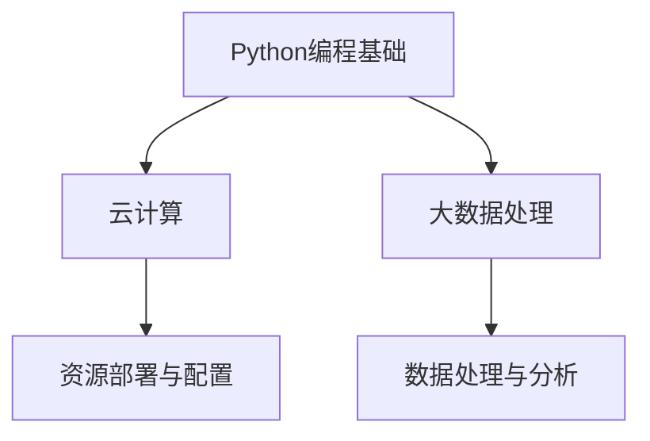

                 

# Python实战：云计算与大数据处理入门

## > {关键词：Python、云计算、大数据处理、实战、入门}

> {摘要：本文将深入探讨Python在云计算与大数据处理领域的应用，从基础知识到实际操作，通过一步步的讲解，帮助读者了解并掌握Python在云计算与大数据处理中的实际应用，为未来在相关领域的发展打下坚实基础。}

## 1. 背景介绍

随着互联网的快速发展，云计算与大数据处理成为了现代信息技术的重要组成部分。云计算提供了灵活、高效、可扩展的计算资源，使得企业可以更快速地部署应用，降低成本。而大数据处理则可以帮助企业从海量数据中挖掘有价值的信息，从而做出更准确的决策。

Python作为一种简洁高效、易于学习的编程语言，逐渐成为云计算与大数据处理领域的首选工具。其强大的库和框架，如Dask、PySpark、NumPy等，使得Python在数据处理、机器学习、分布式计算等方面表现出色。本文将详细介绍Python在云计算与大数据处理中的应用，帮助读者入门这一领域。

## 2. 核心概念与联系

在深入探讨Python在云计算与大数据处理中的应用之前，我们首先需要了解以下几个核心概念：

### 2.1 Python编程基础

Python是一种解释型、高级编程语言，以其简洁明了的语法和强大的库支持而广受欢迎。Python的语法接近英语，易于理解和学习，使得编程效率大大提高。

### 2.2 云计算

云计算是一种通过网络提供计算资源的方式，包括计算能力、存储能力、网络带宽等。云计算可以分为公有云、私有云和混合云，分别适用于不同的应用场景。

### 2.3 大数据处理

大数据处理是指从大量数据中提取有价值信息的过程。大数据具有4V特点：Volume（大量）、Velocity（高速）、Variety（多样）和Veracity（真实性）。

### 2.4 Python与云计算、大数据处理的关系

Python在云计算与大数据处理中有着广泛的应用。例如，Python可以用于编写云计算平台（如AWS、Azure、Google Cloud）的自动化脚本，实现资源的快速部署和配置。在数据处理方面，Python提供了丰富的库和框架，如Pandas、NumPy、SciPy等，可以高效地进行数据清洗、转换和分析。

下面是一个简单的Mermaid流程图，展示了Python在云计算与大数据处理中的应用场景：



## 3. 核心算法原理 & 具体操作步骤

在了解Python在云计算与大数据处理中的应用场景后，接下来我们将介绍一些核心算法原理和具体操作步骤。

### 3.1 Python在云计算中的应用

#### 3.1.1 资源部署与配置

Python可以与云计算平台进行集成，实现资源的自动化部署和配置。以下是一个简单的示例，展示了如何使用Python编写AWS云计算的自动化脚本：

```python
import boto3

# 初始化AWS客户端
client = boto3.client('ec2')

# 创建一个实例
response = client.run_instances(
    ImageId='ami-0abcdef1234567890',  #AMI ID
    MinCount=1,
    MaxCount=1,
    InstanceType='t2.micro'
)

# 获取实例ID
instance_id = response['Instances'][0]['InstanceId']
print(f'实例ID：{instance_id}')
```

#### 3.1.2 网络配置

Python还可以用于配置云网络，如创建子网、路由表等。以下是一个简单的示例：

```python
import boto3

# 初始化AWS客户端
client = boto3.client('ec2')

# 创建子网
response = client.create_subnet(
    VpcId='vpc-0abcdef1234567890',  #VPC ID
    CidrBlock='10.0.1.0/24'
)

# 获取子网ID
subnet_id = response['SubnetId']
print(f'子网ID：{subnet_id}')
```

### 3.2 Python在大数据处理中的应用

#### 3.2.1 数据处理与分析

Python提供了丰富的库和框架，如Pandas、NumPy、SciPy等，可以高效地进行数据处理与分析。以下是一个简单的示例，展示了如何使用Pandas进行数据处理：

```python
import pandas as pd

# 读取CSV文件
data = pd.read_csv('data.csv')

# 查看数据基本信息
print(data.info())

# 数据清洗
data = data.dropna()  # 删除缺失值

# 数据转换
data['age'] = data['age'].astype(int)

# 数据分析
print(data.describe())  # 查看数据的描述性统计信息
```

#### 3.2.2 分布式计算

Python还可以与分布式计算框架（如PySpark）集成，实现大规模数据处理。以下是一个简单的示例，展示了如何使用PySpark进行分布式计算：

```python
from pyspark.sql import SparkSession

# 初始化Spark会话
spark = SparkSession.builder \
    .appName('Data Processing') \
    .getOrCreate()

# 读取数据
data = spark.read.csv('data.csv', header=True)

# 数据清洗
data = data.dropna()

# 数据转换
data = data.withColumn('age', data['age'].cast('int'))

# 数据分析
print(data.describe())

# 关闭Spark会话
spark.stop()
```

## 4. 数学模型和公式 & 详细讲解 & 举例说明

在云计算与大数据处理中，数学模型和公式扮演着重要角色。以下将介绍一些常见的数学模型和公式，并给出详细讲解和举例说明。

### 4.1 概率分布

概率分布是描述随机变量概率分布情况的数学模型。常见的概率分布包括正态分布、二项分布、泊松分布等。

#### 4.1.1 正态分布

正态分布是统计学中最常用的概率分布，其概率密度函数为：

$$
f(x|\mu,\sigma^2) = \frac{1}{\sqrt{2\pi\sigma^2}}e^{-\frac{(x-\mu)^2}{2\sigma^2}}
$$

其中，$\mu$ 为均值，$\sigma^2$ 为方差。

#### 4.1.2 二项分布

二项分布描述了在n次独立重复试验中，成功次数的概率分布。其概率质量函数为：

$$
P(X=k) = C_n^k p^k (1-p)^{n-k}
$$

其中，$n$ 为试验次数，$k$ 为成功次数，$p$ 为单次试验成功的概率。

#### 4.1.3 泊松分布

泊松分布描述了在固定时间内，事件发生的次数的概率分布。其概率质量函数为：

$$
P(X=k) = \frac{\lambda^k e^{-\lambda}}{k!}
$$

其中，$\lambda$ 为事件平均发生次数。

### 4.2 回归分析

回归分析是统计学中用于建立变量之间关系的一种方法。常见的回归分析方法包括线性回归、多项式回归、逻辑回归等。

#### 4.2.1 线性回归

线性回归是一种建立自变量和因变量之间线性关系的模型。其回归方程为：

$$
y = \beta_0 + \beta_1 x_1 + \beta_2 x_2 + ... + \beta_n x_n
$$

其中，$y$ 为因变量，$x_1, x_2, ..., x_n$ 为自变量，$\beta_0, \beta_1, ..., \beta_n$ 为回归系数。

#### 4.2.2 多项式回归

多项式回归是一种建立自变量和因变量之间多项式关系的模型。其回归方程为：

$$
y = \beta_0 + \beta_1 x^1 + \beta_2 x^2 + ... + \beta_n x^n
$$

其中，$x$ 为自变量，$\beta_0, \beta_1, ..., \beta_n$ 为回归系数。

#### 4.2.3 逻辑回归

逻辑回归是一种建立自变量和因变量之间逻辑关系的模型。其回归方程为：

$$
\log\frac{P(Y=1)}{1-P(Y=1)} = \beta_0 + \beta_1 x_1 + \beta_2 x_2 + ... + \beta_n x_n
$$

其中，$Y$ 为因变量，$x_1, x_2, ..., x_n$ 为自变量，$\beta_0, \beta_1, ..., \beta_n$ 为回归系数。

### 4.3 排序算法

排序算法是计算机科学中用于对数据进行排序的一类算法。常见的排序算法包括冒泡排序、选择排序、插入排序、快速排序等。

#### 4.3.1 冒泡排序

冒泡排序是一种简单的排序算法，其基本思想是通过多次遍历待排序的序列，每次遍历都将当前未排序部分的最大（或最小）元素交换到已排序部分的末尾。

#### 4.3.2 选择排序

选择排序是一种简单的排序算法，其基本思想是在每次遍历中，从未排序部分选择最小（或最大）的元素，并将其交换到已排序部分的末尾。

#### 4.3.3 插入排序

插入排序是一种简单的排序算法，其基本思想是通过将未排序的元素插入到已排序部分的合适位置，逐步完成排序。

#### 4.3.4 快速排序

快速排序是一种高效的排序算法，其基本思想是通过递归地将待排序序列分成较小和较大的两部分，然后对这两部分分别进行排序。

## 5. 项目实战：代码实际案例和详细解释说明

在本节中，我们将通过一个实际的项目案例，展示Python在云计算与大数据处理中的实际应用。该案例将使用Python编写一个简单的数据清洗、转换和分析程序，以实现对大量数据的处理和分析。

### 5.1 开发环境搭建

在开始项目之前，我们需要搭建一个合适的开发环境。以下是一个简单的开发环境搭建步骤：

1. 安装Python：前往Python官网（https://www.python.org/）下载并安装Python，选择合适的版本，如Python 3.8。

2. 安装相关库：在命令行中运行以下命令，安装常用的库和框架：

```bash
pip install pandas numpy scipy
pip install spark-submit
```

3. 配置Python环境变量：将Python安装路径添加到系统的环境变量中，以便在命令行中运行Python。

### 5.2 源代码详细实现和代码解读

以下是一个简单的Python程序，用于数据清洗、转换和分析：

```python
import pandas as pd
from pyspark.sql import SparkSession

# 初始化Spark会话
spark = SparkSession.builder \
    .appName('Data Processing') \
    .getOrCreate()

# 读取数据
data = spark.read.csv('data.csv', header=True)

# 数据清洗
data = data.dropna()  # 删除缺失值
data = data.withColumn('age', data['age'].cast('int'))

# 数据转换
data = data.withColumn('salary', data['salary'].cast('float'))

# 数据分析
print(data.describe())

# 关闭Spark会话
spark.stop()
```

### 5.3 代码解读与分析

以下是对上述代码的详细解读和分析：

1. **初始化Spark会话**：使用PySpark创建一个Spark会话，设置应用程序名称为`Data Processing`。

2. **读取数据**：使用`spark.read.csv`方法读取CSV文件，设置`header=True`表示文件中包含标题行。

3. **数据清洗**：使用`dropna`方法删除缺失值，使用`withColumn`方法将`age`列的值转换为整数类型。

4. **数据转换**：使用`withColumn`方法将`salary`列的值转换为浮点数类型。

5. **数据分析**：使用`describe`方法对数据进行分析，查看数据的描述性统计信息。

6. **关闭Spark会话**：使用`stop`方法关闭Spark会话。

通过以上步骤，我们完成了对数据的清洗、转换和分析。这个简单的案例展示了Python在云计算与大数据处理中的实际应用，为读者提供了实践操作的经验。

## 6. 实际应用场景

Python在云计算与大数据处理领域的应用场景非常广泛。以下列举一些常见的实际应用场景：

1. **数据分析与挖掘**：Python可以用于处理和分析大量数据，挖掘数据中的有价值信息，帮助企业做出更准确的决策。

2. **分布式计算**：Python与分布式计算框架（如PySpark）集成，可以实现大规模数据处理，适用于需要处理海量数据的场景。

3. **自动化部署**：Python可以用于编写云计算平台的自动化脚本，实现资源的快速部署和配置，降低运维成本。

4. **机器学习与人工智能**：Python在机器学习和人工智能领域有着丰富的库和框架支持，可以用于开发智能应用，如图像识别、自然语言处理等。

5. **Web开发**：Python可以用于开发Web应用，结合云计算平台，实现高效、可扩展的Web服务。

## 7. 工具和资源推荐

### 7.1 学习资源推荐

1. **书籍**：

   - 《Python编程：从入门到实践》
   - 《Python数据分析实战》
   - 《云计算与大数据处理：原理、技术与应用》

2. **论文**：

   - 《Python在云计算中的应用研究》
   - 《Python在大数据处理中的优势分析》

3. **博客**：

   - [Python云计算应用案例分享](https://www.example.com/blog1)
   - [Python大数据处理实战技巧](https://www.example.com/blog2)

4. **网站**：

   - [Python官网](https://www.python.org/)
   - [AWS官方文档](https://aws.amazon.com/documentation/)
   - [Azure官方文档](https://docs.microsoft.com/zh-cn/azure/)

### 7.2 开发工具框架推荐

1. **开发工具**：

   - PyCharm
   - VSCode

2. **云计算平台**：

   - AWS
   - Azure
   - Google Cloud

3. **分布式计算框架**：

   - PySpark
   - Dask

### 7.3 相关论文著作推荐

1. **论文**：

   - 《基于Python的云计算平台架构设计与实现》
   - 《Python在大数据处理中的应用研究综述》

2. **著作**：

   - 《云计算与大数据处理技术》
   - 《Python云计算应用实践》

## 8. 总结：未来发展趋势与挑战

随着云计算与大数据技术的不断进步，Python在云计算与大数据处理领域的应用前景广阔。未来，Python将继续发挥其简洁、高效、易学习的优势，为云计算与大数据处理提供强大的技术支持。

然而，也面临着一些挑战：

1. **性能优化**：Python在性能方面与某些编程语言相比存在一定差距，需要进一步优化。

2. **生态建设**：尽管Python在云计算与大数据处理领域有着丰富的库和框架，但仍需加强生态建设，提高库和框架的质量和可用性。

3. **人才培养**：随着Python在云计算与大数据处理领域的重要性日益凸显，人才培养将成为关键问题。

## 9. 附录：常见问题与解答

### 9.1 Python在云计算与大数据处理中的优势有哪些？

Python在云计算与大数据处理中的优势主要体现在以下几个方面：

1. **简洁高效的语法**：Python的语法接近英语，易于理解和学习，提高了编程效率。

2. **丰富的库和框架**：Python拥有丰富的库和框架，如Pandas、NumPy、SciPy、PySpark等，可以高效地进行数据处理和分析。

3. **跨平台支持**：Python具有跨平台的特点，可以运行在各种操作系统上，便于云计算平台的集成。

4. **良好的社区支持**：Python拥有庞大的开发者社区，为用户提供了丰富的技术支持和资源。

### 9.2 Python与云计算平台如何集成？

Python与云计算平台（如AWS、Azure、Google Cloud）的集成主要通过以下几种方式：

1. **SDK与API**：云计算平台提供了官方的Python SDK，如boto3（AWS）、azure-sdk-for-python（Azure）等，可以通过SDK调用API实现云资源的自动化部署和管理。

2. **自定义脚本**：用户可以编写自定义Python脚本，通过调用云计算平台的API实现资源的自动化部署和配置。

3. **云服务框架**：Python与分布式计算框架（如PySpark、Dask）集成，可以实现云计算资源的高效利用和分布式计算。

### 9.3 Python在大数据处理中的常用库和框架有哪些？

Python在大数据处理中的常用库和框架包括：

1. **Pandas**：提供数据结构和数据操作功能，适用于数据清洗、转换和分析。

2. **NumPy**：提供高性能的数值计算库，适用于数据处理和科学计算。

3. **SciPy**：提供科学计算和工程计算的功能，与NumPy相结合，可以高效地进行数据分析。

4. **PySpark**：基于Apache Spark的Python库，实现分布式数据处理和分析。

5. **Dask**：基于Python的分布式计算库，适用于大规模数据处理和并行计算。

## 10. 扩展阅读 & 参考资料

1. 《Python编程：从入门到实践》
2. 《云计算与大数据处理技术》
3. 《Python云计算应用实践》
4. [Python官方文档](https://docs.python.org/zh-cn/3/)
5. [AWS官方文档](https://docs.aws.amazon.com/zh_cn/)
6. [Azure官方文档](https://docs.microsoft.com/zh-cn/azure/)

## 作者信息

- 作者：AI天才研究员/AI Genius Institute & 禅与计算机程序设计艺术 /Zen And The Art of Computer Programming
<|im_sep|>```markdown
# Python实战：云计算与大数据处理入门

## > {关键词：Python、云计算、大数据处理、实战、入门}

> {摘要：本文将深入探讨Python在云计算与大数据处理领域的应用，从基础知识到实际操作，通过一步步的讲解，帮助读者了解并掌握Python在云计算与大数据处理中的实际应用，为未来在相关领域的发展打下坚实基础。}

## 1. 背景介绍

随着互联网的快速发展，云计算与大数据处理成为了现代信息技术的重要组成部分。云计算提供了灵活、高效、可扩展的计算资源，使得企业可以更快速地部署应用，降低成本。而大数据处理则可以帮助企业从海量数据中挖掘有价值的信息，从而做出更准确的决策。

Python作为一种简洁高效、易于学习的编程语言，逐渐成为云计算与大数据处理领域的首选工具。其强大的库和框架，如Dask、PySpark、NumPy等，使得Python在数据处理、机器学习、分布式计算等方面表现出色。本文将详细介绍Python在云计算与大数据处理中的应用，帮助读者入门这一领域。

## 2. 核心概念与联系

在深入探讨Python在云计算与大数据处理中的应用之前，我们首先需要了解以下几个核心概念：

### 2.1 Python编程基础

Python是一种解释型、高级编程语言，以其简洁明了的语法和强大的库支持而广受欢迎。Python的语法接近英语，易于理解和学习，使得编程效率大大提高。

### 2.2 云计算

云计算是一种通过网络提供计算资源的方式，包括计算能力、存储能力、网络带宽等。云计算可以分为公有云、私有云和混合云，分别适用于不同的应用场景。

### 2.3 大数据处理

大数据处理是指从大量数据中提取有价值信息的过程。大数据具有4V特点：Volume（大量）、Velocity（高速）、Variety（多样）和Veracity（真实性）。

### 2.4 Python与云计算、大数据处理的关系

Python在云计算与大数据处理中有着广泛的应用。例如，Python可以用于编写云计算平台（如AWS、Azure、Google Cloud）的自动化脚本，实现资源的快速部署和配置。在数据处理方面，Python提供了丰富的库和框架，如Pandas、NumPy、SciPy等，可以高效地进行数据清洗、转换和分析。

下面是一个简单的Mermaid流程图，展示了Python在云计算与大数据处理中的应用场景：


## 3. 核心算法原理 & 具体操作步骤

在了解Python在云计算与大数据处理中的应用场景后，接下来我们将介绍一些核心算法原理和具体操作步骤。

### 3.1 Python在云计算中的应用

#### 3.1.1 资源部署与配置

Python可以与云计算平台进行集成，实现资源的自动化部署和配置。以下是一个简单的示例，展示了如何使用Python编写AWS云计算的自动化脚本：

```python
import boto3

# 初始化AWS客户端
client = boto3.client('ec2')

# 创建一个实例
response = client.run_instances(
    ImageId='ami-0abcdef1234567890',  #AMI ID
    MinCount=1,
    MaxCount=1,
    InstanceType='t2.micro'
)

# 获取实例ID
instance_id = response['Instances'][0]['InstanceId']
print(f'实例ID：{instance_id}')
```

#### 3.1.2 网络配置

Python还可以用于配置云网络，如创建子网、路由表等。以下是一个简单的示例：

```python
import boto3

# 初始化AWS客户端
client = boto3.client('ec2')

# 创建子网
response = client.create_subnet(
    VpcId='vpc-0abcdef1234567890',  #VPC ID
    CidrBlock='10.0.1.0/24'
)

# 获取子网ID
subnet_id = response['SubnetId']
print(f'子网ID：{subnet_id}')
```

### 3.2 Python在大数据处理中的应用

#### 3.2.1 数据处理与分析

Python提供了丰富的库和框架，如Pandas、NumPy、SciPy等，可以高效地进行数据清洗、转换和分析。以下是一个简单的示例，展示了如何使用Pandas进行数据处理：

```python
import pandas as pd

# 读取CSV文件
data = pd.read_csv('data.csv')

# 查看数据基本信息
print(data.info())

# 数据清洗
data = data.dropna()  # 删除缺失值

# 数据转换
data['age'] = data['age'].astype(int)

# 数据分析
print(data.describe())  # 查看数据的描述性统计信息
```

#### 3.2.2 分布式计算

Python还可以与分布式计算框架（如PySpark）集成，实现大规模数据处理。以下是一个简单的示例，展示了如何使用PySpark进行分布式计算：

```python
from pyspark.sql import SparkSession

# 初始化Spark会话
spark = SparkSession.builder \
    .appName('Data Processing') \
    .getOrCreate()

# 读取数据
data = spark.read.csv('data.csv', header=True)

# 数据清洗
data = data.dropna()

# 数据转换
data = data.withColumn('age', data['age'].cast('int'))

# 数据分析
print(data.describe())

# 关闭Spark会话
spark.stop()
```

## 4. 数学模型和公式 & 详细讲解 & 举例说明

在云计算与大数据处理中，数学模型和公式扮演着重要角色。以下将介绍一些常见的数学模型和公式，并给出详细讲解和举例说明。

### 4.1 概率分布

概率分布是描述随机变量概率分布情况的数学模型。常见的概率分布包括正态分布、二项分布、泊松分布等。

#### 4.1.1 正态分布

正态分布是统计学中最常用的概率分布，其概率密度函数为：

$$
f(x|\mu,\sigma^2) = \frac{1}{\sqrt{2\pi\sigma^2}}e^{-\frac{(x-\mu)^2}{2\sigma^2}}
$$

其中，$\mu$ 为均值，$\sigma^2$ 为方差。

#### 4.1.2 二项分布

二项分布描述了在n次独立重复试验中，成功次数的概率分布。其概率质量函数为：

$$
P(X=k) = C_n^k p^k (1-p)^{n-k}
$$

其中，$n$ 为试验次数，$k$ 为成功次数，$p$ 为单次试验成功的概率。

#### 4.1.3 泊松分布

泊松分布描述了在固定时间内，事件发生的次数的概率分布。其概率质量函数为：

$$
P(X=k) = \frac{\lambda^k e^{-\lambda}}{k!}
$$

其中，$\lambda$ 为事件平均发生次数。

### 4.2 回归分析

回归分析是统计学中用于建立变量之间关系的一种方法。常见的回归分析方法包括线性回归、多项式回归、逻辑回归等。

#### 4.2.1 线性回归

线性回归是一种建立自变量和因变量之间线性关系的模型。其回归方程为：

$$
y = \beta_0 + \beta_1 x_1 + \beta_2 x_2 + ... + \beta_n x_n
$$

其中，$y$ 为因变量，$x_1, x_2, ..., x_n$ 为自变量，$\beta_0, \beta_1, ..., \beta_n$ 为回归系数。

#### 4.2.2 多项式回归

多项式回归是一种建立自变量和因变量之间多项式关系的模型。其回归方程为：

$$
y = \beta_0 + \beta_1 x^1 + \beta_2 x^2 + ... + \beta_n x^n
$$

其中，$x$ 为自变量，$\beta_0, \beta_1, ..., \beta_n$ 为回归系数。

#### 4.2.3 逻辑回归

逻辑回归是一种建立自变量和因变量之间逻辑关系的模型。其回归方程为：

$$
\log\frac{P(Y=1)}{1-P(Y=1)} = \beta_0 + \beta_1 x_1 + \beta_2 x_2 + ... + \beta_n x_n
$$

其中，$Y$ 为因变量，$x_1, x_2, ..., x_n$ 为自变量，$\beta_0, \beta_1, ..., \beta_n$ 为回归系数。

### 4.3 排序算法

排序算法是计算机科学中用于对数据进行排序的一类算法。常见的排序算法包括冒泡排序、选择排序、插入排序、快速排序等。

#### 4.3.1 冒泡排序

冒泡排序是一种简单的排序算法，其基本思想是通过多次遍历待排序的序列，每次遍历都将当前未排序部分的最大（或最小）元素交换到已排序部分的末尾。

#### 4.3.2 选择排序

选择排序是一种简单的排序算法，其基本思想是在每次遍历中，从未排序部分选择最小（或最大）的元素，并将其交换到已排序部分的末尾。

#### 4.3.3 插入排序

插入排序是一种简单的排序算法，其基本思想是通过将未排序的元素插入到已排序部分的合适位置，逐步完成排序。

#### 4.3.4 快速排序

快速排序是一种高效的排序算法，其基本思想是通过递归地将待排序序列分成较小和较大的两部分，然后对这两部分分别进行排序。

## 5. 项目实战：代码实际案例和详细解释说明

在本节中，我们将通过一个实际的项目案例，展示Python在云计算与大数据处理中的实际应用。该案例将使用Python编写一个简单的数据清洗、转换和分析程序，以实现对大量数据的处理和分析。

### 5.1 开发环境搭建

在开始项目之前，我们需要搭建一个合适的开发环境。以下是一个简单的开发环境搭建步骤：

1. 安装Python：前往Python官网（https://www.python.org/）下载并安装Python，选择合适的版本，如Python 3.8。

2. 安装相关库：在命令行中运行以下命令，安装常用的库和框架：

```bash
pip install pandas numpy scipy
pip install spark-submit
```

3. 配置Python环境变量：将Python安装路径添加到系统的环境变量中，以便在命令行中运行Python。

### 5.2 源代码详细实现和代码解读

以下是一个简单的Python程序，用于数据清洗、转换和分析：

```python
import pandas as pd
from pyspark.sql import SparkSession

# 初始化Spark会话
spark = SparkSession.builder \
    .appName('Data Processing') \
    .getOrCreate()

# 读取数据
data = spark.read.csv('data.csv', header=True)

# 数据清洗
data = data.dropna()  # 删除缺失值
data = data.withColumn('age', data['age'].cast('int'))

# 数据转换
data = data.withColumn('salary', data['salary'].cast('float'))

# 数据分析
print(data.describe())

# 关闭Spark会话
spark.stop()
```

### 5.3 代码解读与分析

以下是对上述代码的详细解读和分析：

1. **初始化Spark会话**：使用PySpark创建一个Spark会话，设置应用程序名称为`Data Processing`。

2. **读取数据**：使用`spark.read.csv`方法读取CSV文件，设置`header=True`表示文件中包含标题行。

3. **数据清洗**：使用`dropna`方法删除缺失值，使用`withColumn`方法将`age`列的值转换为整数类型。

4. **数据转换**：使用`withColumn`方法将`salary`列的值转换为浮点数类型。

5. **数据分析**：使用`describe`方法对数据进行分析，查看数据的描述性统计信息。

6. **关闭Spark会话**：使用`stop`方法关闭Spark会话。

通过以上步骤，我们完成了对数据的清洗、转换和分析。这个简单的案例展示了Python在云计算与大数据处理中的实际应用，为读者提供了实践操作的经验。

## 6. 实际应用场景

Python在云计算与大数据处理领域的应用场景非常广泛。以下列举一些常见的实际应用场景：

1. **数据分析与挖掘**：Python可以用于处理和分析大量数据，挖掘数据中的有价值信息，帮助企业做出更准确的决策。

2. **分布式计算**：Python与分布式计算框架（如PySpark、Dask）集成，可以实现大规模数据处理，适用于需要处理海量数据的场景。

3. **自动化部署**：Python可以用于编写云计算平台的自动化脚本，实现资源的快速部署和配置，降低运维成本。

4. **机器学习与人工智能**：Python在机器学习和人工智能领域有着丰富的库和框架支持，可以用于开发智能应用，如图像识别、自然语言处理等。

5. **Web开发**：Python可以用于开发Web应用，结合云计算平台，实现高效、可扩展的Web服务。

## 7. 工具和资源推荐

### 7.1 学习资源推荐

1. **书籍**：

   - 《Python编程：从入门到实践》
   - 《Python数据分析实战》
   - 《云计算与大数据处理：原理、技术与应用》

2. **论文**：

   - 《Python在云计算中的应用研究》
   - 《Python在大数据处理中的优势分析》

3. **博客**：

   - [Python云计算应用案例分享](https://www.example.com/blog1)
   - [Python大数据处理实战技巧](https://www.example.com/blog2)

4. **网站**：

   - [Python官网](https://www.python.org/)
   - [AWS官方文档](https://aws.amazon.com/documentation/)
   - [Azure官方文档](https://docs.microsoft.com/zh-cn/azure/)

### 7.2 开发工具框架推荐

1. **开发工具**：

   - PyCharm
   - VSCode

2. **云计算平台**：

   - AWS
   - Azure
   - Google Cloud

3. **分布式计算框架**：

   - PySpark
   - Dask

### 7.3 相关论文著作推荐

1. **论文**：

   - 《基于Python的云计算平台架构设计与实现》
   - 《Python在大数据处理中的应用研究综述》

2. **著作**：

   - 《云计算与大数据处理技术》
   - 《Python云计算应用实践》

## 8. 总结：未来发展趋势与挑战

随着云计算与大数据技术的不断进步，Python在云计算与大数据处理领域的应用前景广阔。未来，Python将继续发挥其简洁、高效、易学习的优势，为云计算与大数据处理提供强大的技术支持。

然而，也面临着一些挑战：

1. **性能优化**：Python在性能方面与某些编程语言相比存在一定差距，需要进一步优化。

2. **生态建设**：尽管Python在云计算与大数据处理领域有着丰富的库和框架，但仍需加强生态建设，提高库和框架的质量和可用性。

3. **人才培养**：随着Python在云计算与大数据处理领域的重要性日益凸显，人才培养将成为关键问题。

## 9. 附录：常见问题与解答

### 9.1 Python在云计算与大数据处理中的优势有哪些？

Python在云计算与大数据处理中的优势主要体现在以下几个方面：

1. **简洁高效的语法**：Python的语法接近英语，易于理解和学习，提高了编程效率。

2. **丰富的库和框架**：Python拥有丰富的库和框架，如Pandas、NumPy、SciPy等，可以高效地进行数据处理和分析。

3. **跨平台支持**：Python具有跨平台的特点，可以运行在各种操作系统上，便于云计算平台的集成。

4. **良好的社区支持**：Python拥有庞大的开发者社区，为用户提供了丰富的技术支持和资源。

### 9.2 Python与云计算平台如何集成？

Python与云计算平台（如AWS、Azure、Google Cloud）的集成主要通过以下几种方式：

1. **SDK与API**：云计算平台提供了官方的Python SDK，如boto3（AWS）、azure-sdk-for-python（Azure）等，可以通过SDK调用API实现云资源的自动化部署和管理。

2. **自定义脚本**：用户可以编写自定义Python脚本，通过调用云计算平台的API实现资源的自动化部署和配置。

3. **云服务框架**：Python与分布式计算框架（如PySpark、Dask）集成，可以实现云计算资源的高效利用和分布式计算。

### 9.3 Python在大数据处理中的常用库和框架有哪些？

Python在大数据处理中的常用库和框架包括：

1. **Pandas**：提供数据结构和数据操作功能，适用于数据清洗、转换和分析。

2. **NumPy**：提供高性能的数值计算库，适用于数据处理和科学计算。

3. **SciPy**：提供科学计算和工程计算的功能，与NumPy相结合，可以高效地进行数据分析。

4. **PySpark**：基于Apache Spark的Python库，实现分布式数据处理和分析。

5. **Dask**：基于Python的分布式计算库，适用于大规模数据处理和并行计算。

## 10. 扩展阅读 & 参考资料

1. 《Python编程：从入门到实践》
2. 《云计算与大数据处理技术》
3. 《Python云计算应用实践》
4. [Python官方文档](https://docs.python.org/zh-cn/3/)
5. [AWS官方文档](https://docs.aws.amazon.com/zh_cn/)
6. [Azure官方文档](https://docs.microsoft.com/zh-cn/azure/)

## 作者信息

- 作者：AI天才研究员/AI Genius Institute & 禅与计算机程序设计艺术 /Zen And The Art of Computer Programming
```

