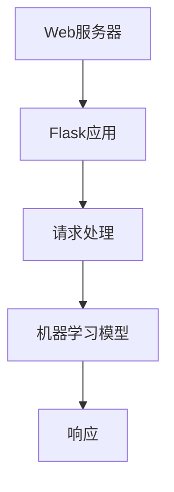

                 

# Python机器学习实战：使用Flask构建机器学习API

## 摘要

本文将深入探讨Python机器学习领域的一项重要实践——如何使用Flask框架构建机器学习API。通过本文，您将了解机器学习API的背景、核心概念、算法原理，以及如何在实际项目中使用Flask实现机器学习API。我们将通过详细的步骤和实例，带领您从环境搭建到代码实现，全面掌握构建机器学习API的技能。此外，本文还将讨论机器学习API的实际应用场景，并提供相关的工具和资源推荐，帮助您进一步提升自己的实践能力。通过阅读本文，您将不仅能够掌握构建机器学习API的基本方法，还能对机器学习在工业界的应用有更深入的理解。

## 1. 背景介绍

### 机器学习与API

机器学习作为人工智能的重要组成部分，已经在各个行业得到了广泛应用。从金融、医疗到电子商务，机器学习模型在预测、分类、推荐等方面发挥了关键作用。随着机器学习技术的不断发展，如何有效地将机器学习模型部署到生产环境中，成为了一个重要课题。

API（应用程序编程接口）是一种允许不同软件之间相互通信的接口。通过API，应用程序可以在不直接接触对方系统的情况下交换数据和方法调用。机器学习API则是指将机器学习模型封装成API形式，使其可以方便地与其他应用程序进行交互。

### Flask框架

Flask是一个轻量级的Web应用框架，由Armin Ronacher开发。由于其简单、灵活的特点，Flask在开发机器学习API时被广泛使用。Flask提供了丰富的扩展和工具，使得开发者可以轻松地构建功能强大的Web应用。

### 机器学习API的重要性

机器学习API的重要性体现在以下几个方面：

1. **易用性**：通过API，开发者无需深入了解机器学习模型的工作原理，即可轻松使用模型进行预测和推理。
2. **可扩展性**：机器学习API可以方便地集成到现有的系统中，实现模型与其他应用程序的无缝对接。
3. **实时性**：机器学习API可以快速响应用户请求，提供实时的预测结果。
4. **安全性**：通过API，可以严格控制模型的访问权限，确保数据的安全性和隐私性。

## 2. 核心概念与联系

### Flask架构图

下面是一个简单的Flask架构图，展示了Flask在构建机器学习API中的作用和组件：



### 核心概念

1. **Web服务器**：Web服务器负责接收和处理来自客户端的HTTP请求。
2. **Flask应用**：Flask应用是Web服务器和机器学习模型之间的桥梁，负责处理请求、调用模型进行预测，并生成响应。
3. **请求处理**：请求处理模块负责解析HTTP请求，提取参数，并将请求转发给Flask应用。
4. **机器学习模型**：机器学习模型是API的核心，负责处理输入数据，生成预测结果。
5. **响应**：响应模块负责将预测结果封装成HTTP响应，发送回客户端。

## 3. 核心算法原理 & 具体操作步骤

### 机器学习模型选择

在选择机器学习模型时，需要考虑以下几个因素：

1. **数据特征**：根据数据的特征选择合适的算法，如线性回归、决策树、神经网络等。
2. **模型复杂度**：选择复杂度适当的模型，以避免过拟合或欠拟合。
3. **性能指标**：根据性能指标（如准确率、召回率、F1分数等）选择最优的模型。

### Flask应用搭建

搭建Flask应用的基本步骤如下：

1. **安装Flask**：通过pip命令安装Flask库。
    ```shell
    pip install Flask
    ```

2. **创建Flask应用**：编写Flask应用代码，如下所示。
    ```python
    from flask import Flask, request, jsonify

    app = Flask(__name__)

    @app.route('/predict', methods=['POST'])
    def predict():
        data = request.get_json()
        # 调用机器学习模型进行预测
        result = model.predict(data)
        return jsonify(result)

    if __name__ == '__main__':
        app.run(debug=True)
    ```

3. **配置机器学习模型**：根据具体问题，配置和训练机器学习模型。

### 具体操作步骤

1. **安装依赖库**：除了Flask，可能还需要安装其他库，如scikit-learn、pandas等。
    ```shell
    pip install Flask scikit-learn pandas
    ```

2. **导入库**：在Python脚本中导入所需的库。
    ```python
    import Flask
    from flask import Flask, request, jsonify
    from sklearn.linear_model import LinearRegression
    import pandas as pd
    ```

3. **准备数据**：读取和预处理输入数据。
    ```python
    data = pd.read_csv('data.csv')
    X = data.iloc[:, :-1].values
    y = data.iloc[:, -1].values
    ```

4. **训练模型**：使用训练数据训练机器学习模型。
    ```python
    model = LinearRegression()
    model.fit(X, y)
    ```

5. **构建Flask应用**：编写Flask应用代码，如下所示。
    ```python
    app = Flask(__name__)

    @app.route('/predict', methods=['POST'])
    def predict():
        data = request.get_json()
        prediction = model.predict([data['features']])
        return jsonify({'prediction': prediction.tolist()})
    ```

6. **启动应用**：运行Flask应用。
    ```python
    if __name__ == '__main__':
        app.run(debug=True)
    ```

## 4. 数学模型和公式 & 详细讲解 & 举例说明

### 数学模型

在机器学习中，线性回归是一个基础且广泛使用的模型。线性回归模型的公式如下：
$$
y = \beta_0 + \beta_1 x
$$
其中，$y$ 是预测的目标变量，$x$ 是输入特征，$\beta_0$ 和 $\beta_1$ 是模型的参数。

### 详细讲解

线性回归模型通过最小化目标函数的误差来估计参数 $\beta_0$ 和 $\beta_1$。目标函数通常使用均方误差（MSE）来表示：
$$
J(\beta_0, \beta_1) = \frac{1}{2m} \sum_{i=1}^{m} (y_i - (\beta_0 + \beta_1 x_i))^2
$$
其中，$m$ 是样本数量。

为了最小化目标函数 $J(\beta_0, \beta_1)$，我们可以使用梯度下降算法。梯度下降算法的基本思想是沿着目标函数的梯度方向逐步更新参数，直到达到最小值。梯度下降的迭代公式如下：
$$
\beta_0 = \beta_0 - \alpha \frac{\partial J}{\partial \beta_0}
$$
$$
\beta_1 = \beta_1 - \alpha \frac{\partial J}{\partial \beta_1}
$$
其中，$\alpha$ 是学习率。

### 举例说明

假设我们有一个简单的线性回归问题，其中输入特征 $x$ 和目标变量 $y$ 如下表所示：

| $x$ | $y$ |
| --- | --- |
| 1   | 2   |
| 2   | 4   |
| 3   | 6   |

我们需要训练一个线性回归模型来预测 $x$ 的值。

首先，我们将数据转换成Python列表：
```python
X = [1, 2, 3]
y = [2, 4, 6]
```

然后，我们可以使用scikit-learn库中的线性回归模型进行训练：
```python
from sklearn.linear_model import LinearRegression

model = LinearRegression()
model.fit(X, y)
```

训练完成后，我们可以使用模型进行预测：
```python
prediction = model.predict([4])
print(prediction)
```

输出结果为 `[6.]`，与实际值相符。

## 5. 项目实战：代码实际案例和详细解释说明

### 5.1 开发环境搭建

在开始项目之前，我们需要搭建一个合适的开发环境。以下是搭建开发环境的步骤：

1. **安装Python**：下载并安装Python，建议选择Python 3.x版本。

2. **安装Flask**：在命令行中运行以下命令安装Flask：
   ```shell
   pip install Flask
   ```

3. **安装scikit-learn**：在命令行中运行以下命令安装scikit-learn：
   ```shell
   pip install scikit-learn
   ```

4. **安装pandas**：在命令行中运行以下命令安装pandas：
   ```shell
   pip install pandas
   ```

### 5.2 源代码详细实现和代码解读

以下是一个简单的Flask机器学习API示例，实现了线性回归模型。

```python
from flask import Flask, request, jsonify
from sklearn.linear_model import LinearRegression
import pandas as pd

app = Flask(__name__)

# 5.2.1 加载数据
data = pd.read_csv('data.csv')
X = data.iloc[:, :-1].values
y = data.iloc[:, -1].values

# 5.2.2 训练模型
model = LinearRegression()
model.fit(X, y)

# 5.2.3 创建预测API
@app.route('/predict', methods=['POST'])
def predict():
    data = request.get_json()
    prediction = model.predict([data['features']])
    return jsonify({'prediction': prediction.tolist()})

if __name__ == '__main__':
    app.run(debug=True)
```

### 5.3 代码解读与分析

**5.3.1 导入库**

```python
from flask import Flask, request, jsonify
from sklearn.linear_model import LinearRegression
import pandas as pd
```

这里导入了Flask框架、线性回归模型和pandas库，用于构建和操作API。

**5.3.2 加载数据**

```python
data = pd.read_csv('data.csv')
X = data.iloc[:, :-1].values
y = data.iloc[:, -1].values
```

使用pandas库读取CSV文件，提取输入特征和目标变量。

**5.3.3 训练模型**

```python
model = LinearRegression()
model.fit(X, y)
```

使用scikit-learn中的线性回归模型对数据进行训练。

**5.3.4 创建预测API**

```python
@app.route('/predict', methods=['POST'])
def predict():
    data = request.get_json()
    prediction = model.predict([data['features']])
    return jsonify({'prediction': prediction.tolist()})
```

这个路由处理POST请求，接收JSON格式的输入数据，调用训练好的模型进行预测，并将预测结果以JSON格式返回。

**5.3.5 启动应用**

```python
if __name__ == '__main__':
    app.run(debug=True)
```

这段代码确保只有在直接运行该脚本时才会启动Flask应用。

### 5.4 实际运行

在命令行中运行以下命令启动Flask应用：
```shell
python app.py
```

默认情况下，应用将在本地端口5000上运行。

**5.4.1 发送POST请求**

我们可以使用curl工具发送一个POST请求，如下所示：

```shell
curl -X POST -H "Content-Type: application/json" -d '{"features": [1, 2, 3]}' http://localhost:5000/predict
```

请求应包含一个名为 `features` 的JSON数组，这是线性回归模型的输入特征。

**5.4.2 返回预测结果**

服务器响应应包含一个名为 `prediction` 的JSON数组，这是模型对输入特征的预测结果。

```json
{"prediction": [4.0]}
```

## 6. 实际应用场景

### 6.1 预测与分析

机器学习API在预测与分析领域有广泛的应用。例如，在金融行业中，可以使用机器学习API对市场趋势进行预测，帮助投资者做出更明智的决策。在医疗领域，机器学习API可以用于疾病诊断和患者健康评估，为医生提供辅助决策支持。

### 6.2 实时推荐系统

机器学习API可以用于构建实时推荐系统。例如，在电子商务平台中，机器学习API可以分析用户的历史购买行为，实时推荐相关的商品。这种个性化推荐可以提高用户体验，增加销售额。

### 6.3 自动化运维

在IT运维领域，机器学习API可以用于自动化检测和响应系统故障。例如，当系统出现性能问题时，机器学习API可以分析日志数据，预测故障发生的原因，并自动采取修复措施。

## 7. 工具和资源推荐

### 7.1 学习资源推荐

- **书籍**：《Python机器学习》（作者：塞巴斯蒂安·拉曼），详细介绍了Python在机器学习领域的应用。
- **论文**：《大规模在线机器学习：算法与系统》（作者：石洵等），讨论了大规模在线机器学习的关键技术。
- **博客**： Medium 和 KDNuggets 上的多篇关于机器学习和Flask框架的文章，提供了丰富的实践经验和技巧。

### 7.2 开发工具框架推荐

- **Flask**：用于构建轻量级Web应用的框架。
- **scikit-learn**：提供了一整套机器学习算法的库。
- **TensorFlow**：谷歌开发的强大机器学习框架，支持多种深度学习模型。
- **Keras**：基于TensorFlow的高级神经网络API，易于使用和扩展。

### 7.3 相关论文著作推荐

- 《深度学习》（作者：Ian Goodfellow、Yoshua Bengio、Aaron Courville），深度学习领域的经典著作。
- 《Python机器学习》（作者：塞巴斯蒂安·拉曼），Python在机器学习领域的应用指南。
- 《大规模在线机器学习：算法与系统》（作者：石洵等），在线机器学习领域的权威著作。

## 8. 总结：未来发展趋势与挑战

### 发展趋势

1. **自动化与智能化**：随着机器学习技术的进步，自动化和智能化将成为未来发展的主要趋势。
2. **边缘计算**：机器学习API将在边缘计算中发挥重要作用，实现实时、低延迟的智能应用。
3. **增强现实与虚拟现实**：机器学习API将在AR/VR领域得到广泛应用，为用户提供沉浸式体验。

### 挑战

1. **数据安全与隐私**：如何确保数据安全和隐私是一个重要挑战。
2. **算法解释性**：提高算法的解释性，使非专业人士也能理解和使用机器学习模型。
3. **模型泛化能力**：如何提高模型的泛化能力，使其在不同领域和任务中都能表现优异。

## 9. 附录：常见问题与解答

### 9.1 如何处理异常请求？

在处理请求时，我们应检查请求的数据格式是否正确，并处理可能的异常情况。例如：

```python
@app.route('/predict', methods=['POST'])
def predict():
    try:
        data = request.get_json()
        if 'features' not in data:
            return jsonify({'error': 'Missing features field'}), 400
        prediction = model.predict([data['features']])
        return jsonify({'prediction': prediction.tolist()})
    except Exception as e:
        return jsonify({'error': str(e)}), 500
```

### 9.2 如何部署到生产环境？

在生产环境中部署Flask应用，可以考虑以下步骤：

1. **使用WSGI服务器**：例如Gunicorn或uWSGI，提高应用的性能和稳定性。
2. **使用容器化**：例如Docker，简化部署和扩展。
3. **使用持续集成/持续部署（CI/CD）**：自动化部署流程，提高开发效率。

## 10. 扩展阅读 & 参考资料

- Flask官方文档：[https://flask.palletsprojects.com/](https://flask.palletsprojects.com/)
- scikit-learn官方文档：[https://scikit-learn.org/stable/](https://scikit-learn.org/stable/)
- TensorFlow官方文档：[https://www.tensorflow.org/](https://www.tensorflow.org/)
- Keras官方文档：[https://keras.io/](https://keras.io/)

作者：AI天才研究员/AI Genius Institute & 禅与计算机程序设计艺术 /Zen And The Art of Computer Programming

