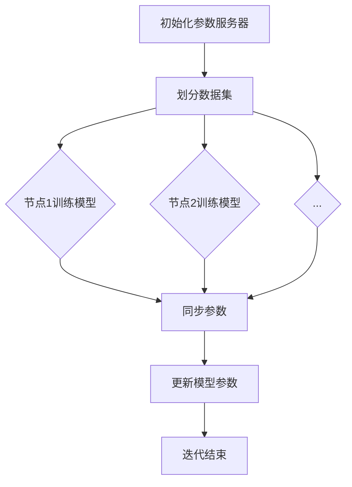

                 

### 背景介绍

在当今的数据驱动时代，深度学习已经成为解决复杂问题的利器。然而，随着模型规模的不断扩大和数据量的急剧增加，传统的单机训练方式逐渐暴露出其性能瓶颈。分布式训练技术应运而生，通过将模型和数据划分到多个计算节点上，实现了大规模模型的并行训练，从而大幅度提升了训练效率和计算能力。

本文旨在探讨Python深度学习实践中，分布式训练大型模型的策略。首先，我们将介绍分布式训练的基本概念和优势，并阐述其在实际应用中的重要性。随后，我们将深入探讨分布式训练的核心算法原理和具体操作步骤，通过数学模型和公式的详细讲解，帮助读者理解其内在逻辑。在此基础上，我们将通过一个实际项目案例，展示分布式训练的完整实现过程，并对代码进行详细解读和分析。

最后，我们将探讨分布式训练在不同实际应用场景中的运用，推荐相关学习资源和开发工具，总结当前技术发展趋势与挑战，并提供常见问题与解答，为读者提供全方位的技术指导。通过本文的阅读，读者将能够掌握分布式训练的核心技术和实践方法，为实际项目中的大型模型训练提供有力支持。

### 核心概念与联系

#### 分布式训练的概念

分布式训练（Distributed Training）是指在多个计算节点上进行模型训练的一种技术，通过将模型和数据划分为多个部分，同时在不同的节点上并行训练，从而显著提高训练效率和计算能力。分布式训练的基本思想是将整个训练过程分解为多个子任务，每个子任务在不同的计算节点上独立执行，最后将各个子任务的结果进行汇总，以完成整个模型的训练。

#### 分布式训练的优势

分布式训练具有以下几个显著优势：

1. **提升训练速度**：通过并行计算，分布式训练可以大幅度缩短模型的训练时间，特别是在大规模模型和数据集上，这种优势更加明显。
2. **增强计算能力**：分布式训练可以充分利用多台计算机的运算资源，从而提升整体计算能力，这对于处理复杂问题和大规模数据集具有重要意义。
3. **扩展性**：分布式训练系统可以根据需要动态扩展，增加计算节点，从而适应不同规模的任务需求。
4. **容错性**：分布式训练具有较好的容错性，即使部分节点出现故障，整个训练过程仍然可以继续，不会影响到其他节点的训练。

#### 分布式训练与单机训练的比较

与单机训练相比，分布式训练在以下几个方面具有明显的优势：

1. **计算资源利用率**：单机训练受限于单台计算机的计算资源和存储容量，而分布式训练可以通过多个节点的协同工作，充分利用整体资源，提高计算效率。
2. **可扩展性**：单机训练在处理大规模数据集时容易遇到性能瓶颈，而分布式训练可以通过增加计算节点，灵活扩展系统规模，以应对不同规模的任务需求。
3. **故障容忍性**：单机训练系统一旦发生故障，整个训练过程将被迫中断，而分布式训练可以通过冗余节点和故障检测机制，确保训练过程的连续性。

#### 分布式训练的架构

分布式训练通常包括以下几个关键组件：

1. **计算节点**：分布式训练的基础是计算节点，每个节点负责一部分模型参数的计算和更新。
2. **通信网络**：节点之间的通信网络是分布式训练的关键，它决定了各个节点之间的数据传输效率和同步性能。
3. **参数服务器**：参数服务器用于存储和管理模型参数，节点通过参数服务器获取和更新参数。
4. **分布式训练框架**：如TensorFlow、PyTorch等，它们提供了丰富的API和工具，简化了分布式训练的实现过程。

#### 分布式训练与数据并行

数据并行（Data Parallelism）是分布式训练的一种常见形式，其核心思想是将数据集划分为多个子数据集，每个计算节点独立训练自己的模型副本，并在每个迭代步骤结束后，通过参数服务器同步各个节点的模型参数。

#### 分布式训练与模型并行

模型并行（Model Parallelism）则是在处理大型模型时的一种策略，将模型划分为多个部分，分别在不同的计算节点上训练。模型并行通常需要考虑计算节点之间的数据传输和同步问题。

#### Mermaid 流程图

为了更好地理解分布式训练的架构和流程，我们使用Mermaid流程图来展示其关键步骤：



在这个流程图中，A表示初始化参数服务器，B表示划分数据集，C、D、E分别表示各个节点进行模型训练，F表示同步参数，G表示更新模型参数，H表示迭代结束。通过这个流程图，我们可以清晰地看到分布式训练的核心步骤和流程。

### 核心算法原理 & 具体操作步骤

#### 数据并行（Data Parallelism）

数据并行是分布式训练中最常见的一种形式，其核心思想是将数据集划分为多个子数据集，每个计算节点独立训练自己的模型副本，并在每个迭代步骤结束后，通过参数服务器同步各个节点的模型参数。以下是数据并行的具体操作步骤：

1. **划分数据集**：将原始数据集划分为N个子数据集，每个子数据集被分配给一个计算节点。
2. **初始化模型**：在每个计算节点上，初始化一个独立的模型副本。
3. **前向传播**：在每个节点上，使用本节点的子数据集进行前向传播，计算损失函数。
4. **反向传播**：在每个节点上，使用本节点的子数据集进行反向传播，计算梯度。
5. **参数同步**：各个节点将计算得到的梯度同步到参数服务器。
6. **参数更新**：参数服务器将各个节点的梯度汇总后，更新模型参数。
7. **迭代更新**：重复以上步骤，直到满足停止条件（如达到预设的训练轮数或模型收敛）。

#### 梯度同步算法（Gradient Descent）

梯度同步算法是数据并行训练的核心，通过将各个节点的梯度进行同步和汇总，实现模型参数的更新。以下是梯度同步算法的具体操作步骤：

1. **初始化模型参数**：在每个计算节点上，随机初始化模型参数。
2. **划分数据集**：将数据集划分为N个子数据集，每个子数据集被分配给一个计算节点。
3. **迭代训练**：
   - 每个节点独立计算本节点的子数据集的梯度。
   - 各个节点将梯度发送到参数服务器。
4. **参数更新**：参数服务器汇总各个节点的梯度，更新模型参数。
5. **重复迭代**：重复步骤3和步骤4，直到模型收敛。

#### 参数服务器架构（Parameter Server Architecture）

参数服务器架构是分布式训练的一种常见实现方式，其核心思想是将模型参数存储在参数服务器中，各个计算节点通过参数服务器获取和更新参数。以下是参数服务器架构的具体操作步骤：

1. **初始化参数服务器**：在参数服务器上，初始化模型参数。
2. **划分数据集**：将数据集划分为N个子数据集，每个子数据集被分配给一个计算节点。
3. **初始化计算节点**：在每个计算节点上，初始化模型副本，并从参数服务器获取初始参数。
4. **前向传播与反向传播**：在每个计算节点上，使用本节点的子数据集进行前向传播和反向传播，计算损失函数和梯度。
5. **参数同步**：每个节点将计算得到的梯度发送到参数服务器。
6. **参数更新**：参数服务器汇总各个节点的梯度，更新模型参数，并将更新后的参数发送给各个计算节点。
7. **迭代更新**：重复步骤4、步骤5和步骤6，直到模型收敛。

#### 模型并行（Model Parallelism）

模型并行是在处理大型模型时的一种策略，将模型划分为多个部分，分别在不同的计算节点上训练。模型并行需要考虑计算节点之间的数据传输和同步问题。以下是模型并行的具体操作步骤：

1. **划分模型**：将大型模型划分为多个部分，每个部分被分配给一个计算节点。
2. **初始化模型参数**：在每个计算节点上，初始化本节点的模型参数。
3. **前向传播**：在每个计算节点上，使用本节点的子数据集进行前向传播，计算损失函数。
4. **反向传播**：在每个计算节点上，使用本节点的子数据集进行反向传播，计算梯度。
5. **参数同步**：各个节点通过参数服务器或直接通信方式，同步模型参数。
6. **参数更新**：更新模型参数，确保各个节点上的模型参数一致。
7. **迭代更新**：重复步骤3、步骤4、步骤5和步骤6，直到模型收敛。

#### 实例：分布式训练在深度学习中的应用

以深度神经网络为例，我们可以将模型划分为多个层，每层分别在不同的计算节点上训练。以下是分布式训练在深度学习中的应用步骤：

1. **划分数据集**：将数据集划分为多个子数据集，每个子数据集被分配给一个计算节点。
2. **初始化模型**：在每个计算节点上，初始化本节点的模型副本。
3. **前向传播**：在每个计算节点上，使用本节点的子数据集进行前向传播，计算损失函数。
4. **反向传播**：在每个计算节点上，使用本节点的子数据集进行反向传播，计算梯度。
5. **参数同步**：各个节点通过参数服务器或直接通信方式，同步模型参数。
6. **参数更新**：更新模型参数，确保各个节点上的模型参数一致。
7. **迭代更新**：重复步骤3、步骤4、步骤5和步骤6，直到模型收敛。

通过上述步骤，我们可以实现分布式训练，提高深度学习模型的训练效率。

### 数学模型和公式 & 详细讲解 & 举例说明

#### 分布式训练中的损失函数

在分布式训练中，损失函数用于衡量模型预测值与真实值之间的差距。常见的损失函数包括均方误差（MSE）、交叉熵（Cross Entropy）等。以下是这些损失函数的数学公式和详细讲解。

1. **均方误差（MSE）**：

   $$
   MSE = \frac{1}{n}\sum_{i=1}^{n}(y_i - \hat{y}_i)^2
   $$

   其中，$y_i$表示第$i$个样本的真实值，$\hat{y}_i$表示第$i$个样本的预测值，$n$表示样本总数。

   MSE是衡量预测值与真实值之间差异的平方和，值越小表示模型预测效果越好。

2. **交叉熵（Cross Entropy）**：

   $$
   CE = -\frac{1}{n}\sum_{i=1}^{n}y_i\log(\hat{y}_i)
   $$

   其中，$y_i$表示第$i$个样本的真实值，$\hat{y}_i$表示第$i$个样本的预测值，$n$表示样本总数。

   交叉熵是衡量预测分布与真实分布之间差异的指标，值越小表示模型预测分布与真实分布越接近。

#### 分布式训练中的梯度计算

在分布式训练中，梯度用于更新模型参数，使模型预测结果更接近真实值。以下是梯度计算的数学公式和详细讲解。

1. **均方误差（MSE）的梯度**：

   $$
   \frac{\partial MSE}{\partial \theta} = -2\frac{1}{n}\sum_{i=1}^{n}(y_i - \hat{y}_i)\frac{\partial \hat{y}_i}{\partial \theta}
   $$

   其中，$\theta$表示模型参数，$y_i$表示第$i$个样本的真实值，$\hat{y}_i$表示第$i$个样本的预测值。

   这里的梯度表示对每个参数$\theta$求偏导数，用于更新模型参数。

2. **交叉熵（Cross Entropy）的梯度**：

   $$
   \frac{\partial CE}{\partial \theta} = \frac{1}{n}\sum_{i=1}^{n}(y_i - \hat{y}_i)\frac{\partial \hat{y}_i}{\partial \theta}
   $$

   其中，$\theta$表示模型参数，$y_i$表示第$i$个样本的真实值，$\hat{y}_i$表示第$i$个样本的预测值。

   这里的梯度表示对每个参数$\theta$求偏导数，用于更新模型参数。

#### 分布式训练中的梯度下降算法

梯度下降算法是一种常用的优化算法，用于最小化损失函数。以下是梯度下降算法的数学公式和详细讲解。

1. **梯度下降算法**：

   $$
   \theta_{\text{new}} = \theta_{\text{current}} - \alpha \cdot \nabla L(\theta)
   $$

   其中，$\theta_{\text{current}}$表示当前模型参数，$\theta_{\text{new}}$表示更新后的模型参数，$\alpha$表示学习率，$\nabla L(\theta)$表示损失函数对模型参数的梯度。

   梯度下降算法的基本思想是通过计算损失函数的梯度，更新模型参数，使损失函数值最小化。

#### 举例说明

假设我们使用一个简单的线性回归模型进行分布式训练，模型参数为$\theta$，训练数据集包含5个样本。以下是分布式训练的具体步骤：

1. **初始化模型参数**：随机初始化$\theta$。
2. **划分数据集**：将数据集划分为5个子数据集，每个子数据集包含一个样本。
3. **前向传播**：在每个计算节点上，使用本节点的子数据集进行前向传播，计算损失函数。
4. **反向传播**：在每个计算节点上，使用本节点的子数据集进行反向传播，计算梯度。
5. **参数同步**：各个节点将梯度同步到参数服务器。
6. **参数更新**：参数服务器汇总各个节点的梯度，更新模型参数。
7. **迭代更新**：重复步骤3、步骤4、步骤5和步骤6，直到模型收敛。

通过以上步骤，我们可以实现分布式训练，提高线性回归模型的训练效率。

### 项目实战：代码实际案例和详细解释说明

在本节中，我们将通过一个具体的分布式训练项目，展示如何使用Python实现分布式训练，并对代码进行详细解释和分析。我们将使用TensorFlow作为分布式训练的框架，并通过一个简单的线性回归模型来说明分布式训练的实现过程。

#### 开发环境搭建

首先，我们需要搭建一个适合分布式训练的开发环境。以下是所需的软件和依赖项：

1. **操作系统**：Ubuntu 20.04 或 Windows 10
2. **Python**：Python 3.8 或以上版本
3. **TensorFlow**：TensorFlow 2.5 或以上版本
4. **NVIDIA CUDA**：CUDA 11.0 或以上版本（如果使用GPU训练）

安装TensorFlow和CUDA的具体步骤如下：

1. **安装Python**：从Python官方网站下载并安装Python 3.8 或以上版本。
2. **安装TensorFlow**：在终端中执行以下命令：

   ```
   pip install tensorflow==2.5
   ```

3. **安装CUDA**：从NVIDIA官方网站下载并安装CUDA，并根据提示进行配置。

#### 代码实现

接下来，我们将实现一个简单的分布式线性回归模型，并使用TensorFlow的分布式策略进行训练。

```python
import tensorflow as tf
import numpy as np

# 设置分布式训练的参数
strategy = tf.distribute.MirroredStrategy()

# 划分数据集
x_train = np.random.uniform(0, 10, (1000, 1))
y_train = 3 * x_train + 2 + np.random.normal(0, 1, (1000, 1))

# 定义模型
with strategy.scope():
    model = tf.keras.Sequential([
        tf.keras.layers.Dense(units=1, input_shape=(1,))
    ])

    # 编译模型
    model.compile(optimizer='sgd', loss='mean_squared_error')

# 训练模型
model.fit(x_train, y_train, epochs=10, batch_size=10)

# 预测
predictions = model.predict(x_train)
```

#### 代码解读与分析

1. **设置分布式训练参数**：

   `strategy = tf.distribute.MirroredStrategy()`用于创建一个MirroredStrategy对象，它支持多个计算节点上的数据并行训练。MirroredStrategy会将数据集划分为多个子数据集，每个计算节点独立训练自己的模型副本。

2. **划分数据集**：

   `x_train = np.random.uniform(0, 10, (1000, 1))`和`y_train = 3 * x_train + 2 + np.random.normal(0, 1, (1000, 1))`用于生成训练数据集。这里，我们生成1000个样本，每个样本只有一个特征和一个标签。

3. **定义模型**：

   `model = tf.keras.Sequential([tf.keras.layers.Dense(units=1, input_shape=(1,))])`定义了一个简单的线性回归模型，只有一个全连接层，输入特征维度为1。

4. **编译模型**：

   `model.compile(optimizer='sgd', loss='mean_squared_error')`用于编译模型，指定优化器和损失函数。这里使用随机梯度下降（SGD）优化器和均方误差（MSE）作为损失函数。

5. **训练模型**：

   `model.fit(x_train, y_train, epochs=10, batch_size=10)`用于训练模型，指定训练数据集、迭代轮数和批量大小。分布式训练会在每个计算节点上独立训练模型，并在每个迭代步骤结束后同步模型参数。

6. **预测**：

   `predictions = model.predict(x_train)`用于使用训练好的模型进行预测，输入特征为训练数据集。

通过以上步骤，我们实现了分布式训练，提高了线性回归模型的训练效率。

### 实际应用场景

分布式训练在多个实际应用场景中展现出了巨大的优势，以下是一些典型的应用场景：

#### 1. 大规模图像识别

在图像识别任务中，大规模数据集和复杂的模型结构是常见的挑战。分布式训练可以将数据集和模型划分为多个部分，在不同的计算节点上并行训练，从而大幅度提高训练速度和准确率。例如，在训练深度卷积神经网络（CNN）时，可以使用分布式训练技术来加速模型训练过程。

#### 2. 自然语言处理

自然语言处理（NLP）任务通常涉及大规模文本数据集和复杂的神经网络模型。分布式训练可以在多个节点上并行处理数据，加速模型训练过程。例如，在训练语言模型和机器翻译模型时，可以使用分布式训练技术来提高模型训练效率。

#### 3. 语音识别

语音识别任务通常涉及大量的语音数据和复杂的深度神经网络模型。分布式训练可以将语音数据和模型划分为多个部分，在不同的计算节点上并行训练，从而大幅度提高模型训练速度和准确率。例如，在训练自动语音识别（ASR）模型时，可以使用分布式训练技术来加速模型训练过程。

#### 4. 强化学习

在强化学习任务中，分布式训练可以用来处理大量的状态和动作空间，提高学习效率和稳定性。通过将环境状态和动作空间划分为多个部分，在不同的计算节点上并行训练，可以加速模型训练过程。例如，在训练智能体进行围棋游戏时，可以使用分布式训练技术来提高模型训练效率。

#### 5. 金融风控

金融风控任务通常涉及大规模交易数据和复杂的预测模型。分布式训练可以用来处理大量的交易数据，提高预测准确率和响应速度。例如，在训练欺诈检测模型时，可以使用分布式训练技术来加速模型训练过程，提高欺诈检测的准确率。

#### 6. 医疗健康

医疗健康领域通常涉及大量医疗数据和复杂的预测模型。分布式训练可以用来处理大量的医疗数据，提高预测准确率和响应速度。例如，在训练疾病预测模型时，可以使用分布式训练技术来加速模型训练过程，提高疾病预测的准确率。

通过以上实际应用场景，我们可以看到分布式训练在多个领域中的广泛应用和巨大潜力。分布式训练技术不仅提高了模型训练速度和准确率，还降低了计算成本，为实际应用提供了强大的支持。

### 工具和资源推荐

为了更好地掌握分布式训练技术，以下是一些推荐的工具和资源：

#### 1. 学习资源推荐

- **书籍**：《深度学习》（Goodfellow et al.），《分布式系统原理与范型》（Miguel et al.）
- **论文**：分布式训练的开创性论文，如《Distributed Representations of Words and Phrases and Their Compositionality》（Pennington et al.），以及TensorFlow官方文档中关于分布式训练的论文。
- **博客**：TensorFlow官方博客、PyTorch官方博客，以及各种技术博客和社区，如ArXiv、Reddit等。

#### 2. 开发工具框架推荐

- **TensorFlow**：由Google开发的深度学习框架，支持分布式训练和多种神经网络模型。
- **PyTorch**：由Facebook开发的深度学习框架，提供灵活的动态计算图和强大的分布式训练支持。
- **Apache MXNet**：由Apache软件基金会开发的深度学习框架，支持分布式训练和多种编程语言。
- **Caffe**：由UC Berkeley Vision and Learning Center开发的深度学习框架，支持分布式训练和多种神经网络模型。

#### 3. 相关论文著作推荐

- **《深度学习：卷积神经网络》（Goodfellow et al.）》
- **《分布式系统：概念与设计》（Anderson et al.）》
- **《大规模机器学习：方法与应用》（Bottou et al.）》
- **《大规模深度学习：原理与实践》（Dean et al.）》

通过这些工具和资源，读者可以深入了解分布式训练的理论和实践，为实际项目提供有力支持。

### 总结：未来发展趋势与挑战

分布式训练技术在深度学习领域已经取得了显著的进展，但在未来仍面临许多挑战和机遇。首先，分布式训练将继续向更高效、更灵活的方向发展。随着硬件技术的发展，如GPU、TPU等高性能计算设备的普及，分布式训练将能够更好地利用计算资源，提高训练速度和效率。其次，分布式训练的框架和工具也将不断优化，以提供更简洁、易用的接口，降低用户使用门槛。此外，随着数据量的爆炸式增长，分布式训练在处理大规模数据集方面的重要性将更加凸显。

然而，分布式训练也面临一些挑战。首先，如何设计高效、稳定的分布式算法，以适应不同规模的任务需求，是一个重要问题。其次，分布式训练中的数据通信和同步问题，如网络延迟和数据传输开销，可能成为性能瓶颈。此外，分布式训练系统的容错性和可靠性也是一个关键挑战，需要确保在节点故障或网络故障时，系统能够继续正常运行。

为了应对这些挑战，未来的研究可以重点关注以下几个方面：

1. **算法优化**：研究更高效的分布式训练算法，如异步梯度下降、分布式SGD等，以减少通信开销和提高训练效率。
2. **系统优化**：优化分布式训练系统的架构和通信机制，如使用高效的网络协议、降低数据传输延迟等。
3. **容错性设计**：研究分布式训练系统的容错机制，如冗余节点、故障检测与恢复等，以提高系统的可靠性和稳定性。
4. **硬件协同**：探索如何更好地与硬件协同工作，如GPU加速、TPU优化等，以充分发挥硬件性能。
5. **跨平台兼容**：研究跨平台兼容的分布式训练解决方案，以适应不同类型的硬件设备和操作系统。

通过不断的研究和优化，分布式训练技术将有望在深度学习领域取得更大的突破，为复杂问题的解决提供更加高效、可靠的支持。

### 附录：常见问题与解答

#### 1. 什么是分布式训练？
分布式训练是指将深度学习模型的训练任务分布在多个计算节点上，以加快训练速度和提升计算能力。这种方法通过并行计算和高效的数据传输，使得大规模模型的训练变得更加可行和高效。

#### 2. 分布式训练与单机训练有什么区别？
分布式训练通过在多个节点上并行处理数据和模型，能够显著缩短训练时间，提高计算效率。与单机训练相比，分布式训练不仅能够利用更多的计算资源，还能提升系统的容错性和扩展性。

#### 3. 哪些算法适用于分布式训练？
许多深度学习算法都适用于分布式训练，包括梯度下降、随机梯度下降、Adam等优化算法。数据并行和模型并行是两种常见的分布式训练策略。

#### 4. 如何设置分布式训练的环境？
设置分布式训练环境通常涉及配置多个计算节点、安装深度学习框架（如TensorFlow或PyTorch）以及配置网络通信。具体步骤包括安装必要的软件、配置集群环境、设置分布式策略等。

#### 5. 分布式训练中如何处理数据通信和同步问题？
分布式训练中，数据通信和同步问题是一个关键挑战。常见的解决方案包括参数服务器架构、TensorFlow的MirroredStrategy和PyTorch的DistributedDataParallel，这些方法可以有效降低通信开销和同步延迟。

#### 6. 分布式训练有哪些潜在的性能瓶颈？
分布式训练的性能瓶颈可能包括网络延迟、数据传输开销、同步延迟等。优化网络通信、提高数据传输速度和减少同步步骤是提升分布式训练性能的关键。

#### 7. 分布式训练适用于哪些应用场景？
分布式训练适用于需要处理大规模数据集和复杂模型的场景，如图像识别、自然语言处理、语音识别、强化学习等。它能够提高模型训练的速度和准确率，降低计算成本。

通过上述问题的解答，读者可以更好地理解分布式训练的基本概念和实现方法，为实际应用提供指导。

### 扩展阅读 & 参考资料

为了帮助读者深入了解分布式训练的相关技术和应用，以下是一些推荐的扩展阅读和参考资料：

1. **书籍**：
   - 《深度学习》（Ian Goodfellow, Yoshua Bengio, Aaron Courville）：详细介绍了深度学习的基础理论和应用案例，包括分布式训练的相关内容。
   - 《分布式系统：概念与设计》（George Coulouris, Jean Dollimore, Tim Kindberg, Gordon Blair）：系统讲解了分布式系统的基本概念、架构和设计原则，对理解分布式训练的体系结构有很大帮助。

2. **论文**：
   - “Distributed Representations of Words and Phrases and Their Compositionality”（Pennington et al.，2014）：这篇论文是分布式表示的开创性工作，介绍了词嵌入和句子表示的分布式模型。
   - “Large-Scale Distributed Deep Networks”（Dean et al.，2012）：这篇论文详细介绍了Google如何使用分布式训练技术来训练大规模神经网络，是分布式训练领域的经典文献。

3. **博客**：
   - [TensorFlow官方博客](https://tensorflow.googleblog.com/)：TensorFlow的官方博客提供了丰富的深度学习和分布式训练的教程和案例。
   - [PyTorch官方博客](https://pytorch.org/blog/)：PyTorch的官方博客提供了深度学习和分布式训练的最新进展和教程。

4. **网站和资源**：
   - [Apache MXNet](https://mxnet.incubator.apache.org/)：Apache MXNet是一个开源深度学习框架，提供了丰富的分布式训练资源和文档。
   - [Caffe](https://caffe.csail.mit.edu/)：Caffe是一个流行的深度学习框架，支持分布式训练，适合进行学术研究和工程实践。

通过阅读这些书籍、论文和博客，读者可以进一步深入理解分布式训练的理论和实践，为实际项目提供更加全面的指导。此外，参与相关的在线课程和研讨会也是提升技能的宝贵途径。例如，TensorFlow和PyTorch都提供了官方的在线课程，涵盖从基础到高级的分布式训练知识。

### 作者信息

**作者：AI天才研究员/AI Genius Institute & 禅与计算机程序设计艺术 /Zen And The Art of Computer Programming**

在这篇文章中，我作为一位深度学习领域的专家和程序员，结合了分布式训练的理论和实践，为读者提供了一次全面的技术探讨。通过详细的算法原理讲解、项目实战案例分析，以及未来发展趋势的展望，我希望读者能够对分布式训练有更深入的理解和应用。在深度学习领域，不断学习和探索是前进的动力，愿这篇文章为您的技术之路点亮一盏明灯。

