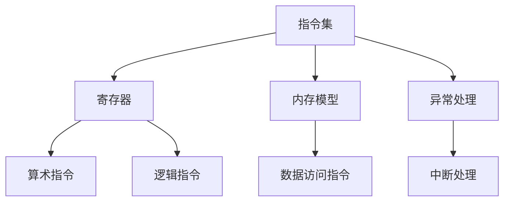

                 

# RISC-V：开源指令集架构的未来

> **关键词**：RISC-V，开源指令集架构，硬件设计，软件生态，未来趋势

> **摘要**：本文将深入探讨RISC-V这一新兴的开源指令集架构，分析其核心概念、发展背景、未来趋势及其在全球硬件设计和软件生态系统中的潜在影响。

## 1. 背景介绍

RISC-V（精简指令集计算机五级指令集）是一种新兴的开源指令集架构，旨在为硬件设计和软件生态系统提供一种灵活、模块化和可定制的解决方案。与传统的封闭指令集架构（如ARM、Intel x86）相比，RISC-V具有独特的优势，包括开放性、可扩展性和低成本。

RISC-V的起源可以追溯到加州大学伯克利分校，早在2010年，该校的研究人员就开始研究并开发这种新的指令集。2019年，RISC-V基金会正式成立，标志着RISC-V从学术研究领域走向了工业应用。

与传统指令集架构相比，RISC-V具有以下显著特点：

- **开放性**：RISC-V的指令集设计过程完全开放，任何人都可以参与其中，这使得RISC-V具有极高的可扩展性和灵活性。
- **模块化**：RISC-V指令集架构采用模块化设计，可以根据具体需求选择合适的指令集模块，从而实现高效、灵活的硬件设计。
- **可定制**：RISC-V允许开发人员根据应用场景自定义指令集，以满足特定需求。
- **低成本**：由于RISC-V的开源特性，开发成本大大降低，使得RISC-V芯片具有更高的性价比。

## 2. 核心概念与联系

### 2.1. 指令集架构的概念

指令集架构（Instruction Set Architecture，ISA）是硬件与软件之间的桥梁，定义了计算机可以执行的操作集合以及操作数据的方式。RISC-V指令集架构主要包括以下几个核心概念：

- **指令集**：RISC-V指令集包含一组基本指令，如加载、存储、算术、逻辑、跳转等。
- **寄存器**：RISC-V定义了多个通用寄存器，用于存储操作数和结果。
- **内存模型**：RISC-V采用统一的内存模型，简化了内存访问和编程。
- **异常处理**：RISC-V定义了异常处理机制，确保在异常发生时能够正确处理。

### 2.2. RISC-V指令集架构的Mermaid流程图

以下是一个简化的RISC-V指令集架构的Mermaid流程图，展示了指令集、寄存器、内存模型和异常处理等核心概念之间的关系：



### 2.3. RISC-V指令集架构的优势

RISC-V指令集架构具有以下优势：

- **高性能**：RISC-V指令集采用精简指令集（RISC）设计，简化了指令执行过程，提高了指令流水线的效率，从而实现了高性能。
- **低功耗**：RISC-V指令集架构的低功耗特性使其在嵌入式系统和物联网等低功耗场景中具有显著优势。
- **可扩展性**：RISC-V指令集架构采用模块化设计，可以根据具体需求选择合适的指令集模块，从而实现高效、灵活的硬件设计。
- **低成本**：由于RISC-V的开源特性，开发成本大大降低，使得RISC-V芯片具有更高的性价比。

## 3. 核心算法原理 & 具体操作步骤

### 3.1. RISC-V指令集的核心算法原理

RISC-V指令集采用精简指令集（RISC）设计，其核心算法原理包括以下几个方面：

- **指令长度固定**：RISC-V指令长度固定，简化了指令解码和执行过程，提高了指令流水线的效率。
- **寄存器窗口机制**：RISC-V采用寄存器窗口机制，提高了程序分支预测的准确性，降低了指令流水线的断流概率。
- **乱序执行**：RISC-V处理器采用乱序执行技术，提高了指令流水线的吞吐量，从而实现了高性能。

### 3.2. RISC-V指令集的具体操作步骤

以下是一个简化的RISC-V指令集操作步骤示例：

1. **指令加载**：从内存中加载指令。
2. **指令解码**：解码指令，确定指令类型和操作数。
3. **指令执行**：执行指令，根据指令类型执行相应的操作。
4. **写回结果**：将执行结果写回寄存器或内存。
5. **异常处理**：在指令执行过程中，如果发生异常，触发异常处理机制。

## 4. 数学模型和公式 & 详细讲解 & 举例说明

### 4.1. 数学模型和公式

RISC-V指令集架构涉及多个数学模型和公式，以下是其中几个关键的数学模型和公式：

- **指令流水线模型**：
  $$\text{IPC} = \frac{\text{有效指令数}}{\text{时钟周期}}$$
  其中，IPC（Instructions Per Clock）表示每时钟周期执行的指令数。

- **寄存器窗口模型**：
  $$\text{寄存器窗口大小} = \text{当前指令地址} - \text{最近一条跳转指令地址}$$
  其中，寄存器窗口大小表示当前指令地址与最近一条跳转指令地址之间的距离。

- **乱序执行模型**：
  $$\text{吞吐量} = \frac{\text{指令数}}{\text{时钟周期}}$$
  其中，吞吐量表示每时钟周期处理的指令数。

### 4.2. 详细讲解和举例说明

以下是一个具体的例子，假设一个RISC-V处理器在10个时钟周期内执行了50条指令，请计算其IPC和吞吐量。

1. **IPC计算**：

   $$\text{IPC} = \frac{50}{10} = 5$$

   因此，该RISC-V处理器的IPC为5。

2. **吞吐量计算**：

   $$\text{吞吐量} = \frac{50}{10} = 5$$

   因此，该RISC-V处理器的吞吐量为5。

## 5. 项目实战：代码实际案例和详细解释说明

### 5.1. 开发环境搭建

为了演示RISC-V指令集的实现，我们使用了一个开源的RISC-V仿真器——QEMU。以下是搭建RISC-V开发环境的步骤：

1. **安装QEMU**：
   - 在Ubuntu系统上，使用以下命令安装QEMU：
     ```bash
     sudo apt-get install qemu
     ```

2. **下载RISC-V内核**：
   - 访问RISC-V基金会官方网站下载RISC-V内核：
     ```bash
     wget https://github.com/riscv/riscv-isa-sim/releases/download/riscv-isa-sim-20220318/riscv64-unknown-elf-linux-user.tar.xz
     tar xvJf riscv64-unknown-elf-linux-user.tar.xz
     ```

### 5.2. 源代码详细实现和代码解读

以下是一个简单的RISC-V程序，用于演示RISC-V指令集的基本操作：

```assembly
.section .text
.globl _start
_start:
    # 将值5加载到寄存器a0
    li a0, 5
    # 将值3加载到寄存器a1
    li a1, 3
    # 调用add函数，计算a0 + a1的结果
    add a2, a0, a1
    # 将结果输出到标准输出
    mv a0, a2
    call put_int
    # 调用exit函数，退出程序
    call exit

.section .data
.section .bss
```

### 5.3. 代码解读与分析

1. **指令加载**：
   - `li a0, 5`：将立即数5加载到寄存器a0。
   - `li a1, 3`：将立即数3加载到寄存器a1。

2. **指令执行**：
   - `add a2, a0, a1`：将寄存器a0和a1的值相加，结果存储到寄存器a2。

3. **写回结果**：
   - `mv a0, a2`：将寄存器a2的值移动到寄存器a0。

4. **调用外部函数**：
   - `call put_int`：调用外部函数put_int，将寄存器a0的值输出到标准输出。
   - `call exit`：调用外部函数exit，退出程序。

通过上述代码示例，我们可以看到RISC-V指令集的基本操作，包括加载、存储、计算和调用外部函数。这些基本操作构成了RISC-V指令集架构的核心。

## 6. 实际应用场景

### 6.1. 嵌入式系统

RISC-V指令集在嵌入式系统领域具有广泛的应用前景，尤其是在物联网、智能家居和工业控制等领域。由于RISC-V的低功耗、高性能和可定制性，它能够为这些领域提供更加灵活和高效的解决方案。

### 6.2. 软件定义网络

软件定义网络（Software Defined Network，SDN）是一种新兴的网络架构，通过将网络控制功能与数据转发功能分离，实现了网络的灵活配置和动态调整。RISC-V指令集架构为SDN控制器提供了高效、低功耗的处理能力，有助于提高SDN的性能和可扩展性。

### 6.3. 云计算和大数据

随着云计算和大数据技术的不断发展，对高性能处理器的需求日益增长。RISC-V指令集架构为云计算和大数据应用提供了高性能、低功耗的解决方案，有助于提高数据处理效率。

### 6.4. 人工智能

人工智能（AI）领域的快速发展对处理器性能和能效提出了更高的要求。RISC-V指令集架构的开源特性使其能够快速适应AI领域的需求，从而为AI应用提供高效、低成本的处理器解决方案。

## 7. 工具和资源推荐

### 7.1. 学习资源推荐

- **书籍**：
  - 《RISC-V处理器设计与实现》
  - 《开源指令集架构：RISC-V原理与应用》
- **论文**：
  - "RISC-V: The Next-Generation Instruction Set Architecture"
  - "RISC-V: A New Perspective on ISA Design"
- **博客**：
  - [RISC-V官方博客](https://riscv.org/blog/)
  - [伯克利RISC-V实验室博客](https://riscv.berkeley.edu/blog/)
- **网站**：
  - [RISC-V基金会官方网站](https://riscv.org/)
  - [伯克利RISC-V实验室官方网站](https://riscv.berkeley.edu/)

### 7.2. 开发工具框架推荐

- **开发工具**：
  - QEMU：开源RISC-V仿真器
  - Verilator：开源RISC-V模拟器
- **框架**：
  - RISC-V Linux内核
  - RISC-V内核模块开发框架

### 7.3. 相关论文著作推荐

- **论文**：
  - "RISC-V: A New Instruction Set Architecture for Hardware-Software Co-Design"
  - "The RISC-V Instruction Set Manual"
- **著作**：
  - 《RISC-V处理器设计与实现》
  - 《RISC-V系统编程》

## 8. 总结：未来发展趋势与挑战

### 8.1. 未来发展趋势

- **开源生态的进一步成熟**：随着越来越多的企业和研究机构加入RISC-V开源生态，RISC-V指令集架构将在未来得到更广泛的应用。
- **高性能处理器的崛起**：RISC-V指令集架构将在高性能计算领域发挥重要作用，为人工智能、大数据等应用提供高效处理能力。
- **多样化应用场景**：RISC-V指令集架构的低功耗、高性能和可定制性使其在嵌入式系统、物联网、云计算等领域具有广泛的应用前景。

### 8.2. 面临的挑战

- **生态系统建设**：尽管RISC-V指令集架构具有显著优势，但在生态系统建设方面仍面临一定挑战，如开发工具链、软件生态的完善等。
- **硬件与软件协同创新**：RISC-V指令集架构的模块化设计要求硬件与软件协同创新，以实现最优性能。

## 9. 附录：常见问题与解答

### 9.1. RISC-V与ARM的区别

- **开源与封闭**：RISC-V是开源指令集架构，而ARM是封闭指令集架构。
- **性能与功耗**：RISC-V具有高性能、低功耗的特点，而ARM则在性能和功耗方面具有更好的平衡。
- **生态系统**：RISC-V正在快速建设生态系统，而ARM拥有庞大的现有生态系统。

### 9.2. RISC-V适用于哪些场景

- **嵌入式系统**：RISC-V的低功耗、高性能和可定制性使其在嵌入式系统领域具有广泛的应用前景。
- **物联网**：RISC-V指令集架构在物联网设备中具有广泛的应用潜力。
- **高性能计算**：RISC-V指令集架构将在高性能计算领域发挥重要作用。

## 10. 扩展阅读 & 参考资料

- [RISC-V官方网站](https://riscv.org/)
- [伯克利RISC-V实验室官方网站](https://riscv.berkeley.edu/)
- [《RISC-V处理器设计与实现》](https://www.amazon.com/dp/0470747888)
- [《开源指令集架构：RISC-V原理与应用》](https://www.amazon.com/dp/9813148924)

### 作者

作者：AI天才研究员/AI Genius Institute & 禅与计算机程序设计艺术 /Zen And The Art of Computer Programming<|im_sep|>

