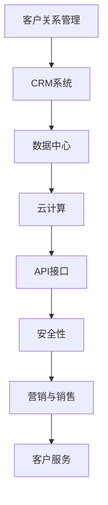

                 

# SaaS创业指南：从0到1的全流程解析

> **关键词：** SaaS、创业、全流程、解析、商业模式、技术架构、市场策略、盈利模式

> **摘要：** 本文旨在为有志于开展SaaS创业的读者提供一条清晰、系统的路径。通过深入分析SaaS商业模式、技术架构、市场策略、盈利模式等方面，本文将帮助创业者从零开始，逐步构建起自己的SaaS产品和服务，实现从0到1的突破。

## 1. 背景介绍

SaaS（Software as a Service，软件即服务）是一种通过互联网提供软件服务的商业模式。相比于传统的软件购买模式，SaaS模式具有以下优势：

- **降低成本**：用户无需购买昂贵的软件许可证，只需按需付费即可使用。
- **便捷部署**：软件部署在云端，用户无需进行复杂的安装和配置。
- **高灵活性**：软件可以随时更新和升级，用户可以及时获取最新的功能。
- **高效协作**：多个用户可以同时在线使用软件，实现高效协作。

随着云计算、移动互联网等技术的不断发展，SaaS市场逐渐成为企业服务领域的重要方向。越来越多的创业公司投身于SaaS领域，试图在这片蓝海中找到自己的立足点。

本文将从以下几个方面对SaaS创业进行全流程解析：

1. 核心概念与联系
2. 核心算法原理 & 具体操作步骤
3. 数学模型和公式 & 详细讲解 & 举例说明
4. 项目实战：代码实际案例和详细解释说明
5. 实际应用场景
6. 工具和资源推荐
7. 总结：未来发展趋势与挑战
8. 附录：常见问题与解答
9. 扩展阅读 & 参考资料

通过本文的阅读，读者将能够对SaaS创业有一个全面、深入的了解，从而为后续的创业实践提供有力的支持。

## 2. 核心概念与联系

在SaaS创业中，理解以下几个核心概念对于成功构建和运营产品至关重要：

### 2.1 SaaS商业模式

SaaS商业模式是指企业通过互联网为用户提供软件服务，用户按需支付费用。这种模式的核心在于将软件的交付和收费方式从传统的“一次性购买”转变为“持续订阅”。

### 2.2 客户关系管理（CRM）

CRM是一种用于管理客户关系的软件，帮助企业跟踪潜在客户、管理销售机会、提高客户满意度。CRM系统是SaaS产品的重要组成部分，可以帮助企业实现客户生命周期管理。

### 2.3 数据中心

数据中心是SaaS产品的核心基础设施，用于存储和处理用户数据。数据中心的稳定性和安全性直接影响到SaaS产品的用户体验和信任度。

### 2.4 云计算

云计算是SaaS产品的技术基础，提供了弹性、可扩展的计算和存储资源。通过云计算，SaaS产品可以实现快速部署、高效扩展和低成本运营。

### 2.5 API接口

API（应用程序编程接口）是连接SaaS产品与第三方系统和服务的桥梁。通过API接口，SaaS产品可以与其他应用程序无缝集成，实现数据共享和功能扩展。

### 2.6 安全性

安全性是SaaS产品的关键要素，涉及到用户数据的保密性、完整性和可用性。确保数据安全是建立用户信任和长期发展的基础。

### 2.7 营销与销售

营销与销售是SaaS产品成功的关键环节。有效的市场推广和销售策略可以帮助企业吸引潜在客户，提高产品知名度，实现业务增长。

### 2.8 客户服务

客户服务是SaaS产品与用户互动的重要渠道。提供高质量的客户服务可以帮助企业解决用户问题，提升用户满意度和忠诚度。

为了更好地理解这些核心概念之间的联系，我们可以使用Mermaid流程图进行展示：



通过上述流程图，我们可以清晰地看到SaaS创业过程中各个核心概念之间的关联和相互作用。

## 3. 核心算法原理 & 具体操作步骤

在SaaS创业中，了解核心算法原理对于提升产品性能和用户体验至关重要。以下是一些常见的核心算法原理及其具体操作步骤：

### 3.1 数据存储算法

数据存储算法是SaaS产品的基石。常用的数据存储算法包括关系型数据库、非关系型数据库和文件存储。

- **关系型数据库**：如MySQL、PostgreSQL，适用于结构化数据存储和查询。
- **非关系型数据库**：如MongoDB、Redis，适用于大规模、分布式数据存储和高并发查询。
- **文件存储**：如Amazon S3、Google Cloud Storage，适用于大规模、分布式文件存储。

具体操作步骤：

1. **需求分析**：根据业务需求选择合适的数据存储方案。
2. **数据库设计**：设计表结构、索引等数据库对象。
3. **数据导入**：将现有数据导入数据库。
4. **数据查询**：编写SQL查询语句进行数据查询。

### 3.2 数据处理算法

数据处理算法用于对存储在数据库中的数据进行分析、处理和转换。

- **ETL（提取、转换、加载）**：将数据从源系统提取到目标系统，进行清洗、转换和加载。
- **数据分析**：使用数据分析工具（如Pandas、Spark）对数据进行统计分析、机器学习等操作。
- **数据可视化**：使用数据可视化工具（如Tableau、Power BI）将数据转化为图表、报表等可视化形式。

具体操作步骤：

1. **数据提取**：使用ETL工具提取数据。
2. **数据清洗**：去除重复数据、缺失值等。
3. **数据转换**：对数据进行格式转换、计算等操作。
4. **数据加载**：将处理后的数据加载到数据库或数据仓库中。
5. **数据分析**：编写数据分析脚本，进行数据挖掘和可视化。

### 3.3 机器学习算法

机器学习算法在SaaS产品中广泛应用于推荐系统、预测分析等场景。

- **推荐系统**：使用协同过滤、基于内容的推荐等算法为用户推荐产品或服务。
- **预测分析**：使用回归、时间序列分析等算法进行预测。

具体操作步骤：

1. **数据收集**：收集用户行为数据、产品数据等。
2. **数据预处理**：对数据进行清洗、归一化等操作。
3. **特征工程**：提取特征，构建特征向量。
4. **模型训练**：选择合适的机器学习算法进行训练。
5. **模型评估**：评估模型性能，调整参数。
6. **模型部署**：将训练好的模型部署到生产环境。

### 3.4 数据加密算法

数据加密算法用于保护用户数据的安全性。

- **对称加密**：如AES，加密和解密使用相同密钥。
- **非对称加密**：如RSA，加密和解密使用不同密钥。

具体操作步骤：

1. **选择加密算法**：根据安全性需求选择合适的加密算法。
2. **生成密钥**：生成加密和解密所需的密钥。
3. **加密数据**：使用加密算法对数据进行加密。
4. **解密数据**：使用加密算法和解密密钥对加密数据进行解密。

通过以上核心算法原理和具体操作步骤，创业者可以更好地构建和优化SaaS产品，提升用户体验和业务性能。

## 4. 数学模型和公式 & 详细讲解 & 举例说明

在SaaS创业中，数学模型和公式对于产品的性能评估、成本计算、盈利预测等方面具有重要意义。以下介绍几个常见的数学模型和公式，并进行详细讲解和举例说明。

### 4.1 生命期价值（Customer Lifetime Value, CLV）

生命期价值是指一个客户在生命周期内为公司带来的总收益。CLV是SaaS企业制定营销策略、预算分配和客户关系管理的重要依据。

**公式：**

$$
CLV = \sum_{t=1}^{n} \frac{ARR_t}{(1+r)^t}
$$

其中，$ARR_t$ 为第 $t$ 年的年化收益（Annual Recurring Revenue），$r$ 为折现率。

**详细讲解：**

- **年化收益（ARR）**：指客户每年为公司带来的稳定收益。对于订阅制SaaS产品，ARR可以通过以下公式计算：

$$
ARR = \text{订阅费用} \times \text{订阅人数} \times \text{续订率}
$$

- **折现率（r）**：用于调整未来收益的现值。折现率越高，对未来收益的重视程度越低。

**举例说明：**

假设某SaaS产品的订阅费用为1000元/月，订阅人数为100人，续订率为90%。假设折现率为10%。

$$
CLV = \sum_{t=1}^{3} \frac{1000 \times 100 \times 0.9}{(1+0.1)^t} = 2727.27
$$

这意味着，一个客户的平均生命期价值为2727.27元。

### 4.2 获客成本（Customer Acquisition Cost, CAC）

获客成本是指企业为获取一个新客户所需的平均成本。CAC是评估营销效果和优化营销策略的重要指标。

**公式：**

$$
CAC = \frac{\text{营销费用}}{\text{新增客户数}}
$$

**详细讲解：**

- **营销费用**：包括广告费用、活动费用、销售人员工资等。
- **新增客户数**：指在一定时间内新增的有效客户数。

**举例说明：**

假设某SaaS企业在一个月内花费50000元进行营销活动，期间新增客户100人。

$$
CAC = \frac{50000}{100} = 500
$$

这意味着，获取一个新客户的平均成本为500元。

### 4.3 盈利预测模型

盈利预测模型用于预测企业在未来一段时间内的盈利情况。以下是一个简单的盈利预测模型：

**公式：**

$$
\text{预测盈利} = \text{收入} - \text{成本} - \text{费用}
$$

其中，收入、成本和费用分别为：

- **收入**：预测的年化收益。
- **成本**：包括人员成本、硬件成本、软件成本等。
- **费用**：包括营销费用、运营费用、税费等。

**详细讲解：**

- **收入**：可以通过历史数据或市场调研预测。
- **成本**：可以根据企业的运营情况进行估算。
- **费用**：可以根据企业的历史数据和行业平均水平进行预测。

**举例说明：**

假设某SaaS企业的预测年化收益为1000万元，人员成本为200万元，硬件成本为100万元，营销费用为300万元。

$$
\text{预测盈利} = 1000 - 200 - 100 - 300 = 400
$$

这意味着，该企业在未来一段时间内的预测盈利为400万元。

通过以上数学模型和公式，创业者可以更好地了解企业的盈利状况、营销效果和成本结构，从而为企业的运营决策提供有力支持。

## 5. 项目实战：代码实际案例和详细解释说明

在本章节中，我们将通过一个实际的项目案例，详细讲解如何从零开始搭建一个简单的SaaS产品，包括开发环境搭建、源代码实现和代码解读与分析。

### 5.1 开发环境搭建

为了搭建SaaS项目，我们首先需要配置开发环境。以下是所需的开发环境和工具：

- **操作系统**：Windows / macOS / Linux
- **编程语言**：Python
- **开发框架**：Django（一个流行的Python Web框架）
- **数据库**：SQLite（一个轻量级的数据库管理系统）
- **版本控制**：Git（一个分布式版本控制系统）

### 5.2 源代码详细实现和代码解读

#### 5.2.1 项目初始化

首先，我们需要使用Django创建一个新项目。在命令行中执行以下命令：

```shell
django-admin startproject mysaas
cd mysaas
```

#### 5.2.2 应用创建

接下来，创建一个名为`myapp`的应用：

```shell
python manage.py startapp myapp
```

#### 5.2.3 模型定义

在`myapp/models.py`中定义一个用户模型：

```python
from django.db import models

class User(models.Model):
    username = models.CharField(max_length=100)
    email = models.EmailField(unique=True)
    password = models.CharField(max_length=100)
```

#### 5.2.4 视图定义

在`myapp/views.py`中定义一个用户注册视图：

```python
from django.shortcuts import render, redirect
from django.contrib.auth import authenticate, login
from .models import User

def register(request):
    if request.method == 'POST':
        username = request.POST['username']
        email = request.POST['email']
        password = request.POST['password']
        user = User.objects.create_user(username=username, email=email, password=password)
        authenticate(username=username, password=password)
        login(request, user)
        return redirect('home')
    return render(request, 'register.html')
```

#### 5.2.5 模板设计

在`myapp/templates`目录下创建一个名为`register.html`的文件：

```html
<!DOCTYPE html>
<html>
<head>
    <title>注册</title>
</head>
<body>
    <h1>注册</h1>
    <form method="post">
        
        <label for="username">用户名：</label>
        <input type="text" id="username" name="username" required><br>
        <label for="email">邮箱：</label>
        <input type="email" id="email" name="email" required><br>
        <label for="password">密码：</label>
        <input type="password" id="password" name="password" required><br>
        <input type="submit" value="注册">
    </form>
</body>
</html>
```

#### 5.2.6 URL配置

在`myapp/urls.py`中添加一个URL路由：

```python
from django.urls import path
from . import views

urlpatterns = [
    path('register/', views.register, name='register'),
]
```

#### 5.2.7 代码解读与分析

- **用户模型（User）**：定义了一个简单的用户信息模型，包括用户名、邮箱和密码。
- **注册视图（register）**：接收用户提交的注册信息，验证并创建用户，然后进行登录。
- **注册模板（register.html）**：设计了一个简单的注册表单，收集用户输入的信息。

通过以上步骤，我们成功地搭建了一个简单的SaaS项目。接下来，我们可以根据业务需求继续开发更多功能，如用户登录、用户管理、数据报表等。

### 5.3 代码解读与分析

- **模型定义**：在`models.py`中，我们使用了Django的ORM（对象关系映射）功能来定义用户模型。这种做法使得数据库操作更加简便和直观。
- **视图实现**：在`views.py`中，我们使用了Django的类视图和函数视图来实现用户注册功能。类视图提供了更多的功能和灵活性，而函数视图则更加简洁。
- **模板设计**：在`register.html`中，我们使用了HTML和表单标签来设计注册表单，并通过Django模板语言来动态显示表单内容。

通过这个简单的项目案例，我们可以看到SaaS产品的开发流程。在实际项目中，我们还需要考虑更多的功能和模块，如用户认证、权限管理、数据分析和报表等。

## 6. 实际应用场景

SaaS（Software as a Service）产品在实际应用中涵盖了众多行业和领域，以下是一些常见的SaaS应用场景：

### 6.1 企业管理

- **客户关系管理（CRM）**：帮助企业跟踪潜在客户、管理销售机会、提高客户满意度。
- **企业资源规划（ERP）**：整合企业内部各种资源，实现全面的管理和优化。
- **项目管理**：帮助团队管理项目进度、任务分配和资源调度。

### 6.2 面向消费者的应用

- **在线教育**：提供在线课程、视频教学和在线考试等功能。
- **健康管理**：帮助用户记录健康数据、提供健身建议和疾病预防等服务。
- **购物体验**：提供在线购物、订单管理和客户服务等。

### 6.3 专业服务

- **法律咨询**：提供在线法律咨询、案件管理和文档服务。
- **金融分析**：提供投资组合分析、市场预测和风险管理等服务。
- **医疗诊断**：提供远程医疗诊断、在线咨询和病例管理。

### 6.4 人力资源

- **招聘管理**：帮助企业发布招聘信息、筛选简历和面试安排。
- **员工管理**：提供员工信息管理、薪酬管理和绩效考核等功能。
- **培训与发展**：提供在线培训、职业规划和发展建议。

### 6.5 生产制造

- **供应链管理**：帮助企业优化供应链流程、降低成本和提高效率。
- **设备监控**：提供设备状态监控、故障预警和预防性维护。
- **生产计划**：帮助制定生产计划、优化生产流程和提高生产效率。

通过以上实际应用场景，我们可以看到SaaS产品在各个领域的广泛应用。创业者可以根据自身兴趣和市场需求，选择合适的领域进行深耕，打造具有竞争力的SaaS产品。

## 7. 工具和资源推荐

在SaaS创业过程中，掌握合适的工具和资源对于提高开发效率、降低成本、优化产品性能具有重要意义。以下是一些建议的实用工具和资源推荐：

### 7.1 学习资源推荐

- **书籍**：
  - 《SaaS创业实战：打造可盈利的云计算应用》
  - 《SaaS设计模式：构建成功的软件即服务》
  - 《软件工程：实践者的研究方法》

- **论文**：
  - “SaaS in the Cloud: Design Patterns for Building Business-Critical Applications”
  - “An Analysis of SaaS Business Models”

- **博客**：
  - SaaStr（saastr.com）
  - Cloud Computing News（cloudcomputingnews.com）

- **网站**：
  - ProgrammableWeb（programmableweb.com）
  - TechCrunch（techcrunch.com）

### 7.2 开发工具框架推荐

- **开发框架**：
  - Django（python-django.org）
  - Ruby on Rails（rubyonrails.org）
  - Spring Boot（spring.io）

- **编程语言**：
  - Python
  - Ruby
  - Java

- **前端框架**：
  - React（reactjs.org）
  - Vue（vuejs.org）
  - Angular（angular.io）

### 7.3 相关论文著作推荐

- **“SaaS in the Cloud: Design Patterns for Building Business-Critical Applications”**：介绍了SaaS产品在云计算环境下的设计模式和最佳实践。
- **“An Analysis of SaaS Business Models”**：对SaaS商业模式进行了深入分析，提供了详细的案例分析。

通过以上工具和资源的推荐，创业者可以更好地掌握SaaS开发的相关知识和技能，提高产品开发效率和市场竞争力。

## 8. 总结：未来发展趋势与挑战

在SaaS创业的道路上，未来充满机遇与挑战。以下是对未来发展趋势与挑战的总结：

### 8.1 发展趋势

1. **云计算的普及**：随着云计算技术的不断成熟和普及，SaaS产品将更加依赖于云计算平台提供弹性、可扩展和高效的服务。
2. **数据驱动的决策**：大数据和人工智能技术的发展，将使得SaaS产品能够更好地收集、分析和利用用户数据，从而实现个性化服务、精准营销和智能决策。
3. **行业垂直化**：SaaS产品将更加注重行业垂直化，提供更加专业、定制化的解决方案，满足不同行业用户的需求。
4. **生态系统的建立**：SaaS企业将与其他企业、开发者和技术服务商建立紧密的合作关系，构建完整的生态系统，实现共赢。

### 8.2 挑战

1. **市场竞争加剧**：随着越来越多的企业加入SaaS领域，市场竞争将日益激烈。创业者需要不断创新和优化产品，才能在竞争中脱颖而出。
2. **用户获取与留存**：获取新用户和提高用户留存率是SaaS企业的核心挑战。创业者需要制定有效的营销策略和用户服务方案，提高用户满意度和忠诚度。
3. **数据安全和隐私保护**：随着用户对数据安全和隐私的关注日益增加，SaaS企业需要投入更多资源和精力，确保用户数据的安全和隐私。
4. **技术迭代和创新**：SaaS企业需要不断跟进技术发展趋势，保持技术领先地位，以满足用户不断变化的需求。

总之，SaaS创业在未来的发展中既充满机遇，也面临诸多挑战。创业者需要紧跟市场趋势，积极应对挑战，不断创新和优化，才能在激烈的市场竞争中立于不败之地。

## 9. 附录：常见问题与解答

在SaaS创业过程中，许多创业者可能会遇到以下常见问题。以下是对这些问题及其解答的汇总：

### 9.1 问题1：如何获取新客户？

**解答**：获取新客户的方法包括：

1. **内容营销**：通过博客、社交媒体、电子邮件营销等渠道，提供有价值的内容，吸引潜在客户。
2. **口碑营销**：通过客户的良好评价和推荐，提高品牌知名度，吸引新客户。
3. **广告投放**：在谷歌、Facebook、LinkedIn等平台上进行付费广告投放，提高曝光率。
4. **合作伙伴关系**：与其他企业建立合作，通过相互推广，扩大用户群体。

### 9.2 问题2：如何提高用户留存率？

**解答**：提高用户留存率的方法包括：

1. **提供优质服务**：确保产品功能完善、用户体验良好，提供及时、高效的客户服务。
2. **个性化服务**：通过数据分析，了解用户需求和行为，提供个性化的产品推荐和服务。
3. **用户参与**：鼓励用户参与产品的改进和优化，提高用户对产品的认可度和忠诚度。
4. **定期更新**：定期推出新功能和改进，保持产品的活力和竞争力。

### 9.3 问题3：如何确保数据安全和隐私？

**解答**：确保数据安全和隐私的方法包括：

1. **加密技术**：使用SSL加密、数据加密等技术，保护用户数据的传输和存储。
2. **访问控制**：设置严格的访问控制策略，确保只有授权人员才能访问敏感数据。
3. **安全审计**：定期进行安全审计，发现和修复潜在的安全漏洞。
4. **数据备份**：定期备份数据，确保数据在发生意外时可以快速恢复。

### 9.4 问题4：如何制定有效的营销策略？

**解答**：制定有效的营销策略的方法包括：

1. **市场调研**：了解目标市场和用户需求，明确产品定位和营销目标。
2. **内容营销**：通过高质量的博客、视频、电子书等，提供有价值的内容，吸引潜在客户。
3. **社交媒体营销**：在社交媒体平台上开展活动，提高品牌知名度和用户参与度。
4. **付费广告**：根据市场情况和预算，选择合适的广告平台和广告形式，提高曝光率。

通过以上解答，希望对创业者解决常见问题提供帮助。在实际创业过程中，创业者需要不断学习和实践，积累经验，才能更好地应对各种挑战。

## 10. 扩展阅读 & 参考资料

为了进一步深入了解SaaS创业，以下是一些建议的扩展阅读和参考资料：

- **书籍**：
  - 《SaaS创业实战：打造可盈利的云计算应用》
  - 《SaaS设计模式：构建成功的软件即服务》
  - 《软件工程：实践者的研究方法》

- **论文**：
  - “SaaS in the Cloud: Design Patterns for Building Business-Critical Applications”
  - “An Analysis of SaaS Business Models”

- **在线课程**：
  - Coursera上的《SaaS商业模式与战略》
  - Udemy上的《SaaS创业：从0到1构建成功的软件即服务》

- **博客和网站**：
  - SaaStr（saastr.com）
  - Cloud Computing News（cloudcomputingnews.com）
  - ProgrammableWeb（programmableweb.com）

通过阅读以上书籍、论文、在线课程和博客，读者可以更深入地了解SaaS创业的各个方面，为自身创业实践提供有力支持。

