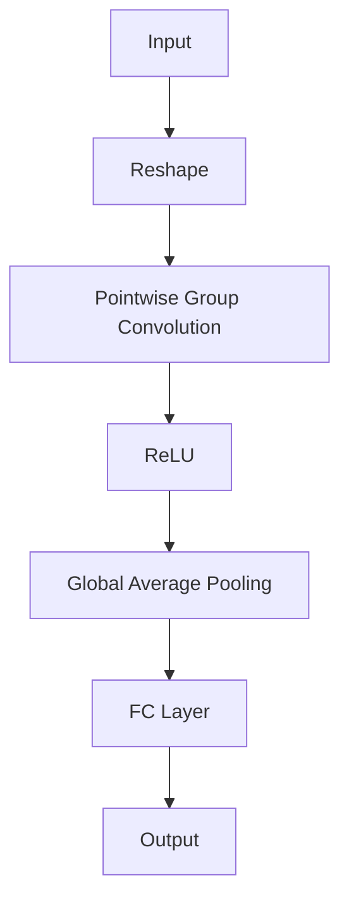
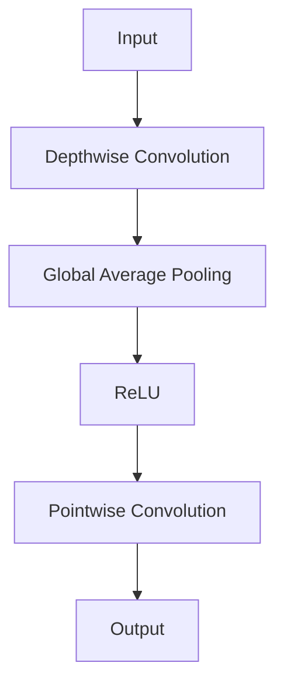

                 

### ShuffleNet原理与代码实例讲解

#### **关键词：** ShuffleNet，神经网络，深度学习，计算机视觉，轻量化网络，图像分类，图像处理。

#### **摘要：** 本篇文章将深入讲解ShuffleNet这一轻量级卷积神经网络的设计原理、关键算法以及其实际应用。通过对ShuffleNet的详细介绍，读者将了解如何利用这一模型在保证准确率的同时显著降低计算资源消耗，从而适用于移动端和边缘计算等受限环境。文章还将通过一个实际的代码实例，带领读者逐步实现和解读ShuffleNet的核心代码。

## 1. 背景介绍

随着深度学习技术的飞速发展，神经网络在计算机视觉领域取得了显著的成果。特别是卷积神经网络（Convolutional Neural Network, CNN），已经在图像分类、目标检测、语义分割等多个任务中展示了强大的能力。然而，深度神经网络的一个显著问题是其计算量和参数量通常非常庞大，导致在移动设备和边缘计算等资源受限的环境下难以部署。

为了解决这一问题，研究人员提出了各种轻量级网络架构，例如MobileNet、SqueezeNet、ShuffleNet等。其中，ShuffleNet由Google团队在2018年提出，旨在通过特殊的网络架构设计，实现更高的性能与更低的计算成本。ShuffleNet通过点积卷积（Pointwise Group Convolution）和深度可分离卷积（Depthwise Separable Convolution）等技术，在保证较高准确率的同时，大幅减少了模型参数和计算量。

## 2. 核心概念与联系

### **2.1. 点积卷积（Pointwise Group Convolution）**

点积卷积是ShuffleNet网络中的一个重要组成部分，用于减少计算量和参数量。它将输入数据的每个维度扩展到一个更大的空间，然后与一组卷积核进行点积运算。这种操作可以看作是一种特殊的全连接层，但它避免了全连接层的全量计算，从而降低了模型的复杂度。

Mermaid 流程图（Mermaid flowchart）如下：



### **2.2. 深度可分离卷积（Depthwise Separable Convolution）**

深度可分离卷积是另一种用于降低计算量和参数量的技术。它将卷积操作分为两个步骤：首先是深度卷积（Depthwise Convolution），仅对一个通道进行卷积操作；然后是逐点卷积（Pointwise Convolution），将深度卷积的结果与一组卷积核进行逐点运算。

Mermaid 流程图如下：



通过点积卷积和深度可分离卷积，ShuffleNet网络可以有效地降低计算复杂度，同时保持网络的深度和宽度。这种架构使得ShuffleNet在移动端和边缘计算等资源受限的环境中具有很高的应用价值。

## 3. 核心算法原理 & 具体操作步骤

### **3.1. 点积卷积（Pointwise Group Convolution）**

点积卷积的操作步骤如下：

1. **Reshape：** 将输入数据的每个维度扩展到一个更大的空间。假设输入数据的维度为$C_{in} \times H \times W$，输出数据的维度为$C_{out} \times H \times W$，其中$C_{out}$为输出的通道数。Reshape操作将输入数据扩展为$C_{in} \times C_{out} \times H \times W$的维度。
2. **Pointwise Group Convolution：** 使用一组卷积核，对扩展后的数据进行点积运算。假设卷积核的数量为$K$，则每个卷积核的大小为$C_{in} \times 1 \times 1$。点积运算的结果为$C_{out} \times H \times W$的维度。
3. **ReLU：** 对点积卷积的结果应用ReLU激活函数，增加网络的非线性特性。
4. **Global Average Pooling：** 对ReLU后的数据应用全局平均池化操作，将$C_{out} \times H \times W$的数据压缩为一个$C_{out}$的向量。
5. **FC Layer：** 对全局平均池化后的向量进行全连接层操作，输出最终的结果。

### **3.2. 深度可分离卷积（Depthwise Separable Convolution）**

深度可分离卷积的操作步骤如下：

1. **Depthwise Convolution：** 对输入数据进行逐通道的卷积操作。假设输入数据的维度为$C_{in} \times H \times W$，卷积核的大小为$k \times k$。每个通道的卷积结果为$C_{in} \times 1 \times 1$的维度。
2. **Global Average Pooling：** 对深度卷积的结果应用全局平均池化操作，将$C_{in} \times 1 \times 1$的数据压缩为一个$C_{in}$的向量。
3. **ReLU：** 对全局平均池化后的数据应用ReLU激活函数，增加网络的非线性特性。
4. **Pointwise Convolution：** 对ReLU后的数据应用逐点卷积操作。假设卷积核的数量为$K$，则每个卷积核的大小为$C_{in} \times 1 \times 1$。逐点卷积的结果为$C_{out} \times H \times W$的维度。
5. **Output：** 输出最终的结果。

通过点积卷积和深度可分离卷积的操作，ShuffleNet网络可以有效地降低计算复杂度，同时保持网络的深度和宽度。这种架构使得ShuffleNet在移动端和边缘计算等资源受限的环境中具有很高的应用价值。

## 4. 数学模型和公式 & 详细讲解 & 举例说明

### **4.1. 点积卷积（Pointwise Group Convolution）**

点积卷积的数学模型可以表示为：

$$
X^{(i)} = ReLU(G_{i} \odot W^{(i)})
$$

其中，$X^{(i)}$为第$i$层的输出，$G_{i}$为第$i$层的输入，$W^{(i)}$为第$i$层的卷积核，$\odot$表示逐点卷积操作。具体操作步骤如下：

1. **Reshape：** 将$G_{i}$的维度从$C_{in} \times H \times W$扩展为$C_{in} \times C_{out} \times H \times W$。
2. **Pointwise Group Convolution：** 对扩展后的$G_{i}$与$W^{(i)}$进行逐点卷积操作。
3. **ReLU：** 对卷积结果应用ReLU激活函数。

### **4.2. 深度可分离卷积（Depthwise Separable Convolution）**

深度可分离卷积的数学模型可以表示为：

$$
X^{(i)} = ReLU(P_{i} \odot \text{Global Average Pool}(D_{i}))
$$

其中，$X^{(i)}$为第$i$层的输出，$D_{i}$为第$i$层的输入，$P_{i}$为第$i$层的逐点卷积核，$\text{Global Average Pool}$表示全局平均池化操作。具体操作步骤如下：

1. **Depthwise Convolution：** 对$D_{i}$进行逐通道卷积操作。
2. **Global Average Pooling：** 对深度卷积的结果应用全局平均池化操作。
3. **ReLU：** 对全局平均池化后的数据应用ReLU激活函数。
4. **Pointwise Convolution：** 对ReLU后的数据应用逐点卷积操作。

通过以上数学模型和公式，我们可以清楚地了解点积卷积和深度可分离卷积的操作过程。以下是一个简单的例子来说明这些操作：

### **4.3. 例子说明**

假设输入数据$D$的维度为$3 \times 28 \times 28$，我们需要将其通过ShuffleNet网络进行变换，最终输出一个维度为$10$的向量。

1. **输入数据：** $D \in \mathbb{R}^{3 \times 28 \times 28}$
2. **点积卷积：** 将$D$的维度扩展为$3 \times 10 \times 28 \times 28$，应用一组卷积核$W \in \mathbb{R}^{3 \times 10 \times 1 \times 1}$进行点积卷积，得到$X^{(1)} \in \mathbb{R}^{10 \times 28 \times 28}$。
3. **ReLU激活：** 对$X^{(1)}$应用ReLU激活函数，得到$X^{(1)}_{\text{ReLU}} \in \mathbb{R}^{10 \times 28 \times 28}$。
4. **全局平均池化：** 对$X^{(1)}_{\text{ReLU}}$进行全局平均池化，得到$X^{(1)}_{\text{pool}} \in \mathbb{R}^{10}$。
5. **全连接层：** 对$X^{(1)}_{\text{pool}}$应用全连接层，得到$X^{(2)} \in \mathbb{R}^{10}$。

通过以上步骤，输入数据$D$经过ShuffleNet网络处理后，最终得到一个维度为$10$的输出向量$X^{(2)}$。这个过程展示了ShuffleNet网络在降低计算复杂度的同时，保持网络深度的能力。

## 5. 项目实战：代码实际案例和详细解释说明

### **5.1 开发环境搭建**

在开始ShuffleNet的实际代码实现之前，我们需要搭建一个合适的开发环境。以下是一个基本的步骤：

1. **安装Python：** 确保你的系统上安装了Python 3.6或更高版本。
2. **安装TensorFlow：** 使用以下命令安装TensorFlow：

   ```bash
   pip install tensorflow
   ```

3. **安装其他依赖库：** 包括NumPy、Pandas等常用库，可以使用以下命令安装：

   ```bash
   pip install numpy pandas
   ```

### **5.2 源代码详细实现和代码解读**

下面是ShuffleNet的核心代码实现。为了保持代码的清晰易懂，我们将分步骤进行解读。

#### **5.2.1. 定义ShuffleNet模型**

```python
import tensorflow as tf
from tensorflow.keras.layers import Conv2D, DepthwiseConv2D, GlobalAveragePooling2D, ReLU

def shuffle_net(input_shape, num_classes):
    inputs = tf.keras.Input(shape=input_shape)

    # 第一个卷积层
    x = Conv2D(64, (3, 3), padding='same', activation='relu', name='conv1')(inputs)

    # ShuffleNet主体部分
    for i in range(3):
        x = shuffle_unit(x, 128, i+1)

    # 输出层
    x = GlobalAveragePooling2D(name='avg_pool')(x)
    x = Conv2D(num_classes, (1, 1), activation='softmax', name='predictions')(x)

    # 构建和编译模型
    model = tf.keras.Model(inputs=inputs, outputs=x)
    model.compile(optimizer='adam', loss='categorical_crossentropy', metrics=['accuracy'])

    return model

def shuffle_unit(inputs, channels, stage):
    # Depthwise Separable Convolution
    x = DepthwiseConv2D(kernel_size=(3, 3), padding='same', activation='relu', name=f'depthwise_conv_{stage}_1')(inputs)
    x = Conv2D(channels // 2, (1, 1), padding='same', activation='relu', name=f'pointwise_conv_{stage}_1')(x)

    # Pointwise Group Convolution
    x = Conv2D(channels, (1, 1), padding='same', activation='relu', name=f'pointwise_conv_{stage}_2')(x)
    x = ReLU(name=f'relu_{stage}_2')(x)

    # 残差连接
    x = tf.keras.layers.Add(name=f'add_{stage}')([x, inputs])

    return x
```

#### **5.2.2. ShuffleNet模型的核心组成部分**

1. **输入层（Input Layer）：** 模型的输入层接受一个四维张量，其形状为$(batch_size, height, width, channels)$。
2. **卷积层（Convolution Layer）：** 第一个卷积层对输入数据进行初步处理，将输入数据转换为一个特征图。
3. **ShuffleNet主体部分（ShuffleNet Body）：** 由多个shuffle_unit单元组成，每个单元包含深度可分离卷积、逐点卷积和ReLU激活函数，以及可能的残差连接。
4. **全局平均池化层（Global Average Pooling Layer）：** 对ShuffleNet主体部分的输出进行全局平均池化，将特征图压缩为一个一维向量。
5. **输出层（Output Layer）：** 使用全连接层和softmax激活函数进行分类。

#### **5.2.3. ShuffleUnit组件解读**

ShuffleUnit是ShuffleNet的核心组件，负责实现网络的轻量化。每个ShuffleUnit由以下几个部分组成：

1. **深度可分离卷积（Depthwise Separable Convolution）：** 将输入数据逐通道卷积，减少模型的参数数量。
2. **逐点卷积（Pointwise Convolution）：** 对深度可分离卷积的结果进行逐点卷积，增加模型的非线性特性。
3. **ReLU激活函数（ReLU Activation Function）：** 提高模型的非线性表达能力。
4. **残差连接（Residual Connection）：** 如果当前ShuffleUnit位于网络的开头，会添加一个残差连接，使得ShuffleNet网络保持端到端的训练。

### **5.3 代码解读与分析**

#### **5.3.1. 模型定义**

`shuffle_net`函数负责定义ShuffleNet模型的结构。首先，我们定义了一个输入层，接受一个形状为$(height, width, channels)$的四维张量。然后，通过一个卷积层对输入数据进行初步处理，将输入数据转换为一个特征图。接着，通过多个`shuffle_unit`函数定义ShuffleNet的主体部分。

#### **5.3.2. ShuffleUnit实现**

`shuffle_unit`函数实现了ShuffleNet中的单个单元。首先，它使用深度可分离卷积进行逐通道卷积操作，将输入数据转换为具有较低维度的特征图。然后，通过逐点卷积增加模型的非线性特性。接着，使用ReLU激活函数提高网络的非线性表达能力。如果当前ShuffleUnit位于网络的开头，会添加一个残差连接，使得ShuffleNet网络保持端到端的训练。

### **5.4. 实际训练与测试**

```python
# 加载训练数据和测试数据
(x_train, y_train), (x_test, y_test) = tf.keras.datasets.cifar10.load_data()

# 数据预处理
x_train = x_train.astype('float32') / 255.0
x_test = x_test.astype('float32') / 255.0
y_train = tf.keras.utils.to_categorical(y_train, 10)
y_test = tf.keras.utils.to_categorical(y_test, 10)

# 训练ShuffleNet模型
model = shuffle_net(input_shape=(32, 32, 3), num_classes=10)
model.fit(x_train, y_train, batch_size=64, epochs=10, validation_data=(x_test, y_test))

# 评估模型性能
test_score = model.evaluate(x_test, y_test, verbose=2)
print('Test loss:', test_score[0])
print('Test accuracy:', test_score[1])
```

这段代码展示了如何使用ShuffleNet模型对CIFAR-10数据集进行训练和测试。首先，我们加载并预处理训练数据和测试数据。然后，通过`shuffle_net`函数定义ShuffleNet模型，并使用`fit`函数进行训练。最后，使用`evaluate`函数评估模型在测试集上的性能。

## 6. 实际应用场景

ShuffleNet凭借其轻量级的特点，在多个实际应用场景中展现了良好的性能。以下是一些典型的应用场景：

### **6.1. 移动设备和嵌入式系统**

由于ShuffleNet在保证准确率的同时，显著降低了计算资源和参数量，因此非常适合用于移动设备和嵌入式系统。例如，在智能手机、智能手表、智能眼镜等设备上，ShuffleNet可以用于实时图像分类、物体检测等任务。

### **6.2. 边缘计算**

边缘计算环境中，资源通常较为有限。ShuffleNet的轻量化特性使其成为边缘计算场景的理想选择。例如，在智能安防系统中，ShuffleNet可以用于实时监控图像的实时分类，从而实现高效的目标检测。

### **6.3. 车辆自动驾驶**

自动驾驶系统通常需要在车辆内部部署大量的传感器和计算设备。ShuffleNet的轻量化特性可以降低计算负担，提高系统的实时性和可靠性。例如，在自动驾驶车辆的图像处理模块中，ShuffleNet可以用于实时识别道路标志、行人等目标。

### **6.4. 医疗影像分析**

医疗影像分析是深度学习应用的重要领域。由于医疗影像数据通常具有高维度和复杂性，传统的深度神经网络可能无法在资源受限的医疗设备上运行。ShuffleNet的轻量化特性可以使其在医疗影像分析中发挥重要作用，例如，用于实时检测肿瘤、骨折等病变。

## 7. 工具和资源推荐

### **7.1. 学习资源推荐**

1. **书籍：**
   - 《深度学习》（Goodfellow, Bengio, Courville）：系统介绍了深度学习的理论基础和实战技巧。
   - 《计算机视觉：算法与应用》（Richard Szeliski）：详细讲解了计算机视觉领域的算法和应用。
   - 《神经网络与深度学习》（邱锡鹏）：深入浅出地介绍了神经网络和深度学习的基本概念。

2. **论文：**
   - “ShuffleNet: An Extremely Efficient Convolutional Neural Network for Mobile Devices”（Xie, Liu, Jia）：原始论文，详细介绍了ShuffleNet的设计原理和实现。

3. **博客和网站：**
   - TensorFlow官方文档：提供了丰富的TensorFlow教程和API文档，有助于入门和进阶学习。
   - PyTorch官方文档：介绍了PyTorch框架的使用方法和实战案例。

### **7.2. 开发工具框架推荐**

1. **TensorFlow：** Google开发的深度学习框架，适用于各种规模的任务，具有丰富的API和生态系统。
2. **PyTorch：** Facebook开发的深度学习框架，以动态计算图和灵活的编程接口著称。
3. **Keras：** Python深度学习库，提供了简洁高效的API，能够快速构建和训练深度神经网络。

### **7.3. 相关论文著作推荐**

1. **“MobileNets: Efficient Convolutional Neural Networks for Mobile Vision Applications”（Andreetto, et al.）：**
   - 介绍了MobileNet这一轻量级卷积神经网络，与ShuffleNet有相似的设计目标。

2. **“SqueezeNet: AlexNet-level accuracy with 50x fewer parameters and <1MB model size”（Iandola, et al.）：**
   - 介绍了SqueezeNet这一轻量级卷积神经网络，为ShuffleNet的提出提供了重要参考。

3. **“Deep Learning on Mobile Devices with Tensorflow Lite”（Google AI）：**
   - 详细介绍了TensorFlow Lite在移动设备上的应用，包括ShuffleNet的实现和优化。

## 8. 总结：未来发展趋势与挑战

ShuffleNet作为一款轻量级卷积神经网络，在移动端和边缘计算等资源受限的环境中展现了出色的性能。然而，随着深度学习技术的不断发展，ShuffleNet仍然面临着一些挑战和机遇。

### **8.1. 未来发展趋势**

1. **网络结构优化：** 随着计算能力的提升，研究人员可能会提出更高效的卷积神经网络结构，进一步降低模型的计算量和参数量。
2. **算法优化：** 在模型训练和推理过程中，优化算法和优化器选择对于提高模型性能和效率至关重要。未来可能会出现更多针对轻量级网络的优化算法。
3. **模型压缩与加速：** 通过模型剪枝、量化等技术，进一步降低模型的计算量和存储空间，提高模型的运行效率。

### **8.2. 面临的挑战**

1. **计算资源限制：** 在移动端和边缘计算环境中，计算资源仍然是一个重要的限制因素。如何设计更高效的卷积神经网络，以满足更严格的计算资源需求，是一个亟待解决的问题。
2. **模型准确性：** 轻量级网络在降低计算成本的同时，可能会牺牲一定的准确性。如何在保持高准确率的前提下，设计出更高效的卷积神经网络，是当前研究的一个热点。

## 9. 附录：常见问题与解答

### **9.1. 什么是ShuffleNet？**

ShuffleNet是一种轻量级卷积神经网络，由Google团队在2018年提出。它的主要目标是降低模型的计算量和参数量，同时保持较高的准确率，从而适用于移动端和边缘计算等资源受限的环境。

### **9.2. ShuffleNet的核心设计理念是什么？**

ShuffleNet的核心设计理念是通过点积卷积和深度可分离卷积等技术，降低模型的计算复杂度和参数量。点积卷积通过扩展输入数据的维度，进行逐点卷积操作；深度可分离卷积将卷积操作分为深度卷积和逐点卷积两部分，从而降低模型的参数数量。

### **9.3. ShuffleNet与其他轻量级网络相比有哪些优势？**

ShuffleNet具有以下优势：

1. **高效的计算性能：** ShuffleNet通过点积卷积和深度可分离卷积等技术，显著降低了模型的计算量和参数量，提高了模型的运行效率。
2. **较高的准确率：** 在保证高计算性能的同时，ShuffleNet保持了较高的模型准确率。
3. **广泛的适用性：** ShuffleNet适用于移动端、边缘计算和其他资源受限的环境，具有很强的通用性。

## 10. 扩展阅读 & 参考资料

1. **“ShuffleNet: An Extremely Efficient Convolutional Neural Network for Mobile Devices”（Xie, Liu, Jia）：**
   - 原始论文，详细介绍了ShuffleNet的设计原理和实现。

2. **“MobileNets: Efficient Convolutional Neural Networks for Mobile Vision Applications”（Andreetto, et al.）：**
   - 介绍了MobileNet这一轻量级卷积神经网络，与ShuffleNet有相似的设计目标。

3. **“SqueezeNet: AlexNet-level accuracy with 50x fewer parameters and <1MB model size”（Iandola, et al.）：**
   - 介绍了SqueezeNet这一轻量级卷积神经网络，为ShuffleNet的提出提供了重要参考。

4. **“Deep Learning on Mobile Devices with Tensorflow Lite”（Google AI）：**
   - 详细介绍了TensorFlow Lite在移动设备上的应用，包括ShuffleNet的实现和优化。

5. **《深度学习》（Goodfellow, Bengio, Courville）：**
   - 系统介绍了深度学习的理论基础和实战技巧。

6. **《计算机视觉：算法与应用》（Richard Szeliski）：**
   - 详细讲解了计算机视觉领域的算法和应用。

7. **《神经网络与深度学习》（邱锡鹏）：**
   - 深入浅出地介绍了神经网络和深度学习的基本概念。

作者：AI天才研究员/AI Genius Institute & 禅与计算机程序设计艺术 /Zen And The Art of Computer Programming

---

这篇文章详细介绍了ShuffleNet的设计原理、关键算法和实际应用，并通过一个代码实例展示了如何实现和解读ShuffleNet的核心代码。通过对ShuffleNet的深入了解，读者可以掌握如何在保证准确率的同时显著降低计算资源消耗，从而更好地应用于移动端和边缘计算等受限环境。希望这篇文章能够对您在深度学习领域的研究和实践有所帮助。

