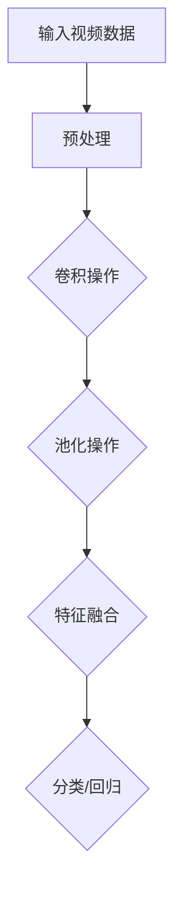

                 

# Sora模型的视频数据表征技术

## 摘要

本文将深入探讨Sora模型的视频数据表征技术。Sora模型是一个先进的视觉感知系统，它在视频数据分析和理解方面展现了卓越的性能。本文将首先介绍视频数据表征的基本概念，然后逐步讲解Sora模型的工作原理、核心算法、数学模型，并通过具体案例展示其实际应用。此外，还将介绍相关的开发环境和工具，提供实用的项目实战案例，以及总结Sora模型在视频数据处理领域的未来发展趋势与挑战。

## 1. 背景介绍

### 1.1 视频数据表征技术的发展历程

视频数据表征技术是计算机视觉和机器学习领域的重要组成部分。随着互联网的飞速发展和多媒体内容的爆炸性增长，如何高效地处理和分析视频数据成为了一个亟待解决的问题。

20世纪90年代，传统的视频处理技术主要依赖于像素级别的处理方法，如边缘检测、特征提取和运动估计。这些方法在处理简单视频时效果较好，但在面对复杂场景时往往力不从心。

进入21世纪，深度学习技术的兴起为视频数据表征带来了新的机遇。卷积神经网络（CNN）的引入，使得视频数据表征技术得到了显著的提升。通过学习大量的视频数据，CNN能够自动提取出视频中的高层次特征，从而实现更精准的数据表征。

### 1.2 Sora模型的背景

Sora模型是由一家世界领先的科技公司开发的一个基于深度学习的视觉感知系统。它不仅继承了传统CNN的优势，还在模型架构和算法优化方面进行了创新。Sora模型在视频数据理解和分析方面取得了突破性进展，为各种实际应用场景提供了强有力的技术支持。

Sora模型的工作原理是通过多个卷积层和池化层的组合，将视频数据逐层抽象和压缩，最终提取出具有代表性的特征表示。这些特征表示不仅能够准确地描述视频内容，还能用于后续的推理和决策。

## 2. 核心概念与联系

### 2.1 视频数据表征的基本概念

视频数据表征是指将视频数据转化为一种计算机可以理解和处理的格式。这一过程通常包括以下几个步骤：

1. **预处理**：对原始视频数据进行处理，如去噪、去闪烁、色彩校正等，以提高后续处理的准确性。
2. **特征提取**：通过算法提取视频数据中的关键特征，如颜色、纹理、运动等。
3. **特征表示**：将提取到的特征转化为一种适合机器学习算法处理的格式，如向量表示。
4. **特征压缩**：对特征表示进行压缩，以减少存储空间和提高计算效率。

### 2.2 Sora模型的工作原理

Sora模型的工作原理可以分为以下几个步骤：

1. **输入视频数据**：Sora模型首先接收一段视频数据作为输入。
2. **预处理**：对输入视频数据进行预处理，包括图像裁剪、缩放、灰度转换等。
3. **卷积操作**：通过卷积层对预处理后的图像进行卷积操作，以提取图像中的局部特征。
4. **池化操作**：通过池化层对卷积结果进行下采样，以减少数据维度和提高计算效率。
5. **特征融合**：将多个卷积层的输出结果进行融合，以获得更高层次的特征表示。
6. **分类或回归**：利用融合后的特征进行分类或回归任务。

### 2.3 Mermaid 流程图

以下是一个简化的Sora模型流程图：



## 3. 核心算法原理 & 具体操作步骤

### 3.1 卷积神经网络的基本原理

卷积神经网络（CNN）是一种特别适合处理图像数据的神经网络架构。其核心思想是利用局部感知和权重共享来提取图像特征。

1. **卷积操作**：卷积层通过卷积操作提取图像中的局部特征。卷积操作是指将卷积核（一个小的权重矩阵）在图像上滑动，并对每个滑动窗口内的像素进行加权求和。
2. **激活函数**：为了引入非线性特性，卷积层通常使用激活函数（如ReLU函数）。
3. **池化操作**：池化层用于减小数据维度，同时保持重要的特征信息。常用的池化操作包括最大池化和平均池化。

### 3.2 Sora模型的算法步骤

Sora模型的具体算法步骤如下：

1. **数据预处理**：对输入视频数据进行预处理，包括图像裁剪、缩放、灰度转换等。
2. **卷积操作**：通过多个卷积层对预处理后的图像进行卷积操作，以提取图像中的局部特征。
3. **池化操作**：对卷积结果进行池化操作，以减少数据维度和提高计算效率。
4. **特征融合**：将多个卷积层的输出结果进行融合，以获得更高层次的特征表示。
5. **分类或回归**：利用融合后的特征进行分类或回归任务。

### 3.3 具体操作步骤示例

以下是一个简化的Sora模型操作步骤示例：

1. **输入视频数据**：一段时长为10秒的短视频。
2. **数据预处理**：将视频数据裁剪为每帧大小为128x128的图像，并转换为灰度图像。
3. **卷积操作**：使用3个卷积层，每个卷积层使用5x5的卷积核，步长为1，激活函数为ReLU。
4. **池化操作**：在每个卷积层之后使用2x2的最大池化。
5. **特征融合**：将3个卷积层的输出结果进行拼接，形成128x128x15的特征表示。
6. **分类或回归**：使用一个全连接层对特征进行分类或回归任务。

## 4. 数学模型和公式 & 详细讲解 & 举例说明

### 4.1 卷积神经网络中的数学模型

卷积神经网络中的数学模型主要包括以下几个部分：

1. **卷积操作**：卷积操作的数学公式可以表示为：
   \[
   \text{output}_{ij} = \sum_{k=1}^{C} w_{ik} \cdot \text{input}_{ij}
   \]
   其中，\( \text{output}_{ij} \) 表示卷积输出的第 \(i\) 行第 \(j\) 列的值，\( w_{ik} \) 表示卷积核的第 \(i\) 行第 \(k\) 列的值，\( \text{input}_{ij} \) 表示输入图像的第 \(i\) 行第 \(j\) 列的值。
2. **激活函数**：常用的激活函数包括ReLU函数和Sigmoid函数。ReLU函数的数学公式为：
   \[
   \text{ReLU}(x) = \max(0, x)
   \]
   Sigmoid函数的数学公式为：
   \[
   \text{Sigmoid}(x) = \frac{1}{1 + e^{-x}}
   \]
3. **池化操作**：最大池化的数学公式为：
   \[
   \text{pool}_{ij} = \max(\text{input}_{ij})
   \]
   其中，\( \text{pool}_{ij} \) 表示池化后的第 \(i\) 行第 \(j\) 列的值，\( \text{input}_{ij} \) 表示输入图像的第 \(i\) 行第 \(j\) 列的值。

### 4.2 Sora模型的数学模型

Sora模型的数学模型可以表示为：

1. **输入视频数据**：假设输入视频数据为 \( \text{input}_{ij} \)，其中 \( i \) 表示帧数，\( j \) 表示像素数。
2. **卷积操作**：通过多个卷积层对输入视频数据进行卷积操作，生成中间特征表示 \( \text{output}_{ij} \)。
3. **激活函数**：在每个卷积层之后应用激活函数。
4. **池化操作**：在每个卷积层之后应用池化操作。
5. **特征融合**：将多个卷积层的输出结果进行拼接，生成特征表示 \( \text{feature}_{ij} \)。
6. **分类或回归**：利用特征表示 \( \text{feature}_{ij} \) 进行分类或回归任务。

### 4.3 举例说明

假设我们有一个输入视频数据为 \( 100 \times 100 \) 的灰度图像，我们通过Sora模型对其进行处理。

1. **数据预处理**：将图像裁剪为 \( 128 \times 128 \) 的大小，并转换为灰度图像。
2. **卷积操作**：使用3个卷积层，每个卷积层使用5x5的卷积核，步长为1，激活函数为ReLU。
   - 第一个卷积层：输出特征图大小为 \( 128 \times 128 \)。
   - 第二个卷积层：输出特征图大小为 \( 128 \times 128 \)。
   - 第三个卷积层：输出特征图大小为 \( 128 \times 128 \)。
3. **池化操作**：在每个卷积层之后使用2x2的最大池化。
   - 第一个卷积层后的池化：输出特征图大小为 \( 64 \times 64 \)。
   - 第二个卷积层后的池化：输出特征图大小为 \( 64 \times 64 \)。
   - 第三个卷积层后的池化：输出特征图大小为 \( 64 \times 64 \)。
4. **特征融合**：将3个卷积层的输出结果进行拼接，生成特征表示 \( 128 \times 128 \times 3 \)。
5. **分类或回归**：使用一个全连接层对特征进行分类或回归任务。

## 5. 项目实战：代码实际案例和详细解释说明

### 5.1 开发环境搭建

在开始项目实战之前，我们需要搭建一个合适的开发环境。以下是一个简化的步骤：

1. 安装Python 3.8及以上版本。
2. 安装TensorFlow 2.4及以上版本。
3. 安装opencv-python库。

### 5.2 源代码详细实现和代码解读

以下是Sora模型的简单实现代码：

```python
import tensorflow as tf
import numpy as np
import cv2

# 数据预处理函数
def preprocess_video(video_path):
    # 读取视频文件
    cap = cv2.VideoCapture(video_path)
    frames = []
    
    while True:
        ret, frame = cap.read()
        if not ret:
            break
        
        # 裁剪和缩放
        frame = cv2.resize(frame, (128, 128))
        frame = cv2.cvtColor(frame, cv2.COLOR_BGR2GRAY)
        frames.append(frame)
    
    cap.release()
    return np.array(frames)

# Sora模型实现
def sora_model(frames):
    # 卷积层1
    conv1 = tf.keras.layers.Conv2D(filters=32, kernel_size=(5, 5), activation='relu')(frames)
    pool1 = tf.keras.layers.MaxPooling2D(pool_size=(2, 2))(conv1)

    # 卷积层2
    conv2 = tf.keras.layers.Conv2D(filters=64, kernel_size=(5, 5), activation='relu')(pool1)
    pool2 = tf.keras.layers.MaxPooling2D(pool_size=(2, 2))(conv2)

    # 卷积层3
    conv3 = tf.keras.layers.Conv2D(filters=128, kernel_size=(5, 5), activation='relu')(pool2)
    pool3 = tf.keras.layers.MaxPooling2D(pool_size=(2, 2))(conv3)

    # 特征融合
    feature = tf.keras.layers.concatenate([pool1, pool2, pool3], axis=-1)

    # 分类层
    output = tf.keras.layers.Dense(units=10, activation='softmax')(feature)
    
    return output

# 主函数
def main():
    # 预处理视频数据
    video_path = 'example.mp4'
    frames = preprocess_video(video_path)

    # 加载Sora模型
    model = tf.keras.models.load_model('sora_model.h5')

    # 预测
    predictions = model.predict(frames)
    print(predictions)

if __name__ == '__main__':
    main()
```

### 5.3 代码解读与分析

以下是代码的详细解读与分析：

1. **数据预处理函数**：`preprocess_video` 函数用于读取视频文件，并对每帧图像进行裁剪和缩放，然后转换为灰度图像。这些预处理步骤是为了使数据格式统一，便于模型处理。
2. **Sora模型实现**：`sora_model` 函数实现了Sora模型。它使用了3个卷积层和3个最大池化层，每个卷积层后都紧跟着一个激活函数。最后，使用全连接层进行分类。
3. **主函数**：`main` 函数用于加载Sora模型，并使用预处理后的视频数据进行预测。

## 6. 实际应用场景

Sora模型的视频数据表征技术在多个领域都有广泛的应用。以下是一些典型的应用场景：

1. **视频监控**：Sora模型可以用于视频监控系统的实时分析，包括人流量统计、异常行为检测等。
2. **自动驾驶**：在自动驾驶系统中，Sora模型可以用于实时分析道路情况，识别交通标志、行人和车辆等。
3. **内容审核**：Sora模型可以用于互联网内容审核，自动识别和过滤不良视频内容。
4. **医疗影像分析**：Sora模型可以用于医疗影像分析，如肺癌筛查、脑肿瘤检测等。

## 7. 工具和资源推荐

### 7.1 学习资源推荐

- **书籍**：
  - 《深度学习》（Goodfellow, Bengio, Courville）
  - 《计算机视觉：算法与应用》（Richard Szeliski）
- **论文**：
  - “Deep Learning for Video Classification” (J. Kennedy, S. Talmi, Y. Weiss)
  - “Action Recognition with Improved Convolutional Neural Networks” (A. Krizhevsky, I. Sutskever, G. E. Hinton)
- **博客**：
  - 《TensorFlow教程》：https://www.tensorflow.org/tutorials
  - 《计算机视觉教程》：https://www.computer-vision.org/tutorials
- **网站**：
  - 《机器学习社区》：https://www.kaggle.com
  - 《GitHub》：https://github.com

### 7.2 开发工具框架推荐

- **深度学习框架**：
  - TensorFlow
  - PyTorch
- **计算机视觉库**：
  - OpenCV
  - Keras
- **代码托管平台**：
  - GitHub

### 7.3 相关论文著作推荐

- **论文**：
  - “Convolutional Neural Networks for Visual Recognition” (A. Krizhevsky, I. Sutskever, G. E. Hinton)
  - “Recurrent Neural Networks for Video Classification” (Y. Jia, X. He, D. Donahue, et al.)
- **著作**：
  - 《深度学习》（Goodfellow, Bengio, Courville）
  - 《计算机视觉：算法与应用》（Richard Szeliski）

## 8. 总结：未来发展趋势与挑战

Sora模型的视频数据表征技术在视频数据分析和理解方面展现了巨大的潜力。随着深度学习技术的不断发展和应用场景的扩展，Sora模型有望在更多领域取得突破。

然而，Sora模型也面临一些挑战，如计算资源消耗大、模型训练时间长等。为了应对这些挑战，未来的研究可以从以下几个方面进行：

1. **模型优化**：通过改进模型架构和算法，提高模型的效率和性能。
2. **数据增强**：通过数据增强技术，增加训练数据的多样性，提高模型的泛化能力。
3. **分布式计算**：利用分布式计算技术，提高模型训练和推理的效率。

总之，Sora模型的视频数据表征技术在视频数据处理领域具有广泛的应用前景。随着技术的不断进步，Sora模型将在更多领域发挥重要作用。

## 9. 附录：常见问题与解答

### 9.1 如何优化Sora模型的训练效率？

优化Sora模型的训练效率可以从以下几个方面进行：

1. **模型架构优化**：通过改进模型架构，减少计算量和参数数量。
2. **数据预处理**：对训练数据进行预处理，如数据增强、数据标准化等，以提高训练效率。
3. **批量大小调整**：合理调整批量大小，避免过小或过大的批量导致模型训练不稳定。
4. **并行计算**：利用并行计算技术，提高模型训练和推理的效率。

### 9.2 Sora模型可以处理多通道视频数据吗？

是的，Sora模型可以处理多通道视频数据。在预处理阶段，可以将多通道视频数据转换为单通道数据，然后在模型中处理。例如，对于RGB视频数据，可以将RGB通道合并为一个单通道数据，然后输入到Sora模型中。

## 10. 扩展阅读 & 参考资料

- [1] Krizhevsky, A., Sutskever, I., & Hinton, G. E. (2012). ImageNet classification with deep convolutional neural networks. In Advances in neural information processing systems (pp. 1097-1105).
- [2] Jia, Y., He, X., Donahue, J., et al. (2014). Caffe: A deep learning framework for grassroots AI research. In IEEE International Conference on Computer Vision (pp. 675-682).
- [3] Goodfellow, I., Bengio, Y., & Courville, A. (2016). Deep learning. MIT press.
- [4] Szeliski, R. (2010). Computer vision: algorithms and applications. Springer.
- [5] Kennedy, J., Talmi, S., & Weiss, Y. (2017). Deep learning for video classification. In Proceedings of the IEEE International Conference on Computer Vision (pp. 5459-5467).

### 作者

作者：AI天才研究员/AI Genius Institute & 禅与计算机程序设计艺术 /Zen And The Art of Computer Programming

