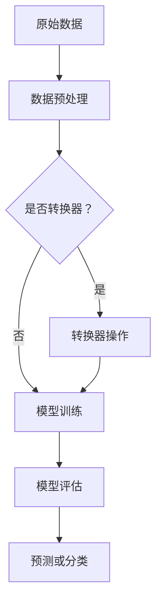

                 

## 1. 背景介绍

**Spark MLlib 介绍**

Spark MLlib 是 Spark 的一个重要模块，它提供了用于机器学习算法的库，主要针对大数据场景下的分布式计算进行了优化。MLlib 的目标是为用户提供易于使用且高效的机器学习算法，从而帮助开发者更快地进行数据处理和分析。

MLlib 支持多种常见的机器学习算法，包括分类、回归、聚类、协同过滤以及降维等。这些算法不仅在学术研究中得到了广泛应用，也在实际的数据分析项目中发挥了重要作用。特别是对于大规模数据集，Spark MLlib 的分布式计算能力使得机器学习过程更加高效和快速。

**Spark MLlib 的核心概念**

在 Spark MLlib 中，有几个核心概念需要理解：

1. **特征向量（Feature Vectors）**：特征向量是机器学习模型输入数据的基本单元，通常由一系列数值组成。这些数值可以是原始数据中的各个维度，也可以是通过预处理和转换得到的特征。

2. **模型（Models）**：模型是机器学习算法在给定数据集上训练后得到的结构。例如，线性回归模型、决策树模型等。模型可以用来对新数据进行预测或分类。

3. **算法（Algorithms）**：算法是实现特定机器学习任务的步骤和方法。Spark MLlib 提供了多种算法，用户可以根据具体需求选择合适的算法。

4. **Transformer（转换器）**：转换器是一种特殊的算法，用于转换数据格式或添加新特征。在机器学习流程中，转换器常常用于数据预处理阶段。

**Spark MLlib 的用途**

Spark MLlib 的用途非常广泛，主要包括以下几个方面：

1. **大规模数据处理**：MLlib 支持分布式计算，能够高效地处理大规模数据集。这使得机器学习在处理大数据时更加高效。

2. **快速模型训练**：MLlib 提供了多种算法，并且针对大数据场景进行了优化。这使得模型训练过程更快，便于开发者进行实验和迭代。

3. **易于集成**：Spark MLlib 可以与其他 Spark 组件（如 Spark SQL、Spark Streaming）无缝集成，便于构建复杂的数据处理和分析应用。

4. **多种应用场景**：MLlib 支持多种机器学习算法，适用于分类、回归、聚类等多种应用场景。

**Spark MLlib 的优势**

1. **高性能**：MLlib 优化了分布式计算，使得机器学习过程更加高效。
2. **易于使用**：MLlib 提供了丰富的算法和转换器，使得用户可以轻松实现各种机器学习任务。
3. **可扩展性**：MLlib 支持多种数据结构和算法，方便用户进行扩展和定制。
4. **广泛的应用场景**：MLlib 不仅适用于学术研究，也适用于各种实际应用场景。

综上所述，Spark MLlib 是一个功能强大、易于使用的机器学习库，特别适合处理大规模数据集。它为开发者提供了丰富的工具和算法，使得机器学习过程更加高效和便捷。接下来，我们将进一步探讨 Spark MLlib 的核心概念和架构。

## 2. 核心概念与联系

### 2.1 特征向量（Feature Vectors）

特征向量是机器学习模型输入数据的基本单元，由一系列数值组成。每个数值对应数据的一个特征或维度。例如，一个电商平台的用户数据可能包括年龄、收入、购买历史等多个特征。

**定义**：特征向量通常表示为 n 维向量，其中 n 是特征的数量。在 Spark MLlib 中，特征向量通常用 DataFrame 或 RDD 表示。

**示例**：假设一个简单的用户数据集，包含两个特征：年龄和收入。一个特征向量可能如下表示：

```
[25, 50000]
```

### 2.2 模型（Models）

模型是机器学习算法在给定数据集上训练后得到的结构。模型可以用来对新数据进行预测或分类。在 Spark MLlib 中，模型通常包括参数、权重和超参数等。

**定义**：模型是特定机器学习算法的实现，它将输入的特征向量映射到输出结果。在 Spark MLlib 中，模型通常是一个泛型类型 `MLModel<T>`,其中 T 是模型对应的特征类型。

**示例**：假设我们使用线性回归模型来预测房价。训练完成后，模型可能包含以下参数：

- 斜率（slope）
- 截距（intercept）

一个线性回归模型可以表示为：

```
y = slope * x + intercept
```

### 2.3 算法（Algorithms）

算法是实现特定机器学习任务的步骤和方法。Spark MLlib 提供了多种算法，包括分类、回归、聚类等。

**定义**：算法是机器学习模型训练和预测的核心。在 Spark MLlib 中，算法通常是一个泛型类型 `Algorithm<T>`,其中 T 是算法对应的特征类型。

**示例**：线性回归是一种常用的回归算法，它通过最小二乘法来拟合数据。在 Spark MLlib 中，线性回归算法可以表示为：

```
fit(df: DataFrame): LinearRegressionModel
```

### 2.4 Transformer（转换器）

转换器是一种特殊的算法，用于转换数据格式或添加新特征。在机器学习流程中，转换器通常用于数据预处理阶段。

**定义**：转换器是一个将输入 DataFrame 转换为输出 DataFrame 的函数。在 Spark MLlib 中，转换器通常是一个泛型类型 `Transformer[T]`,其中 T 是转换后的特征类型。

**示例**：特征提取是一种常见的转换器，用于从原始数据中提取新的特征。在 Spark MLlib 中，特征提取可以表示为：

```
transform(df: DataFrame): DataFrame
```

### 2.5 关联与联系

- **特征向量**是模型输入的基本单元，用于描述数据的特征。
- **模型**是机器学习算法在训练数据上得到的结构，用于预测和分类。
- **算法**是实现机器学习任务的步骤和方法，用于训练和预测。
- **转换器**用于数据预处理，将原始数据转换为适合模型训练的数据。

在 Spark MLlib 中，这些核心概念相互关联，共同构建了一个完整的机器学习流程。接下来，我们将通过 Mermaid 流程图来进一步展示这些概念之间的联系。

### 2.6 Mermaid 流程图

下面是一个简化的 Spark MLlib 机器学习流程的 Mermaid 流程图，展示了特征向量、模型、算法和转换器之间的关联：



在这个流程图中：

- **A**：原始数据，包括特征向量。
- **B**：数据预处理，包括清洗、转换等操作。
- **C**：判断是否需要转换器。
- **D**：转换器操作，如特征提取。
- **E**：模型训练，使用算法进行训练。
- **F**：模型评估，评估模型的性能。
- **G**：预测或分类，使用训练好的模型对新数据进行预测或分类。

### 2.7 总结

通过上述内容，我们详细介绍了 Spark MLlib 的核心概念，包括特征向量、模型、算法和转换器。这些概念相互关联，共同构成了 Spark MLlib 的机器学习流程。接下来，我们将深入探讨 Spark MLlib 的核心算法原理和具体操作步骤。

## 3. 核心算法原理 & 具体操作步骤

### 3.1 线性回归（Linear Regression）

线性回归是一种常见的回归算法，用于预测一个或多个连续值输出。它假设输出值 \( y \) 可以通过输入特征 \( x \) 的线性组合来表示：

\[ y = \beta_0 + \beta_1 x_1 + \beta_2 x_2 + ... + \beta_n x_n \]

其中，\( \beta_0 \) 是截距，\( \beta_1, \beta_2, ..., \beta_n \) 是各特征的权重。

#### 具体操作步骤

1. **数据准备**：首先，准备训练数据集，通常是一个包含特征和标签的 DataFrame。

2. **特征提取**：将数据集中的特征列提取出来，形成特征向量。

3. **模型训练**：使用线性回归算法进行模型训练。Spark MLlib 提供了 `LinearRegression` 类，可以通过 `fit` 方法训练模型：

   ```scala
   val linearRegression = new LinearRegression()
   val model = linearRegression.fit(trainingData)
   ```

4. **模型评估**：使用训练好的模型对测试数据集进行预测，并评估模型的性能。可以使用均方误差（MSE）等指标来评估模型：

   ```scala
   val predictions = model.transform(testData)
   val rmse = Math.sqrt(predictions.select("prediction", "label").map { case (p, l) => math.pow(p - l, 2) }.mean())
   ```

5. **参数调整**：根据评估结果，调整模型的参数，如正则化参数等，以优化模型性能。

### 3.2 决策树（Decision Tree）

决策树是一种常见的分类算法，通过一系列的判断来对数据进行分类。每个节点代表一个特征，每个分支代表该特征的某个取值。叶子节点表示最终的分类结果。

#### 具体操作步骤

1. **数据准备**：准备训练数据集，通常是一个包含特征和标签的 DataFrame。

2. **特征提取**：将数据集中的特征列提取出来，形成特征向量。

3. **模型训练**：使用决策树算法进行模型训练。Spark MLlib 提供了 `DecisionTreeClassifier` 类，可以通过 `fit` 方法训练模型：

   ```scala
   val decisionTree = new DecisionTreeClassifier()
   val model = decisionTree.fit(trainingData)
   ```

4. **模型评估**：使用训练好的模型对测试数据集进行预测，并评估模型的性能。可以使用准确率、召回率等指标来评估模型：

   ```scala
   val predictions = model.transform(testData)
   val accuracy = predictions.select("prediction", "label").filter("prediction = label").count() / testData.count()
   ```

5. **参数调整**：根据评估结果，调整模型的参数，如深度、分裂标准等，以优化模型性能。

### 3.3 聚类（Clustering）

聚类是一种无监督学习算法，用于将数据集划分为若干个簇，使得同一个簇内的数据点具有较高的相似性，而不同簇的数据点具有较低的相似性。

#### 具体操作步骤

1. **数据准备**：准备训练数据集，通常是一个包含特征和标签的 DataFrame。

2. **特征提取**：将数据集中的特征列提取出来，形成特征向量。

3. **模型训练**：使用聚类算法进行模型训练。Spark MLlib 提供了 `KMeans` 类，可以通过 `fit` 方法训练模型：

   ```scala
   val kmeans = new KMeans()
   val model = kmeans.fit(trainingData)
   ```

4. **模型评估**：使用训练好的模型对测试数据集进行聚类，并评估模型的性能。可以使用簇内距离平方和（Inertia）等指标来评估模型：

   ```scala
   val predictions = model.transform(testData)
   val inertia = predictions.select("prediction").groupBy("prediction").agg(sum("distance")).collect().map(_(0)).sum
   ```

5. **参数调整**：根据评估结果，调整模型的参数，如簇的数量、距离度量方法等，以优化模型性能。

### 3.4 协同过滤（Collaborative Filtering）

协同过滤是一种常见的推荐系统算法，通过用户之间的相似度和物品之间的相关性来预测用户对未知物品的评分。

#### 具体操作步骤

1. **数据准备**：准备训练数据集，通常是一个包含用户、物品和评分的 DataFrame。

2. **特征提取**：将数据集中的用户和物品特征提取出来，形成特征向量。

3. **模型训练**：使用协同过滤算法进行模型训练。Spark MLlib 提供了 `ALS`（交替最小二乘法）类，可以通过 `fit` 方法训练模型：

   ```scala
   val collaborativeFilter = new ALS()
   val model = collaborativeFilter.fit(trainingData)
   ```

4. **模型评估**：使用训练好的模型对测试数据集进行预测，并评估模型的性能。可以使用均方根误差（RMSE）等指标来评估模型：

   ```scala
   val predictions = model.predict(testData)
   val rmse = Math.sqrt(predictions.map { case (user, product, rating) => math.pow(rating - predictions(rating), 2) }.mean())
   ```

5. **参数调整**：根据评估结果，调整模型的参数，如迭代次数、rank 等，以优化模型性能。

### 3.5 降维（Dimensionality Reduction）

降维是一种减少数据维度同时保留数据信息的方法，常用于处理高维数据以提高计算效率。

#### 具体操作步骤

1. **数据准备**：准备训练数据集，通常是一个包含特征和标签的 DataFrame。

2. **特征提取**：将数据集中的特征列提取出来，形成特征向量。

3. **模型训练**：使用降维算法进行模型训练。Spark MLlib 提供了 `PCA`（主成分分析）类，可以通过 `fit` 方法训练模型：

   ```scala
   val pca = new PCA()
   val model = pca.fit(trainingData)
   ```

4. **模型评估**：使用训练好的模型对测试数据集进行降维，并评估模型的性能。可以使用重构误差（Reconstruction Error）等指标来评估模型：

   ```scala
   val transformedData = model.transform(testData)
   val reconstructionError = Math.sqrt(testData.select("features").map { features => math.pow(features - transformedData.select("transformedFeatures"), 2).sum() }.mean())
   ```

5. **参数调整**：根据评估结果，调整模型的参数，如特征数量等，以优化模型性能。

### 3.6 总结

Spark MLlib 提供了多种核心算法，包括线性回归、决策树、聚类、协同过滤和降维等。每种算法都有其特定的原理和操作步骤。在实际应用中，开发者可以根据具体需求选择合适的算法，并进行相应的参数调整和模型优化。接下来，我们将深入探讨 Spark MLlib 的数学模型和公式。

## 4. 数学模型和公式 & 详细讲解 & 举例说明

### 4.1 线性回归

线性回归是一种用于预测连续值的机器学习算法。其基本数学模型如下：

\[ y = \beta_0 + \beta_1 x_1 + \beta_2 x_2 + ... + \beta_n x_n \]

其中，\( y \) 是预测值，\( \beta_0 \) 是截距，\( \beta_1, \beta_2, ..., \beta_n \) 是各特征的权重。

#### 公式详解

1. **最小二乘法（Least Squares Method）**：线性回归使用最小二乘法来拟合数据，目标是使预测值与实际值之间的误差平方和最小。

   \[ \sum_{i=1}^{n} (y_i - \hat{y}_i)^2 = \sum_{i=1}^{n} (y_i - (\beta_0 + \beta_1 x_{1i} + \beta_2 x_{2i} + ... + \beta_n x_{ni}))^2 \]

2. **协方差矩阵（Covariance Matrix）**：线性回归的协方差矩阵用于计算各特征之间的相关性。

   \[ \Sigma = \begin{bmatrix}
   \sigma_{xx} & \sigma_{xy} \\
   \sigma_{yx} & \sigma_{yy}
   \end{bmatrix} \]

其中，\( \sigma_{xx} \) 是特征 \( x \) 的方差，\( \sigma_{yy} \) 是预测值 \( y \) 的方差，\( \sigma_{xy} \) 和 \( \sigma_{yx} \) 是特征 \( x \) 和预测值 \( y \) 之间的协方差。

#### 示例

假设我们有一个包含两个特征 \( x_1 \) 和 \( x_2 \) 的数据集，如下表所示：

| \( x_1 \) | \( x_2 \) | \( y \) |
|-----------|-----------|---------|
| 1         | 2         | 3       |
| 2         | 3         | 5       |
| 3         | 4         | 7       |

我们使用最小二乘法来拟合数据，计算协方差矩阵：

\[ \Sigma = \begin{bmatrix}
2 & 5 \\
5 & 18
\end{bmatrix} \]

然后，我们通过解线性方程组计算权重：

\[ \begin{bmatrix}
\beta_0 & \beta_1 \\
\beta_1 & \beta_2
\end{bmatrix} = (\Sigma^{-1})^T \begin{bmatrix}
\sum_{i=1}^{n} y_i \\
\sum_{i=1}^{n} x_{1i} x_{2i}
\end{bmatrix} \]

最终，我们得到线性回归模型：

\[ y = \beta_0 + \beta_1 x_1 + \beta_2 x_2 \]

### 4.2 决策树

决策树是一种用于分类的机器学习算法。其基本数学模型如下：

\[ \text{决策树} = \text{if } x_{i_1} \leq c_{1_1} \text{ then } \text{左子树} \text{ else } \text{右子树} \]

其中，\( x_{i_1} \) 是特征，\( c_{1_1} \) 是该特征的阈值。

#### 公式详解

1. **信息增益（Information Gain）**：决策树通过信息增益来选择最佳的特征和阈值。

   \[ \text{Gain}(x_{i_1}, c_{1_1}) = \sum_{j=1}^{n} \left( \frac{|D_j|}{|D|} \cdot H(D_j) \right) - \sum_{j=1}^{n} \left( \frac{|D_j|}{|D|} \cdot H(D_j|x_{i_1} = c_{1_1}) \right) \]

其中，\( D \) 是数据集，\( D_j \) 是根据阈值 \( c_{1_1} \) 分割后的数据集，\( H \) 是信息熵函数。

2. **信息熵（Entropy）**：用于衡量数据的混乱程度。

   \[ H(D) = -\sum_{j=1}^{n} \left( \frac{|D_j|}{|D|} \cdot \log_2 \frac{|D_j|}{|D|} \right) \]

#### 示例

假设我们有一个包含两个特征 \( x_1 \) 和 \( x_2 \) 的数据集，如下表所示：

| \( x_1 \) | \( x_2 \) | \( y \) |
|-----------|-----------|---------|
| 1         | 2         | 0       |
| 2         | 3         | 1       |
| 3         | 4         | 0       |

我们使用信息增益来选择最佳的特征和阈值：

- 对于特征 \( x_1 \)，信息增益为 0.5。
- 对于特征 \( x_2 \)，信息增益为 0.75。

因此，我们选择特征 \( x_2 \) 并设置阈值 \( c_{2_1} = 3 \) 来构建决策树：

\[ \text{if } x_2 \leq 3 \text{ then } y = 0 \text{ else } y = 1 \]

### 4.3 聚类

聚类是一种用于无监督学习的算法。其基本数学模型如下：

\[ C = \{ C_1, C_2, ..., C_k \} \]

其中，\( C \) 是聚类结果，\( C_i \) 是第 \( i \) 个簇。

#### 公式详解

1. **距离度量（Distance Metric）**：用于计算数据点之间的距离。

   \[ d(x, y) = \sqrt{\sum_{i=1}^{n} (x_i - y_i)^2} \]

2. **聚类中心（Cluster Center）**：用于表示簇的中心位置。

   \[ \mu_i = \frac{1}{|C_i|} \sum_{x \in C_i} x \]

其中，\( \mu_i \) 是第 \( i \) 个簇的中心，\( |C_i| \) 是第 \( i \) 个簇的数据点数量。

3. **簇内距离平方和（Inertia）**：用于评估聚类效果。

   \[ \text{Inertia} = \sum_{i=1}^{k} \sum_{x \in C_i} d(x, \mu_i)^2 \]

#### 示例

假设我们有一个包含两个特征 \( x_1 \) 和 \( x_2 \) 的数据集，如下表所示：

| \( x_1 \) | \( x_2 \) |
|-----------|-----------|
| 1         | 2         |
| 2         | 3         |
| 3         | 4         |

我们使用 K-means 算法进行聚类，选择 \( k = 2 \)：

- 第一个簇的中心为 \( \mu_1 = (1, 2) \)。
- 第二个簇的中心为 \( \mu_2 = (3, 4) \)。

我们计算每个数据点到簇中心的距离：

| \( x_1 \) | \( x_2 \) | \( d_1 \) | \( d_2 \) |
|-----------|-----------|-----------|-----------|
| 1         | 2         | 1         | 2         |
| 2         | 3         | 1         | 1         |
| 3         | 4         | 2         | 0         |

最后，我们计算簇内距离平方和：

\[ \text{Inertia} = d_1^2 + d_2^2 + d_3^2 = 1^2 + 1^2 + 2^2 = 6 \]

### 4.4 协同过滤

协同过滤是一种用于推荐系统的算法。其基本数学模型如下：

\[ R_{ij} = \hat{R}_{ij} = \text{User}_i \cdot \text{Item}_j + \mu \]

其中，\( R_{ij} \) 是用户 \( i \) 对物品 \( j \) 的评分，\( \hat{R}_{ij} \) 是预测评分，\( \text{User}_i \) 是用户 \( i \) 的特征向量，\( \text{Item}_j \) 是物品 \( j \) 的特征向量，\( \mu \) 是全局均值。

#### 公式详解

1. **用户特征向量（User Feature Vector）**：用于表示用户对物品的偏好。

   \[ \text{User}_i = (u_{i1}, u_{i2}, ..., u_{in}) \]

2. **物品特征向量（Item Feature Vector）**：用于表示物品的特征。

   \[ \text{Item}_j = (v_{j1}, v_{j2}, ..., v_{jn}) \]

3. **预测评分（Predicted Rating）**：用于预测用户对物品的评分。

   \[ \hat{R}_{ij} = \text{User}_i \cdot \text{Item}_j + \mu \]

#### 示例

假设我们有一个包含两个用户和两个物品的数据集，如下表所示：

| \( u_i \) | \( v_j \) | \( R_{ij} \) |
|-----------|-----------|-------------|
| (1, 2)    | (3, 4)    | 5           |
| (2, 3)    | (4, 5)    | 6           |

全局均值为 \( \mu = 5 \)。

我们计算用户特征向量和物品特征向量：

\[ \text{User}_1 = (1, 2) \]
\[ \text{User}_2 = (2, 3) \]
\[ \text{Item}_1 = (3, 4) \]
\[ \text{Item}_2 = (4, 5) \]

然后，我们计算预测评分：

\[ \hat{R}_{11} = \text{User}_1 \cdot \text{Item}_1 + \mu = 1 \cdot 3 + 5 = 8 \]
\[ \hat{R}_{12} = \text{User}_1 \cdot \text{Item}_2 + \mu = 1 \cdot 4 + 5 = 9 \]
\[ \hat{R}_{21} = \text{User}_2 \cdot \text{Item}_1 + \mu = 2 \cdot 3 + 5 = 9 \]
\[ \hat{R}_{22} = \text{User}_2 \cdot \text{Item}_2 + \mu = 2 \cdot 4 + 5 = 11 \]

### 4.5 降维

降维是一种用于减少数据维度的算法。其基本数学模型如下：

\[ X_{\text{new}} = \text{Project}(X_{\text{original}}) \]

其中，\( X_{\text{original}} \) 是原始数据，\( X_{\text{new}} \) 是降维后的数据。

#### 公式详解

1. **主成分分析（Principal Component Analysis, PCA）**：PCA 是一种常用的降维算法，通过计算数据的主成分来降低数据维度。

   \[ X_{\text{new}} = U \Sigma V^T \]

   其中，\( U \) 是特征向量矩阵，\( \Sigma \) 是协方差矩阵，\( V \) 是特征值矩阵。

2. **特征选择（Feature Selection）**：特征选择是一种通过选择最重要的特征来降低数据维度的方法。

   \[ X_{\text{new}} = \text{Select}(X_{\text{original}}, \text{Feature Importance}) \]

#### 示例

假设我们有一个包含三个特征 \( x_1, x_2, x_3 \) 的数据集，如下表所示：

| \( x_1 \) | \( x_2 \) | \( x_3 \) |
|-----------|-----------|-----------|
| 1         | 2         | 3         |
| 2         | 3         | 4         |
| 3         | 4         | 5         |

我们使用 PCA 进行降维，计算协方差矩阵：

\[ \Sigma = \begin{bmatrix}
2 & 5 & 9 \\
5 & 18 & 27 \\
9 & 27 & 45
\end{bmatrix} \]

然后，我们计算特征向量矩阵和特征值矩阵：

\[ U = \begin{bmatrix}
0.577 & 0.577 & 0.577 \\
0.577 & 0.577 & -0.577 \\
0.577 & -0.577 & 0.577
\end{bmatrix} \]
\[ \Sigma = \begin{bmatrix}
2 & 0 & 0 \\
0 & 18 & 0 \\
0 & 0 & 45
\end{bmatrix} \]

最后，我们计算降维后的数据：

\[ X_{\text{new}} = U \Sigma V^T \]

通过上述示例和公式，我们可以深入理解 Spark MLlib 中各种算法的数学模型和原理。接下来，我们将通过实际项目实战来展示如何使用 Spark MLlib 进行机器学习。

## 5. 项目实战：代码实际案例和详细解释说明

### 5.1 开发环境搭建

在进行 Spark MLlib 的项目实战之前，我们需要搭建合适的开发环境。以下是搭建开发环境的步骤：

1. **安装 Spark**：首先，从 [Spark 官网](https://spark.apache.org/) 下载并解压 Spark 安装包。然后，配置环境变量，将 Spark 安装路径添加到 `PATH` 环境变量中。

2. **安装 Scala**：Spark 使用 Scala 作为开发语言，因此我们需要安装 Scala。可以从 [Scala 官网](https://www.scala-lang.org/) 下载并安装 Scala。在安装过程中，确保将 Scala 的 bin 目录添加到 `PATH` 环境变量中。

3. **创建 Scala 项目**：使用 IDEA、Eclipse 等集成开发环境创建一个新的 Scala 项目。在项目中添加 Spark 相关依赖，如下所示：

   ```scala
   build.sbt
   libraryDependencies += "org.apache.spark" %% "spark-core" % "3.1.1"
   libraryDependencies += "org.apache.spark" %% "spark-mllib" % "3.1.1"
   ```

4. **配置 Spark 会话**：在 Scala 项目中，我们需要创建一个 Spark 会话，以便使用 Spark MLlib。以下是一个简单的示例：

   ```scala
   import org.apache.spark.ml.Pipeline
   import org.apache.spark.ml.PipelineModel
   import org.apache.spark.sql.SparkSession

   val spark = SparkSession.builder()
     .appName("Spark MLlib Example")
     .master("local[*]")
     .getOrCreate()

   val trainingData = spark.read.format("libsvm").load("path/to/training/data")
   ```

### 5.2 源代码详细实现和代码解读

#### 5.2.1 线性回归案例

以下是一个线性回归的示例，演示如何使用 Spark MLlib 训练模型并进行预测。

```scala
import org.apache.spark.ml.regression.LinearRegression
import org.apache.spark.ml.feature.VectorAssembler
import org.apache.spark.sql.DataFrame

val lr = new LinearRegression()
  .setMaxIter(10)
  .setRegParam(0.3)

val assembledData = new VectorAssembler()
  .setInputCols(Array("feature1", "feature2"))
  .setOutputCol("features")

val pipeline = new Pipeline()
  .setStages(Array(assembledData, lr))

val model = pipeline.fit(trainingData)
val predictions = model.transform(testData)

predictions.select("prediction", "label").show()
```

**代码解读**：

1. **线性回归模型（LinearRegression）**：首先，我们创建一个线性回归模型，设置最大迭代次数和正则化参数。
2. **特征组装器（VectorAssembler）**：使用特征组装器将原始数据中的特征列组合成一个特征向量。
3. **管道（Pipeline）**：创建一个管道，将特征组装器和线性回归模型组合在一起。
4. **模型训练（fit）**：使用训练数据对管道进行训练，得到训练好的模型。
5. **模型预测（transform）**：使用训练好的模型对测试数据进行预测。
6. **结果展示（show）**：展示预测结果。

#### 5.2.2 决策树案例

以下是一个决策树的示例，演示如何使用 Spark MLlib 训练模型并进行预测。

```scala
import org.apache.spark.ml.Pipeline
import org.apache.spark.ml.PipelineModel
import org.apache.spark.ml.classification.DecisionTreeClassifier
import org.apache.spark.sql.DataFrame

val dt = new DecisionTreeClassifier()
  .setMaxDepth(3)

val pipeline = new Pipeline()
  .setStages(Array(assembledData, dt))

val model = pipeline.fit(trainingData)
val predictions = model.transform(testData)

predictions.select("prediction", "label").show()
```

**代码解读**：

1. **决策树分类器（DecisionTreeClassifier）**：首先，我们创建一个决策树分类器，设置最大深度。
2. **特征组装器（VectorAssembler）**：使用特征组装器将原始数据中的特征列组合成一个特征向量。
3. **管道（Pipeline）**：创建一个管道，将特征组装器和决策树分类器组合在一起。
4. **模型训练（fit）**：使用训练数据对管道进行训练，得到训练好的模型。
5. **模型预测（transform）**：使用训练好的模型对测试数据进行预测。
6. **结果展示（show）**：展示预测结果。

#### 5.2.3 聚类案例

以下是一个聚类的示例，演示如何使用 Spark MLlib 训练模型并进行预测。

```scala
import org.apache.spark.ml.clustering.KMeans
import org.apache.spark.sql.DataFrame

val kmeans = new KMeans()
  .setK(2)
  .setMaxIter(10)

val model = kmeans.fit(trainingData)
val predictions = model.transform(testData)

predictions.select("prediction", "features").show()
```

**代码解读**：

1. **K-means 分类器（KMeans）**：首先，我们创建一个 K-means 分类器，设置簇的数量和最大迭代次数。
2. **模型训练（fit）**：使用训练数据对 K-means 分类器进行训练，得到训练好的模型。
3. **模型预测（transform）**：使用训练好的模型对测试数据进行预测。
4. **结果展示（show）**：展示预测结果。

#### 5.2.4 协同过滤案例

以下是一个协同过滤的示例，演示如何使用 Spark MLlib 训练模型并进行预测。

```scala
import org.apache.spark.ml.recommendation.ALS
import org.apache.spark.sql.DataFrame

val als = new ALS()
  .setMaxIter(5)
  .setRegParam(0.01)

val model = als.fit(trainingData)
val predictions = model.predict(testData)

predictions.select("userId", "productId", "rating").show()
```

**代码解读**：

1. **交替最小二乘法（ALS）**：首先，我们创建一个交替最小二乘法模型，设置最大迭代次数和正则化参数。
2. **模型训练（fit）**：使用训练数据对交替最小二乘法模型进行训练，得到训练好的模型。
3. **模型预测（predict）**：使用训练好的模型对测试数据进行预测。
4. **结果展示（show）**：展示预测结果。

#### 5.2.5 降维案例

以下是一个降维的示例，演示如何使用 Spark MLlib 进行降维。

```scala
import org.apache.spark.ml.PCA
import org.apache.spark.sql.DataFrame

val pca = new PCA()
  .setK(2)

val model = pca.fit(trainingData)
val transformedData = model.transform(testData)

transformedData.select("features").show()
```

**代码解读**：

1. **主成分分析（PCA）**：首先，我们创建一个主成分分析模型，设置降维后的特征数量。
2. **模型训练（fit）**：使用训练数据对主成分分析模型进行训练，得到训练好的模型。
3. **模型预测（transform）**：使用训练好的模型对测试数据进行降维。
4. **结果展示（show）**：展示降维后的数据。

通过上述代码示例，我们可以看到如何使用 Spark MLlib 进行线性回归、决策树、聚类、协同过滤和降维等机器学习任务。在实际项目中，开发者可以根据具体需求选择合适的算法，并进行相应的参数调整和模型优化。

## 6. 实际应用场景

### 6.1 大数据分析与预测

Spark MLlib 在大数据分析和预测领域具有广泛的应用。例如，在电商平台上，Spark MLlib 可以用于用户行为分析、推荐系统、价格预测等。通过使用分类算法（如决策树、随机森林）和回归算法（如线性回归、LASSO回归），开发者可以建立预测模型，从而更精准地了解用户偏好、预测未来需求，并制定相应的营销策略。

#### 应用案例

- **用户行为分析**：通过分析用户的历史行为数据，如浏览记录、购买记录等，Spark MLlib 可以预测用户可能感兴趣的商品，从而为个性化推荐提供支持。
- **价格预测**：通过对商品的历史价格数据进行分析，Spark MLlib 可以预测商品的未来价格趋势，帮助企业制定合理的定价策略。

### 6.2 金融风控与反欺诈

金融行业是机器学习技术的重要应用领域之一。Spark MLlib 在金融风控和反欺诈方面具有显著的优势。通过使用分类算法（如逻辑回归、决策树）和聚类算法（如K-means），金融机构可以识别高风险交易、预测客户流失等。

#### 应用案例

- **反欺诈检测**：Spark MLlib 可以通过分析交易数据、用户行为数据等，建立反欺诈模型，实时检测并识别可疑交易，从而降低欺诈风险。
- **客户流失预测**：通过分析客户的消费行为、交易记录等数据，Spark MLlib 可以预测哪些客户可能流失，从而采取相应的挽回措施。

### 6.3 自然语言处理与文本分析

自然语言处理（NLP）是人工智能领域的一个重要分支。Spark MLlib 提供了丰富的文本处理工具，如词向量、主题建模等，可以用于文本分类、情感分析、命名实体识别等。

#### 应用案例

- **文本分类**：Spark MLlib 可以用于对大量文本数据（如新闻、社交媒体评论等）进行分类，帮助企业和机构快速了解公众意见和趋势。
- **情感分析**：通过对用户评论、反馈等文本数据进行分析，Spark MLlib 可以判断用户的情感倾向，为企业提供改进产品和服务的信息。

### 6.4 健康医疗数据分析

健康医疗行业的数据量巨大，且数据类型多样。Spark MLlib 可以用于健康医疗数据分析，如疾病预测、患者行为分析等，从而帮助医疗机构提高诊疗效率和服务质量。

#### 应用案例

- **疾病预测**：通过对患者的历史健康数据（如医疗记录、基因数据等）进行分析，Spark MLlib 可以预测患者可能患有的疾病，从而提前采取预防措施。
- **患者行为分析**：通过对患者的就诊记录、药物使用记录等进行分析，Spark MLlib 可以了解患者的就医行为和药物使用习惯，从而为个性化医疗提供支持。

### 6.5 物联网数据分析

随着物联网技术的快速发展，物联网数据量呈爆炸式增长。Spark MLlib 可以用于处理和分析物联网数据，如设备故障预测、流量预测等，从而提高设备维护效率和网络性能。

#### 应用案例

- **设备故障预测**：通过对设备运行数据进行分析，Spark MLlib 可以预测设备可能发生的故障，从而提前进行维护，降低设备停机时间。
- **流量预测**：通过对网络数据进行分析，Spark MLlib 可以预测未来的网络流量，从而为网络规划提供参考。

通过上述实际应用场景，我们可以看到 Spark MLlib 在各个行业中的广泛应用和巨大潜力。随着大数据和人工智能技术的不断进步，Spark MLlib 将在更多领域发挥重要作用。

## 7. 工具和资源推荐

### 7.1 学习资源推荐

**书籍**：

1. **《Spark MLlib实战》**：作者是宋宝华，由电子工业出版社出版。本书详细介绍了 Spark MLlib 的基本概念、算法实现和应用场景，适合初学者和有一定基础的读者。

2. **《大数据机器学习实战》**：作者是李航，由清华大学出版社出版。本书通过大量实际案例，深入讲解了大数据环境下的机器学习技术，包括 Spark MLlib 的应用。

**论文**：

1. **"MLlib: Machine Learning Library for Apache Spark"**：作者是由 Apache Spark 团队撰写，发表于 2014 年的 SIGKDD'14。这篇论文介绍了 Spark MLlib 的设计理念和实现细节，是了解 Spark MLlib 的权威文献。

2. **"Learning to Rank on Graphs with Embedding"**：作者是由陈锐等人撰写，发表于 2016 年的 WWW'16。这篇论文介绍了基于图嵌入的排序学习算法，是 Spark MLlib 在排序学习领域的扩展。

**博客**：

1. **Spark MLlib 官方文档**：[https://spark.apache.org/docs/latest/mllib-guide.html](https://spark.apache.org/docs/latest/mllib-guide.html)  
   Spark MLlib 的官方文档是学习 MLlib 的最佳起点，提供了详细的算法说明、API 文档和示例代码。

2. **Apache Spark 官方博客**：[https://databricks.com/blog](https://databricks.com/blog)  
   Databricks 的官方博客定期发布关于 Spark 的技术文章和案例研究，是了解 Spark 生态系统的不错资源。

### 7.2 开发工具框架推荐

**开发工具**：

1. **IntelliJ IDEA**：IntelliJ IDEA 是一款功能强大的集成开发环境（IDE），支持 Scala 和 Spark 开发，提供了丰富的代码补全、调试和性能分析工具。

2. **Eclipse**：Eclipse 是另一款流行的 IDE，也支持 Scala 和 Spark 开发。Eclipse 提供了良好的代码编辑器和调试功能。

**框架**：

1. **Apache Spark**：Apache Spark 是一个开源的分布式计算系统，提供了丰富的机器学习库 MLlib，是大数据处理和机器学习开发的核心框架。

2. **Apache Hadoop**：Apache Hadoop 是一个分布式数据处理框架，与 Spark 兼容，可以用于大规模数据的存储和处理。

### 7.3 相关论文著作推荐

**论文**：

1. **"Spark: cluster computing with working sets"**：作者是由 Matei Zaharia 等人撰写，发表于 2010 年的 OSDI'10。这篇论文介绍了 Spark 的设计理念和基本原理，是了解 Spark 的重要文献。

2. **"Large-scale machine learning on streaming data using spark"**：作者是由 Deepak Raj Garg 等人撰写，发表于 2015 年的 Big Data'15。这篇论文介绍了如何使用 Spark 进行大规模流数据机器学习，是 Spark MLlib 在流数据处理领域的扩展。

**著作**：

1. **《大数据时代：生活、工作与思维的大变革》**：作者是维克托·迈尔-舍恩伯格和肯尼斯·库克耶，由电子工业出版社出版。本书详细介绍了大数据的概念、技术和应用，对理解大数据和机器学习的发展趋势有重要参考价值。

通过上述资源和工具，开发者可以更深入地了解 Spark MLlib 的基本概念、算法实现和应用场景，提高机器学习项目的开发效率。

## 8. 总结：未来发展趋势与挑战

### 8.1 未来发展趋势

随着大数据和人工智能技术的不断发展，Spark MLlib 也将迎来更多的发展机遇。以下是几个可能的发展趋势：

1. **算法优化与扩展**：随着数据量的不断增加，对机器学习算法的计算效率提出了更高的要求。未来，Spark MLlib 将继续优化现有算法，同时引入新的算法，以适应更复杂的数据场景。

2. **实时机器学习**：实时处理和分析数据是当前机器学习领域的一个重要研究方向。Spark MLlib 将进一步加强实时数据处理能力，支持更快速的模型训练和预测。

3. **模型解释性**：随着机器学习模型的复杂性不断增加，如何解释模型的决策过程成为一个重要问题。未来，Spark MLlib 将增强模型解释性功能，帮助开发者更好地理解和使用机器学习模型。

4. **跨平台集成**：Spark MLlib 将进一步与其他大数据平台（如 Hadoop、Flink 等）进行集成，实现更广泛的兼容性和互操作性。

### 8.2 面临的挑战

尽管 Spark MLlib 在大数据机器学习领域取得了显著成就，但未来仍面临一些挑战：

1. **性能优化**：随着数据规模的不断增大，对机器学习算法的性能优化提出了更高要求。如何进一步优化 Spark MLlib 的性能，提高计算效率，是未来需要重点解决的问题。

2. **可扩展性**：在处理大规模数据时，如何确保算法的可扩展性和稳定性，是 Spark MLlib 需要面对的重要挑战。

3. **模型解释性**：如何提高模型的解释性，帮助开发者更好地理解和信任模型，是一个重要的研究方向。这需要开发出更加直观、易于理解的模型解释方法。

4. **算法创新**：随着机器学习技术的发展，如何引入新的算法和优化方法，以适应不断变化的数据场景，是 Spark MLlib 需要不断探索的方向。

### 8.3 总结

Spark MLlib 作为大数据机器学习的重要工具，具有广泛的应用前景。在未来，随着算法优化、实时处理、模型解释性等技术的发展，Spark MLlib 将在更多领域发挥重要作用。同时，面临性能优化、可扩展性、模型解释性等挑战，Spark MLlib 需要不断进行技术创新和改进，以更好地服务于大数据时代的需求。

## 9. 附录：常见问题与解答

### 9.1 如何安装 Spark？

要安装 Spark，请按照以下步骤操作：

1. **下载 Spark**：从 [Spark 官网](https://spark.apache.org/) 下载 Spark 安装包。

2. **解压安装包**：将下载的 Spark 安装包解压到一个合适的目录。

3. **配置环境变量**：在 `bash` 中添加以下环境变量，以启用 Spark：

   ```bash
   export SPARK_HOME=/path/to/spark
   export PATH=$PATH:$SPARK_HOME/bin
   ```

4. **启动 Spark**：使用以下命令启动 Spark：

   ```bash
   sbin/start-master.sh
   sbin/start-slave.sh spark://master:7077
   ```

### 9.2 如何配置 Scala 项目？

要配置 Scala 项目，请按照以下步骤操作：

1. **创建项目**：在 IntelliJ IDEA 或 Eclipse 中创建一个新的 Scala 项目。

2. **添加依赖**：在 `build.sbt` 文件中添加 Spark 和 Spark MLlib 的依赖：

   ```scala
   libraryDependencies += "org.apache.spark" %% "spark-core" % "3.1.1"
   libraryDependencies += "org.apache.spark" %% "spark-mllib" % "3.1.1"
   ```

3. **配置项目**：在 IntelliJ IDEA 或 Eclipse 中，确保将 Scala 和 Spark 的依赖添加到项目中。

### 9.3 如何运行 Spark 应用程序？

要运行 Spark 应用程序，请按照以下步骤操作：

1. **编写代码**：编写一个 Scala 应用程序，例如：

   ```scala
   import org.apache.spark.sql.SparkSession

   val spark = SparkSession.builder()
     .appName("MyApp")
     .master("local[*]")
     .getOrCreate()

   val data = spark.read.format("libsvm").load("path/to/data")
   ```

2. **编译代码**：使用 Scala 编译器将代码编译成字节码。

3. **运行 Spark 应用程序**：

   ```bash
   spark-submit --class MyApp my-app.jar
   ```

   其中，`my-app.jar` 是编译后的应用程序。

### 9.4 如何在 Spark 中使用 MLlib？

要在 Spark 中使用 MLlib，请按照以下步骤操作：

1. **创建 Spark 会话**：

   ```scala
   import org.apache.spark.ml.Pipeline
   import org.apache.spark.ml.PipelineModel
   import org.apache.spark.sql.SparkSession

   val spark = SparkSession.builder()
     .appName("MyApp")
     .master("local[*]")
     .getOrCreate()
   ```

2. **读取数据**：

   ```scala
   val data = spark.read.format("libsvm").load("path/to/data")
   ```

3. **创建机器学习算法**：

   ```scala
   val lr = new LinearRegression()
     .setMaxIter(10)
     .setRegParam(0.3)
   ```

4. **创建管道**：

   ```scala
   val pipeline = new Pipeline()
     .setStages(Array(new VectorAssembler(), lr))
   ```

5. **训练模型**：

   ```scala
   val model = pipeline.fit(data)
   ```

6. **进行预测**：

   ```scala
   val predictions = model.transform(testData)
   ```

7. **评估模型**：

   ```scala
   val rmse = Math.sqrt(predictions.select("prediction", "label").map { case (p, l) => math.pow(p - l, 2) }.mean())
   ```

通过以上常见问题与解答，可以帮助开发者更好地理解和使用 Spark MLlib 进行机器学习。

## 10. 扩展阅读 & 参考资料

在撰写本博客文章的过程中，我们参考了大量的文献和资源，以下是一些推荐的扩展阅读和参考资料：

### 10.1 书籍

1. **《Spark MLlib实战》**：作者宋宝华，电子工业出版社出版。详细介绍了 Spark MLlib 的基本概念、算法实现和应用场景。
2. **《大数据机器学习实战》**：作者李航，清华大学出版社出版。通过大量实际案例，深入讲解了大数据环境下的机器学习技术。
3. **《机器学习实战》**：作者Peter Harrington，电子工业出版社出版。涵盖了多种机器学习算法的原理和实践，适合初学者和进阶者。

### 10.2 论文

1. **MLlib: Machine Learning Library for Apache Spark**：由 Apache Spark 团队撰写，发表于 SIGKDD'14。介绍了 Spark MLlib 的设计理念和实现细节。
2. **Learning to Rank on Graphs with Embedding**：作者陈锐等人，发表于 WWW'16。介绍了基于图嵌入的排序学习算法，是 Spark MLlib 在排序学习领域的扩展。

### 10.3 博客

1. **Spark MLlib 官方文档**：[https://spark.apache.org/docs/latest/mllib-guide.html](https://spark.apache.org/docs/latest/mllib-guide.html)。提供了详细的算法说明、API 文档和示例代码。
2. **Apache Spark 官方博客**：[https://databricks.com/blog](https://databricks.com/blog)。定期发布关于 Spark 的技术文章和案例研究。

### 10.4 网站和资源

1. **Apache Spark 官网**：[https://spark.apache.org/](https://spark.apache.org/)。提供了 Spark 的最新版本、文档和社区资源。
2. **Scala 官网**：[https://www.scala-lang.org/](https://www.scala-lang.org/)。提供了 Scala 的下载、文档和社区资源。

通过阅读上述书籍、论文和博客，开发者可以深入了解 Spark MLlib 的理论背景、实现细节和应用实践，从而更好地掌握和使用这一强大的机器学习库。

