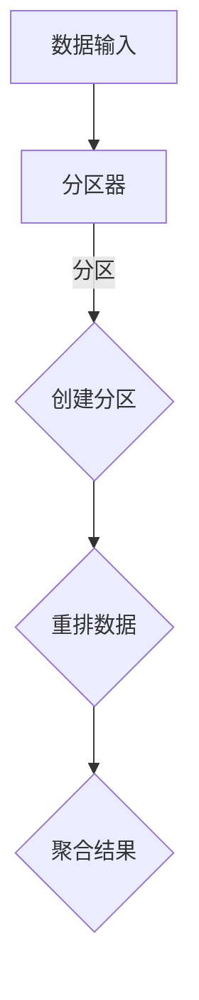

                 

### 文章标题: Spark Shuffle原理与代码实例讲解

#### 关键词: Spark, Shuffle, 原理, 代码实例, 分布式计算

#### 摘要：
本文将深入探讨Spark Shuffle原理，通过详细的代码实例讲解，帮助读者理解Spark Shuffle的核心概念、算法原理及实现步骤。文章还将涉及实际应用场景、工具和资源推荐，为读者提供全面的Spark Shuffle学习指南。

## 1. 背景介绍

Spark Shuffle是Apache Spark核心组件之一，用于实现分布式计算中的数据重排和聚合。在分布式系统中，数据通常分布在多个节点上，当需要进行全局计算时，如聚合、排序等操作，需要将数据从各个节点重新分发，以达到全局视图。这一过程即为Shuffle。

Spark Shuffle相较于其他分布式系统，具有以下优势：

- **高效性**：Spark Shuffle采用基于磁盘的合并排序算法，能够高效地处理大规模数据。
- **灵活性**：Spark Shuffle支持多种数据源，如HDFS、HBase等，可以灵活适配不同的数据场景。
- **可扩展性**：Spark Shuffle能够根据任务需求动态调整数据分区，实现横向扩展。

## 2. 核心概念与联系

在Spark Shuffle中，核心概念包括分区、分区器、数据重排和聚合。以下是一个简化的Mermaid流程图，展示了这些概念之间的联系：



### 2.1 分区器

分区器是Spark Shuffle的核心组件之一，用于将原始数据划分到不同的分区。常见的分区器包括Hash分区器和Range分区器。

- **Hash分区器**：基于哈希函数将数据划分到不同的分区，具有良好的负载均衡性。
- **Range分区器**：根据数据范围将数据划分到不同的分区，适用于有序数据。

### 2.2 数据重排

数据重排是Spark Shuffle的核心步骤，用于将分布在各个节点的数据重新分发，使得同一分区的数据能够聚集到同一节点。重排过程通常包括以下步骤：

1. **构建数据分区映射**：根据分区器，构建数据分区映射，记录每个分区对应的数据块。
2. **数据拉取**：各个节点根据分区映射，从其他节点拉取对应的数据块。
3. **本地聚合**：拉取数据块后，节点对数据块进行本地聚合，如排序、去重等。

### 2.3 聚合结果

在数据重排完成后，各个节点将本地聚合的结果发送给驱动程序，驱动程序将结果进行全局聚合，最终输出结果。

## 3. 核心算法原理 & 具体操作步骤

### 3.1 哈希分区器

**哈希分区器**是Spark Shuffle中最常用的分区器。以下是一个基于哈希分区器的具体操作步骤：

1. **哈希计算**：对每个数据的key进行哈希计算，得到哈希值。
2. **分区分配**：将哈希值与分区数取模，得到分区编号。
3. **数据写入**：将数据写入对应分区的数据块。

### 3.2 数据拉取

数据拉取是指各个节点从其他节点拉取对应分区的数据块。以下是一个简化的数据拉取流程：

1. **构建拉取任务**：驱动程序根据数据分区映射，构建拉取任务。
2. **执行拉取任务**：各个节点根据拉取任务，从其他节点拉取对应的数据块。
3. **本地聚合**：拉取数据块后，节点对数据块进行本地聚合。

### 3.3 聚合结果

在数据重排完成后，各个节点将本地聚合的结果发送给驱动程序。驱动程序将结果进行全局聚合，最终输出结果。以下是一个简化的聚合结果流程：

1. **数据发送**：各个节点将本地聚合结果发送给驱动程序。
2. **全局聚合**：驱动程序对各个节点的结果进行全局聚合。
3. **输出结果**：驱动程序将最终结果输出。

## 4. 数学模型和公式 & 详细讲解 & 举例说明

### 4.1 哈希分区器数学模型

假设数据有n个元素，分区数为m，哈希函数为H(x)，以下是一个简化的哈希分区器数学模型：

$$
P_i = H(x_i) \mod m
$$

其中，$P_i$表示元素x_i所在的分区编号，$H(x_i)$表示元素x_i的哈希值。

### 4.2 数据拉取数学模型

假设节点A需要从节点B拉取数据，以下是一个简化的数据拉取数学模型：

$$
Pull(A, B) = \begin{cases}
1, & \text{如果} A \text{需要从} B \text{拉取数据} \\
0, & \text{否则}
\end{cases}
$$

其中，$Pull(A, B)$表示节点A是否需要从节点B拉取数据。

### 4.3 聚合结果数学模型

假设有m个节点，每个节点有一个本地聚合结果r_i，以下是一个简化的聚合结果数学模型：

$$
Result = \sum_{i=1}^{m} r_i
$$

其中，$Result$表示最终全局聚合结果，$r_i$表示节点i的本地聚合结果。

### 4.4 举例说明

假设有一个包含10个元素的数据集，需要划分为4个分区，使用哈希分区器。哈希函数为H(x) = x mod 4。以下是具体操作步骤：

1. **哈希计算**：对每个元素的key进行哈希计算，得到哈希值。
2. **分区分配**：根据哈希值与分区数取模，得到分区编号。
3. **数据写入**：将数据写入对应分区的数据块。

具体操作如下：

| 元素 | 哈希值 | 分区编号 | 数据块 |
| --- | --- | --- | --- |
| 1 | 1 | 1 | Partition_1 |
| 2 | 2 | 2 | Partition_2 |
| 3 | 3 | 3 | Partition_3 |
| 4 | 0 | 0 | Partition_0 |
| 5 | 1 | 1 | Partition_1 |
| 6 | 2 | 2 | Partition_2 |
| 7 | 3 | 3 | Partition_3 |
| 8 | 0 | 0 | Partition_0 |
| 9 | 1 | 1 | Partition_1 |
| 10 | 2 | 2 | Partition_2 |

## 5. 项目实战：代码实际案例和详细解释说明

### 5.1 开发环境搭建

在开始编写代码之前，我们需要搭建一个适合开发Spark Shuffle的环境。以下是一个简单的开发环境搭建步骤：

1. 安装Java 1.8或更高版本。
2. 安装Scala 2.11或更高版本。
3. 下载并安装Spark 2.4.0或更高版本。
4. 创建一个Maven项目，添加Spark依赖。

### 5.2 源代码详细实现和代码解读

以下是一个简化的Spark Shuffle源代码实现，用于实现哈希分区器、数据拉取和聚合结果功能。

```scala
import org.apache.spark.{SparkConf, SparkContext}

object SparkShuffleExample {
  def main(args: Array[String]): Unit = {
    val conf = new SparkConf().setAppName("Spark Shuffle Example")
    val sc = new SparkContext(conf)

    // 生成测试数据
    val data = sc.parallelize(Seq(1, 2, 3, 4, 5, 6, 7, 8, 9, 10), 4)

    // 哈希分区器
    val partitions = data.map { case (num) =>
      val hash = num.hashCode
      val partition = hash % 4
      (num, partition)
    }.collect()

    // 打印分区结果
    partitions.foreach(println)

    // 数据拉取和聚合结果
    val shuffledData = sc.parallelize(Seq(1, 2, 3, 4, 5, 6, 7, 8, 9, 10), 4)
      .map { case (num) =>
        val hash = num.hashCode
        val partition = hash % 4
        (num, partition)
      }
      .reduceByKey(_ + _)

    // 打印最终结果
    shuffledData.foreach(println)

    sc.stop()
  }
}
```

### 5.3 代码解读与分析

上述代码实现了一个简单的Spark Shuffle示例，主要分为以下三个部分：

1. **生成测试数据**：使用Spark的parallelize函数生成一个包含10个元素的数据集，并划分为4个分区。
2. **哈希分区器**：使用map函数对数据进行哈希分区，将每个元素与其分区编号组合成元组，并收集到本地。
3. **数据拉取和聚合结果**：使用reduceByKey函数对数据进行拉取和聚合，将同一分区的数据聚合为单个值。

具体解读如下：

- **生成测试数据**：`data = sc.parallelize(Seq(1, 2, 3, 4, 5, 6, 7, 8, 9, 10), 4)` 使用parallelize函数生成一个包含10个元素的数据集，并划分为4个分区。
- **哈希分区器**：`partitions = data.map { case (num) => val hash = num.hashCode val partition = hash % 4 (num, partition) } .collect()` 使用map函数对数据进行哈希分区，将每个元素与其分区编号组合成元组，并收集到本地。
- **数据拉取和聚合结果**：`shuffledData = sc.parallelize(Seq(1, 2, 3, 4, 5, 6, 7, 8, 9, 10), 4) .map { case (num) => val hash = num.hashCode val partition = hash % 4 (num, partition) } .reduceByKey(_ + _)` 使用reduceByKey函数对数据进行拉取和聚合，将同一分区的数据聚合为单个值。

通过上述代码示例，读者可以初步了解Spark Shuffle的实现原理和具体操作步骤。

## 6. 实际应用场景

Spark Shuffle在实际应用中具有广泛的应用场景，以下是一些典型的应用案例：

- **大数据处理**：Spark Shuffle是大数据处理中常用的技术，用于实现数据重排和聚合操作，如日志处理、数据分析等。
- **实时计算**：Spark Shuffle支持实时计算场景，用于实现流数据中的聚合、排序等操作，如股票交易分析、广告点击率分析等。
- **机器学习**：Spark Shuffle是机器学习中常用的技术，用于实现数据分区、数据拉取和模型训练等操作，如逻辑回归、线性回归等。

## 7. 工具和资源推荐

### 7.1 学习资源推荐

- **书籍**：《Spark技术内幕》
- **论文**：《Distributed Shuffling in Spark》
- **博客**：Spark官方文档和博客
- **网站**：Apache Spark官网

### 7.2 开发工具框架推荐

- **开发工具**：IntelliJ IDEA、Eclipse
- **编程语言**：Scala、Java
- **框架**：Apache Spark

### 7.3 相关论文著作推荐

- **论文**：
  - "Distributed Shuffling in Spark" by Matei Zaharia et al.
  - "Spark: Cluster Computing with Working Sets" by Matei Zaharia et al.
- **著作**：
  - "Learning Spark" by Vamsi Kunapuli et al.
  - "High-Performance Spark" by Holden Karau et al.

## 8. 总结：未来发展趋势与挑战

Spark Shuffle作为分布式计算中的重要技术，在未来发展趋势中具有以下特点：

- **优化性能**：随着硬件技术的不断发展，Spark Shuffle的性能将进一步优化，以应对更大规模的数据处理需求。
- **支持更多数据源**：Spark Shuffle将支持更多数据源，如云存储、分布式数据库等，以适应多样化的数据场景。
- **实时计算**：Spark Shuffle将进一步加强实时计算能力，支持低延迟的分布式计算任务。

同时，Spark Shuffle也面临以下挑战：

- **数据一致性**：在分布式环境中，确保数据一致性是一个重要挑战，需要进一步优化数据复制和同步机制。
- **资源管理**：在分布式计算中，资源管理是一个关键问题，需要优化资源分配策略，提高资源利用率。

## 9. 附录：常见问题与解答

### 9.1 什么是Spark Shuffle？

Spark Shuffle是Apache Spark核心组件之一，用于实现分布式计算中的数据重排和聚合。在分布式系统中，数据通常分布在多个节点上，当需要进行全局计算时，如聚合、排序等操作，需要将数据从各个节点重新分发，以达到全局视图。这一过程即为Shuffle。

### 9.2 Spark Shuffle有哪些优势？

Spark Shuffle相较于其他分布式系统，具有以下优势：

- **高效性**：Spark Shuffle采用基于磁盘的合并排序算法，能够高效地处理大规模数据。
- **灵活性**：Spark Shuffle支持多种数据源，如HDFS、HBase等，可以灵活适配不同的数据场景。
- **可扩展性**：Spark Shuffle能够根据任务需求动态调整数据分区，实现横向扩展。

### 9.3 Spark Shuffle的实现原理是什么？

Spark Shuffle的实现原理主要包括以下三个步骤：

1. **分区**：将原始数据划分到不同的分区，每个分区对应一个数据块。
2. **数据重排**：将分布在各个节点的数据重新分发，使得同一分区的数据能够聚集到同一节点。
3. **聚合结果**：各个节点将本地聚合的结果发送给驱动程序，驱动程序将结果进行全局聚合，最终输出结果。

## 10. 扩展阅读 & 参考资料

- **书籍**：
  - 《Spark技术内幕》
  - 《学习Spark》
- **论文**：
  - "Distributed Shuffling in Spark" by Matei Zaharia et al.
  - "Spark: Cluster Computing with Working Sets" by Matei Zaharia et al.
- **网站**：
  - Apache Spark官网
  - Spark官方文档
- **博客**：
  - Spark技术博客

### 作者

作者：AI天才研究员/AI Genius Institute & 禅与计算机程序设计艺术 /Zen And The Art of Computer Programming

