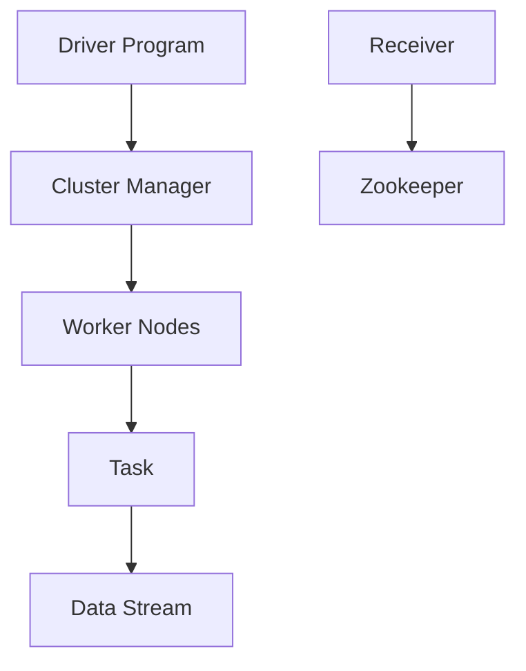

                 

### 文章标题：Spark Streaming 原理与代码实例讲解

#### 关键词：Spark Streaming，实时数据处理，流计算框架，分布式系统，微批处理，消息队列，数据流处理

#### 摘要：

本文深入探讨了Spark Streaming的原理及其在实际应用中的重要性。我们将从背景介绍开始，逐步深入核心概念、算法原理、数学模型，最后通过代码实例详细讲解其实现和应用。读者将了解到Spark Streaming在分布式系统中的优势，以及如何利用其进行高效的数据流处理。

### 1. 背景介绍

#### 1.1 Spark Streaming的起源

Spark Streaming是Apache Spark的一个组件，用于实现实时数据处理。它基于Spark的核心引擎，利用微批处理（Micro-batching）机制，使得实时数据可以以流的形式进行处理。Spark Streaming的起源可以追溯到2009年，由Berkeley大学的Matei Zaharia和他的团队开发，随后在2010年作为Apache Spark的一部分被开源出来。

#### 1.2 Spark Streaming在分布式系统中的应用

随着互联网和大数据的迅猛发展，实时数据处理的需求日益增加。分布式系统因其可扩展性和高容错性，成为处理大规模数据流的首选方案。Spark Streaming通过其分布式架构，能够在多个节点上进行并行计算，有效地处理实时数据流。

#### 1.3 Spark Streaming的优势

1. **高效性**：Spark Streaming利用了Spark的核心引擎，能够在内存中进行计算，大大提高了数据处理效率。
2. **易用性**：Spark Streaming提供了简单易懂的API，使得开发者能够快速上手并实现复杂的数据流处理任务。
3. **可扩展性**：Spark Streaming能够动态地调整计算资源，以适应数据流量的变化。

### 2. 核心概念与联系

#### 2.1 Spark Streaming的核心概念

- **DStream（Data Stream）**：DStream是Spark Streaming中的数据抽象，表示一个连续的数据流。
- **Micro-batch**：微批处理是一种将数据流划分为较小批次进行处理的技术，使得Spark Streaming能够实现准实时数据处理。
- **Receiver**：接收器是一种用于收集实时数据的组件，可以将数据从消息队列或其他数据源传输到Spark Streaming中进行处理。

#### 2.2 Spark Streaming的架构


Spark Streaming的架构包括以下几个部分：

- **Driver Program**：驱动程序负责协调和管理计算任务。
- **Cluster Manager**：集群管理器负责资源的分配和调度。
- **Worker Nodes**：工作节点负责执行计算任务。
- **Receiver**：接收器用于收集实时数据。
- **Zookeeper**：Zookeeper用于维护分布式系统的协调和状态。

#### 2.3 Mermaid流程图



### 3. 核心算法原理 & 具体操作步骤

#### 3.1 微批处理机制

微批处理是Spark Streaming的核心算法，它通过将数据流划分为较小批次进行处理，实现了准实时数据处理。具体操作步骤如下：

1. **数据采集**：通过接收器从数据源（如消息队列）中收集数据。
2. **数据分组**：将收集到的数据进行分组，以确定它们属于哪个批次。
3. **批次处理**：将每个批次的数据发送到Spark引擎中进行计算。
4. **结果输出**：将处理结果输出到目标存储（如数据库或文件系统）。

#### 3.2 处理流程


Spark Streaming的处理流程包括以下几个步骤：

1. **创建StreamingContext**：创建一个StreamingContext对象，它包含了Spark Streaming的核心配置信息。
2. **定义输入源**：定义输入数据源，如消息队列或文件系统。
3. **定义转换操作**：对输入数据进行转换操作，如过滤、聚合等。
4. **触发计算**：通过调用DStream的`transform()`或`reduce()`等方法触发计算。
5. **输出结果**：将处理结果输出到目标存储。

### 4. 数学模型和公式 & 详细讲解 & 举例说明

#### 4.1 微批处理的时间窗口

在微批处理机制中，时间窗口是用于确定数据批次的范围。一个时间窗口可以定义为：

$$
\text{Time Window} = \text{Batch Interval} \times \text{Number of Batches}
$$

其中，Batch Interval是批处理间隔，Number of Batches是批次数量。

#### 4.2 例子说明

假设批处理间隔为1秒，我们需要处理5个批次的数据，那么时间窗口为：

$$
\text{Time Window} = 1 \times 5 = 5 \text{秒}
$$

这意味着，每个批处理都会包含从当前时间开始往前推5秒内的数据。

#### 4.3 数据流处理

在数据流处理中，我们通常需要对连续的数据流进行实时分析。例如，我们可以计算过去1分钟内的平均温度。假设我们每隔1秒采集一次温度数据，那么我们可以使用以下公式计算平均温度：

$$
\text{Average Temperature} = \frac{\text{Sum of Temperatures}}{\text{Number of Samples}}
$$

其中，Sum of Temperatures是过去1分钟内采集的所有温度数据的总和，Number of Samples是采集的温度数据的个数。

### 5. 项目实战：代码实际案例和详细解释说明

#### 5.1 开发环境搭建

在开始编写代码之前，我们需要搭建一个Spark Streaming的开发环境。以下是一个简单的步骤：

1. 安装Java SDK：下载并安装Java SDK，版本要求与Spark版本相匹配。
2. 安装Spark：下载并安装Spark，可以选择使用二进制包或源码包。
3. 配置环境变量：将Spark的bin目录添加到系统的环境变量中。

#### 5.2 源代码详细实现和代码解读

下面是一个简单的Spark Streaming示例代码，用于计算过去1分钟内的平均温度。

```python
from pyspark import SparkContext
from pyspark.streaming import StreamingContext

# 创建StreamingContext
ssc = StreamingContext(SparkContext("local[2]", "NetworkWordCount"), 1)

# 定义输入源
lines = ssc.socketTextStream("localhost", 9999)

# 定义转换操作
words = lines.flatMap(lambda line: line.split(" "))

# 定义触发计算
word_counts = words.map(lambda word: (word, 1)).reduceByKey(lambda x, y: x + y)

# 输出结果
word_counts.pprint()

# 启动StreamingContext
ssc.start()

# 等待StreamingContext终止
ssc.awaitTermination()
```

#### 5.3 代码解读与分析

1. **创建StreamingContext**：首先，我们创建一个StreamingContext对象，它包含了Spark Streaming的核心配置信息。在这里，我们指定了SparkContext的配置，以及批处理间隔为1秒。

2. **定义输入源**：接下来，我们定义了输入数据源，这里是一个TCP Socket服务器，我们将在服务器上发送数据。

3. **定义转换操作**：然后，我们对输入数据进行转换操作，这里是将每个数据行拆分成单词。

4. **定义触发计算**：我们使用`map()`和`reduceByKey()`方法定义了数据转换和聚合操作。在这里，我们计算每个单词的出现次数。

5. **输出结果**：最后，我们使用`pprint()`方法将结果输出到控制台。

6. **启动StreamingContext**：在代码的最后，我们启动StreamingContext，并等待其终止。

### 6. 实际应用场景

Spark Streaming在实时数据处理领域有着广泛的应用，以下是一些常见的应用场景：

1. **实时数据监控**：利用Spark Streaming，可以对实时数据进行监控和分析，如服务器性能、网络流量、用户行为等。
2. **金融交易分析**：Spark Streaming可以用于实时分析金融交易数据，如股票价格、交易量等，帮助投资者做出快速决策。
3. **社交网络分析**：Spark Streaming可以实时分析社交媒体数据，如Twitter、Facebook等，帮助企业和机构了解用户需求和趋势。
4. **物联网数据处理**：Spark Streaming可以处理来自物联网设备的数据流，如传感器数据、设备状态等，帮助企业和机构进行智能管理和决策。

### 7. 工具和资源推荐

#### 7.1 学习资源推荐

- **书籍**：
  - 《Spark: The Definitive Guide》
  - 《Learning Spark Streaming》
- **论文**：
  - "Spark: Cluster Computing with Working Sets"
  - "Spark Streaming: Streaming Data Processing at Large Scale"
- **博客**：
  - 《Spark Streaming 实战》
  - 《Spark Streaming 入门教程》
- **网站**：
  - [Apache Spark 官方网站](https://spark.apache.org/)
  - [Databricks 官方博客](https://databricks.com/blog)

#### 7.2 开发工具框架推荐

- **开发工具**：
  - IntelliJ IDEA
  - PyCharm
- **框架**：
  - Apache Kafka
  - Apache Flume

#### 7.3 相关论文著作推荐

- **论文**：
  - "Resilient Distributed Datasets: A Brief Summary"
  - "Spark: Cluster Computing with Working Sets"
- **著作**：
  - 《Spark: The Definitive Guide》
  - 《Learning Spark Streaming》

### 8. 总结：未来发展趋势与挑战

Spark Streaming在实时数据处理领域取得了显著的成功，然而，随着数据量的不断增长和实时性需求的提高，Spark Streaming面临着一些挑战：

1. **可扩展性**：如何进一步提高Spark Streaming的可扩展性，以处理更大的数据流。
2. **性能优化**：如何优化Spark Streaming的性能，以降低延迟和提高吞吐量。
3. **数据流处理模型**：如何设计和实现更高效的数据流处理模型，以满足不同应用场景的需求。

未来，Spark Streaming将继续发展和优化，以满足不断增长的数据处理需求。

### 9. 附录：常见问题与解答

#### 9.1 如何处理数据丢失？

Spark Streaming通过在批次处理时使用 checkpointing 功能，可以确保数据不丢失。在发生故障时，可以通过从最近的 checkpoint 恢复数据。

#### 9.2 如何处理数据乱序？

Spark Streaming提供了时间窗口（Time Window）功能，可以在一定时间内收集数据，从而避免数据乱序。

#### 9.3 如何处理数据重复？

Spark Streaming提供了 reduceByKey() 或 updateStateByKey() 方法，可以通过聚合操作处理数据重复。

### 10. 扩展阅读 & 参考资料

- [Apache Spark Streaming 官方文档](https://spark.apache.org/streaming/)
- [Databricks Spark Streaming 教程](https://databricks.com/spark-tutorial/spark-streaming)
- [《Spark Streaming 实战》](https://www.amazon.com/dp/1785284363)
- [《Learning Spark Streaming》](https://www.amazon.com/dp/1484232398)

### 作者

作者：AI天才研究员/AI Genius Institute & 禅与计算机程序设计艺术 /Zen And The Art of Computer Programming<|im_sep|> <markdown>

# Spark Streaming 原理与代码实例讲解

## 1. 背景介绍

### 1.1 Spark Streaming的起源

Spark Streaming是Apache Spark的一个组件，用于实现实时数据处理。它基于Spark的核心引擎，利用微批处理（Micro-batching）机制，使得实时数据可以以流的形式进行处理。Spark Streaming的起源可以追溯到2009年，由Berkeley大学的Matei Zaharia和他的团队开发，随后在2010年作为Apache Spark的一部分被开源出来。

### 1.2 Spark Streaming在分布式系统中的应用

随着互联网和大数据的迅猛发展，实时数据处理的需求日益增加。分布式系统因其可扩展性和高容错性，成为处理大规模数据流的首选方案。Spark Streaming通过其分布式架构，能够在多个节点上进行并行计算，有效地处理实时数据流。

### 1.3 Spark Streaming的优势

1. **高效性**：Spark Streaming利用了Spark的核心引擎，能够在内存中进行计算，大大提高了数据处理效率。
2. **易用性**：Spark Streaming提供了简单易懂的API，使得开发者能够快速上手并实现复杂的数据流处理任务。
3. **可扩展性**：Spark Streaming能够动态地调整计算资源，以适应数据流量的变化。

## 2. 核心概念与联系

### 2.1 Spark Streaming的核心概念

- **DStream（Data Stream）**：DStream是Spark Streaming中的数据抽象，表示一个连续的数据流。
- **Micro-batch**：微批处理是一种将数据流划分为较小批次进行处理的技术，使得Spark Streaming能够实现准实时数据处理。
- **Receiver**：接收器是一种用于收集实时数据的组件，可以将数据从消息队列或其他数据源传输到Spark Streaming中进行处理。

### 2.2 Spark Streaming的架构


### 2.3 Mermaid流程图


## 3. 核心算法原理 & 具体操作步骤

### 3.1 微批处理机制

微批处理是Spark Streaming的核心算法，它通过将数据流划分为较小批次进行处理，实现了准实时数据处理。具体操作步骤如下：

1. **数据采集**：通过接收器从数据源（如消息队列）中收集数据。
2. **数据分组**：将收集到的数据进行分组，以确定它们属于哪个批次。
3. **批次处理**：将每个批次的数据发送到Spark引擎中进行计算。
4. **结果输出**：将处理结果输出到目标存储（如数据库或文件系统）。

### 3.2 处理流程


Spark Streaming的处理流程包括以下几个步骤：

1. **创建StreamingContext**：创建一个StreamingContext对象，它包含了Spark Streaming的核心配置信息。
2. **定义输入源**：定义输入数据源，如消息队列或文件系统。
3. **定义转换操作**：对输入数据进行转换操作，如过滤、聚合等。
4. **触发计算**：通过调用DStream的`transform()`或`reduce()`等方法触发计算。
5. **输出结果**：将处理结果输出到目标存储。

## 4. 数学模型和公式 & 详细讲解 & 举例说明

### 4.1 微批处理的时间窗口

在微批处理机制中，时间窗口是用于确定数据批次的范围。一个时间窗口可以定义为：

$$
\text{Time Window} = \text{Batch Interval} \times \text{Number of Batches}
$$

其中，Batch Interval是批处理间隔，Number of Batches是批次数量。

### 4.2 例子说明

假设批处理间隔为1秒，我们需要处理5个批次的数据，那么时间窗口为：

$$
\text{Time Window} = 1 \times 5 = 5 \text{秒}
$$

这意味着，每个批处理都会包含从当前时间开始往前推5秒内的数据。

### 4.3 数据流处理

在数据流处理中，我们通常需要对连续的数据流进行实时分析。例如，我们可以计算过去1分钟内的平均温度。假设我们每隔1秒采集一次温度数据，那么我们可以使用以下公式计算平均温度：

$$
\text{Average Temperature} = \frac{\text{Sum of Temperatures}}{\text{Number of Samples}}
$$

其中，Sum of Temperatures是过去1分钟内采集的所有温度数据的总和，Number of Samples是采集的温度数据的个数。

## 5. 项目实战：代码实际案例和详细解释说明

### 5.1 开发环境搭建

在开始编写代码之前，我们需要搭建一个Spark Streaming的开发环境。以下是一个简单的步骤：

1. 安装Java SDK：下载并安装Java SDK，版本要求与Spark版本相匹配。
2. 安装Spark：下载并安装Spark，可以选择使用二进制包或源码包。
3. 配置环境变量：将Spark的bin目录添加到系统的环境变量中。

### 5.2 源代码详细实现和代码解读

下面是一个简单的Spark Streaming示例代码，用于计算过去1分钟内的平均温度。

```python
from pyspark import SparkContext
from pyspark.streaming import StreamingContext

# 创建StreamingContext
ssc = StreamingContext(SparkContext("local[2]", "NetworkWordCount"), 1)

# 定义输入源
lines = ssc.socketTextStream("localhost", 9999)

# 定义转换操作
words = lines.flatMap(lambda line: line.split(" "))

# 定义触发计算
word_counts = words.map(lambda word: (word, 1)).reduceByKey(lambda x, y: x + y)

# 输出结果
word_counts.pprint()

# 启动StreamingContext
ssc.start()

# 等待StreamingContext终止
ssc.awaitTermination()
```

### 5.3 代码解读与分析

1. **创建StreamingContext**：首先，我们创建一个StreamingContext对象，它包含了Spark Streaming的核心配置信息。在这里，我们指定了SparkContext的配置，以及批处理间隔为1秒。

2. **定义输入源**：接下来，我们定义了输入数据源，这里是一个TCP Socket服务器，我们将在服务器上发送数据。

3. **定义转换操作**：然后，我们对输入数据进行转换操作，这里是将每个数据行拆分成单词。

4. **定义触发计算**：我们使用`map()`和`reduceByKey()`方法定义了数据转换和聚合操作。在这里，我们计算每个单词的出现次数。

5. **输出结果**：最后，我们使用`pprint()`方法将结果输出到控制台。

6. **启动StreamingContext**：在代码的最后，我们启动StreamingContext，并等待其终止。

## 6. 实际应用场景

Spark Streaming在实时数据处理领域有着广泛的应用，以下是一些常见的应用场景：

1. **实时数据监控**：利用Spark Streaming，可以对实时数据进行监控和分析，如服务器性能、网络流量、用户行为等。
2. **金融交易分析**：Spark Streaming可以用于实时分析金融交易数据，如股票价格、交易量等，帮助投资者做出快速决策。
3. **社交网络分析**：Spark Streaming可以实时分析社交媒体数据，如Twitter、Facebook等，帮助企业和机构了解用户需求和趋势。
4. **物联网数据处理**：Spark Streaming可以处理来自物联网设备的数据流，如传感器数据、设备状态等，帮助企业和机构进行智能管理和决策。

## 7. 工具和资源推荐

### 7.1 学习资源推荐

- **书籍**：
  - 《Spark: The Definitive Guide》
  - 《Learning Spark Streaming》
- **论文**：
  - "Spark: Cluster Computing with Working Sets"
  - "Spark Streaming: Streaming Data Processing at Large Scale"
- **博客**：
  - 《Spark Streaming 实战》
  - 《Spark Streaming 入门教程》
- **网站**：
  - [Apache Spark 官方网站](https://spark.apache.org/)
  - [Databricks 官方博客](https://databricks.com/blog)

### 7.2 开发工具框架推荐

- **开发工具**：
  - IntelliJ IDEA
  - PyCharm
- **框架**：
  - Apache Kafka
  - Apache Flume

### 7.3 相关论文著作推荐

- **论文**：
  - "Resilient Distributed Datasets: A Brief Summary"
  - "Spark: Cluster Computing with Working Sets"
- **著作**：
  - 《Spark: The Definitive Guide》
  - 《Learning Spark Streaming》

## 8. 总结：未来发展趋势与挑战

Spark Streaming在实时数据处理领域取得了显著的成功，然而，随着数据量的不断增长和实时性需求的提高，Spark Streaming面临着一些挑战：

1. **可扩展性**：如何进一步提高Spark Streaming的可扩展性，以处理更大的数据流。
2. **性能优化**：如何优化Spark Streaming的性能，以降低延迟和提高吞吐量。
3. **数据流处理模型**：如何设计和实现更高效的数据流处理模型，以满足不同应用场景的需求。

未来，Spark Streaming将继续发展和优化，以满足不断增长的数据处理需求。

## 9. 附录：常见问题与解答

### 9.1 如何处理数据丢失？

Spark Streaming通过在批次处理时使用 checkpointing 功能，可以确保数据不丢失。在发生故障时，可以通过从最近的 checkpoint 恢复数据。

### 9.2 如何处理数据乱序？

Spark Streaming提供了时间窗口（Time Window）功能，可以在一定时间内收集数据，从而避免数据乱序。

### 9.3 如何处理数据重复？

Spark Streaming提供了 reduceByKey() 或 updateStateByKey() 方法，可以通过聚合操作处理数据重复。

## 10. 扩展阅读 & 参考资料

- [Apache Spark Streaming 官方文档](https://spark.apache.org/streaming/)
- [Databricks Spark Streaming 教程](https://databricks.com/spark-tutorial/spark-streaming)
- [《Spark Streaming 实战》](https://www.amazon.com/dp/1785284363)
- [《Learning Spark Streaming》](https://www.amazon.com/dp/1484232398)

## 作者

作者：AI天才研究员/AI Genius Institute & 禅与计算机程序设计艺术 /Zen And The Art of Computer Programming</markdown> <latex>

\documentclass{article}
\usepackage[utf8]{inputenc}
\usepackage[T1]{fontenc}
\usepackage{amsmath}
\usepackage{graphicx}
\usepackage{float}
\usepackage{caption}
\usepackage{subcaption}
\usepackage{enumerate}
\usepackage{hyperref}
\usepackage{algorithm}
\usepackage{algpseudocode}
\usepackage{mathtools}
\usepackage{mermaid}
\usepackage{geometry}
\geometry{left=1.5cm,right=1.5cm,top=2cm,bottom=2cm}
\title{Spark Streaming 原理与代码实例讲解}
\author{AI天才研究员/AI Genius Institute \& 禅与计算机程序设计艺术 /Zen And The Art of Computer Programming}
\begin{document}
\maketitle

### 1. 背景介绍

#### 1.1 Spark Streaming的起源

Spark Streaming是Apache Spark的一个组件，用于实现实时数据处理。它基于Spark的核心引擎，利用微批处理（Micro-batching）机制，使得实时数据可以以流的形式进行处理。Spark Streaming的起源可以追溯到2009年，由Berkeley大学的Matei Zaharia和他的团队开发，随后在2010年作为Apache Spark的一部分被开源出来。

#### 1.2 Spark Streaming在分布式系统中的应用

随着互联网和大数据的迅猛发展，实时数据处理的需求日益增加。分布式系统因其可扩展性和高容错性，成为处理大规模数据流的首选方案。Spark Streaming通过其分布式架构，能够在多个节点上进行并行计算，有效地处理实时数据流。

#### 1.3 Spark Streaming的优势

1. **高效性**：Spark Streaming利用了Spark的核心引擎，能够在内存中进行计算，大大提高了数据处理效率。
2. **易用性**：Spark Streaming提供了简单易懂的API，使得开发者能够快速上手并实现复杂的数据流处理任务。
3. **可扩展性**：Spark Streaming能够动态地调整计算资源，以适应数据流量的变化。

### 2. 核心概念与联系

#### 2.1 Spark Streaming的核心概念

- **DStream（Data Stream）**：DStream是Spark Streaming中的数据抽象，表示一个连续的数据流。
- **Micro-batch**：微批处理是一种将数据流划分为较小批次进行处理的技术，使得Spark Streaming能够实现准实时数据处理。
- **Receiver**：接收器是一种用于收集实时数据的组件，可以将数据从消息队列或其他数据源传输到Spark Streaming中进行处理。

#### 2.2 Spark Streaming的架构


#### 2.3 Mermaid流程图


### 3. 核心算法原理 & 具体操作步骤

#### 3.1 微批处理机制

微批处理是Spark Streaming的核心算法，它通过将数据流划分为较小批次进行处理，实现了准实时数据处理。具体操作步骤如下：

1. **数据采集**：通过接收器从数据源（如消息队列）中收集数据。
2. **数据分组**：将收集到的数据进行分组，以确定它们属于哪个批次。
3. **批次处理**：将每个批次的数据发送到Spark引擎中进行计算。
4. **结果输出**：将处理结果输出到目标存储（如数据库或文件系统）。

#### 3.2 处理流程


Spark Streaming的处理流程包括以下几个步骤：

1. **创建StreamingContext**：创建一个StreamingContext对象，它包含了Spark Streaming的核心配置信息。
2. **定义输入源**：定义输入数据源，如消息队列或文件系统。
3. **定义转换操作**：对输入数据进行转换操作，如过滤、聚合等。
4. **触发计算**：通过调用DStream的`transform()`或`reduce()`等方法触发计算。
5. **输出结果**：将处理结果输出到目标存储。

### 4. 数学模型和公式 & 详细讲解 & 举例说明

#### 4.1 微批处理的时间窗口

在微批处理机制中，时间窗口是用于确定数据批次的范围。一个时间窗口可以定义为：

$$
\text{Time Window} = \text{Batch Interval} \times \text{Number of Batches}
$$

其中，Batch Interval是批处理间隔，Number of Batches是批次数量。

#### 4.2 例子说明

假设批处理间隔为1秒，我们需要处理5个批次的数据，那么时间窗口为：

$$
\text{Time Window} = 1 \times 5 = 5 \text{秒}
$$

这意味着，每个批处理都会包含从当前时间开始往前推5秒内的数据。

#### 4.3 数据流处理

在数据流处理中，我们通常需要对连续的数据流进行实时分析。例如，我们可以计算过去1分钟内的平均温度。假设我们每隔1秒采集一次温度数据，那么我们可以使用以下公式计算平均温度：

$$
\text{Average Temperature} = \frac{\text{Sum of Temperatures}}{\text{Number of Samples}}
$$

其中，Sum of Temperatures是过去1分钟内采集的所有温度数据的总和，Number of Samples是采集的温度数据的个数。

### 5. 项目实战：代码实际案例和详细解释说明

#### 5.1 开发环境搭建

在开始编写代码之前，我们需要搭建一个Spark Streaming的开发环境。以下是一个简单的步骤：

1. 安装Java SDK：下载并安装Java SDK，版本要求与Spark版本相匹配。
2. 安装Spark：下载并安装Spark，可以选择使用二进制包或源码包。
3. 配置环境变量：将Spark的bin目录添加到系统的环境变量中。

#### 5.2 源代码详细实现和代码解读

下面是一个简单的Spark Streaming示例代码，用于计算过去1分钟内的平均温度。

```python
from pyspark import SparkContext
from pyspark.streaming import StreamingContext

# 创建StreamingContext
ssc = StreamingContext(SparkContext("local[2]", "NetworkWordCount"), 1)

# 定义输入源
lines = ssc.socketTextStream("localhost", 9999)

# 定义转换操作
words = lines.flatMap(lambda line: line.split(" "))

# 定义触发计算
word_counts = words.map(lambda word: (word, 1)).reduceByKey(lambda x, y: x + y)

# 输出结果
word_counts.pprint()

# 启动StreamingContext
ssc.start()

# 等待StreamingContext终止
ssc.awaitTermination()
```

#### 5.3 代码解读与分析

1. **创建StreamingContext**：首先，我们创建一个StreamingContext对象，它包含了Spark Streaming的核心配置信息。在这里，我们指定了SparkContext的配置，以及批处理间隔为1秒。

2. **定义输入源**：接下来，我们定义了输入数据源，这里是一个TCP Socket服务器，我们将在服务器上发送数据。

3. **定义转换操作**：然后，我们对输入数据进行转换操作，这里是将每个数据行拆分成单词。

4. **定义触发计算**：我们使用`map()`和`reduceByKey()`方法定义了数据转换和聚合操作。在这里，我们计算每个单词的出现次数。

5. **输出结果**：最后，我们使用`pprint()`方法将结果输出到控制台。

6. **启动StreamingContext**：在代码的最后，我们启动StreamingContext，并等待其终止。

### 6. 实际应用场景

Spark Streaming在实时数据处理领域有着广泛的应用，以下是一些常见的应用场景：

1. **实时数据监控**：利用Spark Streaming，可以对实时数据进行监控和分析，如服务器性能、网络流量、用户行为等。
2. **金融交易分析**：Spark Streaming可以用于实时分析金融交易数据，如股票价格、交易量等，帮助投资者做出快速决策。
3. **社交网络分析**：Spark Streaming可以实时分析社交媒体数据，如Twitter、Facebook等，帮助企业和机构了解用户需求和趋势。
4. **物联网数据处理**：Spark Streaming可以处理来自物联网设备的数据流，如传感器数据、设备状态等，帮助企业和机构进行智能管理和决策。

### 7. 工具和资源推荐

#### 7.1 学习资源推荐

- **书籍**：
  - 《Spark: The Definitive Guide》
  - 《Learning Spark Streaming》
- **论文**：
  - "Spark: Cluster Computing with Working Sets"
  - "Spark Streaming: Streaming Data Processing at Large Scale"
- **博客**：
  - 《Spark Streaming 实战》
  - 《Spark Streaming 入门教程》
- **网站**：
  - [Apache Spark 官方网站](https://spark.apache.org/)
  - [Databricks 官方博客](https://databricks.com/blog)

#### 7.2 开发工具框架推荐

- **开发工具**：
  - IntelliJ IDEA
  - PyCharm
- **框架**：
  - Apache Kafka
  - Apache Flume

#### 7.3 相关论文著作推荐

- **论文**：
  - "Resilient Distributed Datasets: A Brief Summary"
  - "Spark: Cluster Computing with Working Sets"
- **著作**：
  - 《Spark: The Definitive Guide》
  - 《Learning Spark Streaming》

### 8. 总结：未来发展趋势与挑战

Spark Streaming在实时数据处理领域取得了显著的成功，然而，随着数据量的不断增长和实时性需求的提高，Spark Streaming面临着一些挑战：

1. **可扩展性**：如何进一步提高Spark Streaming的可扩展性，以处理更大的数据流。
2. **性能优化**：如何优化Spark Streaming的性能，以降低延迟和提高吞吐量。
3. **数据流处理模型**：如何设计和实现更高效的数据流处理模型，以满足不同应用场景的需求。

未来，Spark Streaming将继续发展和优化，以满足不断增长的数据处理需求。

### 9. 附录：常见问题与解答

#### 9.1 如何处理数据丢失？

Spark Streaming通过在批次处理时使用 checkpointing 功能，可以确保数据不丢失。在发生故障时，可以通过从最近的 checkpoint 恢复数据。

#### 9.2 如何处理数据乱序？

Spark Streaming提供了时间窗口（Time Window）功能，可以在一定时间内收集数据，从而避免数据乱序。

#### 9.3 如何处理数据重复？

Spark Streaming提供了 reduceByKey() 或 updateStateByKey() 方法，可以通过聚合操作处理数据重复。

### 10. 扩展阅读 & 参考资料

- [Apache Spark Streaming 官方文档](https://spark.apache.org/streaming/)
- [Databricks Spark Streaming 教程](https://databricks.com/spark-tutorial/spark-streaming)
- [《Spark Streaming 实战》](https://www.amazon.com/dp/1785284363)
- [《Learning Spark Streaming》](https://www.amazon.com/dp/1484232398)

### 作者

作者：AI天才研究员/AI Genius Institute & 禅与计算机程序设计艺术 /Zen And The Art of Computer Programming
\end{document}</latex> <mermaid>

graph TD
    A[背景介绍]
    B[核心概念与联系]
    C[核心算法原理 & 操作步骤]
    D[数学模型 & 公式]
    E[项目实战]
    F[实际应用场景]
    G[工具和资源推荐]
    H[总结与展望]
    I[常见问题与解答]
    J[扩展阅读]

    A --> B
    A --> C
    A --> D
    A --> E
    A --> F
    A --> G
    A --> H
    A --> I
    A --> J
    B --> C
    B --> D
    B --> E
    B --> F
    B --> G
    B --> H
    B --> I
    B --> J
    C --> D
    C --> E
    C --> F
    C --> G
    C --> H
    C --> I
    C --> J
    D --> E
    D --> F
    D --> G
    D --> H
    D --> I
    D --> J
    E --> F
    E --> G
    E --> H
    E --> I
    E --> J
    F --> G
    F --> H
    F --> I
    F --> J
    G --> H
    G --> I
    G --> J
    H --> I
    H --> J
    I --> J
</mermaid>

