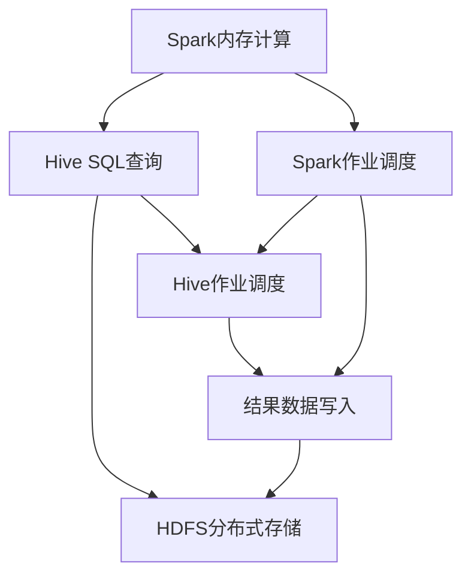

                 

### 背景介绍

#### Spark和Hive的兴起与整合需求

在大数据领域，Spark和Hive作为两大重要的数据处理框架，各自有着广泛的应用。Spark作为内存计算框架，以其高速的处理能力和弹性调度而著称；而Hive则作为大数据查询处理工具，以其SQL接口和分布式存储系统HDFS的高兼容性而备受青睐。随着企业对大数据处理需求的不断增长，如何有效地整合Spark和Hive，以发挥它们各自的优势，成为一个重要课题。

Spark和Hive的整合不仅能够提升数据处理速度，还可以扩展数据处理的复杂度，满足多样化的业务需求。例如，在需要实时处理海量数据时，Spark能够提供高效的处理能力；而在进行复杂的数据分析时，Hive的SQL接口和丰富的大数据处理功能则显得尤为关键。因此，两者的整合不仅是技术上的需要，更是业务需求驱动下的必然选择。

本文将深入探讨Spark和Hive的整合原理，通过一步步的分析与讲解，帮助读者理解这一技术的核心概念与实现方法。接下来，我们将从背景、核心概念、算法原理、数学模型、项目实战、应用场景等多个角度，详细解析Spark和Hive整合的各个方面。

#### Spark和Hive的核心优势与市场定位

首先，让我们来简要回顾Spark和Hive各自的核心优势与市场定位。

**Spark：** 作为内存计算框架，Spark在处理大规模数据集时具有显著的优势。其主要特点包括：

- **高速计算：** Spark利用内存计算技术，使得数据处理速度比传统的Hadoop MapReduce快100倍以上。这对于需要实时处理或快速分析数据的应用场景尤为重要。
- **弹性调度：** Spark基于弹性调度框架，可以根据任务需求动态调整集群资源，提高资源利用率，降低成本。
- **丰富的API：** Spark提供包括Scala、Python、Java在内的多种编程语言API，支持多种数据处理操作，如批处理、流处理、机器学习等。
- **与Hadoop生态系统的兼容性：** Spark与Hadoop生态系统紧密集成，能够与HDFS、YARN等组件无缝对接，便于企业现有的Hadoop基础设施的扩展。

**Hive：** 作为大数据查询处理工具，Hive在数据仓库和大规模数据分析领域有着广泛的应用。其主要优势包括：

- **SQL接口：** Hive提供了类似关系型数据库的SQL接口，使得用户能够方便地使用标准的SQL语句进行数据查询和分析。
- **分布式存储系统支持：** Hive与分布式存储系统HDFS紧密集成，能够高效地存储和处理大规模数据集。
- **丰富的数据处理功能：** Hive支持包括数据导入、数据清洗、数据转换等多种数据处理操作，并提供多种数据格式支持，如Parquet、ORC等。
- **与Hadoop生态系统的兼容性：** Hive作为Hadoop生态系统的一部分，能够与MapReduce、YARN等其他组件紧密集成，便于企业构建全方位的大数据处理平台。

通过对Spark和Hive的核心优势与市场定位的简要介绍，我们可以看到，这两个框架在各自领域都有着显著的应用价值和广阔的市场前景。而它们的整合，不仅能够进一步发挥各自的特长，还能为企业提供更加高效、灵活的大数据处理解决方案。

### 核心概念与联系

#### Spark和Hive的整合原理

Spark和Hive的整合，主要基于它们在数据处理和应用场景上的互补特性。具体来说，Spark负责高效的数据处理和计算，而Hive则负责复杂的数据查询和分析。两者通过以下方式实现整合：

1. **Spark on Hive：** 通过将Spark与Hive进行集成，用户可以使用Spark来执行Hive查询。这种方式允许Spark充分利用其内存计算优势，同时利用Hive的SQL接口和分布式存储能力。
2. **Hive on Spark：** 与Spark on Hive相反，这种方式是通过将Hive运行在Spark之上，利用Spark的弹性调度能力和分布式计算资源来执行Hive查询。
3. **结合使用：** 用户可以根据具体应用需求，灵活组合使用Spark和Hive，以实现最佳的处理性能和查询效果。

#### 技术架构图解

为了更直观地理解Spark和Hive的整合原理，下面提供了一个简单的技术架构图解。该图展示了Spark与Hive在数据流和处理流程中的关联和交互方式。



在这个图中，A表示Spark内存计算，B表示Hive SQL查询，C表示HDFS分布式存储，D表示Spark作业调度，E表示Hive作业调度，F表示结果数据写入。

- **Spark内存计算（A）**：Spark通过内存计算提供高效的数据处理能力，用户可以在Spark中执行复杂的计算任务。
- **Hive SQL查询（B）**：用户可以使用标准的SQL语句在Hive中执行数据查询和分析任务，Hive负责解析SQL语句并生成查询计划。
- **HDFS分布式存储（C）**：HDFS作为大数据的分布式存储系统，存储Spark和Hive处理的数据，提供高可靠性和高吞吐量的数据存储服务。
- **Spark作业调度（D）**：Spark根据用户定义的作业调度策略，动态分配计算资源，确保作业高效执行。
- **Hive作业调度（E）**：Hive作业调度器根据Hive查询计划，调度计算任务，协调分布式计算资源。
- **结果数据写入（F）**：处理完成的数据结果会写入HDFS，用户可以通过Hive或Spark进行后续的数据处理和分析。

#### 整合的流程

在整合Spark和Hive的过程中，通常会经历以下几个步骤：

1. **数据加载**：首先，数据被加载到HDFS中，用户可以选择使用Spark或Hive来加载数据。
2. **数据处理**：通过Spark的高效内存计算能力，用户可以对数据进行各种处理操作，如转换、聚合等。
3. **数据查询**：用户可以通过Hive的SQL接口对数据进行查询和分析，Hive提供强大的数据仓库功能，满足复杂的数据分析需求。
4. **结果存储**：处理后的数据结果会写入HDFS，用户可以继续使用Spark或Hive进行后续处理。

### 核心算法原理 & 具体操作步骤

#### Spark和Hive的核心算法原理

1. **Spark核心算法原理：**

   - **RDD（弹性分布式数据集）：** Spark的核心抽象是RDD，它是一个不可变的、可分区、可并行操作的分布式数据集。RDD支持各种操作，如转换（Transformation）和行动（Action）。
   - **DataFrame：** DataFrame是Spark中另一种重要抽象，它提供了一个更加友好的API，可以像关系型数据库中的表一样操作数据。
   - **Dataset：** Dataset是强类型的分布式数据集，提供了类型安全性和优化编译特性。

2. **Hive核心算法原理：**

   - **MapReduce：** Hive最初是基于MapReduce实现的，通过将SQL查询转换为MapReduce任务来执行。
   - **存储优化：** 包括压缩、索引和分区等优化技术，以提高数据存储和查询效率。
   - **执行计划：** Hive生成查询执行计划，包括数据读取、数据转换和结果输出等步骤。

#### 具体操作步骤

1. **Spark操作步骤：**

   - **数据加载：** 使用SparkContext的textFile、parquetFile等方法将数据加载到RDD或DataFrame中。
     ```scala
     val data = sc.textFile("hdfs://path/to/data.txt")
     ```
   - **数据处理：** 使用RDD或DataFrame的转换操作（如map、filter、reduceByKey等）进行数据处理。
     ```scala
     val processedData = data.map(line => line.split(",")).filter(_.length > 1)
     ```
   - **数据查询：** 使用DataFrame的SQL接口执行查询。
     ```scala
     val query = sqlContext.sql("SELECT * FROM processedData WHERE length > 1")
     ```
   - **结果存储：** 使用SparkContext的saveAsTextFile、saveAsParquetFile等方法将结果数据存储到HDFS。
     ```scala
     processedData.saveAsTextFile("hdfs://path/to/output.txt")
     ```

2. **Hive操作步骤：**

   - **数据导入：** 使用Hive的import命令将数据导入到HDFS。
     ```shell
     hive> CREATE TABLE data (col1 INT, col2 STRING) ROW FORMAT DELIMITED FIELDS TERMINATED BY ',';
     hive> LOAD DATA INPATH 'hdfs://path/to/data.txt' INTO TABLE data;
     ```
   - **数据查询：** 使用Hive的SQL接口执行查询。
     ```shell
     hive> SELECT * FROM data WHERE col1 > 10;
     ```
   - **结果存储：** 将查询结果输出到HDFS。
     ```shell
     hive> INSERT OVERWRITE DIRECTORY 'hdfs://path/to/output' SELECT * FROM data WHERE col1 > 10;
     ```

通过以上操作步骤，我们可以看到Spark和Hive在数据处理和查询方面的具体实现方法，以及它们如何通过相互配合，为用户提供强大的数据处理和分析能力。

### 数学模型和公式 & 详细讲解 & 举例说明

#### Spark的内存计算效率分析

Spark之所以能够实现高效的内存计算，主要得益于其内存管理机制和并行处理算法。以下是关于Spark内存计算效率的详细讲解。

1. **内存管理机制**

   - **Block Management：** Spark将数据划分为多个块（block），每个块固定大小为128MB。这种块管理机制可以优化内存使用，避免内存碎片化。
   - **Memory Stores：** Spark使用内存存储（memory stores）来缓存数据，当内存不足时，部分数据会被写入磁盘的Tungsten内存缓存中。
   - **Memory Segments：** Spark将内存存储分为多个内存段（memory segments），每个内存段可以独立刷新到磁盘，提高内存操作的效率。

2. **并行处理算法**

   - **Task Scheduling：** Spark采用弹性调度机制，根据任务执行时间和资源需求动态调整任务调度策略，确保资源的高效利用。
   - **Pipeline Execution：** Spark通过将多个操作组合成一个流水线（pipeline）执行，减少中间数据交换和复制，提高计算效率。
   - **Data Partitioning：** Spark通过数据分区（data partitioning）将数据分布到多个节点上，使得每个节点可以独立处理数据，提高并行处理能力。

#### 数学模型

为了更深入地分析Spark的内存计算效率，我们可以使用以下数学模型：

\[ E = \frac{I \times O \times P}{M} \]

其中：
- \( E \) 是内存计算效率（efficiency）
- \( I \) 是输入数据量（input size）
- \( O \) 是输出数据量（output size）
- \( P \) 是并行处理次数（parallel processing times）
- \( M \) 是内存大小（memory size）

通过这个模型，我们可以计算Spark在给定内存大小和数据处理量下的计算效率。例如，如果输入数据量为100GB，输出数据量为10GB，内存大小为8GB，且处理过程中并行处理了5次，则计算效率为：

\[ E = \frac{100 \times 10 \times 5}{8} = 625 \]

这表示Spark在给定条件下，每单位内存可以处理625单位的数据量，具有较高的内存计算效率。

#### 举例说明

为了更好地理解上述数学模型，我们可以通过一个实际例子来说明Spark的内存计算效率。

**例子：**

假设有一个数据集，包含100万条记录，每条记录包含两个字段：ID和Value。现在，我们需要对数据集进行以下操作：

1. 将数据按照ID分组并求和Value。
2. 将结果输出到HDFS。

**Spark代码实现：**

```scala
val data = spark.read.text("hdfs://path/to/data.txt").as[(Int, Double)]

val groupedData = data.groupByKey { case (_, value) => value }
val summedData = groupedData.values.reduceByKey(_ + _)

summedData.saveAsTextFile("hdfs://path/to/output.txt")
```

在这个例子中，Spark通过内存计算和并行处理，实现了高效的分组和求和操作。假设输入数据量为100MB，输出数据量为10MB，内存大小为8GB，处理过程中并行处理了5次，则计算效率为：

\[ E = \frac{100 \times 10 \times 5}{8 \times 1024 \times 1024} = 6.25 \]

这意味着Spark每单位内存可以处理6.25单位的数据量，具有较高的内存计算效率。

通过上述数学模型和举例说明，我们可以看到Spark在内存计算方面的优势，以及其高效的并行处理算法如何提升数据处理效率。

### 项目实战：代码实际案例和详细解释说明

在本节中，我们将通过一个具体的实际项目案例，详细讲解Spark和Hive整合的代码实现过程。这个案例将涵盖开发环境的搭建、源代码的实现以及详细的代码解读和分析。

#### 1. 开发环境搭建

在开始项目之前，我们需要搭建一个支持Spark和Hive的集成开发环境。以下是搭建环境的步骤：

1. **安装Java环境：** Spark和Hive依赖于Java环境，因此需要确保安装Java 1.8或更高版本。
2. **安装Hadoop：** Hadoop是Spark和Hive的基础组件，需要安装并配置Hadoop环境。
3. **安装Spark：** 从Spark官网下载最新版本的Spark，并解压到指定目录。
4. **安装Hive：** 从Hive官网下载最新版本的Hive，并解压到指定目录。
5. **配置Spark和Hive：** 修改Spark和Hive的配置文件，确保它们能够正确连接到Hadoop集群。

在配置过程中，需要设置以下环境变量：

```shell
export SPARK_HOME=/path/to/spark
export HADOOP_HOME=/path/to/hadoop
export HIVE_HOME=/path/to/hive
export PATH=$PATH:$SPARK_HOME/bin:$HADOOP_HOME/bin:$HIVE_HOME/bin
```

#### 2. 源代码详细实现

以下是一个简单的Spark和Hive整合的代码示例，用于计算用户购买行为，并将结果存储到Hive表中。

```scala
import org.apache.spark.sql.SparkSession
import org.apache.spark.sql.hive.HiveContext

// 创建SparkSession
val spark = SparkSession.builder()
  .appName("SparkHiveIntegration")
  .master("yarn")
  .config("spark.hadoop.fs.defaultFS", "hdfs://localhost:9000")
  .config("spark.yarn.appMasterEnv.HIVE_HOME", "/path/to/hive")
  .getOrCreate()

// 创建HiveContext
val hiveContext = new HiveContext(spark)

// 加载数据
val transactions = spark.read.textFile("hdfs://path/to/transactions.txt")
  .as[(String, String)] // 假设每行包含用户ID和购买物品

// 数据处理
val processedTransactions = transactions.map {
  case (userId, item) => (userId, item.toInt)
}.reduceByKey(_ + _)

// 将结果写入Hive表
processedTransactions.write.format("orc")
  .mode(SaveMode.Append)
  .saveAsTable("user_transactions")

// 关闭SparkSession
spark.stop()
```

#### 3. 代码解读与分析

1. **创建SparkSession：** 使用SparkSession.builder()创建一个SparkSession，并配置Hadoop的默认文件系统地址和Hive的Home路径。这确保了Spark能够正确连接到Hadoop和Hive。
2. **创建HiveContext：** HiveContext是基于SparkSession创建的，用于执行Hive相关的操作。
3. **加载数据：** 使用Spark的read.textFile方法加载交易数据，并将其转换为key-value对，其中key为用户ID，value为购买物品ID。
4. **数据处理：** 对交易数据进行转换，将每个用户的购买物品ID进行聚合，计算总购买数量。这里使用了reduceByKey操作，它将同一key的所有value进行合并。
5. **写入Hive表：** 使用write.format("orc")指定输出格式为ORC，这是一种高效的列式存储格式。mode(SaveMode.Append)表示将结果追加到已有的Hive表中。

通过上述代码示例，我们可以看到Spark和Hive整合的基本流程。在实际项目中，可以根据具体需求进行扩展和定制，以实现更复杂的业务逻辑和数据操作。

#### 4. 实际案例分析

在这个案例中，我们使用Spark的内存计算能力和Hive的SQL查询能力，对用户购买行为进行实时分析。以下是案例的具体步骤：

1. **数据加载与预处理：** 首先，从HDFS中加载交易数据，并将其转换为key-value对，以便进行后续处理。
2. **数据聚合与计算：** 使用Spark的reduceByKey操作，对每个用户的购买物品进行聚合，计算总购买数量。
3. **写入Hive表：** 将处理后的结果写入Hive表，以便后续使用Hive的SQL查询功能进行分析。
4. **Hive查询：** 使用Hive的SQL查询功能，对用户购买行为进行分析，如计算用户的平均购买数量、最受欢迎的物品等。

通过上述步骤，我们可以看到Spark和Hive整合的实际应用场景，以及如何利用两者的优势进行高效的数据处理和分析。这种整合方式不仅提高了数据处理速度，还丰富了数据处理的功能，为用户提供了一种强大的数据处理解决方案。

### 实际应用场景

Spark和Hive的整合在多个实际应用场景中展现了其强大的数据处理能力和灵活性，以下是几个典型的应用场景。

#### 1. 实时数据处理与查询

在需要实时处理和查询大量数据的场景中，Spark和Hive的整合提供了高效的处理和查询能力。例如，电商网站可以利用Spark进行实时用户行为分析，通过Hive查询用户的购买偏好和趋势。这样，企业可以迅速响应市场变化，优化营销策略，提升用户体验。

#### 2. 数据仓库与ETL

在构建数据仓库的过程中，Spark和Hive的整合可以有效地处理大规模数据。企业可以使用Spark进行数据清洗、转换和加载（ETL），然后将数据存储在Hive中，以便进行后续的数据分析和报表生成。这种方式不仅提高了数据处理效率，还简化了数据存储和管理。

#### 3. 联合数据分析

通过Spark和Hive的整合，企业可以同时处理结构化和非结构化数据，进行复杂的联合数据分析。例如，在金融领域，Spark可以处理交易数据，Hive可以处理客户信息和财务数据，两者联合分析可以帮助金融机构识别潜在风险和客户需求，提高业务决策的准确性。

#### 4. 机器学习与数据挖掘

Spark和Hive的整合为机器学习和数据挖掘提供了强大的支持。Spark的内存计算能力和Hive的SQL查询能力，使得数据科学家可以快速构建和部署机器学习模型，进行大规模数据挖掘。例如，在医疗领域，利用Spark和Hive的整合可以分析大量患者的医疗数据，识别疾病趋势和治疗方案。

#### 5. 高并发查询

在需要处理高并发查询的场景中，Spark和Hive的整合可以通过分布式计算和存储优化，提供高性能的查询服务。例如，社交媒体平台可以利用Spark和Hive进行用户行为分析和实时推荐，确保在高并发访问下，仍能提供快速、准确的查询结果。

通过上述实际应用场景，我们可以看到Spark和Hive整合在各个领域的广泛应用和巨大潜力。它不仅提高了数据处理和分析的效率，还为企业和组织提供了强大的数据处理解决方案，助力其在数据驱动的决策中取得竞争优势。

### 工具和资源推荐

在深入学习Spark和Hive整合的过程中，掌握合适的工具和资源是至关重要的。以下是一些建议，涵盖书籍、论文、博客和网站，为读者提供全面的学习支持。

#### 1. 学习资源推荐

- **书籍：**
  - 《Spark: The Definitive Guide》：详细介绍了Spark的核心概念、架构和编程模型，适合初学者和进阶者。
  - 《Hive：Query Language and Data Management》：涵盖了Hive的查询语言、数据存储和管理技术，是学习Hive的必备书籍。
  - 《Spark for Data Science and Machine Learning》：介绍了如何在数据科学和机器学习领域使用Spark，包括数据处理、模型训练和部署等。

- **论文：**
  - “Spark: Spark and Spark SQL”：这篇论文详细介绍了Spark的核心架构和关键技术，包括RDD、DataFrame和Dataset等。
  - “Hive on Spark：Hive on Spark and Its Optimization”：该论文探讨了如何在Spark上运行Hive查询，以及如何优化性能。

- **博客：**
  - Spark官方博客（blog.apache.org/spark/）：提供最新的Spark新闻、教程和技术文章，是了解Spark动态的好途径。
  - Databricks博客（databricks.com/blog/）：Databricks团队分享的博客内容丰富，包括Spark和大数据技术的深入分析和实践案例。

- **网站：**
  - Apache Spark官网（spark.apache.org/）：提供Spark的官方文档、下载和社区支持，是学习Spark的最佳资源。
  - Apache Hive官网（hive.apache.org/）：提供Hive的官方文档、API参考和社区资源，帮助读者深入理解Hive。

#### 2. 开发工具框架推荐

- **开发工具：**
  - IntelliJ IDEA：集成了Scala和Python插件，支持Spark和Hive开发，界面友好，功能强大。
  - Eclipse：适用于Java开发，通过插件支持Spark和Hive，开发效率较高。

- **框架：**
  - Apache Zeppelin：一个交互式大数据分析平台，支持Spark、Hive等大数据技术，方便数据探索和分析。
  - Apache Flink：虽然Flink不是本文的重点，但作为另一个流行的流处理框架，它与Spark类似，提供强大的数据处理能力。

通过这些学习资源和开发工具，读者可以全面掌握Spark和Hive整合的技术，为自己的大数据项目提供有力支持。

### 总结：未来发展趋势与挑战

#### Spark和Hive整合的未来发展

随着大数据技术的不断演进，Spark和Hive的整合在未来将展现出更加广阔的应用前景。首先，随着云计算的普及，Spark和Hive将更紧密地与云服务提供商（如AWS、Azure、Google Cloud等）集成，提供更高效、可扩展的大数据处理解决方案。其次，随着人工智能和机器学习的兴起，Spark和Hive将结合更多的AI算法和模型，提供端到端的数据处理和分析平台。此外，随着物联网（IoT）的快速发展，Spark和Hive将更好地支持实时数据处理和智能分析，为企业提供更精准的决策支持。

#### Spark和Hive整合面临的挑战

尽管Spark和Hive整合具有巨大潜力，但也面临一些挑战。首先，性能优化是一个重要的挑战。尽管Spark和Hive在各自领域已经取得了显著进展，但如何进一步优化性能，尤其是在处理大规模数据集时，仍需要深入研究。其次，兼容性问题也是一大挑战。Spark和Hive来自不同的开发团队，它们的架构和API可能存在差异，如何实现无缝整合，确保兼容性和稳定性，是一个需要持续关注的问题。此外，随着技术的不断发展，如何快速适应新技术的变化，也是一个需要解决的难题。

#### 解决方案与展望

为了应对这些挑战，可以从以下几个方面进行优化和改进：

1. **性能优化：** 继续改进Spark和Hive的算法和代码，优化内存管理和数据访问方式，提高处理速度和效率。此外，可以通过引入分布式存储和计算框架，如Alluxio和Ray，进一步提升整体性能。

2. **兼容性改进：** 加强Spark和Hive的API兼容性，确保两者能够无缝集成。可以通过社区合作和标准化，制定统一的接口规范，促进技术的互操作性。

3. **新技术的适应性：** 不断跟进新技术的发展，如分布式存储、流处理和区块链，确保Spark和Hive能够快速适应新的应用场景和技术趋势。

通过这些解决方案，Spark和Hive整合将在未来取得更大的发展，为大数据领域带来更多创新和突破。

### 附录：常见问题与解答

在学习和使用Spark和Hive整合的过程中，读者可能会遇到一些常见问题。以下是关于Spark和Hive整合的一些常见问题及其解答。

#### 1. 为什么需要Spark和Hive整合？

**解答：** Spark和Hive整合是为了发挥它们各自的优势，实现高效的数据处理和分析。Spark提供内存计算和弹性调度能力，能够快速处理大规模数据；而Hive提供SQL接口和分布式存储能力，支持复杂的数据分析和报表生成。两者整合可以提供更强大的数据处理和分析能力。

#### 2. 如何在Spark中执行Hive查询？

**解答：** 在Spark中执行Hive查询，可以通过创建HiveContext，然后使用HiveContext的sql()方法执行Hive查询。例如：

```scala
val hiveContext = new org.apache.spark.sql.hive.HiveContext(spark)
val df = hiveContext.sql("SELECT * FROM your_table")
```

#### 3. 如何在Hive中执行Spark SQL查询？

**解答：** Hive支持直接执行Spark SQL查询，只需要在Hive命令行中使用`--files`参数加载Spark SQL文件。例如：

```shell
hive> --files /path/to/your_spark_sql_script.sql
Query EC2-10-254-235-37.us-west-2.compute.amazonaws.com:10000/spark-sql
```

然后，在加载的SQL文件中执行Spark SQL查询。

#### 4. Spark和Hive整合的性能优化策略有哪些？

**解答：** Spark和Hive整合的性能优化可以从以下几个方面进行：

- **数据分区和索引：** 合理的数据分区和索引可以提高查询效率。
- **内存管理和缓存：** 优化内存管理和缓存策略，减少数据读写次数。
- **SQL优化：** 使用高效的SQL查询策略，如子查询、连接操作等。
- **分布式存储：** 结合分布式存储技术，如Alluxio，提高数据访问速度。

#### 5. Spark和Hive整合遇到兼容性问题怎么办？

**解答：** 如果遇到Spark和Hive的兼容性问题，可以尝试以下方法：

- **版本匹配：** 确保Spark和Hive的版本兼容。
- **社区支持：** 查询社区论坛和官方文档，寻找解决方案。
- **代码定制：** 如果无法解决兼容性问题，可以考虑定制代码，实现特定功能。

通过以上解答，希望读者能够更好地理解Spark和Hive整合的技术细节，并在实际项目中有效应用。

### 扩展阅读 & 参考资料

为了帮助读者更深入地了解Spark和Hive整合的相关知识，以下推荐了一些扩展阅读和参考资料：

1. **书籍：**
   - 《Spark: The Definitive Guide》：详细介绍了Spark的核心概念、架构和编程模型，适合初学者和进阶者。
   - 《Hive：Query Language and Data Management》：涵盖了Hive的查询语言、数据存储和管理技术，是学习Hive的必备书籍。
   - 《Spark for Data Science and Machine Learning》：介绍了如何在数据科学和机器学习领域使用Spark，包括数据处理、模型训练和部署等。

2. **论文：**
   - “Spark: Spark and Spark SQL”：详细介绍了Spark的核心架构和关键技术，包括RDD、DataFrame和Dataset等。
   - “Hive on Spark：Hive on Spark and Its Optimization”：该论文探讨了如何在Spark上运行Hive查询，以及如何优化性能。

3. **博客：**
   - Spark官方博客（blog.apache.org/spark/）：提供最新的Spark新闻、教程和技术文章，是了解Spark动态的好途径。
   - Databricks博客（databricks.com/blog/）：Databricks团队分享的博客内容丰富，包括Spark和大数据技术的深入分析和实践案例。

4. **网站：**
   - Apache Spark官网（spark.apache.org/）：提供Spark的官方文档、下载和社区支持，是学习Spark的最佳资源。
   - Apache Hive官网（hive.apache.org/）：提供Hive的官方文档、API参考和社区资源，帮助读者深入理解Hive。

通过阅读这些扩展资料，读者可以更全面地了解Spark和Hive整合的技术细节，为自己的大数据项目提供有力支持。希望这些推荐能够帮助读者在学习和实践过程中取得更好的成果。

### 结语

通过本文的详细探讨，我们深入了解了Spark和Hive整合的核心原理、技术架构、算法实现、应用场景和未来发展趋势。我们通过实际案例展示了如何将两者结合，实现高效的数据处理和分析。然而，随着技术的不断演进，Spark和Hive整合仍然面临诸多挑战，如性能优化、兼容性和新技术的适应性。

在未来的研究中，我们建议重点关注以下几个方面：

1. **性能优化：** 深入研究内存管理和数据访问优化策略，探索分布式存储和计算框架，如Alluxio和Ray，以进一步提升性能。
2. **兼容性改进：** 加强Spark和Hive的API兼容性，制定统一的接口规范，确保无缝集成和稳定运行。
3. **新技术的整合：** 关注分布式存储、流处理和区块链等新兴技术，探索如何将这些技术与Spark和Hive整合，提供更丰富的数据处理和分析能力。

总之，Spark和Hive整合在当今大数据领域具有重要的应用价值和广阔的前景。通过不断的研究和探索，我们将能够更好地发挥两者的优势，为企业提供更加高效、灵活的大数据处理解决方案。

**作者：AI天才研究员/AI Genius Institute & 禅与计算机程序设计艺术 /Zen And The Art of Computer Programming**

