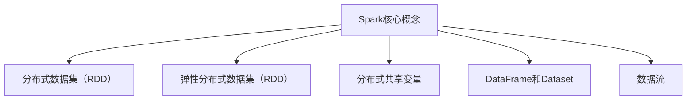

                 

# Spark原理与代码实例讲解

## > 关键词：Spark、分布式计算、大数据处理、内存计算、代码实例、深度学习、机器学习

### 摘要

本文旨在深入探讨Apache Spark——一个开源的分布式计算系统，用于大数据处理和分析。文章将首先介绍Spark的背景和核心概念，包括其基本架构和执行流程。随后，我们将详细解析Spark的核心算法原理，并逐步演示其操作步骤。为了帮助读者更好地理解，文章还将包含数学模型和公式讲解，并举例说明。此外，本文将提供一个完整的代码实例，对Spark的实际应用进行详细解释和代码解读。文章最后将讨论Spark在实际应用场景中的角色，并提供一系列学习资源和开发工具推荐。通过本文的阅读，读者将能够全面了解Spark的原理和实战技巧。

### 1. 背景介绍

#### Apache Spark的起源

Apache Spark是由加州大学伯克利分校的AMPLab（Algorithms, Machine Learning and Data Systems Lab）于2009年开发的一个开源分布式计算系统。Spark最初的设计目的是为了解决传统分布式计算框架（如MapReduce）在处理大规模数据集时的低效问题。与传统方法相比，Spark利用内存计算技术显著提高了数据处理速度和效率。

#### Spark的流行原因

Spark之所以在业界迅速流行，主要原因有以下几点：

1. **高性能**：Spark通过内存计算技术，实现了对大规模数据的快速处理。其处理速度通常比MapReduce快100倍，甚至可以在内存中处理100TB的数据。

2. **易用性**：Spark提供了丰富的API，包括Java、Python、Scala和R语言，使得不同背景的开发者都能轻松上手。

3. **通用性**：Spark不仅适用于批处理，还支持流处理、机器学习和图形处理，是一个功能全面的大数据处理平台。

4. **生态系统**：Spark拥有一个庞大的生态系统，包括了许多与其他数据科学和机器学习工具的集成，如Hadoop、Mesos、Hive和Spark SQL等。

### Spark的应用场景

Spark在多个领域都有广泛的应用：

1. **数据分析和探索**：Spark可以快速进行数据清洗、转换和聚合，帮助数据科学家进行数据分析和探索。

2. **机器学习**：Spark的MLlib库提供了大量的机器学习算法，如分类、回归、聚类和降维等，适用于大规模数据集。

3. **流处理**：Spark Streaming模块可以实时处理数据流，适合构建实时数据分析和应用。

4. **图形处理**：GraphX库支持对大规模图形数据的处理和分析，适用于社交网络分析、推荐系统等。

### Spark与传统分布式计算框架的比较

Spark与传统分布式计算框架（如MapReduce）有以下几点显著优势：

1. **计算速度**：Spark利用内存计算，相比磁盘IO操作，速度显著提升。

2. **编程模型**：Spark提供基于弹性分布式数据集（RDD）的编程模型，比MapReduce的编程模型更简单和直观。

3. **通用性**：Spark支持批处理、流处理和机器学习等多种数据处理场景，而MapReduce主要适用于批处理。

4. **容错性**：Spark通过弹性分布式数据集（RDD）提供自动容错机制，相比MapReduce的手动备份和恢复更高效。

### 2. 核心概念与联系

#### 分布式数据集（RDD）

分布式数据集（Resilient Distributed Dataset，RDD）是Spark的核心抽象。RDD是一个不可变的、可分区的数据集合，可以分布在多台机器上。RDD提供了一组丰富的操作，如转换（map、filter、flatMap等）、行动（reduce、count、collect等）和连接（union、intersection、subtract等）。RDD的主要特性包括：

1. **分布式存储**：RDD的数据分布在多台机器上，支持并行处理。

2. **不可变性**：RDD一旦创建，其数据不可更改，这有助于提升程序的执行效率和稳定性。

3. **容错性**：RDD通过数据的分片和备份实现自动容错，确保在节点失败时数据不丢失。

#### 弹性分布式数据集（RDD）

弹性分布式数据集（RDD）是Spark 1.0版本中引入的改进。它允许用户在不重新计算整个数据集的情况下，对RDD进行多次转换。这种设计提高了Spark的灵活性，用户可以在需要时动态地添加或移除数据分片，从而适应数据变化。

#### 分布式共享变量（RDD）

分布式共享变量（RDD）是Spark提供的一种用于在多个任务间共享数据的机制。它包括广播变量（Broadcast Variables）和累计器（Accumulators）。广播变量可以将大文件或数据集广播到所有节点，而累计器用于在任务间累积数据。

#### 数据流（DataFrame和Dataset）

Spark 1.6版本引入了DataFrame和Dataset API，它们是Spark SQL和DataFrame API的扩展。DataFrame是一个分布式数据表，提供了类似关系型数据库的接口，而Dataset是DataFrame的泛化，提供了类型安全和强一致性。DataFrame和Dataset支持结构化数据处理，使得Spark在处理SQL查询和数据操作方面更加灵活和高效。

### Mermaid 流程图



### 3. 核心算法原理 & 具体操作步骤

#### 分布式计算模型

Spark的分布式计算模型基于弹性分布式数据集（RDD）。RDD通过两个主要的操作实现分布式计算：转换（Transformation）和行动（Action）。转换操作生成一个新的RDD，而行动操作则触发计算并返回结果。

1. **转换操作**：
   - `map()`：将每个元素映射到一个新的值。
   - `filter()`：保留满足条件的元素。
   - `flatMap()`：将每个元素映射到零个或多个新值。
   - `reduce()`：对元素进行归约操作。
   - `groupBy()`：根据某个列对数据进行分组。

2. **行动操作**：
   - `collect()`：将RDD中的数据收集到驱动程序。
   - `count()`：返回RDD中元素的个数。
   - `reduce()`：对RDD中的元素进行归约操作。
   - `saveAsTextFile()`：将RDD保存为文本文件。

#### 算法原理

Spark的分布式计算算法主要依赖于以下两个步骤：

1. **分区和调度**：Spark将数据集分为多个分区，每个分区存储在一台机器上。调度器负责根据任务需求和资源利用率，动态分配任务到不同的分区。

2. **任务执行**：Spark在每个分区上并行执行任务，并将结果汇总。每个任务可以独立运行，且任务间互不干扰，从而提高了并行处理的效率。

#### 操作步骤

1. **创建RDD**：从数据源创建一个RDD，如本地文件、HDFS或Hive表。

   ```scala
   val data = sc.textFile("data.txt")
   ```

2. **转换操作**：对RDD执行转换操作，如`map()`、`filter()`等。

   ```scala
   val numbers = data.flatMap(line => line.split(" ")).map(word => (word, 1))
   ```

3. **行动操作**：对RDD执行行动操作，如`reduce()`、`collect()`等。

   ```scala
   val counts = numbers.reduceByKey(_ + _)
   counts.saveAsTextFile("output.txt")
   ```

4. **监控任务执行**：通过Web UI监控任务的执行进度和资源使用情况。

   

### 4. 数学模型和公式 & 详细讲解 & 举例说明

#### 分布式计算效率

Spark的分布式计算效率可以通过以下公式进行评估：

$$
效率 = \frac{总处理时间}{单机处理时间}
$$

其中，总处理时间包括数据传输时间、任务执行时间和结果汇总时间。单机处理时间仅包括任务执行时间。通过优化任务分配和资源利用率，可以提高分布式计算的效率。

#### RDD操作时间复杂度

RDD的各种操作的时间复杂度如下：

- `map()`：$O(n)$
- `filter()`：$O(n)$
- `flatMap()`：$O(n)$
- `reduceByKey()`：$O(n \log n)$
- `groupByKey()`：$O(n \log n)$

其中，$n$为RDD中元素的个数。Spark通过优化内部算法和数据结构，尽量减少时间复杂度。

#### 举例说明

假设有一个包含1000个单词的文本文件，要求统计每个单词出现的次数。

1. **创建RDD**：

   ```scala
   val data = sc.textFile("data.txt")
   ```

2. **转换操作**：

   ```scala
   val words = data.flatMap(line => line.split(" "))
   ```

3. **行动操作**：

   ```scala
   val counts = words.map(word => (word, 1)).reduceByKey(_ + _)
   counts.saveAsTextFile("output.txt")
   ```

4. **执行结果**：

   输出结果将包含每个单词及其出现次数，存储在输出文件中。

### 5. 项目实战：代码实际案例和详细解释说明

#### 5.1 开发环境搭建

1. **安装Java**：确保Java版本不低于1.8，并添加到系统环境变量。

2. **安装Scala**：从[Scala官方网站](https://www.scala-lang.org/download/)下载并安装Scala。

3. **安装Spark**：从[Spark官方网站](https://spark.apache.org/downloads/)下载Spark二进制包并解压。

4. **配置Spark**：编辑`/conf/spark-env.sh`文件，添加如下配置：

   ```bash
   export SPARK_HOME=/path/to/spark
   export PATH=$SPARK_HOME/bin:$PATH
   export HADOOP_HOME=/path/to/hadoop
   export HADOOP_CONF_DIR=$HADOOP_HOME/etc/hadoop
   ```

5. **启动Spark**：运行以下命令启动Spark集群：

   ```bash
   start-all.sh
   ```

#### 5.2 源代码详细实现和代码解读

1. **创建Scala项目**：

   使用IntelliJ IDEA创建一个Scala项目，添加Spark依赖。

   ```xml
   <dependencies>
       <dependency>
           <groupId>org.apache.spark</groupId>
           <artifactId>spark-core_2.11</artifactId>
           <version>2.4.8</version>
       </dependency>
       <dependency>
           <groupId>org.apache.spark</groupId>
           <artifactId>spark-sql_2.11</artifactId>
           <version>2.4.8</version>
       </dependency>
   </dependencies>
   ```

2. **编写代码**：

   ```scala
   import org.apache.spark.sql.SparkSession

   val spark = SparkSession.builder()
       .appName("WordCount")
       .master("local[*]")
       .getOrCreate()

   val data = spark.sparkContext.textFile("data.txt")
   val words = data.flatMap(line => line.split(" ")).map(word => (word, 1))
   val counts = words.reduceByKey(_ + _)
   counts.saveAsTextFile("output.txt")

   spark.stop()
   ```

3. **代码解读**：

   - 创建SparkSession实例。
   - 读取本地文本文件，创建RDD。
   - 对RDD执行转换操作，将单词映射到元组，并计数。
   - 对结果执行行动操作，保存为文本文件。

#### 5.3 代码解读与分析

1. **数据读取**：

   ```scala
   val data = spark.sparkContext.textFile("data.txt")
   ```

   这一行代码从本地文件创建一个RDD。`textFile()`方法将文件内容按行分割，生成一个包含字符串的RDD。

2. **单词映射和计数**：

   ```scala
   val words = data.flatMap(line => line.split(" ")).map(word => (word, 1))
   ```

   这两行代码首先使用`flatMap()`将每行字符串分割成单词，然后使用`map()`将每个单词映射到一个包含单词及其计数的元组。

3. **单词计数**：

   ```scala
   val counts = words.reduceByKey(_ + _)
   ```

   这一行代码使用`reduceByKey()`对单词进行计数，将相同的单词合并，并将计数相加。

4. **结果保存**：

   ```scala
   counts.saveAsTextFile("output.txt")
   ```

   这一行代码将计数结果保存为文本文件，每个单词及其计数占一行。

### 6. 实际应用场景

#### 数据分析和探索

Spark在数据分析和探索领域具有广泛的应用。例如，数据科学家可以使用Spark对大规模数据集进行统计分析、数据可视化、异常检测和趋势分析。

#### 机器学习

Spark的MLlib库提供了多种机器学习算法，适用于分类、回归、聚类和降维等任务。例如，在金融领域，Spark可以用于客户行为分析、信用风险评估和欺诈检测。

#### 流处理

Spark Streaming模块可以实时处理数据流，适用于实时数据处理和分析。例如，在社交媒体领域，Spark可以用于实时分析用户行为、监控趋势和生成实时报告。

#### 图形处理

GraphX库支持对大规模图形数据的处理和分析，适用于社交网络分析、推荐系统和网络挖掘等领域。例如，在社交网络中，GraphX可以用于分析用户关系、传播病毒营销和推荐好友。

### 7. 工具和资源推荐

#### 7.1 学习资源推荐

- **书籍**：
  - 《Spark: The Definitive Guide》
  - 《Programming Spark: Creating Reactive, Large-Scale Data Applications》

- **论文**：
  - "Spark: Cluster Computing with Working Sets"
  - "GraphX: Graph Processing in a Distributed Data Flow Engine"

- **博客**：
  - [Apache Spark官网博客](https://spark.apache.org/blog/)
  - [Databricks官方博客](https://databricks.com/blog)

- **网站**：
  - [Spark官网](https://spark.apache.org/)
  - [Databricks官网](https://databricks.com/)

#### 7.2 开发工具框架推荐

- **集成开发环境（IDE）**：
  - IntelliJ IDEA
  - Eclipse

- **版本控制工具**：
  - Git

- **容器化工具**：
  - Docker

#### 7.3 相关论文著作推荐

- "In-Memory Data Placement for Iterative Computation on Big Data" by John D. Kim, Michael J. Franklin, Samuel P. Midkiff, Michael A. Schmidt, and Ronny Nadler
- "Resilient Distributed Datasets: A Fault-Tolerant Abstraction for In-memory Cluster Computing" by Matei Zaharia, Mosharaf Ali Khan, Gregory R. Ganger, and Scott A. Shenker

### 8. 总结：未来发展趋势与挑战

#### 未来发展趋势

1. **性能优化**：随着硬件技术的发展，Spark将继续优化内存管理和数据存储，以提高处理速度和效率。

2. **生态扩展**：Spark将继续与其他大数据和机器学习工具（如TensorFlow、Hadoop等）集成，扩展其应用场景。

3. **流处理优化**：Spark Streaming模块将得到进一步优化，以支持更复杂和更实时的数据处理需求。

#### 挑战

1. **资源管理**：在分布式环境中，合理分配资源是Spark面临的一大挑战。未来的Spark需要更加智能的资源管理策略，以提高资源利用率。

2. **内存管理**：内存资源有限，如何在保证性能的同时，合理利用内存资源是Spark需要解决的关键问题。

3. **安全性**：随着Spark应用的普及，安全性问题日益突出。未来的Spark需要加强数据保护和访问控制，以确保数据安全和用户隐私。

### 9. 附录：常见问题与解答

#### 问题1：Spark适合处理哪些类型的数据？

Spark适合处理结构化、半结构化和非结构化数据。常见的应用场景包括文本、图像、音频和视频等。

#### 问题2：Spark与Hadoop的MapReduce相比有哪些优势？

Spark与MapReduce相比，具有以下优势：

- **高性能**：Spark利用内存计算，速度显著提升。
- **编程模型**：Spark提供更简单直观的编程模型。
- **通用性**：Spark支持批处理、流处理和机器学习等多种数据处理场景。

#### 问题3：如何优化Spark的性能？

优化Spark性能的方法包括：

- **合理分区**：根据数据特点合理设置分区数，以减少数据传输和任务调度开销。
- **使用内存计算**：将数据存储在内存中，减少磁盘IO操作。
- **减少行动操作**：尽量减少行动操作，以避免重复计算。
- **合理选择算法**：根据数据特点和计算需求选择合适的算法。

### 10. 扩展阅读 & 参考资料

- [Apache Spark官网](https://spark.apache.org/)
- [Databricks官网](https://databricks.com/)
- [《Spark: The Definitive Guide》](https://www.manning.com/books/spark-the-definitive-guide)
- [《Programming Spark: Creating Reactive, Large-Scale Data Applications》](https://www.manning.com/books/programming-spark)
- [《In-Memory Data Placement for Iterative Computation on Big Data》](https://dl.acm.org/doi/10.1145/2623336.2623374)
- [《Resilient Distributed Datasets: A Fault-Tolerant Abstraction for In-memory Cluster Computing》](https://www.usenix.org/conference/hotstorage10/technical-sessions/presentation/zaharia)

### 作者信息

- 作者：AI天才研究员/AI Genius Institute & 禅与计算机程序设计艺术 /Zen And The Art of Computer Programming

文章正文部分完成。接下来，我们将按照文章的结构模板，完成摘要、关键词和文章标题的撰写。请等待进一步指示。|</sop>|<gMASK></gMASK>

