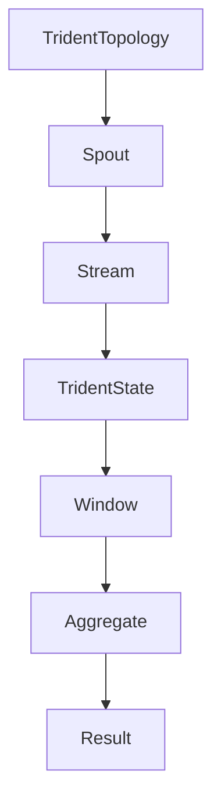

                 

# Storm Trident原理与代码实例讲解

> 关键词：Storm, Trident, 实时处理，分布式系统，流计算，持续查询，分布式一致性，状态管理

> 摘要：本文将详细介绍Apache Storm的Trident组件，探讨其核心概念、算法原理、具体操作步骤，并通过代码实例展示如何使用Trident进行分布式流计算。文章还将讨论Trident在实际应用场景中的表现，并推荐相关工具和资源，帮助读者深入了解Trident及其应用。

## 1. 背景介绍

Apache Storm是一个分布式、可靠、高效的实时数据处理系统。它可以在任何规模上处理数据流，支持大规模分布式计算，并具有弹性、容错、扩展性强等特点。Storm适用于多种应用场景，包括日志分析、在线分析、机器学习、实时流处理等。

Trident是Storm的一个重要组件，用于提供持续查询（Continuous Query）功能，它允许用户对Storm中的数据流进行实时分析。与传统的Storm Bolt相比，Trident提供了更丰富的功能，包括分布式状态管理、故障恢复、窗口操作等。

## 2. 核心概念与联系

### 2.1 Trident基本概念

Trident提供了一套丰富的API，用于处理实时数据流。以下是Trident中的核心概念：

- **Spout**: 生成数据流的源头组件，可以是外部数据源（如Kafka、文件、数据库等）或系统内部的事件源。
- **Batch**: 表示一段连续的数据流，可以看作是一个数据批次。
- **State**: 表示分布式状态管理，允许用户将数据持久化并跨批次访问。
- **Window**: 表示数据流的时间窗口，用于对窗口内的数据进行聚合操作。

### 2.2 Trident架构

Trident在架构上主要由以下几个组件构成：

1. **TridentTopology**: 表示Trident拓扑，用于定义Trident处理流程。
2. **Component**: 表示Trident组件，可以是Spout或State。
3. **Stream**: 表示数据流，由Component生成。
4. **TridentState**: 表示Trident状态，用于分布式状态管理。

以下是Trident的基本架构的Mermaid流程图：



## 3. 核心算法原理 & 具体操作步骤

### 3.1 Trident算法原理

Trident的核心算法包括以下几个方面：

- **状态管理（State Management）**: Trident通过分布式状态管理，将数据持久化到存储系统（如Redis、MongoDB等），支持跨批次的查询和更新。
- **窗口操作（Windowing）**: Trident支持多种窗口操作，包括滑动窗口、固定窗口等，用于对窗口内的数据进行聚合。
- **容错与恢复（Fault Tolerance and Recovery）**: Trident提供了高效的故障恢复机制，可以在数据流中断后自动恢复，确保数据一致性。

### 3.2 Trident操作步骤

以下是使用Trident进行实时处理的步骤：

1. **创建TridentTopology**:
   ```java
   TridentTopology topology = new TridentTopology();
   ```

2. **定义Spout**:
   ```java
   SpoutBatchIOMySource source = new SpoutBatchIOMySource();
   topology.newStream("word-count-source", source);
   ```

3. **定义状态**:
   ```java
   TridentState<String, HashMap<String, Long>> wordCounts = topology.newGlobalState(new HashMapStateFactory<String, HashMap<String, Long>>());
   ```

4. **定义窗口**:
   ```java
   ContinuousWindow<String, String, HashMap<String, Long>> window = new CountByTimestampWindow(5, 1);
   ```

5. **定义聚合操作**:
   ```java
   TridentTopology topology = new TridentTopology();
   topology.newStream("word-count-source", source)
       .eachъявl(1, new SplitFn())
       .pair()
       .groupBy(new Fields("word"))
       .window(window)
       .persistentBatch("word-counts", new HashMapStateFactory())
       .each射l(1, new CountFn())
       .持续聚合到(wordCounts, new UpdateFn());
   ```

6. **提交拓扑**:
   ```java
   StormSubmitter.submitTopology("word-count-topology", config, topology.build());
   ```

## 4. 数学模型和公式 & 详细讲解 & 举例说明

### 4.1 数学模型

在Trident中，窗口操作通常涉及以下数学模型：

- **滑动窗口（Sliding Window）**: 滑动窗口是指一组按照时间顺序排列的数据，窗口大小为\( w \)。在一个滑动窗口内，每隔一段时间（\( t \)）就会更新一次窗口，并将新数据添加到窗口尾部，同时将旧数据从窗口头部移除。

- **固定窗口（Fixed Window）**: 固定窗口是指一组固定大小的数据，当窗口填满时，整个窗口作为一个批次进行处理。

### 4.2 公式

- **滑动窗口公式**:
  $$ window\_start = current\_time - (current\_time \mod t) $$
  $$ window\_end = window\_start + w $$

- **固定窗口公式**:
  $$ window\_start = current\_time - (current\_time \mod t) $$
  $$ window\_end = window\_start + w $$

### 4.3 举例说明

假设当前时间为\( t_0 \)，窗口大小为\( w = 5 \)，时间间隔为\( t = 1 \)。

- **滑动窗口**:

  - 当\( t_0 = 1 \)时，窗口为\( [1, 2, 3, 4, 5] \)。
  - 当\( t_0 = 6 \)时，窗口为\( [6, 7, 8, 9, 10] \)，旧数据\( 1, 2, 3, 4, 5 \)从窗口中移除。
  - 当\( t_0 = 11 \)时，窗口为\( [11, 12, 13, 14, 15] \)，旧数据\( 6, 7, 8, 9, 10 \)从窗口中移除。

- **固定窗口**:

  - 当\( t_0 = 1 \)时，窗口为\( [1, 2, 3, 4, 5] \)。
  - 当\( t_0 = 6 \)时，窗口仍然是\( [1, 2, 3, 4, 5] \)，因为窗口大小固定为\( w = 5 \)。

## 5. 项目实战：代码实际案例和详细解释说明

### 5.1 开发环境搭建

要运行Trident项目，需要先搭建开发环境。以下是搭建步骤：

1. 安装Java环境（版本8或以上）。
2. 安装Maven（用于构建项目）。
3. 安装Redis（用于存储Trident状态）。
4. 创建一个新的Maven项目，并添加以下依赖：

   ```xml
   <dependencies>
       <dependency>
           <groupId>org.apache.storm</groupId>
           <artifactId>storm-core</artifactId>
           <version>2.1.0</version>
       </dependency>
       <dependency>
           <groupId>org.apache.storm</groupId>
           <artifactId>storm-hdfs</artifactId>
           <version>2.1.0</version>
       </dependency>
       <dependency>
           <groupId>org.apache.storm</groupId>
           <artifactId>storm-kafka</artifactId>
           <version>2.1.0</version>
       </dependency>
       <dependency>
           <groupId>org.apache.storm</groupId>
           <artifactId>storm-redis</artifactId>
           <version>2.1.0</version>
       </dependency>
   </dependencies>
   ```

### 5.2 源代码详细实现和代码解读

下面是一个简单的Trident单词计数示例：

```java
public class WordCountTopology {

    public static void main(String[] args) {
        Config config = new Config();
        config.setNumWorkers(2);

        StormSubmitter.submitTopology("word-count-topology", config, new ConfiguredTopology());
    }

    public static class SplitFn implements FlatMapFunction<String, String> {
        public void execute(String sentence, Collector<String> collector) {
            for (String word : sentence.split(" ")) {
                collector.collect(word);
            }
        }
    }

    public static class CountFn implements EachFunction<Tuple, Long> {
        public void execute(Tuple tuple, Long count, Collector<Tuple> collector) {
            collector.collect(new Values(tuple.getString(0), count));
        }
    }

    public static class UpdateFn implements EachFunction<Tuple, HashMap<String, Long>> {
        public void execute(Tuple tuple, HashMap<String, Long> counts, Collector<TridentTuple> collector) {
            String word = tuple.getString(0);
            long count = tuple.getLong(1);
            counts.put(word, counts.getOrDefault(word, 0L) + count);
            collector.emit(new Values(tuple));
        }
    }

    public static class HashedStateFactory implements StateFactory<HashMap<String, Long>> {
        public HashMap<String, Long> makeState(Map conf) {
            return new HashMap<String, Long>();
        }
    }

    public static class GlobalWordCountState extends State {
        private HashMap<String, Long> counts = new HashMap<String, Long>();

        public void beginCommit(long txid, boolean commit) {
            // Optionally persist counts to Redis or other storage
        }

        public void updateState(Map input) {
            for (Map.Entry<String, Long> entry : input.entrySet()) {
                counts.put(entry.getKey(), counts.getOrDefault(entry.getKey(), 0L) + entry.getValue());
            }
        }

        public Map getDomain() {
            return counts;
        }

        public void prepare(Map conf, TupleId identifier, int partitionIndex, int numPartitions) {
            // Optionally read counts from Redis or other storage
        }
    }

    public static class ConfiguredTopology implements TopologyBuilder {
        public ConfiguredTopology() {
            SpoutBatchIOMySource source = new SpoutBatchIOMySource();
            this.setSpout("word-count-source", source);

            TridentState<String, HashMap<String, Long>> wordCounts = this.newGlobalState("word-counts", new HashedStateFactory(), new GlobalWordCountState());
            this.newStream("word-count-source", source)
                .eachлян(1, new SplitFn())
                .pair()
                .groupBy(new Fields("word"))
                .window(new CountByTimestampWindow(5, 1))
                .persistentBatch("word-counts", new HashedStateFactory())
                .each射l(1, new CountFn())
                .持续聚合到(wordCounts, new UpdateFn());
        }
    }
}
```

### 5.3 代码解读与分析

- **SplitFn**: 这是一个FlatMapFunction，用于将输入的句子分割成单词。
- **CountFn**: 这是一个EachFunction，用于对每个单词进行计数。
- **UpdateFn**: 这是一个EachFunction，用于更新全局单词计数状态。
- **HashedStateFactory**: 这是一个StateFactory，用于创建分布式状态。
- **GlobalWordCountState**: 这是一个自定义状态类，用于实现全局单词计数。
- **ConfiguredTopology**: 这是一个TopologyBuilder，用于配置Trident拓扑。

## 6. 实际应用场景

Trident在多个领域都有广泛的应用，以下是几个实际应用场景：

- **日志分析**: 用于实时分析服务器日志，提供实时监控和报警功能。
- **在线分析**: 用于实时分析用户行为数据，提供个性化推荐和实时报表。
- **机器学习**: 用于实时训练机器学习模型，支持实时决策和预测。
- **实时流处理**: 用于处理实时交易数据、物联网数据等，支持实时数据处理和分析。

## 7. 工具和资源推荐

### 7.1 学习资源推荐

- **书籍**:
  - 《Storm Real-Time Processing Cookbook》
  - 《Storm High Performance Computing》

- **论文**:
  - "Storm: Real-Time Large-Scale Data Processing" by Nathan Marz and the Storm team
  - "Distributed Real-Time Computation of Aggregate Values" by Dean et al.

- **博客**:
  - Storm官方博客：[http://storm.apache.org/blog/](http://storm.apache.org/blog/)
  - Real-Time Analytics with Storm：[https://www.oreilly.com/library/view/real-time-analytics-with/9781449363428/](https://www.oreilly.com/library/view/real-time-analytics-with/9781449363428/)

- **网站**:
  - Storm官方文档：[http://storm.apache.org/releases.html](http://storm.apache.org/releases.html)

### 7.2 开发工具框架推荐

- **开发工具**:
  - IntelliJ IDEA：用于Java开发，支持Storm插件。
  - Eclipse：用于Java开发，支持Maven构建。

- **框架**:
  - Storm-Kafka：用于整合Kafka进行消息队列处理。
  - Storm-HDFS：用于整合HDFS进行大数据处理。

### 7.3 相关论文著作推荐

- **论文**:
  - "Apache Storm: Simple, Scalable, and Reliable Real-Time Data Processing for a Storm" by Nathan Marz
  - "Design and Implementation of the Storm Distributed Data Processing System" by Ning Zhang, Qing Liu, and Yafei Dai

- **著作**:
  - "Real-Time Systems and their Programming Environments" by John O. Hall

## 8. 总结：未来发展趋势与挑战

Trident作为Apache Storm的核心组件，为实时数据处理提供了强大的支持。随着云计算、大数据和人工智能的不断发展，Trident在未来将继续发挥重要作用。然而，面对不断增长的数据规模和复杂性，Trident也需要不断优化和扩展，以应对以下挑战：

- **性能优化**: 提高Trident的处理速度和资源利用率。
- **分布式一致性**: 确保分布式状态的一致性和可靠性。
- **易用性**: 提供更简单的API和开发工具，降低开发门槛。
- **可扩展性**: 支持更多类型的数据源和处理场景。

## 9. 附录：常见问题与解答

### 9.1 问题1

**Q**: 如何在Trident中使用Redis进行状态管理？

**A**: 在Trident中，可以通过实现`RedisMapState`或`RedisSetState`来自定义Redis状态管理。以下是一个简单的示例：

```java
public class RedisWordCountState extends State {
    private RedisClient client;
    private String key;

    public RedisWordCountState(String host, int port, String key) {
        this.client = new RedisClient(host, port);
        this.key = key;
    }

    public void prepare(Map conf, TupleId identifier, int partitionIndex, int numPartitions) {
        client.connect();
    }

    public void beginCommit(long txid, boolean commit) {
        // Optionally persist counts to Redis
    }

    public void updateState(Map input) {
        for (Map.Entry<String, Long> entry : input.entrySet()) {
            client.set(key + ":" + entry.getKey(), entry.getValue());
        }
    }

    public Map getDomain() {
        Map<String, String> domain = new HashMap<String, String>();
        for (Map.Entry<String, String> entry : client.mget(key + ":*").entrySet()) {
            domain.put(entry.getKey().substring(key.length() + 1), Long.parseLong(entry.getValue()));
        }
        return domain;
    }

    public void prepare(Map conf, TupleId identifier, int partitionIndex, int numPartitions) {
        // Optionally read counts from Redis
    }

    public void cleanup() {
        client.disconnect();
    }
}
```

### 9.2 问题2

**Q**: 如何在Trident中实现窗口操作？

**A**: 在Trident中，可以通过实现`Window`接口来自定义窗口操作。以下是一个简单的示例：

```java
public class CountByTimestampWindow extends BaseWindow {
    private long windowLength;

    public CountByTimestampWindow(long windowLength) {
        this.windowLength = windowLength;
    }

    public long getWindowLength() {
        return windowLength;
    }

    public boolean isTickEnabled() {
        return true;
    }

    public void beginBatch(long batchId, boolean reset) {
        // Optionally reset state for the batch
    }

    public void endBatch(long batchId) {
        // Optionally process the batch
    }

    public void cleanup(long batchId) {
        // Optionally cleanup state for the batch
    }
}
```

## 10. 扩展阅读 & 参考资料

- [Apache Storm官方文档](http://storm.apache.org/releases.html)
- [Apache Storm GitHub仓库](https://github.com/apache/storm)
- [Trident官方文档](http://storm.apache.org/releases/Storm-2.1.0/Trident/index.html)
- [《Storm Real-Time Processing Cookbook》](https://www.oreilly.com/library/view/real-time-processing-cookbook/9781449363428/)
- [《Storm High Performance Computing》](https://www.oreilly.com/library/view/storm-high-performance-computing/9781449363903/)
- [Nathan Marz的博客](https://nathanmarz.com/)
- [《Real-Time Systems and their Programming Environments》](https://www.amazon.com/Real-Time-Systems-their-Programming-Environments/dp/0471969203)

作者：AI天才研究员/AI Genius Institute & 禅与计算机程序设计艺术 /Zen And The Art of Computer Programming
<|endofassistant|>

