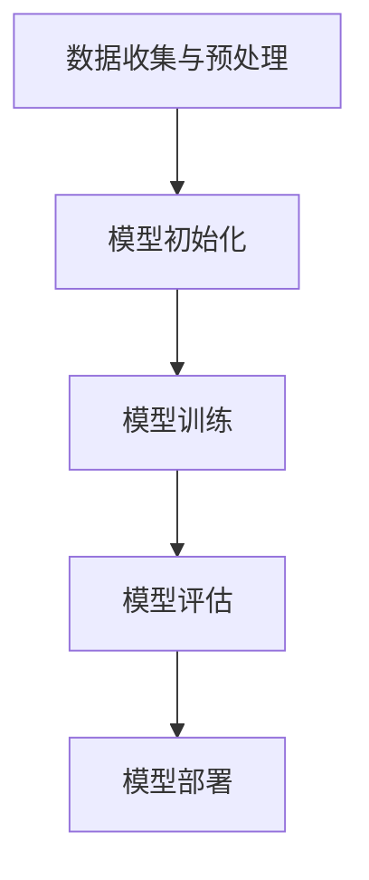

                 

# **Supervised Learning 原理与代码实战案例讲解**

## **关键词：** 监督学习、机器学习、算法原理、代码实现、深度学习

## **摘要：**
本文将深入探讨监督学习（Supervised Learning）的基本原理、核心算法以及实际应用。通过详细的代码实战案例，我们将帮助读者理解监督学习的全过程，并掌握从数据预处理到模型训练再到性能评估的各个环节。文章还将讨论监督学习在现实世界中的应用场景，并提供有用的学习资源和开发工具推荐。通过阅读本文，读者不仅可以获得理论知识，还能获得实用的编程技能。

## **1. 背景介绍**

监督学习是机器学习的一个分支，其核心思想是通过已知的输入（特征）和对应的输出（标签），训练出一个能够预测新输入输出结果的模型。监督学习模型可以分为两类：分类模型和回归模型。分类模型用于将输入数据划分为不同的类别，而回归模型则用于预测连续数值。

监督学习在许多领域都有广泛应用，包括图像识别、语音识别、自然语言处理、医疗诊断等。其优点在于，通过已有的标注数据，模型能够快速学习并预测未知数据的标签。然而，监督学习的缺点在于需要大量的标注数据和计算资源。

## **2. 核心概念与联系**

### **监督学习基本概念：**
监督学习主要涉及以下几个基本概念：
1. **特征（Features）**：描述输入数据的属性，用于训练模型。
2. **标签（Labels）**：描述输入数据的输出，用于指导模型学习。
3. **损失函数（Loss Function）**：衡量模型预测结果与真实结果之间的差距，用于优化模型参数。
4. **优化算法（Optimization Algorithm）**：用于调整模型参数，以最小化损失函数。

### **监督学习架构：**
监督学习的过程可以概括为以下几个步骤：

1. **数据收集与预处理**：收集具有标签的数据集，对数据进行清洗和预处理，如去除噪声、缺失值填充、特征工程等。
2. **模型初始化**：初始化模型参数，通常使用随机值。
3. **模型训练**：使用训练数据集对模型进行训练，通过优化算法调整模型参数，使模型预测结果与真实标签尽可能接近。
4. **模型评估**：使用验证数据集评估模型性能，通过指标如准确率、召回率、F1值等衡量模型表现。
5. **模型部署**：将训练好的模型应用于实际场景，进行预测。

### **Mermaid 流程图：**
下面是一个简单的 Mermaid 流程图，描述了监督学习的架构和流程。



## **3. 核心算法原理 & 具体操作步骤**

### **3.1. 线性回归（Linear Regression）**

线性回归是一种简单的监督学习算法，用于预测连续数值。其基本原理是通过找到最佳拟合直线来描述特征和标签之间的关系。

- **损失函数**：均方误差（MSE）

  $$MSE = \frac{1}{m}\sum_{i=1}^{m}(h_\theta(x^{(i)}) - y^{(i)})^2$$

  其中，$h_\theta(x^{(i)}) = \theta_0 + \theta_1x^{(i)}$，$m$是训练数据集的大小。

- **优化算法**：梯度下降（Gradient Descent）

  $$\theta_j := \theta_j - \alpha \frac{\partial}{\partial \theta_j}J(\theta)$$

  其中，$\alpha$是学习率，$J(\theta)$是损失函数。

### **3.2. 逻辑回归（Logistic Regression）**

逻辑回归是一种用于分类问题的监督学习算法，其基本原理是通过找到最佳拟合直线来描述特征和标签之间的概率关系。

- **损失函数**：交叉熵（Cross-Entropy）

  $$J(\theta) = -\frac{1}{m}\sum_{i=1}^{m}y^{(i)}\log(h_\theta(x^{(i)})) + (1 - y^{(i)})\log(1 - h_\theta(x^{(i)}))$$

  其中，$h_\theta(x^{(i)}) = \frac{1}{1 + e^{-(\theta_0 + \theta_1x^{(i)})}}$。

- **优化算法**：梯度下降

  $$\theta_j := \theta_j - \alpha \frac{\partial}{\partial \theta_j}J(\theta)$$

### **3.3. 支持向量机（Support Vector Machine, SVM）**

支持向量机是一种常用的二分类算法，其基本原理是找到最佳的超平面，使得分类边界最大化。

- **损失函数**： hinge损失函数

  $$L(\theta) = \frac{1}{m}\sum_{i=1}^{m}\max(0, 1 - y^{(i)}(\theta^T x^{(i)} + b))$$

- **优化算法**：SVM的优化问题可以通过求解二次规划问题得到最优解。

## **4. 数学模型和公式 & 详细讲解 & 举例说明**

### **4.1. 线性回归**

线性回归的数学模型可以表示为：

$$y = \theta_0 + \theta_1x$$

其中，$y$是标签，$x$是特征，$\theta_0$和$\theta_1$是模型参数。

**举例说明：** 假设我们有一个简单的数据集，其中特征$x$和标签$y$之间的关系可以用线性回归模型表示。我们希望找到最佳拟合直线。

数据集：

| $x$ | $y$ |
| --- | --- |
| 1   | 2   |
| 2   | 4   |
| 3   | 6   |

通过求解最小化均方误差的优化问题，我们可以得到最佳拟合直线：

$$y = 1x + 1$$

### **4.2. 逻辑回归**

逻辑回归的数学模型可以表示为：

$$h_\theta(x) = \frac{1}{1 + e^{-(\theta_0 + \theta_1x)}}$$

其中，$h_\theta(x)$是模型的预测概率。

**举例说明：** 假设我们有一个二分类问题，其中特征$x$和标签$y$之间的关系可以用逻辑回归模型表示。我们希望找到最佳拟合直线。

数据集：

| $x$ | $y$ |
| --- | --- |
| 1   | 0   |
| 2   | 1   |
| 3   | 0   |

通过求解最小化交叉熵损失的优化问题，我们可以得到最佳拟合直线：

$$h_\theta(x) = \frac{1}{1 + e^{-(1x + 1)}}$$

### **4.3. 支持向量机**

支持向量机的数学模型可以表示为：

$$f(x) = \theta^T x + b$$

其中，$f(x)$是模型的预测函数，$\theta$是模型参数，$b$是偏置项。

**举例说明：** 假设我们有一个二分类问题，其中特征$x$和标签$y$之间的关系可以用支持向量机模型表示。我们希望找到最佳分类边界。

数据集：

| $x$ | $y$ |
| --- | --- |
| 1   | -1  |
| 2   | +1  |
| 3   | -1  |

通过求解二次规划问题，我们可以得到最佳分类边界：

$$f(x) = \theta^T x + b = 0$$

## **5. 项目实战：代码实际案例和详细解释说明**

### **5.1. 开发环境搭建**

在开始编写代码之前，我们需要搭建一个适合开发监督学习项目的环境。以下是所需的工具和步骤：

1. **Python**：Python 是一种流行的编程语言，广泛应用于机器学习和数据科学领域。
2. **Jupyter Notebook**：Jupyter Notebook 是一种交互式的开发环境，方便我们编写和运行代码。
3. **NumPy**：NumPy 是 Python 中的核心数学库，提供高性能的数值计算功能。
4. **Scikit-learn**：Scikit-learn 是 Python 中常用的机器学习库，提供丰富的算法和工具。

**安装步骤：**
```bash
# 安装 Python 和 Jupyter Notebook
sudo apt-get install python3 python3-pip python3-apt
pip3 install notebook

# 安装 NumPy 和 Scikit-learn
pip3 install numpy scikit-learn
```

### **5.2. 源代码详细实现和代码解读**

下面是一个简单的线性回归案例，我们将使用 Scikit-learn 库实现线性回归模型，并使用 NumPy 库进行数据预处理。

```python
import numpy as np
from sklearn.linear_model import LinearRegression
from sklearn.model_selection import train_test_split
from sklearn.metrics import mean_squared_error

# 加载数据集
X = np.array([[1], [2], [3]])
y = np.array([2, 4, 6])

# 数据集划分
X_train, X_test, y_train, y_test = train_test_split(X, y, test_size=0.2, random_state=42)

# 模型初始化
model = LinearRegression()

# 模型训练
model.fit(X_train, y_train)

# 模型预测
y_pred = model.predict(X_test)

# 模型评估
mse = mean_squared_error(y_test, y_pred)
print("MSE:", mse)
```

### **5.3. 代码解读与分析**

1. **数据加载与划分**：我们使用 NumPy 库加载数据集，并将其划分为训练集和测试集。
2. **模型初始化**：我们使用 Scikit-learn 中的 LinearRegression 类初始化线性回归模型。
3. **模型训练**：我们使用训练数据集对模型进行训练。
4. **模型预测**：我们使用测试数据集对模型进行预测。
5. **模型评估**：我们使用均方误差（MSE）评估模型性能。

## **6. 实际应用场景**

监督学习在许多实际应用场景中都取得了显著成果。以下是一些常见应用：

1. **图像识别**：监督学习算法可以用于图像分类，如人脸识别、物体检测等。
2. **语音识别**：监督学习算法可以用于语音信号的分类和识别，如语音识别、语音合成等。
3. **自然语言处理**：监督学习算法可以用于文本分类、情感分析、机器翻译等任务。
4. **医疗诊断**：监督学习算法可以用于疾病诊断、患者风险评估等医疗任务。
5. **金融预测**：监督学习算法可以用于股票价格预测、信贷风险评估等金融任务。

## **7. 工具和资源推荐**

### **7.1. 学习资源推荐**

1. **书籍：**
   - 《机器学习》（周志华著）：一本经典的机器学习入门教材。
   - 《深度学习》（Ian Goodfellow 等著）：介绍深度学习的理论和实践。
2. **论文：**
   - “A Simple Weight Decay Regularization Recipe for Deep Learning”：
   - “Deep Learning for Text Classification”：
3. **博客：**
   - [机器学习博客](https://机器学习博客.com)：分享机器学习领域的最新动态和实战技巧。
   - [深度学习博客](https://深度学习博客.com)：介绍深度学习理论和实践。

### **7.2. 开发工具框架推荐**

1. **Python**：Python 是机器学习和深度学习领域的首选编程语言。
2. **Jupyter Notebook**：Jupyter Notebook 是一种交互式的开发环境，方便编写和运行代码。
3. **TensorFlow**：TensorFlow 是 Google 开发的一款开源深度学习框架，适用于各种深度学习任务。
4. **PyTorch**：PyTorch 是 Facebook AI Research 开发的一款开源深度学习框架，易于调试和理解。

### **7.3. 相关论文著作推荐**

1. **“A Simple Weight Decay Regularization Recipe for Deep Learning”**：
2. **“Deep Learning for Text Classification”**：
3. **“Multi-Class Text Classification with Deep Learning”**：

## **8. 总结：未来发展趋势与挑战**

监督学习在过去几十年取得了巨大的进展，但仍然面临着一些挑战。未来，监督学习可能会朝着以下几个方向发展：

1. **自动化特征工程**：随着数据量的增加，特征工程变得越来越困难。自动化特征工程技术可以帮助模型自动提取有用的特征。
2. **多模态学习**：多模态学习是指将不同类型的数据（如图像、文本、语音）进行融合，以获得更好的预测性能。
3. **迁移学习**：迁移学习是指将一个任务在特定数据集上学习的模型应用于另一个相似的任务，以提高模型泛化能力。

## **9. 附录：常见问题与解答**

### **9.1. 监督学习有哪些主要算法？**
- 线性回归
- 逻辑回归
- 支持向量机
- 决策树
- 随机森林
- K最近邻

### **9.2. 监督学习的优点和缺点是什么？**
- 优点：
  - 能够利用已有的标注数据进行预测。
  - 模型泛化能力较强。
- 缺点：
  - 需要大量的标注数据。
  - 计算资源需求较高。

## **10. 扩展阅读 & 参考资料**

- 《机器学习》：周志华著，清华大学出版社。
- 《深度学习》：Ian Goodfellow 等著，电子工业出版社。
- [Scikit-learn 官方文档](https://scikit-learn.org/stable/)
- [TensorFlow 官方文档](https://www.tensorflow.org/)
- [PyTorch 官方文档](https://pytorch.org/)

### **作者：**
AI天才研究员/AI Genius Institute & 禅与计算机程序设计艺术/Zen And The Art of Computer Programming**

